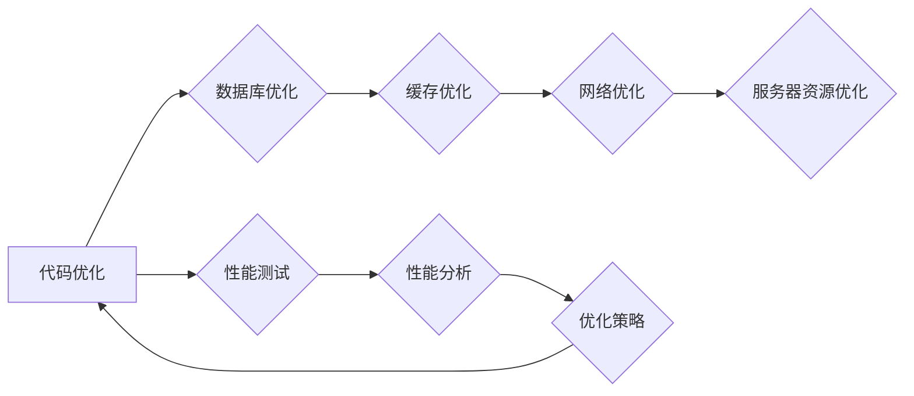

                 

## Spring Boot应用性能优化

> 关键词：Spring Boot,性能优化,微服务,缓存,数据库,负载均衡,监控,性能测试

### 1. 背景介绍

随着互联网技术的飞速发展，企业对应用性能的需求越来越高。用户对应用的响应速度、稳定性和可用性要求越来越严格。Spring Boot作为一款轻量级、快速开发的Java框架，在企业应用开发中得到了广泛应用。然而，在实际应用中，Spring Boot应用的性能也可能存在瓶颈，需要进行优化才能满足用户需求。

本篇文章将深入探讨Spring Boot应用性能优化的关键技术和实践方法，帮助开发者构建高性能、稳定可靠的应用。

### 2. 核心概念与联系

**2.1 性能优化目标**

Spring Boot应用性能优化的目标是提高应用的响应速度、吞吐量、资源利用率和稳定性。

**2.2 性能瓶颈分析**

常见的Spring Boot应用性能瓶颈包括：

* **数据库性能:** 数据库查询效率低下、数据量过大、连接池配置不当等。
* **网络传输:** 网络带宽不足、网络延迟高、数据传输量大等。
* **代码逻辑:** 代码冗余、算法效率低、数据结构不合理等。
* **服务器资源:** CPU、内存、磁盘I/O等资源不足或配置不当。

**2.3 性能优化策略**

Spring Boot应用性能优化的策略主要包括：

* **代码优化:** 优化代码逻辑、算法效率、数据结构等。
* **数据库优化:** 优化数据库查询语句、索引策略、连接池配置等。
* **缓存优化:** 利用缓存技术减少数据库访问次数、提高数据访问速度。
* **网络优化:** 优化网络传输协议、数据压缩、负载均衡等。
* **服务器资源优化:** 优化服务器配置、资源分配、进程管理等。

**2.4 性能优化工具**

常用的Spring Boot应用性能优化工具包括：

* **JProfiler:** Java应用性能分析工具。
* **VisualVM:** Java虚拟机性能分析工具。
* **Spring Boot Actuator:** Spring Boot内置的监控和管理工具。
* **Prometheus:** 开源监控和报警系统。
* **Grafana:** 数据可视化工具。

**2.5 Mermaid 流程图**



### 3. 核心算法原理 & 具体操作步骤

**3.1 算法原理概述**

本节将介绍几种常用的Spring Boot应用性能优化算法，包括：

* **数据库索引优化:** 利用索引加速数据库查询速度。
* **缓存策略优化:** 选择合适的缓存策略，例如LRU、FIFO等，提高缓存命中率。
* **代码性能分析:** 使用性能分析工具，识别代码性能瓶颈，进行优化。

**3.2 算法步骤详解**

**3.2.1 数据库索引优化**

1. **分析查询语句:** 找出频繁执行的查询语句，并分析其查询条件。
2. **选择合适的索引:** 根据查询条件选择合适的索引类型，例如B-tree索引、全文索引等。
3. **创建索引:** 在数据库中创建索引。
4. **测试和评估:** 测试索引的性能，并根据实际情况进行调整。

**3.2.2 缓存策略优化**

1. **选择合适的缓存策略:** 根据应用场景选择合适的缓存策略，例如LRU、FIFO等。
2. **配置缓存参数:** 配置缓存大小、过期时间等参数。
3. **测试和评估:** 测试缓存的性能，并根据实际情况进行调整。

**3.2.3 代码性能分析**

1. **使用性能分析工具:** 使用JProfiler、VisualVM等工具分析代码性能。
2. **识别性能瓶颈:** 找出代码性能瓶颈，例如循环语句、数据库访问等。
3. **优化代码逻辑:** 优化代码逻辑，提高算法效率。

**3.3 算法优缺点**

**3.3.1 数据库索引优化**

* **优点:** 可以显著提高数据库查询速度。
* **缺点:** 创建索引需要消耗空间和时间，可能会降低数据更新速度。

**3.3.2 缓存策略优化**

* **优点:** 可以减少数据库访问次数，提高数据访问速度。
* **缺点:** 需要维护缓存数据，可能会增加系统复杂度。

**3.3.3 代码性能分析**

* **优点:** 可以识别代码性能瓶颈，进行针对性的优化。
* **缺点:** 需要一定的专业知识和经验。

**3.4 算法应用领域**

* **数据库索引优化:** 应用于所有需要频繁查询数据的应用场景。
* **缓存策略优化:** 应用于需要频繁访问数据的应用场景，例如电商平台、社交网络等。
* **代码性能分析:** 应用于所有需要提高性能的应用场景。

### 4. 数学模型和公式 & 详细讲解 & 举例说明

**4.1 数学模型构建**

**4.1.1 数据库查询时间模型**

假设数据库查询时间T与数据量D和索引效率I成反比，可以表示为：

$$T = \frac{D}{I}$$

其中：

* T: 数据库查询时间
* D: 数据量
* I: 索引效率

**4.1.2 缓存命中率模型**

缓存命中率H与缓存大小C和数据访问频率F成正比，可以表示为：

$$H = \frac{C}{F}$$

其中：

* H: 缓存命中率
* C: 缓存大小
* F: 数据访问频率

**4.2 公式推导过程**

**4.2.1 数据库查询时间模型推导**

假设没有索引，数据库需要扫描整个数据表，查询时间与数据量成正比。

当使用索引后，数据库可以快速定位数据，查询时间与数据量和索引效率的比值成反比。

**4.2.2 缓存命中率模型推导**

缓存命中率表示缓存中能够找到所需数据的比例。

当缓存大小C足够大，能够存储大部分数据时，缓存命中率H较高。

当数据访问频率F较高时，缓存命中率H较低。

**4.3 案例分析与讲解**

**4.3.1 数据库查询时间优化案例**

假设一个电商平台的商品数据量为100万条，没有索引时，查询商品信息需要花费1秒钟。

当使用商品ID索引后，查询商品信息只需要花费0.1秒钟。

**4.3.2 缓存命中率优化案例**

假设一个社交网络平台的用户数据量为1000万条，缓存大小为100万条。

当用户访问频率为1000次/秒时，缓存命中率为90%。

当用户访问频率为10000次/秒时，缓存命中率为50%。

### 5. 项目实践：代码实例和详细解释说明

**5.1 开发环境搭建**

* JDK 11 或以上版本
* Maven 或 Gradle 构建工具
* Spring Boot 2.x 版本

**5.2 源代码详细实现**

```java
@SpringBootApplication
public class SpringBootPerformanceOptimizationApplication {

    public static void main(String[] args) {
        SpringApplication.run(SpringBootPerformanceOptimizationApplication.class, args);
    }

}
```

**5.3 代码解读与分析**

* `@SpringBootApplication` 注解启用Spring Boot自动配置、组件扫描和嵌入式Web服务器。

**5.4 运行结果展示**

运行上述代码，启动Spring Boot应用。

### 6. 实际应用场景

**6.1 电商平台**

电商平台需要处理大量的商品数据、订单数据和用户数据，性能优化至关重要。

**6.2 社交网络**

社交网络平台需要处理大量的用户数据、消息数据和好友关系数据，性能优化可以提高用户体验。

**6.3 金融系统**

金融系统需要处理大量的交易数据和用户数据，性能优化可以确保系统稳定性和安全性。

**6.4 未来应用展望**

随着云计算、大数据和人工智能技术的快速发展，Spring Boot应用性能优化将变得更加重要。

未来，性能优化将更加注重自动化、智能化和可扩展性。

### 7. 工具和资源推荐

**7.1 学习资源推荐**

* Spring Boot官方文档: https://spring.io/projects/spring-boot
* Spring Boot性能优化指南: https://spring.io/projects/spring-boot#performance

**7.2 开发工具推荐**

* JProfiler: https://www.ej-technologies.com/products/jprofiler/
* VisualVM: https://visualvm.github.io/

**7.3 相关论文推荐**

* Spring Boot性能优化研究
* 基于微服务的Spring Boot应用性能分析与优化

### 8. 总结：未来发展趋势与挑战

**8.1 研究成果总结**

本篇文章介绍了Spring Boot应用性能优化的关键技术和实践方法，包括数据库优化、缓存优化、代码性能分析等。

**8.2 未来发展趋势**

* 自动化性能优化
* 智能化性能优化
* 可扩展性性能优化

**8.3 面临的挑战**

* 复杂应用场景
* 性能指标多样化
* 技术迭代快速

**8.4 研究展望**

未来，将继续研究Spring Boot应用性能优化的新技术和方法，以帮助开发者构建高性能、稳定可靠的应用。

### 9. 附录：常见问题与解答

**9.1 如何选择合适的数据库索引？**

选择合适的数据库索引需要根据查询条件和数据量进行分析。

**9.2 如何配置缓存策略？**

缓存策略的配置需要根据应用场景和数据访问频率进行调整。

**9.3 如何使用性能分析工具？**

性能分析工具的使用需要一定的专业知识和经验。

作者：禅与计算机程序设计艺术 / Zen and the Art of Computer Programming


<end_of_turn>

