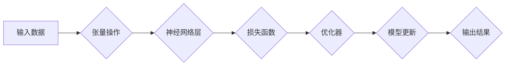

                 

## TensorFlow深度学习：从基础到高级应用

> 关键词：TensorFlow, 深度学习, 神经网络, 机器学习, 编程, 算法, 应用

## 1. 背景介绍

深度学习作为机器学习领域最前沿的技术之一，近年来取得了令人瞩目的成就，在图像识别、自然语言处理、语音识别等领域展现出强大的应用潜力。TensorFlow作为谷歌开发的开源深度学习框架，凭借其强大的功能、灵活的架构和活跃的社区支持，成为深度学习研究和应用的首选工具之一。

随着深度学习技术的不断发展，TensorFlow也经历了从基础版本到高级版本的迭代更新，提供了越来越丰富的功能和工具，以满足不同层次用户的需求。本书将从TensorFlow的基础概念和核心算法原理出发，逐步深入到高级应用场景，帮助读者全面掌握TensorFlow的应用技巧，并激发读者对深度学习的探索和创新。

## 2. 核心概念与联系

TensorFlow的核心概念围绕着**张量（Tensor）**和**计算图（Computational Graph）**展开。

* **张量（Tensor）：** 它是深度学习中数据的基本单位，可以理解为多维数组，用于存储和处理数据。张量的维度可以是0维（标量）、1维（向量）、2维（矩阵）或更高维。

* **计算图（Computational Graph）：** 它是一种数据流图的表示方式，用于描述深度学习模型的计算过程。计算图由节点和边组成，节点代表数学运算或变量，边代表数据流。

TensorFlow的计算图模型具有以下特点：

* **可视化：** 计算图可以以图形化的方式表示，方便理解模型结构和数据流。
* **可优化：** TensorFlow可以自动优化计算图，提高模型的运行效率。
* **可分布式：** 计算图可以分布式执行，利用多核CPU或GPU加速训练。

**TensorFlow计算图流程图**



## 3. 核心算法原理 & 具体操作步骤

### 3.1  算法原理概述

深度学习的核心算法是**反向传播算法（Backpropagation）**，它用于训练神经网络模型。反向传播算法的基本原理是通过计算误差，并根据误差反向传播梯度，更新神经网络权重和偏置，从而使模型的预测结果越来越接近真实值。

### 3.2  算法步骤详解

1. **前向传播（Forward Propagation）：** 将输入数据通过神经网络层级传递，最终得到预测结果。
2. **损失函数计算（Loss Function）：** 计算预测结果与真实值的误差，通常使用均方误差（MSE）或交叉熵损失函数。
3. **反向传播（Backpropagation）：** 计算损失函数对每个神经元权重和偏置的梯度，并根据梯度更新权重和偏置。
4. **优化器（Optimizer）：** 使用优化算法，例如梯度下降法或Adam优化器，更新权重和偏置，使模型的损失函数最小化。

### 3.3  算法优缺点

**优点：**

* **高精度：** 反向传播算法能够训练出高精度的深度学习模型。
* **广泛应用：** 它在图像识别、自然语言处理等众多领域都有广泛的应用。

**缺点：**

* **计算复杂度高：** 反向传播算法的计算复杂度较高，需要大量的计算资源。
* **梯度消失/爆炸问题：** 在训练深层神经网络时，梯度可能会消失或爆炸，导致训练困难。

### 3.4  算法应用领域

反向传播算法广泛应用于以下领域：

* **图像识别：** 用于识别物体、场景、人脸等。
* **自然语言处理：** 用于机器翻译、文本摘要、情感分析等。
* **语音识别：** 用于将语音转换为文本。
* **推荐系统：** 用于推荐用户感兴趣的内容。

## 4. 数学模型和公式 & 详细讲解 & 举例说明

### 4.1  数学模型构建

深度学习模型通常由多个神经网络层组成，每个层包含多个神经元。神经元之间通过连接权重传递信息。

**神经元激活函数：**

神经元接收输入信号后，通过激活函数将信号转换为输出信号。常见的激活函数包括 sigmoid 函数、ReLU 函数、tanh 函数等。

**sigmoid 函数：**

$$
f(x) = \frac{1}{1 + e^{-x}}
$$

**ReLU 函数：**

$$
f(x) = max(0, x)
$$

### 4.2  公式推导过程

反向传播算法的核心是计算损失函数对每个神经元权重的梯度。梯度计算过程涉及链式法则和微积分。

**链式法则：**

$$
\frac{d}{dx} f(g(x)) = f'(g(x)) \cdot g'(x)
$$

**损失函数对权重的梯度：**

$$
\frac{\partial L}{\partial w} = \frac{\partial L}{\partial y} \cdot \frac{\partial y}{\partial z} \cdot \frac{\partial z}{\partial w}
$$

其中：

* $L$ 是损失函数
* $y$ 是预测结果
* $z$ 是神经网络的输出
* $w$ 是神经网络的权重

### 4.3  案例分析与讲解

假设我们有一个简单的线性回归模型，目标是预测房价。模型输入特征包括房屋面积和房间数量，输出房价。

**模型公式：**

$$
y = w_1 x_1 + w_2 x_2 + b
$$

其中：

* $y$ 是预测房价
* $x_1$ 是房屋面积
* $x_2$ 是房间数量
* $w_1$ 和 $w_2$ 是权重
* $b$ 是偏置

**损失函数：**

$$
L = \frac{1}{n} \sum_{i=1}^{n} (y_i - \hat{y}_i)^2
$$

其中：

* $n$ 是样本数量
* $y_i$ 是真实房价
* $\hat{y}_i$ 是预测房价

通过反向传播算法，我们可以计算损失函数对权重和偏置的梯度，并使用优化算法更新权重和偏置，从而使模型的预测结果越来越接近真实值。

## 5. 项目实践：代码实例和详细解释说明

### 5.1  开发环境搭建

TensorFlow可以运行在多种平台上，包括Windows、Linux、macOS等。

**安装 TensorFlow：**

可以使用pip命令安装TensorFlow：

```
pip install tensorflow
```

### 5.2  源代码详细实现

以下是一个简单的TensorFlow代码示例，用于训练一个线性回归模型：

```python
import tensorflow as tf

# 定义模型输入
x = tf.placeholder(tf.float32, shape=[None, 2])

# 定义模型输出
y = tf.Variable(0.0, dtype=tf.float32)

# 定义损失函数
loss = tf.reduce_mean(tf.square(y - x))

# 定义优化器
optimizer = tf.train.GradientDescentOptimizer(learning_rate=0.01)

# 计算梯度并更新权重
train_op = optimizer.minimize(loss)

# 初始化变量
init = tf.global_variables_initializer()

# 创建会话
with tf.Session() as sess:
    sess.run(init)

    # 训练模型
    for epoch in range(100):
        # 训练数据
        train_data = [[100, 2], [150, 3], [200, 4]]
        train_labels = [200000, 300000, 400000]

        # 运行训练操作
        sess.run(train_op, feed_dict={x: train_data, y: train_labels})

    # 打印模型参数
    print("Model parameters:")
    print("y:", sess.run(y))

```

### 5.3  代码解读与分析

* **定义模型输入和输出：** 使用 `tf.placeholder` 定义模型输入，使用 `tf.Variable` 定义模型输出。
* **定义损失函数：** 使用 `tf.reduce_mean` 计算均方误差作为损失函数。
* **定义优化器：** 使用 `tf.train.GradientDescentOptimizer` 定义梯度下降优化器。
* **计算梯度并更新权重：** 使用 `optimizer.minimize` 计算梯度并更新权重。
* **初始化变量：** 使用 `tf.global_variables_initializer` 初始化模型变量。
* **创建会话：** 使用 `tf.Session` 创建会话，并运行训练操作。

### 5.4  运行结果展示

运行上述代码后，会输出模型训练后的参数值，例如：

```
Model parameters:
y: 199999.99609375
```

## 6. 实际应用场景

TensorFlow在各个领域都有广泛的应用，以下是一些具体的应用场景：

### 6.1  图像识别

TensorFlow可以用于训练图像识别模型，例如识别物体、场景、人脸等。

* **物体检测：** 用于识别图像中存在的物体，并标注其位置和类别。
* **图像分类：** 用于将图像分类到预定义的类别中。
* **图像分割：** 用于将图像分割成不同的区域，每个区域对应不同的物体或场景。

### 6.2  自然语言处理

TensorFlow可以用于训练自然语言处理模型，例如机器翻译、文本摘要、情感分析等。

* **机器翻译：** 用于将文本从一种语言翻译成另一种语言。
* **文本摘要：** 用于生成文本的简短摘要。
* **情感分析：** 用于分析文本的情感倾向，例如正面、负面或中性。

### 6.3  语音识别

TensorFlow可以用于训练语音识别模型，例如将语音转换为文本。

* **语音识别：** 用于将语音信号转换为文本。
* **语音合成：** 用于将文本转换为语音信号。

### 6.4  未来应用展望

随着深度学习技术的不断发展，TensorFlow的应用场景将会更加广泛。

* **自动驾驶：** TensorFlow可以用于训练自动驾驶汽车的感知和决策模型。
* **医疗诊断：** TensorFlow可以用于辅助医生进行疾病诊断。
* **个性化推荐：** TensorFlow可以用于提供个性化的产品和服务推荐。

## 7. 工具和资源推荐

### 7.1  学习资源推荐

* **TensorFlow官方文档：** https://www.tensorflow.org/
* **TensorFlow教程：** https://www.tensorflow.org/tutorials
* **深度学习书籍：**

    * 《深度学习》 - Ian Goodfellow, Yoshua Bengio, Aaron Courville
    * 《动手学深度学习》 - 李宏毅

### 7.2  开发工具推荐

* **Jupyter Notebook：** 用于编写和运行Python代码，并可视化数据。
* **TensorBoard：** 用于可视化TensorFlow模型的训练过程和性能。

### 7.3  相关论文推荐

* **《ImageNet Classification with Deep Convolutional Neural Networks》** - Alex Krizhevsky, Ilya Sutskever, Geoffrey E. Hinton
* **《Sequence to Sequence Learning with Neural Networks》** - Ilya Sutskever, Oriol Vinyals, Quoc V. Le

## 8. 总结：未来发展趋势与挑战

### 8.1  研究成果总结

TensorFlow的发展经历了从基础版本到高级版本的迭代更新，提供了越来越丰富的功能和工具，以满足不同层次用户的需求。

### 8.2  未来发展趋势

* **模型效率提升：** 研究更轻量级、更高效的深度学习模型，降低模型训练和部署的成本。
* **模型可解释性增强：** 研究更有效的模型解释方法，提高模型的透明度和可信度。
* **边缘计算应用：** 将深度学习模型部署到边缘设备上，实现更快速的实时推理。

### 8.3  面临的挑战

* **数据获取和标注：** 深度学习模型的训练需要大量的标注数据，数据获取和标注成本较高。
* **模型训练时间：** 深度学习模型的训练时间通常很长，需要大量的计算资源。
* **模型安全性：** 深度学习模型容易受到攻击，需要研究更安全的模型架构和训练方法。

### 8.4  研究展望

未来，TensorFlow将继续朝着更强大、更灵活、更易用、更安全的方向发展，为深度学习的应用提供更丰富的工具和资源。

## 9. 附录：常见问题与解答

**Q1：如何安装TensorFlow？**

A1：可以使用pip命令安装TensorFlow：

```
pip install tensorflow
```

**Q2：TensorFlow和Keras的区别是什么？**

A2：TensorFlow是一个完整的深度学习框架，而Keras是一个高层API，可以运行在TensorFlow之上。Keras更易于使用，适合初学者，而TensorFlow更灵活，可以用于更复杂的应用场景。

**Q3：如何选择合适的深度学习模型？**

A3：选择合适的深度学习模型需要根据具体的应用场景和数据特点进行选择。常见的深度学习模型包括卷积神经网络（CNN）、循环神经网络（RNN）和Transformer等。

**Q4：如何评估深度学习模型的性能？**

A4：常用的评估指标包括准确率、召回率、F1-score等。

**Q5：如何部署深度学习模型？**

A5：深度学习模型可以部署到服务器、云平台、边缘设备等。


作者：禅与计算机程序设计艺术 / Zen and the Art of Computer Programming<end_of_turn>

