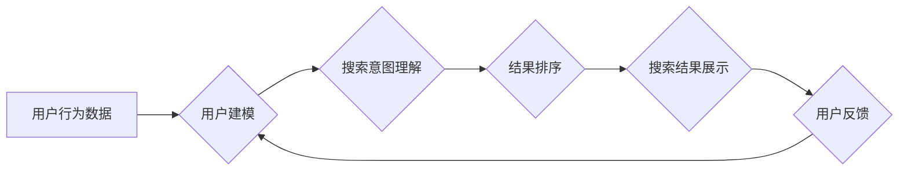

                 

## 个性化AI搜索：挑战与机遇

> 关键词：个性化搜索、AI推荐系统、深度学习、自然语言处理、用户行为分析、知识图谱、搜索引擎优化

### 1. 背景介绍

在信息爆炸的时代，海量数据和信息涌现，传统的搜索引擎模式已经难以满足用户日益增长的个性化需求。个性化AI搜索应运而生，旨在通过深度学习、自然语言处理等先进技术，理解用户的搜索意图、偏好和上下文，提供更加精准、相关和定制化的搜索结果。

个性化AI搜索的应用场景广泛，涵盖电商、新闻、社交媒体、教育等领域。例如，电商平台可以根据用户的浏览历史、购买记录和兴趣标签，推荐个性化的商品；新闻平台可以根据用户的阅读偏好，推送个性化的新闻资讯；社交媒体平台可以根据用户的社交关系和兴趣爱好，推荐个性化的内容和好友。

### 2. 核心概念与联系

个性化AI搜索的核心概念包括：

* **用户建模:** 通过分析用户的历史行为、偏好和上下文信息，构建用户的个性化模型。
* **搜索意图理解:** 理解用户的搜索意图，识别用户的真实需求。
* **结果排序:** 根据用户的个性化模型和搜索意图，对搜索结果进行排序，提供最相关的结果。
* **反馈机制:** 收集用户的反馈信息，不断优化用户模型和搜索结果。

**Mermaid 流程图:**



### 3. 核心算法原理 & 具体操作步骤

#### 3.1  算法原理概述

个性化AI搜索算法通常基于深度学习和自然语言处理技术，主要包括以下几种算法：

* **协同过滤:** 基于用户的历史行为和相似用户的信息，推荐用户可能感兴趣的内容。
* **内容过滤:** 基于内容的特征和标签，推荐与用户兴趣相符的内容。
* **混合推荐:** 结合协同过滤和内容过滤算法，提高推荐的准确性和个性化程度。
* **深度学习推荐:** 利用深度神经网络，学习用户和内容之间的复杂关系，进行更精准的推荐。

#### 3.2  算法步骤详解

以协同过滤算法为例，其具体操作步骤如下：

1. **数据收集:** 收集用户的行为数据，例如用户对商品的评分、浏览记录、购买记录等。
2. **用户相似度计算:** 计算用户之间的相似度，可以使用余弦相似度、皮尔逊相关系数等方法。
3. **推荐算法:** 根据用户的相似用户和他们的行为数据，推荐用户可能感兴趣的内容。

#### 3.3  算法优缺点

**协同过滤算法:**

* **优点:** 可以发现用户之间的隐性关系，推荐个性化内容。
* **缺点:** 数据稀疏性问题，新用户和新内容的推荐效果较差。

**内容过滤算法:**

* **优点:** 不需要用户历史行为数据，可以推荐新内容。
* **缺点:** 难以捕捉用户之间的隐性关系，推荐结果可能缺乏个性化。

#### 3.4  算法应用领域

个性化AI搜索算法广泛应用于以下领域：

* **电商推荐:** 推荐商品、优惠券、促销活动等。
* **新闻推荐:** 推荐新闻资讯、视频、音频等。
* **社交媒体推荐:** 推荐好友、群组、话题等。
* **教育推荐:** 推荐学习资源、课程、辅导等。

### 4. 数学模型和公式 & 详细讲解 & 举例说明

#### 4.1  数学模型构建

协同过滤算法的核心是用户-物品评分矩阵，其中每个元素表示用户对物品的评分。

假设有 $m$ 个用户和 $n$ 个物品，则用户-物品评分矩阵 $R$ 为 $m \times n$ 的矩阵。

$R_{ui}$ 表示用户 $u$ 对物品 $i$ 的评分。

#### 4.2  公式推导过程

用户相似度计算可以使用余弦相似度公式：

$$
\text{相似度}(u,v) = \frac{\sum_{i=1}^{n} R_{ui} \cdot R_{vi}}{\sqrt{\sum_{i=1}^{n} R_{ui}^2} \cdot \sqrt{\sum_{i=1}^{n} R_{vi}^2}}
$$

其中，$u$ 和 $v$ 表示两个用户，$n$ 表示物品总数。

#### 4.3  案例分析与讲解

假设有两个用户 $u$ 和 $v$，他们的评分矩阵如下：

| 物品 | $R_{u1}$ | $R_{u2}$ | $R_{u3}$ | $R_{v1}$ | $R_{v2}$ | $R_{v3}$ |
|---|---|---|---|---|---|---|
| 1 | 5 | 3 | 4 | 4 | 2 | 3 |
| 2 | 4 | 5 | 2 | 3 | 4 | 5 |
| 3 | 3 | 4 | 5 | 5 | 3 | 4 |

使用余弦相似度公式计算用户 $u$ 和 $v$ 的相似度：

$$
\text{相似度}(u,v) = \frac{(5 \cdot 4) + (3 \cdot 2) + (4 \cdot 3)}{\sqrt{(5^2 + 3^2 + 4^2)} \cdot \sqrt{(4^2 + 2^2 + 3^2)}} = \frac{37}{\sqrt{50} \cdot \sqrt{29}} \approx 0.85
$$

结果表明，用户 $u$ 和 $v$ 的相似度较高，可以认为他们是相似的用户。

### 5. 项目实践：代码实例和详细解释说明

#### 5.1  开发环境搭建

* Python 3.x
* TensorFlow 或 PyTorch 深度学习框架
* Scikit-learn 机器学习库
* Pandas 数据处理库
* Matplotlib 数据可视化库

#### 5.2  源代码详细实现

以下是一个使用协同过滤算法实现个性化推荐的简单代码示例：

```python
import pandas as pd
from sklearn.metrics.pairwise import cosine_similarity

# 加载用户-物品评分数据
ratings = pd.read_csv('ratings.csv')

# 计算用户之间的余弦相似度
user_similarity = cosine_similarity(ratings)

# 获取用户 ID
user_id = 1

# 获取用户 $user_id$ 相似用户
similar_users = user_similarity[user_id].argsort()[:-10:-1]

# 推荐给用户 $user_id$ 的物品
recommendations = ratings.iloc[similar_users].mean().sort_values(ascending=False)

# 打印推荐结果
print(recommendations)
```

#### 5.3  代码解读与分析

* 代码首先加载用户-物品评分数据。
* 然后使用 `cosine_similarity` 函数计算用户之间的余弦相似度。
* 获取用户 ID 后，代码找到用户相似用户，并根据相似用户的评分平均值，推荐给用户 $user_id$ 的物品。

#### 5.4  运行结果展示

运行代码后，将输出一个包含物品 ID 和平均评分的排序列表，表示推荐给用户 $user_id$ 的物品。

### 6. 实际应用场景

个性化AI搜索在各个领域都有广泛的应用场景：

#### 6.1  电商推荐

电商平台可以根据用户的浏览历史、购买记录和兴趣标签，推荐个性化的商品，提高用户转化率。

#### 6.2  新闻推荐

新闻平台可以根据用户的阅读偏好，推送个性化的新闻资讯，满足用户的个性化信息需求。

#### 6.3  社交媒体推荐

社交媒体平台可以根据用户的社交关系和兴趣爱好，推荐个性化的内容和好友，增强用户粘性和活跃度。

#### 6.4  未来应用展望

随着人工智能技术的不断发展，个性化AI搜索将更加智能化、精准化和个性化。未来，个性化AI搜索将应用于更多领域，例如：

* **医疗保健:** 根据用户的病史、症状和基因信息，推荐个性化的医疗方案。
* **教育:** 根据学生的学习进度、兴趣和能力，推荐个性化的学习资源和课程。
* **金融:** 根据用户的财务状况、风险偏好和投资目标，推荐个性化的理财产品和投资策略。

### 7. 工具和资源推荐

#### 7.1  学习资源推荐

* **书籍:**
    * 《推荐系统实践》
    * 《深度学习》
    * 《自然语言处理》
* **在线课程:**
    * Coursera: 深度学习
    * edX: 自然语言处理
    * Udacity: 机器学习工程师

#### 7.2  开发工具推荐

* **Python:** 
    * TensorFlow
    * PyTorch
    * Scikit-learn
* **Spark:** 大数据处理框架

#### 7.3  相关论文推荐

* **协同过滤算法:**
    * "Collaborative Filtering for Implicit Feedback Datasets"
    * "Matrix Factorization Techniques for Recommender Systems"
* **深度学习推荐:**
    * "Deep Learning Recommendation Systems"
    * "Neural Collaborative Filtering"

### 8. 总结：未来发展趋势与挑战

#### 8.1  研究成果总结

个性化AI搜索技术取得了显著进展，能够提供更加精准、相关和定制化的搜索结果。

#### 8.2  未来发展趋势

* **更精准的用户建模:** 利用更丰富的用户数据和更先进的机器学习算法，构建更精准的用户模型。
* **更强大的搜索意图理解:** 利用自然语言处理和深度学习技术，更深入地理解用户的搜索意图。
* **更个性化的结果排序:** 基于用户的个性化模型和搜索意图，提供更个性化的结果排序。
* **更智能的反馈机制:** 利用用户反馈信息，不断优化用户模型和搜索结果。

#### 8.3  面临的挑战

* **数据稀疏性问题:** 对于新用户和新内容，数据稀疏性问题仍然是一个挑战。
* **用户隐私保护:** 个性化AI搜索需要收集和使用用户的个人数据，如何保护用户的隐私是一个重要问题。
* **算法可解释性:** 深度学习算法的决策过程往往难以解释，如何提高算法的可解释性是一个挑战。

#### 8.4  研究展望

未来，个性化AI搜索将朝着更智能、更精准、更个性化的方向发展，为用户提供更加便捷、高效和满意的搜索体验。


### 9. 附录：常见问题与解答

#### 9.1  问题：如何解决数据稀疏性问题？

#### 9.2  问题：如何保护用户的隐私？

#### 9.3  问题：如何提高算法的可解释性？


作者：禅与计算机程序设计艺术 / Zen and the Art of Computer Programming 
<end_of_turn>

