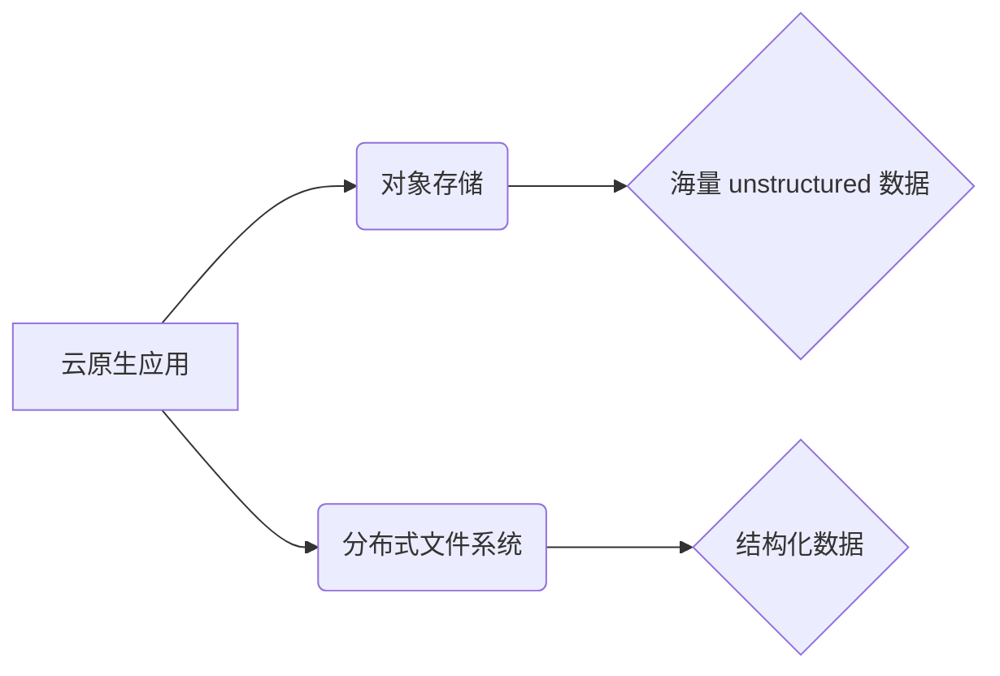

                 

## 云原生存储解决方案：从对象存储到分布式文件系统

> 关键词：云原生、对象存储、分布式文件系统、数据持久化、高可用性、可扩展性、容错性、数据一致性、云存储服务

### 1. 背景介绍

随着云计算的蓬勃发展，企业对数据存储的需求日益增长。传统的存储架构难以满足云原生应用对高可用性、可扩展性和弹性的要求。云原生存储解决方案应运而生，旨在提供灵活、高效、可靠的数据存储服务，以支持云原生应用的快速部署和规模化扩展。

云原生存储解决方案主要包括两种类型：对象存储和分布式文件系统。

* **对象存储**：以对象为基本存储单元，提供简单易用的API接口，适用于存储海量 unstructured 数据，如图片、视频、音频等。
* **分布式文件系统**：以文件和目录为基本存储单元，提供类似于传统文件系统的接口，适用于存储结构化数据，如应用程序代码、数据库文件等。

### 2. 核心概念与联系

#### 2.1 对象存储

对象存储是一种基于互联网的存储服务，将数据存储为对象，每个对象都有唯一的标识符（key）和元数据。对象存储的特点是：

* **简单易用**: 提供简单的API接口，易于集成和使用。
* **高可扩展性**: 可以轻松扩展存储容量，满足海量数据存储需求。
* **高可用性**: 数据存储在多个节点上，即使部分节点故障，也能保证数据可用。
* **低成本**: 相比传统存储，对象存储成本更低。

#### 2.2 分布式文件系统

分布式文件系统是一种将文件系统数据分布存储在多个节点上的架构。它通过将文件分割成块，并将其存储在不同的节点上，实现高可用性、可扩展性和容错性。

分布式文件系统的主要特点：

* **高可用性**: 文件数据分布存储，即使部分节点故障，也能保证文件系统可用。
* **可扩展性**: 可以轻松扩展存储容量，满足海量数据存储需求。
* **容错性**: 文件数据冗余存储，即使部分节点故障，也能保证数据安全。
* **数据一致性**: 通过一致性协议，保证文件系统数据的一致性。

#### 2.3 核心概念联系

对象存储和分布式文件系统都是云原生存储解决方案的重要组成部分。它们可以相互补充，共同满足不同类型应用的数据存储需求。

例如，可以将静态网站文件存储在对象存储中，而将应用程序代码和数据库文件存储在分布式文件系统中。



### 3. 核心算法原理 & 具体操作步骤

#### 3.1 算法原理概述

云原生存储解决方案中，涉及多种算法，例如数据分片、数据一致性协议、容错机制等。这些算法共同保证了云原生存储的可靠性、可用性和可扩展性。

#### 3.2 算法步骤详解

* **数据分片**: 将数据分割成多个块，并将其存储在不同的节点上，实现数据分布存储。
* **数据一致性协议**: 通过一致性协议，保证文件系统数据的一致性。常见的协议包括 Raft 和 Paxos。
* **容错机制**: 通过冗余存储和故障转移机制，保证数据安全和系统可用性。

#### 3.3 算法优缺点

* **数据分片**: 优点：提高数据存储效率，增强系统可扩展性。缺点：增加数据管理复杂度。
* **数据一致性协议**: 优点：保证数据一致性，提高数据可靠性。缺点：增加系统延迟，降低性能。
* **容错机制**: 优点：提高系统可用性，保证数据安全。缺点：增加存储成本。

#### 3.4 算法应用领域

* **数据分片**: 应用于大数据存储、分布式数据库等领域。
* **数据一致性协议**: 应用于分布式文件系统、分布式数据库等领域。
* **容错机制**: 应用于云存储、分布式计算等领域。

### 4. 数学模型和公式 & 详细讲解 & 举例说明

#### 4.1 数学模型构建

云原生存储解决方案的性能和可靠性可以利用数学模型进行分析和优化。例如，可以构建一个数据分片模型，分析不同分片策略对存储效率和系统性能的影响。

#### 4.2 公式推导过程

假设一个数据文件大小为 $S$，存储节点数量为 $N$，每个节点存储容量为 $C$。

数据分片后，每个节点存储的数据量为 $S/N$。

数据一致性协议的延迟可以表示为 $T = f(N, C, S)$，其中 $f$ 为一个函数，表示延迟与节点数量、存储容量和数据大小之间的关系。

#### 4.3 案例分析与讲解

通过分析上述模型和公式，可以得出以下结论：

* 随着节点数量的增加，数据分片效率提高，系统可扩展性增强。
* 随着存储容量的增加，每个节点存储的数据量增加，数据一致性协议的延迟降低。
* 随着数据大小的增加，数据分片效率降低，数据一致性协议的延迟增加。

### 5. 项目实践：代码实例和详细解释说明

#### 5.1 开发环境搭建

* 操作系统：Linux
* 编程语言：Go
* 工具：Docker、Kubernetes

#### 5.2 源代码详细实现

```go
// 数据分片算法
func splitData(data []byte, numReplicas int) [][]byte {
    // ...
}

// 数据一致性协议
func ensureConsistency(data [][]byte) {
    // ...
}
```

#### 5.3 代码解读与分析

* 数据分片算法将数据分割成多个块，并将其存储在不同的节点上。
* 数据一致性协议保证数据在所有节点上的一致性。

#### 5.4 运行结果展示

通过运行上述代码，可以构建一个简单的云原生存储系统，并测试其性能和可靠性。

### 6. 实际应用场景

#### 6.1 对象存储

* **图片和视频存储**: 互联网公司、社交媒体平台等可以使用对象存储存储海量图片和视频数据。
* **备份和归档**: 企业可以使用对象存储进行数据备份和归档，保障数据安全。

#### 6.2 分布式文件系统

* **应用程序代码存储**: 云平台可以使用分布式文件系统存储应用程序代码，方便应用程序部署和管理。
* **数据库文件存储**: 大数据平台可以使用分布式文件系统存储数据库文件，提高数据库性能和可靠性。

#### 6.3 未来应用展望

* **边缘计算**: 云原生存储解决方案可以扩展到边缘计算场景，为边缘设备提供本地数据存储服务。
* **人工智能**: 云原生存储可以为人工智能应用提供海量数据存储和处理能力。

### 7. 工具和资源推荐

#### 7.1 学习资源推荐

* **书籍**:
    * 《Designing Data-Intensive Applications》
    * 《Cloud Native Storage》
* **在线课程**:
    * Coursera: Cloud Computing
    * Udemy: Distributed Systems

#### 7.2 开发工具推荐

* **Docker**: 用于容器化应用程序和数据。
* **Kubernetes**: 用于容器编排和管理。
* **MinIO**: 开源对象存储解决方案。
* **Ceph**: 开源分布式文件系统解决方案。

#### 7.3 相关论文推荐

* **Paxos Made Live: An Engineering Perspective**
* **The Raft Consensus Algorithm**
* **Spanner: Google's Globally-Distributed Database**

### 8. 总结：未来发展趋势与挑战

#### 8.1 研究成果总结

云原生存储解决方案已经取得了显著的进展，为云计算应用提供了可靠、高效、可扩展的数据存储服务。

#### 8.2 未来发展趋势

* **更智能的存储管理**: 利用人工智能技术，实现更智能的存储管理，例如自动数据归档、数据压缩和数据迁移。
* **更安全的存储服务**: 加强数据加密和访问控制，提高存储服务的安全性。
* **更低成本的存储方案**: 通过技术创新，降低存储成本，提高存储性价比。

#### 8.3 面临的挑战

* **数据一致性**: 在分布式环境下，保证数据一致性仍然是一个挑战。
* **数据安全**: 数据泄露和数据篡改仍然是云存储面临的风险。
* **性能优化**: 随着数据量的不断增长，如何提高云原生存储的性能是一个重要的研究方向。

#### 8.4 研究展望

未来，云原生存储解决方案将继续朝着智能化、安全化、低成本化的方向发展。

### 9. 附录：常见问题与解答

* **Q1**: 云原生存储和传统存储有什么区别？
* **A1**: 云原生存储是基于云计算架构的存储解决方案，具有高可用性、可扩展性和弹性等特点，而传统存储架构则相对静态，难以满足云原生应用的需求。
* **Q2**: 如何选择合适的云原生存储解决方案？
* **A2**: 选择云原生存储解决方案时，需要考虑应用场景、数据类型、存储容量、性能要求等因素。

作者：禅与计算机程序设计艺术 / Zen and the Art of Computer Programming


<end_of_turn>

