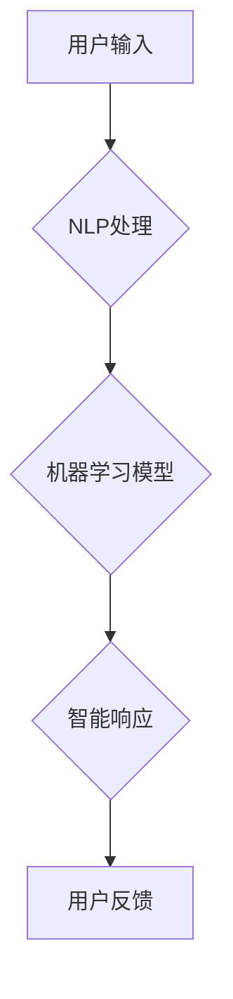

                 

## 人工智能在人机交互中的应用

> 关键词：人工智能、人机交互、自然语言处理、机器学习、深度学习、对话系统、虚拟助手、情感计算

## 1. 背景介绍

人机交互 (Human-Computer Interaction, HCI) 作为计算机科学的重要分支，致力于研究人和计算机之间高效、自然、愉悦的交互方式。随着人工智能 (Artificial Intelligence, AI) 技术的飞速发展，AI 正在深刻地改变着人机交互的格局，为我们带来更加智能、个性化、便捷的交互体验。

传统的人机交互主要依赖于图形用户界面 (GUI) 和命令行界面 (CLI)，用户需要通过鼠标、键盘等物理设备与计算机进行操作。然而，这些交互方式往往较为僵化，缺乏灵活性，难以满足人们日益增长的交互需求。

人工智能技术的介入，为 HCI 带来了革命性的变革。AI 赋予了计算机学习、理解和响应人类语言、行为和情感的能力，使得人机交互更加自然、智能化。

## 2. 核心概念与联系

### 2.1 人工智能 (AI)

人工智能是指模拟人类智能行为的计算机系统。AI 的核心目标是使计算机能够像人类一样学习、推理、解决问题和做出决策。

### 2.2 人机交互 (HCI)

人机交互是指人与计算机之间进行信息交换和操作的交互过程。HCI 的目标是设计出易用、高效、愉悦的人机交互体验。

### 2.3 人工智能在人机交互中的应用

AI 技术在 HCI 中的应用主要体现在以下几个方面：

* **自然语言处理 (NLP)**：使计算机能够理解和生成人类语言，从而实现更加自然、流畅的人机对话。
* **机器学习 (ML)**：使计算机能够从数据中学习，并根据学习到的知识进行预测和决策，从而提供更加个性化、智能化的交互体验。
* **深度学习 (DL)**：一种更高级的机器学习方法，能够处理更加复杂的数据，例如图像、语音和文本，从而实现更加精准、智能的人机交互。

**Mermaid 流程图**



## 3. 核心算法原理 & 具体操作步骤

### 3.1 算法原理概述

在 AI 驱动的 HCI 中，常用的算法包括：

* **自然语言理解 (NLU)**：用于理解用户输入的文本语义，例如识别实体、关系和意图。
* **对话管理 (Dialogue Management)**：用于控制对话流程，例如选择合适的响应、记忆对话历史和处理用户意图。
* **文本生成 (Text Generation)**：用于生成自然流畅的文本响应，例如回答用户问题、提供建议或进行聊天。

### 3.2 算法步骤详解

以自然语言理解为例，其基本步骤包括：

1. **文本预处理**: 将用户输入的文本进行清洗、分词、词性标注等处理，以便后续算法理解。
2. **特征提取**: 从预处理后的文本中提取关键特征，例如词语、词性、语法结构等。
3. **模型训练**: 使用机器学习算法，例如支持向量机 (SVM) 或深度神经网络 (DNN)，对训练数据进行训练，学习文本语义与特征之间的关系。
4. **预测**: 将用户输入的文本作为输入，通过训练好的模型进行预测，识别文本的语义信息，例如实体、关系和意图。

### 3.3 算法优缺点

**优点**:

* **自然流畅**: AI 驱动的 HCI 可以实现更加自然、流畅的人机对话，例如使用自然语言进行交互。
* **个性化定制**: AI 可以根据用户的行为和偏好进行个性化定制，提供更加符合用户需求的交互体验。
* **智能化辅助**: AI 可以提供智能化辅助，例如自动完成任务、提供建议或解答问题。

**缺点**:

* **数据依赖**: AI 算法需要大量的训练数据，否则难以达到理想的效果。
* **解释性问题**: 一些 AI 算法的决策过程较为复杂，难以解释其背后的逻辑，这可能会导致用户对 AI 的信任度降低。
* **伦理问题**: AI 驱动的 HCI 可能会引发一些伦理问题，例如数据隐私、算法偏见等。

### 3.4 算法应用领域

AI 驱动的 HCI 已经应用于各个领域，例如：

* **智能客服**: 使用 AI 技术，自动回答用户问题，提供 24/7 的客户服务。
* **虚拟助手**: 例如 Siri、Alexa 和 Google Assistant，可以帮助用户完成各种任务，例如设置提醒、播放音乐或控制智能家居设备。
* **教育**: 使用 AI 技术，个性化定制学习内容，提供智能化的学习辅导。
* **医疗**: 使用 AI 技术，辅助医生诊断疾病、制定治疗方案和提供个性化的医疗建议。

## 4. 数学模型和公式 & 详细讲解 & 举例说明

### 4.1 数学模型构建

在自然语言理解任务中，常用的数学模型包括：

* **词嵌入**: 将词语映射到一个低维向量空间，例如 Word2Vec 和 GloVe。

* **循环神经网络 (RNN)**：用于处理序列数据，例如文本，能够捕捉文本中的上下文信息。

* **Transformer**: 一种新型的深度学习模型，能够更有效地处理长文本序列，例如 BERT 和 GPT。

### 4.2 公式推导过程

**词嵌入**:

Word2Vec 使用负采样 (Negative Sampling) 方法训练词嵌入模型。目标函数为：

$$
J(\theta) = \sum_{i=1}^{N} \sum_{j=1}^{M} \log \sigma(v_i^T w_j) - \sum_{i=1}^{N} \sum_{j \in \mathcal{N}(i)} \log \sigma(-v_i^T w_j)
$$

其中：

* $\theta$ 为模型参数
* $N$ 为句子数量
* $M$ 为词典大小
* $v_i$ 为词语 $i$ 的词嵌入向量
* $w_j$ 为词语 $j$ 的词嵌入向量
* $\mathcal{N}(i)$ 为词语 $i$ 的负采样词语集合
* $\sigma(x)$ 为 sigmoid 函数

**循环神经网络**:

RNN 的核心思想是利用隐藏状态来记忆过去的输入信息，从而处理序列数据。隐藏状态的更新公式为：

$$
h_t = f(W_{hh}h_{t-1} + W_{xh}x_t + b_h)
$$

其中：

* $h_t$ 为时间步 $t$ 的隐藏状态
* $f$ 为激活函数
* $W_{hh}$ 为隐藏状态之间的权重矩阵
* $W_{xh}$ 为输入与隐藏状态之间的权重矩阵
* $x_t$ 为时间步 $t$ 的输入
* $b_h$ 为隐藏状态的偏置项

### 4.3 案例分析与讲解

**词嵌入**:

Word2Vec 可以学习到词语之间的语义关系。例如，"king" 和 "queen" 之间的关系可以表示为 "king" - "man" + "woman" = "queen"。

**循环神经网络**:

RNN 可以用于机器翻译任务。RNN 可以学习到句子中单词之间的上下文信息，从而将源语言句子翻译成目标语言句子。

## 5. 项目实践：代码实例和详细解释说明

### 5.1 开发环境搭建

* Python 3.x
* TensorFlow 或 PyTorch 深度学习框架
* NLTK 自然语言处理库
* SpaCy 自然语言处理库

### 5.2 源代码详细实现

以下是一个简单的基于 TensorFlow 的自然语言理解代码示例：

```python
import tensorflow as tf

# 定义模型结构
model = tf.keras.Sequential([
    tf.keras.layers.Embedding(input_dim=vocab_size, output_dim=embedding_dim),
    tf.keras.layers.LSTM(units=128),
    tf.keras.layers.Dense(units=num_classes, activation='softmax')
])

# 编译模型
model.compile(optimizer='adam',
              loss='sparse_categorical_crossentropy',
              metrics=['accuracy'])

# 训练模型
model.fit(x_train, y_train, epochs=10)

# 预测
predictions = model.predict(x_test)
```

### 5.3 代码解读与分析

* **Embedding 层**: 将词语映射到低维向量空间。
* **LSTM 层**: 用于处理文本序列，捕捉文本中的上下文信息。
* **Dense 层**: 全连接层，用于分类。
* **编译模型**: 选择优化器、损失函数和评估指标。
* **训练模型**: 使用训练数据训练模型。
* **预测**: 使用训练好的模型对测试数据进行预测。

### 5.4 运行结果展示

训练完成后，可以评估模型的性能，例如准确率、召回率和 F1 值。

## 6. 实际应用场景

### 6.1 智能客服

AI 驱动的智能客服可以自动回答用户问题，提供 24/7 的客户服务，例如：

* **问答系统**: 使用自然语言理解技术，回答用户关于产品、服务或公司信息的常见问题。
* **对话机器人**: 使用对话管理技术，与用户进行自然流畅的对话，例如帮助用户预约服务或解决问题。

### 6.2 虚拟助手

AI 驱动的虚拟助手可以帮助用户完成各种任务，例如：

* **语音助手**: 例如 Siri、Alexa 和 Google Assistant，可以理解用户的语音指令，并执行相应的操作，例如播放音乐、设置提醒或控制智能家居设备。
* **文本助手**: 例如智能聊天机器人，可以理解用户的文本输入，并提供相应的回复，例如回答问题、提供建议或进行聊天。

### 6.3 教育

AI 驱动的教育工具可以个性化定制学习内容，提供智能化的学习辅导，例如：

* **智能辅导系统**: 根据学生的学习进度和能力，提供个性化的学习建议和辅导。
* **智能练习系统**: 自动生成练习题，并根据学生的答题情况提供反馈和建议。

### 6.4 未来应用展望

AI 驱动的 HCI 还有很大的发展空间，未来可能会应用于更多领域，例如：

* **医疗保健**: AI 可以辅助医生诊断疾病、制定治疗方案和提供个性化的医疗建议。
* **金融服务**: AI 可以帮助用户管理财务、识别欺诈行为和提供个性化的投资建议。
* **娱乐**: AI 可以为用户提供更加个性化、沉浸式的娱乐体验，例如虚拟现实游戏和个性化推荐系统。

## 7. 工具和资源推荐

### 7.1 学习资源推荐

* **斯坦福大学 CS224N 自然语言处理课程**: https://web.stanford.edu/class/cs224n/
* **DeepLearning.AI 深度学习课程**: https://www.deeplearning.ai/
* **Hugging Face Transformers 库**: https://huggingface.co/transformers/

### 7.2 开发工具推荐

* **TensorFlow**: https://www.tensorflow.org/
* **PyTorch**: https://pytorch.org/
* **spaCy**: https://spacy.io/

### 7.3 相关论文推荐

* **Attention Is All You Need**: https://arxiv.org/abs/1706.03762
* **BERT: Pre-training of Deep Bidirectional Transformers for Language Understanding**: https://arxiv.org/abs/1810.04805

## 8. 总结：未来发展趋势与挑战

### 8.1 研究成果总结

AI 驱动的 HCI 取得了显著的进展，例如：

* 自然语言理解和生成技术取得了突破性进展。
* 对话系统更加智能化、自然化和个性化。
* AI 驱动的 HCI 应用于各个领域，例如智能客服、虚拟助手和教育。

### 8.2 未来发展趋势

* **更智能的 AI**: 发展更加智能、强大的 AI 算法，例如通用人工智能 (AGI)。
* **更自然的人机交互**: 开发更加自然、流畅、无障碍的人机交互方式，例如脑机接口。
* **更个性化的体验**: 利用 AI 技术，提供更加个性化、定制化的交互体验。

### 8.3 面临的挑战

* **数据隐私**: AI 算法需要大量数据进行训练，如何保护用户数据隐私是一个重要的挑战。
* **算法偏见**: AI 算法可能会受到训练数据的影响，导致算法偏见，需要开发更加公平、公正的算法。
* **伦理问题**: AI 驱动的 HCI 可能会引发一些伦理问题，例如算法透明度、责任归属等，需要进行深入的伦理思考和规范。

### 8.4 研究展望

未来，AI 驱动的 HCI 将继续朝着更加智能、自然、个性化和安全的方向发展，为我们带来更加便捷、高效、愉悦的交互体验。

## 9. 附录：常见问题与解答

**Q1: AI 驱动的 HCI 是否会取代人类工作？**

A1: AI 驱动的 HCI 可能会改变一些工作方式，但不会完全取代人类工作。AI 可以帮助人类完成重复性、繁琐的工作，释放人类的创造力和智力，从而使人类能够专注于更高级的任务。

**Q2: 如何确保 AI 驱动的 HCI 的安全性？**

A2: 确保 AI 驱动的 HCI 的安全性需要从多个方面入手，例如：

* 开发更加安全、可靠的 AI 算法。
* 对 AI 系统进行严格的测试和评估。
* 建立相应的法律法规和伦理规范。

**Q3: 如何解决 AI 驱动的 HCI 中的算法偏见问题？**

A3: 解决算法偏见问题需要从以下几个方面入手：

* 使用更加多样化、代表性的训练数据。
* 开发更加公平、公正的算法。
* 对 AI 系统进行持续的监控和评估，及时发现和解决偏见问题。


作者：禅与计算机程序设计艺术 / Zen and the Art of Computer Programming<end_of_turn>

