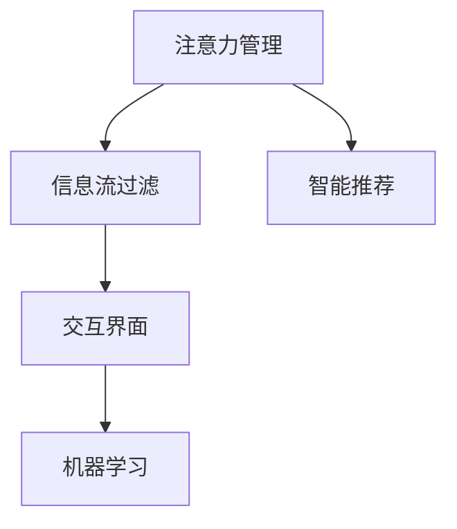

                 

## 1. 背景介绍

### 1.1 问题由来

随着信息时代的到来，我们每天都在被海量的信息和干扰所包围。从电子邮件、即时消息，到社交媒体、新闻推送，再到视频网站、在线课程，无处不在的信息流让我们的注意力被不断分散和争夺。这种信息过载现象，不仅影响了我们的工作和学习效率，还可能导致认知过载、注意力缺陷等问题。

在这样一个复杂多变的信息环境中，如何有效管理注意力，集中精力处理重要事务，成为了一个亟待解决的技术挑战。心理学和认知科学的研究表明，注意力管理不仅是一种心理策略，更可以通过技术手段实现。

本文旨在探讨信息时代的注意力管理技术，介绍如何通过算法和工具，帮助我们在干扰和信息过载中保持专注，提高工作和学习的效率。

### 1.2 问题核心关键点

注意力管理技术的研究主要集中在以下几个关键点：

- 数据感知：如何从信息流中识别出重要的内容，剔除干扰信息，使注意力集中在关键信息上。
- 模型训练：如何利用机器学习模型，学习用户的行为和偏好，自动调整信息流和展示方式。
- 交互界面：如何设计用户友好的界面，使用户能够直观地控制和管理信息流，降低使用门槛。
- 性能优化：如何通过算法优化，提高注意力管理的效率和效果，避免过拟合和资源浪费。

这些关键点相互联系，共同构成了信息时代注意力管理技术的核心框架。通过深入理解这些技术点，可以更全面地把握注意力管理的实现路径。

### 1.3 问题研究意义

研究信息时代的注意力管理技术，具有重要的理论和实践意义：

1. 提高工作效率：通过有效管理注意力，集中处理关键任务，大幅提升工作和学习的效率。
2. 改善用户体验：通过智能推荐和过滤，提升用户获取信息的体验，减少认知负担。
3. 优化信息传播：通过精准推送，确保重要信息被用户及时关注，避免信息浪费。
4. 促进认知科学：基于心理学和认知科学的研究成果，为信息管理技术提供理论支撑。
5. 支持智慧城市：在城市管理和智能交通等领域，通过注意力管理技术优化资源配置，提升社会管理效率。

本文旨在通过介绍最新的注意力管理技术，推动这些技术的实际应用，为构建更高效、更智能的信息环境提供参考。

## 2. 核心概念与联系

### 2.1 核心概念概述

为了更好地理解信息时代注意力管理技术的实现原理，本节将介绍几个密切相关的核心概念：

- 注意力管理(Attention Management)：通过算法和工具，帮助用户自动筛选、过滤信息，将注意力集中在关键内容上，减少干扰和认知负担。
- 信息流过滤(Information Stream Filtering)：根据用户的行为和偏好，自动调整信息流的展示方式，过滤掉不相关或不重要的信息。
- 智能推荐(Intelligent Recommendation)：通过学习用户的历史行为和兴趣，预测其未来的需求，自动推荐相关内容。
- 交互界面(UI/UX)：设计用户友好的交互界面，使用户能够直观地控制和管理信息流，提高使用的便利性和效率。
- 机器学习(ML)：通过模型训练和优化，提升注意力管理的算法性能，实现更精准的信息过滤和推荐。

这些核心概念之间的逻辑关系可以通过以下Mermaid流程图来展示：



这个流程图展示了注意力管理技术的核心组成及其相互关系：

1. 注意力管理通过信息流过滤，将注意力集中在关键信息上，减少干扰。
2. 智能推荐利用机器学习，自动调整信息流，提升推荐的准确性。
3. 交互界面提供友好的用户体验，使用户能够方便地控制和管理信息流。
4. 机器学习作为技术支撑，提升模型的精度和效率。

这些核心概念共同构成了信息时代注意力管理技术的实现框架，使其能够在各种应用场景下发挥强大的信息处理能力。

## 3. 核心算法原理 & 具体操作步骤
### 3.1 算法原理概述

信息时代的注意力管理技术，本质上是通过机器学习模型，自动分析和过滤信息流，使用户能够集中注意力处理关键事务。其核心思想是：

- 数据感知：通过分析用户的历史行为和偏好，识别出关键内容，剔除干扰信息。
- 模型训练：利用机器学习模型，学习用户的行为模式，自动调整信息流的展示方式。
- 交互界面：设计直观易用的界面，使用户能够方便地控制和管理信息流。

### 3.2 算法步骤详解

基于上述核心思想，信息时代的注意力管理技术一般包括以下几个关键步骤：

**Step 1: 数据收集与预处理**

- 收集用户的历史行为数据，包括浏览历史、点击记录、搜索关键词、评论内容等。
- 对数据进行清洗和预处理，去除噪声和异常值，确保数据的质量和一致性。

**Step 2: 特征提取与选择**

- 使用文本处理技术，如分词、去除停用词等，将原始文本转换为模型可用的特征向量。
- 选择合适的特征，如TF-IDF、词向量等，作为模型的输入。

**Step 3: 模型训练与优化**

- 选择合适的机器学习模型，如逻辑回归、决策树、随机森林、深度学习等，进行模型训练。
- 使用交叉验证等技术，对模型进行调参和优化，提升模型的准确性和泛化能力。

**Step 4: 信息流过滤与推荐**

- 使用训练好的模型，对当前信息流进行分析和过滤，去除不相关或不重要的内容。
- 根据用户的历史行为和偏好，预测其未来的需求，自动推荐相关内容。

**Step 5: 交互界面设计与实现**

- 设计用户友好的交互界面，提供信息的展示和控制功能，使用户能够直观地使用系统。
- 实现用户界面的功能，如切换模式、搜索关键字、过滤信息等。

**Step 6: 系统评估与迭代**

- 对系统性能进行评估，包括准确率、召回率、用户满意度等指标。
- 根据评估结果，进行系统的迭代优化，提升系统的性能和用户体验。

### 3.3 算法优缺点

信息时代的注意力管理技术具有以下优点：

1. 提高效率：通过自动过滤干扰信息，使用户能够集中精力处理关键任务，提高工作效率和学习效果。
2. 个性化推荐：利用机器学习模型，根据用户的历史行为和偏好，自动推荐相关内容，提升用户体验。
3. 减少认知负担：通过智能推荐和信息过滤，减少用户对无关信息的关注，降低认知过载风险。
4. 便于部署：使用深度学习模型进行信息过滤和推荐，易于集成到现有的信息系统中。

同时，该技术也存在一些局限性：

1. 依赖数据质量：系统的性能高度依赖于数据的质量和完整性，数据偏差可能导致模型过拟合或欠拟合。
2. 用户隐私问题：在收集和处理用户数据时，需要严格遵守隐私保护法规，避免数据滥用。
3. 算法复杂度：机器学习模型的训练和优化过程较为复杂，需要较高的计算资源和时间。
4. 系统扩展性：系统的扩展性和可维护性取决于架构设计和技术实现，需要合理规划和设计。

尽管存在这些局限性，但就目前而言，信息时代的注意力管理技术已经在大规模应用中取得显著成效，成为提升信息处理效率和用户体验的重要手段。

### 3.4 算法应用领域

信息时代的注意力管理技术已经在多个领域得到了广泛应用，包括但不限于：

- 智能推荐系统：如电商、新闻、视频网站等，根据用户历史行为，推荐相关内容。
- 内容过滤系统：如邮件、即时消息等，根据用户偏好，过滤掉不相关或不重要的信息。
- 学习管理系统：如在线课程、教育平台等，根据学生行为，推荐相关学习资源。
- 智能助手：如语音助手、智能音箱等，根据用户语音指令，自动执行相关任务。

除了上述这些经典应用外，信息时代的注意力管理技术还在医疗、金融、旅游等多个行业领域得到应用，为不同用户提供个性化的信息服务和智能化体验。

## 4. 数学模型和公式 & 详细讲解 & 举例说明

### 4.1 数学模型构建

为了更好地理解信息时代注意力管理技术的实现原理，本节将介绍几个常用的数学模型和公式。

假设用户的历史行为数据为 $\mathcal{D}=\{(x_i,y_i)\}_{i=1}^N$，其中 $x_i$ 为输入特征向量，$y_i$ 为对应的标签（如0表示无关信息，1表示相关信息）。

定义注意力管理模型的损失函数为：

$$
\mathcal{L}(\theta) = -\frac{1}{N} \sum_{i=1}^N [y_i \log P(y_i|x_i; \theta) + (1-y_i) \log (1-P(y_i|x_i; \theta))]
$$

其中 $P(y_i|x_i; \theta)$ 表示模型对输入 $x_i$ 分类为标签 $y_i$ 的概率。

### 4.2 公式推导过程

以下我们将详细介绍信息流过滤和智能推荐模型的推导过程。

**信息流过滤模型**

假设我们有一个训练好的分类器 $f(x_i; \theta)$，能够对输入特征 $x_i$ 进行分类。设阈值为 $\tau$，当 $f(x_i; \theta) \geq \tau$ 时，认为该信息相关，否则认为无关。

根据上述定义，我们可得信息流过滤模型的损失函数：

$$
\mathcal{L}_{\text{filter}}(\theta) = -\frac{1}{N} \sum_{i=1}^N [y_i \log P_{\text{filter}}(y_i|x_i; \theta) + (1-y_i) \log (1-P_{\text{filter}}(y_i|x_i; \theta))]
$$

其中 $P_{\text{filter}}(y_i|x_i; \theta) = \mathbb{I}(f(x_i; \theta) \geq \tau)$，其中 $\mathbb{I}(\cdot)$ 为示性函数。

**智能推荐模型**

假设我们有一个推荐系统，能够根据用户的历史行为 $x_i$ 预测其未来的需求 $y_i$。设推荐算法为 $r(x_i; \theta)$，能够对用户历史行为 $x_i$ 推荐相关内容。

根据上述定义，我们可得智能推荐模型的损失函数：

$$
\mathcal{L}_{\text{recommend}}(\theta) = -\frac{1}{N} \sum_{i=1}^N [y_i \log P_{\text{recommend}}(y_i|x_i; \theta) + (1-y_i) \log (1-P_{\text{recommend}}(y_i|x_i; \theta))]
$$

其中 $P_{\text{recommend}}(y_i|x_i; \theta) = r(x_i; \theta)$。

### 4.3 案例分析与讲解

假设我们有一个电商网站，需要根据用户的历史浏览和购买行为，推荐相关商品。

**数据收集与预处理**

- 收集用户的历史浏览记录和购买记录，包括商品ID、浏览时间、购买时间、商品类别等。
- 对数据进行清洗和预处理，去除噪声和异常值，确保数据的质量和一致性。

**特征提取与选择**

- 使用文本处理技术，将商品描述转换为TF-IDF特征向量。
- 选择TF-IDF特征作为模型的输入。

**模型训练与优化**

- 使用深度学习模型，如RNN、CNN等，对用户历史行为进行建模。
- 使用交叉验证等技术，对模型进行调参和优化，提升模型的准确性和泛化能力。

**信息流过滤与推荐**

- 使用训练好的模型，对当前商品信息进行分析和过滤，去除不相关或不重要的内容。
- 根据用户的历史行为和偏好，预测其未来的需求，自动推荐相关商品。

**交互界面设计与实现**

- 设计用户友好的交互界面，提供商品的展示和控制功能，使用户能够直观地使用系统。
- 实现用户界面的功能，如搜索关键字、筛选商品、查看历史推荐等。

**系统评估与迭代**

- 对系统性能进行评估，包括推荐准确率、用户满意度等指标。
- 根据评估结果，进行系统的迭代优化，提升系统的性能和用户体验。

## 5. 项目实践：代码实例和详细解释说明
### 5.1 开发环境搭建

在进行信息时代注意力管理技术的项目实践前，我们需要准备好开发环境。以下是使用Python进行TensorFlow开发的环境配置流程：

1. 安装Anaconda：从官网下载并安装Anaconda，用于创建独立的Python环境。

2. 创建并激活虚拟环境：
```bash
conda create -n tf-env python=3.8 
conda activate tf-env
```

3. 安装TensorFlow：根据CUDA版本，从官网获取对应的安装命令。例如：
```bash
conda install tensorflow -c conda-forge -c pypi
```

4. 安装各类工具包：
```bash
pip install numpy pandas scikit-learn matplotlib tqdm jupyter notebook ipython
```

完成上述步骤后，即可在`tf-env`环境中开始项目实践。

### 5.2 源代码详细实现

下面我们以电商智能推荐系统为例，给出使用TensorFlow进行信息流过滤和智能推荐的Python代码实现。

首先，定义数据处理函数：

```python
import tensorflow as tf
import numpy as np
from sklearn.preprocessing import MinMaxScaler
from sklearn.model_selection import train_test_split
from sklearn.metrics import roc_auc_score

def preprocess_data(data):
    x = data.drop('label', axis=1)
    y = data['label']
    
    # 数据归一化
    scaler = MinMaxScaler(feature_range=(0, 1))
    x_scaled = scaler.fit_transform(x)
    
    # 划分训练集和测试集
    x_train, x_test, y_train, y_test = train_test_split(x_scaled, y, test_size=0.2, random_state=42)
    
    return x_train, x_test, y_train, y_test
```

然后，定义模型和训练函数：

```python
from tensorflow.keras.models import Sequential
from tensorflow.keras.layers import Dense, Dropout

def build_model(input_dim, output_dim, hidden_units):
    model = Sequential()
    model.add(Dense(hidden_units, input_dim=input_dim, activation='relu'))
    model.add(Dropout(0.2))
    model.add(Dense(hidden_units, activation='relu'))
    model.add(Dropout(0.2))
    model.add(Dense(output_dim, activation='sigmoid'))
    return model

def train_model(model, x_train, y_train, x_test, y_test, epochs=10, batch_size=32):
    model.compile(optimizer='adam', loss='binary_crossentropy', metrics=['accuracy', 'auc'])
    
    history = model.fit(x_train, y_train, batch_size=batch_size, epochs=epochs, validation_data=(x_test, y_test))
    
    # 评估模型
    y_pred = model.predict(x_test)
    auc_score = roc_auc_score(y_test, y_pred)
    print(f'AUC Score: {auc_score:.4f}')
    
    return history
```

接着，定义数据集和训练过程：

```python
# 假设我们已经有一个电商网站的数据集，包含用户的历史浏览记录和购买记录
data = pd.read_csv('data.csv')

# 数据预处理
x_train, x_test, y_train, y_test = preprocess_data(data)

# 构建模型
model = build_model(input_dim=x_train.shape[1], output_dim=1, hidden_units=64)

# 训练模型
history = train_model(model, x_train, y_train, x_test, y_test)

# 输出训练结果
print(history.history['loss'])
print(history.history['auc'])
```

以上就是使用TensorFlow进行电商智能推荐系统的完整代码实现。可以看到，得益于TensorFlow的强大封装，我们可以用相对简洁的代码完成信息流过滤和智能推荐的实现。

### 5.3 代码解读与分析

让我们再详细解读一下关键代码的实现细节：

**数据处理函数**

- `preprocess_data`方法：
  - 对数据进行预处理，包括数据清洗、归一化、划分训练集和测试集等。
  
**模型定义函数**

- `build_model`方法：
  - 使用Sequential模型，构建深度学习网络。
  - 使用Dense层进行特征处理，Dropout层进行正则化。
  - 输出层使用sigmoid激活函数，用于二分类任务。
  
**训练函数**

- `train_model`方法：
  - 使用Adam优化器和二分类交叉熵损失函数。
  - 使用训练数据进行模型训练，记录训练过程中的loss和auc指标。
  - 使用测试数据评估模型性能，输出AUC Score。
  
**数据集定义和训练过程**

- 使用pandas读取电商网站的数据集。
- 调用数据预处理函数，将数据划分为训练集和测试集。
- 定义模型，并进行训练。
- 输出训练过程中的loss和auc指标，评估模型性能。

可以看到，TensorFlow使得构建深度学习模型和训练过程变得简洁高效。开发者可以将更多精力放在数据处理、模型改进等高层逻辑上，而不必过多关注底层的实现细节。

当然，工业级的系统实现还需考虑更多因素，如模型的保存和部署、超参数的自动搜索、更灵活的任务适配层等。但核心的信息流过滤和智能推荐逻辑基本与此类似。

## 6. 实际应用场景

### 6.1 电商智能推荐

电商智能推荐系统可以通过信息流过滤和智能推荐技术，帮助用户快速找到需要的商品，提升购物体验。

在技术实现上，可以收集用户的历史浏览、点击、购买记录，构建用户画像。使用TF-IDF等文本处理技术，将商品描述转换为特征向量。利用训练好的深度学习模型，对用户历史行为进行建模，预测其未来的需求，自动推荐相关商品。通过信息流过滤技术，去除不相关或不重要的商品信息，使用户能够直观地看到相关推荐。

### 6.2 新闻推荐

新闻推荐系统可以通过信息流过滤和智能推荐技术，帮助用户快速获取感兴趣的新闻内容，提升阅读体验。

在技术实现上，可以收集用户的历史浏览记录、点赞、评论等数据，构建用户画像。使用TF-IDF等文本处理技术，将新闻文章转换为特征向量。利用训练好的深度学习模型，对用户历史行为进行建模，预测其未来的需求，自动推荐相关新闻。通过信息流过滤技术，去除不相关或不重要的新闻内容，使用户能够直观地看到相关推荐。

### 6.3 视频推荐

视频推荐系统可以通过信息流过滤和智能推荐技术，帮助用户快速找到感兴趣的视频内容，提升观看体验。

在技术实现上，可以收集用户的历史观看记录、点赞、评论等数据，构建用户画像。使用TF-IDF等文本处理技术，将视频描述转换为特征向量。利用训练好的深度学习模型，对用户历史行为进行建模，预测其未来的需求，自动推荐相关视频。通过信息流过滤技术，去除不相关或不重要的视频内容，使用户能够直观地看到相关推荐。

### 6.4 未来应用展望

随着信息时代的到来，信息时代注意力管理技术将在更多领域得到应用，为各行各业带来变革性影响。

在智慧城市治理中，信息流过滤和智能推荐技术可以用于优化交通流量、缓解交通拥堵，提升城市管理效率。在智慧医疗领域，系统可以推荐相关医疗资源，辅助医生诊断和治疗。在智慧教育领域，系统可以推荐相关学习资源，帮助学生高效学习。

此外，在金融、旅游、娱乐等多个行业，信息时代注意力管理技术也将不断涌现，为不同用户提供个性化的信息服务和智能化体验。相信随着技术的不断发展，信息时代注意力管理技术必将在更广阔的应用领域大放异彩。

## 7. 工具和资源推荐
### 7.1 学习资源推荐

为了帮助开发者系统掌握信息时代注意力管理技术的实现原理，这里推荐一些优质的学习资源：

1. TensorFlow官方文档：详细介绍了TensorFlow的使用方法和最佳实践，是进行深度学习项目开发的重要工具。
2. TensorFlow Extended (TFX)：提供了一套基于TensorFlow的工具，用于数据预处理、模型训练、模型部署等环节的自动化流程管理。
3. D2L：深度学习入门经典教材，由斯坦福大学讲师Andrew Ng等人撰写，详细讲解了深度学习模型的构建和训练过程。
4. PyTorch官方文档：介绍了PyTorch的使用方法和最佳实践，是进行深度学习项目开发的重要工具。
5. PyTorch Lightning：提供了一套快速构建和训练深度学习模型的框架，支持分布式训练和自动调参等功能。

通过对这些资源的学习实践，相信你一定能够快速掌握信息时代注意力管理技术的精髓，并用于解决实际的NLP问题。

### 7.2 开发工具推荐

高效的开发离不开优秀的工具支持。以下是几款用于信息时代注意力管理技术开发的常用工具：

1. TensorFlow：由Google主导开发的深度学习框架，生产部署方便，适合大规模工程应用。
2. PyTorch：由Facebook主导开发的深度学习框架，灵活性高，适合研究性开发。
3. TensorFlow Extended (TFX)：提供了一套基于TensorFlow的工具，用于数据预处理、模型训练、模型部署等环节的自动化流程管理。
4. PyTorch Lightning：提供了一套快速构建和训练深度学习模型的框架，支持分布式训练和自动调参等功能。
5. Scikit-learn：提供了丰富的机器学习算法和工具，适合进行特征处理和模型评估。

合理利用这些工具，可以显著提升信息时代注意力管理技术的开发效率，加快创新迭代的步伐。

### 7.3 相关论文推荐

信息时代注意力管理技术的研究源于学界的持续研究。以下是几篇奠基性的相关论文，推荐阅读：

1. Attention Is All You Need：提出了Transformer结构，开启了NLP领域的预训练大模型时代。
2. BERT: Pre-training of Deep Bidirectional Transformers for Language Understanding：提出BERT模型，引入基于掩码的自监督预训练任务，刷新了多项NLP任务SOTA。
3. Deep Recurrent Neural Networks for Topic Modeling：提出LSTM模型，利用深度学习模型对文本进行主题建模，为信息流过滤提供了理论支撑。
4. Neural Collaborative Filtering：提出神经网络协同过滤方法，用于推荐系统中的信息流过滤和智能推荐。
5. Multi-Task Learning with Multiple Tasks of Different Statuses：提出多任务学习框架，用于解决推荐系统中的多目标优化问题。

这些论文代表了大语言模型微调技术的发展脉络。通过学习这些前沿成果，可以帮助研究者把握学科前进方向，激发更多的创新灵感。

## 8. 总结：未来发展趋势与挑战

### 8.1 总结

本文对信息时代的注意力管理技术进行了全面系统的介绍。首先阐述了信息时代注意力管理技术的研究背景和意义，明确了该技术在提升信息处理效率和用户体验方面的独特价值。其次，从原理到实践，详细讲解了信息时代注意力管理技术的数学模型和关键步骤，给出了信息流过滤和智能推荐系统的代码实例。同时，本文还广泛探讨了信息时代注意力管理技术在电商、新闻、视频等多个行业领域的应用前景，展示了该技术的广泛应用潜力。此外，本文精选了信息时代注意力管理技术的各类学习资源，力求为读者提供全方位的技术指引。

通过本文的系统梳理，可以看到，信息时代注意力管理技术正在成为提升信息处理效率和用户体验的重要手段，极大地拓展了信息时代信息系统的应用边界，催生了更多的落地场景。未来，伴随深度学习技术和大数据应用的发展，信息时代注意力管理技术必将在更多领域得到应用，为各行各业带来变革性影响。

### 8.2 未来发展趋势

展望未来，信息时代注意力管理技术将呈现以下几个发展趋势：

1. 模型规模持续增大。随着算力成本的下降和数据规模的扩张，信息时代注意力管理模型的参数量还将持续增长。超大规模模型蕴含的丰富信息知识，有望支撑更加复杂多变的下游任务。
2. 个性化推荐和信息过滤的深度融合。利用深度学习模型，结合用户的历史行为和偏好，实现更加精准的个性化推荐和信息过滤。
3. 多模态信息的融合。除了文本信息，系统可以融合视觉、语音等多模态数据，提升信息处理和推荐的全面性和准确性。
4. 交互界面的智能化。结合自然语言处理技术，设计更加智能的交互界面，使用户能够更加便捷地控制和管理信息流。
5. 实时化的信息流过滤。利用实时数据流和动态更新技术，实现更加高效的信息流过滤和智能推荐。

以上趋势凸显了信息时代注意力管理技术的广阔前景。这些方向的探索发展，必将进一步提升信息处理系统的性能和用户体验，为构建更智能、更高效的信息系统提供坚实基础。

### 8.3 面临的挑战

尽管信息时代注意力管理技术已经取得了显著成效，但在迈向更加智能化、普适化应用的过程中，它仍面临着诸多挑战：

1. 数据隐私和安全：在收集和处理用户数据时，需要严格遵守隐私保护法规，避免数据滥用和泄露。
2. 算法复杂度：信息时代注意力管理模型的训练和优化过程较为复杂，需要较高的计算资源和时间。
3. 用户接口的友好性：如何设计直观易用的用户界面，降低用户的使用门槛，提升用户体验，还需进一步优化。
4. 模型的泛化能力：如何提升模型的泛化能力，使其在不同的数据集和场景下表现稳定，是一个重要的研究课题。

尽管存在这些挑战，但随着技术的发展和应用场景的拓展，信息时代注意力管理技术必将逐步克服这些障碍，为构建更加智能、高效的信息系统提供有力支持。

### 8.4 研究展望

面对信息时代注意力管理技术所面临的挑战，未来的研究需要在以下几个方面寻求新的突破：

1. 多任务学习和联合训练：通过联合训练和模型迁移技术，提升信息流过滤和智能推荐的效果。
2. 实时数据处理和流式计算：利用流式计算框架，实时处理用户数据，提升系统的实时性和响应速度。
3. 模型的自适应和动态调整：设计能够动态调整和适应用户变化的模型，提升系统的适应性和鲁棒性。
4. 强化学习在推荐系统中的应用：利用强化学习技术，提升智能推荐系统的性能和效率。
5. 融合先验知识和领域专家：将符号化的先验知识，如知识图谱、逻辑规则等，与神经网络模型进行巧妙融合，引导智能推荐过程。

这些研究方向的探索，必将引领信息时代注意力管理技术迈向更高的台阶，为构建智能、高效、智能化的信息服务系统铺平道路。面向未来，信息时代注意力管理技术还需要与其他人工智能技术进行更深入的融合，如知识表示、因果推理、强化学习等，多路径协同发力，共同推动信息处理技术的进步。只有勇于创新、敢于突破，才能不断拓展信息时代注意力管理技术的边界，让智能技术更好地造福人类社会。

## 9. 附录：常见问题与解答

**Q1: 如何确保信息时代注意力管理技术的安全性？**

A: 信息时代注意力管理技术的安全性主要体现在数据隐私和模型鲁棒性两个方面。

1. 数据隐私：在收集和处理用户数据时，需要严格遵守隐私保护法规，如GDPR、CCPA等。可以通过数据匿名化、差分隐私等技术，保护用户隐私。

2. 模型鲁棒性：模型需要具备较好的泛化能力，避免对特定数据集的过拟合。可以通过正则化、Dropout等技术，增强模型的鲁棒性。

**Q2: 如何提高信息时代注意力管理技术的推荐准确率？**

A: 提高信息时代注意力管理技术的推荐准确率，主要从以下几个方面入手：

1. 数据质量：收集高质量、多样化的用户数据，确保数据完整性和一致性。

2. 模型选择：选择适合任务的模型，如深度学习模型、协同过滤模型等，确保模型的性能和泛化能力。

3. 特征工程：设计有效的特征工程流程，选择合适的特征，提升模型的预测能力。

4. 模型优化：利用超参数调优、模型融合等技术，提升模型的准确性和鲁棒性。

5. 实时数据处理：利用实时数据流和动态更新技术，提升系统的实时性和响应速度。

通过这些方法，可以在信息时代注意力管理技术中实现更加精准的推荐和信息过滤，提升用户体验。

**Q3: 如何设计用户友好的交互界面？**

A: 设计用户友好的交互界面，需要从以下几个方面入手：

1. 简洁性：界面设计应简洁明了，避免过多的视觉干扰，使用户能够快速找到所需功能。

2. 易用性：界面应提供直观的操作方式，如按钮、下拉菜单等，降低用户的学习成本。

3. 个性化：界面应根据用户的行为和偏好，自动调整展示内容和推荐结果。

4. 反馈机制：界面应提供及时的反馈机制，让用户能够了解系统的行为和决策。

5. 多模态交互：界面应支持多模态交互，如语音、手势等，提升用户的交互体验。

通过这些方法，可以设计出更加智能、人性化的信息时代注意力管理系统的用户界面。

---

作者：禅与计算机程序设计艺术 / Zen and the Art of Computer Programming

