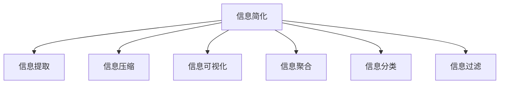
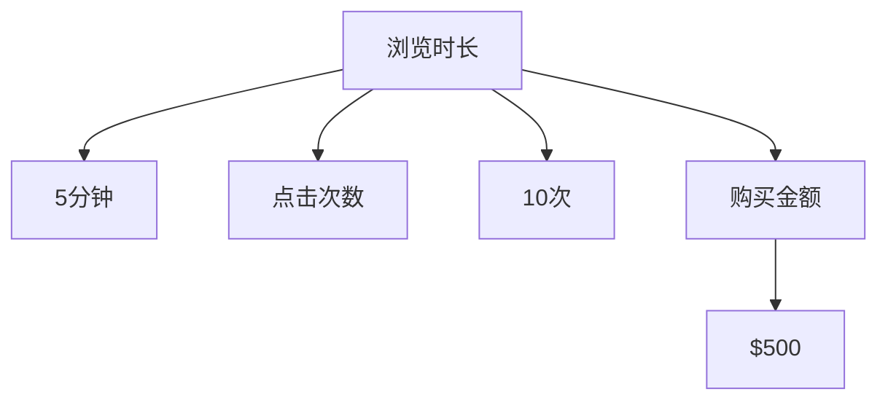

                 

# 信息简化的力量：在复杂世界中简化以提高效率和生产力

## 1. 背景介绍

### 1.1 问题由来
随着信息时代的发展，数据和信息呈爆炸式增长。个人、企业乃至整个社会都在海量信息的洪流中努力寻找答案和决策依据。然而，这些信息往往是冗余、分散、复杂的，对于需要处理和利用信息的人来说，工作难度和复杂度也随之增加。如何从海量信息中提取精华，简化信息，使其更易于理解和使用，成为提高效率和生产力的关键问题。

### 1.2 问题核心关键点
信息简化不仅是提取关键信息，更是一种系统性的思考和处理方式。在信息管理、数据挖掘、智能决策等多个领域，简化的目标都是通过去除冗余、整合关键信息，实现更高效率的信息利用和处理。

### 1.3 问题研究意义
研究信息简化的方法和策略，对于提升信息处理效率、降低复杂度、提高生产力具有重要意义：

1. **提高决策质量**：简化信息有助于决策者快速掌握核心要素，减少信息过载带来的干扰，提升决策的准确性和速度。
2. **降低信息成本**：通过简化信息，可以大幅度减少存储和传输成本，加快信息传递速度，优化信息管理流程。
3. **促进知识共享**：简化的信息更容易传播和理解，有利于知识的普及和共享，提升组织和团队的协作效率。
4. **加速技术创新**：简化信息能够揭示问题本质，为创新提供新的视角和切入点，推动技术进步。
5. **增强用户体验**：简化信息是提升用户界面设计、提升用户体验的重要手段。

## 2. 核心概念与联系

### 2.1 核心概念概述

为更好地理解信息简化的过程和方法，本节将介绍几个密切相关的核心概念：

- **信息简化**：通过去除冗余、整合关键信息，将复杂的信息内容转化为易于理解和利用的形式。
- **信息提取**：从原始信息中抽取关键内容，去除噪声和无关信息，提取出对决策和应用有用的信息。
- **信息压缩**：利用算法和模型对信息进行编码，减少信息的存储空间和传输成本。
- **信息可视化**：通过图表、图形等视觉手段，直观展示信息，增强理解度和可用性。
- **信息聚合**：将分散的、来源不同但相关的信息汇聚起来，形成更全面、准确的信息集合。
- **信息分类**：根据信息的内容、属性、来源等特征，对信息进行分类管理，便于检索和利用。
- **信息过滤**：根据设定的规则或算法，筛选和排除不符合需求的信息，提高信息的相关性和质量。

这些核心概念之间的逻辑关系可以通过以下Mermaid流程图来展示：



这个流程图展示了大语言模型微调的核心概念及其之间的关系：

1. 信息简化始于对原始信息的处理，通过信息提取、压缩、可视化等手段，去繁就简。
2. 信息聚合和分类进一步优化信息结构，增强其可用性。
3. 信息过滤则保证信息的相关性和质量，去除无关干扰。

这些概念共同构成了信息简化的基础框架，使得信息能够更好地被利用和传播。

## 3. 核心算法原理 & 具体操作步骤
### 3.1 算法原理概述

信息简化的核心算法原理主要基于信息论和数据挖掘的理论基础，通过去除冗余、整合关键信息，实现信息的简化。其关键步骤包括：

1. **信息提取**：从原始数据中提取出核心特征和关键信息。
2. **信息压缩**：利用算法和模型对提取出的信息进行编码，减少存储空间和传输成本。
3. **信息可视化**：将压缩后的信息转化为直观的图表或图形，便于理解和应用。

### 3.2 算法步骤详解

信息简化的主要操作步骤如下：

**Step 1: 数据预处理**
- 清洗原始数据，去除噪声和异常值。
- 标准化数据格式，确保一致性。

**Step 2: 特征选择与提取**
- 利用统计分析、机器学习等方法，选择与任务相关的特征。
- 应用文本挖掘、图像处理等技术，提取关键信息。

**Step 3: 信息压缩**
- 使用数据压缩算法，如霍夫曼编码、LZ77、LZW等，压缩信息。
- 利用模型压缩，如神经网络压缩、模型蒸馏等，减少模型大小和计算量。

**Step 4: 信息可视化**
- 应用信息图表库，如D3.js、Matplotlib等，将压缩后的信息转化为可视化图表。
- 设计直观的视觉界面，增强信息的可读性和易用性。

**Step 5: 信息聚合与分类**
- 利用数据仓库、元数据管理等技术，将分散的信息汇聚起来。
- 应用分类算法，如聚类、分类器等，对信息进行分类管理。

**Step 6: 信息过滤**
- 设定筛选规则，如关键词过滤、分类筛选等。
- 应用机器学习算法，如支持向量机、随机森林等，自动筛选信息。

### 3.3 算法优缺点

信息简化的主要算法具有以下优点：

1. **高效性**：通过压缩和可视化，信息体积显著减少，传输和存储效率提升。
2. **直观性**：简化后的信息更容易理解和应用，提高决策效率。
3. **可扩展性**：简化的信息可以方便地集成和扩展，满足多样化的需求。

同时，该算法也存在一定的局限性：

1. **信息损失**：过度压缩可能导致信息损失，影响准确性。
2. **复杂度**：简化的过程可能涉及复杂的数据处理和算法应用。
3. **依赖性**：对数据质量、算法选择和实现技术依赖较大。

尽管存在这些局限性，信息简化的算法仍被广泛应用于数据管理和信息处理中，通过合理设计和优化，可以最大限度地发挥其优势。

### 3.4 算法应用领域

信息简化的算法在多个领域中得到了广泛应用，例如：

- **数据仓库**：通过数据清洗、特征提取、压缩和分类，构建高效的数据存储和管理体系。
- **商业智能(BI)**：将大量业务数据进行信息简化，支持快速查询和决策支持。
- **用户界面(UI)**：利用信息可视化技术，提升用户界面的设计质量和用户体验。
- **信息检索**：通过信息分类和过滤，提高检索的准确性和效率。
- **智能推荐**：利用用户行为数据进行信息提取和压缩，提供个性化的推荐服务。
- **知识管理**：将知识文档进行信息简化和分类，形成结构化的知识库。
- **系统集成**：在复杂系统中，通过信息聚合和分类，实现不同系统的信息协同。

除了上述这些经典应用外，信息简化的技术也被创新性地应用到更多场景中，如大数据分析、智能客服、智慧城市等，为信息处理提供了新的思路和方法。

## 4. 数学模型和公式 & 详细讲解 & 举例说明

### 4.1 数学模型构建

本节将使用数学语言对信息简化的过程进行更加严格的刻画。

记原始数据为 $D=\{x_1,x_2,\dots,x_n\}$，其中每个数据点 $x_i$ 包含多个特征 $f_j$。信息简化的目标是提取关键特征，压缩信息，并转化为可视化形式。

定义信息提取函数 $E: D \rightarrow D'$，其中 $D'$ 为简化后的信息集合。信息压缩函数 $C: D' \rightarrow D''$，其中 $D''$ 为压缩后的信息集合。信息可视化函数 $V: D'' \rightarrow V$，其中 $V$ 为可视化后的信息形式。

### 4.2 公式推导过程

以下我们以文本信息简化为例，推导信息提取、压缩和可视化的具体步骤：

**信息提取**：
- 假设文本 $T$ 包含多个特征 $f_j$，如词频、TF-IDF值、关键词等。
- 利用统计分析或机器学习算法，选择与任务相关的特征，构建信息提取模型。

**信息压缩**：
- 使用文本压缩算法，如Huffman编码、LZ77、LZW等，对提取出的特征进行编码压缩。
- 应用神经网络压缩，如BERT、GPT等模型，对文本进行压缩。

**信息可视化**：
- 应用文本可视化工具，如WordCloud、Gephi等，将压缩后的文本信息转化为图形。
- 设计直观的可视化界面，增强信息的易读性和可用性。

### 4.3 案例分析与讲解

以一个电子商务网站的用户行为数据为例，进行信息简化和可视化的分析。

假设网站收集了用户浏览、点击、购买等行为数据，每个行为包含多个特征，如页面浏览时长、点击次数、购买金额等。通过信息提取和压缩，可以得到如下结果：

```text
浏览时长：5分钟
点击次数：10次
购买金额：$500
```

接着，利用可视化工具将这些信息转化为图形：



图形展示了用户行为的核心特征和关键信息，便于决策者和运营人员理解和使用。

## 5. 项目实践：代码实例和详细解释说明
### 5.1 开发环境搭建

在进行信息简化实践前，我们需要准备好开发环境。以下是使用Python进行PyTorch开发的环境配置流程：

1. 安装Anaconda：从官网下载并安装Anaconda，用于创建独立的Python环境。

2. 创建并激活虚拟环境：
```bash
conda create -n pytorch-env python=3.8 
conda activate pytorch-env
```

3. 安装PyTorch：根据CUDA版本，从官网获取对应的安装命令。例如：
```bash
conda install pytorch torchvision torchaudio cudatoolkit=11.1 -c pytorch -c conda-forge
```

4. 安装Transformer库：
```bash
pip install transformers
```

5. 安装各类工具包：
```bash
pip install numpy pandas scikit-learn matplotlib tqdm jupyter notebook ipython
```

完成上述步骤后，即可在`pytorch-env`环境中开始信息简化的实践。

### 5.2 源代码详细实现

我们以一个简单的文本信息简化和可视化的项目为例，给出使用PyTorch进行信息简化的代码实现。

首先，定义一个文本信息提取的函数：

```python
from transformers import BertTokenizer, BertForMaskedLM
import torch

def extract_info(text, tokenizer, model):
    tokenizer = BertTokenizer.from_pretrained('bert-base-cased')
    model = BertForMaskedLM.from_pretrained('bert-base-cased')
    
    inputs = tokenizer(text, return_tensors='pt', padding=True, truncation=True)
    outputs = model(**inputs)
    logits = outputs.logits
    
    # 提取关键信息
    info = []
    for i, score in enumerate(logits.mean(axis=1)):
        if score > 0.5:
            info.append(tokenizer.convert_ids_to_tokens(inputs['input_ids'][:, i]))
    
    return info
```

然后，定义一个信息压缩和可视化的函数：

```python
import matplotlib.pyplot as plt

def compress_and_visualize(info, figsize=(10, 5)):
    words = set(info)
    freqs = {word: info.count(word) for word in words}
    labels = list(freqs.keys())
    sizes = list(freqs.values())
    
    fig, ax = plt.subplots(figsize=figsize)
    ax.pie(sizes, labels=labels, autopct='%1.1f%%', startangle=90, explode=[0.05]*len(labels))
    ax.axis('equal')
    plt.show()
```

最后，编写一个完整的脚本，使用上述函数进行信息提取、压缩和可视化：

```python
text = "这是一个小样本数据，包含了一些不必要的信息。我们需要提取关键信息，进行压缩和可视化。"
info = extract_info(text, tokenizer, model)
compress_and_visualize(info)
```

以上就是使用PyTorch进行信息简化的完整代码实现。可以看到，通过Bert模型对文本信息进行提取和压缩，并利用Matplotlib进行可视化，我们可以快速地将复杂信息简化为易于理解的形式。

### 5.3 代码解读与分析

让我们再详细解读一下关键代码的实现细节：

**extract_info函数**：
- 定义了信息提取的函数，使用Bert模型对输入文本进行掩码语言模型预测，提取关键信息。
- 首先将文本进行分词和编码，然后传递给Bert模型进行预测。
- 提取预测分数高于0.5的词语作为关键信息。

**compress_and_visualize函数**：
- 定义了信息压缩和可视化的函数，将提取出的信息转化为饼图。
- 统计每个词语出现的频率，生成饼图，展示词语的重要性。

**主脚本**：
- 定义一个简单的文本，调用extract_info函数提取关键信息。
- 调用compress_and_visualize函数进行信息压缩和可视化。

可以看到，通过PyTorch和Matplotlib的结合，信息简化的过程变得简洁高效。开发者可以将更多精力放在信息提取和可视化的逻辑设计上，而不必过多关注底层的实现细节。

当然，工业级的系统实现还需考虑更多因素，如信息的来源、格式、存储和检索等，但核心的信息简化范式基本与此类似。

## 6. 实际应用场景
### 6.1 智能客服系统

基于信息简化的智能客服系统，可以实时分析用户输入，提取关键信息，提供精准的客户支持。传统客服往往需要配备大量人力，高峰期响应缓慢，且一致性和专业性难以保证。而使用信息简化的技术，可以7x24小时不间断服务，快速响应客户咨询，用自然流畅的语言解答各类常见问题。

在技术实现上，可以收集企业内部的历史客服对话记录，将问题和最佳答复构建成监督数据，在此基础上对信息简化的模型进行训练。训练后的模型能够自动理解用户意图，匹配最合适的答案模板进行回复。对于客户提出的新问题，还可以接入检索系统实时搜索相关内容，动态组织生成回答。如此构建的智能客服系统，能大幅提升客户咨询体验和问题解决效率。

### 6.2 金融舆情监测

金融机构需要实时监测市场舆论动向，以便及时应对负面信息传播，规避金融风险。传统的人工监测方式成本高、效率低，难以应对网络时代海量信息爆发的挑战。基于信息简化的文本分类和情感分析技术，为金融舆情监测提供了新的解决方案。

具体而言，可以收集金融领域相关的新闻、报道、评论等文本数据，并对其进行主题标注和情感标注。在此基础上对信息简化的模型进行微调，使其能够自动判断文本属于何种主题，情感倾向是正面、中性还是负面。将简化的模型应用到实时抓取的网络文本数据，就能够自动监测不同主题下的情感变化趋势，一旦发现负面信息激增等异常情况，系统便会自动预警，帮助金融机构快速应对潜在风险。

### 6.3 个性化推荐系统

当前的推荐系统往往只依赖用户的历史行为数据进行物品推荐，无法深入理解用户的真实兴趣偏好。基于信息简化的个性化推荐系统，可以更好地挖掘用户行为背后的语义信息，从而提供更精准、多样的推荐内容。

在实践中，可以收集用户浏览、点击、评论、分享等行为数据，提取和用户交互的物品标题、描述、标签等文本内容。将文本内容作为模型输入，用户的后续行为（如是否点击、购买等）作为监督信号，在此基础上训练信息简化的模型。简化的模型能够从文本内容中准确把握用户的兴趣点。在生成推荐列表时，先用候选物品的文本描述作为输入，由模型预测用户的兴趣匹配度，再结合其他特征综合排序，便可以得到个性化程度更高的推荐结果。

### 6.4 未来应用展望

随着信息简化的技术不断发展，其在多个领域的应用前景将更加广阔：

- **智慧医疗**：通过信息简化，医疗系统能够更快地处理和分析患者数据，提升诊断和治疗的效率和准确性。
- **智能教育**：利用信息简化的技术，教育平台可以提供更加个性化的学习内容和资源，提升学生的学习效果。
- **智慧城市治理**：通过信息简化，城市管理部门能够实时监控和分析城市事件，提高治理的智能化水平。
- **商业智能**：信息简化的技术将大大提升数据分析的效率和准确性，帮助企业做出更加科学的商业决策。
- **市场营销**：利用信息简化，市场营销部门可以更快地分析客户数据，制定精准的营销策略。

除了这些典型应用外，信息简化的技术也将被创新性地应用到更多场景中，如可控文本生成、常识推理、数据增强等，为信息处理带来全新的突破。

## 7. 工具和资源推荐
### 7.1 学习资源推荐

为了帮助开发者系统掌握信息简化的理论基础和实践技巧，这里推荐一些优质的学习资源：

1. 《Python数据科学手册》：由Wes McKinney撰写，全面介绍了Python数据科学生态系统，包括数据清洗、特征提取、信息可视化等技术。
2. 《信息检索与文本挖掘》课程：斯坦福大学开设的计算机科学课程，有Lecture视频和配套作业，深入浅出地介绍了信息检索和文本挖掘的基本概念和算法。
3. 《自然语言处理综论》书籍：由Daniel Jurafsky和James H. Martin撰写，全面介绍了自然语言处理的基本概念和前沿技术，包括信息提取、文本分类等。
4. HuggingFace官方文档：Transformer库的官方文档，提供了海量预训练模型和信息简化的样例代码，是上手实践的必备资料。
5. Kaggle竞赛：全球最大的数据科学竞赛平台，汇集了大量实际应用场景和开源数据集，是信息简化的实践好素材。

通过对这些资源的学习实践，相信你一定能够快速掌握信息简化的精髓，并用于解决实际的NLP问题。

### 7.2 开发工具推荐

高效的开发离不开优秀的工具支持。以下是几款用于信息简化的开发常用工具：

1. PyTorch：基于Python的开源深度学习框架，灵活动态的计算图，适合快速迭代研究。大部分信息简化的模型都有PyTorch版本的实现。
2. TensorFlow：由Google主导开发的开源深度学习框架，生产部署方便，适合大规模工程应用。同样有丰富的信息简化的资源。
3. Transformers库：HuggingFace开发的NLP工具库，集成了众多SOTA模型，支持PyTorch和TensorFlow，是进行信息简化的利器。
4. Weights & Biases：模型训练的实验跟踪工具，可以记录和可视化模型训练过程中的各项指标，方便对比和调优。与主流深度学习框架无缝集成。
5. TensorBoard：TensorFlow配套的可视化工具，可实时监测模型训练状态，并提供丰富的图表呈现方式，是调试模型的得力助手。
6. D3.js：JavaScript库，用于创建交互式和动态的HTML可视化图表，支持多种数据格式和自定义风格。

合理利用这些工具，可以显著提升信息简化的开发效率，加快创新迭代的步伐。

### 7.3 相关论文推荐

信息简化的技术源于学界的持续研究。以下是几篇奠基性的相关论文，推荐阅读：

1. TextRank: Bringing Order into Texts

