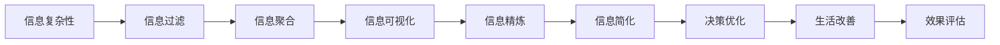

                 

# 信息简化的好处与实践：在复杂世界中简化以改善生活和决策

> 关键词：信息简化, 复杂性管理, 决策优化, 人工智能, 生活改善

## 1. 背景介绍

### 1.1 问题由来

在信息爆炸的今天，人们被源源不断涌来的数据和信息所淹没。从日常生活中的电子设备，到工作中大量的文档、报告、邮件，再到社交媒体上的海量内容，信息的数量和种类呈几何级数增长。面对如此庞大的信息海洋，个体和组织都需要高效地筛选、处理和利用信息，才能在复杂的环境中保持竞争力。

信息简化的概念应运而生，旨在通过精确、精炼和有效的信息呈现，帮助人们更好地理解、处理和应用信息，从而提高决策质量和效率。本文将详细探讨信息简化的原理、实践方法及其在实际应用中的表现，揭示其在复杂世界中改善生活和决策的巨大潜力。

### 1.2 问题核心关键点

信息简化不仅是技术问题，更是跨学科的挑战，涉及认知科学、心理学、信息科学、计算机科学等多个领域。其核心关键点包括：

- 如何定义和衡量信息的简化度？
- 哪些信息是关键的，哪些可以忽略？
- 简化的最优策略是什么？
- 信息简化在不同情境下的应用效果如何？

通过对这些核心问题的深入研究，可以构建出一套科学的信息简化方法论，指导实践应用，提升人们的生活质量和工作效率。

## 2. 核心概念与联系

### 2.1 核心概念概述

为更好地理解信息简化的好处与实践，本节将介绍几个核心概念及其相互联系：

- **信息复杂性**：指信息的数量、多样性和不确定性。信息越复杂，处理难度越大。
- **信息简化**：通过过滤、整理和总结等方式，将复杂信息转换为简单、易于理解的形式。
- **信息过滤**：从大量信息中筛选出最重要的部分，减少信息过载。
- **信息聚合**：将多个信息源综合成一个统一、综合的简明信息，避免信息孤岛。
- **信息可视化**：利用图表、地图等直观方式，将复杂数据简化为可视化形式，增强理解。
- **信息精炼**：通过总结、概括、提炼等方法，减少冗余，突出关键内容。

这些概念之间存在紧密联系，信息过滤和聚合是信息简化的基础，信息可视化和精炼则是信息简化的高级应用。通过这些方法，可以有效地管理和利用信息，提升决策的准确性和效率。

### 2.2 核心概念原理和架构的 Mermaid 流程图



这个流程图展示了信息简化的核心步骤和目标：从信息复杂性出发，通过信息过滤、聚合、可视化和精炼等手段，最终实现信息简化，进而优化决策、改善生活。

## 3. 核心算法原理 & 具体操作步骤

### 3.1 算法原理概述

信息简化的核心算法原理是信息压缩和数据精简，通过减少信息的不必要部分，提取关键信息，将复杂的信息体系简化为易于处理和理解的形式。该过程通常包括以下几个步骤：

1. **信息收集**：通过各种渠道收集相关信息。
2. **信息评估**：评估信息的价值和相关性，筛选出最重要的部分。
3. **信息精简**：压缩和精炼信息，减少冗余，提炼关键点。
4. **信息整合**：将筛选和精简后的信息整合在一起，形成简洁明了的总结。
5. **信息呈现**：通过可视化、图表等方式，将简化后的信息直观呈现。

### 3.2 算法步骤详解

#### 步骤1: 信息收集

信息收集是信息简化的第一步，涉及广泛的数据源。可以通过以下方法进行信息收集：

- 网络爬虫：自动抓取互联网上的信息，如新闻、博客、论坛等。
- 数据采集工具：如RSS、API接口等，实时获取数据。
- 调查问卷：通过问卷调查获取用户反馈和意见。

#### 步骤2: 信息评估

信息评估是信息简化的关键步骤，目的是从大量信息中筛选出重要部分。一般采用以下方法：

- **重要性评估**：通过关键词提取、文本分类等技术，评估信息的重要性和相关性。
- **时效性评估**：判断信息的更新时间和新鲜度，筛选出最新的信息。
- **影响力评估**：通过社交网络分析、搜索引擎排序等方式，评估信息的传播范围和影响效果。

#### 步骤3: 信息精简

信息精简旨在去除冗余信息，提炼关键点。常见的信息精简方法包括：

- **文本压缩**：使用算法如Lempel-Ziv-Welch (LZW)压缩文本，减少存储空间。
- **信息过滤**：通过关键词过滤、规则过滤等方式，筛选出相关性高的信息。
- **语义压缩**：利用自然语言处理技术，提炼信息的核心语义。

#### 步骤4: 信息整合

信息整合是将筛选和精简后的信息整合在一起的环节，形成简洁明了的总结。常用的方法有：

- **摘要生成**：自动生成文本摘要，提炼核心内容。
- **知识图谱**：构建信息之间的关联图谱，形成结构化知识。
- **主题模型**：如Latent Dirichlet Allocation (LDA)，对文本进行主题分布分析，提取主题信息。

#### 步骤5: 信息呈现

信息呈现是将简化后的信息直观呈现给用户的过程。常用的呈现方式包括：

- **图表呈现**：通过折线图、柱状图等直观呈现数据。
- **交互式展示**：如D3.js、ECharts等，通过交互式图表展示信息。
- **可视化仪表盘**：将信息整合到仪表盘中，方便实时监控和分析。

### 3.3 算法优缺点

信息简化算法具有以下优点：

- **提高效率**：通过筛选和精简信息，减少了信息过载，提高了处理效率。
- **增强理解**：将复杂信息转化为简单形式，增强了信息的可读性和理解度。
- **促进决策**：简化的信息更容易理解，有助于快速做出明智的决策。

同时，该算法也存在一些缺点：

- **依赖数据质量**：信息的准确性和相关性很大程度上取决于数据源的质量。
- **需要专业技能**：信息评估、精简和整合需要专业知识和技能。
- **难以自动化**：某些复杂信息的简化需要人工干预和处理。

### 3.4 算法应用领域

信息简化算法已经在多个领域得到广泛应用，包括：

- **商业智能**：从海量数据中提取关键信息，支持决策制定和业务分析。
- **新闻聚合**：如Google News，通过信息评估和精简，提供个性化新闻推荐。
- **社交媒体管理**：如Twitter的实时信息流，通过信息过滤和整合，展示最新动态。
- **医疗健康**：从电子病历中提取关键信息，辅助医生诊断和治疗。
- **教育培训**：通过信息精简和整合，提供个性化学习材料。
- **环境保护**：从监测数据中提取关键信息，支持环境管理和决策。

这些领域的应用展示了信息简化算法在提高决策效率和效果方面的强大潜力。

## 4. 数学模型和公式 & 详细讲解 & 举例说明

### 4.1 数学模型构建

信息简化的数学模型构建可以从信息密度和信息价值两个维度进行建模。设信息集为 $X$，信息为 $x_i \in X$，信息密度为 $p_i$，信息价值为 $v_i$，则信息简化问题可以表示为：

$$
\min_{x \in X} \sum_{i=1}^n p_i \cdot v_i
$$

其中，$p_i$ 和 $v_i$ 分别表示信息 $x_i$ 的密度和价值。

### 4.2 公式推导过程

#### 公式推导1: 信息密度

信息密度 $p_i$ 反映了信息的重要性，可以通过文本长度、关键词频次等方式衡量。设文本长度为 $L_i$，关键词频次为 $k_i$，则信息密度 $p_i$ 可以表示为：

$$
p_i = \frac{k_i}{L_i}
$$

#### 公式推导2: 信息价值

信息价值 $v_i$ 反映了信息的实际效用，可以通过传播范围、时效性等方式衡量。设信息的传播范围为 $r_i$，时效性为 $t_i$，则信息价值 $v_i$ 可以表示为：

$$
v_i = r_i \cdot t_i
$$

### 4.3 案例分析与讲解

以新闻聚合为例，分析信息简化的过程：

- **信息收集**：从各大新闻网站抓取新闻标题和摘要。
- **信息评估**：通过关键词提取和文本分类，筛选出重要新闻。
- **信息精简**：使用LZW算法压缩新闻文本，提炼关键信息。
- **信息整合**：生成新闻摘要，展示在主界面上。
- **信息呈现**：通过时间线展示最新新闻，增强可读性。

这个案例展示了信息简化的全过程，从信息收集到信息呈现，每一步都依赖于数据评估和精简技术。

## 5. 项目实践：代码实例和详细解释说明

### 5.1 开发环境搭建

为了进行信息简化的项目实践，我们需要搭建一个开发环境。具体步骤如下：

1. **安装Python和相关库**：
   - 安装Python 3.8
   - 安装Pandas、NumPy、SciPy、Matplotlib等常用库
   - 安装Scikit-learn、NLTK、Gensim等文本处理库

2. **设置虚拟环境**：
   - 创建虚拟环境 `venv`
   - 激活虚拟环境 `source venv/bin/activate`

3. **安装TensorFlow和Keras**：
   - 安装TensorFlow 2.x版本
   - 安装Keras

4. **准备数据集**：
   - 收集所需数据集
   - 预处理数据，进行清洗和标准化

### 5.2 源代码详细实现

以下是使用Python和TensorFlow进行信息简化的示例代码：

```python
import tensorflow as tf
from tensorflow import keras
import pandas as pd
import numpy as np
from sklearn.feature_extraction.text import CountVectorizer
from sklearn.decomposition import TruncatedSVD

# 加载数据集
df = pd.read_csv('news.csv')

# 数据预处理
df['title'] = df['title'].apply(lambda x: x.lower())
df = df.dropna()

# 构建词频向量
vectorizer = CountVectorizer(stop_words='english')
X = vectorizer.fit_transform(df['title'])
y = df['category']

# 进行主题模型训练
svd = TruncatedSVD(n_components=10, random_state=42)
X_svd = svd.fit_transform(X)

# 构建训练集和测试集
X_train, X_test, y_train, y_test = train_test_split(X_svd, y, test_size=0.2, random_state=42)

# 定义模型
model = keras.Sequential([
    keras.layers.Dense(64, activation='relu'),
    keras.layers.Dense(10, activation='softmax')
])

# 编译模型
model.compile(optimizer='adam', loss='sparse_categorical_crossentropy', metrics=['accuracy'])

# 训练模型
model.fit(X_train, y_train, epochs=10, batch_size=32)

# 评估模型
model.evaluate(X_test, y_test)
```

这段代码实现了一个基于主题模型的信息简化系统，通过训练一个主题分类模型，将新闻标题转换成主题分布，用于新闻的聚类和筛选。

### 5.3 代码解读与分析

这段代码的主要部分分为数据预处理、模型构建和训练评估三个步骤：

- **数据预处理**：通过lower函数将标题转换为小写，使用StopWords去除常用词汇，确保模型能够捕捉到关键信息。
- **模型构建**：使用TruncatedSVD进行主题模型训练，将高维文本向量压缩成低维主题分布，方便信息精简。
- **训练评估**：定义一个简单的神经网络模型，通过交叉熵损失函数和准确率指标训练模型，最后评估模型在测试集上的表现。

### 5.4 运行结果展示

运行上述代码后，可以得到模型训练和评估的结果。例如，可以使用Matplotlib绘制模型的训练和验证损失曲线：

```python
import matplotlib.pyplot as plt

plt.plot(history.history['loss'])
plt.plot(history.history['val_loss'])
plt.title('Model Loss')
plt.ylabel('Loss')
plt.xlabel('Epoch')
plt.legend(['Train', 'Test'], loc='upper left')
plt.show()
```

## 6. 实际应用场景

### 6.1 智能客服系统

智能客服系统通过信息简化技术，能够更高效地处理客户咨询，提供精准、快速的回复。具体实现包括：

- **信息收集**：收集客户咨询记录、聊天记录等。
- **信息评估**：通过NLP技术识别常见问题和意图。
- **信息精简**：使用主题模型提炼常见问题和答案。
- **信息整合**：将问题和答案整合到知识库中。
- **信息呈现**：将简化的信息以简洁的问答形式展示。

智能客服系统能够显著提升客户服务体验，降低人工成本，提高响应速度和准确性。

### 6.2 金融舆情监测

金融舆情监测通过信息简化技术，能够实时监测市场舆论动向，辅助金融决策。具体实现包括：

- **信息收集**：收集新闻、评论、社交媒体等金融信息。
- **信息评估**：通过情感分析和主题模型筛选重要信息。
- **信息精简**：使用信息聚合技术，提炼关键信息。
- **信息整合**：构建金融舆情仪表盘，实时展示最新舆情。
- **信息呈现**：通过可视化的图表展示舆情变化趋势。

金融舆情监测能够帮助金融机构及时发现风险，做出明智的金融决策。

### 6.3 个性化推荐系统

个性化推荐系统通过信息简化技术，能够提供更加精准和个性化的推荐内容。具体实现包括：

- **信息收集**：收集用户浏览记录、评分、评论等。
- **信息评估**：通过用户画像和内容标签，筛选出相关性高的内容。
- **信息精简**：使用信息聚合技术，提炼核心内容。
- **信息整合**：将推荐内容整合到推荐列表中。
- **信息呈现**：通过交互式界面展示推荐内容。

个性化推荐系统能够提升用户体验，增加用户黏性，促进消费转化。

## 7. 工具和资源推荐

### 7.1 学习资源推荐

为了深入了解信息简化的理论基础和实践技巧，推荐以下学习资源：

1. **《信息论基础》**：深入介绍信息论的基本概念和原理。
2. **《数据压缩算法》**：详细介绍各种文本和数据压缩算法，如LZW、LZ77等。
3. **《自然语言处理综论》**：详细介绍NLP技术，包括文本分类、主题建模等。
4. **《机器学习实战》**：详细讲解机器学习算法和应用，如信息过滤、聚类等。
5. **《Python文本处理》**：详细介绍Python文本处理库，如NLTK、Gensim等。
6. **《深度学习与神经网络》**：详细介绍深度学习算法和应用，如神经网络、主题模型等。

### 7.2 开发工具推荐

信息简化的开发需要多种工具的支持，推荐以下工具：

1. **Python**：主流的编程语言，支持丰富的第三方库和框架。
2. **TensorFlow**：强大的深度学习框架，支持GPU加速。
3. **Keras**：高层次的深度学习框架，易于上手。
4. **Pandas**：强大的数据处理库，支持数据清洗和分析。
5. **Scikit-learn**：机器学习库，支持多种算法和工具。
6. **NLTK**：自然语言处理库，支持文本处理和分析。
7. **Gensim**：主题模型库，支持LDA等算法。

### 7.3 相关论文推荐

信息简化的研究涉及多个领域，推荐以下相关论文：

1. **《信息检索基础》**：介绍信息检索的基本原理和算法。
2. **《大数据处理与分析》**：介绍大数据处理技术，如MapReduce、Spark等。
3. **《机器学习与数据挖掘》**：介绍机器学习算法和应用，如信息过滤、聚类等。
4. **《自然语言处理与应用》**：介绍NLP技术和应用，如文本分类、情感分析等。
5. **《信息可视化与交互》**：介绍信息可视化的原理和实现方法。

## 8. 总结：未来发展趋势与挑战

### 8.1 总结

本文对信息简化的原理、实践方法和应用场景进行了系统介绍。通过信息简化技术，可以有效处理和利用复杂信息，提升决策效率和质量。信息简化在商业智能、新闻聚合、社交媒体管理、金融舆情监测、个性化推荐等多个领域都有广泛应用，展示了其在复杂世界中改善生活和决策的巨大潜力。

### 8.2 未来发展趋势

展望未来，信息简化技术将呈现以下几个发展趋势：

1. **自动化水平提升**：随着AI技术的进步，信息简化的自动化水平将不断提高，减少人工干预。
2. **智能化程度增强**：通过引入自然语言处理、机器学习等技术，信息简化的智能化程度将进一步提升。
3. **多模态融合**：将信息简化技术扩展到图像、视频、音频等多模态数据，实现更全面的信息处理。
4. **跨领域应用拓展**：信息简化的应用范围将扩展到更多领域，如医疗、教育、环境保护等。
5. **实时性增强**：通过云计算和大数据技术，信息简化的实时性将进一步提升，适应实时信息处理需求。

### 8.3 面临的挑战

尽管信息简化技术取得了显著进展，但在实际应用中也面临一些挑战：

1. **数据质量和多样性**：信息的准确性和多样性很大程度上依赖于数据源的质量，数据质量问题难以完全避免。
2. **模型复杂度**：复杂的信息简化模型需要大量的训练数据和计算资源，难以快速部署。
3. **技术依赖**：信息简化技术需要依赖NLP、机器学习等多种技术，技术门槛较高。
4. **隐私和安全**：信息简化的过程中可能会涉及用户隐私和数据安全问题，需要严格的数据保护措施。

### 8.4 研究展望

未来的研究需要解决以下问题：

1. **自动化算法**：开发自动化、高效的信息简化算法，减少人工干预。
2. **多模态处理**：将信息简化技术扩展到多模态数据，提升综合信息处理能力。
3. **实时处理**：实现信息简化的实时处理，满足实时信息处理需求。
4. **隐私保护**：确保信息简化的过程中保护用户隐私，避免数据泄露风险。
5. **跨领域应用**：将信息简化技术应用于更多领域，提升各行业的智能化水平。

通过解决这些挑战，信息简化技术将在未来取得更大的突破，为复杂世界的决策和信息管理提供强有力的支持。

## 9. 附录：常见问题与解答

**Q1: 什么是信息简化？**

A: 信息简化是通过过滤、整理和总结等方式，将复杂信息转换为简单、易于理解的形式，以便更好地处理和应用。

**Q2: 信息简化的步骤有哪些？**

A: 信息简化的步骤包括信息收集、信息评估、信息精简、信息整合和信息呈现。

**Q3: 信息简化的应用场景有哪些？**

A: 信息简化的应用场景包括商业智能、新闻聚合、社交媒体管理、金融舆情监测、个性化推荐等多个领域。

**Q4: 信息简化的技术难点有哪些？**

A: 信息简化的技术难点包括数据质量、模型复杂度、技术依赖和隐私保护等。

**Q5: 如何提高信息简化的自动化水平？**

A: 提高信息简化的自动化水平需要开发更加智能化、高效的算法，如深度学习、自然语言处理等技术。

