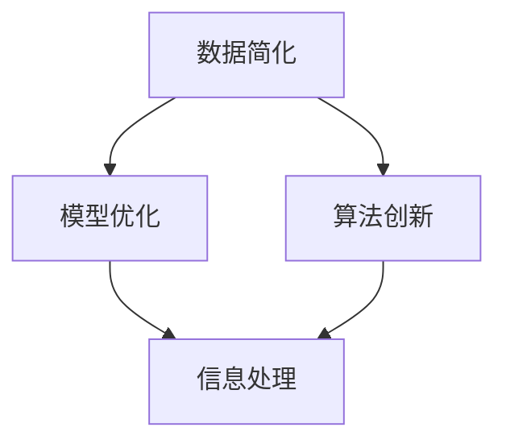

                 

# 信息简化的好处与挑战：在复杂世界中简化以改善决策和效率

## 1. 背景介绍

在当今信息爆炸的时代，数据和信息的种类、数量和来源不断增加，如何高效、准确地处理和利用这些信息，成为了各行各业面临的一大挑战。信息简化，即通过筛选、归纳、汇总等方法，将大量杂乱无章的数据转化为简洁、易懂的输出，不仅能够提高信息处理的效率，还能改善决策质量，助力企业实现业务转型和创新。

### 1.1 问题由来

数据和信息的复杂性体现在多个方面：

1. **数据量的爆炸**：大数据技术的发展使得数据采集和存储成本降低，各行各业积累的数据量呈指数级增长。例如，搜索引擎、社交媒体、物联网等平台每秒产生的数据量以GB级别计算，数据的海量特性使得处理变得更加复杂。

2. **数据类型的多样性**：除了传统的结构化数据，非结构化数据（如文本、图像、音频等）逐渐成为主流。这些数据的自然语言表达、复杂特征提取等问题，使得传统的数据处理方法难以直接适用。

3. **数据源的异构性**：不同数据源的语义、格式、质量参差不齐，数据融合和转换变得更加困难。如社交媒体上的评论信息、电商平台的商品评价、金融市场的数据报告等，数据源的异构性增加了数据处理的复杂度。

4. **数据质量的波动**：数据的真实性、完整性和一致性难以保证，误标注、噪声数据等问题对模型的训练和应用产生影响。例如，一些机器学习模型在未处理的低质量数据上训练，可能无法达到预期的效果。

### 1.2 问题核心关键点

要解决上述问题，需要从数据简化、模型优化和算法创新三个方面入手：

1. **数据简化**：通过数据清洗、特征工程、数据转换等技术手段，对原始数据进行预处理，提高数据质量。
2. **模型优化**：利用先进的算法和模型架构，提高模型的泛化能力和鲁棒性。
3. **算法创新**：开发新型的算法和技术，提升信息处理的效率和效果。

## 2. 核心概念与联系

### 2.1 核心概念概述

信息简化的核心概念包括数据简化、模型优化和算法创新，这些概念之间相互关联、相互作用，共同推动了信息处理技术的发展。

1. **数据简化**：指通过数据清洗、特征选择、数据转换等技术手段，将原始数据转化为结构化、标准化、高质量的数据，便于后续的处理和分析。

2. **模型优化**：通过选择合适的模型架构、优化算法和超参数，提升模型的性能和泛化能力，以应对复杂多变的数据环境。

3. **算法创新**：开发新的算法和技术，如自然语言处理、图像识别、推荐系统等，适应不同类型的非结构化数据处理需求。

这些核心概念之间的逻辑关系可以通过以下Mermaid流程图来展示：



这个流程图展示了数据简化、模型优化和算法创新之间的关系：

1. 数据简化通过清洗、选择、转换等手段，为后续的信息处理提供高质量的数据基础。
2. 模型优化通过选择合适的模型和优化算法，提升信息处理的效率和效果。
3. 算法创新开发新的技术和方法，为数据处理和信息分析提供更强大的支持。

## 3. 核心算法原理 & 具体操作步骤
### 3.1 算法原理概述

信息简化技术主要包括数据清洗、特征选择、数据转换、模型优化、算法创新等环节。这些环节通过不同的算法和技术手段，实现对原始数据的简化处理。

1. **数据清洗**：通过去除噪声数据、处理缺失值、异常值等技术手段，提高数据的质量和可靠性。
2. **特征选择**：通过特征提取、降维、选择等方法，对原始数据进行特征工程，减少冗余信息，提升模型的泛化能力。
3. **数据转换**：通过数据标准化、归一化、编码等方法，将不同格式和类型的数据进行转换，便于后续处理。
4. **模型优化**：通过选择合适的模型架构、优化算法和超参数，提升模型的泛化能力和鲁棒性。
5. **算法创新**：开发新的算法和技术，如深度学习、强化学习、自然语言处理等，适应不同类型的非结构化数据处理需求。

### 3.2 算法步骤详解

以下以深度学习中的数据预处理为例，详细介绍信息简化的详细步骤：

1. **数据清洗**：
   - 去除噪声数据：通过异常值检测、缺失值填充等技术，去除数据中的异常点和缺失值。
   - 处理缺失值：采用插值法、均值填补等方法，处理数据中的缺失值。
   - 异常值检测：通过统计分析、算法检测等手段，识别和处理异常值。

2. **特征选择**：
   - 特征提取：使用PCA、SVD等降维技术，提取数据的潜在特征。
   - 特征降维：通过主成分分析、线性判别分析等方法，对特征进行降维处理，减少冗余信息。
   - 特征选择：使用特征选择算法（如LASSO、RFE等），选择最具代表性的特征。

3. **数据转换**：
   - 数据标准化：将数据转化为标准正态分布，便于后续处理。
   - 数据归一化：对数据进行归一化处理，使不同特征的范围一致。
   - 数据编码：将分类变量进行编码，转化为模型能够处理的数值型数据。

4. **模型优化**：
   - 选择合适的模型架构：如卷积神经网络（CNN）、循环神经网络（RNN）、Transformer等，根据任务特点选择合适的模型。
   - 优化算法：如梯度下降、Adam、Adagrad等，通过调整学习率、动量等参数，优化模型训练过程。
   - 超参数调整：通过网格搜索、贝叶斯优化等方法，调整模型的超参数，提升模型性能。

5. **算法创新**：
   - 开发新型的算法和技术，如自然语言处理、图像识别、推荐系统等，适应不同类型的非结构化数据处理需求。

### 3.3 算法优缺点

信息简化技术具有以下优点：

1. **提高数据质量**：通过数据清洗、特征选择等手段，提高数据质量和可靠性。
2. **提升模型性能**：通过优化模型架构和算法，提升模型的泛化能力和鲁棒性。
3. **减少计算成本**：通过特征选择和降维等技术，减少计算量和存储空间，提高计算效率。

同时，信息简化技术也存在一些缺点：

1. **数据损失风险**：在数据清洗和特征选择过程中，可能会丢失部分重要信息，影响模型性能。
2. **过度简化风险**：过度简化数据可能导致模型泛化能力下降，无法处理复杂数据。
3. **算法复杂性**：开发和维护新的算法和技术，需要较高的技术水平和资源投入。

### 3.4 算法应用领域

信息简化技术广泛应用于各个领域，包括但不限于以下几个方面：

1. **金融领域**：通过数据清洗和特征选择，提升金融模型的准确性和可靠性，降低金融风险。
2. **医疗领域**：通过数据预处理和模型优化，提升医疗诊断和治疗的准确性和效率。
3. **电商领域**：通过用户行为数据处理和推荐系统，提升个性化推荐效果，提高用户满意度。
4. **智能制造领域**：通过设备数据处理和异常检测，提升生产效率和设备健康监测能力。
5. **物联网领域**：通过传感器数据处理和模型优化，提升物联网系统的数据处理能力和智能决策水平。

## 4. 数学模型和公式 & 详细讲解 & 举例说明

### 4.1 数学模型构建

信息简化技术涉及多个数学模型和公式。以下以深度学习中的数据预处理为例，详细介绍数学模型构建过程。

设原始数据集为 $D=\{(x_i,y_i)\}_{i=1}^N$，其中 $x_i$ 为输入特征，$y_i$ 为标签。

### 4.2 公式推导过程

1. **数据清洗**：
   - 噪声数据检测：$\sigma(x_i)$ 表示数据 $x_i$ 的标准差，$\sigma_{th}$ 表示噪声阈值。
     $$
     n_i = \begin{cases}
     1, & \sigma(x_i) > \sigma_{th} \\
     0, & \sigma(x_i) \leq \sigma_{th}
     \end{cases}
     $$
   - 缺失值处理：$x_i$ 缺失值处理方法为均值填补，即 $\hat{x}_i = \frac{1}{n} \sum_{j=1}^n x_j$。
     $$
     \hat{x}_i = \begin{cases}
     x_i, & n_i = 1 \\
     \frac{1}{n} \sum_{j=1}^n x_j, & n_i = 0
     \end{cases}
     $$

2. **特征选择**：
   - 特征提取：通过主成分分析（PCA）方法，选择最具代表性的特征。
     $$
     U,\Sigma,V = SVD(X)
     $$
   - 特征降维：通过线性判别分析（LDA）方法，对特征进行降维处理。
     $$
     S = \begin{bmatrix}
     \lambda_1 & 0 \\
     0 & \lambda_2
     \end{bmatrix}
     $$
   - 特征选择：通过LASSO回归等方法，选择最具代表性的特征。
     $$
     \beta = \arg\min_{\beta} \frac{1}{2}\|y-X\beta\|^2 + \lambda\|\beta\|_1
     $$

3. **数据转换**：
   - 数据标准化：$x_i$ 的标准化公式为 $z_i = \frac{x_i-\mu}{\sigma}$。
   - 数据归一化：$x_i$ 的归一化公式为 $\tilde{x}_i = \frac{x_i}{\max_x x}$。
   - 数据编码：分类变量 $c_i$ 的编码方法为 $\tilde{c}_i = one\_hot\_vector(c_i)$。

4. **模型优化**：
   - 选择合适的模型架构：如卷积神经网络（CNN）、循环神经网络（RNN）、Transformer等。
   - 优化算法：如梯度下降、Adam、Adagrad等，通过调整学习率、动量等参数，优化模型训练过程。
   - 超参数调整：通过网格搜索、贝叶斯优化等方法，调整模型的超参数。

### 4.3 案例分析与讲解

**案例：电商个性化推荐系统**

电商个性化推荐系统通过分析用户的历史行为数据，推荐用户可能感兴趣的商品。在构建推荐系统时，需要进行数据清洗、特征选择、模型优化和算法创新。

1. **数据清洗**：去除用户行为数据中的异常点和缺失值，处理噪声数据。
2. **特征选择**：选择用户的行为特征（如浏览时间、浏览次数、购买次数等）和商品的属性特征（如价格、评分、类别等）。
3. **模型优化**：选择合适的模型架构（如深度神经网络）和优化算法（如Adam），优化模型参数。
4. **算法创新**：开发新的推荐算法（如基于协同过滤的算法、基于深度学习的推荐系统等），提升推荐效果。

## 5. 项目实践：代码实例和详细解释说明

### 5.1 开发环境搭建

在进行信息简化实践前，我们需要准备好开发环境。以下是使用Python进行TensorFlow开发的环境配置流程：

1. 安装Anaconda：从官网下载并安装Anaconda，用于创建独立的Python环境。

2. 创建并激活虚拟环境：
```bash
conda create -n tf-env python=3.8 
conda activate tf-env
```

3. 安装TensorFlow：根据CUDA版本，从官网获取对应的安装命令。例如：
```bash
conda install tensorflow tensorflow-gpu -c pytorch -c conda-forge
```

4. 安装各类工具包：
```bash
pip install numpy pandas scikit-learn matplotlib tqdm jupyter notebook ipython
```

完成上述步骤后，即可在`tf-env`环境中开始信息简化实践。

### 5.2 源代码详细实现

以下以电商个性化推荐系统为例，给出使用TensorFlow对数据进行预处理的PyTorch代码实现。

首先，定义数据处理函数：

```python
import numpy as np
import pandas as pd
import tensorflow as tf

def load_data(file_path):
    data = pd.read_csv(file_path)
    return data

def preprocess_data(data):
    # 数据清洗
    data.dropna(inplace=True)
    data = data[data['user_id'].notnull()]

    # 特征选择
    data = data.drop(['user_id', 'item_id'], axis=1)
    data = pd.get_dummies(data)

    # 数据转换
    data = (data - data.mean()) / data.std()
    return data
```

然后，定义模型和优化器：

```python
from tensorflow.keras.layers import Input, Dense
from tensorflow.keras.models import Model
from tensorflow.keras.optimizers import Adam

def build_model(input_shape):
    input_layer = Input(shape=input_shape)
    hidden_layer = Dense(64, activation='relu')(input_layer)
    output_layer = Dense(1, activation='sigmoid')(hidden_layer)
    model = Model(input_layer, output_layer)
    optimizer = Adam(lr=0.001)
    return model

def train_model(model, data, epochs=10):
    model.compile(optimizer=optimizer, loss='binary_crossentropy', metrics=['accuracy'])
    model.fit(data, epochs=epochs)
```

接着，启动训练流程：

```python
data = load_data('data.csv')
data = preprocess_data(data)

input_shape = data.shape[1]
model = build_model(input_shape)
train_model(model, data)
```

以上就是使用TensorFlow对电商个性化推荐系统进行数据预处理的完整代码实现。可以看到，TensorFlow的高级API使得数据预处理过程变得简洁高效。

### 5.3 代码解读与分析

让我们再详细解读一下关键代码的实现细节：

**load_data函数**：
- 从指定路径读取数据，并返回DataFrame对象。

**preprocess_data函数**：
- 数据清洗：通过`dropna`方法去除缺失值，保留有效的用户和商品数据。
- 特征选择：通过`drop`方法去除用户ID和商品ID，使用`get_dummies`方法生成哑变量。
- 数据转换：通过`(数据-均值)/标准差`方法进行标准化处理。

**build_model函数**：
- 定义模型架构：输入层、隐藏层和输出层。
- 定义优化器：Adam优化器，学习率为0.001。

**train_model函数**：
- 定义模型编译：优化器、损失函数和评估指标。
- 训练模型：使用`fit`方法进行训练，指定训练轮数。

**启动训练流程**：
- 加载数据
- 预处理数据
- 构建模型
- 训练模型

## 6. 实际应用场景

### 6.1 智能客服系统

智能客服系统通过自然语言处理和信息简化技术，实现自动回答用户咨询，提升客服效率和用户体验。系统通过收集历史客服对话记录，提取问题-回答对，使用深度学习模型进行训练，并在微调过程中不断优化模型，使其能够更准确地理解用户意图，生成符合语境的回答。

### 6.2 金融舆情监测

金融舆情监测系统通过信息简化技术，实时监控和分析金融市场舆情，预测市场趋势，辅助金融决策。系统收集金融领域的各种文本数据，使用自然语言处理技术提取关键信息，并通过模型优化和算法创新，提升舆情监测的准确性和时效性。

### 6.3 个性化推荐系统

个性化推荐系统通过信息简化技术，提升推荐效果，满足用户个性化需求。系统通过分析用户行为数据，使用降维技术和模型优化，提高推荐算法的性能，提升推荐效果。

### 6.4 未来应用展望

随着信息简化技术的不断发展，其在各个领域的应用将更加广泛和深入。未来，信息简化技术将朝着以下几个方向发展：

1. **自动化水平提升**：通过自动化数据清洗和特征选择，减少人工干预，提升信息处理效率。
2. **多模态融合**：将文本、图像、音频等多模态数据进行融合，提升信息的全面性和准确性。
3. **智能决策支持**：将信息简化技术与其他人工智能技术（如因果推理、强化学习等）进行融合，提升决策支持和智能决策能力。
4. **实时性和可扩展性**：通过分布式计算和大数据技术，提升信息处理的实时性和可扩展性。

## 7. 工具和资源推荐

### 7.1 学习资源推荐

为了帮助开发者系统掌握信息简化技术，这里推荐一些优质的学习资源：

1. 《深度学习入门》系列书籍：深入浅出地介绍了深度学习的原理和实践，包括数据预处理和模型优化等内容。
2. Coursera《机器学习》课程：由斯坦福大学开设的机器学习课程，涵盖数据清洗、特征选择、模型优化等内容。
3. Kaggle数据科学竞赛：提供丰富的数据集和竞赛题目，练习信息简化和数据分析技能。
4. GitHub开源项目：浏览和学习优秀的信息简化和数据分析开源项目，获取实际应用经验。
5. 知乎技术问答：关注知乎上的技术问答，学习其他开发者的实践经验和解决方案。

通过对这些资源的学习实践，相信你一定能够快速掌握信息简化技术的精髓，并用于解决实际的信息处理问题。

### 7.2 开发工具推荐

高效的开发离不开优秀的工具支持。以下是几款用于信息简化开发的常用工具：

1. Python：广泛用于数据科学和人工智能领域，丰富的库和框架支持信息简化开发。
2. TensorFlow：谷歌主导的开源深度学习框架，支持复杂的模型和算法，适用于大数据和分布式计算。
3. PyTorch：Facebook主导的开源深度学习框架，灵活的动态计算图，适用于研究实验和快速迭代。
4. Scikit-learn：Python的机器学习库，支持常用的数据预处理和模型优化算法。
5. Weights & Biases：模型训练的实验跟踪工具，可以记录和可视化模型训练过程中的各项指标，方便对比和调优。
6. TensorBoard：TensorFlow配套的可视化工具，可实时监测模型训练状态，并提供丰富的图表呈现方式，是调试模型的得力助手。

合理利用这些工具，可以显著提升信息简化任务的开发效率，加快创新迭代的步伐。

### 7.3 相关论文推荐

信息简化技术的发展源于学界的持续研究。以下是几篇奠基性的相关论文，推荐阅读：

1. 《Data Cleaning in Data Mining》：详细介绍了数据清洗技术的基本原理和常用方法。
2. 《Feature Selection: A Survey》：总结了特征选择技术的各种方法和应用场景。
3. 《Deep Learning for Recommender Systems》：探讨了深度学习在推荐系统中的应用和优化方法。
4. 《Natural Language Processing with Transformers》：介绍了Transformer架构在自然语言处理中的应用和优势。
5. 《Model-based Recommendation Systems》：讨论了基于模型的推荐系统架构和优化方法。

这些论文代表了大数据和人工智能领域的发展脉络。通过学习这些前沿成果，可以帮助研究者把握学科前进方向，激发更多的创新灵感。

## 8. 总结：未来发展趋势与挑战

### 8.1 总结

本文对信息简化技术进行了全面系统的介绍。首先阐述了信息简化的背景和意义，明确了其在提高数据质量和改善决策方面的独特价值。其次，从原理到实践，详细讲解了信息简化的数学模型和操作步骤，给出了具体的代码实例。同时，本文还广泛探讨了信息简化技术在各个领域的应用前景，展示了其在智能客服、金融舆情、个性化推荐等多个行业领域的应用潜力。此外，本文精选了信息简化技术的各类学习资源，力求为读者提供全方位的技术指引。

通过本文的系统梳理，可以看到，信息简化技术正在成为各行各业提高信息处理效率、改善决策质量的重要手段。未来，伴随数据量的持续增长和数据类型的不断丰富，信息简化技术将发挥更大的作用，进一步推动各行各业的智能化转型。

### 8.2 未来发展趋势

展望未来，信息简化技术将呈现以下几个发展趋势：

1. **自动化水平提升**：通过自动化数据清洗和特征选择，减少人工干预，提升信息处理效率。
2. **多模态融合**：将文本、图像、音频等多模态数据进行融合，提升信息的全面性和准确性。
3. **智能决策支持**：将信息简化技术与其他人工智能技术（如因果推理、强化学习等）进行融合，提升决策支持和智能决策能力。
4. **实时性和可扩展性**：通过分布式计算和大数据技术，提升信息处理的实时性和可扩展性。
5. **跨领域应用**：信息简化技术将逐步应用于各个领域，如医疗、金融、电商等，推动各行业的智能化转型。

### 8.3 面临的挑战

尽管信息简化技术已经取得了显著进展，但在迈向更加智能化、普适化应用的过程中，它仍面临诸多挑战：

1. **数据质量保障**：数据清洗和特征选择过程中，可能存在数据丢失和信息损失的风险。如何保证数据质量和完整性，仍然是一个难题。
2. **算法复杂性**：信息简化涉及多种算法和技术，开发和维护新的算法和技术，需要较高的技术水平和资源投入。
3. **实时性问题**：在大规模数据处理和复杂模型训练中，如何提高实时性和响应速度，仍然是一个挑战。
4. **跨领域适应性**：信息简化技术在不同领域的应用中，如何保持其适应性和普适性，是一个重要的研究方向。
5. **鲁棒性和泛化能力**：信息简化过程中，如何提高模型的鲁棒性和泛化能力，避免过拟合和数据泄露，仍需进一步研究。

### 8.4 研究展望

面对信息简化技术面临的挑战，未来的研究需要在以下几个方面寻求新的突破：

1. **自动化数据清洗和特征选择**：开发更加自动化和智能化的数据预处理工具，减少人工干预，提升信息处理效率。
2. **多模态信息融合**：研究如何将文本、图像、音频等多种数据类型进行融合，提升信息的全面性和准确性。
3. **跨领域应用**：研究如何将信息简化技术在其他领域进行应用，推动各行各业的智能化转型。
4. **智能决策支持**：结合因果推理、强化学习等技术，提升决策支持和智能决策能力。
5. **鲁棒性和泛化能力**：研究如何提高模型的鲁棒性和泛化能力，避免过拟合和数据泄露。

这些研究方向的探索，将进一步推动信息简化技术的发展，为各行各业提供更加智能和高效的信息处理解决方案。总之，信息简化技术需要通过不断创新和优化，才能更好地适应复杂多变的现实世界，推动人工智能技术的普及和应用。

## 9. 附录：常见问题与解答

**Q1：信息简化过程中如何处理数据丢失和信息损失？**

A: 数据丢失和信息损失是信息简化过程中常见的问题。以下是一些应对方法：
- 数据清洗：通过异常值检测和缺失值填补，去除噪声数据和处理缺失值。
- 特征选择：通过特征选择算法（如LASSO、RFE等），选择最具代表性的特征，减少冗余信息。
- 数据增强：通过数据增强技术（如数据扩充、重采样等），增加训练数据的多样性和数量。
- 模型优化：通过选择合适的模型和优化算法，提升模型的泛化能力和鲁棒性。

**Q2：如何平衡信息简化的效率和效果？**

A: 在信息简化过程中，效率和效果是一对矛盾。以下是一些平衡方法：
- 选择合适的算法和技术：根据数据类型和任务特点，选择最适合的算法和技术。
- 合理设置超参数：通过网格搜索、贝叶斯优化等方法，调整超参数，优化算法效果。
- 采用分布式计算：通过分布式计算和并行处理，提高信息处理的效率。
- 自动化数据处理：通过自动化数据清洗和特征选择，减少人工干预，提升信息处理效率。

**Q3：如何处理大规模数据的信息简化？**

A: 大规模数据的信息简化需要考虑以下方法：
- 分布式计算：使用分布式计算框架（如Spark、Hadoop等），处理大规模数据集。
- 数据分块处理：将数据集分成多个小块，并行处理每个块，提高处理速度。
- 数据采样：通过随机采样和分层采样，减少数据量，提高处理效率。
- 优化模型架构：选择高效的模型架构（如卷积神经网络、Transformer等），提升信息处理的效率。

**Q4：如何保证信息简化的跨领域适应性？**

A: 保证信息简化的跨领域适应性，需要考虑以下方法：
- 数据预处理：在不同领域的数据预处理中，使用统一的标准和方法，减少数据转换带来的误差。
- 特征选择：根据不同领域的特点，选择最具代表性的特征，减少信息丢失。
- 模型优化：在不同领域中，使用通用的模型架构和优化算法，提升模型的适应性和泛化能力。
- 多模态融合：结合文本、图像、音频等多模态数据，提升信息的全面性和准确性。

通过以上方法，可以更好地保证信息简化的跨领域适应性，推动其在不同领域的应用和普及。

**Q5：信息简化技术的未来展望是什么？**

A: 信息简化技术的未来展望包括以下几个方面：
- 自动化水平提升：通过自动化数据清洗和特征选择，减少人工干预，提升信息处理效率。
- 多模态融合：将文本、图像、音频等多种数据类型进行融合，提升信息的全面性和准确性。
- 智能决策支持：将信息简化技术与其他人工智能技术（如因果推理、强化学习等）进行融合，提升决策支持和智能决策能力。
- 实时性和可扩展性：通过分布式计算和大数据技术，提升信息处理的实时性和可扩展性。
- 跨领域应用：信息简化技术将逐步应用于各个领域，如医疗、金融、电商等，推动各行业的智能化转型。

通过不断创新和优化，信息简化技术将更加智能和高效，为各行各业提供更加智能和高效的信息处理解决方案。

