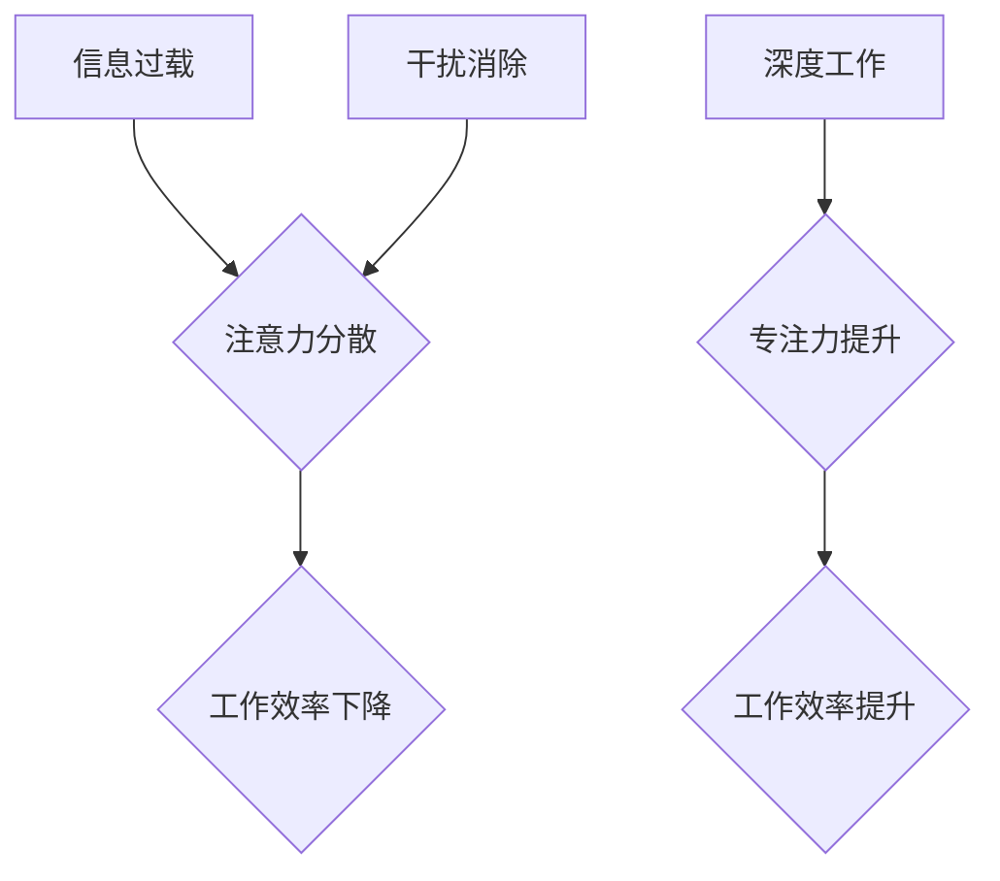

                 

## 信息时代的注意力管理挑战与策略：在充满干扰的环境中保持专注

> 关键词：注意力管理、信息过载、专注力、深度工作、干扰消除、认知增强、时间管理、效率提升、数字工具

### 1. 背景介绍

在当今信息爆炸的时代，我们被来自各个方向的海量信息所包围。电子邮件、社交媒体、即时通讯、新闻推送等各种信息源源不断地涌入，争夺着我们的注意力。这种信息过载状态使得专注力成为稀缺资源，我们难以长时间沉浸在深度思考和创造性工作中。

注意力管理已成为当今社会面临的重大挑战，它直接影响着我们的工作效率、学习成果、个人幸福感以及社会整体的进步。 

### 2. 核心概念与联系

#### 2.1  注意力机制

注意力机制是近年来深度学习领域取得的重要突破，它模拟了人类大脑在处理信息时选择性关注特定部分的能力。注意力机制通过赋予不同输入元素不同的权重，从而突出重要信息，抑制无关信息，提高模型的学习效率和准确性。

#### 2.2  信息过载与干扰

信息过载是指在短时间内接收和处理大量信息的能力超负荷，导致认知疲劳、注意力分散、决策困难等问题。干扰是指任何阻碍我们专注于目标任务的因素，包括外部环境的噪音、社交媒体的通知、内部思绪的游离等。

#### 2.3  深度工作与专注力

深度工作是指在不受干扰的环境中，专注于一项重要任务，投入大量时间和精力进行思考、创造和解决问题。深度工作是提高效率、提升创造力和获得成就感的重要途径。

**Mermaid 流程图**



### 3. 核心算法原理 & 具体操作步骤

#### 3.1  算法原理概述

注意力机制的算法原理主要基于以下几个方面：

* **注意力权重:** 为每个输入元素分配一个权重，表示其对目标任务的 relevance。
* **注意力计算:** 使用注意力函数计算每个元素的注意力权重。
* **上下文表示:** 根据注意力权重，将输入元素加权求和，得到上下文表示。

#### 3.2  算法步骤详解

1. **输入数据:** 将待处理的信息作为输入数据。
2. **特征提取:** 对输入数据进行特征提取，例如词向量、图像特征等。
3. **注意力计算:** 使用注意力函数计算每个元素的注意力权重。常用的注意力函数包括 softmax 函数、Scaled Dot-Product Attention 等。
4. **上下文表示:** 根据注意力权重，将输入元素加权求和，得到上下文表示。
5. **输出结果:** 将上下文表示作为输出，用于后续的处理任务。

#### 3.3  算法优缺点

**优点:**

* **提高效率:** 通过选择性关注重要信息，提高模型的学习效率和准确性。
* **增强表达能力:** 可以学习到更丰富的上下文信息，提升模型的表达能力。
* **解释性强:** 注意力权重可以直观地反映模型对输入信息的关注程度，提高模型的解释性。

**缺点:**

* **计算复杂度高:** 计算注意力权重需要大量的计算资源。
* **参数量大:** 注意力机制通常需要大量的参数，训练成本较高。
* **可解释性有限:** 尽管注意力权重可以提供一些解释，但模型的整体决策过程仍然难以完全理解。

#### 3.4  算法应用领域

注意力机制在自然语言处理、计算机视觉、语音识别等领域都有广泛的应用，例如:

* **机器翻译:** 关注源语言和目标语言的关键词，提高翻译质量。
* **文本摘要:** 关注文本中最关键的信息，生成简洁的摘要。
* **图像识别:** 关注图像中最显著的特征，提高识别准确率。

### 4. 数学模型和公式 & 详细讲解 & 举例说明

#### 4.1  数学模型构建

注意力机制的数学模型通常基于以下公式：

* **注意力权重:**

$$
\alpha_{i} = \frac{exp(e_{i})}{\sum_{j=1}^{n} exp(e_{j})}
$$

其中，$e_{i}$ 表示输入元素 $i$ 的注意力得分，$n$ 表示输入元素的总数。

* **上下文表示:**

$$
c = \sum_{i=1}^{n} \alpha_{i} x_{i}
$$

其中，$x_{i}$ 表示输入元素 $i$ 的值，$c$ 表示上下文表示。

#### 4.2  公式推导过程

注意力权重公式使用 softmax 函数将每个元素的注意力得分归一化，使得权重之和为 1。上下文表示公式则通过加权求和，将输入元素的信息融合在一起，得到一个更丰富的上下文表示。

#### 4.3  案例分析与讲解

例如，在机器翻译任务中，注意力机制可以帮助模型关注源语言和目标语言的关键词，从而提高翻译质量。

假设源语言句子为 "The cat sat on the mat"，目标语言为 "猫坐在垫子上"。注意力机制可以将源语言中的 "cat" 和 "sat" 赋予更高的注意力权重，因为这些词语是翻译目标的关键信息。

### 5. 项目实践：代码实例和详细解释说明

#### 5.1  开发环境搭建

* Python 3.x
* TensorFlow 或 PyTorch

#### 5.2  源代码详细实现

```python
import tensorflow as tf

# 定义注意力机制
def attention_layer(inputs, query, key, value, mask=None):
    # 计算注意力权重
    scores = tf.matmul(query, key, transpose_b=True)
    if mask is not None:
        scores += (mask * -1e9)
    attention_weights = tf.nn.softmax(scores, axis=-1)
    # 计算上下文表示
    context = tf.matmul(attention_weights, value)
    return context, attention_weights

# 示例代码
inputs = tf.random.normal((10, 50))
query = tf.random.normal((10, 10))
key = tf.random.normal((10, 50))
value = tf.random.normal((10, 50))

context, attention_weights = attention_layer(inputs, query, key, value)

print(context.shape)
print(attention_weights.shape)
```

#### 5.3  代码解读与分析

* `attention_layer` 函数定义了注意力机制的计算过程。
* `scores` 计算了 query 和 key 之间的相似度。
* `attention_weights` 使用 softmax 函数将相似度转换为注意力权重。
* `context` 计算了上下文表示。

#### 5.4  运行结果展示

运行代码后，会输出 context 和 attention_weights 的形状，验证注意力机制的正确性。

### 6. 实际应用场景

#### 6.1  工作效率提升

* **番茄工作法:** 利用定时器和休息时间，专注于一项任务，避免信息过载和干扰。
* **深度工作时间段:** 设定每天特定时间段进行深度工作，排除所有干扰，专注于重要任务。
* **专注力训练:** 通过冥想、正念练习等方法，增强专注力，提高工作效率。

#### 6.2  学习效率提升

* **主动学习:** 积极参与课堂讨论，提出问题，思考和总结，提高学习效率。
* **分散式学习:** 将学习内容分成小块，分散学习，避免长时间集中学习导致的疲劳。
* **笔记整理:** 整理学习笔记，提取关键信息，方便复习和理解。

#### 6.3  个人幸福感提升

* **断网时间:** 定期断开网络连接，远离社交媒体和信息流，享受宁静和独处。
* **兴趣爱好:** 培养兴趣爱好，转移注意力，放松身心，提升幸福感。
* **睡眠质量:** 保证充足的睡眠，让大脑得到充分休息，提高专注力和幸福感。

#### 6.4  未来应用展望

随着人工智能技术的不断发展，注意力机制将在更多领域得到应用，例如：

* **个性化学习:** 根据学生的学习习惯和需求，定制个性化的学习方案。
* **智能医疗:** 帮助医生更准确地诊断疾病，制定个性化的治疗方案。
* **自动驾驶:** 帮助车辆更好地感知周围环境，提高驾驶安全性。

### 7. 工具和资源推荐

#### 7.1  学习资源推荐

* **书籍:**
    * 《深度学习》
    * 《注意力机制》
    * 《信息时代》
* **在线课程:**
    * Coursera
    * edX
    * Udacity

#### 7.2  开发工具推荐

* **TensorFlow:** 开源深度学习框架
* **PyTorch:** 开源深度学习框架
* **Jupyter Notebook:** 交互式编程环境

#### 7.3  相关论文推荐

* **Attention Is All You Need:** https://arxiv.org/abs/1706.03762
* **BERT: Pre-training of Deep Bidirectional Transformers for Language Understanding:** https://arxiv.org/abs/1810.04805

### 8. 总结：未来发展趋势与挑战

#### 8.1  研究成果总结

注意力机制在人工智能领域取得了显著的成果，提高了模型的性能和效率，并为我们理解人类认知机制提供了新的视角。

#### 8.2  未来发展趋势

* **更强大的注意力机制:** 研究更有效的注意力机制，例如自注意力、多头注意力等，提高模型的表达能力和泛化能力。
* **注意力机制的应用扩展:** 将注意力机制应用到更多领域，例如自动驾驶、机器人、医疗等。
* **注意力机制的可解释性:** 研究注意力机制的解释性，使其更易于理解和应用。

#### 8.3  面临的挑战

* **计算复杂度:** 复杂的注意力机制计算量较大，需要更高效的算法和硬件支持。
* **参数量:** 注意力机制通常需要大量的参数，训练成本较高。
* **数据依赖:** 注意力机制的性能依赖于训练数据的质量和数量。

#### 8.4  研究展望

未来，注意力机制的研究将继续深入，探索更强大的注意力机制、更广泛的应用场景和更强的可解释性，为人工智能的发展做出更大的贡献。

### 9. 附录：常见问题与解答

* **什么是注意力机制？**

注意力机制是一种模拟人类大脑选择性关注机制的算法，它可以帮助模型更好地理解和处理信息。

* **注意力机制有哪些应用场景？**

注意力机制在自然语言处理、计算机视觉、语音识别等领域都有广泛的应用。

* **如何提高注意力集中力？**

可以通过番茄工作法、深度工作时间段、专注力训练等方法提高注意力集中力。


作者：禅与计算机程序设计艺术 / Zen and the Art of Computer Programming 
<end_of_turn>

