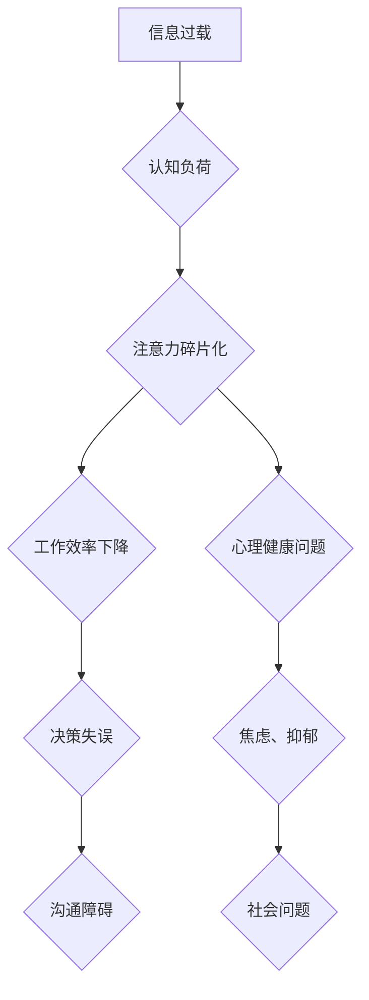

                 

## 信息时代的注意力管理策略与实践：在干扰和分心中航行

> 关键词：注意力管理、信息过载、认知科学、深度工作、专注力训练、时间管理、数字素养、心理健康

### 1. 背景介绍

在信息爆炸的时代，我们被无休止的数字信息淹没。电子邮件、社交媒体、即时通讯、新闻推送，无处不在的通知和提醒，不断地抢夺着我们的注意力。这种信息过载状态，不仅降低了我们的工作效率和学习效率，也对我们的心理健康造成负面影响。

注意力，是人类认知的核心能力之一。它指我们能够将意识集中在特定目标或信息上，排除其他干扰的能力。然而，在当今信息时代，我们的注意力受到前所未有的挑战。研究表明，人类的注意力持续时间正在缩短，我们更容易被分散，难以长时间专注于一件事情。

这种注意力碎片化现象，不仅影响了我们的个人生活，也对社会发展产生了深远的影响。它导致了决策失误、沟通障碍、创新力下降等问题。因此，如何有效地管理注意力，在信息洪流中保持专注，成为当今社会面临的重大挑战。

### 2. 核心概念与联系

**2.1  注意力机制**

注意力机制是近年来深度学习领域取得的重要突破。它借鉴了人类的注意力机制，允许模型在处理信息时，对重要信息给予更多关注，对无关信息给予较少关注。

**2.2  信息过载与认知负荷**

信息过载是指我们接收到的信息量超过了处理能力，导致认知负荷过高。认知负荷是指我们大脑在处理信息时所消耗的资源。当认知负荷过高时，我们的注意力会受到严重影响，难以集中精力。

**2.3  深度工作与专注力训练**

深度工作是指在不受干扰的情况下，专注于一项重要任务，并投入大量时间和精力进行思考和创作。专注力训练是指通过一系列练习和技巧，增强我们的注意力能力和专注力。

**2.4  数字素养与心理健康**

数字素养是指在数字时代，能够有效地使用和管理数字技术的能力。良好的数字素养可以帮助我们更好地应对信息过载，保护我们的注意力，维护心理健康。

**Mermaid 流程图**



### 3. 核心算法原理 & 具体操作步骤

**3.1  算法原理概述**

注意力机制的核心原理是，通过学习一个“注意力权重”，来决定模型对不同输入信息的关注程度。注意力权重可以看作是一个概率分布，它将分配给每个输入信息的关注度。

**3.2  算法步骤详解**

1. **输入数据:** 将输入数据分成多个子序列。
2. **计算注意力权重:** 使用一个注意力函数，计算每个子序列的注意力权重。注意力函数通常会考虑子序列之间的相似度、重要性等因素。
3. **加权求和:** 将每个子序列与其对应的注意力权重相乘，然后求和，得到最终的输出。

**3.3  算法优缺点**

**优点:**

* 可以有效地捕捉长距离依赖关系。
* 可以提高模型的表达能力和泛化能力。
* 可以减少模型的参数量。

**缺点:**

* 计算复杂度较高。
* 需要大量的训练数据。

**3.4  算法应用领域**

注意力机制在自然语言处理、计算机视觉、机器翻译等领域都有广泛的应用。

**4. 数学模型和公式 & 详细讲解 & 举例说明**

**4.1  数学模型构建**

注意力机制的数学模型可以表示为以下公式：

$$
\text{Attention}(Q, K, V) = \text{softmax}\left(\frac{Q K^T}{\sqrt{d_k}}\right) V
$$

其中：

* $Q$：查询矩阵
* $K$：键矩阵
* $V$：值矩阵
* $d_k$：键向量的维度
* $\text{softmax}$：softmax函数

**4.2  公式推导过程**

注意力机制的公式推导过程可以分为以下几个步骤：

1. 计算查询向量 $Q$ 和键向量 $K$ 之间的点积。
2. 将点积结果除以 $\sqrt{d_k}$，以规范化结果。
3. 应用 softmax 函数，将点积结果转换为概率分布。
4. 将概率分布与值向量 $V$ 相乘，得到最终的注意力输出。

**4.3  案例分析与讲解**

假设我们有一个句子 “我爱学习编程”，我们想要计算每个单词对句子整体语义的贡献。

我们可以将句子中的每个单词作为查询向量 $Q$，将每个单词作为键向量 $K$，并将每个单词的词向量作为值向量 $V$。

然后，我们可以使用注意力机制的公式计算每个单词的注意力权重。注意力权重高的单词，对句子整体语义的贡献更大。

例如，单词 “学习” 的注意力权重可能比单词 “我” 的注意力权重更高，因为 “学习” 更直接地表达了句子的主题。

### 5. 项目实践：代码实例和详细解释说明

**5.1  开发环境搭建**

为了实现注意力机制，我们可以使用 Python 语言和 TensorFlow 或 PyTorch 深度学习框架。

**5.2  源代码详细实现**

```python
import tensorflow as tf

# 定义注意力机制层
class AttentionLayer(tf.keras.layers.Layer):
    def __init__(self, units):
        super(AttentionLayer, self).__init__()
        self.Wq = tf.keras.layers.Dense(units)
        self.Wk = tf.keras.layers.Dense(units)
        self.Wv = tf.keras.layers.Dense(units)
        self.softmax = tf.keras.layers.Softmax()

    def call(self, inputs):
        Q = self.Wq(inputs)
        K = self.Wk(inputs)
        V = self.Wv(inputs)
        attention_weights = self.softmax(tf.matmul(Q, K, transpose_b=True) / tf.math.sqrt(tf.cast(tf.shape(Q)[-1], tf.float32)))
        output = tf.matmul(attention_weights, V)
        return output

# 实例化注意力机制层
attention_layer = AttentionLayer(units=128)

# 输入数据
inputs = tf.random.normal(shape=(32, 10, 64))

# 通过注意力机制层进行处理
outputs = attention_layer(inputs)

# 打印输出结果
print(outputs.shape)
```

**5.3  代码解读与分析**

这段代码定义了一个注意力机制层，并演示了如何使用它来处理输入数据。

* `AttentionLayer` 类定义了一个注意力机制层，它包含三个稠密层 (`Wq`, `Wk`, `Wv`) 用于计算查询向量、键向量和值向量的线性变换。
* `call` 方法实现注意力机制的计算过程，包括计算注意力权重和加权求和。
* `softmax` 函数将点积结果转换为概率分布。
* `tf.matmul` 函数用于计算矩阵乘法。

**5.4  运行结果展示**

运行这段代码后，会输出注意力机制层处理后的输出结果的形状。

### 6. 实际应用场景

**6.1  新闻推荐系统**

注意力机制可以用于新闻推荐系统，根据用户的阅读历史和兴趣偏好，推荐更相关的新闻文章。

**6.2  机器翻译**

注意力机制可以用于机器翻译，提高翻译的准确性和流畅度。

**6.3  对话系统**

注意力机制可以用于对话系统，使对话系统能够更好地理解用户的意图和上下文。

**6.4  未来应用展望**

注意力机制在未来将有更广泛的应用，例如：

* **个性化教育:** 根据学生的学习进度和能力，提供个性化的学习内容和建议。
* **医疗诊断:** 帮助医生更快、更准确地诊断疾病。
* **自动驾驶:** 帮助自动驾驶汽车更好地感知周围环境。

### 7. 工具和资源推荐

**7.1  学习资源推荐**

* **论文:** “Attention Is All You Need”
* **博客:** “Attention is All You Need: A Deep Dive”
* **课程:** “Deep Learning Specialization”

**7.2  开发工具推荐**

* **TensorFlow:** https://www.tensorflow.org/
* **PyTorch:** https://pytorch.org/

**7.3  相关论文推荐**

* “Attention Is All You Need”
* “BERT: Pre-training of Deep Bidirectional Transformers for Language Understanding”
* “Transformer-XL: Attentive Language Models Beyond a Fixed-Length Context”

### 8. 总结：未来发展趋势与挑战

**8.1  研究成果总结**

注意力机制在近年来取得了显著的进展，并在多个领域取得了突破性的成果。

**8.2  未来发展趋势**

未来，注意力机制的研究将朝着以下几个方向发展：

* **更有效的注意力机制:** 研究更有效的注意力机制，提高模型的效率和性能。
* **自适应注意力机制:** 研究自适应注意力机制，能够根据不同的任务和数据自动调整注意力权重。
* **多模态注意力机制:** 研究多模态注意力机制，能够处理多种类型的输入信息，例如文本、图像、音频等。

**8.3  面临的挑战**

注意力机制也面临一些挑战：

* **计算复杂度:** 一些注意力机制的计算复杂度较高，难以在资源有限的设备上运行。
* **可解释性:** 注意力机制的决策过程相对复杂，难以解释模型的注意力权重是如何分配的。
* **数据依赖性:** 注意力机制需要大量的训练数据才能达到最佳性能。

**8.4  研究展望**

尽管面临挑战，但注意力机制仍然是一个非常有前景的研究方向。未来，随着研究的深入，注意力机制将发挥更大的作用，推动人工智能技术的发展。

### 9. 附录：常见问题与解答

**9.1  注意力机制和深度学习的关系是什么？**

注意力机制是深度学习中的一种重要技术，它可以帮助模型更好地理解和处理信息。

**9.2  注意力机制的应用场景有哪些？**

注意力机制在自然语言处理、计算机视觉、机器翻译等领域都有广泛的应用。

**9.3  如何选择合适的注意力机制？**

选择合适的注意力机制需要根据具体的应用场景和数据特点进行选择。

**9.4  如何提高注意力机制的性能？**

可以通过增加训练数据、改进模型架构、优化超参数等方法提高注意力机制的性能。


作者：禅与计算机程序设计艺术 / Zen and the Art of Computer Programming 
<end_of_turn>

