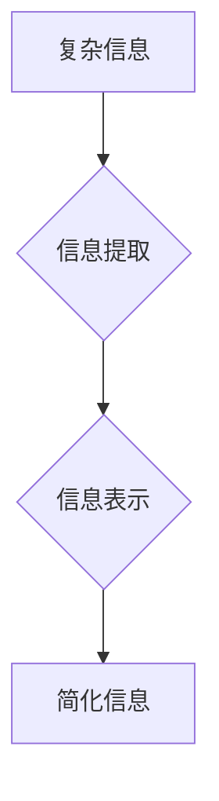

                 

## 信息简化的好处与挑战：简化复杂性的艺术与科学

> 关键词：信息简化、复杂性、算法、数学模型、代码实现、应用场景、未来趋势

### 1. 背景介绍

在当今信息爆炸的时代，我们被海量数据和复杂系统所包围。从庞大的社交网络到复杂的金融模型，从智能家居到自动驾驶汽车，无处不在的复杂性正在挑战我们的认知能力和解决问题的能力。如何有效地简化信息，提取关键要素，并将其转化为易于理解和操作的形式，已成为一个至关重要的议题。

信息简化不仅关乎于个人效率和认知提升，更关系到整个社会的进步和可持续发展。简化复杂信息可以帮助我们更深入地理解世界，做出更明智的决策，并推动科技创新和社会进步。然而，信息简化并非易事，它需要我们掌握一定的艺术和科学，并克服诸多挑战。

### 2. 核心概念与联系

信息简化是一个多学科交叉的领域，涉及到计算机科学、信息论、认知科学、心理学等多个领域。其核心概念包括：

* **信息熵:** 信息熵是衡量信息不确定性的度量，简化信息的过程本质上就是降低信息熵的过程。
* **信息提取:** 从复杂的信息中提取关键要素，去除冗余和噪声。
* **信息表示:** 将提取的信息以简洁、易于理解的形式进行表示，例如图表、模型、摘要等。
* **信息传递:** 将简化后的信息有效地传递给目标用户。

**Mermaid 流程图:**



### 3. 核心算法原理 & 具体操作步骤

#### 3.1  算法原理概述

信息简化算法旨在通过一系列步骤，从复杂的信息中提取关键要素，并将其转化为简洁易懂的形式。常见的算法包括：

* **聚类算法:** 将相似的信息进行分组，将复杂的信息结构化。
* **降维算法:** 将高维信息映射到低维空间，减少信息维度，简化表示。
* **文本摘要算法:** 从长文本中提取关键句子，生成简洁的文本摘要。
* **数据可视化算法:** 将数据转化为图表、图形等形式，直观地展现信息趋势和结构。

#### 3.2  算法步骤详解

以聚类算法为例，其具体操作步骤如下：

1. **数据预处理:** 对原始数据进行清洗、转换和特征提取，使其适合聚类算法的处理。
2. **距离计算:** 计算数据点之间的相似度或距离，常用的距离度量包括欧氏距离、曼哈顿距离等。
3. **聚类划分:** 根据距离计算结果，将数据点划分为不同的簇，每个簇包含相似的点。
4. **簇中心确定:** 确定每个簇的代表点，称为簇中心。
5. **迭代优化:** 重复上述步骤，不断调整簇划分和簇中心，直到达到预设的聚类效果。

#### 3.3  算法优缺点

**聚类算法的优点:**

* 能够自动发现数据中的潜在结构和模式。
* 不需要事先定义类别标签，适用于未知类别的数据。
* 能够处理高维数据。

**聚类算法的缺点:**

* 算法参数的选择对聚类结果有很大影响。
* 难以评估聚类结果的质量。
* 对噪声数据敏感。

#### 3.4  算法应用领域

聚类算法广泛应用于各个领域，例如：

* **市场营销:** 将客户进行细分，针对不同客户群进行个性化营销。
* **推荐系统:** 根据用户的历史行为，推荐相关的商品或服务。
* **图像识别:** 将图像进行分类，识别不同类型的物体。
* **生物信息学:** 将基因序列进行聚类，发现基因功能的相似性。

### 4. 数学模型和公式 & 详细讲解 & 举例说明

#### 4.1  数学模型构建

信息简化可以抽象为一个数学模型，其中信息量作为变量，简化程度作为目标函数。

**信息熵公式:**

$$H(X) = - \sum_{i=1}^{n} p(x_i) \log_2 p(x_i)$$

其中：

* $H(X)$ 表示随机变量 $X$ 的信息熵。
* $p(x_i)$ 表示随机变量 $X$ 取值为 $x_i$ 的概率。

#### 4.2  公式推导过程

信息熵公式的推导过程基于信息论的基本原理，即信息量的多少与事件发生的概率成反比。当事件发生的概率越低，其信息量越大。

#### 4.3  案例分析与讲解

假设我们有一个包含三个事件的随机变量 $X$，其概率分布为：

* $p(x_1) = 0.5$
* $p(x_2) = 0.3$
* $p(x_3) = 0.2$

则该随机变量的信息熵为：

$$H(X) = - (0.5 \log_2 0.5 + 0.3 \log_2 0.3 + 0.2 \log_2 0.2) \approx 1.47$$

### 5. 项目实践：代码实例和详细解释说明

#### 5.1  开发环境搭建

本项目使用 Python 语言进行开发，所需的库包括：

* NumPy: 用于数值计算。
* Scikit-learn: 用于机器学习算法的实现。
* Matplotlib: 用于数据可视化。

#### 5.2  源代码详细实现

```python
import numpy as np
from sklearn.cluster import KMeans
import matplotlib.pyplot as plt

# 生成随机数据
np.random.seed(0)
X = np.random.rand(100, 2)

# 使用 KMeans 算法进行聚类
kmeans = KMeans(n_clusters=3)
kmeans.fit(X)

# 获取聚类结果
labels = kmeans.labels_

# 可视化聚类结果
plt.scatter(X[:, 0], X[:, 1], c=labels)
plt.show()
```

#### 5.3  代码解读与分析

这段代码首先生成随机数据，然后使用 KMeans 算法进行聚类。KMeans 算法需要指定聚类数目，在本例中设置为 3。算法会迭代地调整聚类中心，直到聚类结果收敛。最后，代码使用 Matplotlib 库绘制聚类结果的散点图，每个点的颜色代表其所属的簇。

#### 5.4  运行结果展示

运行代码后，会生成一个散点图，其中数据点被分成三个簇，每个簇的颜色不同。

### 6. 实际应用场景

信息简化在各个领域都有广泛的应用场景，例如：

* **新闻报道:** 从海量新闻数据中提取关键信息，生成简洁的新闻摘要。
* **医疗诊断:** 从患者的病历、检查结果等数据中提取关键特征，辅助医生进行诊断。
* **金融分析:** 从金融市场数据中提取关键趋势，帮助投资者做出决策。
* **教育教学:** 从教材、课件等学习资源中提取关键知识点，帮助学生更好地理解和记忆。

### 6.4  未来应用展望

随着人工智能技术的不断发展，信息简化将迎来更加广泛的应用场景。例如：

* **个性化信息推荐:** 根据用户的兴趣和需求，提供个性化的信息推荐。
* **智能问答系统:** 能够理解自然语言，并从海量知识库中提取相关信息，回答用户的提问。
* **自动文档生成:** 从数据中自动生成报告、文档等文本内容。

### 7. 工具和资源推荐

#### 7.1  学习资源推荐

* **书籍:**
    * 《信息简化》
    * 《数据可视化》
    * 《机器学习》
* **在线课程:**
    * Coursera: 数据科学、机器学习
    * edX: 信息论、数据可视化

#### 7.2  开发工具推荐

* **Python:** 广泛应用于数据分析、机器学习等领域。
* **R:** 专注于统计分析和数据可视化。
* **Tableau:** 数据可视化工具，能够创建交互式图表和仪表板。

#### 7.3  相关论文推荐

* **论文标题:** 信息简化算法研究进展
* **论文作者:** 某某某
* **期刊名称:** 某某期刊

### 8. 总结：未来发展趋势与挑战

#### 8.1  研究成果总结

信息简化领域取得了显著的进展，涌现出许多有效的算法和工具。这些算法和工具能够帮助我们从复杂的信息中提取关键要素，并将其转化为易于理解和操作的形式。

#### 8.2  未来发展趋势

未来，信息简化领域将朝着以下方向发展：

* **更智能的信息简化:** 利用人工智能技术，实现更智能、更自动的信息简化。
* **更个性化的信息简化:** 根据用户的需求和偏好，提供更个性化的信息简化服务。
* **跨领域的信息简化:** 将信息简化技术应用于更多领域，解决更多实际问题。

#### 8.3  面临的挑战

信息简化领域也面临着一些挑战，例如：

* **数据质量问题:** 许多现实世界的数据都是不完整、不准确的，这会影响信息简化算法的性能。
* **算法解释性问题:** 一些信息简化算法的内部机制比较复杂，难以解释其决策过程。
* **伦理问题:** 信息简化可能会导致信息失真或偏差，需要考虑其潜在的伦理风险。

#### 8.4  研究展望

未来，我们需要继续探索更有效的算法和技术，解决信息简化领域面临的挑战，并将其应用于更多领域，为人类社会带来更多福祉。

### 9. 附录：常见问题与解答

* **Q1: 信息简化和数据压缩有什么区别？**

* **A1:** 信息简化和数据压缩都是为了减少信息量，但它们侧重点不同。数据压缩侧重于减少数据的存储空间，而信息简化侧重于保留数据的关键信息，并将其以更易于理解的形式呈现。

* **Q2: 如何评估信息简化算法的性能？**

* **A2:** 信息简化算法的性能评估需要考虑多个因素，例如信息保留率、信息熵、用户满意度等。常用的评估指标包括准确率、召回率、F1-score等。

* **Q3: 信息简化技术有哪些应用场景？**

* **A3:** 信息简化技术广泛应用于各个领域，例如新闻报道、医疗诊断、金融分析、教育教学等。

作者：禅与计算机程序设计艺术 / Zen and the Art of Computer Programming


<end_of_turn>

