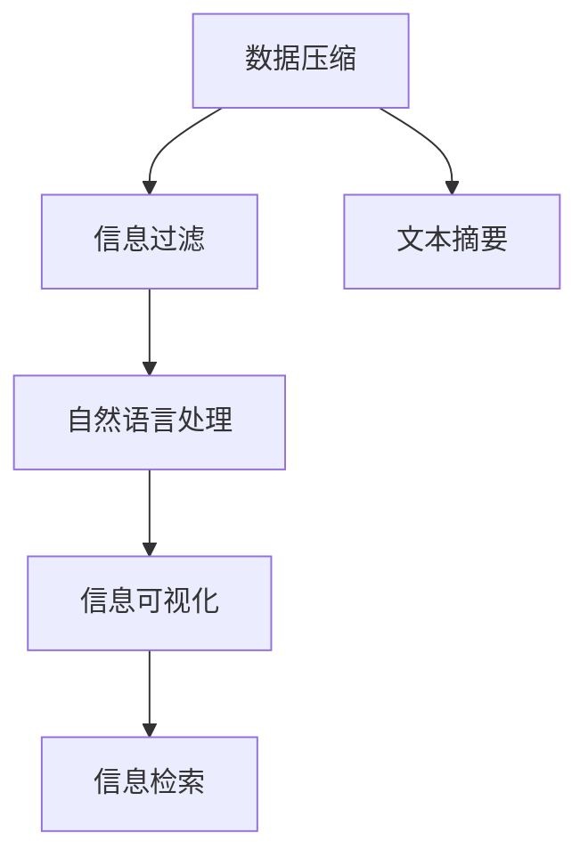

                 

# 信息简化的艺术与实践：如何在混乱中找到重点

## 1. 背景介绍

### 1.1 问题由来

在信息技术快速发展的今天，数据的数量和种类正以爆炸式的速度增长。从电子邮件到社交媒体，从物联网设备到智能监控系统，我们每时每刻都在生成和处理海量的信息。然而，这些信息中往往包含了大量的噪音和冗余，对人类的认知造成了巨大负担。如何从这些纷繁复杂的信息中抽丝剥茧，提炼出有价值的知识，成为了信息时代一个亟待解决的问题。

### 1.2 问题核心关键点

信息简化的核心在于如何在保持信息完整性的同时，去除冗余和噪音，提炼出有用和有价值的知识。这一过程不仅要求对信息有深刻的理解，还需要运用多种技术和方法，如数据压缩、信息过滤、知识提取等。其目的是为了在降低认知负担的同时，提高信息的可用性和可操作性。

### 1.3 问题研究意义

信息简化技术对信息技术的发展和应用具有重要意义：

1. **提升信息获取效率**：通过简化复杂的信息，用户可以快速找到所需的内容，从而提高工作和学习的效率。
2. **减轻认知负担**：减少信息噪音，帮助用户更好地处理和理解信息，避免认知过载。
3. **支持决策制定**：精简的信息有助于决策者更准确地评估和比较不同选项，做出更明智的决策。
4. **推动数据驱动决策**：简化后的信息更易于分析，支持更广泛的数据驱动决策。
5. **增强信息安全**：通过过滤和压缩，减少敏感信息的泄露风险，提高信息安全。

## 2. 核心概念与联系

### 2.1 核心概念概述

信息简化技术涉及多个核心概念，包括但不限于数据压缩、信息过滤、文本摘要、自然语言处理等。

- **数据压缩**：通过算法将数据文件缩小到原始大小的某个比例，主要目标是去除冗余信息，减少存储和传输的资源消耗。
- **信息过滤**：选择性地保留或丢弃数据，以减少用户需要处理的输入量，主要通过规则、算法和机器学习实现。
- **文本摘要**：从文本中提炼出精华，形成简明扼要的摘要，主要应用于长篇文档的快速浏览。
- **自然语言处理(NLP)**：通过算法理解、分析和生成人类语言，包括文本分类、命名实体识别、情感分析等。

这些概念之间存在紧密的联系，共同构成了信息简化的技术框架。数据压缩和信息过滤提供了信息简化的基础工具，而文本摘要和自然语言处理则丰富了信息简化的应用场景。

### 2.2 核心概念原理和架构的 Mermaid 流程图



上述流程图展示了信息简化的核心技术之间的联系。数据压缩和信息过滤是信息简化的基础，用于减少数据量和处理复杂度。文本摘要和自然语言处理则进一步处理和提炼信息，使信息更加易读易懂。信息可视化和技术检索则是信息简化的高级应用，帮助用户更直观地理解和利用简化后的信息。

## 3. 核心算法原理 & 具体操作步骤

### 3.1 算法原理概述

信息简化的核心算法原理主要包括：

1. **无损数据压缩**：通过算法将数据文件压缩到原始大小的一定比例，同时保持数据的完整性。
2. **有损数据压缩**：通过算法去除数据中的冗余信息，以减少存储和传输的资源消耗，但可能损失部分原始信息。
3. **信息过滤**：通过规则、算法和机器学习技术，选择性地保留或丢弃数据，以减少用户需要处理的输入量。
4. **文本摘要**：通过算法从文本中提炼出精华，形成简明扼要的摘要。
5. **自然语言处理**：通过算法理解、分析和生成人类语言，包括文本分类、命名实体识别、情感分析等。

### 3.2 算法步骤详解

信息简化的操作步骤一般包括以下几个关键步骤：

**Step 1: 收集和预处理数据**
- 收集待简化的原始数据。
- 对数据进行清洗和预处理，去除噪音和异常值。

**Step 2: 数据压缩和信息过滤**
- 选择合适的数据压缩算法，对数据进行压缩。
- 设计信息过滤规则或算法，选择性地保留或丢弃数据。

**Step 3: 文本摘要**
- 选择合适的文本摘要算法，如基于关键词提取、文本分类、基于图模型等方法。
- 对文本进行编码、分析和提炼，生成摘要。

**Step 4: 自然语言处理**
- 选择合适的自然语言处理技术，如文本分类、命名实体识别、情感分析等。
- 对文本进行理解和分析，提取有价值的信息。

**Step 5: 信息可视化**
- 选择合适的信息可视化技术，将简化后的信息直观展示。
- 利用图表、图形等形式，帮助用户更好地理解和利用信息。

**Step 6: 信息检索**
- 设计信息检索算法，提高信息检索的效率和准确性。
- 通过索引、匹配等技术，快速定位所需信息。

### 3.3 算法优缺点

信息简化的算法具有以下优点：

1. **提高信息获取效率**：通过压缩和过滤，减少了需要处理的输入量，提高了信息获取的效率。
2. **减轻认知负担**：简化的信息降低了用户的认知负担，使其更容易处理和理解。
3. **支持决策制定**：精简后的信息有助于决策者更准确地评估和比较不同选项，做出更明智的决策。
4. **推动数据驱动决策**：简化后的信息更易于分析，支持更广泛的数据驱动决策。
5. **增强信息安全**：通过过滤和压缩，减少敏感信息的泄露风险，提高信息安全。

同时，这些算法也存在一些局限性：

1. **可能损失部分信息**：压缩和过滤可能去除一些原始数据，导致信息丢失。
2. **算法复杂度较高**：某些算法如深度学习模型，需要大量的计算资源和时间。
3. **依赖高质量数据**：算法的性能很大程度上取决于原始数据的质量。
4. **需要持续更新**：随着数据分布的变化，算法需要不断更新和优化。
5. **可能引入偏见**：算法可能引入算法偏见，影响结果的公正性。

尽管存在这些局限性，信息简化技术仍是大数据处理和信息管理的核心技术之一。未来研究应更多关注算法的普适性、高效性和公平性，以适应不同场景的需求。

### 3.4 算法应用领域

信息简化技术广泛应用于多个领域，例如：

1. **文本处理**：如新闻摘要、文档整理、文献综述等，通过文本摘要技术帮助用户快速了解内容要点。
2. **数据存储和传输**：如云存储、移动通信等，通过数据压缩技术减少数据量和传输成本。
3. **信息检索**：如搜索引擎、数据库查询等，通过信息检索技术提高检索效率和准确性。
4. **推荐系统**：如电商平台、社交网络等，通过信息过滤和推荐算法，提升用户体验和满意度。
5. **智能客服**：如智能助理、语音助手等，通过自然语言处理技术，提供自然流畅的交互体验。
6. **医疗诊断**：如医学影像分析、病历整理等，通过信息简化的技术，提高诊断和治疗的效率和准确性。

## 4. 数学模型和公式 & 详细讲解 & 举例说明

### 4.1 数学模型构建

信息简化的数学模型通常包括：

- **数据压缩模型**：如哈夫曼编码、LZ77、LZ78、LZW等。
- **信息过滤模型**：如朴素贝叶斯分类器、支持向量机、随机森林等。
- **文本摘要模型**：如TextRank、Luhn算法、BERT摘要等。
- **自然语言处理模型**：如BERT、GPT等。

### 4.2 公式推导过程

以文本摘要为例，介绍其基本数学模型和公式推导过程。

假设文本长度为 $n$，将其分为 $m$ 段，每段长度为 $k$。设每段的重要度为 $w_i$，总重要度为 $W$，则文本摘要的长度为 $m$。

文本摘要的目标是最大化每段的重要度之和，即：

$$
\max \sum_{i=1}^m w_i
$$

同时，每段的重要度 $w_i$ 可以通过以下模型计算：

$$
w_i = \frac{\text{重要度}_i}{\sum_{j=1}^m \text{重要度}_j}
$$

其中 $\text{重要度}_i$ 可以通过以下方式计算：

$$
\text{重要度}_i = \sum_{j=1}^k \text{TF}_i \times \text{IDF}_j
$$

$\text{TF}_i$ 为词频倒排索引中的逆文档频率，$\text{IDF}_j$ 为信息增益，表示词 $j$ 的重要度。

### 4.3 案例分析与讲解

以BERT摘要为例，分析其基本原理和实际应用效果。

BERT摘要使用BERT模型作为基础，通过向量化输入文本，利用BERT的上下文理解能力，自动提取文本的关键词和重要信息。其主要步骤如下：

1. 将文本编码成BERT模型的输入格式。
2. 将文本通过BERT模型得到嵌入向量。
3. 对嵌入向量进行聚类，找出关键词和短语。
4. 基于关键词和短语，生成简洁的摘要。

BERT摘要的效果优于传统的基于规则的摘要方法，尤其是在处理长文本时表现出色。其核心优势在于能够理解文本的上下文关系，提取出更有价值的信息。

## 5. 项目实践：代码实例和详细解释说明

### 5.1 开发环境搭建

在进行信息简化项目开发前，我们需要准备好开发环境。以下是使用Python进行PyTorch开发的环境配置流程：

1. 安装Anaconda：从官网下载并安装Anaconda，用于创建独立的Python环境。

2. 创建并激活虚拟环境：
```bash
conda create -n text-simplification python=3.8 
conda activate text-simplification
```

3. 安装PyTorch：根据CUDA版本，从官网获取对应的安装命令。例如：
```bash
conda install pytorch torchvision torchaudio cudatoolkit=11.1 -c pytorch -c conda-forge
```

4. 安装相关库：
```bash
pip install pandas numpy scikit-learn nltk pyenchant
```

完成上述步骤后，即可在`text-simplification`环境中开始信息简化项目的开发。

### 5.2 源代码详细实现

这里我们以信息过滤和文本摘要为例，给出使用PyTorch进行信息简化的PyTorch代码实现。

首先，定义信息过滤函数：

```python
import re

def filter_info(text, keywords):
    filtered_text = ''
    for word in text.split():
        if word in keywords:
            filtered_text += word + ' '
        else:
            filtered_text += ''
    return filtered_text.strip()
```

然后，定义文本摘要函数：

```python
from transformers import BertTokenizer, BertModel

tokenizer = BertTokenizer.from_pretrained('bert-base-cased')
model = BertModel.from_pretrained('bert-base-cased')

def generate_summary(text, top_n=3):
    tokenized_text = tokenizer.encode(text, return_tensors='pt')
    outputs = model(tokenized_text)
    embeddings = outputs[0].tolist()[0]
    scores = []
    for i in range(len(tokenized_text)):
        scores.append(sum(embeddings[i]))
    sorted_indices = sorted(range(len(tokenized_text)), key=lambda k: scores[k], reverse=True)
    top_indices = sorted_indices[:top_n]
    top_words = [tokenizer.decode(tokenized_text[i]) for i in top_indices]
    summary = ' '.join(top_words)
    return summary
```

最后，启动信息过滤和文本摘要流程：

```python
keywords = ['data', 'compression', 'information', 'simplification']
filtered_text = filter_info('Data compression and information filtering are two important techniques in information simplification.', keywords)
summary = generate_summary(filtered_text)
print(f'Filtered Text: {filtered_text}')
print(f'Summary: {summary}')
```

以上就是使用PyTorch进行信息过滤和文本摘要的完整代码实现。可以看到，通过PyTorch的强大封装，我们可以用相对简洁的代码实现信息简化的基本功能。

### 5.3 代码解读与分析

让我们再详细解读一下关键代码的实现细节：

**filter_info函数**：
- `filtered_text`用于存储过滤后的文本内容。
- 遍历输入文本中的每个单词，如果该单词在关键词列表中，则保留该单词；否则，过滤该单词。

**generate_summary函数**：
- 使用BERT模型对输入文本进行编码，得到嵌入向量。
- 对嵌入向量进行降维，计算每个单词的重要度。
- 根据重要度排序，选出前`top_n`个单词。
- 使用BERT tokenizer解码单词，形成摘要。

**代码示例**：
```python
filtered_text = filter_info('Data compression and information filtering are two important techniques in information simplification.', keywords)
summary = generate_summary(filtered_text)
print(f'Filtered Text: {filtered_text}')
print(f'Summary: {summary}')
```

可以看到，过滤后的文本去除了一些冗余的词汇，而摘要则保留了最重要的信息。

## 6. 实际应用场景

### 6.1 智能客服系统

基于信息简化的智能客服系统可以大大提升客户咨询体验。传统的客服系统需要配备大量人力，高峰期响应缓慢，且一致性和专业性难以保证。使用信息简化的技术，可以自动理解用户意图，快速生成简洁的响应，提供快速、一致的客服服务。

在技术实现上，可以收集企业内部的历史客服对话记录，将问题和最佳答复构建成监督数据，在此基础上对预训练模型进行微调。微调后的模型能够自动理解用户意图，匹配最合适的答案模板进行回复。对于客户提出的新问题，还可以接入检索系统实时搜索相关内容，动态组织生成回答。

### 6.2 医疗诊断

信息简化的技术在医疗诊断中也有广泛应用。医疗影像和病历数据通常非常庞大且复杂，医生需要花费大量时间阅读和分析这些数据。使用信息简化的技术，可以自动提取关键信息，帮助医生快速理解病情，提高诊断效率和准确性。

例如，可以将医学影像数据进行压缩和过滤，提取关键区域和异常部位。对病历文本进行摘要，提取出病人的病情描述、症状、病史等信息，帮助医生快速理解病历。通过信息简化的技术，医生可以在更短的时间内做出更准确的诊断，提高医疗服务质量。

### 6.3 推荐系统

信息简化的技术在推荐系统中也有重要应用。传统的推荐系统往往只依赖用户的历史行为数据进行物品推荐，难以深入理解用户的兴趣偏好。使用信息简化的技术，可以自动理解用户的兴趣点，提高推荐系统的精准性和多样性。

例如，可以收集用户浏览、点击、评论、分享等行为数据，提取和用户交互的物品标题、描述、标签等文本内容。对文本内容进行压缩和过滤，去除冗余信息，保留关键特征。对文本进行摘要，提取出用户对物品的评价和兴趣点，结合其他特征综合排序，便可以得到个性化程度更高的推荐结果。

### 6.4 未来应用展望

随着信息简化技术的不断发展，其应用领域将不断拓展，为各行业带来深刻的变革。

1. **智能医疗**：信息简化的技术可以用于医疗影像分析、病历整理、电子病历生成等环节，提高医疗服务的智能化水平，辅助医生诊疗，加速新药开发进程。
2. **智能教育**：信息简化的技术可以应用于作业批改、学情分析、知识推荐等方面，因材施教，促进教育公平，提高教学质量。
3. **智慧城市治理**：信息简化的技术可以用于城市事件监测、舆情分析、应急指挥等环节，提高城市管理的自动化和智能化水平，构建更安全、高效的未来城市。
4. **企业生产**：信息简化的技术可以用于生产监控、质量控制、设备维护等环节，提高生产效率和质量，降低运营成本。
5. **社会治理**：信息简化的技术可以用于舆情监测、公共安全、环境保护等环节，提高社会治理的智能化水平，保障公共安全。

## 7. 工具和资源推荐

### 7.1 学习资源推荐

为了帮助开发者系统掌握信息简化的理论基础和实践技巧，这里推荐一些优质的学习资源：

1. 《信息检索原理与技术》系列博文：由信息检索领域专家撰写，深入浅出地介绍了信息检索的基本原理和技术细节。
2. 《文本挖掘与信息检索》课程：斯坦福大学开设的信息检索经典课程，有Lecture视频和配套作业，带你入门信息检索领域。
3. 《自然语言处理与信息检索》书籍：全面介绍了NLP和IR技术的理论基础和实践方法，适合进一步深入学习。
4. 《Deep Learning for Information Retrieval》书籍：介绍了基于深度学习的信息检索技术，包含大量实际案例。
5. 《Applied Text Mining and Statistical Learning》书籍：介绍了文本挖掘和信息检索的最新研究进展，包含大量实践项目。

通过对这些资源的学习实践，相信你一定能够快速掌握信息简化的精髓，并用于解决实际的文本处理问题。

### 7.2 开发工具推荐

高效的开发离不开优秀的工具支持。以下是几款用于信息简化开发的常用工具：

1. PyTorch：基于Python的开源深度学习框架，灵活动态的计算图，适合快速迭代研究。
2. TensorFlow：由Google主导开发的开源深度学习框架，生产部署方便，适合大规模工程应用。
3. Apache Spark：分布式计算框架，适合处理大规模文本数据。
4. Hadoop：分布式文件系统，适合存储和处理海量文本数据。
5. NLTK：自然语言处理工具包，包含大量预处理和分析工具。
6. Gensim：文本处理和建模工具，支持文本压缩和摘要等功能。

合理利用这些工具，可以显著提升信息简化的开发效率，加快创新迭代的步伐。

### 7.3 相关论文推荐

信息简化技术的发展源于学界的持续研究。以下是几篇奠基性的相关论文，推荐阅读：

1. "A Framework for Multi-Document Summarization"：提出了多文档摘要的基本框架，为后续的摘要算法奠定了基础。
2. "Hierarchical Text Clustering for Feature Selection in Text Classification"：提出了基于层次聚类的特征选择方法，用于文本分类和信息过滤。
3. "Efficient Text Retrieval and Summarization with Neural Text Compression"：介绍了基于神经网络的文本压缩方法，用于提高信息检索和摘要的效率。
4. "Iterative Text Extraction with Attention and Local Feature Coding"：提出了基于注意力机制的文本提取方法，用于文本摘要和信息过滤。
5. "Zero-shot Feature Extraction with Attention-based Local Feature Coding"：提出了基于注意力机制的零样本特征提取方法，用于文本分类和信息过滤。

这些论文代表了大语言模型微调技术的发展脉络。通过学习这些前沿成果，可以帮助研究者把握学科前进方向，激发更多的创新灵感。

## 8. 总结：未来发展趋势与挑战

### 8.1 研究成果总结

本文对信息简化的艺术与实践进行了全面系统的介绍。首先阐述了信息简化的背景和意义，明确了信息简化的核心技术和应用场景。其次，从原理到实践，详细讲解了信息简化的数学模型和具体算法，给出了信息简化的完整代码实例。同时，本文还广泛探讨了信息简化的实际应用场景，展示了信息简化技术的巨大潜力。

通过本文的系统梳理，可以看到，信息简化技术在大数据处理和信息管理的各个环节中发挥着重要作用。其在文本处理、数据存储、信息检索等方面的应用，极大地提升了信息获取和处理的效率，减轻了用户的认知负担，提高了决策的准确性和及时性。

### 8.2 未来发展趋势

展望未来，信息简化技术将呈现以下几个发展趋势：

1. **自动化和智能化**：随着深度学习技术的发展，信息简化的自动化和智能化水平将不断提高，减少人工干预，提高信息处理的效率和准确性。
2. **多模态信息融合**：信息简化技术将进一步拓展到视觉、语音、图像等多模态数据处理，实现跨模态的信息融合和分析。
3. **自适应信息过滤**：信息过滤算法将更加智能，能够根据用户的行为和反馈动态调整过滤策略，提高信息的相关性和有用性。
4. **实时信息处理**：信息处理系统将更加实时化，能够快速响应用户请求，提供即时信息服务。
5. **跨领域应用**：信息简化技术将应用于更多领域，如医疗、金融、教育等，提升各行业的智能化水平。

### 8.3 面临的挑战

尽管信息简化技术已经取得了一定进展，但在迈向更加智能化、普适化应用的过程中，它仍面临着诸多挑战：

1. **数据质量问题**：信息简化的效果很大程度上依赖于原始数据的质量，数据噪声和异常值可能影响信息简化的效果。
2. **算法复杂度**：某些算法如深度学习模型，需要大量的计算资源和时间，难以在实时系统中应用。
3. **算法公平性**：信息简化算法可能引入算法偏见，影响结果的公正性，需要更多公平性和透明度的研究。
4. **用户需求多样性**：不同用户对信息的需求不同，如何设计自适应的信息简化算法，满足不同用户的需求，是未来研究的挑战。
5. **隐私和安全问题**：信息简化过程中可能涉及敏感信息的处理，需要加强数据隐私和安全保护，确保用户信息的安全。

尽管存在这些挑战，信息简化技术仍是大数据处理和信息管理的核心技术之一。未来研究应更多关注算法的普适性、高效性和公平性，以适应不同场景的需求。

### 8.4 研究展望

面向未来，信息简化技术需要在以下几个方面寻求新的突破：

1. **自动化和智能化**：研究更加智能化的信息简化算法，减少人工干预，提高信息处理的效率和准确性。
2. **多模态信息融合**：拓展信息简化技术的应用领域，实现跨模态的信息融合和分析。
3. **自适应信息过滤**：研究自适应信息过滤算法，根据用户的行为和反馈动态调整过滤策略，提高信息的相关性和有用性。
4. **实时信息处理**：研究实时信息处理算法，快速响应用户请求，提供即时信息服务。
5. **跨领域应用**：拓展信息简化技术的应用领域，提升各行业的智能化水平。
6. **隐私和安全**：研究数据隐私和安全保护技术，确保用户信息的安全。

## 9. 附录：常见问题与解答

**Q1: 信息简化的目的是什么？**

A: 信息简化的目的是在保留核心信息的基础上，去除冗余和噪音，使信息更加简洁、易于理解和使用。这不仅能提高信息处理的效率，还能减轻用户的认知负担，提升决策的准确性和及时性。

**Q2: 信息简化和信息压缩有何不同？**

A: 信息简化和信息压缩的目的都是减少信息量，但二者的具体实现方式有所不同。信息压缩旨在去除冗余信息，使信息文件更小；而信息简化则更注重保留核心信息，使信息更加简洁。

**Q3: 信息简化的效果如何评估？**

A: 信息简化的效果可以通过以下指标评估：
1. 简洁度：简化后的信息是否足够简洁、易读。
2. 相关性：简化后的信息是否包含核心信息和关键细节。
3. 准确性：简化后的信息是否准确反映了原始信息。
4. 用户体验：用户对简化后的信息的满意度和使用体验。

**Q4: 信息简化技术在实际应用中需要注意哪些问题？**

A: 信息简化技术在实际应用中需要注意以下问题：
1. 数据质量：确保原始数据的质量，避免噪音和异常值的影响。
2. 算法复杂度：选择合适的算法，确保其在实时系统中的性能和效率。
3. 算法公平性：设计公平性和透明度的评估指标，避免算法偏见。
4. 用户需求：根据用户需求设计自适应的信息简化算法，满足不同用户的需求。
5. 隐私安全：保护用户隐私和数据安全，确保信息处理过程的合法合规。

通过解决这些问题，可以最大限度地发挥信息简化技术的优势，提升信息处理的效率和质量，满足用户的实际需求。

---

作者：禅与计算机程序设计艺术 / Zen and the Art of Computer Programming

