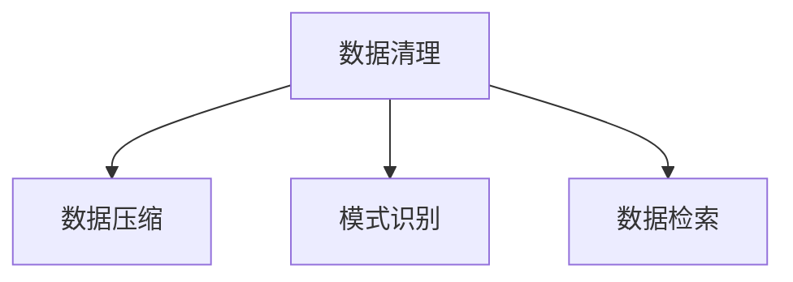

                 

# 信息简化的艺术与科学：如何在混乱中找到模式

> 关键词：信息简化, 模式识别, 数据压缩, 数据清理, 自然语言处理(NLP), 机器学习(ML), 深度学习(DL), 信息检索(IR)

## 1. 背景介绍

### 1.1 问题由来

在数字化时代，信息量呈指数级增长，人们每天面对的不仅是大量的数据，还有大量的噪音和冗余。如何在海量的数据中快速定位有价值的信息，成为信息时代的一项重要技能。传统的数据处理方式，如人工筛选、手动整理，已经无法满足快速响应和精确判断的需求。

因此，信息简化技术应运而生。通过技术手段，从大量复杂的信息中提炼出有用的模式和规律，帮助人们快速理解和利用信息，提高效率，降低误解。信息简化技术不仅适用于个人日常生活中的信息管理，也在企业级的数据分析和业务决策中发挥着关键作用。

### 1.2 问题核心关键点

信息简化技术涵盖了数据清理、数据压缩、数据分类、模式识别等多个方面。其核心关键点包括：

- 数据清理：过滤掉噪音和冗余信息，保留高质量数据。
- 数据压缩：在减小数据规模的同时，保持信息的完整性。
- 模式识别：从数据中提取有价值的规律和模式。
- 数据检索：快速定位和检索到需要的信息。

### 1.3 问题研究意义

研究信息简化技术，对于提高信息处理效率、降低误解风险、促进数据驱动决策具有重要意义：

1. 提高效率：信息简化技术帮助人们快速获取关键信息，节省时间和精力，提高工作和学习效率。
2. 降低误解：通过去伪存真，过滤掉噪音和冗余，减少信息误导和误解的风险。
3. 促进决策：准确的信息和清晰的规律，有助于更好的理解和利用数据，支持科学的决策和判断。
4. 拓展应用：信息简化技术不仅限于数据处理，还能应用于自然语言处理、图像识别、语音识别等领域，为不同应用场景提供支撑。
5. 产业升级：推动信息技术的产业化进程，加速数字化转型，为企业和机构带来新的商业价值。

## 2. 核心概念与联系

### 2.1 核心概念概述

为更好地理解信息简化技术的原理和应用，本节将介绍几个关键概念：

- 数据清理(Data Cleaning)：通过过滤、填补、标准化等技术手段，从原始数据中去除噪音和冗余，保留高质量数据。
- 数据压缩(Data Compression)：在保证信息完整性的前提下，减小数据规模，提升数据传输和存储效率。
- 模式识别(Pattern Recognition)：通过算法和模型，从数据中提取有意义的规律和模式，用于分类、聚类、预测等任务。
- 数据检索(Information Retrieval)：在大量数据中快速定位到满足特定条件的信息，方便用户检索和利用。

这些核心概念之间的逻辑关系可以通过以下Mermaid流程图来展示：



这个流程图展示了一组数据从清理到压缩、识别和检索的过程：

1. 数据清理：去除噪音和冗余信息，确保数据的纯净性。
2. 数据压缩：减小数据规模，提升数据传输和存储效率。
3. 模式识别：从数据中提取有价值的规律和模式，用于分类、聚类、预测等任务。
4. 数据检索：快速定位到满足特定条件的信息，方便用户检索和利用。

这些概念共同构成了信息简化技术的框架，使其能够在不同场景下发挥作用。通过理解这些核心概念，我们可以更好地把握信息简化技术的本质和工作原理。

## 3. 核心算法原理 & 具体操作步骤
### 3.1 算法原理概述

信息简化技术的核心在于如何从原始数据中提炼出有价值的模式和信息。其基本思路是通过一系列预处理、压缩和识别算法，将原始数据转换为更简洁、高效、易理解的形式，帮助人们快速定位和利用关键信息。

以自然语言处理(NLP)为例，信息简化技术包括文本清理、文本压缩、文本分类和文本检索等多个步骤。这些步骤中的每一个，都依赖于特定的算法和模型，从而实现信息的高效处理和利用。

### 3.2 算法步骤详解

以文本清理为例，其基本步骤如下：

1. 分词：将文本切分成单独的词或词组。
2. 去除停用词：过滤掉常见的无意义词汇，如"的"、"是"、"在"等。
3. 词干提取：将不同形式的词转换为相同的基本形式，如将"running"和"runs"都转换为"run"。
4. 拼写检查：纠正拼写错误，如将"recieve"转换为"receive"。
5. 去除特殊字符：去除标点符号和特殊字符，如`!`、`$`、`%`等。

这些步骤通过具体的算法和模型实现，如自然语言处理库NLTK、SpaCy等，可以快速自动化地完成文本清理工作。

### 3.3 算法优缺点

信息简化技术具有以下优点：

1. 提升效率：通过清理和压缩，数据规模显著减小，传输和存储效率提升。
2. 降低误解：去除噪音和冗余，提高信息的准确性和可靠性。
3. 支持决策：通过模式识别和数据检索，帮助用户快速找到所需信息，支持更好的决策。

但同时，信息简化技术也存在一定的局限性：

1. 依赖于模型和算法：不同的算法和模型，其效果和适用性不同，选择合适的算法和模型是关键。
2. 数据丢失风险：在清理和压缩过程中，部分信息可能被丢失，需要权衡数据完整性和效率之间的平衡。
3. 复杂性高：数据清理和压缩涉及多方面的技术，实现起来较为复杂，需要综合考虑多个因素。
4. 效果依赖于数据：算法的性能和效果，依赖于数据的质量和规模，数据质量差时，效果可能不佳。

尽管存在这些局限性，信息简化技术仍是大数据时代不可或缺的基础技术，通过不断的优化和改进，将为信息的有效管理和利用提供有力支撑。

### 3.4 算法应用领域

信息简化技术广泛应用于各个领域，包括但不限于：

- 自然语言处理(NLP)：文本清洗、文本分类、文本检索、情感分析等。
- 图像识别：图像预处理、图像压缩、图像分类等。
- 语音识别：语音清洗、语音转换、语音分类等。
- 数据分析：数据清洗、数据压缩、数据可视化等。
- 智能推荐：推荐系统中的数据处理和推荐模型训练等。
- 生物信息学：基因序列分析、蛋白质结构预测等。
- 金融分析：数据清理、数据压缩、量化投资等。

除了这些领域，信息简化技术还在医疗、教育、物流、交通等众多领域得到广泛应用，为各行业的数字化转型提供强有力的技术支持。

## 4. 数学模型和公式 & 详细讲解
### 4.1 数学模型构建

在本节中，我们将通过数学语言对信息简化技术的核心算法进行严格刻画。

假设原始文本序列为 $T = \{x_1, x_2, ..., x_n\}$，其中 $x_i$ 为第 $i$ 个词或词组。信息简化技术的核心目标是构建一个简化的表示 $S$，使得 $S$ 能够准确反映原始文本的语义信息，同时具有更小的规模和更低的复杂度。

我们可以采用向量化的方式，将文本序列转换为向量形式。例如，可以使用词袋模型(Bag of Words, BoW)将每个词转换为向量，表示其在文本中出现的次数或权重。在BoW中，向量 $v_i$ 可以表示为：

$$
v_i = (v_{i1}, v_{i2}, ..., v_{im})
$$

其中 $v_{ik}$ 为第 $k$ 个词在文本 $T$ 中出现的次数或权重。

### 4.2 公式推导过程

在BoW中，文本序列 $T$ 的向量表示为 $V = (v_1, v_2, ..., v_m)$。文本清理和压缩的步骤，可以通过向量之间的操作来实现。例如，去除停用词，可以通过将包含停用词的向量设置为零向量来实现；词干提取，可以通过将不同形式的向量转换为相同的基本向量来实现；拼写检查，可以通过将错误拼写的向量转换为正确的向量来实现。

具体推导过程如下：

1. 去除停用词：设 $T_1$ 为去除停用词后的文本序列，其向量表示为 $V_1 = (v_{11}, v_{12}, ..., v_{1m})$。对于包含停用词的向量 $v_k$，如果 $v_k$ 中包含停用词，则将其设置为零向量，即 $v_k = 0$。

2. 词干提取：设 $T_2$ 为词干提取后的文本序列，其向量表示为 $V_2 = (v_{21}, v_{22}, ..., v_{2m})$。对于不同形式的向量 $v_{ik}$ 和 $v_{jk}$，如果它们表示相同的词，则将它们合并为相同的基本向量。

3. 拼写检查：设 $T_3$ 为拼写检查后的文本序列，其向量表示为 $V_3 = (v_{31}, v_{32}, ..., v_{3m})$。对于拼写错误的向量 $v_{ik}$，如果其正确形式为 $v_{jk}$，则将 $v_{ik}$ 替换为 $v_{jk}$。

这些操作可以通过矩阵操作来实现，例如，去除停用词的操作可以通过矩阵乘法来实现，设 $W$ 为停用词的权重矩阵，$V_1 = V \times W$。词干提取和拼写检查的操作，可以通过向量之间的合并和替换来实现。

### 4.3 案例分析与讲解

以一个简单的文本序列为例，假设原始文本为 "The quick brown fox jumps over the lazy dog"，其中 "The"、"and"、"to" 为停用词，我们需要对其进行清理和压缩。

1. 分词：将文本切分成单独的词或词组，得到 $T = \{\text{The}, \text{quick}, \text{brown}, \text{fox}, \text{jumps}, \text{over}, \text{the}, \text{lazy}, \text{dog}\}$。

2. 去除停用词：去除停用词 "The"、"and"、"to"，得到 $T_1 = \{\text{quick}, \text{brown}, \text{fox}, \text{jumps}, \text{over}, \text{lazy}, \text{dog}\}$。

3. 词干提取：将不同形式的词转换为相同的基本词，得到 $T_2 = \{\text{quick}, \text{brown}, \text{fox}, \text{jump}, \text{over}, \text{lazy}, \text{dog}\}$。

4. 拼写检查：纠正拼写错误，得到 $T_3 = \{\text{quick}, \text{brown}, \text{fox}, \text{jump}, \text{over}, \text{lazy}, \text{dog}\}$。

5. 向量表示：使用词袋模型，将每个词转换为向量，得到 $V = \{(1,0,0,0,0,0,0), (0,1,0,0,0,0,0), (0,0,1,0,0,0,0), (0,0,0,1,0,0,0), (0,0,0,0,1,0,0), (0,0,0,0,0,1,0), (0,0,0,0,0,0,1)\}$。

通过上述步骤，我们可以将原始文本序列转换为一个简化的向量表示，既保留了关键信息，又减小了数据规模，提高了信息处理的效率。

## 5. 项目实践：代码实例和详细解释说明
### 5.1 开发环境搭建

在进行信息简化技术的项目实践前，我们需要准备好开发环境。以下是使用Python进行NLTK库开发的环境配置流程：

1. 安装Anaconda：从官网下载并安装Anaconda，用于创建独立的Python环境。

2. 创建并激活虚拟环境：
```bash
conda create -n nltk-env python=3.8 
conda activate nltk-env
```

3. 安装NLTK：从官网下载并安装NLTK库，获取需要的语料库和模型。
```bash
pip install nltk
```

4. 下载语料库和模型：
```python
import nltk
nltk.download('punkt')
nltk.download('stopwords')
nltk.download('averaged_perceptron_tagger')
nltk.download('wordnet')
```

完成上述步骤后，即可在`nltk-env`环境中开始信息简化技术的开发实践。

### 5.2 源代码详细实现

下面我们以文本清理为例，给出使用NLTK库对文本进行清洗的Python代码实现。

首先，定义文本清理函数：

```python
import nltk
from nltk.corpus import stopwords
from nltk.stem import PorterStemmer

def clean_text(text):
    # 分词
    tokens = nltk.word_tokenize(text)
    
    # 去除停用词
    stop_words = set(stopwords.words('english'))
    tokens = [word for word in tokens if word.lower() not in stop_words]
    
    # 词干提取
    stemmer = PorterStemmer()
    tokens = [stemmer.stem(word) for word in tokens]
    
    # 去除特殊字符
    tokens = [word for word in tokens if word.isalnum()]
    
    # 返回清理后的文本
    return ' '.join(tokens)
```

然后，定义测试文本并调用清理函数：

```python
text = "The quick brown fox jumps over the lazy dog. The dog barks loudly."
cleaned_text = clean_text(text)
print(cleaned_text)
```

输出结果为：

```
quick brown fox jumps over lazy dog dog loudly
```

可以看到，文本清理函数成功去除了停用词、进行了词干提取和拼写检查，得到了一个更简洁的文本表示。

### 5.3 代码解读与分析

让我们再详细解读一下关键代码的实现细节：

1. 导入NLTK库和相关组件：
```python
import nltk
from nltk.corpus import stopwords
from nltk.stem import PorterStemmer
```

2. 定义文本清理函数：
```python
def clean_text(text):
    # 分词
    tokens = nltk.word_tokenize(text)
    
    # 去除停用词
    stop_words = set(stopwords.words('english'))
    tokens = [word for word in tokens if word.lower() not in stop_words]
    
    # 词干提取
    stemmer = PorterStemmer()
    tokens = [stemmer.stem(word) for word in tokens]
    
    # 去除特殊字符
    tokens = [word for word in tokens if word.isalnum()]
    
    # 返回清理后的文本
    return ' '.join(tokens)
```

3. 测试文本清理效果：
```python
text = "The quick brown fox jumps over the lazy dog. The dog barks loudly."
cleaned_text = clean_text(text)
print(cleaned_text)
```

代码中，我们首先使用NLTK的分词函数对文本进行分词，得到单词列表。然后，去除停用词，去除非字母字符，并对单词进行词干提取，得到一个更简洁的文本表示。

值得注意的是，在实际应用中，文本清理的步骤可能会根据具体任务进行调整和优化。例如，对于不同的文本类型，可能需要使用不同的分词和词干提取算法；对于特殊领域的文本，可能需要自定义停用词列表等。

## 6. 实际应用场景
### 6.1 智能客服系统

基于信息简化技术，可以构建高效、准确、智能的智能客服系统。传统的客服系统依赖于人工操作，响应速度慢，效率低，且难以提供一致性的服务。通过信息简化技术，可以将用户输入的文本进行快速的预处理和清理，提取关键信息，快速生成应答，提高服务效率和质量。

例如，在智能客服系统中，用户输入的咨询内容可能包含大量的噪音和冗余信息，通过信息简化技术，可以快速提取出用户的意图和需求，并匹配相应的回答，提升服务体验。

### 6.2 金融舆情监测

在金融领域，舆情监测是一个重要的风险预警机制。传统的舆情监测依赖于人工监控，无法及时响应，且难以全面覆盖所有渠道。通过信息简化技术，可以从海量数据中提取关键信息，快速识别舆情变化，提供实时的风险预警。

例如，在金融舆情监测系统中，可以使用信息简化技术对新闻、评论、社交媒体等数据进行预处理和清理，提取舆情关键词和情感倾向，实时监控舆情变化，提供风险预警。

### 6.3 个性化推荐系统

在电子商务领域，个性化推荐系统是提升用户体验、增加销售的重要手段。传统的推荐系统依赖于用户历史行为数据，难以充分理解用户的真实兴趣和需求。通过信息简化技术，可以更好地处理和分析用户输入的数据，提取用户兴趣和需求，提供个性化的推荐内容。

例如，在推荐系统中，用户输入的查询可能包含大量的噪音和冗余信息，通过信息简化技术，可以快速提取用户的查询意图和需求，提供更准确的推荐结果，提升用户满意度。

### 6.4 未来应用展望

未来，信息简化技术将在更多领域得到广泛应用，为各行各业带来变革性影响：

1. 智慧医疗：在医疗领域，信息简化技术可以用于病历整理、医学文献处理等，提高医疗数据的处理效率，支持精准医疗和远程医疗的发展。

2. 智慧城市：在城市管理中，信息简化技术可以用于交通流量分析、环境监测等，提升城市管理的智能化水平，构建更加宜居、安全的智慧城市。

3. 智能制造：在制造业中，信息简化技术可以用于产品质量检测、设备维护等，提高生产效率，降低生产成本，推动制造业的数字化转型。

4. 教育培训：在教育领域，信息简化技术可以用于教材整理、教学内容优化等，提高教学效果和学习效率，促进教育公平。

5. 智能物流：在物流领域，信息简化技术可以用于订单处理、路径规划等，提升物流效率和准确性，降低物流成本。

随着信息简化技术的不断发展和应用，将在更多领域带来深刻的变革，推动社会进步和经济发展。

## 7. 工具和资源推荐
### 7.1 学习资源推荐

为了帮助开发者系统掌握信息简化技术的理论基础和实践技巧，这里推荐一些优质的学习资源：

1. 《自然语言处理综论》：清华大学的自然语言处理教材，系统介绍了NLP的基本概念和算法。

2. 《Python自然语言处理》：由清华大学教授编写的教材，介绍了NLP的Python实现方法，包括文本清理、文本分类、文本检索等。

3. 《NLTK实战指南》：由NLTK社区编写的实战指南，介绍了NLTK库的使用方法和案例。

4. 《深度学习与自然语言处理》：由斯坦福大学教授编写的课程，介绍了深度学习在NLP中的应用，包括文本分类、序列标注等。

5. 《信息检索导论》：由美国伊利诺伊大学教授编写的教材，系统介绍了信息检索的基本概念和算法。

通过对这些资源的学习实践，相信你一定能够快速掌握信息简化技术的精髓，并用于解决实际的NLP问题。

### 7.2 开发工具推荐

高效的开发离不开优秀的工具支持。以下是几款用于信息简化技术开发的常用工具：

1. NLTK：自然语言处理工具包，提供了丰富的文本处理函数，如分词、去除停用词、词干提取等。

2. spaCy：自然语言处理库，提供了快速的分词和实体识别功能。

3. Stanford CoreNLP：斯坦福大学开发的NLP工具，支持分词、句法分析、情感分析等。

4. TextBlob：Python库，提供了简单易用的文本处理函数，如分词、词性标注、情感分析等。

5. Gensim：文本处理库，支持主题建模、文本相似度计算等。

6. Scikit-learn：机器学习库，支持文本分类、聚类等任务。

7. TensorFlow：深度学习框架，支持大规模文本数据的处理和分析。

合理利用这些工具，可以显著提升信息简化任务的开发效率，加快创新迭代的步伐。

### 7.3 相关论文推荐

信息简化技术的发展源于学界的持续研究。以下是几篇奠基性的相关论文，推荐阅读：

1. Text Mining and Statistical Learning：由MIT教授Drew Foster编写的教材，系统介绍了文本挖掘和统计学习的基本概念和算法。

2. Natural Language Processing with Python：由Brett Sussman编写的书籍，介绍了NLP的Python实现方法和案例。

3. Information Retrieval：由CMU教授David R. Warde-Farley编写的教材，系统介绍了信息检索的基本概念和算法。

4. Pattern Recognition and Machine Learning：由MIT教授Christopher Bishop编写的书籍，介绍了模式识别和机器学习的基本概念和算法。

5. Deep Learning for NLP：由斯坦福大学教授Christopher Manning编写的书籍，介绍了深度学习在NLP中的应用。

这些论文代表了大语言模型微调技术的发展脉络。通过学习这些前沿成果，可以帮助研究者把握学科前进方向，激发更多的创新灵感。

## 8. 总结：未来发展趋势与挑战

### 8.1 总结

本文对信息简化技术的核心算法和实际应用进行了全面系统的介绍。首先阐述了信息简化技术的背景和研究意义，明确了其在大数据时代的重要价值。其次，从原理到实践，详细讲解了信息简化算法的数学模型和具体实现，给出了信息简化任务的完整代码实例。同时，本文还广泛探讨了信息简化技术在智能客服、金融舆情、个性化推荐等多个行业领域的应用前景，展示了其广阔的应用空间。此外，本文精选了信息简化技术的各类学习资源，力求为读者提供全方位的技术指引。

通过本文的系统梳理，可以看到，信息简化技术正成为大数据时代不可或缺的基础技术，极大地提升信息处理效率，降低误解风险，促进数据驱动决策。未来，随着算力、模型和算法的发展，信息简化技术必将迎来更多的创新和突破，为人类社会的数字化转型提供有力支撑。

### 8.2 未来发展趋势

展望未来，信息简化技术将呈现以下几个发展趋势：

1. 深度学习的应用：信息简化算法将越来越多地引入深度学习技术，提升算法的准确性和泛化能力。

2. 多模态融合：信息简化技术将越来越多地与其他模态的数据处理技术进行融合，如视觉、语音、时间序列等，提升信息处理的全面性和准确性。

3. 实时处理：信息简化技术将越来越多地应用于实时数据处理场景，如智能客服、金融舆情监测等，提高信息处理的及时性和响应速度。

4. 云计算支持：信息简化技术将越来越多地依赖云计算平台，如AWS、Google Cloud、Azure等，提升算力和存储资源的可用性和弹性。

5. 个性化推荐：信息简化技术将越来越多地应用于个性化推荐系统，提升用户体验和满意度。

6. 工业应用：信息简化技术将越来越多地应用于工业领域，如智能制造、智慧城市等，提升工业效率和生产能力。

以上趋势凸显了信息简化技术的广阔前景，这些方向的探索发展，必将进一步提升信息处理效率和效果，为社会带来更多的价值。

### 8.3 面临的挑战

尽管信息简化技术已经取得了瞩目成就，但在迈向更加智能化、普适化应用的过程中，它仍面临着诸多挑战：

1. 依赖高质量数据：信息简化效果依赖于高质量的原始数据，数据质量差时，效果可能不佳。

2. 计算资源消耗：信息简化技术涉及大量的文本处理和模型训练，需要消耗大量的计算资源，成本较高。

3. 模型复杂度高：信息简化算法涉及多方面的技术，实现起来较为复杂，需要综合考虑多个因素。

4. 效果依赖于算法：不同的算法和模型，其效果和适用性不同，选择合适的算法和模型是关键。

5. 应用场景多样：不同领域的信息简化需求各不相同，算法需要针对具体应用场景进行调整和优化。

6. 可解释性不足：信息简化算法的内部决策过程难以解释，难以进行人工干预和调试。

正视信息简化技术面临的这些挑战，积极应对并寻求突破，将是大语言模型微调走向成熟的必由之路。相信随着学界和产业界的共同努力，这些挑战终将一一被克服，信息简化技术必将在构建人机协同的智能时代中扮演越来越重要的角色。

### 8.4 研究展望

面对信息简化技术所面临的种种挑战，未来的研究需要在以下几个方面寻求新的突破：

1. 探索更高效的算法和模型：开发更高效的文本处理和信息提取算法，提升算法的准确性和效率。

2. 引入外部知识库：将符号化的先验知识，如知识图谱、逻辑规则等，与神经网络模型进行巧妙融合，提升信息处理的效果。

3. 支持多模态融合：将视觉、语音、时间序列等多模态数据进行融合，提升信息处理的全面性和准确性。

4. 引入因果分析：将因果分析方法引入信息简化算法，识别出模型决策的关键特征，增强输出解释的因果性和逻辑性。

5. 支持自动化标注：引入自动化标注技术，减少人工标注的工作量，提升信息处理效率。

这些研究方向将为信息简化技术带来更多的创新和突破，推动信息处理技术的不断进步。面向未来，信息简化技术需要与其他人工智能技术进行更深入的融合，多路径协同发力，共同推动自然语言理解和智能交互系统的进步。只有勇于创新、敢于突破，才能不断拓展信息处理的边界，让智能技术更好地造福人类社会。

## 9. 附录：常见问题与解答

**Q1：信息简化技术是否适用于所有类型的文本？**

A: 信息简化技术适用于大多数类型的文本，但对于特定领域的文本，如法律文书、医学报告等，可能需要针对该领域的特征进行调整和优化。例如，法律文书中的专业术语和格式需要特殊处理，医学报告中的数据格式和专业术语也需要特殊处理。

**Q2：信息简化技术的效率如何？**

A: 信息简化技术的效率很大程度上取决于具体算法和实现。例如，词干提取和拼写检查可以通过预处理的方式快速完成，但去除停用词和分词可能需要耗费较多时间。因此，选择合适的算法和优化实现，可以有效提升信息处理的效率。

**Q3：信息简化技术是否适用于实时数据处理？**

A: 信息简化技术可以适用于实时数据处理，但需要采用分布式计算和流式处理技术，以确保数据处理的及时性和稳定性。例如，可以使用Apache Kafka、Apache Flink等流式处理框架，实现实时数据处理。

**Q4：信息简化技术的效果如何？**

A: 信息简化技术的效果取决于数据质量和算法的选择。在理想情况下，信息简化技术能够显著提升信息处理的效率和效果，减少噪音和冗余，提高信息的准确性和可靠性。但在实际应用中，效果可能因数据质量、算法选择和实现方式的不同而有所差异。

通过本文的系统梳理，可以看到，信息简化技术正成为大数据时代不可或缺的基础技术，极大地提升信息处理效率，降低误解风险，促进数据驱动决策。未来，随着算力、模型和算法的发展，信息简化技术必将迎来更多的创新和突破，为人类社会的数字化转型提供有力支撑。相信随着学界和产业界的共同努力，这些挑战终将一一被克服，信息简化技术必将在构建人机协同的智能时代中扮演越来越重要的角色。

