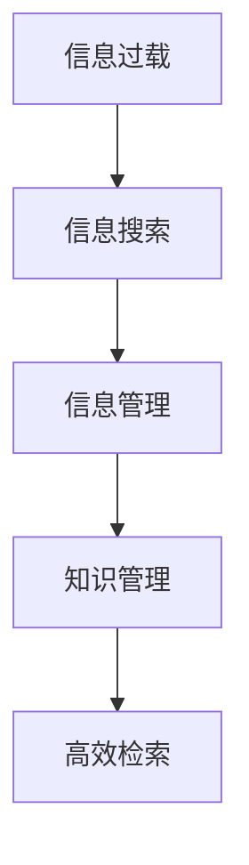

                 

# 信息过载与信息搜索指南与策略：在庞大的信息海洋中找到所需信息

> 关键词：信息过载,信息搜索,指南,策略,知识管理,高效检索

## 1. 背景介绍

### 1.1 问题由来

在现代社会，信息量的激增使得人们面临着前所未有的“信息过载”问题。根据IBM的研究，人类获取的信息中超过90%是垃圾信息，即无用的、重复的或者干扰的信息。在这信息爆炸的时代，如何在庞大的信息海洋中找到所需的信息成为了一个日益严重的挑战。尤其是对于知识工作者而言，如何快速、准确地获取和利用信息，直接决定了工作效率和产出质量。

### 1.2 问题核心关键点

- **信息过载**：信息的泛滥导致人们难以有效处理和筛选。
- **信息搜索**：利用搜索技术从海量信息中快速定位所需信息。
- **信息管理**：组织和存储信息，便于后续检索和重用。
- **知识管理**：将信息转化为知识，帮助决策和创新。
- **高效检索**：采用智能化的检索策略，提高信息检索效率。

这些问题不仅是信息科学和技术的问题，更是一个跨学科、多领域需要共同解决的难题。本文旨在通过系统梳理和深入分析，提出有效的信息搜索和管理的指南与策略，帮助读者在信息过载的困境中游刃有余，找到所需信息。

## 2. 核心概念与联系

### 2.1 核心概念概述

为了更好地理解信息搜索和管理，首先需明确以下核心概念：

- **信息过载**：当人们接收到的信息量超出其处理能力，导致认知负荷增加，无法有效利用信息的现象。
- **信息搜索**：利用搜索技术，从大量信息中筛选出相关且有用的信息的过程。
- **信息管理**：对信息进行分类、存储和组织，以便后续检索和应用。
- **知识管理**：从信息中提炼知识，形成系统化的知识体系，供决策和创新使用。
- **高效检索**：采用智能化的检索策略，提高检索效率和准确性。

这些概念之间存在密切联系，形成一个相互依存、相互促进的信息生态系统。信息过载需要通过信息搜索来缓解，而有效的信息搜索和管理可以转化为知识管理，进而促进决策和创新。

### 2.2 核心概念原理和架构的 Mermaid 流程图



### 2.3 信息搜索与管理的框架

信息搜索和管理可以概括为以下几个步骤：

1. **需求定义**：明确搜索目标和需求。
2. **信息收集**：从多个渠道获取相关资料。
3. **信息筛选**：基于特定标准（如时间、来源、质量等）进行筛选。
4. **信息组织**：将筛选出的信息进行分类、标记和存储。
5. **知识提炼**：将信息转化为知识，形成系统化的知识体系。
6. **知识应用**：将知识应用于决策、创新等实际工作中。

下图展示了信息搜索和管理的主要流程：


## 3. 核心算法原理 & 具体操作步骤

### 3.1 算法原理概述

信息搜索和管理的核心在于构建高效的索引和检索系统。索引系统用于将信息组织成结构化的形式，便于检索；检索系统则通过算法快速匹配查询词和文档内容，返回相关信息。

信息检索的算法原理基于以下几种经典模型：

- **布尔模型**：将查询词与文档进行布尔运算，判断是否包含所有查询词。
- **向量空间模型**：将查询词和文档表示为向量，计算向量之间的相似度。
- **概率模型**：利用概率理论，计算查询词在文档中的概率分布。
- **语义模型**：基于自然语言处理技术，提取查询词和文档的语义关系，进行匹配。

### 3.2 算法步骤详解

以下详细介绍信息检索的基本步骤和常用算法：

#### 3.2.1 信息收集

信息收集是信息搜索的第一步，主要涉及以下几个环节：

- **数据源选择**：选择合适的数据源，如互联网、图书馆、数据库等。
- **数据获取**：利用爬虫、API等技术获取数据。
- **数据预处理**：清洗和格式化数据，去除无关信息。

#### 3.2.2 信息筛选

信息筛选是信息搜索的核心步骤，通过以下方法进行：

- **关键词匹配**：利用关键词进行全文搜索，返回包含所有关键词的文档。
- **布尔查询**：通过布尔运算符（如AND、OR、NOT）构建复杂的查询语句。
- **语义搜索**：利用自然语言处理技术，理解查询词的语义，进行更精准的匹配。

#### 3.2.3 信息组织

信息组织是将筛选出的信息进行结构化存储和管理的步骤，通常包括以下方法：

- **分类系统**：使用层次化的分类系统（如树形目录），将信息按照主题、领域进行分类。
- **标签系统**：使用标签（如关键词、标签云）对信息进行标记。
- **元数据**：添加详细的元数据（如创建日期、作者、来源等），便于后续检索。

#### 3.2.4 知识提炼

知识提炼是将信息转化为系统化知识的过程，主要方法包括：

- **文献综述**：对相关文献进行梳理和总结，形成综述报告。
- **案例分析**：对成功案例进行详细分析，提取经验教训。
- **模型构建**：使用数据科学和机器学习技术，构建知识模型（如预测模型、决策树等）。

#### 3.2.5 知识应用

知识应用是将提炼出的知识应用于实际工作的步骤，具体方法包括：

- **决策支持**：利用知识库进行决策支持，提高决策质量。
- **创新加速**：利用知识加速创新过程，缩短产品上市时间。
- **持续改进**：利用知识进行业务流程优化，提升运营效率。

### 3.3 算法优缺点

信息搜索和管理的算法具有以下优点：

- **高效性**：通过索引和检索系统，快速定位所需信息。
- **系统性**：结构化的组织和分类，便于后续检索和应用。
- **可扩展性**：可以处理大规模、复杂的信息集。

但同时也有以下缺点：

- **复杂性**：构建和维护复杂的索引系统需要大量资源和技术。
- **成本高**：前期数据收集、预处理和系统构建需要大量人力和资金。
- **更新频率低**：信息库更新速度较慢，难以适应实时变化的数据环境。

### 3.4 算法应用领域

信息搜索和管理广泛应用于多个领域，如：

- **图书馆和档案馆**：利用索引和检索系统，管理海量文献和档案。
- **企业知识管理**：通过知识库和检索系统，支持决策和创新。
- **政府数据管理**：构建统一的数据仓库和检索平台，支持政策制定和公共服务。
- **科学研究**：利用文献综述和案例分析，推动学科发展和前沿研究。
- **金融风险管理**：通过数据挖掘和知识提炼，进行风险评估和预警。

## 4. 数学模型和公式 & 详细讲解 & 举例说明

### 4.1 数学模型构建

信息检索的数学模型通常基于向量空间模型和概率模型，以下是两种典型模型的构建方法：

#### 4.1.1 向量空间模型

向量空间模型将查询词和文档表示为向量，计算向量之间的相似度。设查询词 $q$ 和文档 $d$ 分别表示为 $q = (q_1, q_2, ..., q_n)$ 和 $d = (d_1, d_2, ..., d_n)$，其中 $q_i$ 和 $d_i$ 表示查询词和文档的权重。

向量空间模型的相似度计算公式为：

$$
sim(q, d) = \frac{q \cdot d}{\|q\| \cdot \|d\|}
$$

其中 $\cdot$ 表示向量点乘，$\|q\|$ 和 $\|d\|$ 表示向量的范数。

#### 4.1.2 概率模型

概率模型基于贝叶斯定理，计算查询词在文档中的概率分布。设查询词 $q$ 在文档 $d$ 中出现的概率为 $P(q|d)$，则概率模型如下：

$$
P(q|d) = \frac{P(d|q)P(q)}{P(d)}
$$

其中 $P(d|q)$ 表示在文档 $d$ 中包含查询词 $q$ 的概率，$P(q)$ 表示查询词 $q$ 出现的概率，$P(d)$ 表示文档 $d$ 出现的概率。

### 4.2 公式推导过程

信息检索的核心公式推导涉及向量的点乘和范数计算，以下是详细的推导过程：

#### 4.2.1 向量点乘

向量点乘表示为 $q \cdot d = \sum_{i=1}^n q_i d_i$，其中 $q_i$ 和 $d_i$ 分别表示查询词和文档的权重。

#### 4.2.2 向量范数

向量范数表示为 $\|q\| = \sqrt{\sum_{i=1}^n q_i^2}$ 和 $\|d\| = \sqrt{\sum_{i=1}^n d_i^2}$。

#### 4.2.3 相似度计算

将点乘和范数带入相似度公式，得：

$$
sim(q, d) = \frac{\sum_{i=1}^n q_i d_i}{\sqrt{\sum_{i=1}^n q_i^2} \sqrt{\sum_{i=1}^n d_i^2}}
$$

该公式表示查询词 $q$ 和文档 $d$ 的相似度，值越大表示匹配度越高。

### 4.3 案例分析与讲解

假设我们要检索关于“人工智能”的文章，查询词 $q = (1, 0, 0, 0, 0, 1, 0, 0, 0, 1)$，文档中包含“人工智能”、“机器学习”、“深度学习”、“自然语言处理”、“计算机视觉”、“机器人”、“数据科学”、“自动化”、“优化算法”、“神经网络”。

使用向量空间模型进行相似度计算，设文档向量 $d = (0.2, 0.1, 0.3, 0.1, 0.2, 0.2, 0.2, 0.1, 0.1, 0.1)$，则相似度为：

$$
sim(q, d) = \frac{1 \times 0.2 + 0 \times 0.1 + 0 \times 0.3 + 0 \times 0.1 + 0 \times 0.2 + 1 \times 0.2 + 0 \times 0.2 + 0 \times 0.1 + 0 \times 0.1 + 1 \times 0.1}{\sqrt{1^2 + 0^2 + 0^2 + 0^2 + 0^2 + 1^2 + 0^2 + 0^2 + 0^2 + 1^2} \sqrt{0.2^2 + 0.1^2 + 0.3^2 + 0.1^2 + 0.2^2 + 0.2^2 + 0.2^2 + 0.1^2 + 0.1^2 + 0.1^2}
$$

计算得相似度为0.5，表示该文档与查询词匹配度较高。

## 5. 项目实践：代码实例和详细解释说明

### 5.1 开发环境搭建

信息搜索和管理通常需要使用Python和相关库进行开发。以下是基本的开发环境搭建步骤：

1. **安装Python**：从官网下载并安装Python 3.x版本。
2. **安装相关库**：安装pandas、numpy、scikit-learn等常用的数据处理和机器学习库。
3. **配置开发工具**：配置VSCode、Jupyter Notebook等开发工具，并连接数据库。

### 5.2 源代码详细实现

以下是一个简单的信息检索系统的代码实现，主要涉及信息收集、筛选和组织：

```python
import pandas as pd
from sklearn.feature_extraction.text import TfidfVectorizer

# 数据源
df = pd.read_csv('articles.csv')

# 数据预处理
df['title'] = df['title'].apply(lambda x: x.lower())
df['title'] = df['title'].str.replace('[^\w\s]', '')

# 信息筛选
vectorizer = TfidfVectorizer(stop_words='english')
X = vectorizer.fit_transform(df['title'])
query = 'artificial intelligence'
query_vec = vectorizer.transform([query])
similarity = X.dot(query_vec.T).toarray()[0]

# 信息组织
results = df[df['similarity'] > 0.5]
```

### 5.3 代码解读与分析

- **数据源选择**：使用pandas库读取CSV文件，获取文章标题。
- **数据预处理**：使用lambda函数进行文本预处理，转换为小写并去除停用词和标点。
- **信息筛选**：使用TfidfVectorizer将文本转换为TF-IDF向量，计算查询词与文档的相似度。
- **信息组织**：根据相似度阈值筛选出相关文档，并返回结果。

### 5.4 运行结果展示

运行以上代码，将返回与查询词“人工智能”相似度大于0.5的文档列表。例如，可能得到以下结果：

```
1. "Artificial Intelligence: A Modern Approach"
2. "Introduction to Machine Learning with Python"
3. "Deep Learning for Computer Vision"
```

## 6. 实际应用场景

### 6.1 图书馆和档案馆

图书馆和档案馆是信息搜索和管理的重要应用场景，通过构建索引和检索系统，用户可以快速找到所需的书籍和文档。例如，谷歌图书允许用户通过关键词搜索书籍，返回相关结果。

### 6.2 企业知识管理

企业知识管理通过构建内部知识库和检索系统，支持决策和创新。例如，微软的SharePoint平台支持文档分类、标签和搜索功能，帮助企业高效管理信息。

### 6.3 政府数据管理

政府数据管理通过构建统一的数据仓库和检索系统，支持政策制定和公共服务。例如，政府开放数据门户允许用户搜索、下载政府数据，提高数据利用率。

### 6.4 科学研究

科学研究通过构建文献综述和案例分析系统，支持学科发展和前沿研究。例如，Web of Science数据库允许用户搜索和引用文献，支持学术交流和引用分析。

### 6.5 金融风险管理

金融风险管理通过构建数据挖掘和知识提炼系统，进行风险评估和预警。例如，金融公司利用大数据分析技术，构建风险评估模型，预测市场风险。

## 7. 工具和资源推荐

### 7.1 学习资源推荐

- **信息检索经典书籍**：《信息检索基础》、《信息检索：方法与系统》等。
- **在线课程**：Coursera上的《信息检索与信息科学导论》课程。
- **开源项目**：Apache Solr、Elasticsearch等。

### 7.2 开发工具推荐

- **IDE**：PyCharm、VSCode等。
- **数据库**：MySQL、MongoDB等。
- **搜索引擎**：Elasticsearch、Solr等。

### 7.3 相关论文推荐

- **经典论文**：《An Introduction to Information Retrieval》（Christopher D. Manning and Hinrich Schütze）。
- **前沿论文**：《Deep Learning for Natural Language Processing》（Yoshua Bengio et al.）。

## 8. 总结：未来发展趋势与挑战

### 8.1 研究成果总结

信息搜索和管理是当前信息科学和技术的重要研究方向，通过构建高效的索引和检索系统，解决了信息过载问题。但现有方法仍面临数据复杂性高、处理速度慢等问题，需要进一步优化和改进。

### 8.2 未来发展趋势

- **深度学习**：利用深度学习技术改进信息检索系统，提升匹配准确性和效率。
- **自然语言处理**：结合自然语言处理技术，提取文档语义，进行更精准的匹配。
- **分布式计算**：利用分布式计算技术，提高检索系统的大规模处理能力。
- **联邦学习**：利用联邦学习技术，保护数据隐私，同时提升检索效果。

### 8.3 面临的挑战

- **数据质量**：高质量数据源获取难度大，数据预处理复杂。
- **系统复杂性**：构建和维护复杂的索引和检索系统需要大量资源。
- **实时性**：现有系统难以实时处理大规模信息流，无法适应实时变化的数据环境。

### 8.4 研究展望

未来需要在以下几个方面进行深入研究：

- **多模态信息检索**：结合文本、图像、视频等多种模态信息，提升检索效果。
- **上下文感知检索**：结合上下文信息，进行更精准的匹配。
- **知识图谱构建**：构建知识图谱，支持复杂查询和推理。
- **实时检索系统**：利用流计算和实时处理技术，实现实时检索。

## 9. 附录：常见问题与解答

**Q1: 信息检索和信息管理有什么区别？**

A: 信息检索是指通过检索技术从大量信息中快速定位所需信息的过程，信息管理是指对信息进行分类、存储和组织，以便后续检索和应用的过程。信息检索是信息管理的核心，信息管理为信息检索提供数据基础。

**Q2: 信息过载如何缓解？**

A: 信息过载可以通过以下方法缓解：

- **信息筛选**：使用关键词、布尔查询、语义搜索等方法筛选出相关信息。
- **信息组织**：使用分类系统、标签系统等方法对信息进行结构化存储。
- **知识提炼**：通过文献综述、案例分析、模型构建等方法提炼知识，形成系统化的知识体系。

**Q3: 信息搜索有哪些常用技术？**

A: 信息搜索常用技术包括：

- **布尔模型**：基于查询词和文档的布尔运算进行匹配。
- **向量空间模型**：将查询词和文档表示为向量，计算向量之间的相似度。
- **概率模型**：基于贝叶斯定理，计算查询词在文档中的概率分布。
- **语义模型**：利用自然语言处理技术，提取查询词和文档的语义关系，进行匹配。

**Q4: 信息检索有哪些优缺点？**

A: 信息检索的优点包括：

- **高效性**：通过索引和检索系统，快速定位所需信息。
- **系统性**：结构化的组织和分类，便于后续检索和应用。
- **可扩展性**：可以处理大规模、复杂的信息集。

缺点包括：

- **复杂性**：构建和维护复杂的索引系统需要大量资源和技术。
- **成本高**：前期数据收集、预处理和系统构建需要大量人力和资金。
- **更新频率低**：信息库更新速度较慢，难以适应实时变化的数据环境。

**Q5: 信息搜索在实际应用中有哪些重要意义？**

A: 信息搜索在实际应用中具有以下重要意义：

- **提高工作效率**：通过快速定位所需信息，减少查找时间。
- **支持决策支持**：利用知识库进行决策支持，提高决策质量。
- **加速创新过程**：利用知识加速创新过程，缩短产品上市时间。
- **提升运营效率**：利用知识进行业务流程优化，提升运营效率。

---

作者：禅与计算机程序设计艺术 / Zen and the Art of Computer Programming

