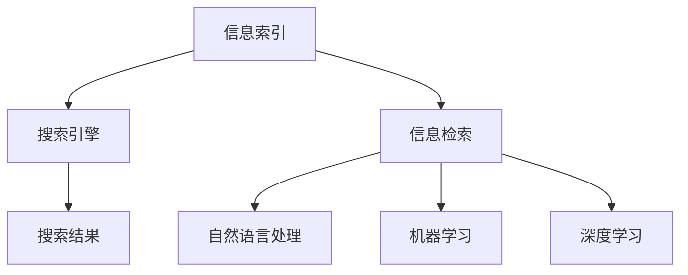

                 

# 信息过载与信息搜索策略与技术：在庞大的信息海洋中找到你需要的信息

## 1. 背景介绍

### 1.1 问题由来

随着互联网和数字化技术的发展，信息获取变得前所未有的便捷，但同时也带来了信息过载（Information Overload）的挑战。信息过载指的是在信息技术日益增长的环境下，人们面临的海量信息远远超出其处理能力，导致注意力和决策能力被分散，无法有效利用信息进行决策和行动。

在信息时代，我们每天面对的是海量的文本、图片、视频等多媒体信息，信息质量参差不齐，找到真正有价值的信息变得极为困难。如何高效地从庞大且杂乱无章的信息海洋中找到自己需要的信息，成为当代社会最迫切需要解决的问题之一。

### 1.2 问题核心关键点

信息搜索的根本目的在于从众多信息中筛选出符合用户需求的相关信息，以便于后续的决策和行动。有效的信息搜索策略与技术是解决信息过载的关键，它能够帮助用户从杂乱的信息源中快速、准确地找到所需的信息。

信息搜索涉及多个核心问题，包括但不限于：
- 如何构建高效的信息索引
- 如何设计高效的搜索算法
- 如何处理不同类型和格式的信息
- 如何评估搜索结果的质量和相关性
- 如何提供个性化的搜索体验

## 2. 核心概念与联系

### 2.1 核心概念概述

为更好地理解信息搜索的原理与技术，本节将介绍几个密切相关的核心概念：

- **信息索引（Information Indexing）**：通过构建索引，将文本、图片、视频等多媒体信息转换为便于搜索的格式，使得快速定位成为可能。索引的效率和准确性直接影响搜索效果。

- **搜索引擎（Search Engine）**：基于索引系统实现的一种工具，帮助用户从海量信息中快速检索出所需的信息。常见的搜索引擎如Google、Bing、百度等。

- **信息检索（Information Retrieval, IR）**：从信息源中获取并组织信息，以支持信息检索的过程。信息检索技术广泛应用于图书馆、数据库、互联网等场景。

- **自然语言处理（Natural Language Processing, NLP）**：涉及语言理解、语言生成、信息抽取、文本分类等技术，是信息检索的基础。

- **机器学习（Machine Learning）**：通过学习用户行为和偏好，优化信息检索的效果和用户体验。

- **深度学习（Deep Learning）**：利用深度神经网络技术，提升信息检索的精度和个性化程度。

这些核心概念之间的逻辑关系可以通过以下Mermaid流程图来展示：



这个流程图展示了几大核心概念之间的联系：

1. 信息索引是搜索引擎的基础，通过构建高效索引系统支持快速检索。
2. 信息检索技术从信息源中提取和组织信息，供搜索引擎检索。
3. 自然语言处理技术处理和理解用户的查询语句，抽取关键词，构建搜索向量。
4. 机器学习和深度学习通过学习用户行为，优化搜索结果的个性化程度。
5. 搜索引擎最终提供给用户个性化的搜索结果，辅助决策和行动。

## 3. 核心算法原理 & 具体操作步骤

### 3.1 算法原理概述

信息检索的根本目标是尽可能精确地匹配用户查询和信息源。因此，信息检索技术可以分为两部分：

- **查询理解（Query Understanding）**：解析和理解用户的查询语句，提取关键词、实体、关系等信息。
- **信息匹配（Information Matching）**：将用户查询与信息源进行匹配，评估匹配结果的相关性。

常见的信息检索算法包括布尔检索、向量空间模型、概率模型等。这些算法通过不同的方式构建索引和匹配机制，实现高效的信息检索。

### 3.2 算法步骤详解

信息检索的主要步骤如下：

1. **构建索引**：
   - 选择适当的索引算法，对信息源进行预处理，如分词、去除停用词、词干化等。
   - 根据查询语句，构建查询向量。
   - 将查询向量与信息源向量进行匹配，计算匹配度得分。

2. **信息检索**：
   - 根据匹配度得分对信息源进行排序。
   - 根据排序结果返回最相关的信息。

3. **用户反馈**：
   - 获取用户对搜索结果的反馈，如点击、阅读时间等。
   - 根据反馈不断优化算法和模型，提升检索效果。

### 3.3 算法优缺点

信息检索技术具有以下优点：
- 高效性：利用索引系统快速定位信息源，提高检索效率。
- 可扩展性：适用于大规模信息源，如互联网、图书馆等。
- 灵活性：支持不同类型的信息检索，如文本、图片、视频等。

同时，也存在一些局限性：
- 索引成本高：构建高质量索引需要大量计算资源和存储资源。
- 查询多样性：不同用户的查询形式和内容差异大，难以统一处理。
- 信息质量：索引系统对信息质量的要求较高，错误信息可能影响检索结果。

### 3.4 算法应用领域

信息检索技术广泛应用于以下领域：

- **搜索引擎**：如Google、Bing、百度等。
- **图书馆管理系统**：索引书籍、期刊、论文等学术资源。
- **企业文档检索**：索引企业文档、专利、邮件等。
- **数字媒体检索**：如图像搜索引擎、视频搜索引擎等。

## 4. 数学模型和公式 & 详细讲解

### 4.1 数学模型构建

信息检索的数学模型通常基于向量空间模型（Vector Space Model, VSM），将查询和信息源表示为向量，计算它们之间的距离（如余弦距离）来评估相关性。

假设查询向量为 $q$，信息源向量为 $d$，余弦距离为 $\cos\theta$，则相关性计算公式为：

$$
\cos\theta = \frac{q \cdot d}{\|q\|\|d\|}
$$

其中，$q \cdot d$ 为点积，$\|q\|$ 和 $\|d\|$ 为向量的模长。

### 4.2 公式推导过程

向量空间模型的核心思想是将查询和文档表示为向量，计算它们之间的余弦距离。以下是详细的推导过程：

设查询向量为 $q=(q_1,q_2,...,q_n)$，信息源向量为 $d=(d_1,d_2,...,d_n)$。向量余弦相似度的定义为：

$$
\cos\theta = \frac{\sum_{i=1}^n q_i d_i}{\sqrt{\sum_{i=1}^n q_i^2} \sqrt{\sum_{i=1}^n d_i^2}}
$$

向量内积定义为：

$$
q \cdot d = \sum_{i=1}^n q_i d_i
$$

向量模长定义为：

$$
\|q\| = \sqrt{\sum_{i=1}^n q_i^2}, \quad \|d\| = \sqrt{\sum_{i=1}^n d_i^2}
$$

### 4.3 案例分析与讲解

假设有一个图书检索系统，查询语句为“人工智能”，信息源向量为：

$$
d_1=(1,0,0,0,0,...)
$$
$$
d_2=(0,1,0,0,0,...)
$$
$$
d_3=(0,0,1,0,0,...)
$$
$$
d_4=(0,0,0,1,0,...)
$$
$$
d_5=(0,0,0,0,1,...)
$$

查询向量为：

$$
q=(0.5,0.5,0,0,...)
$$

计算余弦距离：

$$
\cos\theta = \frac{0.5*1+0.5*0+0*1+0*0+0*0}{\sqrt{0.5^2+0.5^2}\sqrt{1^2+0^2+0^2+0^2+0^2}} = \frac{0.5}{\sqrt{0.25+0.25}} = \frac{1}{\sqrt{2}}
$$

余弦距离越大，说明查询与信息源的相关性越高。在这个例子中，$d_1$ 和 $d_2$ 与查询的相关性较高。

## 5. 项目实践：代码实例和详细解释说明

### 5.1 开发环境搭建

在进行信息检索项目开发前，需要准备好开发环境。以下是使用Python进行Elasticsearch开发的环境配置流程：

1. 安装Elasticsearch：从官网下载并安装Elasticsearch，作为信息检索的索引和检索服务。

2. 安装Python Elasticsearch接口库：
```bash
pip install elasticsearch
```

3. 安装Flask：用于搭建Web应用，提供API接口。
```bash
pip install flask
```

4. 安装其他必要库：如NLTK、spaCy、TensorFlow等。
```bash
pip install nltk spacy tensorflow
```

完成上述步骤后，即可在Elasticsearch环境中进行信息检索项目的开发。

### 5.2 源代码详细实现

下面是一个基于Elasticsearch的信息检索系统的Python代码实现：

```python
from elasticsearch import Elasticsearch
from nltk.tokenize import word_tokenize
from spaCy import load
import tensorflow as tf

# 构建Elasticsearch客户端
es = Elasticsearch([{'host': 'localhost', 'port': 9200}])

# 加载NLP模型
nlp = load('en_core_web_sm')

# 定义查询函数
def query(query_text):
    # 分词
    query_words = word_tokenize(query_text)

    # 构建查询向量
    query_vector = []
    for word in query_words:
        query_vector.append(word)

    # 构建查询条件
    query = {
        "query": {
            "match": {
                "text": query_text
            }
        }
    }

    # 检索文档
    results = es.search(index="books", body=query)
    book_documents = results['hits']['hits']

    # 计算相关性
    cosine_similarities = []
    for book in book_documents:
        book_text = book['_source']['text']
        book_vector = book_text.split()
        similarity = calculate_cosine_similarity(query_vector, book_vector)
        cosine_similarities.append(similarity)

    # 返回相关文档
    return sorted(book_documents, key=lambda x: cosine_similarities[book_documents.index(x)], reverse=True)

# 计算余弦相似度
def calculate_cosine_similarity(q, d):
    q = [token.lower() for token in q]
    d = [token.lower() for token in d]
    q_vector = {}
    d_vector = {}
    for term in q:
        if term in d:
            q_vector[term] = q_vector.get(term, 0) + 1
    for term in d:
        d_vector[term] = d_vector.get(term, 0) + 1
    q_sum = sum(q_vector.values())
    d_sum = sum(d_vector.values())
    if q_sum == 0 or d_sum == 0:
        return 0
    cosine_similarity = sum(q_vector.get(term, 0) * d_vector.get(term, 0) for term in q) / (sqrt(q_sum) * sqrt(d_sum))
    return cosine_similarity

# 测试查询
query_text = "人工智能"
results = query(query_text)
for result in results:
    print(result['_source'])
```

### 5.3 代码解读与分析

让我们再详细解读一下关键代码的实现细节：

**Elasticsearch客户端**：
- 创建Elasticsearch客户端，连接本地9200端口的Elasticsearch服务。

**NLP模型**：
- 使用spaCy模型对查询文本进行分词，构建查询向量。

**查询函数**：
- 将查询文本分词，构建查询向量。
- 定义Elasticsearch查询条件，检索与查询文本相关的文档。
- 计算查询向量与文档向量之间的余弦相似度，按相似度排序返回相关文档。

**余弦相似度计算**：
- 将查询向量和文档向量转换为词典形式。
- 计算余弦相似度公式中的点积和模长。
- 返回余弦相似度得分。

**测试查询**：
- 查询“人工智能”，输出相关文档。

可以看到，Python配合Elasticsearch和NLP模型，使得信息检索代码实现变得简洁高效。开发者可以将更多精力放在数据处理、模型改进等高层逻辑上，而不必过多关注底层的实现细节。

## 6. 实际应用场景

### 6.1 图书馆检索系统

图书馆拥有海量的书籍和期刊，用户需要从中快速找到所需的信息。通过构建索引系统，将图书内容转换为向量，利用Elasticsearch进行高效检索，用户可以迅速找到所需的书本。

在实际应用中，图书馆可以收集用户的借阅历史、检索记录等行为数据，结合NLP模型进行用户画像建模，提供个性化的检索推荐服务，提升用户体验。

### 6.2 企业文档管理

企业文档管理系统需要快速检索到与用户请求相关的文档。通过构建索引系统，将文档内容转换为向量，利用Elasticsearch进行高效检索，用户可以快速定位到所需文档。

在实际应用中，企业可以收集用户搜索行为数据，结合NLP模型进行文档分类和排序，提升检索准确性和用户体验。

### 6.3 智能客服系统

智能客服系统需要快速匹配用户问题与知识库中的答案，提供合适的解答。通过构建索引系统，将知识库中的文本信息转换为向量，利用Elasticsearch进行高效检索，系统可以迅速匹配到相关答案。

在实际应用中，客服系统可以结合用户历史记录和上下文信息，提供更加个性化的服务，提升客户满意度。

### 6.4 未来应用展望

随着信息检索技术的不断发展，其在更多领域的应用前景将更加广阔：

- **智能医疗**：利用电子病历、医学文献等构建索引系统，快速检索相关医疗信息，辅助医生诊疗决策。

- **智能金融**：利用金融新闻、报告等构建索引系统，快速检索相关金融信息，辅助投资分析和风险评估。

- **智能教育**：利用教材、课程等构建索引系统，快速检索相关教育资源，辅助教师教学和学生学习。

- **智能交通**：利用交通数据、地图等构建索引系统，快速检索相关交通信息，辅助交通规划和管理。

此外，随着深度学习和大数据技术的不断进步，信息检索系统将能够处理更复杂的查询和信息源，提供更加个性化和智能化的服务，进一步提升用户体验和信息检索效果。

## 7. 工具和资源推荐

### 7.1 学习资源推荐

为了帮助开发者系统掌握信息检索的理论基础和实践技巧，这里推荐一些优质的学习资源：

1. **《信息检索原理与实践》**：系统介绍信息检索的基本概念、技术和算法，适合初学者和进阶者。

2. **CSIRI课程**：斯坦福大学开设的信息检索课程，有Lecture视频和配套作业，提供全面深入的课程内容。

3. **《Python Elasticsearch Cookbook》**：详细讲解如何使用Elasticsearch进行信息检索，包括索引构建、查询优化等。

4. **《自然语言处理与信息检索》**：讲解自然语言处理与信息检索的结合，提供丰富的案例和实践指南。

5. **《深度学习与信息检索》**：介绍深度学习在信息检索中的应用，包括模型构建、训练和优化。

通过对这些资源的学习实践，相信你一定能够快速掌握信息检索的精髓，并用于解决实际的检索问题。

### 7.2 开发工具推荐

高效的开发离不开优秀的工具支持。以下是几款用于信息检索开发的常用工具：

1. **Elasticsearch**：作为信息检索的核心引擎，Elasticsearch提供了高效的索引和检索功能，支持海量数据处理。

2. **Flask**：Python Web框架，用于搭建API接口，支持RESTful架构，方便信息检索系统的部署和扩展。

3. **NLTK**：自然语言处理工具包，提供丰富的文本处理功能，如分词、词性标注、命名实体识别等。

4. **spaCy**：快速高效的自然语言处理库，支持大规模数据处理和自定义模型构建。

5. **TensorFlow**：深度学习框架，提供丰富的深度学习算法，可用于构建复杂的信息检索模型。

6. **TensorBoard**：TensorFlow的可视化工具，用于监控模型训练状态，提供丰富的图表和指标分析功能。

合理利用这些工具，可以显著提升信息检索任务的开发效率，加快创新迭代的步伐。

### 7.3 相关论文推荐

信息检索技术的发展源于学界的持续研究。以下是几篇奠基性的相关论文，推荐阅读：

1. **《Vector Space Models for Information Retrieval》**：提出向量空间模型，为信息检索提供数学基础。

2. **《Probabilistic Information Retrieval》**：介绍概率模型在信息检索中的应用，提高检索准确性。

3. **《Structured Querying of Unstructured Information》**：提出结构化查询语言，支持多类型信息的检索。

4. **《TextRank: Bringing Order into Texts》**：提出TextRank算法，用于文本相似度计算，提升信息检索效果。

5. **《BERT: Pre-training of Deep Bidirectional Transformers for Language Understanding》**：提出BERT模型，利用预训练语言模型提升信息检索的精度。

这些论文代表了大规模语言模型在信息检索领域的发展脉络。通过学习这些前沿成果，可以帮助研究者把握学科前进方向，激发更多的创新灵感。

## 8. 总结：未来发展趋势与挑战

### 8.1 总结

本文对信息检索的原理与技术进行了全面系统的介绍。首先阐述了信息过载问题的背景和信息检索的必要性，明确了信息检索在信息时代的重要性。其次，从原理到实践，详细讲解了信息检索的数学模型和具体操作步骤，给出了信息检索任务开发的完整代码实例。同时，本文还广泛探讨了信息检索技术在图书馆、企业、智能客服等多个领域的应用前景，展示了信息检索范式的强大潜力。此外，本文精选了信息检索技术的各类学习资源，力求为读者提供全方位的技术指引。

通过本文的系统梳理，可以看到，信息检索技术在处理大规模信息源、提升检索效果和用户体验方面具有重要的应用价值。未来，伴随深度学习和大数据技术的不断进步，信息检索技术将进一步向个性化、智能化方向发展，为人类社会提供更加高效、便捷的信息服务。

### 8.2 未来发展趋势

展望未来，信息检索技术将呈现以下几个发展趋势：

1. **深度学习与信息检索的融合**：利用深度学习模型提升信息检索的精度和效果，特别是在多模态信息检索和语义理解方面。

2. **个性化与推荐系统**：结合用户行为和偏好，提供个性化的信息检索服务，提升用户体验。

3. **跨领域知识图谱**：将不同领域的信息和知识进行融合，构建跨领域的知识图谱，提升信息检索的全面性和深度。

4. **智能问答系统**：利用信息检索和自然语言处理技术，构建智能问答系统，提供即时互动的用户服务。

5. **动态更新与持续学习**：实现信息检索系统的动态更新和持续学习，提升模型的时效性和适应性。

6. **多语言支持**：支持多语言的信息检索，拓展信息检索的应用范围，满足全球用户的需求。

这些趋势凸显了信息检索技术的广阔前景。这些方向的探索发展，必将进一步提升信息检索系统的性能和应用范围，为人类社会提供更加高效、便捷的信息服务。

### 8.3 面临的挑战

尽管信息检索技术已经取得了显著成就，但在迈向更加智能化、普适化应用的过程中，它仍面临着诸多挑战：

1. **索引成本高**：构建高质量索引需要大量计算资源和存储资源，难以处理海量数据。

2. **数据多样性**：不同类型和格式的信息源，如文本、图片、视频等，难以统一处理。

3. **数据质量**：索引系统对信息质量的要求较高，错误信息可能影响检索结果。

4. **查询多样性**：不同用户的查询形式和内容差异大，难以统一处理。

5. **计算资源需求高**：深度学习模型和大规模数据处理需要高性能计算资源，资源消耗大。

6. **算法复杂性**：深度学习模型和高性能计算技术，增加了算法的复杂性和开发难度。

这些挑战需要在理论和实践中不断探索和突破，才能实现信息检索技术的全面普及和应用。

### 8.4 研究展望

面对信息检索技术面临的挑战，未来的研究需要在以下几个方面寻求新的突破：

1. **轻量级索引技术**：开发轻量级索引算法，降低索引成本，提高索引效率。

2. **多模态信息检索**：结合视觉、音频等模态信息，提升信息检索的全面性和准确性。

3. **实时索引与检索**：实现实时索引和检索功能，提高信息检索的时效性。

4. **分布式信息检索**：利用分布式计算技术，处理大规模信息源，提升信息检索的扩展性。

5. **可解释性增强**：提升信息检索系统的可解释性，增强用户信任和使用效果。

6. **跨领域知识图谱**：构建跨领域知识图谱，实现多领域信息检索和知识融合。

这些研究方向将推动信息检索技术向更加智能化、普适化和可解释性方向发展，为人类社会提供更加高效、便捷的信息服务。

## 9. 附录：常见问题与解答

**Q1：信息检索是否只适用于文本信息？**

A: 信息检索并不仅限于文本信息，可以处理图片、视频、音频等多媒体信息。通过构建相应的索引系统，实现多模态信息的检索。

**Q2：信息检索是否需要海量数据？**

A: 信息检索并不要求海量数据，但数据量越大，检索效果通常越好。对于小规模数据，可以使用简单的向量空间模型或布尔检索。

**Q3：如何提高信息检索的准确性？**

A: 提高信息检索准确性的方法包括：
1. 构建高质量的索引系统，如TF-IDF权重计算、倒排索引等。
2. 优化查询模型，如使用布尔检索、向量空间模型、概率模型等。
3. 结合自然语言处理技术，提升查询理解和信息匹配的准确性。
4. 利用深度学习模型，提升检索模型的精度和泛化能力。

**Q4：如何处理信息过载？**

A: 处理信息过载的方法包括：
1. 构建个性化推荐系统，根据用户行为推荐相关内容。
2. 利用自然语言处理技术，提取用户关注点和兴趣点，提供定制化的信息检索服务。
3. 引入过滤和筛选机制，如关键词过滤、情感分析等，筛选出高质量内容。
4. 利用机器学习技术，优化信息检索算法，提高检索效果。

**Q5：信息检索系统如何处理长尾问题？**

A: 信息检索系统可以通过以下方法处理长尾问题：
1. 引入长尾优化算法，优化索引和检索算法，提高长尾数据的检索效果。
2. 结合用户行为数据，预测长尾查询的可能性，提前优化索引系统。
3. 引入用户反馈机制，根据用户点击和阅读行为，动态调整索引和检索策略。

这些方法可以帮助信息检索系统更好地处理长尾问题，提升信息检索的全面性和准确性。

---

作者：禅与计算机程序设计艺术 / Zen and the Art of Computer Programming

