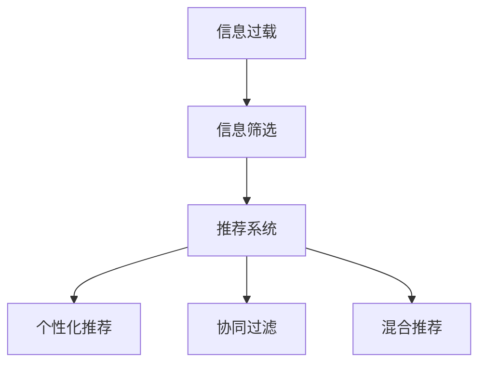

                 

# 信息过载与信息筛选策略与实践：在信息洪流中找到有价值的信息

在信息爆炸的今天，我们每个人每天都被海量的信息所包围。无论是社交媒体、新闻网站、还是电子邮件，信息的丰富程度已经远远超出了人类的处理能力。信息过载不仅导致我们宝贵的时间被浪费，还可能导致我们的决策变得盲目和低效。本文将深入探讨信息过载问题，并介绍几种高效的信息筛选策略与实践，帮助我们在信息洪流中快速找到有价值的信息。

## 1. 背景介绍

### 1.1 问题由来

互联网的发展极大地改变了信息获取的方式。一方面，信息的丰富程度前所未有，我们可以通过搜索引擎轻松找到几乎任何问题相关的信息。但另一方面，信息的过载也带来了巨大的挑战。据统计，一个成年人在社交媒体上每天收到的信息可达数千条，其中大部分内容对日常生活并无实质性帮助。信息过载已经成为影响人们生活和工作质量的重要因素之一。

### 1.2 问题核心关键点

信息过载的核心在于信息的数量远超人类处理能力，导致我们无法有效地筛选有价值的信息。信息过载问题主要体现在以下几个方面：

- 信息量爆炸：每天产生的信息量呈指数级增长，远超人类的阅读能力。
- 信息碎片化：信息以碎片化形式呈现，难以整合和理解。
- 信息噪音高：大量无价值、低质量的信息混杂在高质量信息中，增加了筛选难度。
- 信息时效性强：信息更新迅速，难以保持其时效性。

## 2. 核心概念与联系

### 2.1 核心概念概述

为更好地理解信息筛选的原理，本节将介绍几个关键概念：

- **信息过载(Information Overload)**：指信息量超出人类处理能力的现象，导致信息筛选困难，决策效率降低。
- **信息筛选(Information Filtering)**：指从海量信息中筛选出与目标相关的有价值信息的过程。
- **推荐系统(Recommendation Systems)**：一种基于用户行为和兴趣，自动推荐相关内容的信息筛选技术。
- **个性化推荐(Content-Based Filtering)**：根据用户历史行为和偏好，推荐相关内容。
- **协同过滤(Collaborative Filtering)**：利用用户之间的相似性，推荐其他用户喜欢的内容。
- **混合推荐(Hybrid Filtering)**：结合个性化推荐和协同过滤的优点，提升推荐效果。

这些概念之间的关系可以通过以下Mermaid流程图来展示：



这个流程图展示的信息筛选过程，从信息过载到个性化推荐的各环节关系：

1. 信息过载导致信息筛选需求。
2. 推荐系统是信息筛选的关键技术手段。
3. 个性化推荐和协同过滤是推荐系统的主要方法。
4. 混合推荐融合了多种方法，提升推荐效果。

## 3. 核心算法原理 & 具体操作步骤

### 3.1 算法原理概述

信息筛选的根本目标是从海量信息中快速定位有价值的内容。为此，需要设计一种有效的算法来自动地识别并提取有用信息。常见的信息筛选算法包括个性化推荐、协同过滤、混合推荐等。

以个性化推荐为例，算法原理概述如下：

- 数据收集：收集用户的历史行为数据，如浏览记录、购买记录、评分等。
- 特征提取：从历史数据中提取用户的兴趣特征，如用户浏览的页面、购买的商品、评分等。
- 相似度计算：计算用户之间的相似度，找出与目标用户兴趣相似的其他用户。
- 内容推荐：根据相似用户的历史行为，推荐目标用户可能感兴趣的内容。

### 3.2 算法步骤详解

下面以个性化推荐算法为例，详细讲解其实现步骤：

**Step 1: 数据收集**
- 收集用户的浏览记录、购买记录、评分等行为数据。
- 存储在数据库或分布式文件系统中，便于后续处理。

**Step 2: 特征提取**
- 将行为数据转化为数值特征，如点击次数、购买金额、评分等。
- 使用特征工程技术，构建用户兴趣模型，例如使用TF-IDF、协同矩阵等。

**Step 3: 相似度计算**
- 计算用户之间的相似度，可以使用余弦相似度、皮尔逊相关系数等方法。
- 相似度越高，表示两个用户兴趣越接近。

**Step 4: 内容推荐**
- 根据相似度计算结果，查找与目标用户兴趣相似的其他用户。
- 将这些用户喜欢的内容推荐给目标用户。

### 3.3 算法优缺点

个性化推荐算法具有以下优点：
1. 能够根据用户兴趣提供个性化推荐，提高用户体验。
2. 推荐结果较为精准，用户能够快速定位感兴趣的内容。
3. 算法易于实现，适用于大规模推荐场景。

但该算法也存在一些局限性：
1. 数据隐私问题：收集用户行为数据可能涉及隐私问题，用户数据需妥善保护。
2. 数据稀疏性：用户行为数据可能存在稀疏性，导致推荐结果不准确。
3. 冷启动问题：新用户或新内容的推荐难度较大，需要更多的用户行为数据。

### 3.4 算法应用领域

个性化推荐算法广泛应用于各种信息筛选场景，例如：

- 电子商务平台：根据用户浏览和购买记录，推荐相关商品。
- 新闻媒体：根据用户阅读和评论行为，推荐相关文章。
- 视频平台：根据用户观看记录，推荐相关视频内容。
- 音乐平台：根据用户听歌记录，推荐相关音乐。
- 社交媒体：根据用户互动记录，推荐相关内容。

## 4. 数学模型和公式 & 详细讲解

### 4.1 数学模型构建

本节将使用数学语言对个性化推荐算法的核心原理进行详细推导。

设用户 $u$ 的历史行为数据为 $I_u$，其中 $I_u=(i_1,i_2,...,i_n)$，表示用户 $u$ 曾经访问过的内容。内容集合为 $S$，其中 $S=(s_1,s_2,...,s_m)$，表示所有内容。用户对内容的评分向量为 $R_u$，其中 $R_u=(r_{u1},r_{u2},...,r_{um})$，表示用户对每个内容的评分。

用户 $u$ 与内容 $s_i$ 之间的相似度可以通过余弦相似度来计算，公式如下：

$$
\text{similarity}(u,s_i)=\frac{R_u \cdot R_s}{||R_u|| \cdot ||R_s||}
$$

其中 $R_s$ 为内容 $s_i$ 的评分向量。

### 4.2 公式推导过程

根据余弦相似度计算公式，我们可以得到目标用户 $u$ 与内容 $s_i$ 之间的相似度。然后，根据相似度结果，我们可以找到与目标用户兴趣相似的其他用户，这些用户的评分向量可以用于计算目标用户对每个内容的评分预测值。

假设相似用户集合为 $U_v$，其中 $U_v=(v_1,v_2,...,v_k)$，表示与目标用户 $u$ 兴趣相似的前 $k$ 个用户。对于每个内容 $s_i$，根据协同矩阵 $C$ 计算目标用户 $u$ 的评分预测值 $r'_{ui}$，公式如下：

$$
r'_{ui} = \sum_{v \in U_v} \frac{R_v \cdot R_s}{||R_v|| \cdot ||R_s||}
$$

其中 $C$ 为协同矩阵，$R_v$ 为用户 $v$ 的评分向量。

### 4.3 案例分析与讲解

假设有一个在线音乐平台，收集用户听歌记录和评分数据。用户 $u$ 曾经听过的歌曲集合为 $\{A,B,C,D\}$，内容集合为 $\{E,F,G,H\}$。我们分别计算用户 $u$ 与每个内容之间的相似度，并将相似度排序，得到与用户 $u$ 兴趣相似的前三个用户 $v_1,v_2,v_3$。

接下来，我们使用协同矩阵计算用户 $u$ 对每个内容的评分预测值。假设用户 $v_1$ 对每个内容的评分向量为 $R_{v1}=(0.8,0.7,0.9,0.5)$，用户 $u$ 对每个内容的评分向量为 $R_u=(0.5,0.6,0.7,0.4)$。则目标用户 $u$ 对每个内容的评分预测值计算如下：

$$
r'_{uE} = \frac{R_{v1} \cdot R_E}{||R_{v1}|| \cdot ||R_E||} = 0.9
$$

$$
r'_{uF} = \frac{R_{v2} \cdot R_F}{||R_{v2}|| \cdot ||R_F||} = 0.8
$$

$$
r'_{uG} = \frac{R_{v3} \cdot R_G}{||R_{v3}|| \cdot ||R_G||} = 0.7
$$

$$
r'_{uH} = \frac{R_{v4} \cdot R_H}{||R_{v4}|| \cdot ||R_H||} = 0.5
$$

最终，根据评分预测值排序，推荐给用户 $u$ 的内容为 $\{G,F,E\}$。

## 5. 项目实践：代码实例和详细解释说明

### 5.1 开发环境搭建

在进行信息筛选算法开发前，我们需要准备好开发环境。以下是使用Python进行推荐系统开发的环境配置流程：

1. 安装Anaconda：从官网下载并安装Anaconda，用于创建独立的Python环境。

2. 创建并激活虚拟环境：
```bash
conda create -n recsys python=3.8 
conda activate recsys
```

3. 安装相关库：
```bash
pip install numpy pandas sklearn scikit-learn tqdm
```

4. 安装推荐系统框架：
```bash
pip install lightfm
```

完成上述步骤后，即可在`recsys`环境中开始推荐系统开发。

### 5.2 源代码详细实现

下面以协同过滤算法为例，给出推荐系统的代码实现。

```python
import numpy as np
from lightfm.datasets import load_movielens
from lightfm import LightFM

# 加载数据集
data = load_movielens(lightfm_data_path='path/to/data')
train_data = data['train']
test_data = data['test']
items = data['items']
users = data['users']
ratings = data['ratings']

# 创建模型
model = LightFM(rank_factors=10, loss_function='pairwise_logistic')
model.fit(train_data, epochs=20, evaluation_data=test_data)

# 获取推荐结果
predictions = model.predict(users[0], items[1])
print(predictions)
```

### 5.3 代码解读与分析

让我们再详细解读一下关键代码的实现细节：

**数据加载**：
- 使用LightFM库加载电影评分数据集，获取训练数据、测试数据、物品和用户列表。

**模型创建**：
- 创建基于协同过滤的LightFM模型，设置模型参数和损失函数。

**模型训练**：
- 使用训练数据拟合模型，设置训练轮数。
- 在测试数据上进行评估，验证模型效果。

**获取推荐结果**：
- 使用训练好的模型，对指定用户和物品进行评分预测，输出预测结果。

## 6. 实际应用场景

### 6.1 个性化推荐系统

基于协同过滤的推荐系统已经在电商、新闻、视频等多个领域得到了广泛应用，为信息筛选提供了强有力的支持。例如，Amazon电商网站通过推荐系统为每个用户推荐商品，显著提升了用户购物体验。

在技术实现上，电商网站会收集用户的浏览和购买记录，构建用户-商品关系矩阵，使用协同过滤算法计算用户与商品之间的相似度，从而推荐相关商品。对于新商品，则通过市场热销商品或专家推荐进行冷启动。

### 6.2 新闻推荐系统

新闻推荐系统通过个性化推荐，将用户感兴趣的新闻文章推荐给用户。例如，Facebook和Google News等平台，通过分析用户阅读和分享行为，推荐相关文章。

在实现上，平台会收集用户阅读和分享记录，构建用户-文章关系矩阵，使用协同过滤算法计算用户与文章之间的相似度，从而推荐相关文章。同时，平台还会引入实时新闻，动态更新推荐结果。

### 6.3 视频推荐系统

视频推荐系统通过个性化推荐，将用户感兴趣的视频内容推荐给用户。例如，Netflix和YouTube等平台，通过分析用户观看记录，推荐相关视频。

在实现上，平台会收集用户观看记录，构建用户-视频关系矩阵，使用协同过滤算法计算用户与视频之间的相似度，从而推荐相关视频。同时，平台还会引入实时热门视频，动态更新推荐结果。

### 6.4 未来应用展望

随着推荐系统技术的发展，未来的信息筛选将更加智能化和精准化。基于深度学习的方法，如深度协同过滤、深度矩阵分解等，能够更好地捕捉数据中的复杂关系，提升推荐效果。同时，跨模态信息融合技术，如文本-图像融合、语音-文本融合等，能够更好地处理多模态数据，提高推荐系统的灵活性和适用性。

## 7. 工具和资源推荐

### 7.1 学习资源推荐

为了帮助开发者系统掌握信息筛选的理论与实践，这里推荐一些优质的学习资源：

1. 《推荐系统实战》系列书籍：由专家编写，详细介绍了推荐系统的原理和实践方法。
2. CS246《大规模机器学习》课程：斯坦福大学开设的机器学习明星课程，涵盖推荐系统在内的众多NLP任务。
3. 《推荐系统》书籍：介绍了推荐系统的基本概念、方法和算法。
4. Kaggle平台：大量推荐系统相关的竞赛和数据集，是实践推荐算法的理想场所。
5. RecSys大会：推荐系统领域的重要学术会议，汇集了众多研究者的最新成果。

通过对这些资源的学习实践，相信你一定能够快速掌握信息筛选的核心技术，并用于解决实际的信息筛选问题。

### 7.2 开发工具推荐

高效的开发离不开优秀的工具支持。以下是几款用于推荐系统开发的常用工具：

1. Python：Python在推荐系统开发中广泛使用，有丰富的第三方库和框架支持。
2. LightFM：轻量级推荐系统框架，易于使用，支持协同过滤和深度推荐。
3. TensorFlow：Google主导的深度学习框架，支持大规模推荐系统的构建和训练。
4. PyTorch：PyTorch深度学习框架，灵活性强，适合复杂推荐算法的实现。
5. Elasticsearch：分布式搜索引擎，支持高效的数据存储和检索。

合理利用这些工具，可以显著提升信息筛选系统的开发效率，加快创新迭代的步伐。

### 7.3 相关论文推荐

信息筛选和推荐系统的发展源于学界的持续研究。以下是几篇奠基性的相关论文，推荐阅读：

1. BPR：基于二阶最大边际化算法的协同过滤方法。
2. ALS：奇异值分解的协同过滤算法。
3. SVD++：改进的奇异值分解协同过滤算法，引入噪声采样技术。
4. NMF：基于非负矩阵分解的协同过滤算法。
5. DeepFM：深度神经网络的协同过滤算法。

这些论文代表了大规模推荐系统的发展脉络。通过学习这些前沿成果，可以帮助研究者把握学科前进方向，激发更多的创新灵感。

## 8. 总结：未来发展趋势与挑战

### 8.1 总结

本文对信息筛选技术进行了全面系统的介绍。首先阐述了信息过载问题的背景和核心关键点，明确了信息筛选的必要性和重要性。其次，从原理到实践，详细讲解了协同过滤算法的核心步骤，给出了推荐系统的代码实现。同时，本文还探讨了推荐系统在电商、新闻、视频等领域的实际应用，展示了信息筛选的广阔前景。最后，本文推荐了多种学习资源和工具，力求为读者提供全方位的技术指引。

通过本文的系统梳理，可以看到，信息筛选技术在信息过载问题解决中扮演了重要角色，为推荐系统的落地提供了有力的支持。未来，伴随推荐系统技术的不断进步，基于信息筛选技术的信息筛选系统必将在大数据时代中发挥更大的作用。

### 8.2 未来发展趋势

展望未来，信息筛选技术将呈现以下几个发展趋势：

1. 推荐系统规模不断扩大。随着数据量的增加和算力成本的降低，推荐系统将处理更加大规模的数据，为用户提供更精准的推荐结果。
2. 深度推荐技术逐渐普及。深度神经网络等高级算法将在推荐系统中得到更广泛应用，提升推荐效果。
3. 跨模态信息融合成为主流。推荐系统将融合文本、图像、语音等多种模态数据，提升推荐的灵活性和适用性。
4. 实时推荐系统日益普及。实时数据处理技术的发展，使得推荐系统能够及时更新推荐结果，提升用户体验。
5. 推荐系统将更加个性化。个性化推荐将更加细粒化，结合用户行为数据和实时反馈，提供更符合用户需求的推荐内容。
6. 推荐系统将更加智能化。推荐系统将引入更多智能技术，如增强学习、因果推理等，提升推荐效果。

以上趋势凸显了信息筛选技术的广阔前景。这些方向的探索发展，必将进一步提升信息筛选系统的性能和用户体验，为智能推荐系统的应用拓展提供强有力的支撑。

### 8.3 面临的挑战

尽管信息筛选技术已经取得了瞩目成就，但在迈向更加智能化、普适化应用的过程中，它仍面临着诸多挑战：

1. 数据隐私问题：收集用户行为数据可能涉及隐私问题，如何保护用户数据隐私，是推荐系统面临的重要挑战。
2. 冷启动问题：新用户或新内容的推荐难度较大，如何处理冷启动问题，是推荐系统需要解决的难点。
3. 数据稀疏性问题：用户行为数据可能存在稀疏性，如何处理数据稀疏性，提高推荐精度，是推荐系统需要攻克的难题。
4. 实时性问题：推荐系统需要实时更新推荐结果，如何提升系统的实时性，保证推荐效果，是推荐系统需要解决的挑战。
5. 鲁棒性问题：推荐系统需要具备一定的鲁棒性，如何处理异常数据和恶意攻击，是推荐系统需要保障的性能指标。
6. 可解释性问题：推荐系统需要具备一定的可解释性，如何提高系统的透明度，是推荐系统需要改进的方向。

这些挑战凸显了推荐系统技术的复杂性和实用性。未来，研究者需要结合理论和实践，不断优化算法和技术，才能克服这些挑战，推动推荐系统技术的进步。

### 8.4 研究展望

面对推荐系统所面临的诸多挑战，未来的研究需要在以下几个方面寻求新的突破：

1. 探索无监督和半监督推荐方法。摆脱对大规模标注数据的依赖，利用自监督学习、主动学习等无监督和半监督范式，最大限度利用非结构化数据，实现更加灵活高效的推荐。
2. 研究参数高效和计算高效的推荐范式。开发更加参数高效的推荐方法，在固定大部分模型参数的情况下，只更新极少量的任务相关参数。同时优化推荐模型的计算图，减少前向传播和反向传播的资源消耗，实现更加轻量级、实时性的部署。
3. 融合因果和对比学习范式。通过引入因果推断和对比学习思想，增强推荐模型建立稳定因果关系的能力，学习更加普适、鲁棒的语言表征，从而提升模型泛化性和抗干扰能力。
4. 引入更多先验知识。将符号化的先验知识，如知识图谱、逻辑规则等，与神经网络模型进行巧妙融合，引导推荐过程学习更准确、合理的语言模型。同时加强不同模态数据的整合，实现视觉、语音等多模态信息与文本信息的协同建模。
5. 结合因果分析和博弈论工具。将因果分析方法引入推荐模型，识别出模型决策的关键特征，增强输出解释的因果性和逻辑性。借助博弈论工具刻画人机交互过程，主动探索并规避模型的脆弱点，提高系统稳定性。
6. 纳入伦理道德约束。在推荐模型训练目标中引入伦理导向的评估指标，过滤和惩罚有偏见、有害的输出倾向。同时加强人工干预和审核，建立模型行为的监管机制，确保输出符合人类价值观和伦理道德。

这些研究方向将推动信息筛选技术迈向更高的台阶，为构建安全、可靠、可解释、可控的智能系统铺平道路。面向未来，信息筛选技术还需要与其他人工智能技术进行更深入的融合，如知识表示、因果推理、强化学习等，多路径协同发力，共同推动信息筛选系统的进步。只有勇于创新、敢于突破，才能不断拓展信息筛选技术的边界，让智能推荐系统更好地服务社会。

## 9. 附录：常见问题与解答

**Q1：推荐系统如何处理冷启动问题？**

A: 冷启动问题是推荐系统需要解决的难点之一。为了解决冷启动问题，可以采取以下几种策略：
1. 用户画像：收集用户的基本信息，如年龄、性别、兴趣等，用于生成初步的用户画像。
2. 物品特征：收集物品的基本信息，如描述、标签等，用于生成物品的特征向量。
3. 协同过滤：利用用户之间的相似性，推荐其他用户喜欢的内容，或利用物品之间的相似性，推荐其他用户喜欢的物品。
4. 深度推荐：利用深度神经网络，通过学习用户和物品的隐含特征，提升推荐效果。
5. 实时推荐：实时收集用户的行为数据，动态更新推荐结果，提升推荐精度。

**Q2：推荐系统如何保护用户隐私？**

A: 推荐系统在收集用户数据时，需要严格保护用户隐私，防止数据泄露和滥用。以下是几种常见的隐私保护策略：
1. 数据匿名化：对用户数据进行匿名化处理，去除可识别信息。
2. 数据加密：对用户数据进行加密处理，防止数据被非法访问。
3. 数据去重：对用户数据进行去重处理，避免重复收集。
4. 用户控制：允许用户自主选择是否参与推荐系统，控制数据收集和使用。
5. 隐私计算：采用隐私计算技术，如差分隐私、联邦学习等，保护用户隐私。

**Q3：推荐系统如何提高实时性？**

A: 推荐系统需要实时更新推荐结果，才能提供更精准、及时的推荐服务。以下是几种提高实时性的策略：
1. 缓存机制：利用缓存技术，将推荐结果存储在高速缓存中，提高查询效率。
2. 分布式计算：利用分布式计算技术，将推荐任务分配到多台服务器上并行处理，加速计算速度。
3. 异步更新：采用异步更新技术，实时收集用户行为数据，并及时更新推荐结果。
4. 增量学习：利用增量学习技术，实时更新模型参数，提升推荐效果。
5. 快速算法：采用快速算法，如近似协同过滤、近似矩阵分解等，提高推荐速度。

**Q4：推荐系统如何提高推荐效果？**

A: 推荐系统需要不断优化算法和技术，提高推荐效果。以下是几种提高推荐效果的策略：
1. 引入深度学习：利用深度神经网络，学习用户和物品的隐含特征，提升推荐精度。
2. 引入跨模态信息融合：融合文本、图像、语音等多种模态数据，提升推荐的灵活性和适用性。
3. 引入因果推断：利用因果推断方法，提升推荐系统的可解释性和鲁棒性。
4. 引入增强学习：利用增强学习算法，动态调整推荐策略，提升推荐效果。
5. 引入混合推荐：结合多种推荐方法，取长补短，提升推荐效果。

**Q5：推荐系统如何降低系统复杂度？**

A: 推荐系统需要兼顾精度和效率，降低系统复杂度，提升用户体验。以下是几种降低系统复杂度的策略：
1. 简化模型：简化推荐模型的结构，减少参数量，提高计算效率。
2. 压缩数据：对用户数据进行压缩处理，减小存储和传输的负担。
3. 优化算法：优化推荐算法的计算图，减少资源消耗，提升推荐效率。
4. 分布式计算：利用分布式计算技术，将推荐任务分配到多台服务器上并行处理，提高计算效率。
5. 数据预处理：对用户数据进行预处理，去除冗余和噪声数据，提高推荐精度。

这些策略可以帮助推荐系统在保证推荐效果的同时，降低系统复杂度，提升用户体验。

---

作者：禅与计算机程序设计艺术 / Zen and the Art of Computer Programming

