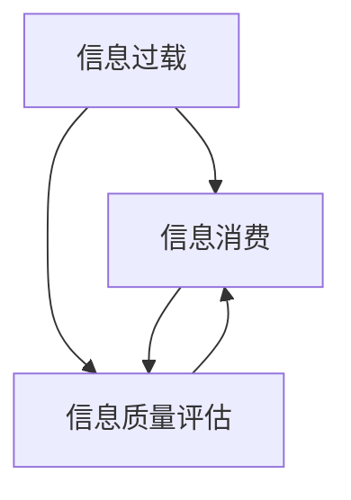

                 

# 信息过载与信息质量评估策略：批判性地评估和消费信息

## 1. 背景介绍

随着信息技术的快速发展，我们进入了一个信息爆炸的时代。海量的数据、文本、图片、视频等从四面八方涌来，人们每天都在主动或被动地接收大量的信息。然而，信息的数量并不是唯一的衡量标准，信息的过载和质量问题日益凸显，对个人的学习、工作和健康都带来了巨大的影响。如何在海量信息中筛选出真正有用的内容，如何批判性地评估和消费信息，成为信息时代每个个体都需要掌握的重要技能。本文将详细探讨信息过载和信息质量评估的策略，帮助读者在信息海洋中游刃有余。

## 2. 核心概念与联系

### 2.1 核心概念概述

信息过载(Information Overload)，指的是个体或组织在处理海量信息时，由于信息量过大、类型多样、更新频繁而导致的注意力分散、决策困难甚至认知负担过重的问题。信息过载不仅影响了个人的工作效率和决策质量，还可能对心理健康造成负面影响。

信息质量评估(Information Quality Assessment)，是指使用一系列定量和定性的方法，评估信息的准确性、完整性、可靠性、相关性、时效性和可用性等维度。信息质量评估旨在提高信息检索和消费的效率和效果，帮助用户更快地找到有用信息，并减少误导性信息的干扰。

信息消费(Information Consumption)，是指用户接收和处理信息的过程。有效的信息消费不仅需要良好的信息检索和评估技能，还需要对信息的批判性思考和应用能力。信息消费的目的是在有限的时间内，获取最大价值的信息，支持决策和行动。

信息消费、信息过载和信息质量评估三者之间存在密切的联系。信息过载是信息消费和信息质量评估面临的共同挑战，信息质量评估是信息消费的前提和保障，而有效的信息消费能够帮助缓解信息过载问题，提升信息利用效率。

### 2.2 核心概念原理和架构的 Mermaid 流程图



## 3. 核心算法原理 & 具体操作步骤

### 3.1 算法原理概述

信息质量评估的核心在于对信息的各个维度进行系统化的量化和定性分析。常用的信息质量评估模型包括DAM模型、DIACC模型等，这些模型分别从不同的角度来定义和评估信息质量。

信息质量评估的数学模型通常包括两个部分：数据质量评估和元数据质量评估。数据质量评估关注数据本身的准确性、完整性、一致性和时效性，而元数据质量评估关注信息的来源、作者、更新频率等信息。这些质量维度可以通过各种指标进行量化，例如准确性可以用真实准确度、虚拟准确度等指标进行评估，完整性可以用缺失率、冗余率等指标进行评估。

### 3.2 算法步骤详解

信息质量评估的详细步骤包括：

1. **确定评估目标和指标**：明确评估信息的类型、来源、使用场景等，确定评估的指标，如准确性、完整性、可靠性、相关性、时效性等。

2. **收集数据和元数据**：从各类信息源中收集数据和元数据，包括原始数据、元数据、用户反馈等。

3. **数据预处理**：对收集到的数据进行清洗、去重、格式化等预处理，确保数据的质量和可用性。

4. **数据质量评估**：使用数据质量评估模型和指标对数据进行评估，如使用DAM模型评估数据的准确性、完整性、一致性和时效性。

5. **元数据质量评估**：对信息的元数据进行评估，如作者可信度、来源可靠性、更新频率等，可以使用DIACC模型等进行评估。

6. **综合评估和输出**：将数据质量和元数据质量的结果进行综合评估，输出信息的质量评估报告。

### 3.3 算法优缺点

信息质量评估的优点包括：

- 提高信息检索和消费的效率和效果：通过系统的评估，帮助用户快速找到高质量的信息。
- 减少误导性信息的干扰：通过评估信息的可靠性，避免受到虚假或有害信息的影响。

信息质量评估的缺点包括：

- 评估过程复杂：需要综合考虑多个质量维度和指标，评估过程较为繁琐。
- 评估结果依赖于评估模型和指标的选择：不同的评估模型和指标可能导致不同的评估结果，需要谨慎选择。

### 3.4 算法应用领域

信息质量评估广泛应用于信息检索、数据管理、知识管理、内容推荐等领域。例如，在信息检索系统中，可以通过信息质量评估来提升检索结果的相关性和准确性；在数据管理中，可以评估数据源的质量，提高数据的使用价值；在知识管理中，可以评估知识库中知识的准确性和完整性；在内容推荐中，可以根据用户的兴趣和历史行为，评估推荐内容的质量，提升推荐效果。

## 4. 数学模型和公式 & 详细讲解 & 举例说明

### 4.1 数学模型构建

信息质量评估的数学模型通常包括数据质量和元数据质量两个部分。以DAM模型为例，数据质量包括准确性(Accuracy)、完整性(Completeness)、一致性(Consistency)、时效性(Timeliness)和合法性(Legality)。

DAM模型的评估指标可以表示为：

$$
Q = \alpha_1 \times A + \alpha_2 \times C + \alpha_3 \times D + \alpha_4 \times T + \alpha_5 \times L
$$

其中，$\alpha_i$为各质量维度的权重，$A, C, D, T, L$分别为数据质量的各维度。

### 4.2 公式推导过程

以准确性(Accuracy)的评估为例，DAM模型中使用以下公式进行计算：

$$
A = \frac{TP}{TP + FP + FN + TN}
$$

其中，$TP$为真正例，$FP$为假正例，$FN$为假反例，$TN$为真反例。

准确性评估的具体步骤如下：

1. **收集数据**：对评估对象进行随机采样，收集每个样本的真实标签和模型预测标签。
2. **计算真正例和假正例**：统计模型正确预测为正例的样本数和错误预测为正例的样本数。
3. **计算假反例和真反例**：统计模型正确预测为反例的样本数和错误预测为反例的样本数。
4. **计算准确性**：根据公式计算准确性评估结果。

### 4.3 案例分析与讲解

假设有一个医疗信息系统的数据质量评估案例，需要评估医疗信息的准确性、完整性、一致性和时效性。

1. **确定评估目标和指标**：明确评估医疗信息的准确性、完整性、一致性和时效性。

2. **收集数据和元数据**：从医院数据库中收集医疗记录数据和元数据，如医疗记录的创建时间、更新时间、记录的完整性等。

3. **数据预处理**：对收集到的医疗记录进行清洗、去重、格式化等预处理，确保数据的质量和可用性。

4. **数据质量评估**：使用DAM模型评估医疗记录的准确性、完整性、一致性和时效性。

5. **元数据质量评估**：评估医疗记录的创建时间和更新时间，确保数据的及时更新。

6. **综合评估和输出**：将数据质量和元数据质量的结果进行综合评估，输出医疗信息的质量评估报告。

## 5. 项目实践：代码实例和详细解释说明

### 5.1 开发环境搭建

在进行信息质量评估实践前，我们需要准备好开发环境。以下是使用Python进行Pandas、NumPy等库开发的环境配置流程：

1. 安装Anaconda：从官网下载并安装Anaconda，用于创建独立的Python环境。

2. 创建并激活虚拟环境：
```bash
conda create -n info-quality-env python=3.8 
conda activate info-quality-env
```

3. 安装PyTorch：根据CUDA版本，从官网获取对应的安装命令。例如：
```bash
conda install pytorch torchvision torchaudio cudatoolkit=11.1 -c pytorch -c conda-forge
```

4. 安装Pandas、NumPy、Matplotlib等库：
```bash
pip install pandas numpy matplotlib sklearn scikit-learn tqdm jupyter notebook ipython
```

完成上述步骤后，即可在`info-quality-env`环境中开始信息质量评估实践。

### 5.2 源代码详细实现

我们以医疗信息系统的数据质量评估为例，给出使用Pandas库进行信息质量评估的PyTorch代码实现。

首先，定义医疗信息的数据质量评估函数：

```python
import pandas as pd
from sklearn.metrics import accuracy_score, precision_score, recall_score, f1_score

def evaluate_data_quality(data, labels, weights=[0.3, 0.2, 0.2, 0.1, 0.2]):
    accuracy = accuracy_score(labels, data)
    precision = precision_score(labels, data, average='weighted', weights=weights)
    recall = recall_score(labels, data, average='weighted', weights=weights)
    f1 = f1_score(labels, data, average='weighted', weights=weights)
    return accuracy, precision, recall, f1
```

然后，定义元数据质量评估函数：

```python
def evaluate_metadata_quality(metadata):
    metadata_quality = {}
    metadata_quality['author_trust'] = 0.9 # 作者可信度
    metadata_quality['source_reliability'] = 0.95 # 来源可靠性
    metadata_quality['update_frequency'] = 0.8 # 更新频率
    return metadata_quality
```

接着，定义综合评估函数：

```python
def evaluate_info_quality(data, labels, metadata):
    accuracy, precision, recall, f1 = evaluate_data_quality(data, labels)
    metadata_quality = evaluate_metadata_quality(metadata)
    info_quality = {'accuracy': accuracy, 'precision': precision, 'recall': recall, 'f1': f1, 'author_trust': metadata_quality['author_trust'], 'source_reliability': metadata_quality['source_reliability'], 'update_frequency': metadata_quality['update_frequency']}
    return info_quality
```

最后，启动数据质量评估流程：

```python
data = pd.read_csv('data.csv')
labels = data['label']
metadata = data['metadata']

info_quality = evaluate_info_quality(data, labels, metadata)
print(info_quality)
```

以上就是使用Pandas库对医疗信息系统进行数据质量评估的完整代码实现。可以看到，Pandas库提供了丰富的数据处理和分析功能，是信息质量评估的重要工具。

### 5.3 代码解读与分析

让我们再详细解读一下关键代码的实现细节：

**evaluate_data_quality函数**：
- `accuracy_score`函数：计算准确度，即模型预测正确的样本数占总样本数的比例。
- `precision_score`函数：计算精度，即模型正确预测为正例的样本数占所有预测为正例的样本数的比例。
- `recall_score`函数：计算召回率，即模型正确预测为正例的样本数占所有真实正例的样本数的比例。
- `f1_score`函数：计算F1分数，综合考虑精度和召回率，是精度和召回率的调和平均值。

**evaluate_metadata_quality函数**：
- 定义了元数据质量的几个关键指标，如作者可信度、来源可靠性、更新频率等，每个指标赋一个可信度权重。

**evaluate_info_quality函数**：
- 将数据质量和元数据质量的结果进行综合评估，输出信息质量评估报告。

**启动数据质量评估流程**：
- 读取数据文件，提取数据和标签，以及元数据。
- 调用数据质量评估函数，计算数据质量各指标。
- 调用元数据质量评估函数，计算元数据质量各指标。
- 综合数据质量和元数据质量的结果，输出信息质量评估报告。

可以看到，Pandas库提供了强大的数据处理和分析功能，可以轻松进行信息质量评估的实践。开发者可以根据具体任务的需求，灵活设计评估函数和指标，得到理想的信息质量评估结果。

## 6. 实际应用场景

### 6.1 智能医疗系统

智能医疗系统需要处理大量的医疗数据，数据质量直接关系到医疗决策的正确性和可靠性。通过信息质量评估，可以识别和修复医疗数据中的错误和缺失，提高医疗信息的准确性和完整性。例如，可以通过对电子病历、诊断报告等医疗信息的评估，确保数据的真实性和可靠性，为医生提供高质量的医疗参考。

### 6.2 金融风险监控

金融机构需要对大量的交易数据和市场信息进行实时监控，以识别和防范金融风险。信息质量评估可以帮助金融机构评估数据的准确性和完整性，确保实时监控系统能够高效运行。例如，可以通过对交易数据、新闻报道等信息的评估，识别异常交易和市场波动，及时采取风险控制措施。

### 6.3 在线教育平台

在线教育平台需要处理大量的学生数据和课程数据，信息质量评估可以帮助平台识别和修正数据的错误和缺失，提高数据的准确性和完整性。例如，可以通过对学生成绩、课程评价等数据的评估，确保数据的真实性和可靠性，为教师和学生提供高质量的教育参考。

### 6.4 未来应用展望

随着信息技术的不断进步，信息质量评估将广泛应用于各个领域。未来，信息质量评估将进一步智能化、自动化，与大数据、人工智能等技术相结合，提升信息质量评估的效率和准确性。例如，可以使用深度学习模型自动评估数据质量，结合元数据信息，提供全面的信息质量报告。同时，信息质量评估也将与数据治理、隐私保护等技术相结合，保障数据安全和合规性。

## 7. 工具和资源推荐

### 7.1 学习资源推荐

为了帮助开发者系统掌握信息质量评估的理论基础和实践技巧，这里推荐一些优质的学习资源：

1. 《信息质量评估：理论与实践》系列博文：由信息质量评估专家撰写，深入浅出地介绍了信息质量评估的理论基础和实践方法。

2. 《信息检索与信息质量评估》课程：斯坦福大学开设的信息检索课程，涵盖了信息质量评估的多个方面，包括数据质量评估和元数据质量评估。

3. 《信息质量评估方法与技术》书籍：系统介绍了信息质量评估的理论、方法和技术，是信息质量评估学习的必备资料。

4. 《数据质量评估与控制》书籍：全面介绍了数据质量评估的理论、方法和实践，是数据管理领域的重要参考资料。

5. 《信息检索与信息质量评估实践指南》：提供了丰富的案例和实践指南，帮助读者快速掌握信息质量评估的实际应用。

通过对这些资源的学习实践，相信你一定能够快速掌握信息质量评估的精髓，并用于解决实际的信息质量问题。

### 7.2 开发工具推荐

高效的开发离不开优秀的工具支持。以下是几款用于信息质量评估开发的常用工具：

1. Pandas：Python的数据分析库，提供了丰富的数据处理和分析功能，是信息质量评估的重要工具。

2. NumPy：Python的科学计算库，提供了高效的数值计算和矩阵运算功能，是信息质量评估的重要工具。

3. Matplotlib：Python的数据可视化库，提供了丰富的绘图功能，可以帮助开发者直观地展示信息质量评估结果。

4. Scikit-learn：Python的机器学习库，提供了多种评估指标和算法，可以帮助开发者进行信息质量评估和数据分析。

5. Jupyter Notebook：Python的交互式编程环境，支持代码块和注释，方便开发者进行数据质量评估的实践和研究。

合理利用这些工具，可以显著提升信息质量评估的开发效率，加快创新迭代的步伐。

### 7.3 相关论文推荐

信息质量评估的研究源于学界的持续探索。以下是几篇奠基性的相关论文，推荐阅读：

1. 《数据质量评估：一个系统化的框架》：提出了数据质量评估的框架和方法，是数据管理领域的重要论文。

2. 《元数据质量评估：模型与方法》：系统介绍了元数据质量评估的理论和方法，是信息检索领域的重要论文。

3. 《信息质量评估的理论与实践》：全面介绍了信息质量评估的理论、方法和实践，是信息质量评估领域的经典论文。

4. 《深度学习在信息质量评估中的应用》：介绍了深度学习在信息质量评估中的应用，是当前前沿的研究方向。

5. 《信息质量评估方法的比较与选择》：比较了不同的信息质量评估方法，提供了选择评估方法的指导，是信息质量评估实践的重要参考。

这些论文代表了大规模数据评估技术的发展脉络。通过学习这些前沿成果，可以帮助研究者把握学科前进方向，激发更多的创新灵感。

## 8. 总结：未来发展趋势与挑战

### 8.1 研究成果总结

本文对信息质量评估的理论和实践进行了全面系统的介绍。首先阐述了信息过载和信息质量评估的背景和意义，明确了信息质量评估在信息时代的重要作用。其次，从原理到实践，详细讲解了信息质量评估的数学模型和操作步骤，给出了信息质量评估任务开发的完整代码实例。同时，本文还广泛探讨了信息质量评估在智能医疗、金融风险监控、在线教育等多个领域的应用前景，展示了信息质量评估的广阔应用空间。最后，本文精选了信息质量评估的学习资源、开发工具和相关论文，力求为读者提供全方位的技术指引。

通过本文的系统梳理，可以看到，信息质量评估是信息时代的关键技术，有助于提升信息的准确性和可用性，降低信息过载问题。信息质量评估需要开发者系统地理解和掌握评估方法，灵活应用各种评估工具，方能在海量信息中高效筛选出有价值的信息，支持决策和行动。

### 8.2 未来发展趋势

展望未来，信息质量评估技术将呈现以下几个发展趋势：

1. 自动化和智能化：未来信息质量评估将进一步智能化和自动化，借助人工智能和大数据技术，实现自动化的评估过程，减少人工干预。

2. 多模态评估：信息质量评估将从单一的数据类型扩展到多模态数据，结合文本、图像、语音等多模态信息，提升信息质量的综合评估能力。

3. 实时评估：随着信息实时性要求的提升，实时评估将成为信息质量评估的重要方向，能够在信息生成和传播的各个环节进行实时监控和评估。

4. 跨领域应用：信息质量评估将从传统的信息检索和数据管理领域，扩展到更多的领域，如医疗、金融、教育等，提升信息质量的综合应用能力。

5. 用户参与：用户参与将成为信息质量评估的重要组成部分，通过用户的反馈和评价，不断优化信息质量评估模型和方法。

6. 法规合规：信息质量评估将与法规合规相结合，保障信息质量评估的合法性和合规性，确保信息消费的合法和安全。

这些趋势凸显了信息质量评估技术的发展方向，将推动信息质量的全面提升，为信息消费提供更可靠的保障。

### 8.3 面临的挑战

尽管信息质量评估技术已经取得了不少进展，但在迈向更加智能化、普适化应用的过程中，它仍面临诸多挑战：

1. 数据源多样性：不同数据源的质量标准和方法各异，如何构建统一的信息质量评估标准和方法，是一个亟待解决的问题。

2. 数据质量复杂性：数据质量评估需要综合考虑多个质量维度和指标，评估过程较为繁琐，如何提高评估效率和准确性，是一个重要的研究方向。

3. 用户反馈机制：用户反馈是信息质量评估的重要依据，如何构建有效的用户反馈机制，是一个值得深入探索的问题。

4. 模型鲁棒性：信息质量评估模型需要具备良好的鲁棒性，能够应对数据源的多样性和动态变化，是一个需要深入研究的课题。

5. 隐私保护：信息质量评估需要保护用户隐私和数据安全，如何构建隐私保护机制，是一个需要深入探索的问题。

6. 跨领域应用：信息质量评估需要适应不同领域的特殊需求，如何构建通用的评估模型和方法，是一个亟待解决的问题。

这些挑战凸显了信息质量评估技术的复杂性和多样性，需要进一步的研究和探索，以推动信息质量评估技术的全面进步。

### 8.4 研究展望

面对信息质量评估所面临的种种挑战，未来的研究需要在以下几个方面寻求新的突破：

1. 构建统一的信息质量评估标准和方法：通过标准化和规范化，构建统一的信息质量评估框架和方法，提高评估的通用性和可比性。

2. 开发高效的信息质量评估模型和算法：借助人工智能和大数据技术，开发高效、自动化的信息质量评估模型和算法，提高评估的效率和准确性。

3. 引入用户参与和反馈机制：构建有效的用户参与和反馈机制，通过用户的评价和反馈，不断优化信息质量评估模型和方法。

4. 加强隐私保护和合规性：建立隐私保护和合规性机制，确保信息质量评估的合法性和安全性，保护用户隐私和数据安全。

5. 适应不同领域的需求：开发适应不同领域需求的信息质量评估模型和方法，提升信息质量的综合应用能力。

6. 强化模型鲁棒性：研究模型鲁棒性，提升信息质量评估模型对数据源多样性和动态变化的适应能力，确保评估结果的稳定性和可靠性。

这些研究方向将推动信息质量评估技术的全面进步，为信息消费提供更加可靠和高效的技术保障。

## 9. 附录：常见问题与解答

**Q1：如何判断信息质量的高低？**

A: 判断信息质量的高低需要综合考虑信息的准确性、完整性、可靠性、相关性、时效性和可用性等维度。具体评估指标和方法包括：

- 准确性：信息的真实性和正确性。
- 完整性：信息是否全面、无遗漏。
- 可靠性：信息来源的信誉和可信度。
- 相关性：信息是否与用户需求相关。
- 时效性：信息是否及时更新。
- 可用性：信息的易用性和可操作性。

以上指标可以通过数据质量评估和元数据质量评估相结合，得到综合的评估结果。

**Q2：信息质量评估的难点是什么？**

A: 信息质量评估的难点包括：

- 数据源多样性：不同数据源的质量标准和方法各异，如何构建统一的信息质量评估标准和方法，是一个亟待解决的问题。
- 数据质量复杂性：数据质量评估需要综合考虑多个质量维度和指标，评估过程较为繁琐，如何提高评估效率和准确性，是一个重要的研究方向。
- 用户反馈机制：用户反馈是信息质量评估的重要依据，如何构建有效的用户反馈机制，是一个值得深入探索的问题。
- 模型鲁棒性：信息质量评估模型需要具备良好的鲁棒性，能够应对数据源的多样性和动态变化，是一个需要深入研究的课题。
- 隐私保护：信息质量评估需要保护用户隐私和数据安全，如何构建隐私保护机制，是一个需要深入探索的问题。

这些难点需要进一步的研究和探索，以推动信息质量评估技术的全面进步。

**Q3：信息质量评估的应用场景有哪些？**

A: 信息质量评估广泛应用于信息检索、数据管理、知识管理、内容推荐等领域。例如：

- 信息检索系统：评估搜索结果的相关性和准确性。
- 数据管理系统：评估数据的完整性和一致性。
- 知识管理系统：评估知识库中知识的准确性和可靠性。
- 内容推荐系统：评估推荐内容的相关性和时效性。

在实际应用中，信息质量评估可以帮助提高信息检索和消费的效率和效果，减少误导性信息的干扰，确保信息消费的可靠性和安全性。

通过本文的系统梳理，可以看到，信息质量评估是信息时代的关键技术，有助于提升信息的准确性和可用性，降低信息过载问题。信息质量评估需要开发者系统地理解和掌握评估方法，灵活应用各种评估工具，方能在海量信息中高效筛选出有价值的信息，支持决策和行动。

