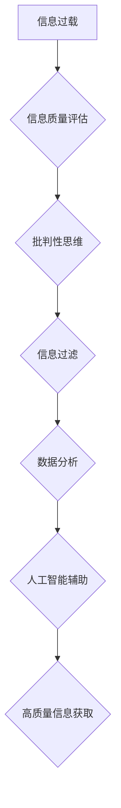

                 

## 信息过载与信息质量评估：批判性地消费和评估信息

> 关键词：信息过载、信息质量、信息评估、批判性思维、数据分析、人工智能、信息过滤

### 1. 背景介绍

在当今数字时代，我们被海量信息包围。从社交媒体的实时更新到新闻网站的爆炸式增长，信息以前所未有的速度涌入我们的视野。然而，并非所有信息都是同等有价值的。大量低质量、虚假或误导性的信息充斥网络，使得我们难以从中筛选出真正可靠和有用的知识。

信息过载现象给个人和社会都带来了诸多挑战：

* **认知负担加重:** 过多的信息输入会使我们的大脑不堪重负，难以集中精力处理重要信息。
* **决策困难:** 在信息纷杂的环境中，难以做出明智的决策，容易受到误导和偏见的影响。
* **知识碎片化:**  信息碎片化导致我们难以形成完整的知识体系，难以深入理解复杂问题。
* **社会分化:**  不同信息源的观点差异化，加剧了社会分化和群体对抗。

因此，如何有效地应对信息过载，批判性地消费和评估信息，成为了当今社会面临的重要课题。

### 2. 核心概念与联系

**信息质量**是指信息在满足特定需求时，其准确性、完整性、时效性、相关性和可信度等方面的优劣程度。

**信息评估**是指对信息进行系统性的分析和判断，以确定其价值、可靠性和适用性。

**批判性思维**是指对信息进行深入思考和分析，质疑其来源、逻辑和结论，并形成独立的判断。

**信息过滤**是指通过技术手段或人工筛选，从海量信息中提取出有价值的信息。

**数据分析**是指对数据进行收集、整理、分析和挖掘，以发现其中的规律和趋势。

**人工智能**可以用于辅助信息评估和过滤，例如利用机器学习算法识别虚假信息和垃圾信息。

**Mermaid 流程图:**



### 3. 核心算法原理 & 具体操作步骤

#### 3.1  算法原理概述

信息质量评估算法通常基于以下几个方面：

* **准确性:**  信息是否与事实相符，是否经过验证。
* **完整性:**  信息是否包含所有必要的信息，是否遗漏了关键细节。
* **时效性:**  信息是否最新，是否已经过时。
* **相关性:**  信息是否与用户的需求相符，是否能够提供有价值的帮助。
* **可信度:**  信息的来源是否可靠，发布者是否具有权威性。

常用的信息质量评估算法包括：

* **基于规则的算法:**  根据预先定义的规则对信息进行评估，例如检查语法错误、识别常见虚假信息模式等。
* **基于机器学习的算法:**  利用机器学习模型从历史数据中学习，识别高质量和低质量信息的特征，并对新信息进行预测。
* **基于深度学习的算法:**  利用深度神经网络对信息进行更复杂的分析，例如识别情感倾向、理解上下文关系等。

#### 3.2  算法步骤详解

以基于机器学习的信息质量评估算法为例，其具体步骤如下：

1. **数据收集:**  收集大量高质量和低质量信息的样本数据，并进行标注，例如标记信息的准确性、完整性、时效性等方面。
2. **数据预处理:**  对收集到的数据进行清洗、转换和格式化，例如去除噪声、标准化文本等。
3. **特征提取:**  从信息中提取特征，例如词频、语法结构、情感倾向等，这些特征可以用于训练机器学习模型。
4. **模型训练:**  利用机器学习算法，例如支持向量机、决策树、神经网络等，对训练数据进行训练，学习信息质量与特征之间的关系。
5. **模型评估:**  利用测试数据对训练好的模型进行评估，例如计算准确率、召回率、F1-score等指标，评估模型的性能。
6. **模型部署:**  将训练好的模型部署到实际应用场景中，对新信息进行评估，并提供相应的质量评分或标签。

#### 3.3  算法优缺点

**优点:**

* **自动化:**  可以自动化地对大量信息进行评估，提高效率。
* **客观性:**  可以减少人为主观判断的影响，提高评估的客观性。
* **可扩展性:**  可以根据需要扩展算法的复杂度和功能，适应不同的信息类型和评估需求。

**缺点:**

* **数据依赖:**  算法的性能取决于训练数据的质量和数量，如果训练数据不足或存在偏差，则会影响评估结果的准确性。
* **解释性:**  一些机器学习算法的决策过程难以解释，难以理解模型是如何得出评估结果的。
* **适应性:**  算法可能难以适应新的信息类型或评估标准，需要进行重新训练或调整。

#### 3.4  算法应用领域

信息质量评估算法广泛应用于以下领域:

* **搜索引擎:**  提高搜索结果的质量，过滤掉低质量或虚假信息。
* **社交媒体:**  识别虚假信息、垃圾信息和恶意内容，维护平台的健康生态。
* **新闻媒体:**  验证新闻信息的真实性，防止谣言的传播。
* **电子商务:**  评估商品评论的真实性，保护消费者权益。
* **医疗保健:**  评估医疗信息的准确性和可靠性，提高医疗诊断和治疗的质量。

### 4. 数学模型和公式 & 详细讲解 & 举例说明

#### 4.1  数学模型构建

信息质量评估可以建模为一个多分类问题，其中每个类别代表不同的信息质量等级，例如：高质量、中质量、低质量。可以使用以下数学模型来表示信息质量评估：

$$
y = f(x_1, x_2, ..., x_n)
$$

其中：

* $y$ 是信息质量等级的预测结果。
* $f$ 是一个映射函数，将特征向量 $x$ 映射到信息质量等级。
* $x_1, x_2, ..., x_n$ 是信息特征的向量表示。

#### 4.2  公式推导过程

具体的映射函数 $f$ 可以根据不同的算法选择，例如：

* **支持向量机 (SVM):**  使用核函数将特征映射到高维空间，找到最佳的分隔超平面，将不同质量等级的信息分开。
* **决策树:**  通过一系列的决策规则，将信息分类到不同的质量等级。
* **神经网络:**  使用多层神经元网络，学习信息特征与质量等级之间的复杂关系。

#### 4.3  案例分析与讲解

例如，可以使用支持向量机 (SVM) 算法对新闻信息的准确性进行评估。

1. **特征提取:**  从新闻信息中提取特征，例如词频、语法结构、来源网站等。
2. **数据标注:**  人工标注新闻信息的准确性，例如真实、虚假、疑似等。
3. **模型训练:**  使用 SVM 算法对训练数据进行训练，学习特征与准确性之间的关系。
4. **模型评估:**  使用测试数据对训练好的模型进行评估，例如计算准确率、召回率等指标。
5. **应用:**  将训练好的模型部署到实际应用场景中，对新新闻信息进行准确性评估。

### 5. 项目实践：代码实例和详细解释说明

#### 5.1  开发环境搭建

* **操作系统:**  Linux/macOS/Windows
* **编程语言:**  Python
* **库依赖:**  scikit-learn, pandas, numpy, matplotlib

#### 5.2  源代码详细实现

```python
from sklearn.svm import SVC
from sklearn.model_selection import train_test_split
from sklearn.metrics import accuracy_score

# 加载数据
data = pd.read_csv('news_data.csv')

# 特征提取
features = data[['word_count', 'sentence_count', 'source_website']]

# 标签
labels = data['accuracy']

# 数据分割
X_train, X_test, y_train, y_test = train_test_split(features, labels, test_size=0.2, random_state=42)

# 创建 SVM 模型
model = SVC(kernel='linear')

# 模型训练
model.fit(X_train, y_train)

# 模型预测
y_pred = model.predict(X_test)

# 模型评估
accuracy = accuracy_score(y_test, y_pred)
print(f'准确率: {accuracy}')
```

#### 5.3  代码解读与分析

* 该代码示例使用 SVM 算法对新闻信息的准确性进行评估。
* 首先加载数据，并提取特征和标签。
* 然后将数据分割为训练集和测试集。
* 创建 SVM 模型，并使用训练集进行训练。
* 最后使用测试集进行预测，并计算模型的准确率。

#### 5.4  运行结果展示

运行结果会显示模型的准确率，例如：

```
准确率: 0.85
```

这表示模型在测试集上对新闻信息的准确性预测准确率为 85%。

### 6. 实际应用场景

信息质量评估技术在各个领域都有广泛的应用场景：

* **搜索引擎:**  提高搜索结果的质量，过滤掉低质量或虚假信息，例如 Google 的 RankBrain 算法。
* **社交媒体:**  识别虚假信息、垃圾信息和恶意内容，维护平台的健康生态，例如 Facebook 的 Fact Checkers 项目。
* **新闻媒体:**  验证新闻信息的真实性，防止谣言的传播，例如 Snopes 和 PolitiFact 网站。
* **电子商务:**  评估商品评论的真实性，保护消费者权益，例如 Amazon 的商品评论审核系统。
* **医疗保健:**  评估医疗信息的准确性和可靠性，提高医疗诊断和治疗的质量，例如 UpToDate 和 PubMed 网站。

### 6.4  未来应用展望

随着人工智能技术的不断发展，信息质量评估技术将更加智能化、自动化和个性化。

* **更精准的评估:**  利用深度学习等更先进的算法，对信息质量进行更精准的评估，识别更细微的质量差异。
* **更个性化的推荐:**  根据用户的需求和偏好，提供更个性化的信息推荐，过滤掉不感兴趣或不符合用户价值观的低质量信息。
* **更有效的干预:**  对低质量信息进行更有效的干预，例如标记虚假信息、屏蔽垃圾信息、引导用户理性消费信息。

### 7. 工具和资源推荐

#### 7.1  学习资源推荐

* **书籍:**
    * "Information Quality: Concepts, Methodologies, Tools, and Applications" by IGI Global
    * "Data Quality: Concepts, Methodologies, Tools, and Applications" by IGI Global
* **在线课程:**
    * Coursera: "Data Quality Management"
    * edX: "Data Science Fundamentals"

#### 7.2  开发工具推荐

* **Python:**  广泛用于数据分析和机器学习，拥有丰富的库和工具支持。
* **scikit-learn:**  Python 的机器学习库，提供各种算法和工具，用于信息质量评估。
* **pandas:**  Python 的数据分析库，用于数据处理和特征提取。
* **numpy:**  Python 的数值计算库，用于数值计算和矩阵操作。

#### 7.3  相关论文推荐

* "A Survey on Information Quality Assessment" by ACM Computing Surveys
* "Information Quality: A Framework for Evaluation" by IEEE Transactions on Knowledge and Data Engineering
* "Deep Learning for Information Quality Assessment" by ACM SIGKDD Explorations Newsletter

### 8. 总结：未来发展趋势与挑战

#### 8.1  研究成果总结

信息质量评估技术已经取得了显著的进展，能够有效地识别和过滤低质量信息，提高信息消费的质量。

#### 8.2  未来发展趋势

* **更智能化:**  利用人工智能技术，实现更智能、更自动化的信息质量评估。
* **更个性化:**  根据用户的需求和偏好，提供更个性化的信息推荐和评估。
* **更跨领域:**  将信息质量评估技术应用到更多领域，例如教育、医疗、金融等。

#### 8.3  面临的挑战

* **数据质量:**  信息质量评估算法的性能取决于训练数据的质量和数量，如何获取高质量的训练数据仍然是一个挑战。
* **算法解释性:**  一些机器学习算法的决策过程难以解释，难以理解模型是如何得出评估结果的，这可能会影响用户对结果的信任。
* **信息的多样性:**  信息类型和格式多种多样，如何设计通用的信息质量评估模型仍然是一个难题。

#### 8.4  研究展望

未来研究方向包括：

* 开发更鲁棒、更解释性的信息质量评估算法。
* 研究如何利用多源数据和跨领域知识进行信息质量评估。
* 探索如何将信息质量评估技术与其他技术结合，例如自然语言处理、知识图谱等，实现更智能的信息消费和管理。

### 9. 附录：常见问题与解答

**Q1: 如何评估信息质量？**

A1: 信息质量评估可以从多个方面进行，例如准确性、完整性、时效性、相关性和可信度。可以使用规则、机器学习等算法对信息进行评估。

**Q2: 如何提高信息质量？**

A2: 提高信息质量可以通过以下方式实现：

* 来源可靠：选择信誉良好的信息来源。
* 逻辑清晰：信息内容要逻辑清晰，避免前后矛盾。
* 证据充分：信息要提供足够的证据支持，避免空穴来天。
* 语言准确：信息语言要准确、规范，避免歧义和误解。

**Q3: 信息过载如何影响我们？**

A3: 信息过载会带来认知负担加重、决策困难、知识碎片化、社会分化等问题。

**Q4: 如何应对信息过载？**

A4: 应对信息过载可以通过以下方式实现：

* 提高信息过滤能力：学习批判性思维，筛选高质量信息。
* 关注重要信息：设定优先级，关注重要领域的信息。
* 减少信息摄入量：控制信息获取渠道，避免过度消费信息。
* 利用信息管理工具：使用笔记软件、阅读管理工具等，帮助整理和管理信息。


作者：禅与计算机程序设计艺术 / Zen and the Art of Computer Programming<end_of_turn>

