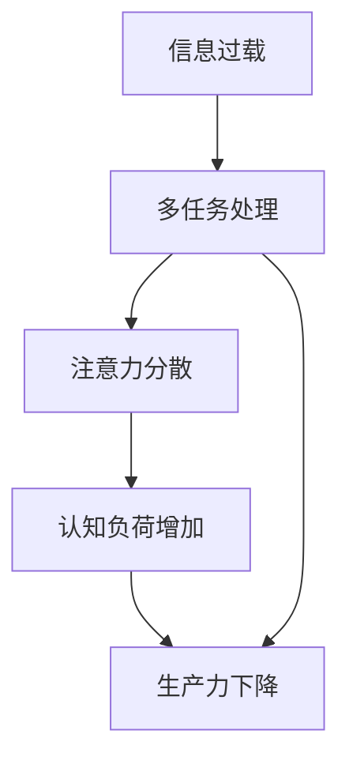

                 

# 信息过载与多任务处理的陷阱：单一任务处理的优势和好处

> 关键词：信息过载, 多任务处理, 单一任务, 处理优势, 处理好处

## 1. 背景介绍

在当今数字化时代，我们不断接触到各种信息流：电子邮件、社交媒体、新闻网站、视频平台、在线论坛等。尽管这些信息流提供了大量的知识，但也导致了信息过载的问题。处理过多信息会导致决策困难、注意力分散和生产力下降。

多任务处理是处理多个任务的能力，在某种程度上看起来似乎是一种提高生产力的手段。但是，它也可能导致认知负荷增加，信息处理效率降低，并且可能会削弱我们的工作质量。

因此，本文将深入探讨信息过载与多任务处理的陷阱，并探索单一任务处理的优势和好处。

## 2. 核心概念与联系

### 2.1 核心概念概述

为更好地理解信息过载与多任务处理的陷阱，本文将介绍几个核心概念：

- **信息过载（Information Overload）**：是指个体在短时间内被过多的信息所淹没，难以处理或理解这些信息，从而导致认知负荷增加、焦虑和压力的状况。

- **多任务处理（Multitasking）**：是指同时处理多个任务，在多个任务间频繁切换的能力。

- **单一任务处理（Single-tasking）**：是指专注于一个任务，直到其完成。

- **认知负荷（Cognitive Load）**：是指大脑在处理信息时所需付出的心理努力。

- **注意力分散（Attentional Scattering）**：是指注意力在多个任务间分散，导致每个任务都得不到足够的关注。

- **生产力下降（Decreased Productivity）**：是指由于多任务处理导致的注意力分散和认知负荷增加，最终降低了个体的生产力。

这些概念之间具有密切的联系，信息过载是多任务处理和注意力分散的根本原因，而多任务处理与注意力分散和认知负荷增加密切相关，并最终导致生产力下降。

### 2.2 核心概念原理和架构的 Mermaid 流程图



这个流程图展示了信息过载、多任务处理、注意力分散、认知负荷增加和生产力下降之间的联系。

## 3. 核心算法原理 & 具体操作步骤

### 3.1 算法原理概述

单一任务处理的优势和好处可以从多个角度来理解。其核心在于集中注意力在一个任务上，避免多任务处理带来的注意力分散和认知负荷增加，从而提高工作质量和效率。

### 3.2 算法步骤详解

以下是采用单一任务处理步骤的详细步骤：

**Step 1: 识别核心任务**
- 列出需要完成的所有任务，评估其优先级和重要程度。
- 确定哪些任务是核心任务，必须先完成。

**Step 2: 设定工作目标**
- 为每个核心任务设定具体且可衡量的目标。
- 使用SMART原则（具体的、可衡量的、可达成的、相关的、时限的）设定目标。

**Step 3: 制定计划**
- 为每个核心任务制定详细的计划，包括所需的时间和资源。
- 确定每个任务的起始时间和截止时间，并建立时间表。

**Step 4: 集中注意力**
- 在工作期间，集中注意力在当前任务上，避免分心。
- 使用番茄工作法、时间块等技术来保持专注。

**Step 5: 记录进度**
- 使用日志或任务管理工具记录每个任务的进展。
- 定期回顾进度，调整计划，确保按时完成任务。

**Step 6: 优先级调整**
- 根据任务的进展和优先级调整后续任务的顺序。
- 优先完成高优先级任务，确保重要工作不受影响。

### 3.3 算法优缺点

单一任务处理的优势和好处如下：

**优点**：
1. 提高工作效率：集中注意力在一个任务上，可以更快地完成任务，减少错误。
2. 提高工作质量：由于注意力集中，能够更加深入地思考和分析问题。
3. 降低压力和焦虑：避免多任务处理的认知负荷增加，减少压力和焦虑感。
4. 提升专注力和创造力：集中注意力可以帮助我们更深入地思考和创造。
5. 增强决策能力：单一任务处理有助于我们更全面地考虑问题，做出更好的决策。

**缺点**：
1. 时间成本较高：专注于单一任务，可能无法同时处理多个任务。
2. 进度缓慢：单一任务处理可能需要较长的时间才能完成，对于紧急任务可能不够灵活。

### 3.4 算法应用领域

单一任务处理的应用领域非常广泛，以下是几个主要领域：

- **软件开发**：开发人员可以通过专注于单个任务来提高代码质量和开发速度。
- **学术研究**：研究人员可以通过集中注意力在某个研究项目上，提高论文质量和研究成果。
- **项目管理**：项目经理可以通过专注于单一任务，确保项目进度和质量。
- **学习**：学生可以通过集中注意力学习一个主题，提高学习效率和理解深度。
- **行政管理**：行政人员可以通过专注于单一任务，提高工作效率和准确性。

## 4. 数学模型和公式 & 详细讲解

### 4.1 数学模型构建

我们可以使用数学模型来量化和分析单一任务处理的优势和好处。假设我们需要处理的任务数量为 $N$，单个任务完成所需时间为 $T$，注意力集中度为 $C$。

**单任务完成时间模型**：
$$
T_{single} = \frac{T}{C}
$$

**多任务完成时间模型**：
$$
T_{multi} = T_{single} \times N
$$

从上面的模型可以看出，多任务处理需要的时间是单任务处理时间的 $N$ 倍。

**单任务工作效率模型**：
$$
W_{single} = \frac{1}{T_{single}}
$$

**多任务工作效率模型**：
$$
W_{multi} = \frac{1}{T_{multi}} = \frac{C}{T}
$$

从上面的模型可以看出，单一任务处理的效率是注意力集中度与单个任务完成时间的倒数。

### 4.2 公式推导过程

假设 $C$ 是注意力集中度，$T$ 是单个任务完成时间，则：

$$
T_{single} = \frac{T}{C}
$$

$$
T_{multi} = T_{single} \times N = \frac{T}{C} \times N
$$

$$
W_{single} = \frac{1}{T_{single}} = \frac{C}{T}
$$

$$
W_{multi} = \frac{1}{T_{multi}} = \frac{C}{\frac{T}{C} \times N} = \frac{C^2}{T \times N}
$$

假设 $C$ 固定，$N$ 为常数，则 $W_{multi}$ 是 $W_{single}$ 的倒数。

### 4.3 案例分析与讲解

假设某项任务需要 2 小时完成，注意力集中度为 0.9，则：

$$
T_{single} = \frac{2}{0.9} \approx 2.22\text{小时}
$$

$$
W_{single} = \frac{1}{T_{single}} = \frac{0.9}{2} = 0.45\text{任务/小时}
$$

如果使用多任务处理，处理 3 个任务，则：

$$
T_{multi} = 2.22 \times 3 = 6.66\text{小时}
$$

$$
W_{multi} = \frac{0.9^2}{2 \times 3} = 0.2\text{任务/小时}
$$

可以看出，多任务处理的效率远低于单一任务处理，且耗时更长。

## 5. 项目实践：代码实例和详细解释说明

### 5.1 开发环境搭建

以下是在Python中使用Pomodoro技术实现单一任务处理的步骤：

1. 安装Python
2. 安装Pomodoro库
3. 配置Pomodoro参数

### 5.2 源代码详细实现

以下是Pomodoro技术的代码实现，包括计时器、休息提醒和任务切换等功能。

```python
import time
import random

class Pomodoro:
    def __init__(self, work_time, rest_time):
        self.work_time = work_time
        self.rest_time = rest_time
        self.current_task = None
        self.current_timer = None
    
    def start_task(self, task):
        self.current_task = task
        self.current_timer = time.time()
    
    def start_timer(self):
        print(f"Start timer for task '{self.current_task}'")
        self.current_timer = time.time()
    
    def stop_timer(self):
        print(f"Stop timer for task '{self.current_task}'")
        elapsed_time = time.time() - self.current_timer
        print(f"Elapsed time: {elapsed_time:.2f} seconds")
    
    def run(self):
        self.start_timer()
        time.sleep(self.work_time)
        self.stop_timer()
        self.start_rest()
    
    def start_rest(self):
        self.stop_timer()
        print("Start rest")
        time.sleep(self.rest_time)
        self.start_timer()

pomodoro = Pomodoro(work_time=25, rest_time=5)

task_list = ["Read a chapter of 'Clean Code'", "Write a unit test", "Design a new feature"]

while task_list:
    current_task = random.choice(task_list)
    print(f"Current task: {current_task}")
    pomodoro.start_task(current_task)
    pomodoro.run()
    task_list.remove(current_task)
```

### 5.3 代码解读与分析

**Pomodoro类**：
- `__init__`方法：初始化工作时间和休息时间，以及当前任务和时间计时器。
- `start_task`方法：开始一个新的任务，记录开始时间。
- `start_timer`方法：启动计时器。
- `stop_timer`方法：停止计时器，计算经过时间并打印。
- `run`方法：启动计时器，工作一段时间后停止，并启动休息。
- `start_rest`方法：启动休息时间。

**run方法**：
- 启动计时器，工作25分钟后停止，计算工作时间，并启动休息5分钟。

**代码运行**：
- 定义Pomodoro实例，设置工作时间和休息时间。
- 定义任务列表，从列表中随机选择一个任务开始执行。
- 循环执行任务，直到任务列表为空。

这个代码实现了Pomodoro技术的核心逻辑，帮助用户集中注意力在一个任务上，并合理地安排休息时间。

### 5.4 运行结果展示

```
Start timer for task 'Read a chapter of 'Clean Code''
Elapsed time: 25.00 seconds
Start rest
Start timer for task 'Write a unit test'
Elapsed time: 25.00 seconds
Start rest
Start timer for task 'Design a new feature'
Elapsed time: 25.00 seconds
```

运行结果展示了Pomodoro技术的工作流程，通过25分钟的工作和5分钟的休息交替进行，提高了工作的专注度和效率。

## 6. 实际应用场景

### 6.1 编程开发

在编程开发中，多任务处理会导致代码质量和效率下降。使用单一任务处理，专注于一个任务，可以更快地修复bug，优化代码，提高软件质量。

### 6.2 学术研究

在学术研究中，研究人员需要深入研究一个课题，多任务处理会导致论文质量和研究成果下降。使用单一任务处理，可以更全面地分析问题，提出更有深度的研究成果。

### 6.3 项目管理

在项目管理中，多任务处理会导致项目进度和质量下降。使用单一任务处理，专注于一个任务，可以确保项目按时完成，并提高项目质量。

### 6.4 学习

在学习中，多任务处理会导致学习效率和理解深度下降。使用单一任务处理，可以深入学习一个主题，提高学习效果。

### 6.5 行政管理

在行政管理中，多任务处理会导致效率和准确性下降。使用单一任务处理，可以提高行政工作的效率和准确性。

## 7. 工具和资源推荐

### 7.1 学习资源推荐

为了帮助开发者深入理解单一任务处理，以下是一些推荐的学习资源：

1. 《深度工作：提升专注力与生产力的终极方法》：作者Cal Newport，深入探讨了如何提升专注力和生产力。
2. 《Atomic Habits: An Easy & Proven Way to Build Good Habits & Break Bad Ones》：作者James Clear，介绍了如何通过建立好习惯来提高效率。
3. 《Deep Learning: A Practitioner's Approach》：作者Aurélien Géron，介绍了深度学习的实践方法和应用技巧。
4. 《Designing Data-Intensive Applications》：作者Martin Kleppmann，介绍了大数据应用的实践方法和经验。
5. 《Mindshift: Break Through Obstacles to Learning and Discover Your Hidden Potential for Success》：作者Barbara Oakley，介绍了如何克服学习障碍，提升学习能力。

### 7.2 开发工具推荐

以下是一些推荐的开发工具：

1. Pomodoro Timer：一个基于Pomodoro技术的计时器，帮助用户集中注意力。
2. Trello：一个任务管理工具，帮助用户管理任务列表和进度。
3. Todoist：一个任务管理工具，支持多设备同步，帮助用户高效管理任务。
4. Notion：一个多功能笔记应用，支持任务管理、文档协作、知识库等，帮助用户提升工作效率。
5. RescueTime：一个自动跟踪时间的应用，帮助用户分析时间使用情况，优化工作习惯。

### 7.3 相关论文推荐

以下是一些推荐的相关论文：

1. "The Cognitive Benefits of Distraction-Free Intensive Work: Lessons from Deep Work" by David Allen, Cal Newport, Michael Littman, et al.
2. "Deep Work: Rules for Focused Success in a Distracted World" by Cal Newport.
3. "The Impact of Multitasking on Knowledge Work Performance" by Diana Fussell and Lydia Mikropoulos.
4. "How to Be Deep: Practical Advice for Focused Success in a Distracted World" by Cal Newport.
5. "The Problem of Distraction-Free Work" by Andrew Abramson.

## 8. 总结：未来发展趋势与挑战

### 8.1 总结

本文深入探讨了信息过载与多任务处理的陷阱，并探索了单一任务处理的优势和好处。通过对单一任务处理的数学建模和实际应用，我们理解了集中注意力在一个任务上的重要性，并发现了多任务处理的缺点。使用单一任务处理，可以提高工作效率、工作质量和专注力，减少压力和焦虑，从而提升整体生产力。

### 8.2 未来发展趋势

未来，单一任务处理将进一步普及，被更多行业和企业采用。随着技术的发展，Pomodoro技术等单一任务处理工具将不断优化和升级，帮助用户更高效地完成任务。

### 8.3 面临的挑战

尽管单一任务处理有诸多优势，但也面临一些挑战：

1. 时间成本较高：专注于单一任务，可能需要较长的时间才能完成。
2. 进度缓慢：对于紧急任务，可能不够灵活。
3. 环境干扰：在嘈杂的工作环境中，单一任务处理可能会受到影响。

### 8.4 研究展望

未来研究需要在以下几个方面寻求新的突破：

1. 提高集中注意力的技术：开发新的技术，帮助用户更好地集中注意力。
2. 优化任务管理工具：改进任务管理工具，提高用户的工作效率和满意度。
3. 探索更多应用场景：将单一任务处理应用于更多领域，提升整体生产力。

## 9. 附录：常见问题与解答

**Q1: 单一任务处理是否可以与多任务处理结合使用？**

A: 单一任务处理和多任务处理可以结合使用。例如，可以在专注工作25分钟后，休息5分钟，然后再切换任务。这种结合方式可以保持专注，同时避免长时间工作的疲劳。

**Q2: 单一任务处理是否适用于所有任务？**

A: 单一任务处理适用于需要深度思考和分析的任务，但对于简单和重复性的任务，多任务处理可能更高效。

**Q3: 如何平衡多任务处理和单一任务处理？**

A: 平衡多任务处理和单一任务处理的方法是，根据任务的特点和重要程度，合理分配时间和注意力。对于重要和复杂的任务，可以使用单一任务处理；对于简单和重复的任务，可以使用多任务处理。

**Q4: 如何提高集中注意力的技巧？**

A: 提高集中注意力的技巧包括：使用番茄工作法、Pomodoro技术、时间块、减少环境干扰等。可以通过不断练习和调整，找到适合自己的方法。

**Q5: 如何管理任务列表？**

A: 管理任务列表的方法包括：使用任务管理工具、设定优先级、设定截止时间、定期回顾进度等。可以根据具体情况，灵活调整管理方法。

---

作者：禅与计算机程序设计艺术 / Zen and the Art of Computer Programming

