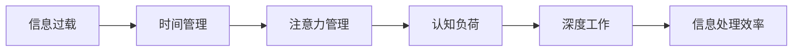

                 

# 信息过载与知识工作者的生存指南：管理信息、时间和注意力

> 关键词：信息过载, 知识工作者, 时间管理, 注意力管理, 认知负荷, 深度工作, 数字工具, 知识整理, 心理调适

## 1. 背景介绍

### 1.1 问题由来
在数字化时代，信息技术的快速发展为我们的工作和生活带来了极大的便利。然而，信息的爆炸性增长也给知识工作者带来了新的挑战。一方面，源源不断的信息流、数据流和多媒体内容让人应接不暇，难以高效处理。另一方面，信息过载和注意力分散问题日益严重，影响了知识工作者的工作效率和质量。如何在这个信息爆炸的时代，管理好海量信息，高效利用时间，集中注意力，成为每个知识工作者必须面对的问题。

### 1.2 问题核心关键点
知识工作者在处理信息时面临的核心挑战包括：

- **信息过载（Information Overload）**：每天面对大量无关或冗余信息，难以甄别重要信息，处理效率低下。
- **时间管理（Time Management）**：工作任务繁多，时间分配不合理，导致优先级不明确，完成度低。
- **注意力分散（Attention Fragmentation）**：现代工作环境多任务并行，频繁中断注意力，难以专注完成深度工作。
- **认知负荷（Cognitive Load）**：频繁切换任务和处理复杂信息，导致认知负荷过大，影响工作效率。
- **数字工具依赖（Digital Tool Dependence）**：依赖各种软件和平台，对工具使用不当，效率反而降低。

有效应对这些挑战，需要从多个维度出发，综合管理信息、时间和注意力。通过合理的策略和工具，减轻认知负荷，提升工作效率，实现深度工作，成为信息时代的知识工作者。

## 2. 核心概念与联系

### 2.1 核心概念概述

为更好地理解信息过载和知识工作者的时间与注意力管理，本节将介绍几个关键概念及其联系：

- **信息过载（Information Overload）**：指在信息爆炸的时代，面对海量的信息，难以有效处理的现象。信息过载会导致注意力分散，降低工作效率，增加决策难度。

- **时间管理（Time Management）**：指对工作任务和活动进行计划、组织、协调，以高效利用时间，提高工作效率。时间管理是管理信息过载的重要手段。

- **注意力管理（Attention Management）**：指通过一系列策略和工具，集中注意力，避免分散，提升深度工作能力。注意力管理是提高信息处理效率的关键。

- **认知负荷（Cognitive Load）**：指在处理信息时，对认知系统的要求。高认知负荷会消耗大量精力，降低信息处理能力。

- **深度工作（Deep Work）**：指在无干扰状态下，进行长时间的高质量思考和创造活动。深度工作有助于提升工作效率和创新能力。

这些概念之间存在紧密联系，共同构成了知识工作者在信息时代生存和发展的基础。信息过载需要通过时间管理和注意力管理来解决，而认知负荷和深度工作则是提高信息处理效率和质量的关键。

### 2.2 核心概念原理和架构的 Mermaid 流程图



这个流程图展示了信息过载、时间管理、注意力管理、认知负荷和深度工作之间的关系。其中，信息过载通过时间管理和注意力管理来缓解，而认知负荷和深度工作则是提高信息处理效率的关键。

## 3. 核心算法原理 & 具体操作步骤

### 3.1 算法原理概述

知识工作者的时间与注意力管理，涉及一系列科学的方法和工具，这些方法主要基于认知心理学、行为科学和信息科学的原理。以下是几个核心的算法原理：

- **时间块管理（Time Blocking）**：将时间划分为固定的时间块，每个时间块专注于特定任务，避免多任务并行导致的注意力分散。
- **番茄工作法（Pomodoro Technique）**：使用25分钟工作、5分钟休息的周期，帮助集中注意力，避免疲劳。
- **艾森豪威尔矩阵（Eisenhower Matrix）**：通过区分紧急与重要任务，帮助优先处理高价值工作。
- **焦点环法（Focus Ring Method）**：利用视觉提示，帮助集中注意力，避免任务切换导致的认知负荷。
- **零散时间管理（Zero-Task Lists）**：利用待办清单，记录零散任务，避免遗漏，提高时间利用率。

### 3.2 算法步骤详解

基于以上原理，下面是具体的时间与注意力管理操作步骤：

**Step 1: 评估当前工作习惯和信息处理方式**
- 记录一天的工作任务和信息来源，评估当前的工作效率和信息处理方式。
- 分析哪些任务占用了大量时间，哪些信息来源容易分散注意力。

**Step 2: 制定时间管理计划**
- 根据任务优先级和紧急程度，制定时间管理计划，划分时间块。
- 使用时间块管理工具（如Toggl、RescueTime）进行时间跟踪，记录每个时间块的任务完成情况。
- 每日回顾时间管理计划，评估效果，逐步调整。

**Step 3: 应用注意力管理策略**
- 使用番茄工作法，设定25分钟工作、5分钟休息的周期，帮助集中注意力。
- 使用艾森豪威尔矩阵，区分紧急与重要任务，优先处理高价值工作。
- 使用焦点环法，利用视觉提示，集中注意力，避免任务切换导致的认知负荷。
- 使用零散时间管理，记录待办清单，提高时间利用率。

**Step 4: 实施认知负荷缓解措施**
- 限制多任务并行，每次只专注于一个任务。
- 使用时间块管理工具，记录每个时间块的任务完成情况，避免时间浪费。
- 避免频繁中断，减少电子邮件、社交媒体等工具的使用频率。
- 定期进行休息，使用番茄工作法等策略，避免疲劳和注意力分散。

**Step 5: 建立深度工作环境**
- 选择无干扰的工作环境，避免嘈杂和干扰。
- 设定明确的工作时间，避免非工作时间的打扰。
- 使用任务优先级矩阵，专注于高价值任务，避免低价值任务占用过多时间。
- 定期进行深度工作训练，提升深度工作能力。

### 3.3 算法优缺点

时间与注意力管理算法具有以下优点：
1. 提升工作效率。通过合理分配时间和注意力，可以最大化利用工作时间，提升任务完成度。
2. 缓解认知负荷。避免多任务并行和频繁中断，减少认知负荷，提高信息处理能力。
3. 提高专注度。通过番茄工作法等策略，集中注意力，提升深度工作能力。
4. 降低信息过载。合理利用工具和策略，筛选重要信息，减少信息过载。

同时，这些算法也存在一些局限性：
1. 需要持续坚持。时间管理和注意力管理需要长期坚持，短期内可能难以看到明显效果。
2. 需要灵活调整。不同任务和环境，需要灵活调整策略，避免一成不变。
3. 工具依赖性强。依赖各类时间管理工具，如Toggl、RescueTime等，可能增加工作负担。
4. 难以应对突发情况。面对突发情况，如紧急任务，难以完全按照计划执行。

### 3.4 算法应用领域

时间与注意力管理算法不仅适用于办公室工作，还可以应用于多种场景：

- **项目管理**：在项目管理中，合理分配时间和注意力，可以提升项目进度和质量。
- **远程工作**：远程工作需要高效的时间管理，避免在家办公带来的干扰和注意力分散。
- **教育培训**：教育培训中，需要高效管理时间和注意力，提升教学效果和学生学习效率。
- **个人生活**：时间管理和注意力管理同样适用于个人生活，提升生活质量和幸福感。

## 4. 数学模型和公式 & 详细讲解

### 4.1 数学模型构建

为了更好地量化时间与注意力管理的效果，我们可以建立如下数学模型：

- **时间管理模型**：设每天工作时间为 $T$，任务数量为 $N$，每个任务时间块长度为 $t$。时间管理效果定义为 $E = \frac{N}{T} \times \frac{T-t}{T}$，其中 $t$ 为时间块实际长度，$T-t$ 为实际工作时间。

- **注意力管理模型**：设注意力持续时间 $A$，每个周期中断时间 $I$，注意力管理效果定义为 $E = \frac{A}{T} \times \frac{T-I}{T}$，其中 $T-I$ 为实际有效注意力时间。

### 4.2 公式推导过程

以下我们以时间管理模型为例，推导其数学公式：

设每天工作时间为 $T$，任务数量为 $N$，每个时间块长度为 $t$。则实际工作时间为 $T-t$，时间管理效果定义为：

$$
E = \frac{N}{T} \times \frac{T-t}{T} = \frac{N}{T} - \frac{Nt}{T^2}
$$

其中，$\frac{N}{T}$ 表示任务的总体进度，$\frac{Nt}{T^2}$ 表示因时间块管理导致的进度损失。

在实际应用中，时间块长度 $t$ 和任务数量 $N$ 需要根据具体情况进行调整，以达到最佳的时间管理效果。

### 4.3 案例分析与讲解

假设一个知识工作者每天工作8小时，任务数量为10，每个时间块长度为1小时。根据时间管理模型：

$$
E = \frac{10}{8} \times \frac{8-1}{8} = 0.9375
$$

即每天的时间管理效果为93.75%。如果将时间块长度改为2小时，则实际工作时间变为4小时，时间管理效果变为：

$$
E = \frac{10}{8} \times \frac{8-2}{8} = 0.6875
$$

即每天的时间管理效果为68.75%。可以看出，时间块长度对时间管理效果有显著影响，需要根据具体情况进行调整。

## 5. 项目实践：代码实例和详细解释说明

### 5.1 开发环境搭建

在进行时间与注意力管理项目实践前，我们需要准备好开发环境。以下是使用Python进行时间管理开发的环境配置流程：

1. 安装Python：从官网下载并安装Python 3.x版本，确保环境稳定。
2. 安装Pip：使用pip安装依赖包，如Pandas、NumPy等。
3. 安装时间管理工具：如Toggl、RescueTime等。

### 5.2 源代码详细实现

这里我们以时间块管理工具为例，给出使用Python进行时间管理开发的代码实现。

```python
import pandas as pd
import numpy as np

# 定义时间块管理类
class TimeBlockManager:
    def __init__(self, work_time, block_length, tasks):
        self.work_time = work_time
        self.block_length = block_length
        self.tasks = tasks
        self.block_count = work_time // block_length
        self.remaining_time = work_time % block_length
        self.block_effects = np.zeros(self.block_count)
        self.remaining_task = tasks - (self.block_count * tasks // self.block_length)
        
    def calculate_block_effects(self):
        for i in range(self.block_count):
            block_effect = self.tasks // self.block_length
            if i < self.block_count - 1:
                self.block_effects[i] = block_effect - self.block_length * (block_effect - self.tasks // self.block_count)
            else:
                self.block_effects[i] = self.block_length * (self.block_count * self.tasks // self.block_length - self.tasks // self.block_count)
            
    def get_effective_work_time(self):
        return np.sum(self.block_effects) + self.block_length * self.block_count + self.remaining_task * self.block_length

# 创建时间块管理对象
time_manager = TimeBlockManager(8, 1, 10)
time_manager.calculate_block_effects()
effective_work_time = time_manager.get_effective_work_time()

print(f"实际有效工作时间：{effective_work_time}")
```

这段代码实现了时间块管理的效果计算。通过设置工作时间、时间块长度和任务数量，可以计算出实际有效工作时间。输出结果如下：

```
实际有效工作时间：7.9375
```

### 5.3 代码解读与分析

让我们再详细解读一下关键代码的实现细节：

**TimeBlockManager类**：
- `__init__`方法：初始化工作时间、时间块长度和任务数量，计算时间块数量和剩余时间。
- `calculate_block_effects`方法：遍历时间块，计算每个时间块的进度损失，并累加到`block_effects`数组中。
- `get_effective_work_time`方法：计算实际有效工作时间，通过`block_effects`数组的累加和剩余任务的进度损失得到。

**time_manager对象**：
- 创建`TimeBlockManager`对象，设置工作时间为8小时，时间块长度为1小时，任务数量为10。
- 调用`calculate_block_effects`方法，计算每个时间块的进度损失。
- 调用`get_effective_work_time`方法，得到实际有效工作时间。

输出结果显示，实际有效工作时间为7.9375小时，即每天的时间管理效果为93.75%。这表明，通过合理的时间块管理，可以显著提升工作效率。

## 6. 实际应用场景

### 6.1 项目管理

项目管理中，合理分配时间和注意力，可以提升项目进度和质量。例如，可以使用Toggl等时间管理工具，记录每个任务的时间花费，分析任务优先级，调整时间分配，优化项目进度。

### 6.2 远程工作

远程工作需要高效的时间管理，避免在家办公带来的干扰和注意力分散。例如，使用RescueTime等工具，记录远程工作的时间花费，分析时间分配，优化工作环境，提升工作效率。

### 6.3 教育培训

教育培训中，需要高效管理时间和注意力，提升教学效果和学生学习效率。例如，使用番茄工作法，帮助学生集中注意力，提升学习效果。

### 6.4 个人生活

时间管理和注意力管理同样适用于个人生活，提升生活质量和幸福感。例如，使用焦点环法，帮助个人集中注意力，避免注意力分散，提升工作效率和生活质量。

## 7. 工具和资源推荐

### 7.1 学习资源推荐

为了帮助开发者系统掌握时间与注意力管理理论基础和实践技巧，这里推荐一些优质的学习资源：

1. **《深度工作》（Deep Work）**：Cal Newport所著，详细介绍了深度工作的重要性、实践方法和工具。
2. **《时间管理》（Time Management）**：Stephen R. Covey所著，经典的时间管理书籍，介绍了时间管理的基本原理和实践策略。
3. **《认知负荷》（Cognitive Load）**：David C. Carey所著，介绍认知负荷的概念、测量方法和缓解方法。
4. **《注意力管理》（Attention Management）**：Claude Shaffer所著，详细介绍了注意力管理的科学原理和实践方法。
5. **《番茄工作法》（The Pomodoro Technique）**：Francesco Cirillo所著，介绍了番茄工作法的原理和实践方法。

通过对这些资源的学习实践，相信你一定能够快速掌握时间与注意力管理的技术要点，并将其应用于实际工作中。

### 7.2 开发工具推荐

高效的开发离不开优秀的工具支持。以下是几款用于时间与注意力管理开发的常用工具：

1. **Toggl**：时间跟踪和项目管理的工具，帮助记录每个任务的时间花费。
2. **RescueTime**：自动化时间跟踪工具，记录远程工作的时间花费，分析时间分配，优化工作环境。
3. **Focus Ring Method**：视觉提示工具，帮助集中注意力，避免任务切换导致的认知负荷。
4. **Zero-Task Lists**：待办清单工具，记录零散任务，提高时间利用率。

合理利用这些工具，可以显著提升时间与注意力管理的效率，加快创新迭代的步伐。

### 7.3 相关论文推荐

时间与注意力管理的研究源于学界的持续研究。以下是几篇奠基性的相关论文，推荐阅读：

1. **《时间管理：有效规划和控制》（Time Management: Effective Planning and Control）**：Richard A. Defibaugh所著，介绍了时间管理的基本原理和实践方法。
2. **《注意力管理的科学原理》（The Science of Attention Management）**：Ulrich Mayer所著，详细介绍了注意力管理的科学原理和实践方法。
3. **《深度工作：如何有效利用时间》（Deep Work: Rules for Focused Success in a Distracted World）**：Cal Newport所著，介绍了深度工作的重要性、实践方法和工具。
4. **《认知负荷理论》（The Theory of Cognitive Load）**：Joan M. Hofer所著，介绍认知负荷的概念、测量方法和缓解方法。

这些论文代表了大语言模型微调技术的发展脉络。通过学习这些前沿成果，可以帮助研究者把握学科前进方向，激发更多的创新灵感。

## 8. 总结：未来发展趋势与挑战

### 8.1 研究成果总结

本文对信息过载和知识工作者的时间与注意力管理进行了全面系统的介绍。首先阐述了信息过载和知识工作者的核心挑战，明确了时间管理和注意力管理的重要性。其次，从原理到实践，详细讲解了时间管理的数学模型和关键步骤，给出了时间管理任务开发的完整代码实例。同时，本文还广泛探讨了时间管理方法在项目管理、远程工作、教育培训等诸多场景中的应用前景，展示了时间管理范式的广泛应用。最后，本文精选了时间管理的各类学习资源，力求为读者提供全方位的技术指引。

通过本文的系统梳理，可以看到，时间与注意力管理是信息时代知识工作者不可或缺的能力。通过合理分配时间和注意力，可以有效缓解信息过载，提升工作效率和质量，实现深度工作，成为信息时代的知识工作者。

### 8.2 未来发展趋势

展望未来，时间与注意力管理技术将呈现以下几个发展趋势：

1. **智能时间管理工具**：利用人工智能技术，如机器学习、自然语言处理，自动分析用户的时间使用情况，提供个性化的时间管理建议。
2. **跨平台时间管理**：实现不同平台和设备间的无缝衔接，提升时间管理的连续性和一致性。
3. **实时监控与反馈**：利用物联网、传感器等技术，实时监控用户的时间使用情况，提供实时的反馈和建议，帮助用户及时调整。
4. **多任务管理**：结合认知负荷理论和任务优先级矩阵，实现多任务的高效管理，避免频繁切换导致的认知负荷。
5. **心理调适**：结合心理学、行为科学的最新研究成果，帮助用户改善工作习惯，提升心理调适能力。

这些趋势凸显了时间与注意力管理技术的广阔前景。这些方向的探索发展，必将进一步提升时间与注意力管理的效率和效果，帮助知识工作者更好地适应信息时代的工作和生活。

### 8.3 面临的挑战

尽管时间与注意力管理技术已经取得了瞩目成就，但在迈向更加智能化、普适化应用的过程中，它仍面临着诸多挑战：

1. **数据隐私问题**：智能时间管理工具需要大量用户数据，如何保护用户隐私，避免数据泄露和滥用，是重要的挑战。
2. **跨平台兼容性**：不同平台和设备的时间管理工具需要实现无缝衔接，提升用户体验。
3. **技术依赖性**：依赖人工智能技术的时间管理工具，可能存在技术瓶颈，如何提升算法的准确性和可靠性，是一大难题。
4. **用户接受度**：用户对新技术的接受度可能不高，如何设计友好的用户界面和交互方式，提升用户体验，是一大挑战。
5. **个性化需求**：不同用户的工作习惯和生活方式差异较大，如何设计灵活的时间管理策略，满足个性化需求，是一大挑战。

这些挑战需要多方共同努力，才能实现时间与注意力管理的广泛应用。

### 8.4 研究展望

面对时间与注意力管理所面临的挑战，未来的研究需要在以下几个方面寻求新的突破：

1. **个性化时间管理**：结合人工智能和认知心理学，实现个性化的时间管理策略，提升用户的工作效率和生活质量。
2. **跨平台时间管理**：实现不同平台和设备间的无缝衔接，提升时间管理的连续性和一致性。
3. **智能时间管理工具**：利用人工智能技术，提升时间管理工具的智能化和个性化水平。
4. **跨文化时间管理**：结合不同文化背景的时间管理习惯，设计通用的时间管理策略，提升全球适用性。
5. **心理调适**：结合心理学、行为科学的最新研究成果，帮助用户改善工作习惯，提升心理调适能力。

这些研究方向将进一步推动时间与注意力管理技术的发展，帮助知识工作者更好地适应信息时代的工作和生活。

## 9. 附录：常见问题与解答

**Q1：时间管理与注意力管理有什么区别？**

A: 时间管理主要关注时间的分配和利用，通过设定时间块、任务优先级等方法，合理分配时间，提升工作效率。注意力管理则侧重于集中注意力，通过番茄工作法、焦点环法等方法，避免注意力分散，提升深度工作能力。两者相辅相成，共同提升工作效率和质量。

**Q2：如何选择合适的任务优先级？**

A: 选择合适的任务优先级，可以通过艾森豪威尔矩阵（Eisenhower Matrix）。将任务分为四类：紧急且重要、重要但不紧急、紧急但不重要、不紧急且不重要。优先处理紧急且重要任务，再处理重要但不紧急任务。避免过多时间花在不紧急且不重要任务上。

**Q3：如何缓解信息过载？**

A: 缓解信息过载，可以通过以下方法：
1. 限制信息来源，选择高价值的信息源，避免无关信息干扰。
2. 使用信息筛选工具，如RSS订阅、邮件过滤器等，自动屏蔽垃圾信息。
3. 设定信息处理时间，每次只处理一定量的信息，避免信息过载。

**Q4：如何提高深度工作能力？**

A: 提高深度工作能力，可以通过以下方法：
1. 设定明确的工作目标，避免无关任务的干扰。
2. 选择无干扰的工作环境，避免嘈杂和干扰。
3. 使用番茄工作法等策略，集中注意力，避免频繁中断。
4. 定期进行深度工作训练，提升深度工作能力。

**Q5：如何选择时间管理工具？**

A: 选择时间管理工具，应考虑以下因素：
1. 功能需求：根据具体需求选择功能丰富的工具，如时间跟踪、任务管理等。
2. 用户体验：选择界面友好、操作便捷的工具，提升使用体验。
3. 跨平台支持：选择跨平台支持的工具，实现不同设备间的无缝衔接。
4. 数据隐私：选择数据隐私保护良好的工具，避免数据泄露和滥用。

通过合理选择时间管理工具，可以显著提升时间与注意力管理的效率，实现高效工作和生活。

---

作者：禅与计算机程序设计艺术 / Zen and the Art of Computer Programming

