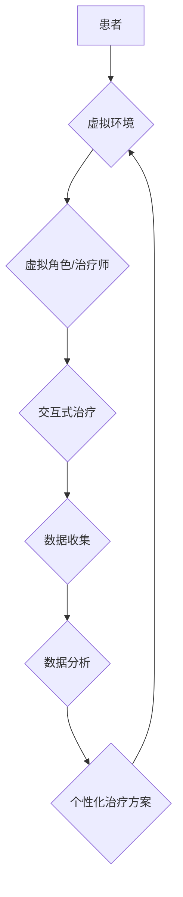

                 

## 元宇宙精神治疗:虚拟 worlds 的精神治疗技术

> 关键词：元宇宙、精神治疗、虚拟现实、人工智能、交互式治疗、沉浸式体验、心理健康

## 1. 背景介绍

近年来，随着虚拟现实 (VR)、增强现实 (AR) 和人工智能 (AI) 技术的飞速发展，元宇宙概念逐渐成为科技界和社会大众关注的焦点。元宇宙被定义为一个由虚拟世界、数字经济和社交交互构成的下一代互联网，它将打破物理世界的限制，为人们提供更加沉浸式、交互式和个性化的体验。

在精神治疗领域，元宇宙也展现出巨大的潜力。传统精神治疗模式往往局限于线下环境，患者需要克服时间、空间和心理障碍才能接受治疗。而元宇宙可以提供一个安全、私密、可控的虚拟环境，帮助患者克服这些障碍，更有效地进行心理治疗。

## 2. 核心概念与联系

### 2.1 元宇宙与精神治疗的融合

元宇宙为精神治疗提供了全新的可能性：

* **沉浸式体验:** 元宇宙可以创造逼真的虚拟环境，让患者身临其境地体验不同的场景和情境，例如模拟社交场合、克服恐惧、练习应对压力等。
* **交互式治疗:** 元宇宙支持用户与虚拟角色、其他患者或治疗师进行交互，促进患者的表达、沟通和社交技能发展。
* **个性化治疗:** 元宇宙可以根据患者的个体需求和治疗目标，定制个性化的治疗方案和虚拟环境，提高治疗效果。
* **数据驱动:** 元宇宙可以收集患者在虚拟环境中的行为数据，帮助治疗师更好地了解患者的心理状态和治疗进展，并进行数据分析和个性化调整。

### 2.2 元宇宙精神治疗技术架构



## 3. 核心算法原理 & 具体操作步骤

### 3.1 算法原理概述

元宇宙精神治疗的核心算法主要包括：

* **虚拟环境构建算法:** 用于根据患者需求和治疗目标，构建逼真、沉浸式的虚拟环境。
* **虚拟角色交互算法:** 用于模拟虚拟角色的行为和对话，实现与患者的自然交互。
* **情绪识别算法:** 用于分析患者在虚拟环境中的表情、语音和行为，识别患者的情绪状态。
* **个性化治疗方案算法:** 用于根据患者的情绪状态、治疗目标和虚拟环境中的交互数据，生成个性化的治疗方案。

### 3.2 算法步骤详解

1. **环境构建:** 根据患者的诊断和治疗目标，设计虚拟环境的场景、人物、道具等。
2. **角色交互:** 虚拟角色根据预设的剧本和患者的输入，进行自然、流畅的对话和行为。
3. **情绪识别:** 利用计算机视觉、语音识别和自然语言处理技术，分析患者的情绪状态。
4. **数据分析:** 收集患者在虚拟环境中的行为数据，分析患者的情绪变化、治疗效果等。
5. **方案调整:** 根据数据分析结果，调整虚拟环境、虚拟角色的行为和治疗方案，提高治疗效果。

### 3.3 算法优缺点

**优点:**

* **沉浸式体验:** 虚拟环境可以提供更加逼真、沉浸式的体验，帮助患者更好地投入治疗。
* **个性化治疗:** 算法可以根据患者的个体需求和治疗目标，定制个性化的治疗方案。
* **数据驱动:** 数据分析可以帮助治疗师更好地了解患者的心理状态和治疗进展。
* **安全和私密:** 虚拟环境可以提供一个安全、私密的空间，让患者更放松地进行治疗。

**缺点:**

* **技术复杂:** 元宇宙精神治疗技术需要整合多种先进技术，开发难度较高。
* **成本高昂:** 建设和维护虚拟环境需要大量的资金投入。
* **伦理问题:** 虚拟环境中的数据安全、患者隐私保护等伦理问题需要得到充分的考虑。

### 3.4 算法应用领域

元宇宙精神治疗技术可以应用于多种精神疾病的治疗，例如：

* **焦虑症:** 利用虚拟环境模拟社交场合，帮助患者克服社交恐惧和焦虑。
* **抑郁症:** 利用虚拟环境创造积极、愉快的体验，帮助患者提升情绪和生活质量。
* **创伤后应激障碍 (PTSD):** 利用虚拟环境模拟创伤事件，帮助患者逐步面对和克服创伤记忆。
* **注意力缺陷多动障碍 (ADHD):** 利用虚拟环境进行游戏化训练，帮助患者提高注意力和专注力。

## 4. 数学模型和公式 & 详细讲解 & 举例说明

### 4.1 数学模型构建

元宇宙精神治疗的数学模型可以基于以下几个方面构建：

* **情绪识别模型:** 可以利用机器学习算法，构建情绪识别模型，将患者的表情、语音和行为数据映射到相应的的情绪状态。例如，可以使用支持向量机 (SVM) 或深度神经网络 (DNN) 构建情绪识别模型。
* **虚拟角色行为模型:** 可以利用行为树或状态机等模型，构建虚拟角色的行为逻辑，使其能够根据患者的输入和场景变化，做出自然、合理的反应。
* **个性化治疗方案模型:** 可以利用强化学习算法，构建个性化治疗方案模型，根据患者的情绪状态和治疗进展，动态调整虚拟环境、虚拟角色的行为和治疗方案。

### 4.2 公式推导过程

例如，情绪识别模型可以使用以下公式计算患者的情绪概率:

$$P(Emotion_i|Data) = \frac{exp(w_i^T * Data)}{\sum_{j=1}^{N} exp(w_j^T * Data)}$$

其中:

* $P(Emotion_i|Data)$ 表示患者情绪为 $Emotion_i$ 的概率，给定数据 $Data$。
* $w_i$ 是情绪 $Emotion_i$ 的权重向量。
* $Data$ 是患者的表情、语音和行为数据。
* $N$ 是所有情绪类别数。

### 4.3 案例分析与讲解

假设患者在虚拟环境中表现出焦虑的情绪，例如心跳加速、呼吸急促、言语颤抖等。情绪识别模型可以根据这些数据，计算出患者焦虑情绪的概率。如果概率超过设定阈值，则虚拟环境可以根据预设的方案，例如播放舒缓的音乐、调整场景灯光等，帮助患者缓解焦虑情绪。

## 5. 项目实践：代码实例和详细解释说明

### 5.1 开发环境搭建

元宇宙精神治疗项目可以使用 Unity 或 Unreal Engine 等游戏引擎进行开发。开发环境需要包含以下软件:

* 游戏引擎 (Unity 或 Unreal Engine)
* 编程语言 (C# 或 C++)
* 虚拟现实头显设备
* 相关插件和工具 (例如，情绪识别插件、虚拟角色动画插件等)

### 5.2 源代码详细实现

以下是一个简单的虚拟角色对话代码示例，使用 Unity 和 C# 语言实现:

```csharp
public class VirtualCharacter : MonoBehaviour
{
    public string[] greetings = { "你好!", "嗨!", "好久不见!" };
    public string[] farewells = { "再见!", "下次见!", "祝你玩得愉快!" };

    public void Greet()
    {
        Debug.Log(greetings[Random.Range(0, greetings.Length)]);
    }

    public void Farewell()
    {
        Debug.Log(farewells[Random.Range(0, farewells.Length)]);
    }
}
```

### 5.3 代码解读与分析

这段代码定义了一个虚拟角色类，包含两个字符串数组，分别用于存储问候语和告别语。

* `Greet()` 方法随机选择一个问候语并打印到控制台。
* `Farewell()` 方法随机选择一个告别语并打印到控制台。

### 5.4 运行结果展示

当运行这段代码时，虚拟角色会随机输出一个问候语或告别语。

## 6. 实际应用场景

元宇宙精神治疗技术已经在一些临床实践中得到应用，例如：

* **虚拟现实暴露疗法:** 利用虚拟环境模拟患者的恐惧场景，帮助患者逐步面对和克服恐惧。
* **虚拟现实认知行为疗法:** 利用虚拟环境模拟现实生活中的情境，帮助患者学习新的应对策略，改变负面思维模式。
* **虚拟现实社交技能训练:** 利用虚拟环境模拟社交场景，帮助患者练习社交技能，提高社交自信。

### 6.4 未来应用展望

元宇宙精神治疗技术在未来将有更广泛的应用前景，例如：

* **远程精神治疗:** 元宇宙可以打破地域限制，让患者即使身处偏远地区也能接受高质量的精神治疗。
* **群体治疗:** 元宇宙可以为多个患者提供一个虚拟空间，进行群体治疗，促进患者之间的交流和支持。
* **游戏化治疗:** 元宇宙可以利用游戏元素，将精神治疗变得更加有趣和吸引人，提高患者的治疗积极性。

## 7. 工具和资源推荐

### 7.1 学习资源推荐

* **书籍:**
    * 《元宇宙：下一代互联网》
    * 《虚拟现实技术》
    * 《人工智能》
* **在线课程:**
    * Coursera: 虚拟现实开发
    * Udemy: 元宇宙技术
    * edX: 人工智能

### 7.2 开发工具推荐

* **游戏引擎:** Unity, Unreal Engine
* **虚拟现实头显设备:** Oculus Quest, HTC Vive
* **情绪识别插件:** Affectiva, Kairos

### 7.3 相关论文推荐

* **元宇宙精神治疗的最新研究进展**
* **虚拟现实暴露疗法的临床效果**
* **人工智能在精神治疗中的应用**

## 8. 总结：未来发展趋势与挑战

### 8.1 研究成果总结

元宇宙精神治疗技术在短短几年内取得了显著进展，为精神疾病的治疗提供了新的可能性。虚拟环境、人工智能和交互式治疗等技术相结合，可以为患者提供更加沉浸式、个性化和有效的治疗体验。

### 8.2 未来发展趋势

未来，元宇宙精神治疗技术将朝着以下方向发展:

* **更加逼真的虚拟环境:** 利用更先进的图形渲染技术和物理引擎，构建更加逼真、沉浸式的虚拟环境。
* **更智能的虚拟角色:** 利用更强大的人工智能算法，构建更加智能、人性化的虚拟角色，能够更好地理解和回应患者的需求。
* **更个性化的治疗方案:** 利用大数据分析和机器学习算法，为每个患者定制更加个性化的治疗方案。

### 8.3 面临的挑战

元宇宙精神治疗技术也面临着一些挑战:

* **技术复杂性:** 元宇宙精神治疗技术需要整合多种先进技术，开发难度较高。
* **成本高昂:** 建设和维护虚拟环境需要大量的资金投入。
* **伦理问题:** 虚拟环境中的数据安全、患者隐私保护等伦理问题需要得到充分的考虑。

### 8.4 研究展望

尽管面临挑战，但元宇宙精神治疗技术的前景依然光明。随着技术的不断发展和应用的不断深入，元宇宙精神治疗将为更多患者带来希望和健康。

## 9. 附录：常见问题与解答

**Q1: 元宇宙精神治疗是否安全有效？**

A1: 元宇宙精神治疗技术仍处于发展阶段，需要更多的临床研究来验证其安全性和有效性。目前，一些临床实践表明，元宇宙精神治疗技术在治疗某些精神疾病方面具有潜力，但并非所有患者都适合接受这种治疗。

**Q2: 元宇宙精神治疗的成本如何？**

A2: 元宇宙精神治疗的成本取决于多种因素，例如虚拟环境的复杂程度、治疗方案的时长等。目前，元宇宙精神治疗的成本相对较高，但随着技术的成熟和应用的普及，成本预计会逐渐降低。

**Q3: 元宇宙精神治疗会取代传统精神治疗吗？**

A3: 元宇宙精神治疗技术可以作为一种补充传统精神治疗的方式，但不会完全取代传统精神治疗。传统精神治疗仍然是精神疾病治疗的主要手段，元宇宙精神治疗可以为患者提供更加个性化和沉浸式的治疗体验，但需要在专业医生的指导下进行。


作者：禅与计算机程序设计艺术 / Zen and the Art of Computer Programming 
<end_of_turn>

