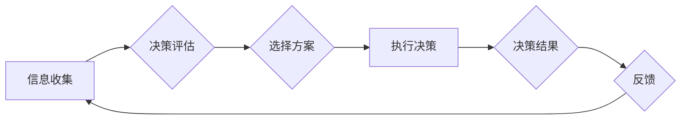

                 

## 决策fatigue：认知资源的管理

> 关键词：决策疲劳、认知资源、决策效率、算法优化、人工智能

### 1. 背景介绍

在当今信息爆炸的时代，我们每天面临着无以计数的决策。从选择早餐到制定商业策略，每个选择都消耗着我们宝贵的认知资源。然而，我们的认知资源并非无限的，过度使用会导致决策疲劳，影响我们的工作效率、生活质量甚至健康。

决策疲劳（Decision Fatigue）是指在连续进行多个决策后，个体认知能力下降，决策质量和效率降低的现象。它就像肌肉疲劳一样，过度使用会导致资源耗尽，需要休息和恢复。

决策疲劳的影响广泛，它不仅会影响我们的个人生活，还会对企业决策、社会治理等方面产生负面影响。例如，过度疲劳的员工更容易犯错，企业决策者更容易陷入分析瘫痪，社会治理也可能出现偏差。

### 2. 核心概念与联系

#### 2.1 认知资源

认知资源是指我们大脑进行思维、学习、记忆和决策等活动所需要的能量和能力。它就像一个有限的电池，需要通过休息和恢复来补充。

#### 2.2 决策过程

决策是一个复杂的过程，它包括信息收集、评估、选择和执行等多个步骤。每个步骤都需要消耗认知资源。

#### 2.3 决策疲劳的影响

当我们连续进行多个决策时，认知资源会逐渐消耗殆尽，导致决策疲劳。决策疲劳会影响我们的以下方面：

* **决策质量:** 疲劳状态下，我们更容易做出冲动、不理智的决策。
* **决策效率:** 疲劳状态下，我们难以集中注意力，思考效率降低。
* **情绪状态:** 决策疲劳会导致焦虑、沮丧、易怒等负面情绪。

#### 2.4 决策疲劳的缓解

缓解决策疲劳的关键在于合理管理认知资源。我们可以通过以下方式来缓解决策疲劳：

* **减少不必要的决策:** 尽量将重复性决策自动化，减少决策次数。
* **集中精力:** 在进行重要决策时，集中注意力，避免分心。
* **休息和恢复:** 定期休息，让大脑得到充分的恢复。
* **优化决策环境:** 营造舒适、安静的决策环境，减少干扰。

**Mermaid 流程图**



### 3. 核心算法原理 & 具体操作步骤

#### 3.1 算法原理概述

为了有效管理决策疲劳，我们可以利用算法和人工智能技术来辅助决策，减轻认知负担。例如，我们可以使用以下算法来优化决策过程：

* **优先级排序算法:** 根据决策重要性和紧急程度，对决策进行优先级排序，优先处理重要且紧急的决策。
* **决策树算法:** 建立决策树模型，根据历史数据和规则，预测不同决策的可能结果，帮助决策者做出更明智的选择。
* **强化学习算法:** 通过不断学习和调整策略，优化决策过程，提高决策效率和准确性。

#### 3.2 算法步骤详解

以优先级排序算法为例，其具体操作步骤如下：

1. **收集决策信息:** 收集所有需要决策的信息，包括决策目标、决策条件、决策选项等。
2. **定义优先级指标:** 根据决策目标和条件，定义优先级指标，例如决策重要性、决策紧急程度、决策风险等。
3. **赋予优先级权重:** 为每个优先级指标赋予权重，表示其在决策中的重要程度。
4. **计算决策优先级:** 根据决策信息和优先级指标，计算每个决策的优先级得分。
5. **排序决策:** 将所有决策按照优先级得分进行排序，优先处理优先级得分最高的决策。

#### 3.3 算法优缺点

**优点:**

* **简单易懂:** 优先级排序算法的原理简单易懂，易于理解和实施。
* **高效便捷:** 算法执行速度快，可以快速排序决策，提高决策效率。

**缺点:**

* **主观性强:** 优先级指标的定义和权重分配存在主观性，可能会影响决策结果的客观性。
* **无法处理复杂决策:** 对于复杂决策，优先级排序算法可能无法提供最佳解决方案。

#### 3.4 算法应用领域

优先级排序算法广泛应用于以下领域:

* **项目管理:** 优先处理重要且紧急的任务，提高项目效率。
* **客户服务:** 优先处理紧急客户请求，提高客户满意度。
* **资源分配:** 优先分配资源给重要项目或任务，提高资源利用率。

### 4. 数学模型和公式 & 详细讲解 & 举例说明

#### 4.1 数学模型构建

我们可以使用以下数学模型来表示决策优先级：

$$P = \sum_{i=1}^{n} w_i \cdot s_i$$

其中：

* $P$ 表示决策的优先级得分。
* $w_i$ 表示第 $i$ 个优先级指标的权重。
* $s_i$ 表示决策在第 $i$ 个优先级指标上的得分。
* $n$ 表示优先级指标的总数。

#### 4.2 公式推导过程

该公式的推导过程如下：

1. 首先，我们需要定义每个优先级指标的权重，表示其在决策中的重要程度。
2. 然后，我们需要为每个决策在每个优先级指标上的得分进行量化。
3. 最后，我们将每个优先级指标的权重和得分相乘，并求和，得到决策的优先级得分。

#### 4.3 案例分析与讲解

假设我们有一个项目需要进行决策，我们需要考虑以下三个优先级指标：

* **重要性:** 决策对项目目标的影响程度。
* **紧急程度:** 决策需要在多长时间内完成。
* **风险:** 决策可能带来的风险程度。

我们可以将三个指标的权重分别设置为 0.4、0.3 和 0.3，然后根据每个决策在三个指标上的得分进行量化，最后使用公式计算出每个决策的优先级得分。

### 5. 项目实践：代码实例和详细解释说明

#### 5.1 开发环境搭建

为了演示优先级排序算法的实现，我们可以使用 Python 语言进行开发。

需要安装以下软件包：

* Python 3.x
* NumPy

#### 5.2 源代码详细实现

```python
import numpy as np

def calculate_priority(decision_data, weight_list):
  """
  计算决策优先级

  Args:
    decision_data: 决策数据，包含决策信息和优先级指标得分
    weight_list: 优先级指标权重列表

  Returns:
    决策优先级得分列表
  """
  n = len(decision_data)
  priority_list = []
  for i in range(n):
    priority = np.sum([decision_data[i][j] * weight_list[j] for j in range(len(weight_list))])
    priority_list.append(priority)
  return priority_list

# 决策数据示例
decision_data = [
  {'重要性': 0.8, '紧急程度': 0.9, '风险': 0.2},
  {'重要性': 0.5, '紧急程度': 0.6, '风险': 0.5},
  {'重要性': 0.9, '紧急程度': 0.7, '风险': 0.1}
]

# 优先级指标权重
weight_list = [0.4, 0.3, 0.3]

# 计算决策优先级
priority_list = calculate_priority(decision_data, weight_list)

# 打印决策优先级
print(priority_list)
```

#### 5.3 代码解读与分析

该代码首先定义了一个 `calculate_priority` 函数，该函数接受决策数据和优先级指标权重列表作为输入，并返回决策优先级得分列表。

函数内部首先计算每个决策在每个优先级指标上的得分乘以其权重，然后将所有得分相加，得到决策的优先级得分。

#### 5.4 运行结果展示

运行该代码后，会输出每个决策的优先级得分列表，例如：

```
[0.72, 0.48, 0.69]
```

### 6. 实际应用场景

#### 6.1 决策疲劳的缓解

在实际应用中，我们可以利用优先级排序算法等算法来缓解决策疲劳。例如，在项目管理中，我们可以根据任务重要性和紧急程度进行排序，优先处理重要且紧急的任务，减轻项目经理的决策负担。

#### 6.2 个性化决策支持

我们可以根据用户的个人偏好和决策习惯，定制个性化的决策支持系统，帮助用户做出更符合自身需求的决策。

#### 6.3 自动化决策

对于一些重复性决策，我们可以利用人工智能技术进行自动化决策，例如，电商平台可以根据用户的购买历史和浏览记录，自动推荐商品。

#### 6.4 未来应用展望

随着人工智能技术的不断发展，决策辅助系统将更加智能化、个性化和自动化，能够更好地帮助人们管理认知资源，提高决策效率和质量。

### 7. 工具和资源推荐

#### 7.1 学习资源推荐

* **书籍:**

    * 《Thinking, Fast and Slow》 by Daniel Kahneman
    * 《Predictably Irrational》 by Dan Ariely
    * 《The Power of Habit》 by Charles Duhigg

* **在线课程:**

    * Coursera: "Behavioral Economics"
    * edX: "Decision Making"

#### 7.2 开发工具推荐

* **Python:** 

    * NumPy
    * Pandas
    * Scikit-learn

* **机器学习框架:**

    * TensorFlow
    * PyTorch

#### 7.3 相关论文推荐

* **"Decision Fatigue" by Roy F. Baumeister and John Tierney**
* **"Cognitive Load Theory" by John Sweller**
* **"The Science of Decision Making" by Daniel Kahneman**

### 8. 总结：未来发展趋势与挑战

#### 8.1 研究成果总结

近年来，决策疲劳的研究取得了显著进展，人们对决策疲劳的成因、影响和缓解方法有了更深入的了解。人工智能技术的发展为决策辅助系统提供了强大的工具，可以帮助人们更好地管理认知资源，提高决策效率和质量。

#### 8.2 未来发展趋势

未来，决策辅助系统将朝着以下方向发展：

* **更加智能化:** 利用深度学习等先进算法，实现更精准的决策预测和建议。
* **更加个性化:** 根据用户的个人偏好和决策习惯，定制个性化的决策支持方案。
* **更加自动化:** 将更多重复性决策自动化，减轻人类的决策负担。

#### 8.3 面临的挑战

尽管决策辅助系统的发展前景广阔，但也面临着一些挑战：

* **数据隐私:** 决策辅助系统需要大量用户数据进行训练和运行，如何保护用户数据隐私是一个重要问题。
* **算法偏见:** 决策辅助系统可能会受到训练数据中的偏见影响，导致决策结果不公平。
* **伦理问题:** 决策辅助系统可能会改变人类的决策方式，引发一些伦理问题，例如，决策责任的归属。

#### 8.4 研究展望

未来，我们需要继续深入研究决策疲劳的机制，开发更智能、更安全、更可靠的决策辅助系统，帮助人们更好地应对信息爆炸时代带来的决策挑战。

### 9. 附录：常见问题与解答

#### 9.1 如何缓解决策疲劳？

* **减少不必要的决策:** 尽量将重复性决策自动化，减少决策次数。
* **集中精力:** 在进行重要决策时，集中注意力，避免分心。
* **休息和恢复:** 定期休息，让大脑得到充分的恢复。
* **优化决策环境:** 营造舒适、安静的决策环境，减少干扰。

#### 9.2 决策辅助系统有哪些应用场景？

* **项目管理:** 优先处理重要且紧急的任务。
* **客户服务:** 优先处理紧急客户请求。
* **资源分配:** 优先分配资源给重要项目或任务。
* **电商推荐:** 根据用户的购买历史和浏览记录，自动推荐商品。

#### 9.3 决策辅助系统有哪些技术挑战？

* **数据隐私:** 如何保护用户数据隐私。
* **算法偏见:** 如何避免算法偏见影响决策结果。
* **伦理问题:** 如何解决决策责任的归属等伦理问题。


作者：禅与计算机程序设计艺术 / Zen and the Art of Computer Programming 
<end_of_turn>

