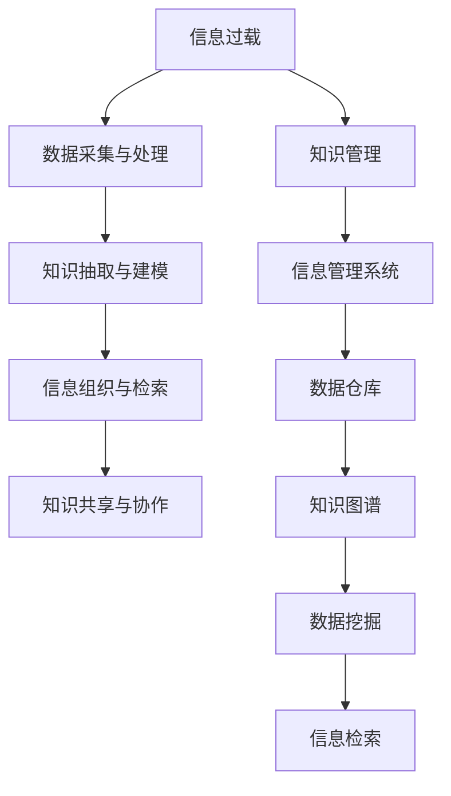

                 

# 信息过载与知识管理系统实施指南：管理和组织信息

> 关键词：信息过载,知识管理,信息管理系统,信息组织,数据存储

## 1. 背景介绍

### 1.1 问题由来
随着互联网技术的飞速发展，信息获取变得前所未有的容易和高效。然而，这种信息爆炸也带来了信息过载（Information Overload）的问题，大量无关紧要的信息充斥着我们的日常生活，导致人们难以从中筛选出有价值的内容。同时，知识管理（Knowledge Management）也面临着类似的挑战。如何从海量数据中提取有价值的知识，并将其高效组织起来，成为现代社会亟待解决的问题。

### 1.2 问题核心关键点
信息过载和知识管理的核心在于如何高效管理和组织信息。主要包括以下几个关键点：
1. **数据采集与处理**：从不同来源获取数据，并对其进行清洗、去重、格式转换等处理，以便后续存储和分析。
2. **知识抽取与建模**：从结构化和非结构化数据中抽取有用的知识，并将其构建为结构化的知识图谱或数据库。
3. **信息组织与检索**：通过分类、标签、搜索等手段，将知识进行组织和索引，使用户能够快速找到所需信息。
4. **知识共享与协作**：构建知识共享平台，促进团队成员之间的知识交流和协作，提升组织整体的创新能力。

### 1.3 问题研究意义
信息过载和知识管理系统的实施，对提高信息利用效率、推动组织创新具有重要意义：

1. **提升工作效率**：通过自动化信息处理和智能检索，帮助员工快速找到所需信息，减少信息查找和筛选的负担。
2. **促进知识共享**：构建知识共享平台，使员工能够方便地分享和获取知识，提升团队整体的创新能力。
3. **支持决策支持**：通过知识抽取和分析，为决策者提供数据支持，辅助制定更加科学合理的决策。
4. **推动组织变革**：信息过载和知识管理系统的实施，有助于组织从经验驱动向数据驱动转变，提升组织的核心竞争力。

## 2. 核心概念与联系

### 2.1 核心概念概述

为更好地理解信息过载与知识管理系统的实施过程，本节将介绍几个密切相关的核心概念：

- **信息过载（Information Overload）**：指大量无关紧要的信息充斥着我们的生活，使得人们难以从中提取有价值的内容。
- **知识管理（Knowledge Management）**：通过技术手段，将组织内部和外部的知识进行收集、存储、共享和应用的过程。
- **信息管理系统（Information Management System）**：采用信息技术手段，实现信息采集、处理、存储、检索和共享等功能的系统。
- **数据仓库（Data Warehouse）**：用于集中存储和管理组织的各类数据，支持数据查询和分析的系统。
- **知识图谱（Knowledge Graph）**：基于图形数据库构建的，用于表示和推理知识的网络结构。
- **数据挖掘（Data Mining）**：从大量数据中自动提取有用知识和规律的过程。
- **信息检索（Information Retrieval）**：通过索引和搜索技术，快速定位所需信息的过程。

这些核心概念之间的逻辑关系可以通过以下Mermaid流程图来展示：



这个流程图展示的信息过载与知识管理的核心概念及其之间的关系：

1. 信息过载需要通过数据采集与处理进行处理。
2. 处理后的数据经过知识抽取与建模，形成知识库。
3. 知识库通过信息组织与检索，方便用户检索和利用。
4. 知识共享与协作进一步丰富知识库，提升组织创新能力。
5. 知识管理将以上过程整合到一个系统框架中，形成信息管理系统。
6. 系统采用数据仓库和知识图谱技术，支持数据存储和知识推理。
7. 数据挖掘和信息检索技术，用于从数据中提取知识和信息，辅助决策支持。

## 3. 核心算法原理 & 具体操作步骤
### 3.1 算法原理概述

信息过载与知识管理系统通常采用以下步骤进行设计和实施：

1. **需求分析**：明确系统的目标和需求，包括信息类型、存储需求、检索需求等。
2. **数据采集与预处理**：从不同来源获取数据，并进行清洗、去重、格式转换等处理。
3. **知识抽取与建模**：从数据中提取知识，构建知识图谱或数据库。
4. **信息组织与检索**：对知识进行分类、索引、标签等处理，支持快速检索。
5. **知识共享与协作**：构建知识共享平台，促进知识交流和协作。
6. **系统集成与部署**：将各个模块集成到一个系统中，并进行部署和优化。

### 3.2 算法步骤详解

以下是信息过载与知识管理系统实施的主要步骤：

**Step 1: 需求分析**
- 与用户沟通，明确系统需求，包括信息类型、存储需求、检索需求等。
- 设计系统架构，确定主要模块和功能。
- 确定数据来源，包括内部系统和外部接口。

**Step 2: 数据采集与预处理**
- 设计数据采集模块，从不同来源获取数据。
- 编写数据清洗脚本，对数据进行去重、格式转换等处理。
- 设计数据存储方案，选择合适的数据库或数据仓库。

**Step 3: 知识抽取与建模**
- 选择知识抽取工具，从数据中提取有用的信息。
- 设计知识图谱，将提取的知识进行结构化建模。
- 设计数据库，将知识图谱存储起来，支持快速查询。

**Step 4: 信息组织与检索**
- 设计分类和标签系统，对知识进行分类和索引。
- 开发搜索引擎，支持全文检索和高级查询。
- 设计UI界面，提供友好的检索入口。

**Step 5: 知识共享与协作**
- 设计知识共享平台，支持文档上传和下载。
- 实现讨论和协作功能，支持团队交流。
- 设计权限管理，保护数据安全。

**Step 6: 系统集成与部署**
- 将各个模块集成到一个系统中，进行整体测试。
- 部署系统到生产环境，并进行优化和调整。
- 设计监控和告警机制，保障系统稳定运行。

### 3.3 算法优缺点

信息过载与知识管理系统具有以下优点：
1. **高效的信息处理**：采用自动化技术处理大量数据，提高信息处理的效率。
2. **知识共享与协作**：构建知识共享平台，促进团队协作，提升组织创新能力。
3. **支持决策支持**：通过知识图谱和数据挖掘技术，为决策提供数据支持。

同时，该系统也存在一定的局限性：
1. **系统成本高**：搭建和维护一个信息过载与知识管理系统需要大量资源和人力。
2. **技术复杂度高**：系统涉及数据处理、知识抽取、信息检索等多项技术，技术门槛较高。
3. **数据质量问题**：数据采集和预处理中可能存在数据质量问题，影响系统效果。
4. **知识共享问题**：团队成员之间的知识交流可能受到文化、技术等障碍。
5. **隐私和安全问题**：系统涉及大量敏感数据，需要严格的数据安全和隐私保护措施。

### 3.4 算法应用领域

信息过载与知识管理系统在多个领域得到了广泛的应用，例如：

- **企业内部知识管理**：帮助企业高效存储和共享知识，提升员工工作效率。
- **科学研究知识管理**：支持科研团队的知识共享和协作，加速科学研究进程。
- **政府数据管理**：构建政府数据仓库，支持政府数据查询和分析，辅助决策支持。
- **医疗健康知识管理**：构建医疗健康知识图谱，支持医生诊断和治疗方案的制定。
- **教育机构知识管理**：支持教师和学生的知识共享和协作，提升教学质量和学习效率。

## 4. 数学模型和公式 & 详细讲解 & 举例说明

### 4.1 数学模型构建

本节将使用数学语言对信息过载与知识管理系统的实施过程进行更加严格的刻画。

假设信息过载与知识管理系统的数据集为 $D=\{x_i\}_{i=1}^N$，其中 $x_i$ 为第 $i$ 条信息。系统设计的知识抽取模型为 $M$，知识图谱为 $G$。

定义知识抽取的损失函数为 $\ell(M, x_i)$，用于衡量模型在处理信息时的误差。则在数据集 $D$ 上的经验风险为：

$$
\mathcal{L}(M) = \frac{1}{N} \sum_{i=1}^N \ell(M, x_i)
$$

知识抽取模型的目标是最小化经验风险，即找到最优模型：

$$
M^* = \mathop{\arg\min}_{M} \mathcal{L}(M)
$$

在得到知识抽取模型后，设计知识图谱 $G$，用于存储和推理知识。知识图谱的构建过程包括：

1. 实体抽取：从信息中抽取实体，如人名、地名、机构名等。
2. 关系抽取：从信息中抽取实体之间的关系，如“某人是某公司的CEO”。
3. 图谱构建：将抽取的实体和关系构建为知识图谱 $G$，支持快速查询和推理。

知识图谱的设计需要满足以下几个关键条件：

- **完备性**：知识图谱应尽可能全面地覆盖所有相关信息。
- **准确性**：知识图谱中的实体和关系应准确无误。
- **一致性**：知识图谱中的实体和关系应一致，避免重复和矛盾。
- **扩展性**：知识图谱应支持动态更新和扩展，适应新数据的到来。

### 4.2 公式推导过程

以下我们以知识抽取为例，推导模型损失函数及其梯度的计算公式。

假设知识抽取模型 $M$ 在输入 $x_i$ 上的输出为 $\hat{y}=M(x_i) \in [0,1]$，表示信息 $x_i$ 为真实信息的概率。真实标签 $y \in \{0,1\}$。则二分类交叉熵损失函数定义为：

$$
\ell(M(x_i),y) = -[y\log \hat{y} + (1-y)\log (1-\hat{y})]
$$

将其代入经验风险公式，得：

$$
\mathcal{L}(M) = -\frac{1}{N}\sum_{i=1}^N [y_i\log M(x_i)+(1-y_i)\log(1-M(x_i))]
$$

根据链式法则，损失函数对模型参数 $\theta$ 的梯度为：

$$
\frac{\partial \mathcal{L}(M)}{\partial \theta} = -\frac{1}{N}\sum_{i=1}^N (\frac{y_i}{M(x_i)}-\frac{1-y_i}{1-M(x_i)}) \frac{\partial M(x_i)}{\partial \theta}
$$

其中 $\frac{\partial M(x_i)}{\partial \theta}$ 可进一步递归展开，利用自动微分技术完成计算。

在得到损失函数的梯度后，即可带入模型更新公式，完成模型的迭代优化。重复上述过程直至收敛，最终得到适应信息过载处理的知识抽取模型 $M^*$。

### 4.3 案例分析与讲解

**案例1: 企业内部知识管理系统的设计**

某大型企业希望通过知识管理系统提升员工工作效率。企业内部系统包括邮件、文档、项目管理等，每天产生大量的信息。系统设计步骤如下：

1. **需求分析**：系统需要支持文档上传、搜索、讨论等功能，提高员工信息获取效率。
2. **数据采集与预处理**：设计数据采集模块，从邮件、项目管理等系统获取数据，并进行清洗和格式转换。
3. **知识抽取与建模**：选择OCR技术从扫描文档中提取文本，构建知识图谱。
4. **信息组织与检索**：设计分类和标签系统，开发全文检索系统，提供友好的检索界面。
5. **知识共享与协作**：设计讨论和协作功能，支持团队成员之间的知识交流。
6. **系统集成与部署**：将各个模块集成到一个系统中，部署到生产环境。

**案例2: 医疗健康知识管理系统的设计**

某医院希望通过知识管理系统支持医生的诊断和治疗方案制定。医院每天产生大量的医疗数据，包括病历、检查报告等。系统设计步骤如下：

1. **需求分析**：系统需要支持病历分析、治疗方案推荐等功能，提升医生的诊疗效率。
2. **数据采集与预处理**：设计数据采集模块，从病历系统、检查系统等获取数据，并进行清洗和去重。
3. **知识抽取与建模**：选择NLP技术从病历中抽取有用的信息，构建医疗知识图谱。
4. **信息组织与检索**：设计分类和标签系统，开发高级搜索系统，支持快速检索。
5. **知识共享与协作**：设计讨论和协作功能，支持医生之间的知识交流。
6. **系统集成与部署**：将各个模块集成到一个系统中，部署到生产环境。

## 5. 项目实践：代码实例和详细解释说明

### 5.1 开发环境搭建

在进行信息过载与知识管理系统的实践前，我们需要准备好开发环境。以下是使用Python进行PyTorch开发的环境配置流程：

1. 安装Anaconda：从官网下载并安装Anaconda，用于创建独立的Python环境。

2. 创建并激活虚拟环境：
```bash
conda create -n info_system_env python=3.8 
conda activate info_system_env
```

3. 安装PyTorch：根据CUDA版本，从官网获取对应的安装命令。例如：
```bash
conda install pytorch torchvision torchaudio cudatoolkit=11.1 -c pytorch -c conda-forge
```

4. 安装各类工具包：
```bash
pip install numpy pandas scikit-learn matplotlib tqdm jupyter notebook ipython
```

完成上述步骤后，即可在`info_system_env`环境中开始知识管理系统的开发。

### 5.2 源代码详细实现

下面我们以医疗健康知识管理系统的构建为例，给出使用PyTorch进行知识抽取的PyTorch代码实现。

首先，定义数据处理函数：

```python
from torch.utils.data import Dataset, DataLoader
from transformers import BertTokenizer
import torch

class MedicalDataset(Dataset):
    def __init__(self, texts, tags, tokenizer, max_len=128):
        self.texts = texts
        self.tags = tags
        self.tokenizer = tokenizer
        self.max_len = max_len
        
    def __len__(self):
        return len(self.texts)
    
    def __getitem__(self, item):
        text = self.texts[item]
        tags = self.tags[item]
        
        encoding = self.tokenizer(text, return_tensors='pt', max_length=self.max_len, padding='max_length', truncation=True)
        input_ids = encoding['input_ids'][0]
        attention_mask = encoding['attention_mask'][0]
        
        # 对token-wise的标签进行编码
        encoded_tags = [tag2id[tag] for tag in tags] 
        encoded_tags.extend([tag2id['O']] * (self.max_len - len(encoded_tags)))
        labels = torch.tensor(encoded_tags, dtype=torch.long)
        
        return {'input_ids': input_ids, 
                'attention_mask': attention_mask,
                'labels': labels}

# 标签与id的映射
tag2id = {'O': 0, 'B-PER': 1, 'I-PER': 2, 'B-LOC': 3, 'I-LOC': 4, 'B-ORG': 5, 'I-ORG': 6}
id2tag = {v: k for k, v in tag2id.items()}

# 创建dataset
tokenizer = BertTokenizer.from_pretrained('bert-base-cased')

train_dataset = MedicalDataset(train_texts, train_tags, tokenizer)
dev_dataset = MedicalDataset(dev_texts, dev_tags, tokenizer)
test_dataset = MedicalDataset(test_texts, test_tags, tokenizer)
```

然后，定义模型和优化器：

```python
from transformers import BertForTokenClassification, AdamW

model = BertForTokenClassification.from_pretrained('bert-base-cased', num_labels=len(tag2id))

optimizer = AdamW(model.parameters(), lr=2e-5)
```

接着，定义训练和评估函数：

```python
from tqdm import tqdm
from sklearn.metrics import classification_report

device = torch.device('cuda') if torch.cuda.is_available() else torch.device('cpu')
model.to(device)

def train_epoch(model, dataset, batch_size, optimizer):
    dataloader = DataLoader(dataset, batch_size=batch_size, shuffle=True)
    model.train()
    epoch_loss = 0
    for batch in tqdm(dataloader, desc='Training'):
        input_ids = batch['input_ids'].to(device)
        attention_mask = batch['attention_mask'].to(device)
        labels = batch['labels'].to(device)
        model.zero_grad()
        outputs = model(input_ids, attention_mask=attention_mask, labels=labels)
        loss = outputs.loss
        epoch_loss += loss.item()
        loss.backward()
        optimizer.step()
    return epoch_loss / len(dataloader)

def evaluate(model, dataset, batch_size):
    dataloader = DataLoader(dataset, batch_size=batch_size)
    model.eval()
    preds, labels = [], []
    with torch.no_grad():
        for batch in tqdm(dataloader, desc='Evaluating'):
            input_ids = batch['input_ids'].to(device)
            attention_mask = batch['attention_mask'].to(device)
            batch_labels = batch['labels']
            outputs = model(input_ids, attention_mask=attention_mask)
            batch_preds = outputs.logits.argmax(dim=2).to('cpu').tolist()
            batch_labels = batch_labels.to('cpu').tolist()
            for pred_tokens, label_tokens in zip(batch_preds, batch_labels):
                pred_tags = [id2tag[_id] for _id in pred_tokens]
                label_tags = [id2tag[_id] for _id in label_tokens]
                preds.append(pred_tags[:len(label_tags)])
                labels.append(label_tags)
                
    print(classification_report(labels, preds))
```

最后，启动训练流程并在测试集上评估：

```python
epochs = 5
batch_size = 16

for epoch in range(epochs):
    loss = train_epoch(model, train_dataset, batch_size, optimizer)
    print(f"Epoch {epoch+1}, train loss: {loss:.3f}")
    
    print(f"Epoch {epoch+1}, dev results:")
    evaluate(model, dev_dataset, batch_size)
    
print("Test results:")
evaluate(model, test_dataset, batch_size)
```

以上就是使用PyTorch对BERT进行医疗健康知识抽取的完整代码实现。可以看到，得益于Transformers库的强大封装，我们可以用相对简洁的代码完成BERT模型的加载和微调。

### 5.3 代码解读与分析

让我们再详细解读一下关键代码的实现细节：

**MedicalDataset类**：
- `__init__`方法：初始化文本、标签、分词器等关键组件。
- `__len__`方法：返回数据集的样本数量。
- `__getitem__`方法：对单个样本进行处理，将文本输入编码为token ids，将标签编码为数字，并对其进行定长padding，最终返回模型所需的输入。

**tag2id和id2tag字典**：
- 定义了标签与数字id之间的映射关系，用于将token-wise的预测结果解码回真实的标签。

**训练和评估函数**：
- 使用PyTorch的DataLoader对数据集进行批次化加载，供模型训练和推理使用。
- 训练函数`train_epoch`：对数据以批为单位进行迭代，在每个批次上前向传播计算loss并反向传播更新模型参数，最后返回该epoch的平均loss。
- 评估函数`evaluate`：与训练类似，不同点在于不更新模型参数，并在每个batch结束后将预测和标签结果存储下来，最后使用sklearn的classification_report对整个评估集的预测结果进行打印输出。

**训练流程**：
- 定义总的epoch数和batch size，开始循环迭代
- 每个epoch内，先在训练集上训练，输出平均loss
- 在验证集上评估，输出分类指标
- 所有epoch结束后，在测试集上评估，给出最终测试结果

可以看到，PyTorch配合Transformers库使得BERT微调的代码实现变得简洁高效。开发者可以将更多精力放在数据处理、模型改进等高层逻辑上，而不必过多关注底层的实现细节。

当然，工业级的系统实现还需考虑更多因素，如模型的保存和部署、超参数的自动搜索、更灵活的任务适配层等。但核心的微调范式基本与此类似。

## 6. 实际应用场景
### 6.1 智能客服系统

信息过载与知识管理系统在智能客服系统中具有重要应用。传统客服往往需要配备大量人力，高峰期响应缓慢，且一致性和专业性难以保证。而通过知识管理系统，客户问题可以被高效地处理，且系统能够不断学习用户反馈，提升服务质量。

在技术实现上，可以收集企业内部的历史客服对话记录，将问题和最佳答复构建成监督数据，在此基础上对预训练知识抽取模型进行微调。微调后的知识抽取模型能够自动理解用户意图，匹配最合适的答复。对于客户提出的新问题，还可以接入检索系统实时搜索相关内容，动态组织生成回答。如此构建的智能客服系统，能大幅提升客户咨询体验和问题解决效率。

### 6.2 金融舆情监测

金融机构需要实时监测市场舆论动向，以便及时应对负面信息传播，规避金融风险。传统的人工监测方式成本高、效率低，难以应对网络时代海量信息爆发的挑战。基于信息过载与知识管理系统，构建的文本分类和情感分析系统，为金融舆情监测提供了新的解决方案。

具体而言，可以收集金融领域相关的新闻、报道、评论等文本数据，并对其进行主题标注和情感标注。在此基础上对预训练语言模型进行微调，使其能够自动判断文本属于何种主题，情感倾向是正面、中性还是负面。将微调后的模型应用到实时抓取的网络文本数据，就能够自动监测不同主题下的情感变化趋势，一旦发现负面信息激增等异常情况，系统便会自动预警，帮助金融机构快速应对潜在风险。

### 6.3 个性化推荐系统

当前的推荐系统往往只依赖用户的历史行为数据进行物品推荐，无法深入理解用户的真实兴趣偏好。基于信息过载与知识管理系统的推荐系统可以更好地挖掘用户行为背后的语义信息，从而提供更精准、多样的推荐内容。

在实践中，可以收集用户浏览、点击、评论、分享等行为数据，提取和用户交互的物品标题、描述、标签等文本内容。将文本内容作为模型输入，用户的后续行为（如是否点击、购买等）作为监督信号，在此基础上微调预训练语言模型。微调后的模型能够从文本内容中准确把握用户的兴趣点。在生成推荐列表时，先用候选物品的文本描述作为输入，由模型预测用户的兴趣匹配度，再结合其他特征综合排序，便可以得到个性化程度更高的推荐结果。

### 6.4 未来应用展望

随着信息过载与知识管理系统的不断发展，其在更多领域得到应用，为传统行业带来变革性影响。

在智慧医疗领域，基于知识图谱的诊疗支持系统，能够快速检索患者的病历信息，辅助医生制定治疗方案，提升诊疗效率和准确性。

在智能教育领域，知识管理系统能够支持教师和学生的知识共享和协作，促进教学内容和资源的高效利用，提升教学质量和学习效率。

在智慧城市治理中，系统能够自动分析社会舆情数据，预测和应对突发事件，提升城市管理的自动化和智能化水平，构建更安全、高效的未来城市。

此外，在企业生产、社会治理、文娱传媒等众多领域，信息过载与知识管理系统的应用也将不断涌现，为经济社会发展注入新的动力。相信随着技术的日益成熟，该系统将成为信息处理和知识管理的核心工具，推动人工智能技术在垂直行业的规模化落地。

## 7. 工具和资源推荐
### 7.1 学习资源推荐

为了帮助开发者系统掌握信息过载与知识管理系统的理论基础和实践技巧，这里推荐一些优质的学习资源：

1. 《信息管理与知识工程》系列博文：由信息管理与知识工程专家撰写，深入浅出地介绍了信息管理的基本概念和经典模型。

2. 《数据仓库技术与应用》课程：CSDN在线课程，涵盖数据仓库的基本原理和实践技巧，适合入门学习。

3. 《Knowledge Graph: Concepts, Technology and Applications》书籍：一本关于知识图谱的综合性著作，适合深入学习知识图谱的技术和应用。

4. 《信息检索》系列书籍：介绍信息检索的基本原理和算法，包括布尔检索、向量空间模型、机器学习等。

5. 《Python大数据处理与分析》书籍：介绍Python在数据处理、数据分析中的应用，涵盖Pandas、NumPy等常用库的使用。

通过对这些资源的学习实践，相信你一定能够快速掌握信息过载与知识管理系统的精髓，并用于解决实际的业务问题。
###  7.2 开发工具推荐

高效的开发离不开优秀的工具支持。以下是几款用于信息过载与知识管理系统的开发工具：

1. Python：Python是一种通用编程语言，语法简洁，适合数据处理和分析。同时，Python有丰富的数据处理和机器学习库，如Pandas、NumPy、Scikit-Learn等。

2. PyTorch：基于Python的开源深度学习框架，支持动态计算图，适合进行模型开发和优化。

3. TensorFlow：由Google主导开发的开源深度学习框架，支持静态计算图和分布式计算，适合大规模工程应用。

4. Hadoop和Spark：用于大数据处理和分析的分布式计算框架，支持海量数据的处理和存储。

5. Elasticsearch：一种基于Lucene的搜索引擎，支持全文检索、高级查询等功能，适合构建信息检索系统。

6. Apache Kafka：一个高性能的消息队列系统，支持数据的实时传输和存储，适合构建数据管道。

合理利用这些工具，可以显著提升信息过载与知识管理系统的开发效率，加快创新迭代的步伐。

### 7.3 相关论文推荐

信息过载与知识管理系统的研究源于学界的持续研究。以下是几篇奠基性的相关论文，推荐阅读：

1. Data Mining: Concepts and Techniques（大数据处理）：详细介绍大数据处理的基本概念和算法，适合入门学习。

2. The Stanford Encyclopedia of Philosophy: Knowledge and Data Mining（知识与数据挖掘）：深入探讨知识与数据挖掘的基本原理和应用，适合进一步学习。

3. Semantic Web: Technology and Applications（语义网）：介绍语义网的基本概念和应用，适合理解知识图谱的原理和应用。

4. Deep Learning for Natural Language Processing（深度学习在NLP中的应用）：详细介绍深度学习在NLP中的应用，包括BERT、GPT等模型的应用。

5. Knowledge Graphs for Healthcare（医疗知识图谱）：介绍医疗知识图谱的基本概念和应用，适合理解知识图谱在医疗领域的应用。

这些论文代表了大数据处理、知识图谱、数据挖掘等方向的研究进展，通过学习这些前沿成果，可以帮助研究者把握学科前进方向，激发更多的创新灵感。

## 8. 总结：未来发展趋势与挑战

### 8.1 总结

本文对信息过载与知识管理系统的实施过程进行了全面系统的介绍。首先阐述了信息过载和知识管理系统的背景和意义，明确了系统实施的核心步骤和关键点。其次，从原理到实践，详细讲解了知识抽取、信息检索等核心模块的数学模型和算法步骤，给出了完整的代码实现。同时，本文还探讨了知识管理系统的实际应用场景，展示了其在智能客服、金融舆情、个性化推荐等诸多领域的潜力。此外，本文精选了系统的学习资源和开发工具，力求为读者提供全方位的技术指引。

通过本文的系统梳理，可以看到，信息过载与知识管理系统在提升信息利用效率、推动组织创新方面具有重要意义。知识抽取、信息组织、信息检索等核心模块的构建，将有助于实现高效的信息处理和知识共享，提升组织整体的创新能力。未来，伴随技术的发展，该系统将在更多领域得到应用，为人类社会带来深远影响。

### 8.2 未来发展趋势

展望未来，信息过载与知识管理系统的实施将呈现以下几个发展趋势：

1. **数据规模增大**：伴随技术的发展，数据采集和处理能力将不断提升，数据规模将进一步扩大。海量的数据将为知识抽取和信息检索提供更丰富的素材。

2. **技术手段多样化**：未来的知识管理系统中，将融合更多先进的技术手段，如深度学习、自然语言处理、计算机视觉等，提升系统的智能化水平。

3. **应用场景多样化**：除了传统的企业内部系统，知识管理系统将逐步拓展到医疗、金融、教育等领域，为各行各业带来变革性影响。

4. **知识图谱普及化**：随着知识图谱技术的成熟，更多的行业将应用知识图谱，构建结构化的知识网络，支持智能查询和推理。

5. **智能推荐系统兴起**：基于知识图谱和信息抽取技术，未来的推荐系统将更加智能化、个性化，提升用户体验和满意度。

6. **知识自动化生成**：随着自动化技术的发展，未来的知识管理系统将具备自动生成知识的能力，进一步提升信息处理效率。

以上趋势凸显了信息过载与知识管理系统的广阔前景。这些方向的探索发展，必将进一步提升系统的智能化水平，为人类社会带来深远影响。

### 8.3 面临的挑战

尽管信息过载与知识管理系统已经取得了显著进展，但在迈向更加智能化、普适化应用的过程中，它仍面临着诸多挑战：

1. **数据质量问题**：数据采集和预处理中可能存在数据质量问题，影响系统效果。如何保证数据的质量和一致性，还需要更多研究和实践。

2. **计算资源瓶颈**：知识图谱和深度学习模型的构建需要大量的计算资源，如何优化计算资源使用，提升系统效率，将是重要的研究方向。

3. **知识图谱构建问题**：知识图谱的构建需要耗费大量人力和时间，如何自动构建高质量的知识图谱，提升知识抽取的准确性和完备性，还需要进一步探索。

4. **用户交互问题**：知识管理系统的使用需要用户进行数据输入和标注，如何提升用户互动的便利性和数据质量，还需更多研究和实践。

5. **隐私和安全问题**：系统涉及大量敏感数据，如何保护用户隐私和数据安全，防止数据泄露，还需制定严格的数据保护措施。

6. **系统可扩展性问题**：系统需要具备良好的可扩展性，能够适应数据规模和应用场景的变化。如何设计可扩展的系统架构，还需要更多研究和实践。

以上挑战需要学界和产业界的共同努力，才能克服这些困难，推动信息过载与知识管理系统的进一步发展。

### 8.4 研究展望

面对信息过载与知识管理系统面临的种种挑战，未来的研究需要在以下几个方面寻求新的突破：

1. **无监督和半监督学习**：摆脱对大规模标注数据的依赖，利用自监督学习、主动学习等无监督和半监督范式，最大限度利用非结构化数据，实现更加灵活高效的系统构建。

2. **多模态数据融合**：未来的系统将不仅仅局限于文本数据，还将涉及图像、视频、语音等多模态数据的融合，提升系统的智能化水平。

3. **知识自动化生成**：利用自动化技术，将用户反馈和历史数据自动转化为知识，提升信息处理效率和准确性。

4. **智能推荐系统**：结合知识图谱和信息抽取技术，构建智能推荐系统，提升用户个性化体验和满意度。

5. **系统可扩展性**：设计可扩展的系统架构，支持海量数据的存储和处理，提升系统的可扩展性和稳定性。

6. **知识共享与协作**：构建知识共享平台，促进团队协作，提升组织整体的创新能力。

这些研究方向的发展，将推动信息过载与知识管理系统的不断进步，为人类社会带来更加智能、高效的信息处理和知识共享能力。

