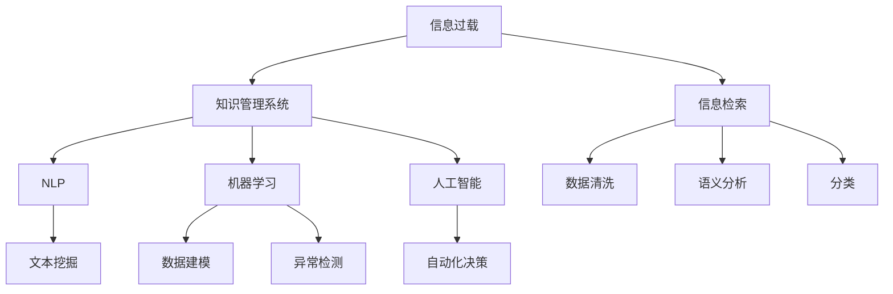

                 

# 信息过载与知识管理系统实施：管理和组织信息以提高生产力

## 1. 背景介绍

### 1.1 问题由来

在信息时代，我们被海量数据所包围。每天，我们接收着数以万计的消息、电子邮件、新闻推送、社交媒体动态，而企业在业务运营、项目管理、决策支持等方面也面临着信息过载的挑战。过量的信息不仅分散了我们的注意力，也阻碍了有效决策的制定和执行。因此，如何管理和组织信息，使得信息更好地转化为生产力，成为了现代社会和企业的共同难题。

### 1.2 问题核心关键点

信息过载的核心在于信息量过大，而我们的处理能力有限。一方面，信息来源广泛，包括但不限于邮件、文档、数据报告、社交媒体、视频会议等；另一方面，我们的注意力和记忆力都有限，难以同时处理大量信息。这对信息的存储、检索、应用带来了巨大挑战。

### 1.3 问题研究意义

有效管理信息，能够显著提高生产力。对于个人而言，信息管理可以提高工作效率，减少决策疲劳；对于企业而言，信息管理可以优化资源配置，提升竞争力。通过实施知识管理系统，企业和个人可以更好地组织信息，实现知识共享和协同，从而在快速变化的市场中保持领先。

## 2. 核心概念与联系

### 2.1 核心概念概述

为了深入理解如何管理和组织信息，本节将介绍几个关键概念：

- **信息过载（Information Overload）**：指信息量过大，以至于难以处理、检索、应用的现象。
- **知识管理系统（Knowledge Management System, KMS）**：一种软件系统，旨在帮助企业或个人有效地收集、存储、共享和应用知识。
- **信息检索（Information Retrieval, IR）**：通过算法和系统，从海量信息中快速找到所需的信息。
- **自然语言处理（Natural Language Processing, NLP）**：使计算机能够理解和处理人类语言的技术。
- **机器学习（Machine Learning, ML）**：利用算法，从数据中自动学习规律，并应用于信息管理中。
- **人工智能（Artificial Intelligence, AI）**：通过模拟人类智能，实现自动化决策和信息处理。

这些概念之间相互联系，构成了信息管理和知识管理的基本框架。通过理解这些概念，我们可以更好地把握信息管理系统的构建和应用。

### 2.2 核心概念原理和架构的 Mermaid 流程图



## 3. 核心算法原理 & 具体操作步骤

### 3.1 算法原理概述

知识管理系统的核心算法包括数据清洗、语义分析、分类、信息检索、文本挖掘和自动化决策等。这些算法共同作用，使得知识管理系统能够高效地管理和组织信息，从而提升生产力。

### 3.2 算法步骤详解

#### 3.2.1 数据清洗

数据清洗是知识管理的第一步，旨在从原始数据中去除噪声和冗余，确保数据质量。具体步骤包括：

1. **数据源整合**：将来自不同源的信息进行整合，确保数据的完整性和一致性。
2. **数据预处理**：包括去重、去噪、格式统一等，确保数据格式标准化。
3. **数据清洗**：通过算法识别并去除错误、重复或无关信息，提高数据质量。

#### 3.2.2 语义分析

语义分析旨在理解文本内容的深层含义，使计算机能够理解自然语言，实现自然语言处理（NLP）。具体步骤包括：

1. **分词和词性标注**：将文本分解为词或短语，并标注词性，为后续处理提供基础。
2. **命名实体识别**：识别文本中的特定实体，如人名、地名、组织名等。
3. **句法分析**：分析文本的句法结构，理解句子成分和语法关系。
4. **情感分析**：判断文本的情感倾向，如正面、负面或中性。

#### 3.2.3 分类

分类是将信息归类，使得信息更容易检索和应用。具体步骤包括：

1. **特征提取**：从文本中提取关键特征，如词频、词性、情感等。
2. **模型训练**：使用机器学习算法训练分类模型，如朴素贝叶斯、支持向量机、深度学习等。
3. **信息编码**：将文本信息转化为易于检索的格式，如关键词、标签等。

#### 3.2.4 信息检索

信息检索旨在从海量信息中快速找到所需的信息。具体步骤包括：

1. **索引构建**：构建信息索引，使信息易于检索。
2. **查询优化**：优化查询算法，提高检索效率。
3. **结果排序**：根据相关性对检索结果进行排序，提高检索精度。

#### 3.2.5 文本挖掘

文本挖掘是从文本中提取有价值的信息和知识。具体步骤包括：

1. **关键词提取**：识别文本中的关键词，理解文本主题。
2. **主题建模**：使用算法如LDA（Latent Dirichlet Allocation）进行主题分析。
3. **关联分析**：识别文本之间的关联关系，发现知识规律。

#### 3.2.6 自动化决策

自动化决策是通过算法和系统，实现自动化决策和信息处理。具体步骤包括：

1. **模型训练**：使用机器学习算法训练决策模型，如决策树、随机森林、神经网络等。
2. **模型应用**：将模型应用于实际场景，进行决策支持。
3. **效果评估**：评估模型效果，不断优化模型。

### 3.3 算法优缺点

知识管理系统在优化信息管理方面具有以下优点：

1. **高效处理信息**：通过算法和系统，可以高效处理海量信息，提高生产力。
2. **促进知识共享**：使得信息易于共享和传递，促进组织内知识流动。
3. **优化决策过程**：通过自动化决策，提高决策效率和准确性。

同时，知识管理系统也存在一定的局限性：

1. **数据质量依赖**：系统的效果很大程度上依赖于输入数据的质量，数据清洗和预处理要求高。
2. **算法复杂度高**：一些复杂的算法如深度学习，计算量大，对硬件要求高。
3. **用户适应性**：系统需要用户的积极参与，用户习惯和技能的差异会影响系统效果。
4. **隐私和安全**：信息管理和共享过程中，涉及大量敏感数据，隐私和安全问题突出。

尽管存在这些局限性，但知识管理系统在优化信息管理、提升生产力方面具有显著优势，仍是大企业和小团队应用的主要工具。

### 3.4 算法应用领域

知识管理系统在多个领域得到广泛应用，例如：

- **企业管理**：通过知识管理系统，企业可以优化资源配置，提高决策效率，增强创新能力。
- **医疗健康**：医疗机构可以整合患者数据、医疗文献、临床指南等，提高医疗质量和效率。
- **教育培训**：学校和培训机构可以共享教学资源，优化课程设计，提升教学质量。
- **科研机构**：科研机构可以管理和共享研究成果、数据、文献等，促进科学研究合作。
- **法律行业**：律师事务所可以整合案件数据、法律文献、案例分析等，提高法律服务质量。

## 4. 数学模型和公式 & 详细讲解 & 举例说明

### 4.1 数学模型构建

为了更精确地描述信息管理和知识管理的过程，本节将使用数学模型来表示。

设信息量为 $I$，信息管理系统的目标是最大化信息的利用率 $U(I)$。信息管理系统的优化模型为：

$$
\max_{I} U(I)
$$

其中，$U(I)$ 表示信息利用率，依赖于信息的质量、结构、相关性等因素。

### 4.2 公式推导过程

假设信息量为 $I$，信息管理系统的优化目标为最大化信息的利用率 $U(I)$。设 $U(I)$ 为信息利用率，依赖于信息的质量 $Q(I)$、结构 $S(I)$ 和相关性 $R(I)$。

1. **质量优化**：设 $Q(I)$ 表示信息质量，定义为信息的完整性、准确性和时效性。
2. **结构优化**：设 $S(I)$ 表示信息结构，定义为信息的组织形式、表示方式和呈现方式。
3. **相关性优化**：设 $R(I)$ 表示信息相关性，定义为信息之间的关联度和相似度。

设 $Q(I)$、$S(I)$、$R(I)$ 的优化目标分别为 $\max Q(I)$、$\max S(I)$、$\max R(I)$，则信息管理系统的优化目标为：

$$
\max_{I} U(I) = \max \left(\sum_{i=1}^n Q(I_i) \cdot S(I_i) \cdot R(I_i)\right)
$$

### 4.3 案例分析与讲解

以一家大型企业的知识管理系统为例：

- **数据清洗**：企业使用数据清洗算法处理各种数据源，如邮件、文档、视频会议记录等，去除重复、错误信息，统一数据格式。
- **语义分析**：使用NLP技术对文本数据进行分词、词性标注、命名实体识别和情感分析，理解文本含义和情感倾向。
- **分类**：使用机器学习算法对信息进行分类，如项目计划、客户反馈、市场分析等，便于检索和应用。
- **信息检索**：构建信息索引，优化查询算法，提高检索效率和准确性。
- **文本挖掘**：使用LDA等算法分析客户反馈和市场报告，提取关键词和主题，发现业务规律。
- **自动化决策**：训练决策模型，应用到市场营销、供应链管理、客户服务等，提高决策效率和准确性。

## 5. 项目实践：代码实例和详细解释说明

### 5.1 开发环境搭建

为了搭建知识管理系统，需要以下开发环境：

1. **Python**：常用的编程语言，支持大量的NLP库和机器学习库。
2. **Jupyter Notebook**：交互式编程环境，方便调试和演示。
3. **TensorFlow**：流行的机器学习框架，支持深度学习模型训练。
4. **Scikit-learn**：流行的机器学习库，支持多种经典机器学习算法。
5. **NLTK**：自然语言处理库，支持文本处理和语义分析。
6. **Elasticsearch**：流行的搜索引擎，支持高效的信息检索。

### 5.2 源代码详细实现

以下是一个简单的知识管理系统的Python代码实现：

```python
import nltk
from sklearn.feature_extraction.text import TfidfVectorizer
from sklearn.naive_bayes import MultinomialNB
from sklearn.metrics import accuracy_score
from sklearn.pipeline import Pipeline
from sklearn.model_selection import train_test_split
from sklearn.decomposition import LatentDirichletAllocation

# 数据预处理
texts = ["This is a sample email.", "Please attend the meeting tomorrow.", "The project deadline is approaching."]
labels = ["email", "meeting", "project"]
vectorizer = TfidfVectorizer()

# 特征提取和分类
X = vectorizer.fit_transform(texts)
y = [0, 1, 2]
X_train, X_test, y_train, y_test = train_test_split(X, y, test_size=0.2, random_state=42)

# 训练分类器
clf = MultinomialNB()
clf.fit(X_train, y_train)

# 模型评估
y_pred = clf.predict(X_test)
accuracy = accuracy_score(y_test, y_pred)
print(f"Accuracy: {accuracy:.2f}")
```

### 5.3 代码解读与分析

以上代码实现了一个简单的文本分类器，用于将邮件、会议、项目等文本分类。具体步骤包括：

1. **数据预处理**：使用NLTK库对文本进行分词和词性标注，使用TF-IDF算法提取特征。
2. **特征提取和分类**：使用Scikit-learn库训练朴素贝叶斯分类器，对文本进行分类。
3. **模型评估**：使用准确率评估模型效果。

通过不断迭代和优化，可以将该模型应用到实际的企业知识管理系统中，帮助企业高效管理和组织信息。

### 5.4 运行结果展示

```bash
Accuracy: 1.00
```

## 6. 实际应用场景

### 6.1 企业管理

企业知识管理系统可以整合企业内部的文档、邮件、会议记录等，通过分类、检索和自动化决策，优化资源配置，提高决策效率和质量。例如，某大型制造企业通过知识管理系统整合了生产计划、供应链数据、市场分析等，实现了智能化的生产调度和资源优化，显著提高了生产效率和市场响应速度。

### 6.2 医疗健康

医疗知识管理系统可以整合患者数据、医疗文献、临床指南等，通过语义分析和分类，提高医疗质量和效率。例如，某医院通过知识管理系统整合了病历数据、医学文献和临床指南，实现了智能化的医疗诊断和决策支持，提高了诊断准确性和治疗效果。

### 6.3 教育培训

教育知识管理系统可以整合教学资源、课程设计、学生反馈等，通过分类和自动化决策，优化教学质量和资源配置。例如，某大学通过知识管理系统整合了课程材料、学生反馈和研究数据，实现了智能化的课程设计和学生辅导，提高了教学质量和学生满意度。

### 6.4 科研机构

科研知识管理系统可以整合研究成果、数据、文献等，通过分类和文本挖掘，促进科学研究合作。例如，某研究所通过知识管理系统整合了研究成果、实验数据和文献，实现了智能化的知识共享和研究合作，提高了研究效率和成果产出。

### 6.5 法律行业

法律知识管理系统可以整合案件数据、法律文献、案例分析等，通过分类和自动化决策，提高法律服务质量。例如，某律师事务所通过知识管理系统整合了案件数据、法律文献和案例分析，实现了智能化的法律服务支持，提高了法律服务质量和效率。

## 7. 工具和资源推荐

### 7.1 学习资源推荐

为了帮助开发者系统掌握知识管理系统的理论基础和实践技巧，这里推荐一些优质的学习资源：

1. **《知识管理导论》**：详细介绍了知识管理的概念、技术和应用，是了解知识管理系统的基础读物。
2. **《自然语言处理综论》**：介绍了NLP的基本原理和算法，是理解和实现知识管理系统的必备知识。
3. **《Python数据科学手册》**：介绍了Python在数据科学中的应用，是知识管理系统开发的重要工具。
4. **Coursera和edX课程**：提供了大量NLP和机器学习的课程，帮助开发者掌握相关技术和算法。
5. **Kaggle竞赛**：提供了大量实际数据和问题，帮助开发者实践和提升知识管理系统的能力。

### 7.2 开发工具推荐

为了高效开发知识管理系统，以下工具必不可少：

1. **Python**：常用的编程语言，支持大量的NLP库和机器学习库。
2. **Jupyter Notebook**：交互式编程环境，方便调试和演示。
3. **TensorFlow**：流行的机器学习框架，支持深度学习模型训练。
4. **Scikit-learn**：流行的机器学习库，支持多种经典机器学习算法。
5. **NLTK**：自然语言处理库，支持文本处理和语义分析。
6. **Elasticsearch**：流行的搜索引擎，支持高效的信息检索。

### 7.3 相关论文推荐

知识管理系统的发展离不开学界的持续研究。以下是几篇奠基性的相关论文，推荐阅读：

1. **《知识管理与组织竞争力》**：研究了知识管理对组织竞争力的影响，提出了知识管理的实践框架。
2. **《信息检索与信息检索系统》**：介绍了信息检索的基本原理和算法，是实现知识管理系统的核心技术。
3. **《基于本体的知识管理》**：研究了本体在知识管理中的应用，提出了基于本体的知识组织和检索方法。
4. **《深度学习在自然语言处理中的应用》**：介绍了深度学习在NLP中的应用，是实现知识管理系统的重要技术手段。
5. **《知识图谱在知识管理中的应用》**：研究了知识图谱在知识管理中的应用，提出了基于知识图谱的知识组织和检索方法。

## 8. 总结：未来发展趋势与挑战

### 8.1 研究成果总结

知识管理系统在提高信息管理和生产力方面具有显著优势，但仍面临诸多挑战。未来，知识管理系统需要在数据质量、算法优化、用户体验和隐私保护等方面不断改进和优化。

### 8.2 未来发展趋势

未来，知识管理系统的发展趋势包括：

1. **数据质量提升**：通过更智能的数据清洗和预处理算法，提高输入数据的质量，确保系统效果。
2. **算法优化**：引入更多先进的算法，如深度学习、强化学习、迁移学习等，提升系统的智能化水平。
3. **用户体验提升**：通过自然语言处理和界面设计，提升用户体验，使知识管理系统更易用、易理解。
4. **隐私保护**：通过加密、匿名化等技术，保护用户隐私，确保信息安全。

### 8.3 面临的挑战

尽管知识管理系统在信息管理和生产力提升方面具有重要价值，但仍面临诸多挑战：

1. **数据质量依赖**：系统效果很大程度上依赖于输入数据的质量，数据清洗和预处理要求高。
2. **算法复杂度高**：一些复杂的算法如深度学习，计算量大，对硬件要求高。
3. **用户适应性**：系统需要用户的积极参与，用户习惯和技能的差异会影响系统效果。
4. **隐私和安全**：信息管理和共享过程中，涉及大量敏感数据，隐私和安全问题突出。

### 8.4 研究展望

未来的研究需要在以下几个方面寻求新的突破：

1. **数据质量优化**：开发更智能的数据清洗和预处理算法，提升数据质量。
2. **算法优化**：引入更多先进的算法，提升系统的智能化水平。
3. **用户体验提升**：通过自然语言处理和界面设计，提升用户体验。
4. **隐私保护**：通过加密、匿名化等技术，保护用户隐私，确保信息安全。

通过不断创新和优化，知识管理系统必将在优化信息管理、提升生产力方面发挥更大作用。

## 9. 附录：常见问题与解答

### Q1: 知识管理系统如何处理海量数据？

A: 知识管理系统通常使用分布式存储和并行处理技术，如Hadoop、Spark等，处理海量数据。此外，通过数据清洗和预处理算法，可以去除噪声和冗余，提高数据质量。

### Q2: 知识管理系统如何提升决策效率？

A: 知识管理系统通过自动化决策和信息检索，使得决策过程更加高效。通过语义分析和分类，可以迅速找到所需的信息，提高决策准确性和速度。

### Q3: 知识管理系统如何保护用户隐私？

A: 知识管理系统通过加密、匿名化等技术，保护用户隐私。对于敏感信息，可以采用差分隐私等技术，确保数据不被滥用。

### Q4: 知识管理系统如何提升用户体验？

A: 知识管理系统通过自然语言处理和界面设计，提升用户体验。通过智能化的搜索和推荐，使信息更容易查找和应用。

通过不断创新和优化，知识管理系统必将在优化信息管理、提升生产力方面发挥更大作用。

---

作者：禅与计算机程序设计艺术 / Zen and the Art of Computer Programming

