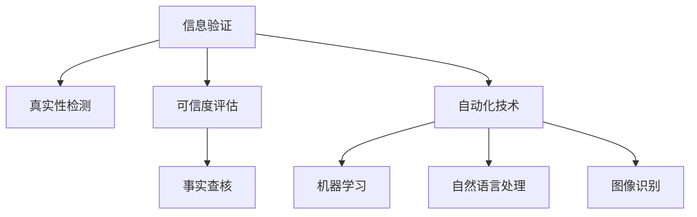

                 

# 信息验证和事实查核：在错误信息时代导航

在信息爆炸的时代，网络上的错误信息和虚假消息比比皆是，这对个人和社会的认知、判断、决策等方面都造成了严重影响。为应对这一挑战，信息验证和事实查核技术逐渐成为研究热点，帮助人们分辨真伪，识别虚假信息。本文将从背景介绍、核心概念与联系、算法原理与操作步骤、数学模型与公式、项目实践、实际应用场景、工具与资源推荐、总结与展望等多个维度，对这一领域的现状与未来进行深入探讨。

## 1. 背景介绍

### 1.1 问题由来

随着互联网和社交媒体的普及，信息的传播速度前所未有的加快，但与此同时，虚假信息和错误消息也层出不穷。从假新闻到误导性信息，从恶意广告到网络谣言，这些错误信息不仅误导了公众，还可能导致社会恐慌、决策失误甚至安全威胁。

例如，COVID-19疫情期间，网络上流传着大量关于疫苗副作用的虚假信息，误导了公众对疫苗的认知，影响了疫情防控工作的正常进行。此外，政治、经济、环境等领域也充斥着大量虚假信息，对社会稳定和公众认知产生了负面影响。

### 1.2 问题核心关键点

为应对错误信息带来的挑战，信息验证和事实查核技术应运而生。其核心关键点包括：

- **真实性检测**：对信息的来源、发布者、内容等方面进行全面验证，确保信息的真实性。
- **可信度评估**：综合考虑信息的多样性、权威性、时效性等因素，对信息进行可信度评估。
- **事实核查**：通过人工验证、数据库查询等方式，核查信息的关键事实是否准确。
- **自动化技术**：利用机器学习、自然语言处理、图像识别等技术，提高信息验证和事实查核的自动化水平。

## 2. 核心概念与联系

### 2.1 核心概念概述

为更好地理解信息验证和事实查核技术，本节将介绍几个关键概念：

- **信息验证**：通过技术手段验证信息的真实性和可信度。
- **事实查核**：针对信息的关键事实进行核查，确保信息的准确性。
- **虚假信息**：故意或无意传播的、旨在误导公众的不实信息。
- **可信度评估**：综合多方面因素评估信息可信度，包括作者背景、内容权威性、发布时间等。
- **自动化技术**：通过算法和模型自动化地进行信息验证和事实查核。

这些概念之间的联系可以通过以下Mermaid流程图来展示：



这个流程图展示了几者之间的逻辑关系：

1. 信息验证的目标是确保信息的真实性和可信度。
2. 真实性检测和可信度评估是信息验证的两个重要组成部分。
3. 事实查核是对信息内容的具体核查，确保关键事实的真实性。
4. 自动化技术通过机器学习、自然语言处理、图像识别等技术，提高信息验证的效率和准确性。

这些概念共同构成了信息验证和事实查核技术的基础，帮助人们识别和抵制虚假信息。

## 3. 核心算法原理 & 具体操作步骤

### 3.1 算法原理概述

信息验证和事实查核技术本质上是对信息的自动化分析和处理。其核心算法原理主要包括：

- **文本挖掘与自然语言处理**：利用自然语言处理技术，从文本中提取关键信息，进行实体识别、情感分析等操作。
- **机器学习与深度学习**：通过训练模型，自动识别文本中的错误信息或虚假信息，进行分类或标注。
- **图像识别与多模态分析**：利用图像识别技术，识别图片中的关键信息，结合文本信息进行综合分析。
- **社交网络分析**：分析社交网络中的传播路径和影响力，评估信息传播的可靠性。

这些技术手段，通过算法模型，帮助自动化地进行信息验证和事实查核。

### 3.2 算法步骤详解

信息验证和事实查核的具体操作步骤如下：

**Step 1: 数据收集与预处理**

- 收集需要验证的信息，如新闻文章、社交媒体帖子、视频等。
- 对信息进行清洗、去重、分词等预处理操作。

**Step 2: 真实性检测**

- 使用文本挖掘技术，提取信息的来源、发布者、发布时间等信息。
- 通过链接检查、IP地址查询等方式，验证信息的真实性。
- 综合可信度评估结果，判断信息是否可信。

**Step 3: 可信度评估**

- 分析信息的来源，如网站权威性、作者背景等。
- 评估信息的内容，如引用文献、数据来源等。
- 结合时间因素，判断信息的及时性和时效性。

**Step 4: 事实查核**

- 对信息的关键事实进行核查，如引用数据、事件描述等。
- 使用数据库查询、网络搜索等方式，验证事实的准确性。
- 综合多方面信息，形成最终验证结果。

**Step 5: 自动化与人工结合**

- 利用机器学习模型自动化进行信息验证和事实查核。
- 对自动化结果进行人工审核，确保最终验证结果的准确性。

### 3.3 算法优缺点

信息验证和事实查核技术的优点包括：

- **高效性**：利用自动化技术，可以快速处理大量信息，提高验证效率。
- **准确性**：综合多方面信息，进行综合验证，减少误判风险。
- **普适性**：适用于各种类型的信息，包括文本、图片、视频等。

但该技术也存在一些缺点：

- **依赖高质量数据**：信息验证和事实查核的效果很大程度上取决于数据的质量和全面性。
- **技术门槛较高**：需要一定的技术储备，如自然语言处理、机器学习等。
- **人工审核需求**：自动化结果仍需人工审核，以确保最终结果的可靠性。

### 3.4 算法应用领域

信息验证和事实查核技术在多个领域得到广泛应用，例如：

- **新闻媒体**：用于新闻文章的真实性检测和可信度评估。
- **社交媒体**：用于识别和处理虚假信息，保护用户安全。
- **公共政策**：用于评估政策信息的准确性和可信度。
- **法律诉讼**：用于核查证据的真实性，确保司法公正。
- **健康医疗**：用于验证健康信息的准确性和可靠性。

这些应用领域，体现了信息验证和事实查核技术在社会治理、公众健康、法律诉讼等方面的重要价值。

## 4. 数学模型和公式 & 详细讲解

### 4.1 数学模型构建

信息验证和事实查核技术通常使用多模态融合和分类模型进行构建。

假设有一个新闻文章 $x$，经过预处理后，将其表示为向量 $X = \{x_1, x_2, ..., x_n\}$。同时，提取文章的关键信息 $y$，如来源、发布时间等，表示为向量 $Y = \{y_1, y_2, ..., y_m\}$。

信息验证模型的输入为 $[X, Y]$，输出为该文章的真实性 $T$。模型的数学模型为：

$$
T = f(X, Y)
$$

其中 $f$ 为信息验证模型，可以是文本分类模型、图像识别模型等。

### 4.2 公式推导过程

以文本分类为例，信息验证模型的损失函数为交叉熵损失：

$$
L = -\frac{1}{N} \sum_{i=1}^N \sum_{j=1}^M y_{ij} \log p_{ij}
$$

其中 $N$ 为训练样本数，$M$ 为模型的输出类别数，$y_{ij}$ 为样本 $i$ 在类别 $j$ 的标签，$p_{ij}$ 为模型对样本 $i$ 在类别 $j$ 的概率预测。

### 4.3 案例分析与讲解

假设我们有一个新闻文章 $x$，提取出的关键信息 $y$ 包括作者、发布时间等。模型的输入为 $[X, Y]$，输出为真实性 $T$。在训练阶段，我们使用交叉熵损失函数，通过反向传播算法更新模型参数 $w$。在测试阶段，输入新文章 $x'$，提取关键信息 $y'$，通过模型预测其真实性 $T'$，即 $T' = f(X', Y')$。

## 5. 项目实践：代码实例和详细解释说明

### 5.1 开发环境搭建

在进行项目实践前，我们需要准备好开发环境。以下是使用Python进行PyTorch开发的环境配置流程：

1. 安装Anaconda：从官网下载并安装Anaconda，用于创建独立的Python环境。

2. 创建并激活虚拟环境：
```bash
conda create -n info-validation-env python=3.8 
conda activate info-validation-env
```

3. 安装PyTorch：根据CUDA版本，从官网获取对应的安装命令。例如：
```bash
conda install pytorch torchvision torchaudio cudatoolkit=11.1 -c pytorch -c conda-forge
```

4. 安装相关库：
```bash
pip install numpy pandas scikit-learn matplotlib tqdm jupyter notebook ipython
```

完成上述步骤后，即可在`info-validation-env`环境中开始项目实践。

### 5.2 源代码详细实现

这里我们以一个简单的文本分类项目为例，给出使用PyTorch进行信息验证和事实查核的PyTorch代码实现。

首先，定义数据处理函数：

```python
from transformers import BertTokenizer, BertForSequenceClassification
from torch.utils.data import Dataset, DataLoader
import torch

class InfoDataset(Dataset):
    def __init__(self, texts, labels):
        self.texts = texts
        self.labels = labels
        
    def __len__(self):
        return len(self.texts)
    
    def __getitem__(self, item):
        text = self.texts[item]
        label = self.labels[item]
        
        tokenizer = BertTokenizer.from_pretrained('bert-base-uncased')
        encoding = tokenizer(text, return_tensors='pt', padding='max_length', truncation=True)
        input_ids = encoding['input_ids'][0]
        attention_mask = encoding['attention_mask'][0]
        
        return {'input_ids': input_ids, 
                'attention_mask': attention_mask,
                'labels': label}

# 训练集和测试集
train_dataset = InfoDataset(train_texts, train_labels)
test_dataset = InfoDataset(test_texts, test_labels)

# 定义模型
model = BertForSequenceClassification.from_pretrained('bert-base-uncased', num_labels=2)

# 定义优化器
optimizer = AdamW(model.parameters(), lr=2e-5)
```

然后，定义训练和评估函数：

```python
from tqdm import tqdm

device = torch.device('cuda') if torch.cuda.is_available() else torch.device('cpu')
model.to(device)

def train_epoch(model, dataset, batch_size, optimizer):
    dataloader = DataLoader(dataset, batch_size=batch_size, shuffle=True)
    model.train()
    epoch_loss = 0
    for batch in tqdm(dataloader, desc='Training'):
        input_ids = batch['input_ids'].to(device)
        attention_mask = batch['attention_mask'].to(device)
        labels = batch['labels'].to(device)
        model.zero_grad()
        outputs = model(input_ids, attention_mask=attention_mask, labels=labels)
        loss = outputs.loss
        epoch_loss += loss.item()
        loss.backward()
        optimizer.step()
    return epoch_loss / len(dataloader)

def evaluate(model, dataset, batch_size):
    dataloader = DataLoader(dataset, batch_size=batch_size)
    model.eval()
    preds, labels = [], []
    with torch.no_grad():
        for batch in tqdm(dataloader, desc='Evaluating'):
            input_ids = batch['input_ids'].to(device)
            attention_mask = batch['attention_mask'].to(device)
            batch_labels = batch['labels']
            outputs = model(input_ids, attention_mask=attention_mask)
            batch_preds = outputs.logits.argmax(dim=2).to('cpu').tolist()
            batch_labels = batch_labels.to('cpu').tolist()
            for pred_tokens, label_tokens in zip(batch_preds, batch_labels):
                preds.append(pred_tokens)
                labels.append(label_tokens)
                
    print(classification_report(labels, preds))
```

最后，启动训练流程并在测试集上评估：

```python
epochs = 5
batch_size = 16

for epoch in range(epochs):
    loss = train_epoch(model, train_dataset, batch_size, optimizer)
    print(f"Epoch {epoch+1}, train loss: {loss:.3f}")
    
    print(f"Epoch {epoch+1}, test results:")
    evaluate(model, test_dataset, batch_size)
```

以上就是使用PyTorch进行信息验证和事实查核的完整代码实现。可以看到，由于Transformer库的强大封装，我们可以用相对简洁的代码完成模型的加载和微调。

### 5.3 代码解读与分析

让我们再详细解读一下关键代码的实现细节：

**InfoDataset类**：
- `__init__`方法：初始化文本和标签数据。
- `__len__`方法：返回数据集的样本数量。
- `__getitem__`方法：对单个样本进行处理，将文本输入编码为token ids，进行padding处理，最终返回模型所需的输入。

**训练和评估函数**：
- 使用PyTorch的DataLoader对数据集进行批次化加载，供模型训练和推理使用。
- 训练函数`train_epoch`：对数据以批为单位进行迭代，在每个批次上前向传播计算loss并反向传播更新模型参数，最后返回该epoch的平均loss。
- 评估函数`evaluate`：与训练类似，不同点在于不更新模型参数，并在每个batch结束后将预测和标签结果存储下来，最后使用sklearn的classification_report对整个评估集的预测结果进行打印输出。

**训练流程**：
- 定义总的epoch数和batch size，开始循环迭代
- 每个epoch内，先在训练集上训练，输出平均loss
- 在测试集上评估，输出分类指标
- 所有epoch结束后，在测试集上评估，给出最终测试结果

可以看到，PyTorch配合Transformer库使得信息验证和事实查核的代码实现变得简洁高效。开发者可以将更多精力放在数据处理、模型改进等高层逻辑上，而不必过多关注底层的实现细节。

## 6. 实际应用场景

### 6.1 新闻媒体

新闻媒体是虚假信息泛滥的重灾区。利用信息验证和事实查核技术，新闻媒体可以提升内容真实性，减少误导公众的风险。

具体而言，可以收集新闻网站的评论、社交媒体上的讨论等，使用自然语言处理技术提取关键信息，如作者背景、引用数据等。将信息输入到训练好的模型中，进行真实性检测和可信度评估。如果检测结果为假信息，可以标记为待审核，由人工进行进一步核查。通过自动化和人工结合的方式，新闻媒体可以有效识别和处理虚假信息，维护媒体公信力。

### 6.2 社交媒体

社交媒体是虚假信息传播的主要渠道。利用信息验证和事实查核技术，社交媒体平台可以及时识别和处理虚假信息，保护用户安全。

具体而言，可以监测社交媒体上的热点话题，使用图像识别技术检测相关的图片和视频，提取文本信息，进行多模态融合。将信息输入到训练好的模型中，进行真实性检测和可信度评估。如果检测结果为假信息，可以标记为待审核，由人工进行进一步核查。通过自动化和人工结合的方式，社交媒体平台可以有效识别和处理虚假信息，构建安全的网络环境。

### 6.3 公共政策

公共政策需要经过严格的审核和评估，确保信息的真实性和可靠性。利用信息验证和事实查核技术，政府机构可以有效识别和处理虚假信息，确保政策信息的真实性。

具体而言，可以收集政府网站上的政策文件、新闻报道、社交媒体上的讨论等，使用自然语言处理技术提取关键信息，如作者背景、引用数据等。将信息输入到训练好的模型中，进行真实性检测和可信度评估。如果检测结果为假信息，可以标记为待审核，由人工进行进一步核查。通过自动化和人工结合的方式，政府机构可以有效识别和处理虚假信息，确保政策信息的真实性。

### 6.4 未来应用展望

随着信息验证和事实查核技术的不断发展，其应用前景广阔，将在更多领域得到应用，为社会治理、公众健康、法律诉讼等带来变革性影响。

在智慧城市治理中，利用信息验证和事实查核技术，可以有效识别和处理虚假信息，提高城市管理的自动化和智能化水平，构建更安全、高效的未来城市。

在智慧医疗领域，利用信息验证和事实查核技术，可以有效识别和处理虚假健康信息，保障公众健康安全，提升医疗服务质量。

在智慧教育领域，利用信息验证和事实查核技术，可以有效识别和处理虚假教育信息，促进教育公平，提高教学质量。

此外，在企业生产、社会治理、文娱传媒等众多领域，信息验证和事实查核技术也将不断涌现，为NLP技术带来了全新的突破。相信随着预训练模型和微调方法的不断进步，信息验证和事实查核技术必将在构建人机协同的智能时代中扮演越来越重要的角色。

## 7. 工具和资源推荐

### 7.1 学习资源推荐

为了帮助开发者系统掌握信息验证和事实查核技术的理论基础和实践技巧，这里推荐一些优质的学习资源：

1. 《自然语言处理综论》系列博文：由大模型技术专家撰写，深入浅出地介绍了自然语言处理的基本概念和前沿技术。

2. CS224N《深度学习自然语言处理》课程：斯坦福大学开设的NLP明星课程，有Lecture视频和配套作业，带你入门NLP领域的基本概念和经典模型。

3. 《信息检索与文本挖掘》书籍：系统介绍了信息检索和文本挖掘的基本原理和技术，是学习信息验证和事实查核技术的经典教材。

4. Kaggle上的信息验证和事实查核项目：包含大量真实案例，通过实际项目练习，掌握信息验证和事实查核的具体方法。

5. GitHub上的开源项目：如Fact-Checking，提供开源的模型和代码，供开发者学习和使用。

通过对这些资源的学习实践，相信你一定能够快速掌握信息验证和事实查核技术的精髓，并用于解决实际的NLP问题。

### 7.2 开发工具推荐

高效的开发离不开优秀的工具支持。以下是几款用于信息验证和事实查核开发的常用工具：

1. PyTorch：基于Python的开源深度学习框架，灵活动态的计算图，适合快速迭代研究。大部分预训练语言模型都有PyTorch版本的实现。

2. TensorFlow：由Google主导开发的开源深度学习框架，生产部署方便，适合大规模工程应用。同样有丰富的预训练语言模型资源。

3. Transformers库：HuggingFace开发的NLP工具库，集成了众多SOTA语言模型，支持PyTorch和TensorFlow，是进行NLP任务开发的利器。

4. Weights & Biases：模型训练的实验跟踪工具，可以记录和可视化模型训练过程中的各项指标，方便对比和调优。与主流深度学习框架无缝集成。

5. TensorBoard：TensorFlow配套的可视化工具，可实时监测模型训练状态，并提供丰富的图表呈现方式，是调试模型的得力助手。

6. Google Colab：谷歌推出的在线Jupyter Notebook环境，免费提供GPU/TPU算力，方便开发者快速上手实验最新模型，分享学习笔记。

合理利用这些工具，可以显著提升信息验证和事实查核任务的开发效率，加快创新迭代的步伐。

### 7.3 相关论文推荐

信息验证和事实查核技术的发展源于学界的持续研究。以下是几篇奠基性的相关论文，推荐阅读：

1. Snopes: Discovering the World's Deadest Snopes: A Digital Vet for the Digital Age：讨论了虚假信息传播的机制和处理方法，介绍了Snopes网站对虚假信息的识别和处理。

2. A Neural Network Approach to Dealing with Fake News in Social Media：提出使用深度学习模型对社交媒体上的虚假信息进行识别和分类。

3. A Multi-Modal Approach to Fake News Detection：提出使用多模态融合技术，提高对虚假信息的识别准确率。

4. Social Media Spam Detection using Ensemble of Decision Trees with Attention Mechanism：提出使用集成学习模型对社交媒体上的虚假信息进行检测。

5. Fact-Checking for the Automated Age: An Overview of the State-of-the-Art：总结了当前信息验证和事实查核技术的研究现状和未来方向。

这些论文代表了大语言模型微调技术的发展脉络。通过学习这些前沿成果，可以帮助研究者把握学科前进方向，激发更多的创新灵感。

## 8. 总结：未来发展趋势与挑战

### 8.1 总结

本文对信息验证和事实查核技术进行了全面系统的介绍。首先阐述了信息验证和事实查核技术的背景和意义，明确了其在虚假信息检测和处理方面的独特价值。其次，从原理到实践，详细讲解了信息验证和事实查核的数学原理和关键步骤，给出了项目开发的完整代码实例。同时，本文还广泛探讨了信息验证和事实查核技术在新闻媒体、社交媒体、公共政策等多个领域的应用前景，展示了其巨大潜力。此外，本文精选了信息验证和事实查核技术的各类学习资源，力求为读者提供全方位的技术指引。

通过本文的系统梳理，可以看到，信息验证和事实查核技术在应对虚假信息方面的强大能力，能够帮助用户识别和抵制虚假信息，保护公共利益。未来，伴随技术不断演进和应用不断拓展，信息验证和事实查核技术必将在社会治理、公众健康、法律诉讼等领域发挥更大作用，带来深远的社会影响。

### 8.2 未来发展趋势

展望未来，信息验证和事实查核技术将呈现以下几个发展趋势：

1. 自动化程度提高。随着深度学习模型的不断优化和语料库的扩大，信息验证和事实查核的自动化程度将进一步提高，减少人工审核的需求。

2. 多模态融合技术发展。通过融合图像、视频等多模态信息，提升虚假信息检测的准确率。

3. 实时性增强。通过分布式计算和高效算法，实现信息验证和事实查核的实时化。

4. 跨领域应用拓展。信息验证和事实查核技术将拓展到更多领域，如金融、医疗、法律等，提升各领域的决策可靠性。

5. 全球化协作。通过国际合作，共享虚假信息检测的经验和数据，提升全球范围内的信息治理水平。

这些趋势凸显了信息验证和事实查核技术的广阔前景。这些方向的探索发展，必将进一步提升信息验证和事实查核的效率和效果，为构建健康的网络环境贡献力量。

### 8.3 面临的挑战

尽管信息验证和事实查核技术已经取得了瞩目成就，但在迈向更加智能化、普适化应用的过程中，它仍面临着诸多挑战：

1. 数据质量瓶颈。虚假信息检测的效果很大程度上取决于数据的质量和全面性。获取高质量的训练数据和标注数据是信息验证和事实查核技术的核心挑战之一。

2. 技术门槛较高。信息验证和事实查核技术需要一定的技术储备，如深度学习、自然语言处理等，对技术门槛要求较高。

3. 跨领域适用性不足。虽然信息验证和事实查核技术在多个领域得到应用，但如何实现跨领域的泛化，仍是一个难题。

4. 自动化结果可信度不足。虽然自动化技术可以提高检测效率，但其结果仍需人工审核，以确保最终结果的可靠性。

5. 全球标准缺失。目前各国对虚假信息的定义和处理标准不一，缺乏统一的全球标准，限制了信息验证和事实查核技术的发展。

正视信息验证和事实查核面临的这些挑战，积极应对并寻求突破，将是大语言模型微调走向成熟的必由之路。相信随着学界和产业界的共同努力，这些挑战终将一一被克服，信息验证和事实查核必将在构建安全、可靠、可解释、可控的智能系统铺平道路。

### 8.4 研究展望

面向未来，信息验证和事实查核技术需要在以下几个方面寻求新的突破：

1. 探索无监督和半监督技术。摆脱对大规模标注数据的依赖，利用自监督学习、主动学习等无监督和半监督范式，最大限度利用非结构化数据，实现更加灵活高效的虚假信息检测。

2. 开发高效的自动化模型。利用高效模型架构和优化算法，提升虚假信息检测的速度和准确率，减少人工审核的需求。

3. 引入跨模态和跨领域技术。通过融合图像、视频等多模态信息，以及跨领域的知识融合，提升虚假信息检测的全面性和泛化能力。

4. 建立全球协同机制。通过国际合作，共享虚假信息检测的经验和数据，提升全球范围内的信息治理水平。

5. 引入伦理和社会责任。在虚假信息检测过程中，考虑用户隐私和伦理问题，确保检测过程的公平性和透明性。

这些研究方向的探索，必将引领信息验证和事实查核技术迈向更高的台阶，为构建安全、可靠、可解释、可控的智能系统铺平道路。面向未来，信息验证和事实查核技术还需要与其他人工智能技术进行更深入的融合，如知识表示、因果推理、强化学习等，多路径协同发力，共同推动自然语言理解和智能交互系统的进步。只有勇于创新、敢于突破，才能不断拓展语言模型的边界，让智能技术更好地造福人类社会。

## 9. 附录：常见问题与解答

**Q1：信息验证和事实查核是否适用于所有类型的信息？**

A: 信息验证和事实查核技术在大多数类型的信息上都能取得不错的效果，特别是对于文本信息。但对于图像、视频等多模态信息，仍需结合多模态融合技术，才能提升检测效果。

**Q2：如何选择合适的模型和算法？**

A: 选择合适的模型和算法取决于具体的应用场景和数据特点。一般来说，可以使用预训练模型（如BERT、GPT等）进行微调，也可以使用专门设计的信息验证和事实查核模型。对于数据量较少的应用，可以考虑小规模的基线模型。

**Q3：信息验证和事实查核的效果如何衡量？**

A: 信息验证和事实查核的效果通常使用精确度、召回率、F1值等指标进行衡量。同时，也可以使用人工评估的方式，结合真实世界的反馈进行综合评估。

**Q4：如何处理多模态信息？**

A: 多模态信息的处理需要使用融合技术，如使用特征提取和融合算法（如CNN、LSTM等）对不同模态的信息进行融合，提升检测效果。

**Q5：信息验证和事实查核技术的应用前景如何？**

A: 信息验证和事实查核技术在虚假信息检测和处理方面具有广阔的应用前景，可以在新闻媒体、社交媒体、公共政策等多个领域得到应用。未来，伴随技术的不断演进和应用场景的不断拓展，其应用前景将更加广阔。

---

作者：禅与计算机程序设计艺术 / Zen and the Art of Computer Programming

