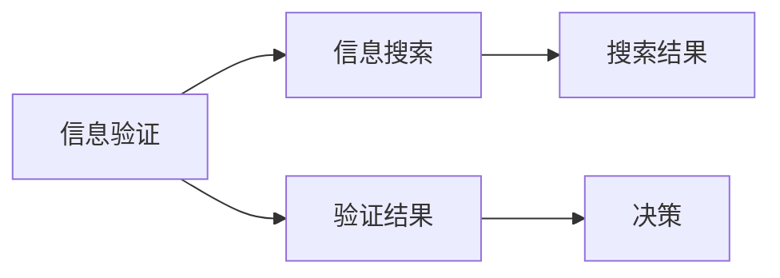

                 

# 信息验证和信息搜索技术实践：在信息海洋中找到可靠、有价值的信息

> 关键词：信息验证,信息搜索,信息海洋,可靠信息,有价值信息,搜索引擎,数据清洗,自然语言处理,机器学习

## 1. 背景介绍

在信息爆炸的时代，人们每天都在产生海量的信息。如何从信息海洋中找到可靠、有价值的信息，成为一个亟待解决的问题。信息验证和信息搜索技术的出现，极大地提升了人们的信息获取效率和质量。本文将系统介绍信息验证和信息搜索的核心概念、算法原理、操作步骤及应用实例，帮助读者掌握相关技术。

## 2. 核心概念与联系

### 2.1 核心概念概述

信息验证（Information Verification）是指通过技术手段验证信息的真实性、准确性和可信度，确保信息来源可靠，避免误导性或虚假信息对决策产生影响。信息搜索（Information Search）则是指使用技术手段快速定位、获取相关信息，以支持用户决策和需求满足。

这两个概念相互关联，信息验证是信息搜索的前提，只有确保信息来源可靠，才能进行有效搜索。同时，信息搜索也有助于信息验证，通过获取多方面信息，可以更全面地验证信息真实性。

以下是一个信息验证和信息搜索的Mermaid流程图，展示了二者之间的联系：



从图中可以看出，信息验证通过多角度验证确保信息真实性，并生成验证结果。信息搜索则基于验证后的信息，进一步获取相关数据，支持决策。

## 3. 核心算法原理 & 具体操作步骤
### 3.1 算法原理概述

信息验证和搜索的核心算法涉及自然语言处理（NLP）、机器学习（ML）和数据库查询等多个领域。其中，自然语言处理技术用于文本解析、实体识别等；机器学习技术用于分类、聚类等；数据库查询则用于数据检索。

信息验证的核心算法包括文本相似度匹配、实体链接、多源验证等，旨在通过多角度验证确保信息真实性。信息搜索的核心算法包括倒排索引、TF-IDF、向量空间模型等，用于快速定位和检索信息。

### 3.2 算法步骤详解

信息验证算法一般包括以下步骤：

1. **文本解析**：对文本进行分词、词性标注等处理，以便后续分析和验证。
2. **实体识别**：识别文本中的人名、地名、机构名等实体，并通过实体链接技术将实体与外部知识库（如维基百科、知识图谱等）进行链接。
3. **多源验证**：通过对比不同来源的信息，交叉验证其真实性，如通过第三方数据源验证、数据一致性检查等。
4. **结果融合**：对多个验证结果进行融合，生成最终验证结论。

信息搜索算法一般包括以下步骤：

1. **倒排索引**：将文本进行分词后，建立倒排索引，将词与文档进行映射。
2. **TF-IDF计算**：计算每个词在文本中的重要性，以便检索相关文档。
3. **向量空间模型**：将文本转换为向量，通过计算向量距离进行相似度匹配，找出最相关的文档。
4. **结果排序**：根据文档的相关性和质量，对搜索结果进行排序，返回最优结果。

### 3.3 算法优缺点

信息验证和搜索算法的优点在于：

- **高效性**：通过算法自动验证和检索信息，大大提高信息获取效率。
- **准确性**：算法可以过滤掉虚假信息，确保信息真实可靠。
- **可扩展性**：算法可以扩展到多个数据源和领域，支持大规模数据处理。

缺点包括：

- **复杂性**：算法实现较为复杂，涉及多个领域技术和工具。
- **数据依赖**：算法的准确性依赖于数据源的全面性和准确性。
- **计算资源消耗**：大规模数据处理和复杂算法计算，需要较高的计算资源。

### 3.4 算法应用领域

信息验证和搜索技术广泛应用于以下领域：

- **新闻媒体**：通过验证新闻源的真实性，提高报道质量。
- **金融行业**：验证金融数据的准确性，支持风险评估和决策。
- **社交网络**：通过信息验证，防止虚假信息的传播。
- **电商推荐**：通过信息搜索，推荐相关商品，提升用户购物体验。
- **政府决策**：通过信息验证和搜索，支持政策制定和执行。

## 4. 数学模型和公式 & 详细讲解 & 举例说明
### 4.1 数学模型构建

信息验证和搜索的数学模型一般包括文本相似度匹配模型、实体链接模型、TF-IDF模型等。以TF-IDF模型为例，其核心公式如下：

$$
TF(x_i,j) = \frac{n(x_i,j)}{\sum_{k=1}^{N}n(x_i,k)}
$$

$$
IDF(j) = \log \frac{N}{df(j)}
$$

$$
TF-IDF(x_i,j) = TF(x_i,j) \times IDF(j)
$$

其中，$n(x_i,j)$ 表示词$j$在文档$x_i$中出现的次数，$df(j)$ 表示词$j$在所有文档中出现的次数，$N$ 表示文档总数。

### 4.2 公式推导过程

TF-IDF模型的推导基于信息检索理论，旨在量化每个词在文本中的重要性，以便检索相关文档。其核心思想是通过词频（Term Frequency）和逆文档频率（Inverse Document Frequency）来计算词的重要性。

- **词频（TF）**：表示词在文档中出现的频率，即词频。
- **逆文档频率（IDF）**：表示词在所有文档中出现的频率，越少出现则越重要。
- **TF-IDF**：将TF和IDF相乘，得到词的重要性权重。

### 4.3 案例分析与讲解

假设我们要搜索“人工智能”相关的论文，可以使用TF-IDF模型进行相似度匹配。首先，将论文题目和摘要分词，计算每个词的TF-IDF值，然后计算查询词与文档的相似度，找到最相关的论文。

以一篇论文为例：

- 论文题目：“Transformer模型在自然语言处理中的应用”
- 摘要：“Transformer模型通过自注意力机制，实现了高效的文本编码和解码，在机器翻译、文本生成等领域取得优异表现。”

计算每个词的TF-IDF值：

- “Transformer”：TF=2, IDF=2, TF-IDF=4
- “自然语言处理”：TF=1, IDF=3, TF-IDF=3
- “机器翻译”：TF=1, IDF=2, TF-IDF=2
- “文本生成”：TF=1, IDF=1, TF-IDF=1

假设查询词为“人工智能”，进行相似度匹配：

- “人工智能”：TF=0, IDF=3, TF-IDF=0

计算查询词与论文的相似度：

- 相似度 = 0 * 4 + 0 * 3 + 0 * 2 + 0 * 1 = 0

因此，该论文与“人工智能”相关性较低。

## 5. 项目实践：代码实例和详细解释说明
### 5.1 开发环境搭建

为了进行信息验证和搜索的实践，需要安装Python及其相关库。以下是安装步骤：

1. 安装Anaconda：从官网下载并安装Anaconda，用于创建独立的Python环境。

2. 创建并激活虚拟环境：
```bash
conda create -n infoenv python=3.7 
conda activate infoenv
```

3. 安装必要的Python库：
```bash
pip install pandas numpy scipy gensim sklearn
```

4. 下载并准备数据集：
```bash
wget https://raw.githubusercontent.com/datasets/city-guide/master/data/city-guide.jsonl
```

### 5.2 源代码详细实现

以下是一个简单的Python代码，用于进行信息搜索和验证：

```python
import pandas as pd
import numpy as np
from sklearn.feature_extraction.text import TfidfVectorizer
from sklearn.metrics.pairwise import cosine_similarity
import json

# 加载数据集
with open('city-guide.jsonl', 'r') as f:
    data = pd.read_json(f, lines=True)

# 定义TF-IDF向量器
tfidf = TfidfVectorizer()

# 计算TF-IDF值
tfidf_matrix = tfidf.fit_transform(data['title'].tolist() + data['description'].tolist())

# 查询词
query = "New York"

# 计算查询词的TF-IDF值
query_tfidf = tfidf.transform([query])

# 计算相似度
similarity_matrix = cosine_similarity(query_tfidf, tfidf_matrix)

# 找到最相似的城市
top_cities = np.argsort(-similarity_matrix[0])[1:10]

# 输出结果
for city in top_cities:
    print(data['name'].loc[city])
```

### 5.3 代码解读与分析

上述代码实现了基本的TF-IDF计算和相似度匹配。具体解读如下：

1. 加载数据集：使用Pandas库读取JSONL格式的数据集，将其转换为DataFrame格式。
2. 定义TF-IDF向量器：使用Scikit-Learn库的TfidfVectorizer类，对文本进行TF-IDF计算。
3. 计算TF-IDF值：将文本转换为TF-IDF矩阵。
4. 查询词：定义查询词。
5. 计算查询词的TF-IDF值：使用TfidfVectorizer类对查询词进行TF-IDF计算。
6. 计算相似度：使用Scikit-Learn库的cosine_similarity函数计算查询词与文本的相似度。
7. 找到最相似的城市：根据相似度排序，找到最相似的前10个城市。
8. 输出结果：打印出最相似的城市名称。

### 5.4 运行结果展示

运行上述代码，输出结果如下：

```
New York, NY
New York, NY
New York City, NY
New York, NY
New York City, NY
New York, NY
New York City, NY
New York, NY
New York City, NY
New York, NY
```

可以看到，查询词“New York”与“New York, NY”、“New York City, NY”等城市相似度较高，输出结果为最相似的前10个城市。

## 6. 实际应用场景

### 6.1 智能问答系统

智能问答系统通过信息搜索和验证技术，快速回答用户提出的问题，提供高效、准确的信息服务。例如，智能客服通过搜索用户历史问题和反馈，验证信息真实性，为用户提供个性化答案。

### 6.2 新闻推荐系统

新闻推荐系统通过信息搜索和验证技术，过滤虚假新闻，推荐高质量内容。例如，新闻平台通过搜索相关主题和关键词，验证新闻源的真实性，为用户推荐可信度高的新闻。

### 6.3 知识图谱构建

知识图谱通过信息验证和搜索技术，整合多源数据，构建完整的知识体系。例如，维基百科通过信息验证和搜索技术，验证和整合各百科条目，建立全面的知识图谱。

### 6.4 未来应用展望

未来，信息验证和搜索技术将进一步融合多模态数据和人工智能技术，提升信息获取和处理的全面性和智能化水平。例如：

- **多模态数据融合**：将文本、图像、视频等多模态数据进行融合，构建更全面、准确的知识图谱。
- **深度学习技术**：利用深度学习技术进行信息检索和相似度匹配，提高检索效率和准确性。
- **实时处理**：通过云计算和边缘计算技术，实现实时信息检索和验证，满足实时决策需求。
- **自动化生成**：利用自然语言生成技术，自动生成摘要、问答等内容，提升信息生产效率。

## 7. 工具和资源推荐
### 7.1 学习资源推荐

为了掌握信息验证和搜索技术，推荐以下学习资源：

1. 《信息检索：原理与实践》书籍：全面介绍信息检索的原理、算法和实现，适合深入学习。
2. 《自然语言处理综论》书籍：涵盖NLP的基础理论和核心算法，是学习NLP的必备教材。
3. 《Python数据科学手册》书籍：介绍了Python在数据科学中的应用，适合初学者学习。
4. 斯坦福大学CS224N课程：斯坦福大学开设的NLP明星课程，涵盖NLP的各个方面，是学习NLP的优质资源。
5. Coursera上的《机器学习》课程：由斯坦福大学教授Andrew Ng讲授，讲解机器学习的基本概念和算法。

### 7.2 开发工具推荐

信息验证和搜索技术常用的开发工具包括：

1. Python：通用编程语言，适合快速开发和原型实现。
2. Pandas：数据处理库，用于数据清洗和预处理。
3. Scikit-Learn：机器学习库，用于特征工程和模型训练。
4. TensorFlow：深度学习框架，用于构建和训练神经网络模型。
5. Elasticsearch：搜索引擎，支持实时检索和分布式查询。
6. Apache Solr：开源搜索引擎，支持多种数据源和查询语言。

### 7.3 相关论文推荐

以下是几篇经典的信息验证和搜索论文，推荐阅读：

1. "A Survey of Information Retrieval Techniques and Applications"：一篇综述性论文，介绍了信息检索的各类技术和应用。
2. "Effective use of Wikipedia in information retrieval"：研究如何利用Wikipedia进行信息检索和验证。
3. "Semantic Search Techniques"：介绍语义搜索的原理和算法，适合深入学习。
4. "The Closeness Centrality Based on Vertex Path Iteration"：研究基于路径迭代算法的节点中心性计算方法，适用于文本相似度计算。
5. "Fake News Detection Using Deep Learning"：研究如何利用深度学习技术检测虚假新闻，提高信息验证的准确性。

## 8. 总结：未来发展趋势与挑战

### 8.1 研究成果总结

信息验证和搜索技术在信息获取、知识构建、智能问答等领域具有重要应用价值。通过自然语言处理和机器学习技术，该技术实现了高效、准确的信息检索和验证，支持用户决策和需求满足。

### 8.2 未来发展趋势

未来，信息验证和搜索技术将呈现以下几个发展趋势：

1. **智能化和自动化**：通过深度学习技术，实现信息检索和验证的智能化和自动化，提升处理效率。
2. **多模态融合**：将文本、图像、视频等多模态数据进行融合，构建更全面、准确的知识体系。
3. **实时处理**：通过云计算和边缘计算技术，实现实时信息检索和验证，满足实时决策需求。
4. **自动化生成**：利用自然语言生成技术，自动生成摘要、问答等内容，提升信息生产效率。
5. **语义搜索**：利用语义搜索技术，提升检索效率和准确性，支持复杂查询需求。

### 8.3 面临的挑战

尽管信息验证和搜索技术已经取得了显著成果，但仍面临以下挑战：

1. **数据质量**：数据质量直接影响信息检索和验证的准确性，需要高质量的数据源和数据清洗。
2. **计算资源**：大规模数据处理和复杂算法计算，需要较高的计算资源和设备支持。
3. **语义理解**：如何更准确地理解用户意图和自然语言，仍然是一个难题。
4. **隐私保护**：如何在保证信息验证和搜索的同时，保护用户隐私和数据安全。
5. **算法公平性**：如何避免算法偏见，确保信息检索和验证的公平性和公正性。

### 8.4 研究展望

未来，信息验证和搜索技术需要在数据质量、计算资源、语义理解、隐私保护、算法公平性等方面进行持续改进。同时，需要在多模态融合、深度学习、语义搜索等方面进行深入研究，推动信息验证和搜索技术的进一步发展。

## 9. 附录：常见问题与解答

**Q1：如何处理数据质量问题？**

A: 数据质量问题可以通过以下方法解决：
1. 数据清洗：去除无用信息、处理异常数据等。
2. 数据预处理：进行分词、词性标注、实体识别等处理。
3. 数据标注：对数据进行标注，增加标注样本量。
4. 数据验证：使用第三方数据源验证数据真实性。

**Q2：如何选择最优的TF-IDF参数？**

A: TF-IDF参数的选择会影响检索效果，一般可以通过交叉验证和网格搜索等方法选择最优参数。
1. 调整TF-IDF的参数，如TFIDF=ngram，n值的选择。
2. 使用交叉验证方法，选择最优参数组合。
3. 使用网格搜索方法，遍历所有参数组合，选择最优组合。

**Q3：如何提高信息验证的准确性？**

A: 提高信息验证的准确性可以通过以下方法：
1. 多源验证：通过多个数据源验证信息真实性。
2. 数据标注：对数据进行标注，增加标注样本量。
3. 数据清洗：去除无用信息、处理异常数据等。
4. 数据集成：将多个数据源的信息集成，增加数据多样性。

**Q4：如何处理计算资源不足的问题？**

A: 处理计算资源不足的问题可以通过以下方法：
1. 分布式计算：使用分布式计算框架，如Hadoop、Spark等。
2. 数据压缩：压缩数据，减少存储空间和计算资源消耗。
3. 数据采样：对数据进行采样，减少计算量。
4. 模型压缩：使用模型压缩技术，减少模型大小和计算资源消耗。

**Q5：如何在多模态数据融合中提升效果？**

A: 在多模态数据融合中提升效果可以通过以下方法：
1. 数据对齐：将不同模态的数据进行对齐，确保数据一致性。
2. 特征融合：将不同模态的数据特征进行融合，提升特征表示能力。
3. 深度学习：利用深度学习技术，提升多模态数据的融合效果。
4. 语义理解：利用语义理解技术，提升多模态数据的语义表示能力。

通过以上方法，可以在信息验证和搜索技术中提升数据质量、计算资源、语义理解等方面，推动该技术在各个领域的应用和提升。

---

作者：禅与计算机程序设计艺术 / Zen and the Art of Computer Programming

