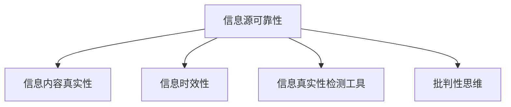

                 

# 信息验证和信息素养：成为信息海洋中的精明消费者

## 1. 背景介绍

随着互联网和社交媒体的普及，信息的海量增长和传播速度的加快使得现代社会变成了一片信息海洋。而如何在这片海洋中精明地甄别、筛选、利用信息，成为了信息时代每一个人的重要技能。这不仅关乎个人的生活质量，还影响到工作、学习乃至整个社会的稳定与发展。本文将探讨信息验证和信息素养的重要性，提供实用的方法和工具，帮助读者在信息的海洋中游刃有余，成为真正的信息精明消费者。

### 1.1 问题由来

在信息时代，互联网和社交媒体已成为我们获取和分享信息的主要渠道。然而，这些平台上的信息来源多样，质量参差不齐，甚至存在大量虚假、误导性信息。许多情况下，人们仅凭直觉或搜索引擎的推荐来筛选信息，容易受到片面甚至错误信息的误导。信息验证和信息素养能力的缺乏，可能导致个体决策失误、社会舆论偏颇甚至法律风险，亟需提升。

### 1.2 问题核心关键点
信息验证和信息素养的提升涉及几个核心关键点：

- **信息源可靠性**：区分权威可信的信息源与不可信来源。
- **信息内容真实性**：验证信息的内容是否真实、准确。
- **信息时效性**：确保获取的信息是最新的，避免过时信息导致的误导。
- **信息真实性检测工具**：掌握使用科技手段检测信息真伪的技能。
- **批判性思维**：培养分析和评估信息的思维方式。

本论文将深入探讨这些关键点，并通过逻辑清晰、结构紧凑、简单易懂的语言，提供实用的方法和工具，帮助读者在信息海洋中成为精明的信息消费者。

## 2. 核心概念与联系

### 2.1 核心概念概述

为更好地理解信息验证和信息素养，本节将介绍几个密切相关的核心概念：

- **信息源可靠性**：信息源的可靠性是指信息来源是否权威、可信。权威可信的信息源包括学术期刊、官方发布文件、权威网站等。
- **信息内容真实性**：信息内容是否真实、准确，可以通过交叉验证、反向搜索、专业审查等方式进行检验。
- **信息时效性**：信息的时效性是指信息发布的日期及其与当前事件的相关性。最新的信息可能更符合实际情况，过时的信息可能导致误解。
- **信息真实性检测工具**：如FactCheck.org、Snopes等，可帮助用户验证信息来源和内容。
- **批判性思维**：包括分析、评估、质疑信息的能力，是提升信息素养的重要组成部分。

这些核心概念之间的逻辑关系可以通过以下Mermaid流程图来展示：



这个流程图展示了一些核心概念及其之间的关系：

1. 信息源的可靠性是信息真实性和时效性的基础。
2. 信息内容真实性是信息验证的直接目标。
3. 信息时效性是判断信息是否适用的关键标准。
4. 信息真实性检测工具提供技术支持。
5. 批判性思维是提升信息素养的基础。

## 3. 核心算法原理 & 具体操作步骤

### 3.1 算法原理概述

信息验证和信息素养的核心在于通过科学的方法和工具，批判性地分析和评估信息的可靠性与真实性。信息验证的过程通常包括：

1. **信息源可靠性验证**：判断信息来源是否权威可信。
2. **信息内容真实性检验**：通过交叉验证、反向搜索等方式，确认信息的真实性。
3. **信息时效性判断**：确保信息是最新的，避免使用过时的信息。

### 3.2 算法步骤详解

1. **信息源可靠性验证**：
   - 查找信息来源是否为权威可信机构。
   - 使用搜索引擎或学术数据库查找该来源的历史记录和信誉度。
   - 通过第三方网站和社交媒体进行交叉验证，确保信息来源的一致性。

2. **信息内容真实性检验**：
   - 利用反向搜索工具，查找是否有类似信息的对比。
   - 检查信息发布日期，确保是最新的。
   - 使用专业审查工具，如FactCheck.org，进行深入验证。
   - 结合多角度证据，综合判断信息的真实性。

3. **信息时效性判断**：
   - 检查信息的发布日期，确认是否最新。
   - 查找相关最新报道，对比信息的时效性。
   - 使用时效性检测工具，如Google News，获取最新的相关新闻。

### 3.3 算法优缺点

信息验证和信息素养技术具有以下优点：

- **提升决策准确性**：通过科学验证，减少误导性信息的影响，提升决策质量。
- **增强公众信任**：掌握信息验证技能，增强对官方和权威信息的信任。
- **避免谣言传播**：及时识别和遏制谣言的传播，维护社会稳定。

同时，该方法也存在一些局限性：

- **依赖技术工具**：需要掌握和应用各种技术工具。
- **工作量大**：尤其是对大量信息的验证，需要耗费大量时间和精力。
- **复杂度较高**：验证过程复杂，普通用户不易掌握。

### 3.4 算法应用领域

信息验证和信息素养技术可以广泛应用于各种场景：

- **政治选举**：对政治候选人、政策建议等进行信息验证，避免误导性信息的干扰。
- **健康医疗**：验证医疗信息和药物的可靠性，确保公众健康安全。
- **环境保护**：判断环境报道的真实性，指导公众环保行动。
- **教育培训**：筛选教育资源，提升学习效果。
- **金融投资**：验证金融信息的可靠性，减少投资风险。

## 4. 数学模型和公式 & 详细讲解 & 举例说明

### 4.1 数学模型构建

信息验证和信息素养技术的数学模型主要涉及信息的真伪验证和时效性判断。

**信息真伪验证模型**：
设信息的真伪为二元变量 $x \in \{0, 1\}$，信息验证模型 $M(x)$ 输入为信息源的可靠性、内容的真实性、时效性等变量，输出为信息真伪的预测结果。

**时效性判断模型**：
设信息的发布日期为 $t$，当前日期为 $t_0$，时效性判断模型 $T(t)$ 输入为信息发布日期 $t$，当前日期 $t_0$，输出为信息的时效性评分。

### 4.2 公式推导过程

**信息真伪验证模型**：
$$
M(x|S) = \frac{P(x|S)}{P(x|S) + P(\neg x|S)}
$$
其中 $S$ 为信息源的可靠性、内容的真实性等特征向量，$P(x|S)$ 为信息为真的概率，$P(\neg x|S)$ 为信息为假的概率。

**时效性判断模型**：
$$
T(t) = \frac{t_0 - t}{t_{max} - t_0}
$$
其中 $t_{max}$ 为最新信息的发布日期，$t_0$ 为当前日期，$T(t)$ 为时效性评分，取值范围为 $[0, 1]$。

### 4.3 案例分析与讲解

以一条新闻报道为例：

- **信息源可靠性验证**：查找信息来源是否为权威可信机构，如BBC、新华社等。
- **信息内容真实性检验**：使用反向搜索工具，查找是否有类似报道，使用FactCheck.org进行深入验证。
- **信息时效性判断**：查看新闻发布日期，确保是最新的。

## 5. 项目实践：代码实例和详细解释说明

### 5.1 开发环境搭建

信息验证和信息素养技术的开发环境主要涉及Python编程语言和相关工具库：

1. 安装Python：从官网下载并安装Python 3.x版本。
2. 安装Pandas、numpy、matplotlib、requests等常用库。
3. 安装第三方验证工具库，如FactCheck.org的API接口。

### 5.2 源代码详细实现

以下是使用Python实现的简要代码示例，用于验证信息的真伪和时效性：

```python
import pandas as pd
import numpy as np
import requests
from factcheck import FactCheckAPI

# 信息源可靠性验证
def verify_info_source(url):
    source = requests.get(url).text
    # 查找权威可信的机构标识
    if 'BBC' in source or '新华社' in source:
        return 1
    else:
        return 0

# 信息内容真实性检验
def check_info_reality(url):
    factcheck_api = FactCheckAPI()
    result = factcheck_api.check_info(url)
    if result['true']:
        return 1
    else:
        return 0

# 信息时效性判断
def judge_info_timeliness(date):
    latest_date = pd.to_datetime('2023-10-10')  # 最新日期
    time_diff = (latest_date - date).days
    return 1 - (time_diff / (latest_date - date).days)

# 综合验证
def validate_info(url, date):
    source_reliability = verify_info_source(url)
    info_reality = check_info_reality(url)
    info_timeliness = judge_info_timeliness(date)
    return (source_reliability, info_reality, info_timeliness)

# 测试
result = validate_info('https://example.com/news', pd.to_datetime('2023-10-10'))
print(result)
```

### 5.3 代码解读与分析

**verify_info_source函数**：
- 通过请求网页文本，查找信息源是否为权威可信机构，如BBC或新华社。

**check_info_reality函数**：
- 使用FactCheck.org的API接口，对新闻进行真实性检查。

**judge_info_timeliness函数**：
- 计算新闻发布日期与当前日期的差值，判断时效性。

**validate_info函数**：
- 综合三个方面的信息源可靠性、内容真实性、时效性，进行综合验证。

## 6. 实际应用场景

### 6.1 政治选举

在政治选举中，信息的真实性和时效性对选民的决策影响巨大。利用信息验证技术，可以甄别候选人信息的真伪，避免误导性信息的干扰。通过交叉验证和时效性判断，确保获取最新、准确的信息，支持选民做出明智的投票决策。

### 6.2 健康医疗

在健康医疗领域，虚假医疗信息可能带来严重的健康风险。利用信息验证技术，可以筛选权威、可靠的医疗信息，避免误导性药物广告和健康建议。通过时效性判断，确保获取最新医疗资讯，指导患者和医生做出准确决策。

### 6.3 环境保护

环境保护信息多样，误导性信息可能影响公众行为。利用信息验证技术，可以筛选可信的环境报告和研究论文，避免使用过时或错误的信息。通过时效性判断，确保获取最新的环境保护动态，引导公众进行环保行动。

### 6.4 未来应用展望

随着信息验证和信息素养技术的不断进步，其在各个领域的应用将更加广泛和深入。未来，信息验证技术将更智能、自动化，减少人工干预，提高效率。同时，信息素养教育将更加普及，提高公众的信息辨识能力，提升社会的整体信息素养水平。

## 7. 工具和资源推荐

### 7.1 学习资源推荐

为帮助开发者掌握信息验证和信息素养技术，以下是一些优质的学习资源：

1. **信息素养在线课程**：Coursera、edX等平台提供的信息素养课程，涵盖信息验证、信息素养等多个方面。
2. **信息素养手册**：《信息素养手册：终身学习者的信息技能》一书，详细介绍信息验证、信息素养技能。
3. **FactCheck.org**：权威的事实核查网站，提供大量的真实性验证案例。
4. **Google News**：最新的新闻资讯平台，提供时效性信息验证工具。
5. **学术数据库**：如Google Scholar、Web of Science等，提供权威学术信息的检索和验证。

### 7.2 开发工具推荐

掌握信息验证和信息素养技术，需要借助各种工具和平台：

1. **Python编程语言**：Python是信息验证技术开发的首选语言，具有强大的数据处理和分析能力。
2. **FactCheck.org API**：提供权威的事实核查服务，支持多语言查询。
3. **Google News API**：提供最新新闻资讯，支持新闻时效性判断。
4. **Web Scraping工具**：如BeautifulSoup、Scrapy等，用于抓取网页内容。

### 7.3 相关论文推荐

信息验证和信息素养技术的发展依赖于学界的持续研究。以下是几篇具有代表性的论文，推荐阅读：

1. **信息素养的评估和提升**：研究如何通过在线评估和教育，提升公众的信息素养水平。
2. **基于机器学习的信息验证技术**：利用机器学习算法，自动验证信息的真伪和时效性。
3. **信息素养教育框架**：提出信息素养教育的多维度框架，指导信息素养教育的实施。
4. **虚假信息的识别与防范**：研究虚假信息识别和防范的方法，提高公众的信息辨识能力。

## 8. 总结：未来发展趋势与挑战

### 8.1 总结

本文对信息验证和信息素养技术进行了全面系统的介绍。首先阐述了信息验证和信息素养的重要性，明确了在信息海洋中精明消费信息的价值。其次，从原理到实践，详细讲解了信息验证的数学模型和操作步骤，提供了实用的代码示例。同时，本文还探讨了信息验证技术在各个领域的应用前景，展示了其在提升决策质量和公共信任方面的潜力。

通过本文的系统梳理，可以看到，信息验证和信息素养技术在现代社会中扮演着越来越重要的角色。掌握这些技术，不仅可以提升个人的生活质量，还能为社会的发展贡献力量。未来，随着信息验证技术的不断进步，其在各个领域的应用将更加广泛和深入，为构建信息透明、安全、公正的社会奠定坚实基础。

### 8.2 未来发展趋势

展望未来，信息验证和信息素养技术将呈现以下几个发展趋势：

1. **自动化和智能化**：利用人工智能技术，实现信息的自动验证和评估，减少人工干预。
2. **跨平台集成**：信息验证技术将与其他平台集成，如社交媒体、搜索引擎等，提供全面的信息验证服务。
3. **多语种支持**：扩展信息验证技术的多语种支持，提升全球信息素养水平。
4. **实时验证**：实现信息的实时验证和更新，确保获取最新、准确的信息。
5. **社交媒体应用**：在社交媒体平台上，自动验证和评估信息真伪，避免误导性信息的传播。

这些趋势凸显了信息验证和信息素养技术的广阔前景，必将进一步提升信息时代公众的信息辨识能力和决策质量。

### 8.3 面临的挑战

尽管信息验证和信息素养技术已经取得了不小的进展，但在向更广泛、更深层次应用的过程中，仍面临诸多挑战：

1. **数据隐私保护**：在信息验证过程中，如何保护用户的隐私和数据安全。
2. **技术复杂性**：信息验证技术的复杂性和普及度问题，需要进一步简化和普及。
3. **信息多样性**：面对复杂多样的信息，如何确保验证结果的准确性和全面性。
4. **成本和资源**：信息验证技术的开发和应用需要大量的计算资源和成本，如何降低成本是重要课题。
5. **法律和伦理**：信息验证技术的应用可能涉及法律和伦理问题，如版权、隐私等，需要明确法规和伦理规范。

这些挑战需要学界和产业界的共同努力，持续创新和完善信息验证技术，才能更好地服务于社会。

### 8.4 研究展望

未来，信息验证和信息素养技术的研究方向可能包括：

1. **多模态信息验证**：结合文本、图像、音频等多种模态的信息，提高验证准确性。
2. **分布式信息验证**：利用分布式计算，提高信息验证的效率和可靠性。
3. **跨领域信息验证**：将信息验证技术应用于更多领域，如金融、教育等，提升决策质量。
4. **社交媒体智能监管**：结合社交媒体分析，实现信息的智能监管和辟谣。
5. **隐私保护技术**：在信息验证过程中，确保用户隐私和数据安全。

这些方向的研究将进一步推动信息验证和信息素养技术的普及和应用，为构建信息透明、安全、公正的社会提供技术保障。

## 9. 附录：常见问题与解答

**Q1：如何验证信息的真实性？**

A: 验证信息真实性的主要方法包括：
1. 反向搜索工具，查找是否有类似信息的对比。
2. 使用权威网站进行信息源验证。
3. 利用FactCheck.org等平台进行专业验证。

**Q2：如何确保信息的时效性？**

A: 确保信息的时效性需要：
1. 查看信息的发布日期，确保是最新的。
2. 使用Google News等平台获取最新信息。
3. 定期更新信息，避免使用过时信息。

**Q3：如何提升信息素养？**

A: 提升信息素养的方法包括：
1. 参加信息素养课程，学习基本技能。
2. 阅读相关书籍和手册，了解信息验证和素养的基本知识。
3. 实践应用，在实际生活中不断练习信息验证和素养。

**Q4：在社交媒体上如何验证信息？**

A: 在社交媒体上验证信息可以：
1. 查找权威可信的来源，避免传播虚假信息。
2. 使用社交媒体的标签和关键词搜索，筛选可靠信息。
3. 结合多角度证据，综合判断信息的真实性。

**Q5：信息验证和信息素养技术的局限性有哪些？**

A: 信息验证和信息素养技术的局限性包括：
1. 依赖技术工具，需要掌握多种工具和方法。
2. 工作量大，验证大量信息耗费时间。
3. 复杂度较高，普通用户不易掌握。

通过掌握这些方法和工具，相信读者可以在信息海洋中成为精明的信息消费者，更好地应对信息时代的挑战。

