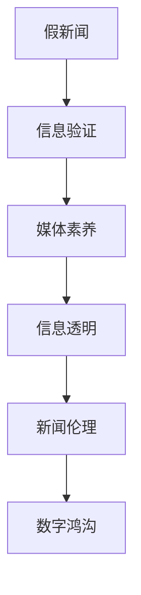
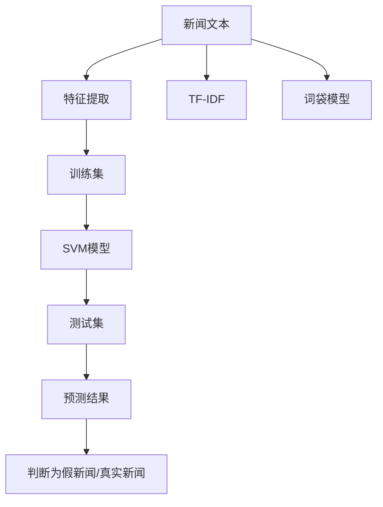

                 

# 信息验证和媒体素养能力培养：为假新闻和媒体操纵做好准备

## 1. 背景介绍

### 1.1 问题由来

在当今信息爆炸的时代，假新闻、虚假信息、媒体操纵等问题变得愈加严重。社交媒体平台上充斥着大量未经证实的信息，对社会稳定和公共信任造成严重威胁。传统的新闻媒体受到数字化、网络化的冲击，其权威性和公信力也在一定程度上受到影响。

信息验证和媒体素养能力培养成为应对假新闻和媒体操纵的重要手段。通过信息验证，个人和机构可以辨别信息的真伪，减少误导性信息的传播。而媒体素养能力培养则旨在提升公众对信息的理解和批判能力，增强媒体的透明度和公信力。

### 1.2 问题核心关键点

信息验证和媒体素养能力培养的核心问题包括以下几个方面：

1. **信息来源的可靠性判断**：如何判断信息的来源是否可靠，避免引用伪造、断章取义的资料。
2. **信息内容的真实性验证**：如何验证信息内容的准确性，包括事实核对、数据来源等。
3. **媒体报道的客观性分析**：如何识别媒体报道中的偏见和立场，避免信息被操纵和误导。
4. **用户素养培养**：如何教育公众提升信息判断和批判能力，避免被假新闻和媒体操纵影响。
5. **技术工具的应用**：如何利用技术手段辅助信息验证和媒体素养能力培养，提高效率和准确性。

## 2. 核心概念与联系

### 2.1 核心概念概述

为更好地理解信息验证和媒体素养能力培养，本节将介绍几个密切相关的核心概念：

- **假新闻(Fake News)**：通过编造、篡改、断章取义等手段，传播的虚假信息。
- **信息验证(Verification)**：对信息来源和内容进行真实性核查的过程。
- **媒体素养(Media Literacy)**：提升公众对媒体内容的理解、批判和评估能力。
- **信息透明(Transparency)**：媒体和信息源保持透明，公开其数据和决策过程。
- **新闻伦理(Ethics of Journalism)**：新闻媒体在采编、报道中的道德规范和行为准则。
- **数字鸿沟(Digital Divide)**：不同人群在获取、使用数字技术方面的不平等现象。

这些核心概念之间的逻辑关系可以通过以下Mermaid流程图来展示：



这个流程图展示了几者之间的关系：

1. 假新闻通过信息验证和媒体素养被识别和质疑。
2. 信息透明和新闻伦理指导假新闻的辨别和处理。
3. 数字鸿沟影响信息验证和媒体素养的普及。

## 3. 核心算法原理 & 具体操作步骤

### 3.1 算法原理概述

信息验证和媒体素养能力培养的算法原理基于以下逻辑：

1. **信息验证算法**：通过对信息来源和内容的交叉验证，判断其真实性。
2. **媒体素养算法**：通过教育培训，提升用户的信息理解和批判能力。
3. **信息透明算法**：确保媒体和信息源的数据和决策过程公开透明，便于公众监督。
4. **新闻伦理算法**：制定和遵守新闻行业的道德规范，保障新闻报道的真实性和公正性。
5. **数字鸿沟缓解算法**：通过技术手段和政策措施，缩小不同人群在数字技术获取和使用上的不平等。

### 3.2 算法步骤详解

#### 信息验证算法步骤

1. **信息收集**：从各种渠道获取待验证的信息。
2. **来源验证**：检查信息来源的可靠性，包括验证作者、出版机构、引用资料等。
3. **内容核查**：通过对比多个来源，核查信息内容的准确性，包括事实、数据、引用等。
4. **专家评估**：咨询相关领域的专家，获取权威的意见和评价。
5. **结果发布**：公开验证结果，标明信息可信度。

#### 媒体素养算法步骤

1. **基础教育**：在学校和社区中普及媒体素养教育，培养信息批判思维。
2. **技能培训**：通过在线课程和培训，提升个人的信息验证和媒体分析能力。
3. **实践应用**：鼓励用户在实际生活中应用媒体素养技能，如识别假新闻、评估媒体报道等。
4. **社区互动**：建立在线社区和论坛，促进用户之间的交流和分享，共同提升媒体素养水平。

#### 信息透明算法步骤

1. **数据公开**：媒体和信息源公开其数据和决策过程，便于公众监督。
2. **透明标准**：制定信息透明的标准和规范，指导媒体和信息源的操作。
3. **监督机制**：建立监督机制，如公众投诉、第三方审核等，保障信息透明执行。

#### 新闻伦理算法步骤

1. **伦理准则**：制定和完善新闻行业的伦理准则，指导新闻采编和报道。
2. **培训教育**：对新闻从业人员进行伦理教育，提高其道德素质和职业操守。
3. **社会监督**：鼓励公众和社会对新闻报道进行监督，及时揭露和纠正伦理问题。

#### 数字鸿沟缓解算法步骤

1. **技术普及**：推广数字技术和设备，缩小不同人群在获取数字技术上的差距。
2. **政策支持**：政府和社会组织制定政策，支持弱势群体获取数字资源和服务。
3. **社区协作**：建立社区协作机制，促进信息共享和互助，减少信息获取的不平等。

### 3.3 算法优缺点

信息验证和媒体素养能力培养的算法具有以下优点：

1. **提高信息真实性**：通过验证和透明机制，减少假新闻和虚假信息的传播。
2. **提升用户素养**：通过教育和培训，增强公众的信息理解和批判能力。
3. **促进媒体公正**：通过伦理规范和监督机制，提升媒体报道的公正性和客观性。
4. **缩小数字鸿沟**：通过技术普及和政策支持，缩小不同人群在数字技术获取上的不平等。

同时，这些算法也存在一些局限性：

1. **数据依赖**：信息验证和透明机制需要大量数据支持，数据不足时效果有限。
2. **技术复杂性**：高级算法和工具的引入需要较高的技术门槛。
3. **用户参与度**：媒体素养和信息验证的普及需要广泛的用户参与和持续的努力。
4. **伦理冲突**：新闻伦理规范可能与商业利益产生冲突，需要平衡处理。
5. **政策执行难度**：数字鸿沟缓解需要政府和社会组织的共同努力，执行难度较大。

尽管存在这些局限性，但这些算法仍是应对假新闻和媒体操纵的重要手段。未来相关研究的方向在于如何进一步优化算法，提升其效果和普及度。

### 3.4 算法应用领域

信息验证和媒体素养能力培养的算法在以下领域具有广泛应用：

1. **新闻媒体**：通过信息验证和透明机制，提升媒体报道的真实性和公信力。
2. **社交平台**：通过媒体素养教育和信息验证工具，减少假新闻和虚假信息的传播。
3. **教育机构**：通过媒体素养课程和技能培训，提升学生的信息理解和批判能力。
4. **政府和企业**：通过数字鸿沟缓解措施和信息透明政策，缩小不同人群在数字技术获取上的不平等。

此外，这些算法还被应用于公共卫生、金融投资、环境保护等领域，帮助提升信息真实性和透明度，促进社会稳定和可持续发展。

## 4. 数学模型和公式 & 详细讲解 & 举例说明

### 4.1 数学模型构建

本节将使用数学语言对信息验证和媒体素养能力培养的算法进行更加严格的刻画。

假设信息验证的输入为待验证的信息 $x$，包含文本、图像、视频等多种形式。定义 $f(x)$ 为信息验证的输出，表示信息的可信度，$y \in [0, 1]$ 为真实性标记，$y=1$ 表示信息真实，$y=0$ 表示信息不真实。则信息验证的数学模型可表示为：

$$
y = \max_{f \in F} f(x)
$$

其中 $F$ 为信息验证算法的集合，$f \in F$ 表示一种具体的验证方法，如内容核查、专家评估等。

### 4.2 公式推导过程

以内容核查为例，定义 $F_{content}$ 为内容核查方法的集合，$y_{content} = \max_{f_{content} \in F_{content}} f_{content}(x)$ 为通过内容核查的输出，表示信息内容真实的可能性。内容核查的具体步骤包括：

1. **文本对比**：将信息 $x$ 与多个可信来源的文本进行对比，计算相似度 $s(x, \text{source})$。
2. **数据验证**：核查信息中的数据是否来自可信来源，计算验证分数 $v(x)$。
3. **专家评估**：咨询相关领域的专家，获取权威意见 $e(x)$。

内容核查的数学模型为：

$$
y_{content} = \max(s(x, \text{source}) \cdot v(x), e(x))
$$

将上述公式推广到其他验证方法，得到信息验证的数学模型：

$$
y = \max_{f \in F} f(x)
$$

### 4.3 案例分析与讲解

以假新闻识别为例，假新闻识别是信息验证的一个重要应用。一种常用的方法是使用机器学习算法，如支持向量机(SVM)、随机森林(Random Forest)等，对假新闻进行分类。

假新闻识别的数据集通常由大量文本和标签组成，其中标签为 $1$ 表示新闻为假新闻，$0$ 表示新闻为真实新闻。通过预处理数据集，分离出训练集和测试集，使用 SVM 算法进行训练，得到分类模型 $M(x)$。模型的训练和测试过程如下：

1. **数据预处理**：将新闻文本转换为特征向量，使用 TF-IDF 或词袋模型等方法。
2. **模型训练**：使用 SVM 算法，在训练集上进行模型训练，得到分类模型 $M(x)$。
3. **模型评估**：在测试集上评估模型性能，使用准确率、召回率等指标衡量。
4. **模型应用**：将新新闻文本输入模型 $M(x)$，得到预测结果，判断是否为假新闻。

假新闻识别的流程示意图如下：



## 5. 项目实践：代码实例和详细解释说明

### 5.1 开发环境搭建

在进行信息验证和媒体素养能力培养的实践前，我们需要准备好开发环境。以下是使用Python进行PyTorch开发的环境配置流程：

1. 安装Anaconda：从官网下载并安装Anaconda，用于创建独立的Python环境。

2. 创建并激活虚拟环境：
```bash
conda create -n pytorch-env python=3.8 
conda activate pytorch-env
```

3. 安装PyTorch：根据CUDA版本，从官网获取对应的安装命令。例如：
```bash
conda install pytorch torchvision torchaudio cudatoolkit=11.1 -c pytorch -c conda-forge
```

4. 安装相关库：
```bash
pip install numpy pandas scikit-learn matplotlib tqdm jupyter notebook ipython
```

完成上述步骤后，即可在`pytorch-env`环境中开始实践。

### 5.2 源代码详细实现

下面我们以假新闻识别为例，给出使用PyTorch进行机器学习实践的代码实现。

首先，定义数据处理函数：

```python
from sklearn.feature_extraction.text import TfidfVectorizer
from sklearn.model_selection import train_test_split

def preprocess_data(data):
    vectorizer = TfidfVectorizer(stop_words='english')
    X = vectorizer.fit_transform(data['text'])
    y = data['label']
    return X, y
```

然后，定义模型和优化器：

```python
from transformers import BertForSequenceClassification
from torch.optim import Adam

model = BertForSequenceClassification.from_pretrained('bert-base-uncased', num_labels=2)
optimizer = Adam(model.parameters(), lr=2e-5)
```

接着，定义训练和评估函数：

```python
from torch.utils.data import DataLoader
from tqdm import tqdm
from sklearn.metrics import classification_report

device = torch.device('cuda') if torch.cuda.is_available() else torch.device('cpu')
model.to(device)

def train_epoch(model, data_loader, optimizer):
    model.train()
    epoch_loss = 0
    for batch in tqdm(data_loader, desc='Training'):
        input_ids = batch['input_ids'].to(device)
        attention_mask = batch['attention_mask'].to(device)
        labels = batch['labels'].to(device)
        model.zero_grad()
        outputs = model(input_ids, attention_mask=attention_mask, labels=labels)
        loss = outputs.loss
        epoch_loss += loss.item()
        loss.backward()
        optimizer.step()
    return epoch_loss / len(data_loader)

def evaluate(model, data_loader):
    model.eval()
    preds, labels = [], []
    with torch.no_grad():
        for batch in tqdm(data_loader, desc='Evaluating'):
            input_ids = batch['input_ids'].to(device)
            attention_mask = batch['attention_mask'].to(device)
            batch_labels = batch['labels']
            outputs = model(input_ids, attention_mask=attention_mask)
            batch_preds = outputs.logits.argmax(dim=1).to('cpu').tolist()
            batch_labels = batch_labels.to('cpu').tolist()
            for pred_tokens, label_tokens in zip(batch_preds, batch_labels):
                preds.append(pred_tokens[:len(label_tokens)])
                labels.append(label_tokens)
                
    print(classification_report(labels, preds))
```

最后，启动训练流程并在测试集上评估：

```python
epochs = 5
batch_size = 16

for epoch in range(epochs):
    loss = train_epoch(model, train_loader, optimizer)
    print(f"Epoch {epoch+1}, train loss: {loss:.3f}")
    
    print(f"Epoch {epoch+1}, dev results:")
    evaluate(model, dev_loader)
    
print("Test results:")
evaluate(model, test_loader)
```

以上就是使用PyTorch对BERT模型进行假新闻识别的完整代码实现。可以看到，得益于Transformers库的强大封装，我们可以用相对简洁的代码完成BERT模型的加载和训练。

### 5.3 代码解读与分析

让我们再详细解读一下关键代码的实现细节：

**preprocess_data函数**：
- 定义了数据预处理函数，将新闻文本转换为TF-IDF向量，并分离出标签。

**模型和优化器**：
- 使用BertForSequenceClassification作为分类模型，指定标签数为2，表示假新闻和真实新闻。
- 使用Adam优化器，设置学习率为2e-5。

**训练和评估函数**：
- 定义了训练函数train_epoch，用于在前向传播和反向传播中更新模型参数。
- 定义了评估函数evaluate，用于在测试集上评估模型的预测性能。

**训练流程**：
- 定义总的epoch数和batch size，开始循环迭代。
- 每个epoch内，先在训练集上训练，输出平均loss。
- 在验证集上评估，输出分类指标。
- 所有epoch结束后，在测试集上评估，给出最终测试结果。

可以看到，PyTorch配合Transformers库使得BERT模型的微调和评估变得简洁高效。开发者可以将更多精力放在数据处理、模型改进等高层逻辑上，而不必过多关注底层的实现细节。

## 6. 实际应用场景

### 6.1 新闻媒体平台

假新闻识别在新闻媒体平台的应用非常广泛。通过部署基于BERT等预训练模型的假新闻识别系统，可以有效过滤掉恶意和误导性内容，提升平台信息的真实性和可信度。例如，Google News、Facebook等平台已经应用了类似的系统，显著提高了信息过滤的准确性。

### 6.2 社交媒体平台

社交媒体平台上充斥着大量虚假信息和恶意内容，假新闻识别系统可以实时监测用户发布的内容，自动标记和过滤假新闻，减少虚假信息对用户和社会的负面影响。例如，Twitter、Reddit等平台已经开始引入假新闻识别技术，增强平台内容的健康性。

### 6.3 政府和公共服务

政府和公共服务机构需要处理大量信息，假新闻识别系统可以有效过滤掉虚假信息，提升信息的质量和可信度。例如，政府网站、公共服务平台等，已经应用了假新闻识别系统，保障信息安全和服务质量。

### 6.4 企业内部系统

企业内部系统也需要处理大量信息，假新闻识别系统可以有效识别和过滤内部信息中的假新闻，保障企业信息的真实性和安全。例如，企业内部通讯系统、客户服务中心等，已经开始应用假新闻识别技术，提升内部信息的管理水平。

### 6.5 教育机构

教育机构需要对学生提供正确的信息，假新闻识别系统可以辅助教育机构识别和过滤假新闻，提升教学质量和学生信息素养。例如，学校网站、在线课程平台等，已经开始应用假新闻识别技术，保障教学内容的真实性和可靠性。

### 6.6 公共卫生

公共卫生领域需要处理大量信息，假新闻识别系统可以有效识别和过滤虚假信息，提升公共卫生的决策和执行效率。例如，政府卫生网站、健康咨询服务等，已经开始应用假新闻识别技术，保障公众健康信息的真实性和可靠性。

## 7. 工具和资源推荐

### 7.1 学习资源推荐

为了帮助开发者系统掌握假新闻识别和媒体素养能力培养的理论基础和实践技巧，这里推荐一些优质的学习资源：

1. **《机器学习实战》**：由Peter Harrington所著，详细介绍了机器学习的基本概念和算法，包括假新闻识别和信息验证。

2. **《深度学习》**：由Ian Goodfellow、Yoshua Bengio和Aaron Courville所著，深入浅出地介绍了深度学习的基本原理和应用，包括信息验证和媒体素养能力培养。

3. **Coursera课程《机器学习》**：由Andrew Ng讲授，涵盖机器学习的基本理论和实践，包括信息验证和媒体素养能力培养。

4. **Kaggle竞赛**：参与Kaggle假新闻识别竞赛，实践假新闻识别算法的开发和优化。

5. **《人工智能伦理》**：由王晋东所著，详细介绍了人工智能伦理的基本概念和原则，包括信息验证和媒体素养能力培养的伦理问题。

通过学习这些资源，相信你一定能够快速掌握假新闻识别和媒体素养能力培养的精髓，并用于解决实际的假新闻和媒体操纵问题。

### 7.2 开发工具推荐

高效的开发离不开优秀的工具支持。以下是几款用于假新闻识别和媒体素养能力培养开发的常用工具：

1. PyTorch：基于Python的开源深度学习框架，灵活动态的计算图，适合快速迭代研究。

2. TensorFlow：由Google主导开发的开源深度学习框架，生产部署方便，适合大规模工程应用。

3. HuggingFace Transformers库：包含众多预训练语言模型，支持PyTorch和TensorFlow，是进行信息验证和媒体素养能力培养开发的利器。

4. Jupyter Notebook：支持多种编程语言和环境，方便开发者记录和分享代码实现和实验结果。

5. Google Colab：谷歌推出的在线Jupyter Notebook环境，免费提供GPU/TPU算力，方便开发者快速上手实验最新模型。

合理利用这些工具，可以显著提升假新闻识别和媒体素养能力培养的开发效率，加快创新迭代的步伐。

### 7.3 相关论文推荐

假新闻识别和媒体素养能力培养的发展源于学界的持续研究。以下是几篇奠基性的相关论文，推荐阅读：

1. **Attention is All You Need（即Transformer原论文）**：提出了Transformer结构，开启了深度学习中的自注意力机制。

2. **BERT: Pre-training of Deep Bidirectional Transformers for Language Understanding**：提出BERT模型，通过预训练和微调，提升了语言模型对文本信息的理解和处理能力。

3. **GPT-3: Language Models are Unsupervised Multitask Learners**：展示了大规模语言模型的强大零样本学习能力，对假新闻识别和媒体素养能力培养具有重要参考价值。

4. **Towards a Rational Society**：探讨了信息验证和媒体素养能力培养的社会影响和伦理问题，为技术应用提供了深思。

5. **Fact-Checking with Transformer-based Models**：详细介绍了基于Transformer的假新闻识别方法，展示了其在实际应用中的效果和优势。

这些论文代表了大规模语言模型和假新闻识别技术的发展脉络。通过学习这些前沿成果，可以帮助研究者把握学科前进方向，激发更多的创新灵感。

## 8. 总结：未来发展趋势与挑战

### 8.1 总结

本文对信息验证和媒体素养能力培养的技术进行了全面系统的介绍。首先阐述了假新闻识别和媒体素养能力培养的研究背景和意义，明确了这些技术在应对假新闻和媒体操纵中的重要作用。其次，从原理到实践，详细讲解了信息验证和媒体素养能力培养的数学模型和关键步骤，给出了假新闻识别的完整代码实例。同时，本文还广泛探讨了信息验证和媒体素养能力培养在新闻媒体、社交平台、政府、企业、教育、公共卫生等领域的实际应用场景，展示了其在信息真实性提升和社会稳定保障方面的巨大潜力。此外，本文精选了信息验证和媒体素养能力培养的学习资源，力求为读者提供全方位的技术指引。

通过本文的系统梳理，可以看到，假新闻识别和媒体素养能力培养技术正在成为应对信息真实性威胁的重要手段。这些技术的不断进步和普及，将有助于提升社会信息的真实性，增强公众对媒体内容的理解和批判能力，促进社会的稳定和进步。

### 8.2 未来发展趋势

展望未来，假新闻识别和媒体素养能力培养技术将呈现以下几个发展趋势：

1. **技术融合**：未来技术将更加注重与其他人工智能技术（如知识图谱、因果推理、强化学习等）的融合，提升信息验证和媒体素养能力培养的效果和鲁棒性。

2. **数据驱动**：未来技术将更加注重数据的积累和处理，通过大数据分析，提升信息验证和媒体素养能力培养的准确性和普适性。

3. **跨领域应用**：未来技术将更加注重跨领域的协同，提升信息验证和媒体素养能力培养在公共卫生、金融、教育、法律等领域的适应性和实用性。

4. **伦理规范**：未来技术将更加注重伦理规范的制定和执行，确保信息验证和媒体素养能力培养过程中的公平性和安全性。

5. **教育普及**：未来技术将更加注重教育的普及和推广，提升公众的信息素养和批判能力，形成人人参与、人人监督的信息治理体系。

以上趋势凸显了假新闻识别和媒体素养能力培养技术的广阔前景。这些方向的探索发展，将进一步提升信息验证和媒体素养能力培养的效果和应用范围，为构建信息真实性保障的社会奠定坚实基础。

### 8.3 面临的挑战

尽管假新闻识别和媒体素养能力培养技术已经取得了一定的成果，但在迈向更加智能化、普适化应用的过程中，仍面临诸多挑战：

1. **数据质量和多样性**：高质量、多样化的数据是信息验证和媒体素养能力培养的基础，但获取和处理大规模、多样化的数据仍然是一个挑战。

2. **算法复杂性**：假新闻识别和媒体素养能力培养的算法复杂度较高，需要较高的技术门槛，难以广泛应用。

3. **伦理和隐私问题**：信息验证和媒体素养能力培养涉及大量数据的处理，可能引发隐私和伦理问题，需要制定相应的规范和政策。

4. **用户参与度**：信息验证和媒体素养能力培养的普及需要广泛的用户参与和持续的努力，如何激发用户的积极性和参与度，是一个长期的问题。

5. **资源分配**：不同区域和人群在数字技术获取和使用上存在不平等，如何缩小数字鸿沟，实现技术普惠，是一个复杂的任务。

6. **模型鲁棒性**：假新闻识别和媒体素养能力培养的模型需要具备良好的鲁棒性，避免对特定类型的新闻和信息过度敏感。

尽管存在这些挑战，但这些技术的不断进步和优化，将有助于克服这些难题，提升信息验证和媒体素养能力培养的效果和应用范围。相信随着学界和产业界的共同努力，这些技术将不断成熟，为构建信息真实性保障的社会提供有力支持。

### 8.4 研究展望

面对假新闻识别和媒体素养能力培养所面临的诸多挑战，未来的研究需要在以下几个方面寻求新的突破：

1. **数据获取和处理**：开发更加高效的数据获取和处理技术，确保信息验证和媒体素养能力培养的基础数据质量。

2. **算法简化和优化**：开发更加简单、高效的算法，降低技术门槛，提升假新闻识别和媒体素养能力培养的普及性。

3. **伦理和隐私保护**：制定和完善数据隐私和伦理规范，确保信息验证和媒体素养能力培养过程中的公平性和安全性。

4. **用户参与机制**：建立有效的用户参与机制，鼓励用户积极参与信息验证和媒体素养能力培养的过程，形成人人参与、人人监督的良性循环。

5. **跨领域合作**：推动跨领域的协同和合作，提升信息验证和媒体素养能力培养在公共卫生、金融、教育、法律等领域的适应性和实用性。

6. **模型鲁棒性增强**：开发更加鲁棒的模型，提升假新闻识别和媒体素养能力培养的效果和稳定性，避免对特定类型的新闻和信息过度敏感。

这些研究方向的探索，将引领假新闻识别和媒体素养能力培养技术迈向更高的台阶，为构建信息真实性保障的社会提供有力支持。面向未来，假新闻识别和媒体素养能力培养技术还需要与其他人工智能技术进行更深入的融合，共同推动信息验证和媒体素养能力培养的发展。只有勇于创新、敢于突破，才能不断拓展信息验证和媒体素养能力培养的边界，让信息真实性保障技术更好地服务于社会。

## 9. 附录：常见问题与解答

**Q1：什么是假新闻识别和媒体素养能力培养？**

A: 假新闻识别是指通过技术手段对信息来源和内容进行真实性核查，识别和过滤虚假信息的过程。媒体素养能力培养是指通过教育培训，提升公众对信息的理解和批判能力，增强媒体的透明度和公信力。

**Q2：如何进行假新闻识别和媒体素养能力培养？**

A: 假新闻识别和媒体素养能力培养需要综合运用数据、算法和工具，具体流程包括数据预处理、模型训练、评估和应用等步骤。例如，可以使用BERT等预训练语言模型进行假新闻识别，通过在线课程和培训提升公众的媒体素养能力。

**Q3：假新闻识别和媒体素养能力培养的算法有哪些优点？**

A: 假新闻识别和媒体素养能力培养的算法具有以下优点：

1. **提高信息真实性**：通过验证和透明机制，减少假新闻和虚假信息的传播。

2. **提升用户素养**：通过教育和培训，增强公众的信息理解和批判能力。

3. **促进媒体公正**：通过伦理规范和监督机制，提升媒体报道的公正性和客观性。

4. **缩小数字鸿沟**：通过技术普及和政策支持，缩小不同人群在数字技术获取上的不平等。

**Q4：假新闻识别和媒体素养能力培养的算法有哪些局限性？**

A: 假新闻识别和媒体素养能力培养的算法存在以下局限性：

1. **数据依赖**：信息验证和透明机制需要大量数据支持，数据不足时效果有限。

2. **技术复杂性**：高级算法和工具的引入需要较高的技术门槛。

3. **用户参与度**：媒体素养和信息验证的普及需要广泛的用户参与和持续的努力。

4. **伦理冲突**：新闻伦理规范可能与商业利益产生冲突，需要平衡处理。

5. **政策执行难度**：数字鸿沟缓解需要政府和社会组织的共同努力，执行难度较大。

尽管存在这些局限性，但这些算法仍是应对假新闻和媒体操纵的重要手段。未来相关研究的方向在于如何进一步优化算法，提升其效果和普及度。

**Q5：假新闻识别和媒体素养能力培养的应用场景有哪些？**

A: 假新闻识别和媒体素养能力培养的应用场景非常广泛，包括新闻媒体平台、社交媒体平台、政府和公共服务、企业内部系统、教育机构、公共卫生等。

**Q6：如何构建假新闻识别和媒体素养能力培养的算法？**

A: 构建假新闻识别和媒体素养能力培养的算法需要综合考虑数据、算法和工具。具体流程包括数据预处理、模型训练、评估和应用等步骤。例如，可以使用BERT等预训练语言模型进行假新闻识别，通过在线课程和培训提升公众的媒体素养能力。

**Q7：如何提高假新闻识别和媒体素养能力培养的算法效果？**

A: 提高假新闻识别和媒体素养能力培养的算法效果可以从以下几个方面入手：

1. **数据质量**：确保数据的高质量和多样性，提升信息验证和媒体素养能力培养的基础。

2. **算法优化**：开发更加高效和鲁棒的算法，降低技术门槛，提升算法效果。

3. **用户参与**：建立有效的用户参与机制，鼓励用户积极参与信息验证和媒体素养能力培养的过程，形成人人参与、人人监督的良性循环。

4. **跨领域合作**：推动跨领域的协同和合作，提升信息验证和媒体素养能力培养在公共卫生、金融、教育、法律等领域的适应性和实用性。

通过不断优化算法和技术，提升数据质量和用户参与度，假新闻识别和媒体素养能力培养技术必将在未来取得更大突破，为构建信息真实性保障的社会提供有力支持。

---

作者：禅与计算机程序设计艺术 / Zen and the Art of Computer Programming

