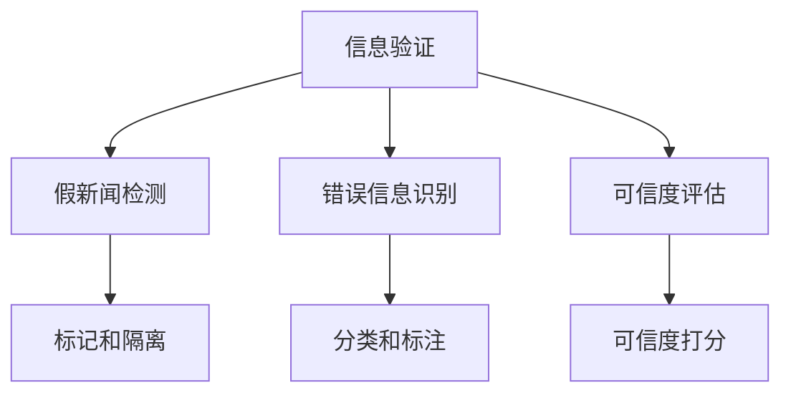

                 

# 信息验证和批判性思维能力培养：在假新闻和错误信息时代导航

> 关键词：信息验证, 批判性思维, 假新闻, 错误信息, 自动推理, 可信度评估, 知识图谱, 信息检索

## 1. 背景介绍

### 1.1 问题由来
信息爆炸和互联网普及带来的一个副作用是假新闻和错误信息的泛滥。社交媒体、论坛、新闻网站等平台上充斥着各种虚假报道、误导性内容和不实信息。这些内容不仅会误导公众，还可能影响社会稳定和国际关系。在这样一个信息泛滥的时代，如何培养公众的信息验证和批判性思维能力，成为亟待解决的问题。

## 2. 核心概念与联系

### 2.1 核心概念概述
为了有效应对假新闻和错误信息，需要构建一套完整的信息验证和批判性思维培养体系。这个体系包括以下几个关键概念：

- **信息验证**：指对信息进行筛选、比较和核实的整个过程，确保获取的信息准确无误。
- **批判性思维**：指在获取信息后，能够对信息进行深度分析和评价，避免被虚假信息误导。
- **假新闻检测**：指通过算法和模型识别并标记假新闻的方法。
- **错误信息识别**：指通过自然语言处理技术识别和分类错误信息。
- **可信度评估**：指对信息来源和内容的可信度进行打分和评价。

这些概念之间相互关联，共同构成了一个系统化的信息验证和批判性思维培养体系。

### 2.2 核心概念原理和架构的 Mermaid 流程图



这个流程图展示了信息验证和批判性思维培养体系的关键步骤：首先对信息进行全面验证，然后检测并识别假新闻和错误信息，最后对信息进行可信度评估和打分。通过这套体系，可以帮助用户有效识别并处理虚假信息。

## 3. 核心算法原理 & 具体操作步骤

### 3.1 算法原理概述

信息验证和批判性思维培养的算法原理基于自然语言处理（NLP）和机器学习（ML）技术。具体来说，算法将信息内容作为输入，利用NLP技术进行语义分析和文本分类，使用ML技术进行标注和评估，从而实现对信息的有效验证和可信度评估。

### 3.2 算法步骤详解

#### 3.2.1 数据收集与预处理
首先需要收集大量的新闻、文章、社交媒体帖子等文本数据，并对这些数据进行清洗和预处理。预处理包括去除停用词、分词、词性标注、实体识别等步骤，以便于后续的算法处理。

#### 3.2.2 特征提取与表示
将预处理后的文本数据转化为算法可以处理的形式。常用的特征提取方法包括TF-IDF、词嵌入（如Word2Vec、GloVe）、句子嵌入（如ELMo、BERT）等。

#### 3.2.3 模型训练与验证
使用收集的数据训练假新闻检测、错误信息识别和可信度评估模型。训练过程中，使用交叉验证、过拟合检测等技术，确保模型在验证集上的表现良好。

#### 3.2.4 模型部署与测试
将训练好的模型部署到实际应用中，对新信息进行验证和可信度评估。测试过程中，可以使用A/B测试、真实环境测试等方式，评估模型的效果和性能。

### 3.3 算法优缺点
信息验证和批判性思维培养算法有以下优点：

- **高效性**：通过自动化处理大量文本数据，可以显著提升信息验证和可信度评估的效率。
- **准确性**：基于机器学习模型的算法，可以不断提高准确性和泛化能力。
- **可扩展性**：算法可以应用于不同的文本类型和应用场景，具有广泛的应用前景。

同时，算法也存在以下缺点：

- **依赖数据质量**：算法的效果高度依赖于数据的质量和标注情况，数据偏差可能导致误判。
- **模型复杂性**：训练和部署高质量模型需要大量的计算资源和时间。
- **可解释性不足**：算法模型通常是"黑盒"模型，难以解释其内部的推理过程和决策逻辑。

### 3.4 算法应用领域

信息验证和批判性思维培养算法已经在以下领域得到广泛应用：

- **新闻媒体**：用于自动检测和标记假新闻，提升新闻的可靠性和可信度。
- **社交媒体**：用于识别和屏蔽错误信息、虚假广告和恶意内容，保护用户安全和隐私。
- **教育培训**：用于培养学生的批判性思维能力，提高信息素养和媒体素养。
- **公共事务**：用于评估政治广告和宣传的可靠性，防止误导公众。
- **企业运营**：用于筛选和验证客户反馈和市场信息，保障企业决策的准确性。

## 4. 数学模型和公式 & 详细讲解 & 举例说明

### 4.1 数学模型构建

假新闻检测和错误信息识别的数学模型通常基于监督学习（Supervised Learning）。假设有一个假新闻数据集$D=\{(x_i, y_i)\}_{i=1}^N$，其中$x_i$是新闻文本，$y_i$是二值标签（真或假）。数学模型$f$将输入文本$x$映射到一个得分$score$，表示该文本为假新闻的概率。

### 4.2 公式推导过程

假新闻检测模型通常使用逻辑回归或支持向量机（SVM）等模型。以逻辑回归为例，假新闻检测模型的目标是最大化$log$-似然函数：

$$
\max_{\theta} \frac{1}{N}\sum_{i=1}^N [y_i \log(\hat{p}(x_i)) + (1-y_i) \log(1-\hat{p}(x_i))]
$$

其中$\hat{p}(x_i) = \frac{1}{1+e^{-score(x_i)}}$为预测概率，$\theta$为模型的参数。模型参数$\theta$的求解通常使用梯度下降等优化算法。

### 4.3 案例分析与讲解

以BERT模型为例，说明假新闻检测的具体实现。BERT模型是一种预训练语言模型，在多个NLP任务上取得了SOTA结果。使用BERT模型进行假新闻检测的步骤如下：

1. 收集假新闻和真实新闻的数据集，进行预处理和标注。
2. 使用BERT模型对新闻文本进行编码，得到上下文表示向量。
3. 将上下文向量输入到全连接层和softmax层，输出预测概率。
4. 使用训练数据集训练模型，并使用验证集调整超参数。
5. 在测试集上评估模型性能，并使用AUC、F1等指标进行评估。

## 5. 项目实践：代码实例和详细解释说明

### 5.1 开发环境搭建

开发环境搭建主要包括以下步骤：

1. 安装Python和pip：
```bash
sudo apt-get update
sudo apt-get install python3-pip
```

2. 安装必要的Python库：
```bash
pip install torch transformers sklearn
```

3. 准备数据集：
收集假新闻和真实新闻的数据集，并进行预处理。可以使用GPT-3等API获取数据集，也可以自行构建数据集。

### 5.2 源代码详细实现

以下是一个使用BERT模型进行假新闻检测的PyTorch代码实现：

```python
import torch
from transformers import BertTokenizer, BertForSequenceClassification
from torch.utils.data import DataLoader
from sklearn.metrics import accuracy_score, precision_recall_fscore_support

# 准备数据集
tokenizer = BertTokenizer.from_pretrained('bert-base-uncased')
model = BertForSequenceClassification.from_pretrained('bert-base-uncased', num_labels=2)

# 数据预处理
def preprocess(text):
    tokens = tokenizer.encode_plus(text, add_special_tokens=True, max_length=256, return_tensors='pt')
    return tokens['input_ids'], tokens['attention_mask']

# 模型训练和验证
device = torch.device('cuda' if torch.cuda.is_available() else 'cpu')
model.to(device)
criterion = torch.nn.CrossEntropyLoss()
optimizer = torch.optim.Adam(model.parameters(), lr=2e-5)

def train_epoch(model, dataloader, criterion, optimizer):
    model.train()
    loss_sum = 0
    correct_sum = 0
    for batch in dataloader:
        input_ids, attention_mask = batch
        input_ids = input_ids.to(device)
        attention_mask = attention_mask.to(device)
        output = model(input_ids, attention_mask=attention_mask)
        loss = criterion(output, batch[1])
        loss_sum += loss.item()
        correct_sum += torch.argmax(output, dim=1) == batch[1]
        optimizer.zero_grad()
        loss.backward()
        optimizer.step()
    return loss_sum / len(dataloader), correct_sum / len(dataloader.dataset)

# 模型测试和评估
def evaluate(model, dataloader):
    model.eval()
    correct_sum = 0
    total_sum = 0
    for batch in dataloader:
        input_ids, attention_mask = batch
        input_ids = input_ids.to(device)
        attention_mask = attention_mask.to(device)
        output = model(input_ids, attention_mask=attention_mask)
        correct_sum += torch.argmax(output, dim=1) == batch[1]
        total_sum += len(batch[0])
    return correct_sum / total_sum

# 训练和测试
train_dataset = ...
dev_dataset = ...
test_dataset = ...

for epoch in range(5):
    train_loss, train_acc = train_epoch(model, train_dataset, criterion, optimizer)
    print(f'Epoch {epoch+1}, Train Loss: {train_loss:.3f}, Train Acc: {train_acc:.3f}')
    dev_acc = evaluate(model, dev_dataset)
    print(f'Epoch {epoch+1}, Dev Acc: {dev_acc:.3f}')

test_acc = evaluate(model, test_dataset)
print(f'Test Acc: {test_acc:.3f}')
```

### 5.3 代码解读与分析

以上代码实现了使用BERT模型进行假新闻检测的过程。具体分析如下：

- `preprocess`函数：将输入文本进行分词和编码，得到模型需要的输入张量。
- `train_epoch`函数：在训练阶段，使用训练集进行前向传播和反向传播，更新模型参数。
- `evaluate`函数：在测试阶段，使用测试集评估模型性能。
- 训练和测试过程：循环训练和测试模型，记录每个epoch的训练和验证指标。

## 6. 实际应用场景

### 6.1 新闻媒体

假新闻检测在新闻媒体中的应用非常广泛。新闻媒体机构可以部署假新闻检测系统，自动检测和标记假新闻，提高新闻的可靠性和可信度。这不仅能够提升用户信任度，还能防止恶意信息的传播。

### 6.2 社交媒体

社交媒体平台也需要进行假新闻检测和错误信息识别。通过部署假新闻检测系统，社交媒体平台可以屏蔽和删除虚假信息，保护用户免受误导，同时也能避免恶意内容的传播。

### 6.3 教育培训

在教育培训领域，假新闻和错误信息识别也是一项重要任务。通过培养学生的批判性思维能力，教育机构能够提升学生的媒体素养和信息素养，培养出具备独立思考能力的合格人才。

### 6.4 公共事务

在公共事务领域，假新闻检测和错误信息识别能够防止虚假宣传和误导性信息的传播，维护社会稳定和公众利益。

## 7. 工具和资源推荐

### 7.1 学习资源推荐

- **《深度学习与自然语言处理》**：介绍自然语言处理的基本概念和常用模型，适合初学者入门。
- **《自然语言处理综论》**：全面介绍NLP技术，涵盖信息检索、文本分类、情感分析等多个方面。
- **Coursera《自然语言处理》课程**：由斯坦福大学教授讲授，提供NLP领域的最新研究成果和前沿技术。
- **Google Colab**：免费的在线Jupyter Notebook环境，适合学习和实验最新NLP技术。

### 7.2 开发工具推荐

- **PyTorch**：深度学习框架，支持动态计算图，适用于NLP任务的微调和模型训练。
- **TensorFlow**：深度学习框架，支持静态计算图和分布式训练，适合大规模NLP任务。
- **Transformers**：开源NLP工具库，集成了多个预训练语言模型，支持快速微调和推理。
- **GPT-3**：最新的预训练语言模型，具有强大的生成能力和语义理解能力。

### 7.3 相关论文推荐

- **《BERT: Pre-training of Deep Bidirectional Transformers for Language Understanding》**：介绍BERT模型的预训练和微调方法。
- **《Improving Pre-trained Document Representations for Text Classification》**：介绍基于预训练语言模型的文本分类方法。
- **《Evaluating the Accuracy and Interpretability of False News Detection Models》**：评估假新闻检测模型的准确性和可解释性。

## 8. 总结：未来发展趋势与挑战

### 8.1 研究成果总结

信息验证和批判性思维培养算法已经在多个领域取得了显著成果，但仍有许多挑战需要克服。这些挑战包括数据质量和标注偏差、模型复杂度和计算资源需求、模型的可解释性和透明度等。

### 8.2 未来发展趋势

未来，信息验证和批判性思维培养算法将在以下几个方面继续发展：

1. **深度学习与知识图谱的融合**：通过引入知识图谱和专家知识，提升模型的可解释性和可靠性。
2. **多模态信息融合**：将文本、图像、视频等多种信息类型进行融合，提升模型的综合能力。
3. **自动化假新闻检测**：开发自动化的假新闻检测系统，提升检测效率和准确性。
4. **跨领域知识迁移**：将假新闻检测技术应用于不同的领域，提升跨领域泛化能力。
5. **人机协同验证**：通过人机协同的方式，提高信息验证的准确性和可信度。

### 8.3 面临的挑战

未来，信息验证和批判性思维培养算法仍面临以下挑战：

1. **数据质量问题**：数据质量和标注偏差仍是制约算法性能的重要因素。
2. **计算资源需求**：大规模模型的训练和推理需要大量计算资源。
3. **可解释性不足**：模型通常是"黑盒"模型，难以解释其内部的推理过程。
4. **跨领域泛化能力**：模型的泛化能力不足，无法有效处理不同领域的任务。

### 8.4 研究展望

未来的研究方向包括：

1. **跨领域知识迁移**：将假新闻检测技术应用于不同的领域，提升跨领域泛化能力。
2. **多模态信息融合**：将文本、图像、视频等多种信息类型进行融合，提升模型的综合能力。
3. **深度学习与知识图谱的融合**：通过引入知识图谱和专家知识，提升模型的可解释性和可靠性。
4. **自动化假新闻检测**：开发自动化的假新闻检测系统，提升检测效率和准确性。
5. **人机协同验证**：通过人机协同的方式，提高信息验证的准确性和可信度。

总之，信息验证和批判性思维培养算法在假新闻和错误信息时代具有重要意义。通过不断优化算法，提升模型性能和可解释性，将能够更好地应对信息泛滥带来的挑战，为社会带来更大的价值。

## 9. 附录：常见问题与解答

**Q1: 信息验证和批判性思维培养算法有哪些应用场景？**

A: 信息验证和批判性思维培养算法在新闻媒体、社交媒体、教育培训、公共事务和企业管理等多个领域都有广泛应用。例如，新闻媒体可以使用该算法检测和标记假新闻，提升新闻的可靠性和可信度；社交媒体平台可以使用该算法屏蔽和删除虚假信息，保护用户免受误导。

**Q2: 信息验证和批判性思维培养算法的主要技术难点是什么？**

A: 信息验证和批判性思维培养算法的主要技术难点包括数据质量和标注偏差、模型复杂度和计算资源需求、模型的可解释性和透明度等。数据质量和标注偏差会限制算法的准确性和泛化能力；模型复杂度和计算资源需求会限制算法的可扩展性和实时性；模型的可解释性和透明度会影响算法的可信度和接受度。

**Q3: 如何提升信息验证和批判性思维培养算法的可解释性？**

A: 提升信息验证和批判性思维培养算法的可解释性，需要采用一些技术和方法，例如：

- 引入知识图谱：通过引入知识图谱和专家知识，提升模型的可解释性和可靠性。
- 多模态融合：将文本、图像、视频等多种信息类型进行融合，提升模型的综合能力。
- 人机协同验证：通过人机协同的方式，提高信息验证的准确性和可信度。

总之，提升信息验证和批判性思维培养算法的可解释性，需要从数据、模型、技术等多个维度进行全面优化。只有不断提升算法的可解释性，才能得到公众的信任和认可。

---

作者：禅与计算机程序设计艺术 / Zen and the Art of Computer Programming

