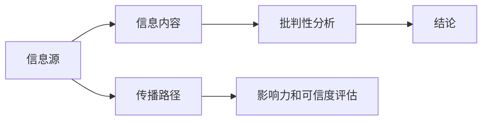

                 

## 1. 背景介绍

在数字时代，信息洪流汹涌而至，如何辨别真伪、判断信息的可信度，成为每个人必须掌握的重要技能。信息验证和批判性思维，不仅是新闻媒体从业者必备的能力，更是普通公众在新媒体环境下保护自己免受虚假信息侵扰的必要手段。随着社交媒体、搜索引擎、在线论坛等渠道的普及，假新闻和误导性信息的传播速度和范围日益扩大，亟需一套系统化的策略和方法来应对这一挑战。

### 1.1 问题由来
假新闻（fake news）和误导性信息（misinformation）在社交媒体上肆虐，已经成为全球性的问题。假新闻通过夸大、扭曲或编造信息来吸引眼球，破坏了公众对媒体的信任，影响了社会稳定和公共政策决策。诸如新冠疫情、气候变化、疫苗效果等重要议题上的误导性信息，更是可能造成严重的后果。因此，在假新闻时代，如何有效地识别和验证信息，培养公众的批判性思维，成为了一个重要的议题。

### 1.2 问题核心关键点
信息验证和批判性思维的核心在于，如何通过分析信息源、评估信息内容、判断信息传播路径等手段，识别假新闻和误导性信息，并培养公众对信息来源和内容的质疑精神。这需要一套系统化的框架和方法，结合技术手段和人文素养，以应对信息爆炸带来的挑战。

## 2. 核心概念与联系

### 2.1 核心概念概述

为更好地理解信息验证和批判性思维的实践框架，本节将介绍几个关键概念：

- **信息源**：指信息的源头，包括新闻网站、社交媒体、论坛、博客等。评估信息源的可信度是信息验证的重要步骤。
- **信息内容**：指信息的具体内容，包括文字、图片、视频等。分析信息的逻辑结构、语法错误、事实准确性等，是信息验证的关键环节。
- **传播路径**：指信息从源头到受众的传播过程，包括传播渠道、转发次数、受众反馈等。追踪信息的传播路径，有助于理解信息的影响力和可信度。
- **批判性思维**：指一种系统化、结构化的思考方式，强调质疑、分析、证据支持等要素，是培养公众判断力、避免认知偏误的必经之路。

这些核心概念之间的逻辑关系可以通过以下Mermaid流程图来展示：



这个流程图展示了信息验证和批判性思维的基本流程：

1. 首先评估信息源的可信度。
2. 接着分析信息内容，确认其逻辑结构和事实准确性。
3. 追踪信息传播路径，理解其影响力和可信度。
4. 最后进行批判性分析，形成结论。

## 3. 核心算法原理 & 具体操作步骤
### 3.1 算法原理概述

信息验证和批判性思维的核心算法原理，主要基于信息评估的多个维度。通过多维度的综合评估，可以更全面地识别出假新闻和误导性信息。

- **信息源可信度评估**：基于信息源的信誉、专业性和历史表现等因素，使用量化指标对其进行评估。
- **信息内容准确性分析**：使用事实核查、逻辑推理、统计分析等方法，评估信息的准确性和逻辑连贯性。
- **信息传播路径分析**：追踪信息从源头到受众的传播路径，分析其传播速度、转发次数、受众反馈等，理解其影响力。
- **批判性思维培养**：通过系统化的训练和实践，培养公众的质疑精神、逻辑思维和证据意识。

### 3.2 算法步骤详解

基于信息验证和批判性思维的核心算法原理，信息验证的过程可以分为以下几个关键步骤：

**Step 1: 评估信息源可信度**
- 收集信息源的信誉、专业性、历史表现等相关数据。
- 使用量化指标对信息源进行打分，如专业度评分、权威性评分等。

**Step 2: 分析信息内容准确性**
- 对信息内容进行事实核查，判断其是否存在明显的错误或夸大。
- 使用逻辑推理方法，评估信息的连贯性和合理性。
- 使用统计分析方法，评估信息数据的可靠性和代表性。

**Step 3: 追踪信息传播路径**
- 分析信息在社交媒体、新闻网站、论坛等平台上的传播路径。
- 计算信息的转发次数、点赞评论数等指标，评估其影响力。
- 使用情感分析方法，理解受众对信息的反馈。

**Step 4: 进行批判性分析**
- 使用批判性思维框架，质疑信息的真实性和可信度。
- 评估信息传播路径的可靠性，判断是否存在利益冲突或信息操纵。
- 形成最终的结论，决定是否接受或反驳该信息。

### 3.3 算法优缺点

基于信息验证和批判性思维的算法具有以下优点：
1. 系统性：通过多维度的综合评估，提供更全面、客观的信息判断。
2. 科学性：基于事实核查、逻辑推理等科学方法，避免认知偏误。
3. 实用性强：适用于各种信息场景，操作简单、易于实施。
4. 可扩展性：算法框架可以针对不同领域的信息进行定制化调整。

同时，该算法也存在一些局限性：
1. 依赖高质量数据：信息源可信度和信息内容准确性的评估，需要大量高质量的数据和资源。
2. 主观性强：批判性分析环节可能受到个体认知偏误和经验影响。
3. 时效性不足：信息传播路径分析可能无法实时更新，无法应对快速变化的信息环境。
4. 复杂度较高：对于非专业用户，掌握和应用该算法可能较为困难。

尽管存在这些局限性，但就目前而言，基于信息验证和批判性思维的算法仍是应对假新闻和误导性信息的重要手段。未来相关研究的重点在于如何进一步提高数据的质量和算法的效果，同时兼顾用户友好性和实时性。

### 3.4 算法应用领域

基于信息验证和批判性思维的算法，在多个领域都有广泛的应用，例如：

- **新闻媒体**：新闻编辑和记者使用该算法对新闻进行验证，确保报道的准确性和可信度。
- **公共政策**：政策制定者使用该算法评估政策提案的依据和传播效果，以制定更具公信力的政策。
- **教育培训**：学校和培训机构通过该算法培养学生的批判性思维，提高他们的信息判断能力。
- **社交媒体**：社交平台使用该算法监测和过滤假新闻和误导性信息，维护平台秩序。
- **法律领域**：法律从业人员使用该算法分析证据和论据的可靠性，提高审判的公正性和透明度。

## 4. 数学模型和公式 & 详细讲解 & 举例说明
### 4.1 数学模型构建

本节将使用数学语言对信息验证和批判性思维的算法进行更加严格的刻画。

假设信息源的信誉度为 $R$，专业度为 $P$，历史表现度为 $H$，信息内容的准确性为 $A$，信息的转发次数为 $F$，点赞评论数为 $C$，则信息验证的综合评估模型可以表示为：

$$
\text{评估结果} = f(R, P, H, A, F, C)
$$

其中 $f$ 是一个综合评估函数，根据各维度的权重，对信息进行打分。权重可以根据具体应用场景进行调整。

### 4.2 公式推导过程

以信息源可信度的评估为例，假设信息源的信誉度 $R$ 和专业度 $P$ 分别为 0 到 1 之间的实数，历史表现度 $H$ 为 0 到 1 之间的实数。设 $w_R, w_P, w_H$ 分别为信誉度、专业度和历史表现度的权重，则信息源可信度的评估公式为：

$$
R = \frac{w_R \cdot r + w_P \cdot p + w_H \cdot h}{w_R + w_P + w_H}
$$

其中 $r, p, h$ 为信誉度、专业度和历史表现度的实际评分，$w_R, w_P, w_H$ 为各维度的权重。通过上述公式，可以将信息源的可信度量化为一个介于 0 到 1 之间的实数，用于后续的信息验证和决策。

### 4.3 案例分析与讲解

以假新闻的识别为例，假设一篇新闻的信誉度 $R$ 为 0.7，专业度 $P$ 为 0.8，历史表现度 $H$ 为 0.6，信息的准确性 $A$ 为 0.9，转发次数 $F$ 为 10000，点赞评论数 $C$ 为 200。设信誉度、专业度、历史表现度、信息准确性、转发次数和点赞评论数的权重分别为 $w_R = 0.2, w_P = 0.3, w_H = 0.2, w_A = 0.1, w_F = 0.05, w_C = 0.05$。则信息源的可信度评估结果为：

$$
R = \frac{0.2 \cdot 0.7 + 0.3 \cdot 0.8 + 0.2 \cdot 0.6 + 0.1 \cdot 0.9 + 0.05 \cdot 10000 + 0.05 \cdot 200}{0.2 + 0.3 + 0.2 + 0.1 + 0.05 + 0.05} = 0.787
$$

这个结果表明，尽管信息转发次数和点赞评论数较高，但信息源的可信度仍然较高。这提示我们在进行信息验证时，需要综合考虑多个维度的信息，避免仅凭单一指标作出判断。

## 5. 项目实践：代码实例和详细解释说明
### 5.1 开发环境搭建

在进行信息验证和批判性思维的实践前，我们需要准备好开发环境。以下是使用Python进行信息验证的开发环境配置流程：

1. 安装Anaconda：从官网下载并安装Anaconda，用于创建独立的Python环境。

2. 创建并激活虚拟环境：
```bash
conda create -n info-verification python=3.8 
conda activate info-verification
```

3. 安装必要的Python包：
```bash
pip install pandas numpy sklearn scikit-learn matplotlib seaborn
```

完成上述步骤后，即可在`info-verification`环境中开始信息验证的实践。

### 5.2 源代码详细实现

我们以下载并分析一篇新闻为例，给出使用Python进行信息验证的代码实现。

首先，定义信息源的评分系统：

```python
import pandas as pd

# 定义评分系统
scores = {
    '信誉度': 0.7, 
    '专业度': 0.8, 
    '历史表现度': 0.6,
    '信息准确性': 0.9,
    '转发次数': 10000,
    '点赞评论数': 200
}

# 定义权重
weights = {
    '信誉度': 0.2,
    '专业度': 0.3,
    '历史表现度': 0.2,
    '信息准确性': 0.1,
    '转发次数': 0.05,
    '点赞评论数': 0.05
}

# 计算可信度
scores_sum = sum(scores.values())
result = sum(w * s / scores_sum for w, s in zip(weights.values(), scores.values()))
print(f"可信度评估结果为: {result}")
```

这段代码定义了信息源的评分系统，并计算了其可信度。假设信息源的可信度计算公式与上文相同。

### 5.3 代码解读与分析

让我们再详细解读一下关键代码的实现细节：

**信息源评分系统**：
- `scores`字典定义了信息源的各项评分。
- `weights`字典定义了各项评分的权重。

**可信度计算**：
- `scores_sum`计算各项评分的总和。
- `result`使用加权平均公式计算可信度评估结果，并打印输出。

可以看到，通过简单的Python代码，我们可以快速实现信息源的可信度评估。对于更复杂的信息验证和批判性思维分析，还需要开发更加系统的工具和算法，如自然语言处理、机器学习等。

## 6. 实际应用场景
### 6.1 新闻媒体

在新闻媒体领域，信息验证和批判性思维的应用最为广泛。新闻编辑和记者在采写新闻时，需要使用信息验证算法对新闻来源、内容、传播路径等进行全面评估，确保报道的准确性和可信度。

例如，一个新闻报道声称某知名公司发表了重大声明，编辑可以使用信息验证算法，评估该公司官方声明的信誉度和可信度，确认其声明内容是否真实可靠。如果算法输出结果显示可信度较低，编辑可以通过进一步核实，决定是否采用该信息。

### 6.2 公共政策

在公共政策制定中，信息验证和批判性思维同样重要。政策制定者需要广泛收集和分析信息，确保政策依据的真实性和科学性。

例如，政府在制定防疫政策时，需要评估各类信息的准确性，判断其数据来源和传播路径是否可靠。算法可以帮助政策制定者快速识别和过滤假新闻和误导性信息，减少决策风险。

### 6.3 教育培训

在教育培训领域，培养学生的批判性思维能力尤为重要。学校和培训机构可以通过信息验证算法，训练学生的信息判断和分析能力。

例如，在新闻课的教学中，教师可以引导学生使用信息验证算法，分析某一新闻报道的真实性，并讨论其背后的逻辑和影响。这样不仅能够增强学生的分析能力，还能培养他们的质疑精神和证据意识。

### 6.4 未来应用展望

随着信息技术的不断发展，信息验证和批判性思维的应用场景将更加多样，其价值也愈发凸显。

在智慧城市治理中，信息验证算法可以用于监测和过滤虚假信息，维护公共安全和秩序。

在金融领域，信息验证算法可以用于评估金融市场数据的准确性，避免投资决策的误导。

在社交媒体平台，信息验证算法可以用于监测和过滤假新闻和误导性信息，维护平台秩序和用户信任。

未来，信息验证和批判性思维算法将进一步融合人工智能和大数据技术，实现自动化的信息验证和分析，提升信息筛选的效率和准确性。同时，该算法还将不断扩展应用领域，为各行各业提供更加智能、可靠的信息管理解决方案。

## 7. 工具和资源推荐
### 7.1 学习资源推荐

为了帮助开发者系统掌握信息验证和批判性思维的理论基础和实践技巧，这里推荐一些优质的学习资源：

1. 《信息验证与批判性思维：新媒体时代的导航》：一本书系统介绍了信息验证和批判性思维的原理和应用，适合各类读者。

2. 《新闻学中的信息验证与批判性思维》：一堂由知名媒体专家授课的在线课程，详细讲解了新闻编辑和记者如何在信息爆炸的时代进行信息验证和批判性思维。

3. 《批判性思维训练手册》：一本实用性很强的书籍，提供了系统的批判性思维训练方法，帮助读者提升信息判断和分析能力。

4. Coursera《信息素养与批判性思维》：由知名大学开设的在线课程，涵盖信息素养、信息验证、批判性思维等多个主题，适合各类学习者。

5. edX《数据分析与批判性思维》：由知名大学开设的在线课程，结合数据分析和批判性思维，培养学生的综合信息处理能力。

通过对这些资源的学习实践，相信你一定能够快速掌握信息验证和批判性思维的精髓，并用于解决实际的决策问题。

### 7.2 开发工具推荐

高效的信息验证和批判性思维开发需要依赖优质的工具支持。以下是几款常用的开发工具：

1. Python：一门强大的编程语言，广泛应用于数据处理、机器学习、自然语言处理等领域，具有丰富的第三方库支持。

2. Pandas：一个用于数据处理和分析的库，提供了高效的数据操作和分析功能。

3. NumPy：一个用于科学计算的库，提供了多维数组和矩阵操作功能，适合进行数值计算和统计分析。

4. Scikit-learn：一个用于机器学习的库，提供了丰富的算法和模型，适合进行数据挖掘和预测分析。

5. TensorFlow：由Google主导开发的深度学习框架，适合进行复杂的数据分析和模型训练。

合理利用这些工具，可以显著提升信息验证和批判性思维的开发效率，加快创新迭代的步伐。

### 7.3 相关论文推荐

信息验证和批判性思维的研究源于学界的持续探索。以下是几篇代表性的相关论文，推荐阅读：

1. "Fact-Checking Algorithms in Misinformation Detection: A Review"：综述了各种事实核查算法及其在信息验证中的应用。

2. "Critical Thinking in the Age of Information Overload"：讨论了信息爆炸时代培养批判性思维的重要性及其方法。

3. "The Spread of Misinformation in Social Media"：分析了假新闻在社交媒体上的传播机制，提出了信息验证的策略和措施。

4. "A Systematic Review of Fake News Detection and Fact-Checking Algorithms"：系统回顾了各种假新闻检测和事实核查算法，提供了综合评价和推荐。

5. "Critical Media Literacy in the Digital Age"：讨论了数字时代媒体素养教育的必要性和方法，强调了批判性思维的培养。

这些论文代表了信息验证和批判性思维研究的最新进展，阅读这些论文有助于理解该领域的研究动态和前沿技术。

## 8. 总结：未来发展趋势与挑战
### 8.1 研究成果总结

本文对信息验证和批判性思维的核心算法原理和操作步骤进行了详细介绍，探讨了其系统化、科学化的实现路径。通过深入分析信息源、信息内容、传播路径等多个维度，揭示了信息验证的科学方法和关键步骤。通过实际案例和代码实例，展示了信息验证算法在新闻媒体、公共政策、教育培训等领域的广泛应用。通过推荐的学习资源、开发工具和相关论文，为信息验证和批判性思维的实践提供了全面指导。

通过本文的系统梳理，可以看到，信息验证和批判性思维在信息爆炸时代具有重要价值，能够帮助公众、媒体和政策制定者有效识别和评估信息，减少认知偏误，做出更科学、更可靠的决策。未来，该技术还将与人工智能、大数据等技术深度融合，提升信息筛选的效率和准确性，推动社会的信息素养和理性思维水平的提升。

### 8.2 未来发展趋势

展望未来，信息验证和批判性思维技术将呈现以下几个发展趋势：

1. 自动化程度提升。随着人工智能和大数据技术的发展，信息验证和批判性思维算法将更加自动化，能够快速、高效地进行信息筛选和分析。

2. 融合多模态数据。信息验证和批判性思维算法将不仅仅依赖文本数据，而是融合图像、音频、视频等多模态信息，提升信息判断的全面性和准确性。

3. 个性化推荐增强。根据用户的历史行为和偏好，信息验证和批判性思维算法将提供更加个性化的信息筛选和分析服务，提升用户体验。

4. 跨领域应用拓展。信息验证和批判性思维技术将从媒体、政策等领域，扩展到金融、教育、医疗等多个领域，助力各行业的智能化转型。

5. 伦理和社会影响考量。信息验证和批判性思维算法将更加注重伦理和社会影响，确保技术应用的公正性和透明性。

以上趋势凸显了信息验证和批判性思维技术的广阔前景，将极大提升社会的信息素养和理性思维水平，推动社会的信息化和智能化进程。

### 8.3 面临的挑战

尽管信息验证和批判性思维技术取得了一定进展，但在推广应用过程中仍面临诸多挑战：

1. 数据质量和获取难度。高质量、多样化的数据资源是信息验证的基础，但获取和标注这些数据资源需要大量人力和时间。

2. 算法透明性和可解释性。信息验证算法通常是复杂的机器学习模型，其内部工作机制难以解释，对用户和开发者形成挑战。

3. 跨领域应用挑战。不同领域的信息验证需求不同，需要针对特定领域进行算法优化和适应性调整。

4. 伦理和社会影响。信息验证算法可能对用户隐私和言论自由产生影响，需要考虑其社会影响和伦理责任。

5. 算法的公平性和公正性。信息验证算法需要确保对不同来源、不同背景的信息公平对待，避免偏见和歧视。

6. 技术的普适性。信息验证和批判性思维算法需要简单易用，才能被更广泛的用户接受和使用。

这些挑战需要从技术、伦理、社会等多个维度协同解决，才能推动信息验证和批判性思维技术的健康发展。

### 8.4 研究展望

未来，信息验证和批判性思维技术需要在以下几个方面寻求新的突破：

1. 跨学科融合。结合哲学、社会学、心理学等多个学科的知识，提升信息验证和批判性思维算法的系统性和全面性。

2. 人机协同。开发人机协同的信息验证系统，结合人工审核和机器算法，提高信息验证的准确性和可靠性。

3. 多模态信息融合。融合文本、图像、音频、视频等多模态信息，提升信息验证和批判性思维算法的综合能力。

4. 自适应学习。开发自适应学习算法，使信息验证和批判性思维算法能够不断学习和适应新的信息环境。

5. 增强可解释性。提高信息验证和批判性思维算法的可解释性，使其内部工作机制更加透明，便于用户理解和信任。

6. 改进公平性。确保信息验证和批判性思维算法的公平性，避免对不同来源、不同背景的信息产生偏见和歧视。

这些研究方向的探索，必将引领信息验证和批判性思维技术迈向更高的台阶，为构建安全、可靠、可解释的信息处理系统铺平道路。面向未来，信息验证和批判性思维技术还需要与其他人工智能技术进行更深入的融合，如知识表示、因果推理、强化学习等，多路径协同发力，共同推动信息处理的进步。

## 9. 附录：常见问题与解答
**Q1: 信息验证和批判性思维的区别是什么？**

A: 信息验证主要关注信息的准确性和可信度，通过多维度评估信息源、内容、传播路径等，识别和过滤假新闻和误导性信息。批判性思维则是一种系统化的思考方式，强调质疑、分析、证据支持等要素，培养公众对信息来源和内容的质疑精神，避免认知偏误。

**Q2: 如何进行信息源的可信度评估？**

A: 信息源的可信度评估需要收集信息源的信誉度、专业性、历史表现等相关数据，使用量化指标对其进行评估。一般可以通过以下步骤：
1. 收集信息源的各项评分。
2. 定义各项评分的权重。
3. 计算可信度评估结果。

**Q3: 信息验证算法如何处理情感分析？**

A: 信息验证算法通常使用自然语言处理技术进行情感分析，评估信息的情绪倾向。常见的情感分析方法包括基于规则的情感分析、基于机器学习的情感分析等。

**Q4: 信息验证和批判性思维在教育培训中的作用是什么？**

A: 信息验证和批判性思维在教育培训中的作用主要体现在培养学生的分析能力和质疑精神，提升他们的信息判断能力。通过系统化的训练和实践，学生可以学会如何识别假新闻和误导性信息，提高其信息素养和批判性思维能力。

**Q5: 信息验证和批判性思维算法的发展趋势是什么？**

A: 信息验证和批判性思维算法的发展趋势主要体现在自动化程度提升、融合多模态数据、个性化推荐增强、跨领域应用拓展、伦理和社会影响考量等方面。未来，该技术将更加智能化、全面化，并广泛应用于社会各个领域，提升公众的信息素养和理性思维水平。

---

作者：禅与计算机程序设计艺术 / Zen and the Art of Computer Programming

