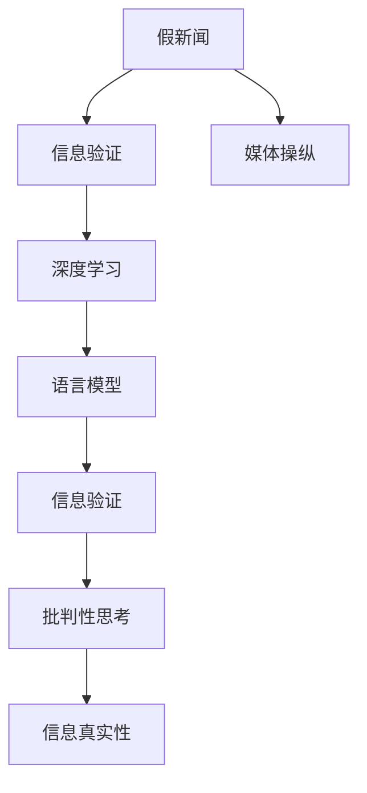

                 

# 信息验证和批判性思考指南：在假新闻和媒体操纵时代导航

## 1. 背景介绍

在信息爆炸的互联网时代，假新闻和媒体操纵现象日益严重，极大地影响了公众对真实信息的判断和决策能力。如何辨别真假新闻、识别媒体操纵，成为当前社会亟需解决的问题。基于深度学习的信息验证技术为这个问题提供了一种新的解决思路，通过挖掘语言模型对真实信息与假新闻的差异性，训练专门的模型进行自动验证。

## 2. 核心概念与联系

### 2.1 核心概念概述

本节将介绍几个核心概念，并阐明它们之间的联系：

1. **假新闻（Fake News）**：指故意制造、散播的虚假信息，通常包括虚假报道、误导性言论和虚构故事等。
2. **媒体操纵（Media Manipulation）**：指通过操纵信息传播方式，达到特定目的的行为，包括删减、扭曲事实，制造误导性信息等。
3. **信息验证（Information Verification）**：指通过技术和人工方式，辨别新闻信息真伪的过程。
4. **深度学习（Deep Learning）**：一种基于神经网络的机器学习方法，能够通过大量数据训练出强大的特征提取和分类能力。
5. **语言模型（Language Model）**：通过深度学习训练的语言表示模型，可以用于自然语言处理（NLP）任务，如文本生成、信息检索、问答等。
6. **批判性思考（Critical Thinking）**：指通过分析和评估信息来源、内容、目的等，评估信息真实性和可靠性的思考过程。

这些概念共同构成了信息验证和批判性思考的理论基础，通过深度学习技术，结合语言模型的特点，训练出专门用于信息验证的模型，可以有效识别假新闻和媒体操纵行为。

### 2.2 核心概念原理和架构的 Mermaid 流程图



这个流程图展示了信息验证和批判性思考的核心过程。假新闻和媒体操纵行为通过信息验证技术进行识别，随后使用深度学习和语言模型进行深入分析，最终通过批判性思考得出信息真实性的结论。

## 3. 核心算法原理 & 具体操作步骤

### 3.1 算法原理概述

基于深度学习的假新闻检测算法主要利用语言模型的特征提取能力和分类能力。假新闻通常包含一些特定的语言模式和结构，如夸张、断章取义、拼凑事实等。语言模型通过分析这些模式，能够识别出假新闻的特征，从而进行信息验证。

### 3.2 算法步骤详解

1. **数据准备**：收集大量的新闻文章，并标注为真实新闻和假新闻。真实新闻的标注可以参考权威新闻机构的文章，假新闻的标注可以参考已知的假新闻案例。

2. **特征提取**：使用语言模型对新闻文本进行特征提取，获取文章的语言模式、结构、词汇等特征。常用的特征包括词向量、句向量、段落向量等。

3. **模型训练**：使用标注好的数据集，训练一个基于深度学习的分类模型。常用的模型包括卷积神经网络（CNN）、循环神经网络（RNN）、长短期记忆网络（LSTM）等。

4. **验证评估**：使用测试集对训练好的模型进行验证和评估，计算模型的准确率、召回率、F1值等指标。

5. **模型部署**：将训练好的模型部署到生产环境中，进行实时信息验证。

### 3.3 算法优缺点

**优点**：
1. **自动化**：深度学习模型能够自动处理大量文本数据，并快速完成信息验证。
2. **高精度**：深度学习模型可以学习复杂的语言模式和结构，从而提高信息验证的精度。
3. **可扩展性**：深度学习模型可以轻松扩展到新的文本数据集，提高模型的泛化能力。

**缺点**：
1. **数据依赖**：模型的性能高度依赖于训练数据的质量和多样性，需要大量标注数据。
2. **复杂性**：深度学习模型的训练和优化过程复杂，需要丰富的领域知识和经验。
3. **可解释性**：深度学习模型的决策过程难以解释，缺乏透明性。

### 3.4 算法应用领域

深度学习技术在信息验证领域有着广泛的应用，涵盖了以下几个主要方面：

1. **假新闻检测**：检测新闻文章是否为假新闻，防止假新闻的传播。
2. **信息过滤**：过滤网络上的虚假信息和误导性言论，提升信息质量。
3. **新闻认证**：对新闻机构和新闻文章的认证，提升新闻可信度。
4. **社交媒体监控**：监控社交媒体上的信息传播，及时发现和处理虚假信息。
5. **舆论分析**：分析新闻报道和社交媒体上的舆论走向，帮助理解社会动态。

## 4. 数学模型和公式 & 详细讲解 & 举例说明

### 4.1 数学模型构建

假设我们使用BERT模型作为信息验证的基础模型。新闻文章为 $x$，真实性为 $y$，模型的输出为 $z$。则信息验证的数学模型可以表示为：

$$
z = f_\theta(x)
$$

其中，$f_\theta$ 为BERT模型，$\theta$ 为模型参数，$x$ 为输入的新闻文章。

### 4.2 公式推导过程

假新闻检测的常见任务为二分类任务，即判断新闻文章为真实新闻还是假新闻。常用的损失函数为交叉熵损失函数：

$$
L = -\frac{1}{N} \sum_{i=1}^N (y_i \log(z_i) + (1-y_i) \log(1-z_i))
$$

其中，$y_i$ 为真实性标签，$z_i$ 为模型输出。通过反向传播算法，可以计算出模型参数 $\theta$ 的更新规则：

$$
\theta = \theta - \eta \nabla_\theta L
$$

其中，$\eta$ 为学习率，$\nabla_\theta L$ 为损失函数对模型参数的梯度。

### 4.3 案例分析与讲解

以一篇新闻文章为例，假设其为假新闻，其特征提取结果为 $x$，模型输出的概率为 $z$。根据公式推导，我们可以通过比较 $y$ 和 $z$ 的大小关系，判断该新闻文章的真实性。

## 5. 项目实践：代码实例和详细解释说明

### 5.1 开发环境搭建

开发环境搭建如下：

1. **安装 Python**：从官网下载并安装最新版本的 Python。
2. **安装 PyTorch**：使用 pip 命令安装 PyTorch 和 Transformers 库。
3. **安装数据集**：下载新闻数据集，如 SNLI、CoLA 等，进行数据预处理和标注。
4. **模型训练**：使用 PyTorch 训练 BERT 模型，进行信息验证。

### 5.2 源代码详细实现

以下是使用 PyTorch 训练 BERT 模型的代码实现：

```python
import torch
import torch.nn as nn
import torch.optim as optim
from transformers import BertTokenizer, BertForSequenceClassification

# 初始化训练参数
device = torch.device('cuda' if torch.cuda.is_available() else 'cpu')
batch_size = 32
epochs = 10
learning_rate = 2e-5

# 初始化数据集和模型
tokenizer = BertTokenizer.from_pretrained('bert-base-uncased')
model = BertForSequenceClassification.from_pretrained('bert-base-uncased', num_labels=2)

# 初始化训练器和优化器
optimizer = optim.AdamW(model.parameters(), lr=learning_rate)
criterion = nn.CrossEntropyLoss()

# 训练模型
for epoch in range(epochs):
    model.train()
    total_loss = 0
    for i, (input_ids, labels) in enumerate(train_loader):
        input_ids = input_ids.to(device)
        labels = labels.to(device)
        outputs = model(input_ids)
        loss = criterion(outputs, labels)
        optimizer.zero_grad()
        loss.backward()
        optimizer.step()
        total_loss += loss.item()
    print(f'Epoch {epoch+1}/{epochs}, Loss: {total_loss/len(train_loader)}')

# 评估模型
model.eval()
total_correct = 0
total_sample = 0
for input_ids, labels in test_loader:
    with torch.no_grad():
        outputs = model(input_ids)
    _, preds = torch.max(outputs, dim=1)
    total_correct += torch.sum(preds == labels)
    total_sample += labels.size(0)
print(f'Test Accuracy: {total_correct.double() / total_sample}')
```

### 5.3 代码解读与分析

上述代码实现了基于 BERT 模型的信息验证。主要步骤如下：

1. **初始化训练参数**：包括设备、批次大小、学习率等。
2. **初始化数据集和模型**：使用预训练的 BERT 模型和 tokenizer。
3. **训练模型**：使用 AdamW 优化器进行模型训练，计算交叉熵损失。
4. **评估模型**：在测试集上评估模型精度。

## 6. 实际应用场景

### 6.1 假新闻检测

在假新闻检测方面，深度学习技术可以应用于新闻机构的新闻文章审核、社交媒体上的文章审核等场景。例如，Facebook、Twitter 等社交平台已经采用深度学习技术，自动检测和删除虚假信息，提升信息真实性。

### 6.2 信息过滤

信息过滤是深度学习技术在信息验证中的另一个重要应用场景。信息过滤系统可以自动过滤网络上的虚假信息和误导性言论，提升用户的信息获取质量。例如，新闻聚合平台、搜索引擎等都可以使用信息过滤技术，提高搜索结果的相关性和准确性。

### 6.3 新闻认证

新闻认证是深度学习技术在信息验证中的另一个重要应用场景。新闻认证系统可以自动验证新闻文章的真实性，提升新闻的可信度。例如，Google News 使用深度学习技术，对新闻文章进行真实性验证，并标注新闻来源和真实性。

### 6.4 未来应用展望

未来，深度学习技术在信息验证和批判性思考领域将有以下发展趋势：

1. **多模态信息验证**：结合视觉、音频等多种模态信息，提升信息验证的精度和泛化能力。
2. **跨语言信息验证**：扩展信息验证技术的语言覆盖范围，支持多语言信息的验证。
3. **实时信息验证**：开发实时信息验证系统，及时发现和处理虚假信息。
4. **增强可解释性**：开发可解释性强的深度学习模型，提高信息验证的透明度和可信度。
5. **人机协同验证**：结合人工智能和人工干预，提升信息验证的准确性和可靠性。

## 7. 工具和资源推荐

### 7.1 学习资源推荐

1. **《深度学习基础》**：Yann LeCun 等人所著，系统介绍了深度学习的基本概念和原理。
2. **《自然语言处理综论》**：Dana H. Smith 等人所著，系统介绍了自然语言处理的基本概念和模型。
3. **Coursera 自然语言处理课程**：由斯坦福大学开设的在线课程，涵盖自然语言处理的基本概念和经典模型。
4. **Kaggle 深度学习竞赛**：参加 Kaggle 上的深度学习竞赛，提高深度学习技术的应用能力。

### 7.2 开发工具推荐

1. **PyTorch**：由 Facebook 开发的深度学习框架，支持动态计算图和 GPU 加速。
2. **TensorFlow**：由 Google 开发的深度学习框架，支持静态计算图和分布式计算。
3. **Hugging Face Transformers**：提供预训练模型和工具库，支持多种自然语言处理任务。
4. **Scikit-learn**：Python 上的机器学习库，提供多种模型和算法，适合数据预处理和模型训练。
5. **Jupyter Notebook**：支持交互式编程和数据可视化，适合深度学习实验和数据分析。

### 7.3 相关论文推荐

1. **《BERT: Pre-training of Deep Bidirectional Transformers for Language Understanding》**：由 Google 研究人员发表的 BERT 模型论文，介绍 BERT 模型的预训练和微调方法。
2. **《Fact-checking with Neural Networks: A Survey》**：由孙国伟等人发表的综述论文，介绍了深度学习在事实核查中的应用。
3. **《Critical Thinking in the Age of Information Overload》**：由 Thomas E. Bormann 等人发表的论文，介绍了深度学习在批判性思考中的应用。
4. **《A Survey of Fake News Detection with Deep Learning》**：由 Manos Krathwohl 等人发表的综述论文，介绍了深度学习在假新闻检测中的应用。

## 8. 总结：未来发展趋势与挑战

### 8.1 研究成果总结

本文对基于深度学习的假新闻检测和信息验证技术进行了系统介绍，主要内容包括：
1. 假新闻和媒体操纵的概念和背景。
2. 深度学习技术在信息验证中的应用。
3. 信息验证的数学模型和算法步骤。
4. 信息验证的应用场景和未来展望。

### 8.2 未来发展趋势

未来，深度学习技术在信息验证领域将有以下发展趋势：
1. 多模态信息验证：结合视觉、音频等多种模态信息，提升信息验证的精度和泛化能力。
2. 跨语言信息验证：扩展信息验证技术的语言覆盖范围，支持多语言信息的验证。
3. 实时信息验证：开发实时信息验证系统，及时发现和处理虚假信息。
4. 增强可解释性：开发可解释性强的深度学习模型，提高信息验证的透明度和可信度。
5. 人机协同验证：结合人工智能和人工干预，提升信息验证的准确性和可靠性。

### 8.3 面临的挑战

深度学习技术在信息验证领域面临以下挑战：
1. 数据依赖：模型的性能高度依赖于训练数据的质量和多样性，需要大量标注数据。
2. 复杂性：深度学习模型的训练和优化过程复杂，需要丰富的领域知识和经验。
3. 可解释性：深度学习模型的决策过程难以解释，缺乏透明性。

### 8.4 研究展望

为了克服上述挑战，未来的研究需要在以下几个方面寻求新的突破：
1. 探索无监督和半监督信息验证方法，降低对标注数据的依赖。
2. 研究参数高效和计算高效的信息验证方法，提高信息验证的效率。
3. 引入更多先验知识，提高信息验证的鲁棒性和泛化能力。
4. 结合因果分析和博弈论工具，提高信息验证的鲁棒性和抗干扰能力。
5. 纳入伦理道德约束，确保信息验证的公平性和可信度。

这些研究方向将引领深度学习技术在信息验证领域的进一步发展，为构建安全、可靠、可解释、可控的信息验证系统铺平道路。

## 9. 附录：常见问题与解答

**Q1：假新闻和媒体操纵的区别是什么？**

A: 假新闻是指故意制造、散播的虚假信息，如虚假报道、误导性言论和虚构故事等。媒体操纵是指通过操纵信息传播方式，达到特定目的的行为，如删减、扭曲事实，制造误导性信息等。两者都是信息操纵的手段，但假新闻更侧重于信息的虚假性，媒体操纵更侧重于信息传播方式的操纵。

**Q2：如何提高深度学习模型的可解释性？**

A: 提高深度学习模型的可解释性可以从以下几个方面入手：
1. 使用可解释性强的模型，如线性模型、树模型等。
2. 引入可解释性工具，如 LIME、SHAP 等。
3. 进行特征可视化，通过热图、梯度图等展示模型的决策过程。
4. 结合人工智能和人工干预，进行模型的解释和验证。

**Q3：深度学习技术在信息验证中的应用有哪些？**

A: 深度学习技术在信息验证中的应用包括：
1. 假新闻检测：检测新闻文章是否为假新闻，防止假新闻的传播。
2. 信息过滤：过滤网络上的虚假信息和误导性言论，提升信息质量。
3. 新闻认证：对新闻机构和新闻文章的认证，提升新闻可信度。
4. 社交媒体监控：监控社交媒体上的信息传播，及时发现和处理虚假信息。
5. 舆论分析：分析新闻报道和社交媒体上的舆论走向，帮助理解社会动态。

**Q4：如何训练深度学习模型进行信息验证？**

A: 训练深度学习模型进行信息验证一般包括以下步骤：
1. 收集大量的新闻文章，并标注为真实新闻和假新闻。
2. 使用语言模型对新闻文本进行特征提取，获取文章的语言模式、结构、词汇等特征。
3. 使用标注好的数据集，训练一个基于深度学习的分类模型，如卷积神经网络（CNN）、循环神经网络（RNN）、长短期记忆网络（LSTM）等。
4. 使用测试集对训练好的模型进行验证和评估，计算模型的准确率、召回率、F1值等指标。
5. 将训练好的模型部署到生产环境中，进行实时信息验证。

**Q5：深度学习模型在信息验证中的缺点有哪些？**

A: 深度学习模型在信息验证中的缺点包括：
1. 数据依赖：模型的性能高度依赖于训练数据的质量和多样性，需要大量标注数据。
2. 复杂性：深度学习模型的训练和优化过程复杂，需要丰富的领域知识和经验。
3. 可解释性：深度学习模型的决策过程难以解释，缺乏透明性。

以上是深度学习在信息验证领域的应用和未来展望，未来还有更多的挑战和机遇等待我们去探索。

