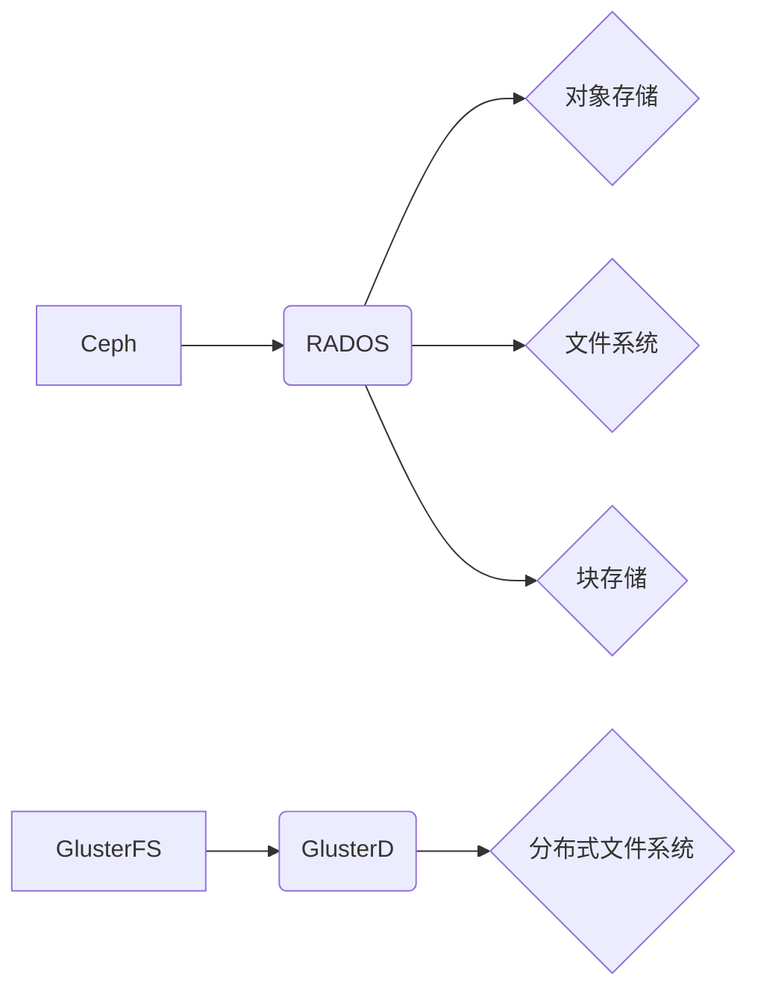

                 

## 分布式存储系统：Ceph与GlusterFS对比

> 关键词：Ceph, GlusterFS, 分布式存储, 对象存储, 文件系统, 块存储, 存储架构, 性能, 可用性, 扩展性

## 1. 背景介绍

随着数据量的爆炸式增长，传统的集中式存储系统已难以满足现代应用对存储容量、性能和可用性的需求。分布式存储系统应运而生，它将数据存储在多个节点上，通过网络进行管理和访问，从而实现更高的容量、性能和可用性。

Ceph和GlusterFS是两种流行的开源分布式存储系统，它们都提供了对象存储、文件系统和块存储等多种存储服务。Ceph是一个面向对象存储的系统，它使用RADOS（Reliable Autonomic Distributed Object Store）作为其核心存储引擎，而GlusterFS是一个基于文件系统的分布式文件系统。

本文将深入对比Ceph和GlusterFS，分析它们的架构、核心算法、性能特点、适用场景等，帮助读者更好地理解这两款分布式存储系统的优缺点，选择最适合自身需求的解决方案。

## 2. 核心概念与联系

### 2.1  Ceph

Ceph是一个开源的、面向对象存储的分布式存储系统，它由多个节点组成，每个节点都包含存储设备和计算资源。Ceph使用RADOS（Reliable Autonomic Distributed Object Store）作为其核心存储引擎，RADOS是一个可靠的、自主的、分布式对象存储系统，它提供了一系列存储服务，包括对象存储、文件系统和块存储。

Ceph的架构可以分为三个主要层级：

* **存储层（Storage Layer）:** 负责管理存储设备，提供数据存储和检索服务。
* **管理层（Management Layer）:** 负责管理集群的元数据，包括节点信息、存储池信息、用户权限等。
* **应用层（Application Layer）:** 提供各种应用接口，例如S3接口、NFS接口、iSCSI接口等。

### 2.2  GlusterFS

GlusterFS是一个开源的、基于文件系统的分布式文件系统，它将多个文件服务器节点连接在一起，形成一个逻辑上的文件系统。GlusterFS使用一个分布式文件系统协议来管理数据，它支持多种数据分布策略，例如复制、分片等。

GlusterFS的架构可以分为三个主要部分：

* **GlusterD:** 每个GlusterFS节点上运行的守护进程，负责管理本地存储设备和与其他节点的通信。
* **GlusterFS文件系统:** 一个逻辑上的文件系统，它由多个GlusterD节点组成。
* **用户应用程序:** 可以通过标准的网络文件系统协议（例如NFS、SMB）访问GlusterFS文件系统。

### 2.3  架构对比



## 3. 核心算法原理 & 具体操作步骤

### 3.1  算法原理概述

Ceph和GlusterFS都采用了分布式存储的算法原理，将数据分散存储在多个节点上，并通过网络进行管理和访问。

* **Ceph:** Ceph使用RADOS作为其核心存储引擎，RADOS采用一种称为“对象存储”的方式来存储数据。数据被分割成多个对象，每个对象都包含元数据和数据内容。这些对象被分布存储在集群中的多个节点上，并通过一个称为“PG（Placement Group）”的机制进行管理。PG负责将对象分配到不同的节点上，并确保数据的可靠性和可用性。

* **GlusterFS:** GlusterFS采用一种称为“文件系统”的方式来存储数据。数据被分割成多个块，每个块被分配到不同的节点上。GlusterFS使用一个称为“Brick”的机制来管理数据块，Brick代表一个节点上的存储空间。GlusterFS支持多种数据分布策略，例如复制、分片等，可以根据不同的应用场景选择合适的策略。

### 3.2  算法步骤详解

* **Ceph:**

1. **数据分割:** 将数据分割成多个对象。
2. **对象分配:** 将对象分配到不同的PG中。
3. **数据复制:** 将对象复制到多个节点上，以确保数据的可靠性。
4. **元数据管理:** 管理对象元数据，包括对象名称、大小、存储位置等。
5. **数据访问:** 通过网络访问对象，获取数据内容。

* **GlusterFS:**

1. **数据分割:** 将数据分割成多个块。
2. **块分配:** 将块分配到不同的Brick中。
3. **数据复制:** 可以选择复制数据块到多个节点上，以确保数据的可靠性。
4. **元数据管理:** 管理块元数据，包括块大小、存储位置等。
5. **数据访问:** 通过网络访问文件系统，获取数据内容。

### 3.3  算法优缺点

* **Ceph:**

    * **优点:** 高可靠性、高可用性、高扩展性、支持多种存储服务。
    * **缺点:** 复杂性较高、部署和维护成本较高。

* **GlusterFS:**

    * **优点:** 简单易用、部署和维护成本较低。
    * **缺点:** 可靠性和可用性相对较低、扩展性相对较低。

### 3.4  算法应用领域

* **Ceph:** 适用于需要高可靠性、高可用性、高扩展性的场景，例如大数据存储、云计算、视频监控等。
* **GlusterFS:** 适用于需要简单易用、部署和维护成本较低的场景，例如文件共享、备份和恢复等。

## 4. 数学模型和公式 & 详细讲解 & 举例说明

### 4.1  数学模型构建

Ceph和GlusterFS的数学模型主要围绕数据分布、冗余和性能优化等方面构建。

* **数据分布:** Ceph使用PG（Placement Group）来管理数据分布，每个PG包含多个对象。PG的分配策略可以根据数据访问模式和可靠性需求进行调整。GlusterFS使用Brick来管理数据块分配，Brick可以是单个节点上的存储空间，也可以是多个节点组成的存储池。

* **冗余:** Ceph和GlusterFS都支持数据冗余，以确保数据的可靠性。Ceph使用复制机制，将数据复制到多个节点上。GlusterFS支持复制和分片两种数据分布策略，可以根据不同的应用场景选择合适的策略。

* **性能优化:** Ceph和GlusterFS都采用了多种性能优化技术，例如数据缓存、异步IO、数据压缩等。

### 4.2  公式推导过程

由于Ceph和GlusterFS的数学模型比较复杂，涉及到多个算法和参数，这里只列举一些简单的公式示例：

* **Ceph数据复制因子:** 
$$r = \frac{num\_of\_replicas}{num\_of\_nodes}$$

其中，r表示数据复制因子，num\_of\_replicas表示数据副本数量，num\_of\_nodes表示集群节点数量。

* **GlusterFS数据分片因子:** 
$$p = \frac{total\_data\_size}{num\_of\_bricks}$$

其中，p表示数据分片因子，total\_data\_size表示总数据大小，num\_of\_bricks表示数据块分配到Brick的数量。

### 4.3  案例分析与讲解

* **Ceph数据复制:** 假设一个Ceph集群有3个节点，数据复制因子为2，则每个数据对象将被复制到2个不同的节点上，以确保数据的可靠性。

* **GlusterFS数据分片:** 假设一个GlusterFS集群有4个节点，总数据大小为10GB，数据分片因子为4，则每个数据块将被分配到4个不同的节点上，以提高数据访问性能。

## 5. 项目实践：代码实例和详细解释说明

### 5.1  开发环境搭建

Ceph和GlusterFS的开发环境搭建步骤略有不同，具体可以参考官方文档进行配置。

### 5.2  源代码详细实现

由于Ceph和GlusterFS的源代码比较庞大，这里只列举一些简单的代码示例，例如如何创建Ceph存储池和GlusterFS文件系统。

* **Ceph存储池创建:**

```
ceph osd pool create mypool 16 3
```

* **GlusterFS文件系统创建:**

```
gluster volume create myvol replica 2 /mnt/data1 /mnt/data2
```

### 5.3  代码解读与分析

* **Ceph存储池创建:**

```
ceph osd pool create mypool 16 3
```

该命令用于创建名为“mypool”的Ceph存储池，其中：

* `mypool`: 存储池名称。
* `16`: 对象大小，单位为MB。
* `3`: 数据副本数量。

* **GlusterFS文件系统创建:**

```
gluster volume create myvol replica 2 /mnt/data1 /mnt/data2
```

该命令用于创建名为“myvol”的GlusterFS文件系统，其中：

* `myvol`: 文件系统名称。
* `replica 2`: 数据复制策略，这里设置为复制2份。
* `/mnt/data1 /mnt/data2`: 数据存储路径，这里设置为两个节点上的存储空间。

### 5.4  运行结果展示

Ceph和GlusterFS的运行结果可以通过命令行工具或Web界面进行查看。

## 6. 实际应用场景

### 6.1  Ceph应用场景

* **云存储:** Ceph可以作为云存储平台的基础架构，提供对象存储、文件系统和块存储服务。
* **大数据存储:** Ceph可以用于存储海量数据，例如日志数据、传感器数据等。
* **视频监控:** Ceph可以用于存储视频监控数据，提供高可靠性和高可用性。

### 6.2  GlusterFS应用场景

* **文件共享:** GlusterFS可以用于构建企业级文件共享系统，提供高性能和高扩展性。
* **备份和恢复:** GlusterFS可以用于备份和恢复数据，提供数据冗余和灾难恢复能力。
* **虚拟化:** GlusterFS可以作为虚拟机存储，提供虚拟化环境的数据存储服务。

### 6.3  Ceph与GlusterFS的比较

| 特性 | Ceph | GlusterFS |
|---|---|---|
| 存储类型 | 对象存储、文件系统、块存储 | 文件系统 |
| 数据分布 | PG（Placement Group） | Brick |
| 数据冗余 | 复制 | 复制、分片 |
| 可靠性 | 高 | 中等 |
| 可用性 | 高 | 中等 |
| 扩展性 | 高 | 中等 |
| 复杂性 | 高 | 低 |
| 部署成本 | 高 | 低 |

### 6.4  未来应用展望

随着数据量的持续增长和对存储性能和可靠性的需求不断提高，Ceph和GlusterFS都将继续发展和完善，并应用于更多新的场景。例如：

* **边缘计算:** Ceph和GlusterFS可以用于构建边缘计算存储系统，提供低延迟和高可靠性的数据存储服务。
* **人工智能:** Ceph和GlusterFS可以用于存储和处理海量人工智能训练数据，加速人工智能模型的训练和推理。
* **区块链:** Ceph和GlusterFS可以用于构建区块链存储系统，提供高安全性、高可靠性和高可扩展性的数据存储服务。

## 7. 工具和资源推荐

### 7.1  学习资源推荐

* **Ceph官方文档:** https://docs.ceph.com/
* **GlusterFS官方文档:** https://www.gluster.org/documentation/
* **Ceph社区论坛:** https://ceph.com/community/
* **GlusterFS社区论坛:** https://www.gluster.org/community/

### 7.2  开发工具推荐

* **Ceph命令行工具:** `ceph`
* **GlusterFS命令行工具:** `gluster`
* **Ceph Web界面:** https://docs.ceph.com/en/latest/rados/operations/ceph-mgr/
* **GlusterFS Web界面:** https://www.gluster.org/documentation/glusterd-web-interface/

### 7.3  相关论文推荐

* **Ceph论文:** https://www.usenix.org/system/files/conference/osdi10/osdi10-paper-keller.pdf
* **GlusterFS论文:** https://www.usenix.org/system/files/conference/hotos10/hotos10-paper-srinivasan.pdf

## 8. 总结：未来发展趋势与挑战

### 8.1  研究成果总结

Ceph和GlusterFS都是成熟的开源分布式存储系统，它们在可靠性、可用性和扩展性方面都取得了显著的成果。Ceph更侧重于对象存储，提供更灵活的存储服务，而GlusterFS更侧重于文件系统，提供更简单的部署和管理。

### 8.2  未来发展趋势

* **人工智能和机器学习:** Ceph和GlusterFS将与人工智能和机器学习技术深度融合，提供更智能的存储管理和数据分析服务。
* **边缘计算:** Ceph和GlusterFS将应用于边缘计算场景，提供低延迟和高可靠性的数据存储服务。
* **云原生:** Ceph和GlusterFS将与云原生技术更加紧密地结合，提供更灵活、更弹性的云存储解决方案。

### 8.3  面临的挑战

* **数据安全:** 随着数据量的增长和价值的提升，数据安全问题日益突出，Ceph和GlusterFS需要不断加强数据加密、访问控制等安全机制。
* **性能优化:** 随着数据访问速度和处理能力的要求不断提高，Ceph和GlusterFS需要不断优化算法和架构，提高存储性能。
* **生态系统建设:** Ceph和GlusterFS需要不断完善生态系统，吸引更多开发者和用户参与，推动其发展和应用。

### 8.4  研究展望

未来，Ceph和GlusterFS的研究方向将集中在以下几个方面：

* **更智能的存储管理:** 利用人工智能和机器学习技术，实现更智能的存储管理，例如自动数据归档、自动容量规划等。
* **更低延迟的存储访问:** 优化数据访问路径和算法，降低数据访问延迟，满足边缘计算和实时应用的需求。
* **更安全的存储系统:** 加强数据加密、访问控制等安全机制，保障数据安全和隐私。


## 9. 附录：常见问题与解答

### 9.1  常见问题

* **Ceph和GlusterFS哪个更好？**

Ceph和GlusterFS各有优缺点，选择哪一个取决于具体的应用场景和需求。

* **如何部署Ceph和GlusterFS？**

Ceph和GlusterFS的部署步骤略有不同，可以参考官方文档进行配置。

* **Ceph和GlusterFS有哪些安全特性？**

Ceph和GlusterFS都提供了多种安全特性，例如数据加密、访问控制等。

* **Ceph和GlusterFS的性能如何？**

Ceph和GlusterFS的性能取决于硬件配置、网络带宽等因素。

### 9.2  解答

* **Ceph和GlusterFS哪个更好？**

Ceph和GlusterFS各有优缺点，选择哪一个取决于具体的应用场景和需求。Ceph更侧重于对象存储，提供更灵活的存储服务，而GlusterFS更侧重于文件系统，提供更简单的部署和管理。

* **如何部署Ceph和GlusterFS？**

Ceph和GlusterFS的部署步骤略有不同，可以参考官方文档进行配置。

* **Ceph和GlusterFS有哪些安全特性？**

Ceph和GlusterFS都提供了多种安全特性，例如数据加密、访问控制等。

* **Ceph和GlusterFS的性能如何？**

Ceph和GlusterFS的性能取决于硬件配置、网络带宽等因素。


作者：禅与计算机程序设计艺术 / Zen and the Art of Computer Programming 
<end_of_turn>

