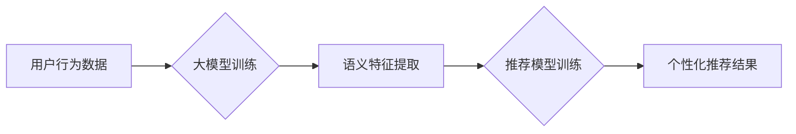

                 

## 利用大模型优化推荐系统的探索与利用策略

> 关键词：大模型、推荐系统、自然语言处理、深度学习、个性化推荐、模型融合、数据增强

## 1. 背景介绍

推荐系统作为信息过滤和个性化内容呈现的关键技术，在电商、社交媒体、视频平台等领域发挥着越来越重要的作用。传统的推荐系统主要依赖于协同过滤、内容过滤等方法，但随着用户行为数据量的激增和用户需求的多样化，这些方法面临着数据稀疏、冷启动、推荐结果单一等挑战。

近年来，大模型技术在自然语言处理、计算机视觉等领域取得了突破性进展，其强大的学习能力和泛化能力为推荐系统优化提供了新的思路。大模型能够从海量文本数据中学习用户兴趣、商品特征等丰富的语义信息，并将其应用于推荐任务，从而提升推荐系统的准确性和个性化程度。

## 2. 核心概念与联系

### 2.1 大模型

大模型是指参数规模庞大、训练数据海量的人工智能模型。其特点包括：

* **参数规模巨大:** 大模型通常拥有数十亿甚至数千亿个参数，能够学习更复杂的模式和关系。
* **训练数据量庞大:** 大模型的训练需要海量的数据，才能充分发挥其学习能力。
* **泛化能力强:** 大模型在训练完成后能够应用于多种下游任务，并表现出较强的泛化能力。

### 2.2 推荐系统

推荐系统旨在根据用户的历史行为、偏好和上下文信息，预测用户对特定物品的兴趣，并推荐相关物品。常见的推荐系统类型包括：

* **协同过滤:** 基于用户之间的相似性或物品之间的相似性进行推荐。
* **内容过滤:** 基于物品的特征和用户偏好进行推荐。
* **基于知识的推荐:** 基于用户和物品之间的知识图谱进行推荐。
* **混合推荐:** 结合多种推荐算法进行推荐。

### 2.3 大模型与推荐系统的联系

大模型可以应用于推荐系统的多个环节，例如：

* **特征提取:** 大模型可以从文本数据中提取用户兴趣、商品特征等丰富的语义信息，作为推荐系统的输入特征。
* **模型训练:** 大模型可以作为推荐系统的核心模型，学习用户和物品之间的关系，并进行预测。
* **个性化推荐:** 大模型可以根据用户的个性化需求，生成个性化的推荐结果。

**Mermaid 流程图**



## 3. 核心算法原理 & 具体操作步骤

### 3.1 算法原理概述

大模型在推荐系统中的应用主要基于深度学习算法，例如Transformer、BERT等。这些算法能够学习用户和物品之间的复杂关系，并生成准确的推荐结果。

### 3.2 算法步骤详解

1. **数据预处理:** 收集用户行为数据、商品信息等数据，并进行清洗、转换、编码等预处理操作。
2. **特征工程:** 利用大模型提取用户兴趣、商品特征等语义信息，构建推荐系统的输入特征。
3. **模型训练:** 使用深度学习算法训练大模型，学习用户和物品之间的关系。
4. **模型评估:** 使用测试数据评估模型的性能，并进行调参优化。
5. **推荐结果生成:** 将训练好的模型应用于新的用户数据，生成个性化的推荐结果。

### 3.3 算法优缺点

**优点:**

* **学习能力强:** 大模型能够从海量数据中学习用户兴趣、商品特征等复杂的模式和关系。
* **泛化能力强:** 大模型在训练完成后能够应用于多种下游任务，并表现出较强的泛化能力。
* **个性化推荐:** 大模型能够根据用户的个性化需求，生成个性化的推荐结果。

**缺点:**

* **训练成本高:** 大模型的训练需要大量的计算资源和时间。
* **数据依赖性强:** 大模型的性能依赖于训练数据的质量和数量。
* **解释性差:** 大模型的决策过程较为复杂，难以解释其推荐结果背后的原因。

### 3.4 算法应用领域

大模型在推荐系统领域的应用非常广泛，例如：

* **电商推荐:** 推荐商品、优惠券、促销活动等。
* **社交媒体推荐:** 推荐好友、话题、文章等。
* **视频平台推荐:** 推荐视频、直播、用户等。
* **音乐平台推荐:** 推荐歌曲、专辑、艺术家等。

## 4. 数学模型和公式 & 详细讲解 & 举例说明

### 4.1 数学模型构建

推荐系统的核心是预测用户对物品的评分或点击概率。常用的数学模型包括协同过滤模型、内容过滤模型和深度学习模型。

**协同过滤模型:**

协同过滤模型基于用户的历史行为数据，预测用户对物品的评分。常用的协同过滤算法包括基于用户的协同过滤和基于物品的协同过滤。

**内容过滤模型:**

内容过滤模型基于物品的特征和用户的偏好，预测用户对物品的评分。常用的内容过滤算法包括基于关键词的过滤和基于机器学习的过滤。

**深度学习模型:**

深度学习模型利用神经网络学习用户和物品之间的复杂关系，预测用户对物品的评分或点击概率。常用的深度学习模型包括多层感知机 (MLP)、卷积神经网络 (CNN) 和循环神经网络 (RNN)。

### 4.2 公式推导过程

**协同过滤模型:**

假设用户 $u$ 对物品 $i$ 的评分为 $r_{ui}$，则基于用户的协同过滤模型可以表示为：

$$r_{ui} = \mathbf{p}_u \cdot \mathbf{q}_i + b_u + b_i + \epsilon$$

其中：

* $\mathbf{p}_u$ 是用户 $u$ 的隐向量。
* $\mathbf{q}_i$ 是物品 $i$ 的隐向量。
* $b_u$ 是用户 $u$ 的偏差项。
* $b_i$ 是物品 $i$ 的偏差项。
* $\epsilon$ 是误差项。

**内容过滤模型:**

假设物品 $i$ 的特征向量为 $\mathbf{x}_i$，用户 $u$ 的偏好向量为 $\mathbf{w}_u$，则基于关键词的过滤模型可以表示为：

$$r_{ui} = \mathbf{w}_u \cdot \mathbf{x}_i + b_u + b_i + \epsilon$$

其中：

* $\mathbf{w}_u$ 是用户 $u$ 的偏好向量。
* $\mathbf{x}_i$ 是物品 $i$ 的特征向量。
* $b_u$ 是用户 $u$ 的偏差项。
* $b_i$ 是物品 $i$ 的偏差项。
* $\epsilon$ 是误差项。

### 4.3 案例分析与讲解

**案例:**

假设我们有一个电商平台，需要推荐商品给用户。我们可以使用大模型训练一个基于内容过滤的推荐模型。

**数据:**

* 用户行为数据：用户购买历史、浏览记录、收藏记录等。
* 商品信息：商品名称、描述、类别、价格等。

**模型训练:**

我们可以使用BERT模型提取商品的语义特征，并使用MLP模型学习用户偏好向量。

**推荐结果:**

根据用户的偏好向量和商品的语义特征，模型可以预测用户对商品的评分，并推荐用户可能感兴趣的商品。

## 5. 项目实践：代码实例和详细解释说明

### 5.1 开发环境搭建

推荐系统开发环境通常包括以下组件：

* **编程语言:** Python 是推荐系统开发中常用的编程语言。
* **深度学习框架:** TensorFlow、PyTorch 等深度学习框架可以用于训练大模型。
* **数据处理工具:** Pandas、NumPy 等数据处理工具可以用于数据预处理和特征工程。
* **云计算平台:** AWS、Azure、GCP 等云计算平台可以提供计算资源和存储空间。

### 5.2 源代码详细实现

以下是一个使用PyTorch训练基于Transformer的推荐系统的简单代码示例：

```python
import torch
import torch.nn as nn

class Recommender(nn.Module):
    def __init__(self, embedding_dim, num_layers, num_heads):
        super(Recommender, self).__init__()
        self.embedding = nn.Embedding(num_users, embedding_dim)
        self.transformer = nn.Transformer(d_model=embedding_dim, nhead=num_heads, num_encoder_layers=num_layers, num_decoder_layers=num_layers)
        self.fc = nn.Linear(embedding_dim, 1)

    def forward(self, user_ids, item_ids):
        user_embeddings = self.embedding(user_ids)
        item_embeddings = self.embedding(item_ids)
        output = self.transformer(user_embeddings, item_embeddings)
        scores = self.fc(output[:, 0, :])
        return scores

# ... 模型训练和评估代码 ...
```

### 5.3 代码解读与分析

* **Embedding层:** 将用户ID和物品ID映射到低维稠密向量。
* **Transformer层:** 学习用户和物品之间的复杂关系。
* **全连接层:** 将Transformer输出映射到评分。

### 5.4 运行结果展示

训练好的模型可以用于预测用户对物品的评分，并生成个性化的推荐结果。

## 6. 实际应用场景

### 6.1 电商推荐

大模型可以用于推荐商品、优惠券、促销活动等，提升用户购物体验和转化率。

### 6.2 社交媒体推荐

大模型可以用于推荐好友、话题、文章等，增强用户粘性和活跃度。

### 6.3 视频平台推荐

大模型可以用于推荐视频、直播、用户等，提升用户观看时长和用户留存率。

### 6.4 未来应用展望

大模型在推荐系统领域的应用前景广阔，未来可能应用于以下场景：

* **个性化内容生成:** 根据用户的兴趣和偏好，生成个性化的内容，例如新闻、文章、视频等。
* **跨平台推荐:** 将用户行为数据整合到多个平台，实现跨平台的个性化推荐。
* **多模态推荐:** 将文本、图像、音频等多模态数据融合，实现更精准的推荐。

## 7. 工具和资源推荐

### 7.1 学习资源推荐

* **书籍:**
    * 《深度学习》
    * 《自然语言处理》
* **在线课程:**
    * Coursera
    * edX
    * fast.ai

### 7.2 开发工具推荐

* **深度学习框架:** TensorFlow、PyTorch
* **数据处理工具:** Pandas、NumPy
* **云计算平台:** AWS、Azure、GCP

### 7.3 相关论文推荐

* **BERT:** Devlin et al. (2018)
* **Transformer:** Vaswani et al. (2017)
* **Recurrent Neural Networks for Recommender Systems:** Hidasi et al. (2016)

## 8. 总结：未来发展趋势与挑战

### 8.1 研究成果总结

大模型在推荐系统领域的应用取得了显著进展，能够提升推荐系统的准确性和个性化程度。

### 8.2 未来发展趋势

* **模型规模和能力的提升:** 未来大模型的规模和能力将继续提升，能够学习更复杂的模式和关系。
* **多模态融合:** 将文本、图像、音频等多模态数据融合，实现更精准的推荐。
* **解释性增强:** 研究大模型的决策过程，提高推荐结果的可解释性。

### 8.3 面临的挑战

* **训练成本高:** 大模型的训练需要大量的计算资源和时间。
* **数据依赖性强:** 大模型的性能依赖于训练数据的质量和数量。
* **公平性和偏见:** 大模型可能存在公平性和偏见问题，需要进行相应的缓解措施。

### 8.4 研究展望

未来研究将重点关注以下方面:

* **高效训练方法:** 研究更有效的训练方法，降低大模型的训练成本。
* **数据增强技术:** 研究数据增强技术，提高训练数据的质量和数量。
* **公平性和可解释性:** 研究大模型的公平性和可解释性，确保推荐结果的可靠性和可信度。

## 9. 附录：常见问题与解答

**Q1: 大模型的训练需要多少计算资源？**

A1: 大模型的训练需要大量的计算资源，例如数百甚至数千个GPU。

**Q2: 大模型的训练需要多少时间？**

A2: 大模型的训练时间取决于模型规模、训练数据量和计算资源等因素，通常需要数天甚至数周的时间。

**Q3: 如何评估大模型的性能？**

A3: 大模型的性能可以使用各种指标进行评估，例如准确率、召回率、AUC等。

**作者：禅与计算机程序设计艺术 / Zen and the Art of Computer Programming**<end_of_turn>

