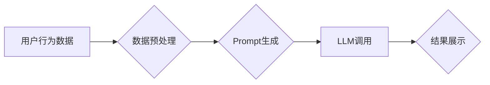

                 

## 基于Prompt的灵活可配置生成式新闻推荐

> 关键词：Prompt Engineering, 生成式推荐, 新闻推荐, 灵活配置, 可定制化, 大语言模型

## 1. 背景介绍

新闻信息爆炸时代，海量新闻内容涌现，用户难以从其中筛选出真正感兴趣的信息。传统的新闻推荐系统主要依赖于基于内容的过滤、协同过滤等方法，但这些方法往往难以捕捉用户细粒度的兴趣偏好，且缺乏个性化定制能力。近年来，随着大语言模型（LLM）的快速发展，基于Prompt的生成式推荐系统逐渐成为研究热点。

生成式推荐系统能够根据用户的历史行为、偏好和上下文信息，生成个性化的新闻推荐列表，并提供更丰富的推荐内容，例如新闻摘要、相关话题、个性化解读等。相比于传统的推荐系统，生成式推荐系统具有以下优势：

* **更强的个性化能力:**  通过Prompt的灵活定制，可以更精准地捕捉用户的兴趣偏好，生成更符合用户需求的推荐内容。
* **更丰富的推荐内容:**  生成式推荐系统不仅可以推荐新闻链接，还可以生成新闻摘要、相关话题、个性化解读等多种形式的推荐内容，提升用户体验。
* **更强的适应性:**  生成式推荐系统可以根据用户的反馈和上下文信息动态调整推荐策略，更好地适应用户的变化需求。

## 2. 核心概念与联系

### 2.1  Prompt Engineering

Prompt Engineering 是指设计和优化输入给大语言模型的文本提示，以引导模型生成期望的输出。在生成式推荐系统中，Prompt Engineering 扮演着至关重要的角色，它决定了推荐系统的个性化程度和推荐内容的质量。

### 2.2  大语言模型（LLM）

大语言模型（LLM）是一种能够理解和生成人类语言的深度学习模型。它通过训练海量文本数据，学习语言的语法、语义和上下文关系，从而能够完成各种自然语言处理任务，例如文本生成、翻译、问答等。

### 2.3  生成式推荐系统架构

基于Prompt的生成式新闻推荐系统通常由以下几个模块组成：

* **数据预处理模块:**  负责收集、清洗和格式化新闻数据和用户行为数据。
* **Prompt生成模块:**  根据用户的历史行为、偏好和上下文信息，生成个性化的Prompt提示。
* **LLM调用模块:**  调用预训练的LLM模型，根据生成的Prompt提示生成新闻推荐列表。
* **结果展示模块:**  将生成的推荐列表以用户友好的方式展示给用户。

**Mermaid 流程图**



## 3. 核心算法原理 & 具体操作步骤

### 3.1  算法原理概述

基于Prompt的生成式新闻推荐系统主要依赖于大语言模型的文本生成能力。通过精心设计的Prompt提示，引导LLM模型从海量新闻数据中筛选出与用户兴趣相符的新闻内容，并生成个性化的推荐列表。

### 3.2  算法步骤详解

1. **数据收集和预处理:** 收集新闻数据和用户行为数据，并进行清洗、格式化和特征提取。
2. **Prompt设计:** 根据用户的历史行为、偏好和上下文信息，设计个性化的Prompt提示。Prompt提示可以包含用户的兴趣领域、阅读习惯、新闻偏好等信息。
3. **LLM模型调用:** 将生成的Prompt提示输入到预训练的LLM模型中，引导模型生成新闻推荐列表。
4. **结果排序和展示:** 对生成的推荐列表进行排序，并以用户友好的方式展示给用户。

### 3.3  算法优缺点

**优点:**

* **个性化推荐:**  通过Prompt的定制化，可以更精准地捕捉用户的兴趣偏好，生成更符合用户需求的推荐内容。
* **丰富推荐内容:**  生成式推荐系统可以生成多种形式的推荐内容，例如新闻摘要、相关话题、个性化解读等，提升用户体验。
* **适应性强:**  可以根据用户的反馈和上下文信息动态调整推荐策略，更好地适应用户的变化需求。

**缺点:**

* **Prompt设计难度:**  设计有效的Prompt提示需要深入了解用户的需求和LLM模型的特性，有一定的难度。
* **计算资源消耗:**  LLM模型的调用需要消耗大量的计算资源，对于资源有限的场景可能存在挑战。
* **数据依赖性:**  生成式推荐系统的效果依赖于训练数据的质量和丰富程度。

### 3.4  算法应用领域

基于Prompt的生成式推荐系统在新闻推荐、产品推荐、内容推荐等领域具有广泛的应用前景。

## 4. 数学模型和公式 & 详细讲解 & 举例说明

### 4.1  数学模型构建

在基于Prompt的生成式新闻推荐系统中，可以使用概率模型来描述用户对新闻的偏好和推荐系统的性能。例如，可以使用贝叶斯网络来建模用户对不同新闻主题的兴趣，以及用户对不同新闻来源的信任度。

### 4.2  公式推导过程

假设用户 $u$ 对新闻主题 $t$ 的兴趣可以用一个概率 $P(t|u)$ 表示，其中 $t$ 是新闻主题， $u$ 是用户。我们可以使用贝叶斯公式来计算用户对特定新闻的兴趣：

$$P(n|u) = \frac{P(u|n)P(n)}{P(u)}$$

其中：

* $P(n|u)$ 是用户 $u$ 对新闻 $n$ 的兴趣概率。
* $P(u|n)$ 是用户 $u$ 属于新闻 $n$ 主题的概率。
* $P(n)$ 是新闻 $n$ 属于该主题的概率。
* $P(u)$ 是用户 $u$ 的先验概率。

### 4.3  案例分析与讲解

例如，假设用户 $u$ 经常阅读科技新闻，那么 $P(t|u)$ 中科技新闻的概率会比较高。如果新闻 $n$ 属于科技新闻主题，那么 $P(u|n)$ 也会比较高。因此，用户 $u$ 对新闻 $n$ 的兴趣概率 $P(n|u)$ 会比较高。

## 5. 项目实践：代码实例和详细解释说明

### 5.1  开发环境搭建

* Python 3.7+
* PyTorch 或 TensorFlow
* Transformers 库
* 其他必要的库，例如 NLTK、spaCy 等

### 5.2  源代码详细实现

```python
from transformers import AutoModelForSeq2SeqLM, AutoTokenizer

# 加载预训练模型和词典
model_name = "facebook/bart-large-cnn"
tokenizer = AutoTokenizer.from_pretrained(model_name)
model = AutoModelForSeq2SeqLM.from_pretrained(model_name)

# 定义Prompt模板
prompt_template = "推荐一篇关于 {} 的新闻。"

# 用户兴趣
user_interest = "人工智能"

# 生成Prompt
prompt = prompt_template.format(user_interest)

# Token化Prompt
input_ids = tokenizer.encode(prompt, return_tensors="pt")

# 调用LLM模型生成推荐新闻
output = model.generate(input_ids, max_length=100, num_beams=5)

# 解码输出
recommended_news = tokenizer.decode(output[0], skip_special_tokens=True)

# 打印推荐新闻
print(recommended_news)
```

### 5.3  代码解读与分析

* 代码首先加载预训练的BART模型和词典。
* 定义了一个Prompt模板，用于生成个性化的Prompt提示。
* 根据用户的兴趣，生成具体的Prompt提示。
* 使用Tokenizer将Prompt提示转换为模型可理解的格式。
* 调用LLM模型生成推荐新闻。
* 使用Tokenizer解码输出，得到推荐新闻的文本内容。

### 5.4  运行结果展示

运行上述代码，将输出一条关于用户兴趣“人工智能”的推荐新闻。

## 6. 实际应用场景

基于Prompt的生成式新闻推荐系统可以应用于以下场景：

* **个性化新闻订阅:**  根据用户的兴趣偏好，生成个性化的新闻订阅列表。
* **新闻内容推荐:**  在新闻阅读平台上，根据用户的阅读历史和上下文信息，推荐相关新闻内容。
* **新闻摘要生成:**  根据新闻文章内容，生成简洁的新闻摘要，帮助用户快速了解新闻要点。
* **新闻话题推荐:**  根据新闻文章内容，推荐相关的新闻话题，帮助用户深入了解新闻背景和相关信息。

### 6.4  未来应用展望

随着大语言模型的不断发展，基于Prompt的生成式新闻推荐系统将更加智能化、个性化和人性化。未来，我们可以期待以下应用场景：

* **多模态新闻推荐:**  结合文本、图像、音频等多模态信息，生成更加丰富的新闻推荐内容。
* **跨语言新闻推荐:**  实现跨语言的新闻推荐，帮助用户获取来自不同语言的新闻信息。
* **交互式新闻推荐:**  通过对话式交互，更加精准地了解用户的需求，生成更加个性化的新闻推荐。

## 7. 工具和资源推荐

### 7.1  学习资源推荐

* **论文:**  
    * "Prompt Engineering for Large Language Models"
    * "BERT: Pre-training of Deep Bidirectional Transformers for Language Understanding"
* **博客:**  
    * The Illustrated Transformer
    * Hugging Face Blog
* **在线课程:**  
    * Deep Learning Specialization (Coursera)
    * Natural Language Processing with Deep Learning (Udacity)

### 7.2  开发工具推荐

* **Transformers 库:**  https://huggingface.co/docs/transformers/index
* **PyTorch:**  https://pytorch.org/
* **TensorFlow:**  https://www.tensorflow.org/

### 7.3  相关论文推荐

* "Generative Pre-Training for Dialogue Generation"
* "T5: Text-to-Text Transfer Transformer"
* "BART: Denoising Sequence-to-Sequence Pre-training for Natural Language Generation, Translation, and Comprehension"

## 8. 总结：未来发展趋势与挑战

### 8.1  研究成果总结

基于Prompt的生成式新闻推荐系统在个性化推荐、丰富推荐内容、适应性强等方面取得了显著的成果。

### 8.2  未来发展趋势

未来，基于Prompt的生成式新闻推荐系统将朝着以下方向发展：

* **更强大的模型:**  随着大语言模型的不断发展，模型的性能将进一步提升，能够生成更加精准、多样化的推荐内容。
* **更智能的Prompt设计:**  研究人员将开发更加智能的Prompt设计方法，能够更好地捕捉用户的需求和上下文信息。
* **更丰富的应用场景:**  基于Prompt的生成式新闻推荐系统将应用于更多场景，例如多模态新闻推荐、跨语言新闻推荐等。

### 8.3  面临的挑战

基于Prompt的生成式新闻推荐系统也面临一些挑战：

* **Prompt设计难度:**  设计有效的Prompt提示仍然是一个难题，需要深入了解用户的需求和LLM模型的特性。
* **数据安全和隐私:**  生成式推荐系统需要处理大量用户数据，需要确保数据安全和用户隐私。
* **算法可解释性:**  LLM模型的决策过程难以解释，需要研究更加可解释的算法模型。

### 8.4  研究展望

未来，我们将继续研究基于Prompt的生成式新闻推荐系统，探索更智能、更个性化的推荐方法，为用户提供更加优质的新闻体验。

## 9. 附录：常见问题与解答

**Q1:  Prompt Engineering 的难度在哪里？**

A1:  Prompt Engineering 的难度在于需要深入理解用户的需求和LLM模型的特性，设计出能够引导模型生成期望输出的有效提示。

**Q2:  如何评估生成式新闻推荐系统的性能？**

A2:  可以使用点击率、停留时间、用户满意度等指标来评估生成式新闻推荐系统的性能。

**Q3:  如何解决数据安全和隐私问题？**

A3:  可以使用数据脱敏、加密等技术来保护用户数据安全和隐私。


作者：禅与计算机程序设计艺术 / Zen and the Art of Computer Programming 
<end_of_turn>

