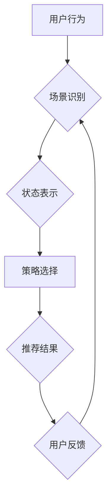

                 

## 基于强化学习的多场景推荐策略在线学习

> 关键词：强化学习、推荐系统、多场景、在线学习、策略优化

## 1. 背景介绍

推荐系统作为信息过滤和个性化服务的重要组成部分，在电商、社交媒体、视频平台等领域发挥着越来越重要的作用。传统的推荐系统主要依赖于基于内容、协同过滤等静态方法，难以适应用户行为的多样性和动态变化。近年来，强化学习（Reinforcement Learning，RL）因其能够学习用户行为和反馈，并不断优化推荐策略的优势，逐渐成为推荐系统研究的热点。

然而，现实世界中的用户行为往往存在着场景的多样性，例如用户在不同时间、地点、设备、情绪等情况下，对推荐内容的需求和偏好都会发生变化。传统的单一推荐策略难以有效应对这种多场景下的复杂需求。因此，如何设计一种能够适应不同场景、并在线学习优化推荐策略的系统，成为当前推荐系统研究的重要挑战。

## 2. 核心概念与联系

### 2.1 强化学习

强化学习是一种机器学习方法，其核心思想是通过强化信号（奖励或惩罚）来训练智能体，使其在环境中采取最优行动。

* **智能体（Agent）：**  推荐系统中的智能体，负责根据用户上下文信息生成推荐。
* **环境（Environment）：** 用户行为和反馈的集合，包括用户点击、浏览、购买等行为。
* **状态（State）：**  智能体在环境中所处的状态，例如用户历史行为、当前上下文信息等。
* **动作（Action）：** 智能体可以采取的行动，例如推荐某个商品、展示某个视频等。
* **奖励（Reward）：**  环境对智能体采取的行动给予的反馈，例如用户点击推荐的商品获得正奖励，用户不点击则获得负奖励。

### 2.2 多场景推荐

多场景推荐是指针对不同场景的用户需求，提供个性化的推荐服务。场景可以根据时间、地点、设备、用户状态等多种因素进行划分。

### 2.3 在线学习

在线学习是指在数据流式更新的情况下，模型不断学习和优化。与离线学习不同，在线学习能够实时适应数据变化，并不断提高推荐效果。

**核心架构流程图**



## 3. 核心算法原理 & 具体操作步骤

### 3.1 算法原理概述

基于强化学习的多场景推荐策略在线学习系统，主要利用深度强化学习算法，例如深度Q网络（DQN）或策略梯度算法（Policy Gradient），学习用户行为和反馈，并不断优化推荐策略。

* **状态表示:** 将用户上下文信息和历史行为编码为状态向量，以便智能体理解当前场景。
* **策略选择:** 根据当前状态，智能体选择最优的推荐动作，例如推荐某个商品、展示某个视频等。
* **奖励设计:** 设计合理的奖励函数，鼓励智能体选择能够提升用户满意度的推荐动作。
* **策略更新:** 利用强化学习算法，根据用户反馈和奖励信号，更新智能体的策略，使其在未来能够做出更优的推荐决策。

### 3.2 算法步骤详解

1. **初始化:** 初始化智能体策略，并设置奖励函数。
2. **状态收集:** 收集用户上下文信息和历史行为数据，并将其编码为状态向量。
3. **策略选择:** 根据当前状态，智能体使用策略函数选择推荐动作。
4. **执行动作:** 将推荐动作执行到用户面前，并观察用户反馈。
5. **奖励计算:** 根据用户反馈，计算奖励信号。
6. **策略更新:** 利用强化学习算法，根据奖励信号更新智能体的策略函数。
7. **重复步骤2-6:**  不断收集用户数据，更新策略，直到达到预设的目标。

### 3.3 算法优缺点

**优点:**

* **适应性强:**  能够适应用户行为的多样性和动态变化。
* **个性化推荐:**  能够根据用户上下文信息和历史行为，提供个性化的推荐服务。
* **持续优化:**  能够通过在线学习不断优化推荐策略，提升推荐效果。

**缺点:**

* **数据依赖:**  需要大量的用户行为数据进行训练和优化。
* **计算复杂度高:**  强化学习算法的训练和推理过程计算复杂度较高。
* **奖励设计困难:**  设计合理的奖励函数是强化学习算法的关键，但往往比较困难。

### 3.4 算法应用领域

* **电商推荐:**  根据用户的购买历史、浏览记录、兴趣偏好等信息，推荐商品。
* **内容推荐:**  根据用户的阅读习惯、观看历史、点赞记录等信息，推荐文章、视频、音乐等内容。
* **社交推荐:**  根据用户的社交关系、兴趣爱好等信息，推荐好友、群组、活动等。

## 4. 数学模型和公式 & 详细讲解 & 举例说明

### 4.1 数学模型构建

强化学习模型的核心是状态-动作-奖励（State-Action-Reward，SAR）三元组。

* **状态空间 (S):**  所有可能的系统状态的集合。例如，用户在电商平台上的状态可以包含用户ID、浏览历史、购物车内容、当前页面等信息。
* **动作空间 (A):**  智能体在每个状态下可以采取的所有动作的集合。例如，在电商平台上，智能体可以推荐商品、展示广告、提供个性化服务等。
* **奖励函数 (R):**  将状态-动作对映射到一个实数奖励，表示智能体采取该动作在该状态下的效果。例如，用户点击推荐的商品可以获得正奖励，用户不点击则获得负奖励。

### 4.2 公式推导过程

强化学习的目标是找到一个策略 π(s) ，该策略能够最大化累积奖励。策略 π(s)  是一个映射函数，将每个状态映射到一个动作。

常用的强化学习算法，例如Q-learning和策略梯度算法，都通过迭代更新策略 π(s) 来实现目标。

**Q-learning:**

$$
Q(s, a) = Q(s, a) + \alpha [r + \gamma \max_{a'} Q(s', a') - Q(s, a)]
$$

其中：

* $Q(s, a)$ 是状态 $s$ 下采取动作 $a$ 的价值函数。
* $\alpha$ 是学习率，控制着学习速度。
* $r$ 是从状态 $s$ 到状态 $s'$ 后获得的奖励。
* $\gamma$ 是折扣因子，控制着未来奖励的权重。
* $\max_{a'} Q(s', a')$ 是状态 $s'$ 下所有可能的动作的价值函数的最大值。

**策略梯度算法:**

$$
\theta = \theta + \alpha \nabla_{\theta} J(\theta)
$$

其中：

* $\theta$ 是策略网络的参数。
* $\alpha$ 是学习率。
* $J(\theta)$ 是策略网络的奖励函数。
* $\nabla_{\theta} J(\theta)$ 是奖励函数对策略网络参数的梯度。

### 4.3 案例分析与讲解

假设一个电商平台想要利用强化学习算法进行商品推荐。

* **状态空间:** 用户ID、浏览历史、购物车内容、当前页面等信息。
* **动作空间:** 推荐商品、展示广告、提供个性化服务等。
* **奖励函数:** 用户点击推荐的商品获得正奖励，用户不点击则获得负奖励。

通过收集用户行为数据，训练强化学习模型，例如DQN或策略梯度算法，可以学习到用户偏好的商品推荐策略。

## 5. 项目实践：代码实例和详细解释说明

### 5.1 开发环境搭建

* Python 3.x
* TensorFlow 或 PyTorch 深度学习框架
* NumPy 科学计算库
* Pandas 数据处理库

### 5.2 源代码详细实现

```python
# 使用 TensorFlow 实现 DQN 算法

import tensorflow as tf

# 定义 DQN 网络结构
class DQN(tf.keras.Model):
    def __init__(self, state_size, action_size):
        super(DQN, self).__init__()
        self.dense1 = tf.keras.layers.Dense(64, activation='relu')
        self.dense2 = tf.keras.layers.Dense(32, activation='relu')
        self.output = tf.keras.layers.Dense(action_size)

    def call(self, state):
        x = self.dense1(state)
        x = self.dense2(x)
        return self.output(x)

# 定义强化学习环境
class RecommenderEnv:
    # ...

# 初始化 DQN 模型
model = DQN(state_size, action_size)

# 训练 DQN 模型
for episode in range(num_episodes):
    # ...
    # 收集用户行为数据
    state, action, reward, next_state, done = env.step(action)
    # 更新 DQN 模型
    model.train_on_batch(state, reward)
    # ...

# 保存训练好的模型
model.save('recommender_model.h5')

```

### 5.3 代码解读与分析

* **DQN 网络结构:**  定义了一个简单的深度神经网络，用于估计状态-动作对的价值函数。
* **强化学习环境:**  模拟了电商平台的推荐场景，定义了状态空间、动作空间、奖励函数等。
* **训练过程:**  通过收集用户行为数据，使用DQN模型训练强化学习策略。

### 5.4 运行结果展示

训练好的模型可以用于在线推荐，根据用户的上下文信息和历史行为，预测用户对不同商品的点击概率，并推荐最有可能被用户点击的商品。

## 6. 实际应用场景

### 6.1 电商平台商品推荐

* 根据用户的浏览历史、购买记录、购物车内容等信息，推荐个性化的商品。
* 利用多场景信息，例如用户在手机端、电脑端、APP端等不同设备上的行为，提供更精准的推荐。

### 6.2 内容平台内容推荐

* 根据用户的阅读习惯、观看历史、点赞记录等信息，推荐个性化的文章、视频、音乐等内容。
* 利用多场景信息，例如用户在不同时间段、不同地点、不同设备上的行为，提供更丰富的推荐内容。

### 6.3 社交平台好友推荐

* 根据用户的社交关系、兴趣爱好等信息，推荐潜在的好友、群组、活动等。
* 利用多场景信息，例如用户在不同时间段、不同地点、不同设备上的社交行为，提供更精准的推荐。

### 6.4 未来应用展望

* **更细粒度的场景识别:**  利用更丰富的用户上下文信息，识别更细粒度的场景，例如用户的情绪状态、兴趣偏好等。
* **跨平台多模态推荐:**  融合用户在不同平台上的行为数据，例如电商平台的购买记录、社交平台的互动记录等，进行跨平台多模态推荐。
* **个性化推荐策略优化:**  根据用户的不同场景需求，个性化地优化推荐策略，提高推荐效果。

## 7. 工具和资源推荐

### 7.1 学习资源推荐

* **书籍:**
    * Reinforcement Learning: An Introduction by Richard S. Sutton and Andrew G. Barto
    * Deep Reinforcement Learning Hands-On by Maxim Lapan
* **在线课程:**
    * Deep Reinforcement Learning Specialization by DeepLearning.AI
    * Reinforcement Learning by David Silver (University of DeepMind)

### 7.2 开发工具推荐

* **TensorFlow:**  开源深度学习框架，支持强化学习算法的开发和训练。
* **PyTorch:**  开源深度学习框架，也支持强化学习算法的开发和训练。
* **OpenAI Gym:**  强化学习环境库，提供多种标准的强化学习环境。

### 7.3 相关论文推荐

* Deep Q-Network (DQN)
* Proximal Policy Optimization (PPO)
* Asynchronous Advantage Actor-Critic (A3C)

## 8. 总结：未来发展趋势与挑战

### 8.1 研究成果总结

基于强化学习的多场景推荐策略在线学习系统，能够有效地适应用户行为的多样性和动态变化，并提供个性化的推荐服务。

### 8.2 未来发展趋势

* **更强大的模型架构:**  探索更强大的深度学习模型架构，例如Transformer、Graph Neural Networks等，提升推荐效果。
* **更有效的奖励设计:**  设计更有效的奖励函数，能够更好地引导强化学习模型学习用户偏好。
* **联邦学习:**  利用联邦学习技术，在保护用户隐私的前提下，进行跨平台、跨机构的推荐策略学习。

### 8.3 面临的挑战

* **数据稀疏性:**  用户行为数据往往存在稀疏性，难以训练有效的强化学习模型。
* **计算资源限制:**  强化学习算法的训练和推理过程计算复杂度较高，需要大量的计算资源。
* **伦理问题:**  强化学习模型可能会产生偏差，导致推荐结果不公平，需要关注伦理问题。

### 8.4 研究展望

未来，基于强化学习的多场景推荐策略在线学习系统将朝着更智能、更个性化、更安全的方向发展，为用户提供更优质的推荐服务。

## 9. 附录：常见问题与解答

* **Q1: 强化学习与传统推荐系统相比有什么优势？**

**A1:** 强化学习能够根据用户行为和反馈不断优化推荐策略，适应用户行为的多样性和动态变化，而传统推荐系统往往依赖静态数据，难以应对这种变化。

* **Q2: 如何设计合理的奖励函数？**

**A2:**  奖励函数的设计需要根据具体的推荐场景和目标进行设计，需要考虑用户行为的各种因素，例如点击率、转化率、用户满意度等。

* **Q3: 强化学习算法的训练过程需要多长时间？**

**A3:**  强化学习算法的训练时间取决于模型复杂度、数据量、训练参数等因素，通常需要几天到几周的时间。


作者：禅与计算机程序设计艺术 / Zen and the Art of Computer Programming<end_of_turn>

