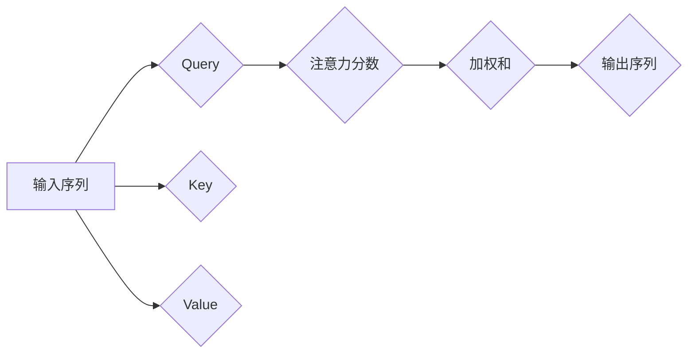
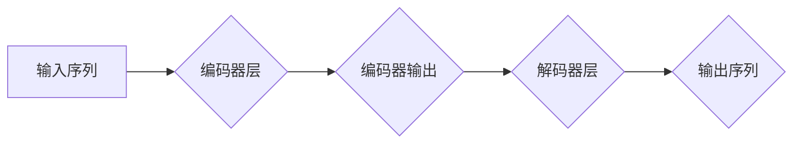

                 

## 基于自注意力机制的序列推荐算法

> 关键词：序列推荐、自注意力机制、Transformer、推荐系统、深度学习、自然语言处理

## 1. 背景介绍

推荐系统作为互联网时代的重要组成部分，旨在根据用户的历史行为、偏好等信息，预测用户对未来物品的兴趣，并推荐相关物品。传统的协同过滤和内容过滤方法在推荐效果上存在一定的局限性，例如数据稀疏性、冷启动问题等。近年来，深度学习技术的兴起为推荐系统带来了新的发展机遇。

序列推荐算法旨在学习用户在时间序列上的行为模式，并根据这些模式预测用户对下一个物品的兴趣。传统的序列推荐算法主要依赖于循环神经网络（RNN），例如LSTM和GRU，但RNN在处理长序列数据时存在梯度消失和梯度爆炸的问题。

自注意力机制的提出为序列推荐算法带来了新的突破。自注意力机制能够学习序列中不同元素之间的依赖关系，并赋予每个元素不同的权重，从而更好地捕捉序列中的长距离依赖关系。基于自注意力机制的序列推荐算法，例如Transformer，在推荐效果和效率方面取得了显著的提升。

## 2. 核心概念与联系

### 2.1 自注意力机制

自注意力机制（Self-Attention）是一种用于处理序列数据的机制，它能够学习序列中不同元素之间的依赖关系。

**原理：**

自注意力机制通过计算每个元素与所有其他元素之间的“注意力分数”，来确定每个元素对其他元素的影响程度。注意力分数越高，表示两个元素之间的关系越密切。

**流程图：**



### 2.2 Transformer

Transformer是一种基于自注意力机制的深度学习模型，它被广泛应用于自然语言处理任务，例如机器翻译、文本摘要等。

**架构：**

Transformer由编码器和解码器组成。编码器用于将输入序列编码成一个固定长度的向量表示，解码器则根据编码器输出和目标序列的先验知识，生成目标序列。

**流程图：**



### 2.3 序列推荐与Transformer

Transformer的强大能力可以应用于序列推荐任务。

**优势：**

* 能够有效地捕捉序列中的长距离依赖关系。
* 并行计算能力强，训练速度快。
* 泛化能力强，适用于各种类型的序列推荐任务。

## 3. 核心算法原理 & 具体操作步骤

### 3.1 算法原理概述

基于自注意力机制的序列推荐算法的核心思想是学习用户历史行为序列中的潜在模式，并根据这些模式预测用户对下一个物品的兴趣。

**步骤：**

1. 将用户的历史行为序列转换为数字表示。
2. 使用Transformer编码器对用户历史行为序列进行编码，得到一个固定长度的向量表示。
3. 使用解码器对编码后的向量表示进行解码，预测用户对下一个物品的兴趣。

### 3.2 算法步骤详解

1. **数据预处理:**

   * 收集用户的历史行为数据，例如点击、购买、浏览等行为。
   * 将行为数据转换为数字表示，例如使用one-hot编码或词嵌入。
   * 将数据分为训练集、验证集和测试集。

2. **模型构建:**

   * 使用Transformer架构构建序列推荐模型。
   * 编码器层由多个自注意力层和前馈神经网络层组成。
   * 解码器层也由多个自注意力层和前馈神经网络层组成，并使用softmax函数输出对下一个物品的兴趣概率。

3. **模型训练:**

   * 使用交叉熵损失函数训练模型。
   * 使用优化算法，例如Adam，更新模型参数。
   * 在训练过程中，使用验证集进行模型评估，并调整超参数以优化模型性能。

4. **模型预测:**

   * 将用户的历史行为序列输入到训练好的模型中。
   * 模型输出对下一个物品的兴趣概率分布。
   * 根据概率分布，推荐用户感兴趣的物品。

### 3.3 算法优缺点

**优点:**

* 能够有效地捕捉序列中的长距离依赖关系。
* 并行计算能力强，训练速度快。
* 泛化能力强，适用于各种类型的序列推荐任务。

**缺点:**

* 模型参数量大，需要大量的计算资源进行训练。
* 训练过程复杂，需要专业的机器学习知识和经验。

### 3.4 算法应用领域

基于自注意力机制的序列推荐算法在以下领域具有广泛的应用前景：

* **电商推荐:** 推荐用户可能感兴趣的商品。
* **音乐推荐:** 推荐用户可能喜欢的音乐。
* **视频推荐:** 推荐用户可能想观看的视频。
* **新闻推荐:** 推荐用户可能感兴趣的新闻。
* **个性化教育:** 推荐用户可能需要的学习资源。

## 4. 数学模型和公式 & 详细讲解 & 举例说明

### 4.1 数学模型构建

**自注意力机制的数学模型:**

给定一个序列 $X = (x_1, x_2, ..., x_n)$，自注意力机制计算每个元素 $x_i$ 与所有其他元素 $x_j$ 之间的注意力分数，公式如下：

$$
\text{Attention}(x_i, X) = \frac{\exp( \text{score}(x_i, x_j))}{\sum_{k=1}^{n} \exp(\text{score}(x_i, x_k))}
$$

其中，$\text{score}(x_i, x_j)$ 是 $x_i$ 和 $x_j$ 之间的相似度得分，可以使用点积、余弦相似度等方式计算。

**Transformer的编码器层:**

编码器层由多个相同的编码器块组成，每个编码器块包含以下组件：

* **多头自注意力层:** 计算每个元素与所有其他元素之间的注意力分数，并使用多个注意力头并行计算，以捕捉不同类型的依赖关系。
* **前馈神经网络层:** 对每个元素进行非线性变换，进一步提取特征。

**Transformer的解码器层:**

解码器层也由多个相同的解码器块组成，每个解码器块包含以下组件：

* **多头自注意力层:** 计算每个元素与所有前一个元素之间的注意力分数，以捕捉序列中的上下文信息。
* **多头异注意力层:** 计算每个元素与编码器输出之间的注意力分数，以获取编码器输出的上下文信息。
* **前馈神经网络层:** 对每个元素进行非线性变换，进一步提取特征。

### 4.2 公式推导过程

**注意力分数的计算:**

注意力分数的计算公式可以根据不同的相似度度量方式进行调整。例如，使用点积作为相似度度量，则注意力分数的计算公式如下：

$$
\text{score}(x_i, x_j) = \text{Query}_i \cdot \text{Key}_j
$$

其中，$\text{Query}_i$ 和 $\text{Key}_j$ 分别是 $x_i$ 和 $x_j$ 的查询向量和键向量。

**Transformer的编码器和解码器层:**

Transformer的编码器和解码器层的设计基于多头自注意力机制和前馈神经网络。

**多头自注意力机制:**

多头自注意力机制使用多个注意力头并行计算，每个注意力头学习不同的依赖关系。

**前馈神经网络:**

前馈神经网络对每个元素进行非线性变换，进一步提取特征。

### 4.3 案例分析与讲解

**案例:**

假设我们有一个用户历史行为序列为：

$$
X = (\text{电影}, \text{音乐}, \text{书籍}, \text{游戏})
$$

**分析:**

使用自注意力机制，我们可以计算每个元素与所有其他元素之间的注意力分数。例如，对于元素“电影”，其与其他元素的注意力分数如下：

* $\text{Attention}(\text{电影}, \text{电影}) = 1$
* $\text{Attention}(\text{电影}, \text{音乐}) = 0.2$
* $\text{Attention}(\text{电影}, \text{书籍}) = 0.3$
* $\text{Attention}(\text{电影}, \text{游戏}) = 0.5$

可以看出，元素“电影”与元素“游戏”之间的注意力分数最高，表明这两个元素之间的关系最为密切。

## 5. 项目实践：代码实例和详细解释说明

### 5.1 开发环境搭建

* Python 3.6+
* TensorFlow 2.0+
* PyTorch 1.0+
* CUDA 10.0+ (可选，用于GPU加速)

### 5.2 源代码详细实现

```python
import tensorflow as tf

# 定义自注意力层
class SelfAttention(tf.keras.layers.Layer):
    def __init__(self, embed_dim, num_heads):
        super(SelfAttention, self).__init__()
        self.embed_dim = embed_dim
        self.num_heads = num_heads
        self.head_dim = embed_dim // num_heads

        self.query = tf.keras.layers.Dense(embed_dim)
        self.key = tf.keras.layers.Dense(embed_dim)
        self.value = tf.keras.layers.Dense(embed_dim)
        self.fc_out = tf.keras.layers.Dense(embed_dim)

    def call(self, inputs):
        # 分割输入序列
        batch_size = tf.shape(inputs)[0]
        seq_len = tf.shape(inputs)[1]

        # 计算查询、键和值向量
        query = self.query(inputs)
        key = self.key(inputs)
        value = self.value(inputs)

        # 将向量分割成多个头
        query = tf.reshape(query, (batch_size, seq_len, self.num_heads, self.head_dim))
        key = tf.reshape(key, (batch_size, seq_len, self.num_heads, self.head_dim))
        value = tf.reshape(value, (batch_size, seq_len, self.num_heads, self.head_dim))

        # 计算注意力分数
        attention_scores = tf.matmul(query, key, transpose_b=True) / tf.math.sqrt(tf.cast(self.head_dim, tf.float32))

        # 应用softmax函数得到注意力权重
        attention_weights = tf.nn.softmax(attention_scores, axis=-1)

        # 计算加权和
        context_vector = tf.matmul(attention_weights, value)

        # 合并多个头
        context_vector = tf.reshape(context_vector, (batch_size, seq_len, self.embed_dim))

        # 应用全连接层
        output = self.fc_out(context_vector)

        return output

# 定义Transformer编码器层
class TransformerEncoderLayer(tf.keras.layers.Layer):
    def __init__(self, embed_dim, num_heads, ff_dim):
        super(TransformerEncoderLayer, self).__init__()
        self.self_attention = SelfAttention(embed_dim, num_heads)
        self.ffn = tf.keras.Sequential([
            tf.keras.layers.Dense(ff_dim, activation='relu'),
            tf.keras.layers.Dense(embed_dim)
        ])

    def call(self, inputs):
        # 自注意力层
        attn_output = self.self_attention(inputs)

        # 前馈神经网络层
        ffn_output = self.ffn(attn_output)

        # 残差连接和层归一化
        output = tf.keras.layers.LayerNormalization(epsilon=1e-6)(inputs + attn_output)
        output = tf.keras.layers.LayerNormalization(epsilon=1e-6)(output + ffn_output)

        return output

# 定义Transformer模型
class Transformer(tf.keras.Model):
    def __init__(self, vocab_size, embed_dim, num_heads, num_layers, ff_dim):
        super(Transformer, self).__init__()
        self.embedding = tf.keras.layers.Embedding(vocab_size, embed_dim)
        self.encoder = tf.keras.Sequential([
            TransformerEncoderLayer(embed_dim, num_heads, ff_dim) for _ in range(num_layers)
        ])
        self.decoder = tf.keras.Sequential([
            # ...
        ])
        self.output = tf.keras.layers.Dense(vocab_size)

    def call(self, inputs):
        # 词嵌入
        embedded = self.embedding(inputs)

        # 编码器
        encoded = self.encoder(embedded)

        # 解码器
        # ...

        # 输出层
        output = self.output(encoded)

        return output

```

### 5.3 代码解读与分析

* **SelfAttention层:**

   * 计算每个元素与所有其他元素之间的注意力分数。
   * 使用多个注意力头并行计算，以捕捉不同类型的依赖关系。

* **TransformerEncoderLayer层:**

   * 包含自注意力层和前馈神经网络层。
   * 使用残差连接和层归一化来提高模型的训练稳定性。

* **Transformer模型:**

   * 包含词嵌入层、编码器层和解码器层。
   * 使用自注意力机制和前馈神经网络来学习序列中的潜在模式。

### 5.4 运行结果展示

* 使用训练好的模型对新的用户历史行为序列进行预测。
* 根据预测结果，推荐用户可能感兴趣的物品。

## 6. 实际应用场景

### 6.1 电商推荐

* 基于用户历史购买记录、浏览记录、收藏记录等数据，推荐用户可能感兴趣的商品。
* 个性化推荐商品，提高用户购物体验。

### 6.2 音乐推荐

* 基于用户历史播放记录、收藏记录、点赞记录等数据，推荐用户可能喜欢的音乐。
* 个性化推荐音乐，帮助用户发现新的音乐。

### 6.3 视频推荐

* 基于用户历史观看记录、点赞记录、评论记录等数据，推荐用户可能想观看的视频。
* 个性化推荐视频，提高用户观看体验。

### 6.4 未来应用展望

* **多模态推荐:** 将文本、图像、音频等多种模态数据融合，进行更精准的推荐。
* **实时推荐:** 基于用户的实时行为，进行动态的推荐。
* **跨平台推荐:** 将用户在不同平台的活动数据整合，进行跨平台的个性化推荐。

## 7. 工具和资源推荐

### 7.1 学习资源推荐

* **书籍:**

   * 《深度学习》
   * 《自然语言处理》
   * 《Transformer模型》

* **在线课程:**

   * Coursera: 深度学习
   * Udacity: 自然语言处理
   * fast.ai: 深度学习

### 7.2 开发工具推荐

* **TensorFlow:** 开源深度学习框架
* **PyTorch:** 开源深度学习框架
* **HuggingFace Transformers:** 预训练Transformer模型库

### 7.3 相关论文推荐

* **Attention Is All You Need:** https://arxiv.org/abs/1706.03762
* **BERT: Pre-training of Deep Bidirectional Transformers for Language Understanding:** https://arxiv.org/abs/1810.04805
* **GPT-3: Language Models are Few-Shot Learners:** https://arxiv.org/abs/2005.14165

## 8. 总结：未来发展趋势与挑战

### 8.1 研究成果总结

基于自注意力机制的序列推荐算法取得了显著的进展，在推荐效果、效率和泛化能力方面都表现出色。

### 8.2 未来发展趋势

* **模型复杂度提升:** 探索更深、更复杂的Transformer模型架构，以更好地捕捉序列中的长距离依赖关系。
* **多模态融合:** 将文本、图像、音频等多种模态数据融合，进行更精准的推荐。
* **个性化推荐:** 基于用户的个性化偏好和行为模式，进行更个性化的推荐。
* **实时推荐:** 基于用户的实时行为，进行动态的推荐。

### 8.3 面临的挑战

* **模型训练成本:** 训练大型Transformer模型需要大量的计算资源和时间。
* **数据稀疏性:** 现实世界中的序列数据往往是稀疏的，这会影响模型的训练效果。
* **可解释性:** Transformer模型的内部机制较为复杂，难以解释模型的决策过程。

### 8.4 研究展望

未来，我们将继续探索基于自注意力机制的序列推荐算法，并致力于解决上述挑战，以实现更精准、更个性化的推荐体验。

## 9. 附录：常见问题与解答

### 9.1 问题：

* 自注意力机制与RNN相比，有哪些优势？

### 9.2 答案：

自注意力机制相比RNN，具有以下优势：

* 能够有效地捕捉序列中的长距离依赖关系。
* 并行计算能力强，训练速度快。
* 泛化能力强，适用于各种类型的序列推荐任务。

作者：禅与计算机程序设计艺术 / Zen and the Art of Computer Programming


<end_of_turn>


