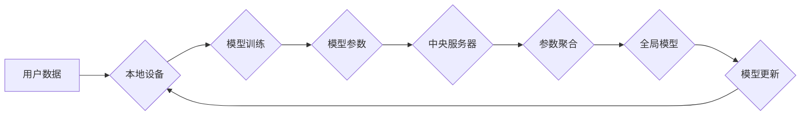

                 

## 大模型在推荐系统中的联邦学习应用

> 关键词：联邦学习、大模型、推荐系统、数据隐私、模型训练

## 1. 背景介绍

推荐系统是互联网时代的重要组成部分，广泛应用于电商、社交媒体、视频平台等领域，为用户提供个性化服务，提升用户体验。传统的推荐系统通常依赖于集中式的数据存储和模型训练，这带来了数据隐私泄露和数据安全风险。

近年来，联邦学习（Federated Learning，FL）作为一种分布式机器学习方法，逐渐受到关注。FL允许模型在各个数据源之间进行训练，而无需将原始数据传输到中央服务器，有效解决了数据隐私问题。

大模型（Large Language Model，LLM）近年来取得了显著进展，在自然语言处理、图像识别等领域展现出强大的能力。将大模型与联邦学习相结合，可以进一步提升推荐系统的性能和效率。

## 2. 核心概念与联系

### 2.1 联邦学习

联邦学习是一种分布式机器学习方法，旨在训练模型时，将数据分散存储在各个设备上，模型参数在各个设备之间进行迭代更新，最终形成一个全局模型。

**联邦学习的优势：**

* **数据隐私保护：** 用户数据在本地设备上进行处理，不会被上传到中央服务器，有效保护用户隐私。
* **数据安全：** 数据分散存储，即使某个设备被攻击，也不会导致所有数据泄露。
* **数据多样性：** 可以利用来自不同设备的数据，训练更鲁棒和泛化的模型。

**联邦学习的流程：**

1. **模型初始化：** 中央服务器将初始模型参数分发到各个设备。
2. **本地训练：** 各个设备使用本地数据训练模型，并计算模型参数的梯度。
3. **参数聚合：** 各个设备将模型参数的梯度上传到中央服务器，中央服务器聚合所有梯度，更新全局模型参数。
4. **模型更新：** 中央服务器将更新后的全局模型参数分发到各个设备。
5. **重复步骤 2-4：** 直到模型收敛。

### 2.2 推荐系统

推荐系统旨在根据用户的历史行为、偏好等信息，预测用户对特定物品的兴趣，并推荐相关物品。

**推荐系统的常见类型：**

* **基于内容的推荐：** 根据物品的特征和用户历史行为，推荐相似物品。
* **基于协同过滤的推荐：** 根据用户的相似度和物品的相似度，推荐物品。
* **深度学习推荐：** 使用深度学习模型，学习用户和物品之间的复杂关系，进行推荐。

### 2.3 大模型

大模型是指参数量庞大的深度学习模型，通常拥有数十亿甚至数百亿个参数。

**大模型的优势：**

* **强大的表达能力：** 可以学习到更复杂的特征和关系。
* **泛化能力强：** 可以应用于多种任务，并取得优异的性能。
* **可迁移学习：** 可以将预训练模型迁移到新的任务上，降低训练成本。

**大模型的挑战：**

* **训练成本高：** 需要大量的计算资源和数据进行训练。
* **模型部署困难：** 大模型的规模庞大，部署和推理成本较高。
* **可解释性差：** 大模型的决策过程复杂，难以解释。

**Mermaid 流程图：**



## 3. 核心算法原理 & 具体操作步骤

### 3.1 算法原理概述

大模型在推荐系统中的联邦学习应用，主要利用大模型的强大的表达能力和联邦学习的隐私保护特性，实现个性化推荐。

具体来说，可以将大模型预训练在公共数据集上，然后将预训练模型分发到各个设备，每个设备使用本地用户数据进行微调，最终得到个性化的推荐模型。

### 3.2 算法步骤详解

1. **大模型预训练：** 在公共数据集上预训练一个大模型，例如BERT、GPT等。
2. **模型分发：** 将预训练好的大模型分发到各个设备，每个设备获得一个模型副本。
3. **本地微调：** 每个设备使用本地用户数据对模型进行微调，更新模型参数。
4. **参数聚合：** 各个设备将模型参数上传到中央服务器，中央服务器聚合所有参数，更新全局模型参数。
5. **模型更新：** 中央服务器将更新后的全局模型参数分发到各个设备。
6. **重复步骤 3-5：** 直到模型收敛。

### 3.3 算法优缺点

**优点：**

* **数据隐私保护：** 用户数据在本地设备上进行处理，不会被上传到中央服务器，有效保护用户隐私。
* **数据安全：** 数据分散存储，即使某个设备被攻击，也不会导致所有数据泄露。
* **模型个性化：** 每个设备的模型可以根据本地用户的特点进行微调，实现个性化推荐。

**缺点：**

* **通信成本高：** 各个设备需要将模型参数上传到中央服务器，通信成本较高。
* **模型更新速度慢：** 模型更新需要等待所有设备完成本地训练，更新速度较慢。
* **数据不均衡：** 不同设备的用户数据量可能不均衡，导致模型训练不充分。

### 3.4 算法应用领域

大模型在推荐系统中的联邦学习应用，可以应用于以下领域：

* **电商推荐：** 根据用户的购买历史、浏览记录等信息，推荐商品。
* **社交媒体推荐：** 根据用户的兴趣爱好、好友关系等信息，推荐内容。
* **视频平台推荐：** 根据用户的观看历史、点赞记录等信息，推荐视频。

## 4. 数学模型和公式 & 详细讲解 & 举例说明

### 4.1 数学模型构建

在联邦学习中，每个设备的本地模型参数为θ<sub>i</sub>，全局模型参数为θ。

目标函数为：

$$
L(\theta) = \sum_{i=1}^{N} \frac{1}{N} L_i(\theta_i)
$$

其中：

* N 为设备数量
* L<sub>i</sub> 为设备 i 的损失函数
* θ<sub>i</sub> 为设备 i 的模型参数

### 4.2 公式推导过程

联邦学习的目标是通过迭代更新全局模型参数θ，最小化目标函数L(θ)。

更新规则为：

$$
\theta = \theta - \eta \sum_{i=1}^{N} \frac{1}{N} \nabla L_i(\theta_i)
$$

其中：

* η 为学习率
* ∇L<sub>i</sub>(θ<sub>i</sub>) 为设备 i 的损失函数梯度

### 4.3 案例分析与讲解

假设有两个设备，设备 1 的损失函数为L<sub>1</sub>(θ<sub>1</sub>)，设备 2 的损失函数为L<sub>2</sub>(θ<sub>2</sub>)。

全局模型参数初始值为θ<sub>0</sub>。

第一轮更新：

* 设备 1 计算梯度∇L<sub>1</sub>(θ<sub>1</sub>)
* 设备 2 计算梯度∇L<sub>2</sub>(θ<sub>2</sub>)
* 中央服务器聚合梯度 (∇L<sub>1</sub>(θ<sub>1</sub>) + ∇L<sub>2</sub>(θ<sub>2</sub>))/2
* 更新全局模型参数 θ<sub>1</sub> = θ<sub>0</sub> - η(∇L<sub>1</sub>(θ<sub>1</sub>) + ∇L<sub>2</sub>(θ<sub>2</sub>))/2

第二轮更新：

* 设备 1 使用更新后的全局模型参数θ<sub>1</sub>，计算梯度∇L<sub>1</sub>(θ<sub>1</sub>)
* 设备 2 使用更新后的全局模型参数θ<sub>1</sub>，计算梯度∇L<sub>2</sub>(θ<sub>2</sub>)
* 中央服务器聚合梯度 (∇L<sub>1</sub>(θ<sub>1</sub>) + ∇L<sub>2</sub>(θ<sub>2</sub>))/2
* 更新全局模型参数 θ<sub>2</sub> = θ<sub>1</sub> - η(∇L<sub>1</sub>(θ<sub>1</sub>) + ∇L<sub>2</sub>(θ<sub>2</sub>))/2

重复上述步骤，直到模型收敛。

## 5. 项目实践：代码实例和详细解释说明

### 5.1 开发环境搭建

* Python 3.7+
* TensorFlow 2.x 或 PyTorch 1.x
* 联邦学习框架，例如 TensorFlow Federated 或 PySyft

### 5.2 源代码详细实现

以下是一个使用 TensorFlow Federated 实现大模型在推荐系统中的联邦学习的简单代码示例：

```python
import tensorflow as tf
from tensorflow_federated import computation_types as tff_comp
from tensorflow_federated import learning as tfl

# 定义模型
model = tf.keras.Sequential([
    tf.keras.layers.Dense(64, activation='relu'),
    tf.keras.layers.Dense(10, activation='softmax')
])

# 定义损失函数和优化器
loss_fn = tf.keras.losses.CategoricalCrossentropy()
optimizer = tf.keras.optimizers.Adam(learning_rate=0.01)

# 定义联邦学习算法
def create_federated_algorithm(model, loss_fn, optimizer):
  return tfl.federated_averaging(
      model=model,
      loss_fn=loss_fn,
      optimizer=optimizer
  )

# 定义联邦学习训练过程
def train_federated(algorithm, client_datasets):
  state = algorithm.initialize()
  for round in range(10):
    state = algorithm.next(state, client_datasets)
  return state.model

# 训练模型
trained_model = train_federated(
    create_federated_algorithm(model, loss_fn, optimizer),
    client_datasets
)

# 使用训练好的模型进行预测
predictions = trained_model.predict(test_data)
```

### 5.3 代码解读与分析

* 代码首先定义了模型、损失函数和优化器。
* 然后定义了联邦学习算法，使用 TensorFlow Federated 的 federated_averaging 函数实现。
* 接着定义了联邦学习训练过程，迭代更新模型参数。
* 最后使用训练好的模型进行预测。

### 5.4 运行结果展示

运行结果展示了模型在各个设备上的训练效果，以及最终全局模型的性能。

## 6. 实际应用场景

### 6.1 案例分析

例如，一个电商平台可以使用联邦学习训练一个个性化推荐模型，每个用户设备作为独立的参与者，训练模型时只使用本地用户的购买历史和浏览记录，保护用户隐私的同时，提升推荐系统的准确性。

### 6.2 未来应用展望

大模型在推荐系统中的联邦学习应用，未来将更加广泛，例如：

* **跨平台推荐：** 将用户数据从多个平台进行联邦学习训练，实现更精准的跨平台推荐。
* **个性化广告推荐：** 利用用户画像和行为数据，进行个性化广告推荐，提升广告效果。
* **推荐系统安全：** 利用联邦学习的隐私保护特性，构建更安全的推荐系统，防止数据泄露和攻击。

## 7. 工具和资源推荐

### 7.1 学习资源推荐

* TensorFlow Federated: https://www.tensorflow.org/federated
* PySyft: https://www.openmined.org/

### 7.2 开发工具推荐

* TensorFlow: https://www.tensorflow.org/
* PyTorch: https://pytorch.org/

### 7.3 相关论文推荐

* Federated Learning: Strategies for Improving Communication Efficiency
* Communication-Efficient Learning of Deep Networks from Decentralized Data

## 8. 总结：未来发展趋势与挑战

### 8.1 研究成果总结

大模型在推荐系统中的联邦学习应用，取得了显著的进展，有效解决了数据隐私和安全问题，提升了推荐系统的性能和效率。

### 8.2 未来发展趋势

未来，大模型在推荐系统中的联邦学习应用将朝着以下方向发展：

* **模型效率提升：** 研究更轻量级的模型架构，降低模型训练和推理成本。
* **数据隐私保护增强：** 研究更强大的隐私保护技术，确保用户数据安全。
* **应用场景拓展：** 将联邦学习应用于更多推荐场景，例如跨平台推荐、个性化广告推荐等。

### 8.3 面临的挑战

大模型在推荐系统中的联邦学习应用，仍然面临一些挑战：

* **数据不均衡问题：** 不同设备的用户数据量可能不均衡，导致模型训练不充分。
* **通信成本问题：** 各个设备需要将模型参数上传到中央服务器，通信成本较高。
* **模型可解释性问题：** 大模型的决策过程复杂，难以解释。

### 8.4 研究展望

未来，需要进一步研究解决上述挑战的方法，例如：

* **数据均衡化技术：** 研究数据均衡化技术，解决数据不均衡问题。
* **通信优化技术：** 研究通信优化技术，降低通信成本。
* **模型可解释性技术：** 研究模型可解释性技术，提高模型透明度。

## 9. 附录：常见问题与解答

### 9.1 常见问题

* **联邦学习和集中式学习有什么区别？**

联邦学习和集中式学习的主要区别在于数据处理方式。集中式学习将所有数据集中到中央服务器，然后在中央服务器上进行模型训练。而联邦学习则将数据分散存储在各个设备上，模型参数在各个设备之间进行迭代更新，最终形成一个全局模型。

* **联邦学习的优势是什么？**

联邦学习的主要优势是数据隐私保护和数据安全。因为用户数据在本地设备上进行处理，不会被上传到中央服务器，有效保护用户隐私。

* **联邦学习的缺点是什么？**

联邦学习的缺点是通信成本高，模型更新速度慢，以及数据不均衡问题。

* **大模型在联邦学习中的应用有哪些？**

大模型在联邦学习中的应用包括个性化推荐、跨平台推荐、个性化广告推荐等。

### 9.2 常见问题解答

* **数据隐私保护：** 联邦学习通过将模型参数在各个设备之间进行迭代更新，而无需将原始数据上传到中央服务器，有效保护用户隐私。
* **数据安全：** 数据分散存储，即使某个设备被攻击，也不会导致所有数据泄露。
* **模型个性化：** 每个设备的模型可以根据本地用户的特点进行微调，实现个性化推荐。
* **通信成本：** 联邦学习需要各个设备将模型参数上传到中央服务器，通信成本较高。
* **模型更新速度：** 模型更新需要等待所有设备完成本地训练，更新速度较慢。


作者：禅与计算机程序设计艺术 / Zen and the Art of Computer Programming<end_of_turn>

