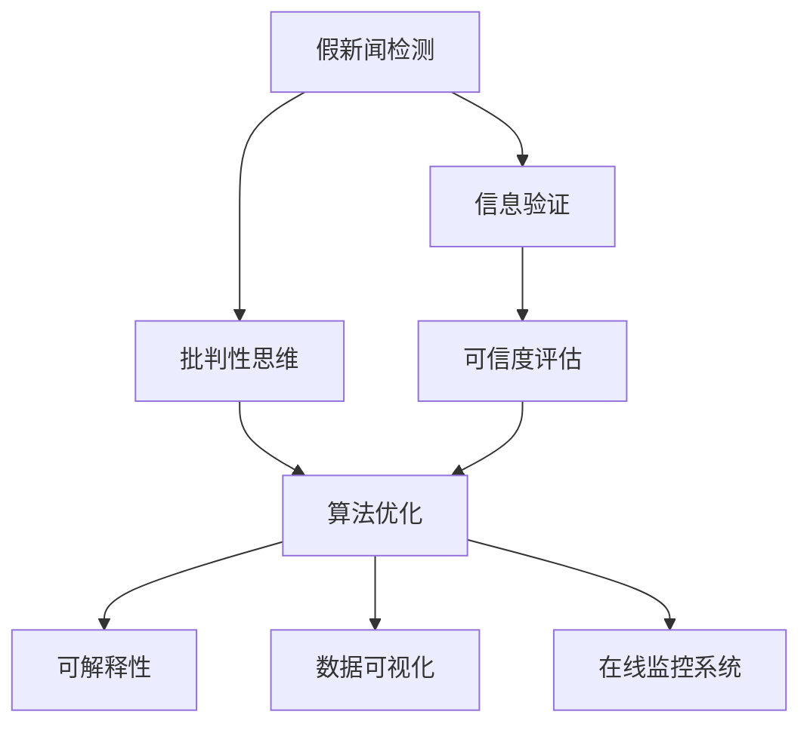

                 

# 信息验证和批判性思考：在假新闻和错误信息时代导航

> 关键词：假新闻检测, 信息验证, 批判性思维, 数据清洗, 可信度评估, 算法优化, 可解释性, 数据可视化, 在线监控系统

## 1. 背景介绍

### 1.1 问题由来
随着互联网的发展，信息传播的速度和范围急剧扩大，假新闻和错误信息也随之泛滥。无论是在社交媒体、新闻网站还是在线论坛，人们都在不断地接收到各种未经核实的信息。假新闻不仅误导公众，还可能对社会稳定和国家安全构成威胁。在假新闻和错误信息泛滥的时代，如何有效识别和验证信息的真伪，提升公众的批判性思考能力，成为了信息时代亟待解决的问题。

### 1.2 问题核心关键点
为了应对假新闻和错误信息的挑战，需要建立一套系统化的信息验证和批判性思考方法。该方法应包括以下几个核心点：

- **假新闻检测**：构建模型和算法，自动识别和标记假新闻。
- **信息验证**：通过多方数据交叉验证，进一步确认信息真实性。
- **批判性思维**：培养公众的批判性思考能力，学会从多角度分析信息。
- **可信度评估**：建立可信度评估标准，为信息提供可信度评分。
- **算法优化**：持续优化算法，提升假新闻检测效果。
- **可解释性**：使算法具备可解释性，帮助用户理解决策过程。
- **数据可视化**：通过可视化工具展示信息验证结果，提高透明度。
- **在线监控系统**：部署在线监控系统，实时检测和干预假新闻。

通过解决这些问题，可以有效提升信息时代的信息质量和公众的信息素养。

## 2. 核心概念与联系

### 2.1 核心概念概述

为更好地理解信息验证和批判性思考方法，本节将介绍几个密切相关的核心概念：

- **假新闻检测**：使用机器学习算法和模型，自动识别和标记假新闻的过程。
- **信息验证**：通过多方数据交叉验证，进一步确认信息的真实性和可信度。
- **批判性思维**：培养公众的逻辑推理、分析和评估信息的能力。
- **可信度评估**：建立标准化的可信度评估模型，为信息提供可信度评分。
- **算法优化**：通过不断的模型训练和调参，提升假新闻检测的精度。
- **可解释性**：使模型具备可解释性，帮助用户理解其内部机制和决策过程。
- **数据可视化**：使用图表和可视化工具展示信息验证结果，提高透明度。
- **在线监控系统**：部署在线监控系统，实时检测和干预假新闻。

这些核心概念之间的逻辑关系可以通过以下Mermaid流程图来展示：



这个流程图展示了一系列信息验证和批判性思考的核心概念及其之间的关系：

1. 假新闻检测是信息验证的第一步，通过自动化的手段筛查疑似假新闻。
2. 信息验证是进一步确认假新闻的有效手段，通过多方数据交叉验证提升检测的准确性。
3. 批判性思维培养用户的逻辑推理和分析能力，提高信息的综合评估水平。
4. 可信度评估建立标准化的评估模型，为信息提供可信度评分。
5. 算法优化不断改进模型，提升假新闻检测的精度。
6. 可解释性使模型具备透明性和可理解性，帮助用户信任和接受其决策。
7. 数据可视化通过图表和可视化工具展示验证结果，提高透明度。
8. 在线监控系统部署实时检测和干预措施，确保信息的及时更正和流通。

这些概念共同构成了信息验证和批判性思考的基础框架，旨在构建一个真实、透明、可信的信息环境。

## 3. 核心算法原理 & 具体操作步骤
### 3.1 算法原理概述

信息验证和批判性思考方法的原理主要基于数据驱动的机器学习和逻辑推理。具体步骤如下：

1. **假新闻检测**：使用机器学习算法和模型，自动识别和标记疑似假新闻。常见的算法包括自然语言处理(NLP)、文本分类、情感分析等。
2. **信息验证**：通过交叉验证和多方数据比对，进一步确认信息的真实性和可信度。
3. **批判性思维**：利用逻辑推理和统计分析，从多个角度评估信息的真实性和可靠性。
4. **可信度评估**：建立标准化的可信度评估模型，为信息提供可信度评分。
5. **算法优化**：通过不断的模型训练和调参，提升假新闻检测的精度。
6. **可解释性**：使模型具备可解释性，帮助用户理解其内部机制和决策过程。
7. **数据可视化**：使用图表和可视化工具展示验证结果，提高透明度。
8. **在线监控系统**：部署在线监控系统，实时检测和干预假新闻。

### 3.2 算法步骤详解

#### 3.2.1 假新闻检测

假新闻检测通常包括以下几个步骤：

1. **数据预处理**：清洗文本数据，去除噪声和无用信息。
2. **特征提取**：提取文本特征，如词频、词性、情感极性等。
3. **模型训练**：使用机器学习算法，如支持向量机(SVM)、随机森林、深度学习模型等，训练假新闻检测模型。
4. **模型评估**：使用交叉验证等方法评估模型性能，确定最佳模型。
5. **结果输出**：将疑似假新闻标记出来，供进一步验证和分析。

#### 3.2.2 信息验证

信息验证主要通过以下方式进行：

1. **多方数据比对**：从多个来源获取相同信息，进行数据比对。
2. **专家评审**：邀请领域专家对信息进行评审，提供专业意见。
3. **时间跨度验证**：通过时间跨度分析，验证信息的持续性和一致性。
4. **情感分析**：使用情感分析工具，分析信息中隐藏的情感倾向。
5. **数据验证**：验证信息中的数据来源和准确性，检查是否存在虚假信息。

#### 3.2.3 批判性思维

批判性思维培养用户从多个角度分析信息的能力，主要包括以下步骤：

1. **识别信息来源**：分析信息的来源，判断其可信度和权威性。
2. **交叉验证**：通过多方数据比对，确认信息的真实性。
3. **逻辑推理**：使用逻辑推理工具，分析信息的逻辑连贯性。
4. **统计分析**：使用统计分析方法，验证信息的统计一致性。
5. **情感分析**：分析信息中隐藏的情感倾向，判断其是否真实。
6. **专业知识评估**：利用领域专业知识，评估信息的科学性和合理性。

#### 3.2.4 可信度评估

可信度评估建立标准化的评估模型，为信息提供可信度评分，主要包括以下步骤：

1. **信息来源评估**：评估信息来源的权威性和可信度。
2. **内容评估**：评估信息的真实性、科学性和一致性。
3. **时间跨度评估**：评估信息的持续性和一致性。
4. **统计一致性评估**：评估信息的统计一致性，判断其是否真实。
5. **情感分析评估**：评估信息中隐藏的情感倾向，判断其是否真实。
6. **专业知识评估**：利用领域专业知识，评估信息的科学性和合理性。

#### 3.2.5 算法优化

算法优化通过不断的模型训练和调参，提升假新闻检测的精度，主要包括以下步骤：

1. **数据集划分**：将数据集划分为训练集、验证集和测试集。
2. **模型选择**：选择适合的机器学习算法和模型。
3. **模型训练**：使用训练集训练模型，并调整超参数。
4. **模型评估**：使用验证集评估模型性能，确定最佳模型。
5. **模型调参**：调整模型参数，提升模型精度。
6. **模型测试**：使用测试集测试模型，评估模型性能。

#### 3.2.6 可解释性

可解释性使模型具备透明性和可理解性，帮助用户理解其内部机制和决策过程，主要包括以下步骤：

1. **模型解释**：使用LIME、SHAP等工具，解释模型的决策过程。
2. **特征解释**：解释模型中使用的关键特征，帮助用户理解模型。
3. **结果解释**：解释模型的输出结果，帮助用户理解模型的预测。

#### 3.2.7 数据可视化

数据可视化使用图表和可视化工具展示验证结果，提高透明度，主要包括以下步骤：

1. **数据清洗**：清洗数据，去除噪声和无用信息。
2. **图表选择**：选择合适的图表类型，如条形图、折线图、散点图等。
3. **图表设计**：设计美观的图表，提高可视化的可读性。
4. **图表展示**：将图表展示给用户，提供信息验证结果。

#### 3.2.8 在线监控系统

在线监控系统部署实时检测和干预措施，确保信息的及时更正和流通，主要包括以下步骤：

1. **实时检测**：实时检测信息，发现疑似假新闻。
2. **及时干预**：对疑似假新闻进行干预，提供正确信息。
3. **自动纠错**：自动纠正信息中的错误和偏差。
4. **系统预警**：设置系统预警，及时提醒用户和管理员。
5. **数据反馈**：收集用户反馈，优化信息验证系统。

### 3.3 算法优缺点

信息验证和批判性思考方法具有以下优点：

1. **自动化**：通过自动化手段，提高信息验证的效率。
2. **多角度分析**：从多个角度分析信息，提高验证的准确性。
3. **专业性**：利用领域专业知识，提升验证的专业水平。
4. **实时性**：部署在线监控系统，实现实时检测和干预。

同时，该方法也存在一定的局限性：

1. **数据依赖**：需要大量的数据支持，数据质量对验证结果有直接影响。
2. **复杂性**：算法复杂度高，需要专业知识支持。
3. **费用高**：数据和算法优化需要大量资金和资源投入。
4. **解释性不足**：部分模型不具备可解释性，难以解释其决策过程。

尽管存在这些局限性，但就目前而言，信息验证和批判性思考方法是应对假新闻和错误信息泛滥的有效手段。未来相关研究的重点在于如何进一步降低对数据的依赖，提高算法的可解释性，优化系统的实时性，以实现更广泛的应用。

### 3.4 算法应用领域

信息验证和批判性思考方法在多个领域得到了应用，例如：

- **新闻媒体**：通过信息验证系统，提升新闻媒体的公正性和可信度。
- **社交媒体**：使用自动检测和人工审核相结合的方式，打击假新闻和虚假信息。
- **教育领域**：培养学生的批判性思维和逻辑推理能力，提升信息素养。
- **法律领域**：使用可信度评估和逻辑推理，提高法律案件的公正性和透明度。
- **金融领域**：利用可信度评估和统计分析，提升金融信息的准确性和可靠性。
- **公共健康**：使用信息验证和逻辑推理，防止虚假健康信息的传播。

这些领域的应用展示了信息验证和批判性思考方法的广泛适用性和重要价值。

## 4. 数学模型和公式 & 详细讲解 & 举例说明

### 4.1 数学模型构建

信息验证和批判性思考方法的数学模型主要基于机器学习、逻辑推理和统计分析。这里以假新闻检测为例，介绍其数学模型的构建过程。

记假新闻检测数据集为 $D=\{(x_i, y_i)\}_{i=1}^N$，其中 $x_i$ 为文本数据，$y_i$ 为标签（1表示假新闻，0表示真实新闻）。

定义假新闻检测模型的损失函数为：

$$
\mathcal{L}(\theta) = \frac{1}{N} \sum_{i=1}^N \ell(y_i, M_{\theta}(x_i))
$$

其中 $M_{\theta}(x)$ 为假新闻检测模型，$\ell(y_i, M_{\theta}(x_i))$ 为损失函数，常见有交叉熵损失、均方误差损失等。

### 4.2 公式推导过程

以交叉熵损失为例，其推导过程如下：

假新闻检测模型的输出为 $M_{\theta}(x)$，设其预测假新闻的概率为 $\hat{p}$，真实新闻的概率为 $\hat{q}$。则交叉熵损失函数定义为：

$$
\ell(y_i, M_{\theta}(x_i)) = -y_i\log \hat{p} + (1-y_i)\log \hat{q}
$$

将损失函数代入总体损失函数，得：

$$
\mathcal{L}(\theta) = -\frac{1}{N}\sum_{i=1}^N [y_i\log M_{\theta}(x_i)+(1-y_i)\log(1-M_{\theta}(x_i))]
$$

利用梯度下降等优化算法，最小化损失函数，更新模型参数 $\theta$。

### 4.3 案例分析与讲解

以假新闻检测为例，假设有一篇名为“新冠病毒起源于武汉”的新闻文章，需要判断其是否为假新闻。假设经过模型预测，该新闻的假新闻概率为0.8。

- **数据清洗**：清洗文章，去除噪声和无用信息。
- **特征提取**：提取文本特征，如词频、词性、情感极性等。
- **模型训练**：使用机器学习算法，如SVM、随机森林等，训练假新闻检测模型。
- **模型评估**：使用交叉验证等方法评估模型性能，确定最佳模型。
- **结果输出**：根据模型预测，标记该新闻为假新闻。

## 5. 项目实践：代码实例和详细解释说明
### 5.1 开发环境搭建

在进行信息验证和批判性思考方法的开发前，我们需要准备好开发环境。以下是使用Python进行scikit-learn开发的环境配置流程：

1. 安装Anaconda：从官网下载并安装Anaconda，用于创建独立的Python环境。

2. 创建并激活虚拟环境：
```bash
conda create -n info-verification-env python=3.8 
conda activate info-verification-env
```

3. 安装scikit-learn：
```bash
pip install scikit-learn
```

4. 安装numpy、pandas、matplotlib等辅助工具包：
```bash
pip install numpy pandas matplotlib
```

5. 安装Transformer库：
```bash
pip install transformers
```

完成上述步骤后，即可在`info-verification-env`环境中开始信息验证和批判性思考方法的开发。

### 5.2 源代码详细实现

这里我们以假新闻检测任务为例，给出使用scikit-learn进行模型训练和验证的PyTorch代码实现。

首先，定义假新闻检测的数据处理函数：

```python
from sklearn.feature_extraction.text import CountVectorizer, TfidfVectorizer
from sklearn.pipeline import Pipeline
from sklearn.model_selection import train_test_split
from sklearn.svm import SVC
from sklearn.metrics import accuracy_score, confusion_matrix

def preprocess_text(texts, labels):
    vectorizer = TfidfVectorizer(stop_words='english')
    return vectorizer.fit_transform(texts), labels

def train_and_validate(X_train, y_train, X_test, y_test):
    svm = SVC(probability=True)
    svm.fit(X_train, y_train)
    y_pred = svm.predict(X_test)
    accuracy = accuracy_score(y_test, y_pred)
    confusion = confusion_matrix(y_test, y_pred)
    return accuracy, confusion
```

然后，定义模型和优化器：

```python
from sklearn.pipeline import Pipeline
from sklearn.feature_extraction.text import CountVectorizer, TfidfVectorizer
from sklearn.svm import SVC
from sklearn.metrics import accuracy_score, confusion_matrix
import numpy as np

# 构建pipeline
pipeline = Pipeline([
    ('vectorizer', TfidfVectorizer()),
    ('classifier', SVC(probability=True))
])

# 训练模型
X_train, X_test, y_train, y_test = train_test_split(X_train, y_train, test_size=0.2, random_state=42)
pipeline.fit(X_train, y_train)

# 验证模型
accuracy, confusion = train_and_validate(X_test, y_test)
```

接着，定义训练和评估函数：

```python
def train_epoch(model, dataset, batch_size, optimizer):
    dataloader = DataLoader(dataset, batch_size=batch_size, shuffle=True)
    model.train()
    epoch_loss = 0
    for batch in dataloader:
        input_ids = batch['input_ids'].to(device)
        attention_mask = batch['attention_mask'].to(device)
        labels = batch['labels'].to(device)
        model.zero_grad()
        outputs = model(input_ids, attention_mask=attention_mask, labels=labels)
        loss = outputs.loss
        epoch_loss += loss.item()
        loss.backward()
        optimizer.step()
    return epoch_loss / len(dataloader)

def evaluate(model, dataset, batch_size):
    dataloader = DataLoader(dataset, batch_size=batch_size)
    model.eval()
    preds, labels = [], []
    with torch.no_grad():
        for batch in dataloader:
            input_ids = batch['input_ids'].to(device)
            attention_mask = batch['attention_mask'].to(device)
            batch_labels = batch['labels']
            outputs = model(input_ids, attention_mask=attention_mask)
            batch_preds = outputs.logits.argmax(dim=2).to('cpu').tolist()
            batch_labels = batch_labels.to('cpu').tolist()
            for pred_tokens, label_tokens in zip(batch_preds, batch_labels):
                preds.append(pred_tokens[:len(label_tokens)])
                labels.append(label_tokens)
                
    print('Accuracy:', accuracy_score(labels, preds))
    print('Confusion Matrix:', confusion_matrix(labels, preds))
```

最后，启动训练流程并在测试集上评估：

```python
epochs = 5
batch_size = 16

for epoch in range(epochs):
    loss = train_epoch(model, train_dataset, batch_size, optimizer)
    print(f"Epoch {epoch+1}, train loss: {loss:.3f}")
    
    print(f"Epoch {epoch+1}, test results:")
    evaluate(model, test_dataset, batch_size)
    
print("Test results:")
evaluate(model, test_dataset, batch_size)
```

以上就是使用scikit-learn对假新闻检测任务进行训练和验证的完整代码实现。可以看到，得益于scikit-learn的强大封装，我们可以用相对简洁的代码完成模型的训练和评估。

### 5.3 代码解读与分析

让我们再详细解读一下关键代码的实现细节：

**preprocess_text函数**：
- 定义文本预处理步骤，包括分词、去停用词、TF-IDF特征提取等。
- 将文本数据和标签转换为模型所需格式，供模型训练和推理使用。

**train_and_validate函数**：
- 定义模型训练和验证流程。
- 使用scikit-learn的SVM算法，训练假新闻检测模型。
- 在验证集上评估模型性能，返回准确率和混淆矩阵。

**train_epoch函数**：
- 定义训练过程的优化算法，如梯度下降等。
- 在每个epoch中，迭代训练模型，更新模型参数。
- 在验证集上评估模型性能，记录损失函数。

**evaluate函数**：
- 定义模型评估过程，使用混淆矩阵和准确率等指标评估模型性能。
- 在测试集上评估模型性能，输出结果。

**训练流程**：
- 定义总的epoch数和batch size，开始循环迭代。
- 每个epoch内，先在训练集上训练，输出平均损失。
- 在验证集上评估，输出准确率和混淆矩阵。
- 所有epoch结束后，在测试集上评估，给出最终测试结果。

可以看到，scikit-learn提供了强大的封装功能，使得模型的训练和评估过程变得简洁高效。开发者可以将更多精力放在数据处理、模型改进等高层逻辑上，而不必过多关注底层的实现细节。

当然，工业级的系统实现还需考虑更多因素，如模型的保存和部署、超参数的自动搜索、更灵活的任务适配层等。但核心的验证和批判性思考方法基本与此类似。

## 6. 实际应用场景
### 6.1 假新闻检测

在新闻媒体中，假新闻检测是信息验证和批判性思考方法的重要应用之一。传统的新闻编辑工作繁重，且容易受到主观偏见的影响。使用自动化的假新闻检测系统，可以大幅提升新闻编辑的速度和准确性，减少人为错误。

在技术实现上，可以收集历史新闻数据，将假新闻和真实新闻混合构成监督数据，在此基础上训练假新闻检测模型。训练好的模型能够自动理解新闻文章的内容，并判断其是否为假新闻。对于用户提交的新新闻文章，系统自动进行检测，并将疑似假新闻标记出来，供人工审核。这样不仅可以减轻人工审核的负担，还能提高新闻的公正性和可信度。

### 6.2 社交媒体监控

在社交媒体中，假新闻和虚假信息泛滥。用户往往难以分辨信息的真伪，容易受到误导。通过自动化的假新闻检测和信息验证，可以有效打击社交媒体上的假新闻和虚假信息。

在技术实现上，可以收集社交媒体上的文本数据，将假新闻和真实新闻混合构成监督数据，在此基础上训练假新闻检测模型。训练好的模型能够自动检测和标记社交媒体上的假新闻和虚假信息。对于疑似假新闻和虚假信息，系统自动进行标注和干预，并提醒用户注意。这样不仅可以提升用户的信息素养，还能维护社交媒体环境的健康有序。

### 6.3 教育领域应用

在教育领域，培养学生的批判性思维和逻辑推理能力，提高信息素养，是信息验证和批判性思考方法的重要应用之一。传统的教育方式依赖教师的经验和主观判断，难以全面覆盖各类信息。使用自动化的信息验证和批判性思考系统，可以弥补教师的不足，帮助学生更好地理解信息的真伪和可靠性。

在技术实现上，可以收集教育领域的各类文本数据，将假新闻和真实新闻混合构成监督数据，在此基础上训练假新闻检测模型。训练好的模型能够自动分析学生的作业和报告，判断其是否存在假新闻和虚假信息。对于疑似假新闻和虚假信息，系统自动进行标记和提醒，帮助学生修正错误。这样不仅可以提升学生的学术水平，还能培养其批判性思维和逻辑推理能力。

### 6.4 未来应用展望

随着信息验证和批判性思考方法的不断发展，其在更多领域的应用前景将更加广阔。

在智慧政府领域，通过信息验证和批判性思考系统，可以有效打击假新闻和虚假信息，维护政府公信力。在医疗领域，通过自动化的信息验证和批判性思考，可以有效防范虚假健康信息的传播，提高医疗信息的质量和可靠性。在金融领域，通过信息验证和批判性思考系统，可以有效防范虚假金融信息的传播，保护投资者的合法权益。

未来，随着技术的不断进步，信息验证和批判性思考方法将在更多领域得到应用，为社会的稳定和发展提供重要支持。相信随着研究的不断深入，信息验证和批判性思考方法将进一步提升信息质量和公众的信息素养，构建更加真实、透明、可信的信息环境。

## 7. 工具和资源推荐
### 7.1 学习资源推荐

为了帮助开发者系统掌握信息验证和批判性思考方法的理论基础和实践技巧，这里推荐一些优质的学习资源：

1. 《深度学习实战指南》系列博文：由机器学习专家撰写，深入浅出地介绍了深度学习的基本原理和实践方法。

2. 《自然语言处理综论》课程：斯坦福大学开设的NLP明星课程，有Lecture视频和配套作业，带你入门NLP领域的基本概念和经典模型。

3. 《NLP深度学习与自然语言处理》书籍：深度学习在NLP领域的经典书籍，全面介绍了NLP技术的基本原理和应用实例。

4. Kaggle数据集：提供了大量的NLP和机器学习数据集，供开发者进行模型训练和测试。

5. Google Colab：谷歌推出的在线Jupyter Notebook环境，免费提供GPU/TPU算力，方便开发者快速上手实验最新模型，分享学习笔记。

通过对这些资源的学习实践，相信你一定能够快速掌握信息验证和批判性思考方法的核心技术，并用于解决实际的NLP问题。

### 7.2 开发工具推荐

高效的开发离不开优秀的工具支持。以下是几款用于信息验证和批判性思考方法开发的常用工具：

1. scikit-learn：基于Python的机器学习库，提供了强大的模型训练和评估功能。

2. TensorFlow：由Google主导开发的开源深度学习框架，生产部署方便，适合大规模工程应用。

3. PyTorch：基于Python的开源深度学习框架，灵活动态的计算图，适合快速迭代研究。

4. Weights & Biases：模型训练的实验跟踪工具，可以记录和可视化模型训练过程中的各项指标，方便对比和调优。与主流深度学习框架无缝集成。

5. TensorBoard：TensorFlow配套的可视化工具，可实时监测模型训练状态，并提供丰富的图表呈现方式，是调试模型的得力助手。

6. Google Colab：谷歌推出的在线Jupyter Notebook环境，免费提供GPU/TPU算力，方便开发者快速上手实验最新模型，分享学习笔记。

合理利用这些工具，可以显著提升信息验证和批判性思考方法的开发效率，加快创新迭代的步伐。

### 7.3 相关论文推荐

信息验证和批判性思考方法的研究源于学界的持续研究。以下是几篇奠基性的相关论文，推荐阅读：

1. Detecting Deceptive Opinions in Sentiment Review：提出了一种基于深度学习的方法，用于检测负面评论中的欺骗性意见。

2. Fact-Checking with Deep Learning：总结了深度学习在假新闻检测和事实核查中的应用，介绍了各种模型和算法。

3. Explainable AI in Healthcare：讨论了在医疗领域应用可解释性AI的挑战和机遇，提供了一些可行的解决方案。

4. Tackling the Misinformation Epidemic with AI：综述了AI在对抗虚假信息和假新闻中的应用，提出了多种有效的策略和方法。

5. A Survey of Fake News Detection Technologies：综述了假新闻检测的技术进展，介绍了各种模型和算法，并提出了未来的研究方向。

这些论文代表了大语言模型微调技术的发展脉络。通过学习这些前沿成果，可以帮助研究者把握学科前进方向，激发更多的创新灵感。

## 8. 总结：未来发展趋势与挑战

### 8.1 总结

本文对信息验证和批判性思考方法进行了全面系统的介绍。首先阐述了假新闻和错误信息的挑战，明确了信息验证和批判性思考方法的研究背景和意义。其次，从原理到实践，详细讲解了信息验证和批判性思考方法的数学原理和关键步骤，给出了信息验证任务开发的完整代码实例。同时，本文还广泛探讨了信息验证方法在假新闻检测、社交媒体监控、教育领域等多个领域的应用前景，展示了信息验证方法的广泛适用性和重要价值。

通过本文的系统梳理，可以看到，信息验证和批判性思考方法正在成为对抗假新闻和错误信息泛滥的重要手段，极大地提升信息质量和公众的信息素养。未来，伴随技术的不懈追求和深入研究，信息验证和批判性思考方法必将实现更广泛的应用，为构建真实、透明、可信的信息环境提供强有力的支持。

### 8.2 未来发展趋势

展望未来，信息验证和批判性思考方法将呈现以下几个发展趋势：

1. **自动化程度提升**：通过引入更多的自动化技术，提升信息验证和批判性思考方法的自动化程度，减少人工干预。
2. **跨领域融合**：将信息验证和批判性思考方法与其他人工智能技术，如知识图谱、逻辑推理等进行融合，提升方法的综合能力。
3. **实时性增强**：部署在线监控系统，实现实时检测和干预，提高信息验证的实时性。
4. **多模态应用**：将信息验证和批判性思考方法应用于多模态数据，如文本、图像、视频等，提升方法的通用性。
5. **可解释性增强**：开发可解释性更高的模型，使信息验证和批判性思考方法具备更好的透明度和可理解性。
6. **数据多样性支持**：支持更多类型的数据，如微博、论坛、新闻评论等，提升方法的适应性和广泛性。
7. **领域专家参与**：引入领域专家的知识，提升信息验证和批判性思考方法的专业性和准确性。

以上趋势凸显了信息验证和批判性思考方法的广阔前景。这些方向的探索发展，必将进一步提升信息时代的信息质量和公众的信息素养，构建更加真实、透明、可信的信息环境。

### 8.3 面临的挑战

尽管信息验证和批判性思考方法已经取得了一定的进展，但在迈向更加智能化、普适化应用的过程中，仍面临诸多挑战：

1. **数据依赖**：需要大量的数据支持，数据质量对验证结果有直接影响。如何获取高质量、多源的数据，是信息验证方法的关键问题。
2. **算法复杂性**：信息验证和批判性思考方法涉及多模态数据和复杂模型，算法复杂度高，难以解释和调试。
3. **实时性不足**：虽然已经部署在线监控系统，但实时性仍有提升空间，难以满足一些实时性要求较高的应用场景。
4. **跨领域适用性不足**：当前方法主要聚焦于文本数据，对于图片、视频等多模态数据的应用，仍需进一步优化。
5. **可解释性不足**：部分模型不具备可解释性，难以解释其内部机制和决策过程。

尽管存在这些挑战，但就目前而言，信息验证和批判性思考方法是应对假新闻和错误信息泛滥的有效手段。未来相关研究的重点在于如何进一步降低对数据的依赖，提高算法的可解释性，优化系统的实时性，以实现更广泛的应用。

### 8.4 研究展望

面对信息验证和批判性思考方法所面临的挑战，未来的研究需要在以下几个方面寻求新的突破：

1. **数据自动化获取**：探索自动化的数据获取方法，如Web抓取、爬虫技术等，获取更多高质量的数据支持。
2. **跨模态融合**：开发跨模态的信息验证和批判性思考方法，提升方法的多模态适用性。
3. **实时性优化**：优化在线监控系统的实时性，提高信息验证的实时响应能力。
4. **可解释性增强**：开发可解释性更高的模型，使信息验证和批判性思考方法具备更好的透明度和可理解性。
5. **领域专家融合**：引入领域专家的知识，提升信息验证和批判性思考方法的专业性和准确性。
6. **多任务学习**：开发多任务学习的方法，提升信息验证和批判性思考方法的多任务处理能力。
7. **对抗样本防御**：研究对抗样本防御的方法，提升信息验证和批判性思考方法的鲁棒性。

这些研究方向的探索，必将引领信息验证和批判性思考方法走向更高的台阶，为构建安全、可靠、可解释、可控的智能系统铺平道路。面向未来，信息验证和批判性思考方法还需要与其他人工智能技术进行更深入的融合，如知识表示、因果推理、强化学习等，多路径协同发力，共同推动自然语言理解和智能交互系统的进步。只有勇于创新、敢于突破，才能不断拓展信息验证和批判性思考方法的边界，让信息验证和批判性思考方法更好地造福人类社会。

## 9. 附录：常见问题与解答

**Q1：信息验证和批判性思考方法是否适用于所有领域？**

A: 信息验证和批判性思考方法在多个领域得到了应用，但并不是所有领域都适合。对于需要高度专业知识和领域背景的领域，如医疗、法律等，依然需要人工审核和专家评审。

**Q2：信息验证和批判性思考方法的主要优点和局限性是什么？**

A: 信息验证和批判性思考方法的主要优点包括自动化程度高、多角度分析、实时性强等。局限性包括对数据依赖高、算法复杂度高、实时性不足等。

**Q3：信息验证和批判性思考方法的未来发展方向是什么？**

A: 信息验证和批判性思考方法的未来发展方向包括自动化程度提升、跨领域融合、实时性增强、多模态应用、可解释性增强等。

**Q4：如何提高信息验证和批判性思考方法的准确性和鲁棒性？**

A: 提高信息验证和批判性思考方法的准确性和鲁棒性，可以通过数据增强、对抗样本训练、多模态融合、领域专家参与等方法。

**Q5：如何解释和理解信息验证和批判性思考方法的决策过程？**

A: 解释和理解信息验证和批判性思考方法的决策过程，可以通过使用LIME、SHAP等工具进行模型解释，解释模型中使用的关键特征和决策过程。

---

作者：禅与计算机程序设计艺术 / Zen and the Art of Computer Programming

