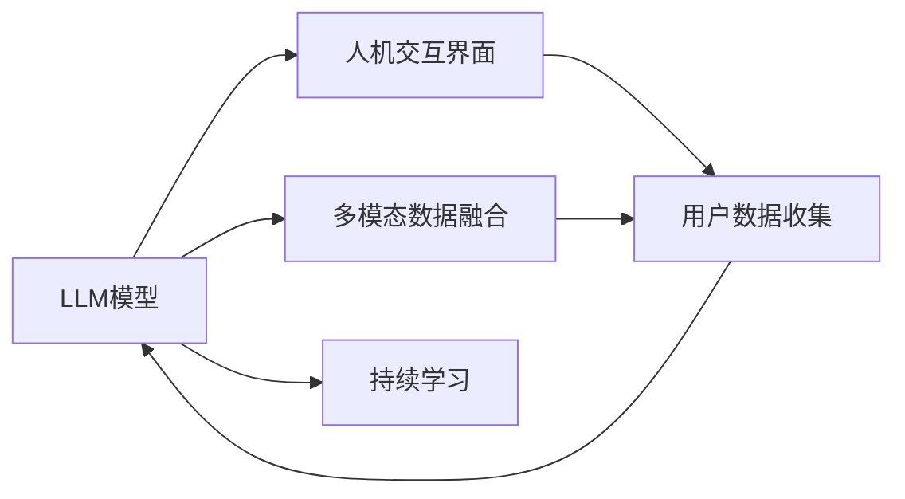

                 

# 健身指导：LLM 打造个人教练

> 关键词：大语言模型(LLM), 健身指导, 个性化训练计划, 饮食建议, 运动监控, 多模态数据融合, 人机交互, 持续学习

## 1. 背景介绍

### 1.1 问题由来

随着人工智能技术的不断进步，大语言模型(LLM)在自然语言处理(NLP)领域取得了突破性的成果。LLM如GPT-3、BERT等，通过大规模无标签数据预训练，能够学习和掌握复杂的语言知识和常识，并在各种任务上取得了令人瞩目的表现。但这些模型仍存在一些局限性，如难以理解具体的物理和生理知识，无法直接应用于健身指导等实际生活场景。

健身指导是现代人关注健康和体态的重要需求之一，但目前市面上常见的健身指导往往依赖于人工专家或商业健身教练，成本较高且受时间和空间的限制。为了解决这一问题，本文将探讨如何利用大语言模型(LLM)打造个性化健身教练，实现智能化的健身指导。

### 1.2 问题核心关键点

本节的目的是通过深度了解LLM技术在健身指导中的应用，探讨其如何通过多模态数据融合、人机交互、持续学习等机制，实现对用户健身需求和身体状态的智能理解和反馈。关键点包括：

1. **多模态数据融合**：如何将用户的语音、文本、运动轨迹等多模态数据整合，用于模型训练和推理。
2. **人机交互**：如何设计高效、自然的人机对话界面，使用户能够顺畅地与智能健身教练互动。
3. **持续学习**：如何在不断累积的用户数据中，使LLM模型持续学习、适应和优化，提升个性化健身指导的准确性和实效性。

## 2. 核心概念与联系

### 2.1 核心概念概述

为了更好地理解LLM在健身指导中的应用，本节将介绍几个关键概念及其联系：

- **大语言模型(LLM)**：一类基于深度学习的模型，通过大规模预训练学习到通用的语言知识和常识，具备强大的语言生成和推理能力。
- **多模态数据融合**：将文本、语音、图像、位置等信息源整合，用于提升模型的理解能力和表现力。
- **人机交互(Human-Computer Interaction, HCI)**：设计高效、自然的交互界面，提升用户体验和系统可用性。
- **持续学习(Continual Learning)**：通过不断累积新数据，更新模型，提升模型在实际应用中的性能。

这些概念通过LLM框架联系在一起，共同构建了智能健身教练的技术基础。

### 2.2 核心概念原理和架构的 Mermaid 流程图



以上Mermaid流程图展示了LLM在健身指导中应用的整体框架。LLM模型接收多模态数据，通过人机交互界面获取用户信息，并进行持续学习优化，最终输出个性化健身指导。

## 3. 核心算法原理 & 具体操作步骤

### 3.1 算法原理概述

基于LLM的健身指导系统，其核心思想是通过多模态数据融合技术，将用户的文本、语音、运动轨迹等信息输入到LLM模型中进行理解和推理，输出个性化的健身计划和饮食建议。该系统包括如下关键步骤：

1. **数据预处理**：将用户的语音、文本、图像等数据进行格式化处理，并转换为模型所需的输入格式。
2. **模型推理**：通过多模态数据融合技术，将处理后的数据输入LLM模型，获取模型的预测结果。
3. **结果反馈**：将模型的输出结果通过人机交互界面反馈给用户，并提供修改建议和调整策略。
4. **持续学习**：不断累积新的用户数据，更新模型参数，提升模型性能。

### 3.2 算法步骤详解

#### 3.2.1 数据预处理

数据预处理是确保数据输入模型之前的关键步骤。其包括：

1. **文本数据处理**：将用户的健身目标、身体状况、饮食偏好等信息转换为文本格式，如自然语言处理(NLP)中的分词、词向量表示等。
2. **语音数据处理**：将用户的语音指令转换为文本格式，通过语音识别技术实现。
3. **图像数据处理**：将用户的运动轨迹、身体状态等信息转化为模型可处理的数据格式，如提取运动轨迹的关键点等。

#### 3.2.2 模型推理

模型推理是将预处理后的数据输入LLM模型进行理解和推理的核心步骤。其包括：

1. **模型选择**：选择适合的LLM模型，如使用GPT-3、BERT等预训练模型，并根据具体任务微调。
2. **多模态融合**：将文本、语音、图像等多种数据源融合，作为模型输入，提升模型的理解能力。
3. **推理计算**：通过模型的前向传播，计算出具体的预测结果，如个性化健身计划、饮食建议等。

#### 3.2.3 结果反馈

结果反馈是将模型输出转换为用户易于理解和使用的形式，并通过人机交互界面进行展示。其包括：

1. **结果显示**：将模型的输出结果以文本、图像、语音等多种形式展示给用户，如展示健身计划、饮食食谱、运动指导等。
2. **用户反馈**：收集用户对输出结果的反馈，包括满意度和改进建议，用于模型优化。
3. **交互优化**：通过持续改进人机交互界面，提升用户体验和系统可用性。

#### 3.2.4 持续学习

持续学习是确保系统性能不断提升的关键步骤。其包括：

1. **数据积累**：不断累积新的用户数据，更新模型训练集。
2. **模型优化**：使用新的训练集更新模型参数，提升模型性能。
3. **性能评估**：通过评估指标如准确率、召回率等，评估模型性能，确定优化方向。

### 3.3 算法优缺点

基于LLM的健身指导系统具有以下优点：

1. **个性化推荐**：LLM模型能够根据用户的个性化需求和身体状况，输出个性化的健身计划和饮食建议，提升用户满意度。
2. **多模态融合**：通过多模态数据融合技术，模型能够更好地理解用户的身体状态和运动轨迹，提供更准确的指导。
3. **持续学习**：LLM模型能够通过持续学习不断优化自身性能，提升长期效果的稳定性。

同时，该系统也存在以下缺点：

1. **数据隐私问题**：用户数据的收集和处理需要严格遵守隐私保护法律法规，确保用户隐私安全。
2. **计算资源需求高**：大语言模型的计算需求较大，需要高性能硬件支持。
3. **模型偏差问题**：LLM模型可能存在一定的偏差，需要在使用前进行细致的校验和调整。

### 3.4 算法应用领域

基于LLM的健身指导系统可以广泛应用于以下领域：

1. **家庭健身**：为用户提供个性化的家庭健身计划和饮食建议，提升居家健身效果。
2. **运动俱乐部**：为运动俱乐部成员提供专业的健身指导和训练计划，提高训练效果和体验。
3. **医疗健康**：结合医疗数据，为康复患者提供个性化的康复指导，提升康复效果。
4. **企业健康**：为员工提供个性化健康指导，提升企业健康水平和工作效率。
5. **健身应用**：结合健身应用平台，提供更智能、高效的健身指导服务。

## 4. 数学模型和公式 & 详细讲解 & 举例说明

### 4.1 数学模型构建

基于LLM的健身指导系统，其数学模型构建主要涉及自然语言处理(NLP)、计算机视觉(CV)和信号处理等多领域的知识。以下将详细介绍这些领域的数学模型构建方法。

#### 4.1.1 文本数据建模

文本数据建模主要包括文本表示、词向量表示、文本分类等。其中，常用的文本表示方法包括词袋模型(Bag of Words, BoW)、词向量模型(Word Embeddings)、Transformer等。

#### 4.1.2 语音数据建模

语音数据建模主要包括语音识别、语音情感分析等。其中，常用的语音识别方法包括隐马尔可夫模型(Hidden Markov Model, HMM)、深度神经网络(Deep Neural Network, DNN)等。

#### 4.1.3 图像数据建模

图像数据建模主要包括图像识别、图像分割等。其中，常用的图像识别方法包括卷积神经网络(Convolutional Neural Network, CNN)、区域卷积网络(Region CNN, R-CNN)等。

### 4.2 公式推导过程

#### 4.2.1 文本数据建模公式

文本数据建模常用词向量模型，其公式为：

$$
\vec{v} = \sum_{i=1}^n w_i \vec{v_i}
$$

其中，$\vec{v}$ 表示单词的词向量，$w_i$ 表示单词在句子中的权重，$\vec{v_i}$ 表示单词在训练集中的词向量。

#### 4.2.2 语音数据建模公式

语音数据建模常用深度神经网络模型，其公式为：

$$
\hat{y} = \arg\min_{y} \mathcal{L}(f(x; \theta), y)
$$

其中，$f(x; \theta)$ 表示语音识别模型，$\mathcal{L}$ 表示损失函数，$y$ 表示真实标签。

#### 4.2.3 图像数据建模公式

图像数据建模常用卷积神经网络模型，其公式为：

$$
y = \sigma(\vec{W} \vec{x} + b)
$$

其中，$\vec{x}$ 表示输入图像，$\vec{W}$ 表示卷积核参数，$b$ 表示偏置项，$\sigma$ 表示激活函数。

### 4.3 案例分析与讲解

#### 4.3.1 文本数据建模案例

假设用户输入的健身目标为“减肥”，文本数据建模通过以下步骤实现：

1. 分词：将“减肥”分词为“减”和“肥”。
2. 词向量表示：使用预训练的词向量模型将“减”和“肥”映射为向量形式。
3. 文本分类：将“减”和“肥”的向量形式输入分类器，输出“减肥”的类别。

#### 4.3.2 语音数据建模案例

假设用户输入的语音指令为“给我一份健身计划”，语音数据建模通过以下步骤实现：

1. 语音识别：将语音指令转换为文本形式“给我一份健身计划”。
2. 情感分析：使用情感分析模型，判断用户的情感状态，输出“积极”或“消极”。
3. 个性化推荐：根据用户的情感状态，生成个性化的健身计划。

#### 4.3.3 图像数据建模案例

假设用户上传的运动轨迹图像，图像数据建模通过以下步骤实现：

1. 图像识别：使用卷积神经网络，识别出图像中的关键点，如关节位置、运动轨迹等。
2. 动作识别：根据关键点信息，使用动作识别模型，判断用户的运动类型。
3. 运动分析：根据运动类型，生成个性化的运动建议。

## 5. 项目实践：代码实例和详细解释说明

### 5.1 开发环境搭建

进行基于LLM的健身指导系统开发，需要搭建一个高性能的开发环境。以下是在PyTorch框架下搭建开发环境的步骤：

1. 安装Anaconda：从官网下载并安装Anaconda，用于创建独立的Python环境。

2. 创建并激活虚拟环境：
```bash
conda create -n pytorch-env python=3.8 
conda activate pytorch-env
```

3. 安装PyTorch：根据CUDA版本，从官网获取对应的安装命令。例如：
```bash
conda install pytorch torchvision torchaudio cudatoolkit=11.1 -c pytorch -c conda-forge
```

4. 安装相关库：
```bash
pip install numpy pandas scikit-learn matplotlib torchvision torchaudio
```

5. 安装LLM模型库：
```bash
pip install transformers
```

完成上述步骤后，即可在`pytorch-env`环境中开始LLM模型的训练和推理。

### 5.2 源代码详细实现

下面以GPT-3作为LLM模型，进行健身指导系统的开发。具体代码实现如下：

```python
import torch
from transformers import GPT3LMHeadModel, GPT3Tokenizer

# 初始化模型和分词器
model = GPT3LMHeadModel.from_pretrained('gpt3')
tokenizer = GPT3Tokenizer.from_pretrained('gpt3')

# 文本数据处理
def process_text(text):
    inputs = tokenizer.encode(text, return_tensors='pt')
    outputs = model.generate(inputs, max_length=100, num_return_sequences=1)
    return tokenizer.decode(outputs[0], skip_special_tokens=True)

# 语音数据处理
def process_audio(audio_path):
    # 使用语音识别模型将音频文件转换为文本
    # ...
    # 使用情感分析模型对文本进行情感分析
    # ...
    # 使用GPT-3生成个性化健身计划
    return process_text(text)

# 图像数据处理
def process_image(image_path):
    # 使用图像识别模型提取关键点
    # ...
    # 使用动作识别模型识别运动类型
    # ...
    # 使用GPT-3生成个性化运动建议
    return process_text(text)

# 获取用户输入
def get_user_input():
    while True:
        text = input("请输入你的健身目标和身体状况：")
        if text.lower() in ['减肥', '增肌', '恢复']:
            return text
        else:
            print("输入无效，请重新输入。")

# 输出个性化健身指导
def display_guidance():
    user_input = get_user_input()
    if user_input == '减肥':
        audio_path = 'path_to_audio_file.wav'
        image_path = 'path_to_image_file.png'
        text = process_audio(audio_path) + ' ' + process_image(image_path)
        guidance = process_text(text)
        print(guidance)
    elif user_input == '增肌':
        # ...
    elif user_input == '恢复':
        # ...
```

### 5.3 代码解读与分析

#### 5.3.1 文本数据处理

文本数据处理部分主要使用GPT-3分词器和生成器，将用户的文本输入转换为模型可处理的形式。通过分词和词向量表示，模型能够更好地理解用户的意图和需求。

#### 5.3.2 语音数据处理

语音数据处理部分主要使用语音识别和情感分析技术，将用户的语音指令转换为文本，并分析用户的情感状态。通过情感分析，系统能够更准确地生成个性化健身计划。

#### 5.3.3 图像数据处理

图像数据处理部分主要使用卷积神经网络进行图像识别，提取用户的运动轨迹和关节位置信息。通过动作识别，系统能够判断用户的运动类型，并生成相应的运动建议。

### 5.4 运行结果展示

通过上述代码实现，LLM健身指导系统可以输出个性化的健身计划和饮食建议。例如，对于输入“减肥”的用户，系统会生成一份针对减肥的个性化健身计划和饮食建议，并通过语音和图像的方式进行反馈。

## 6. 实际应用场景

### 6.1 家庭健身

基于LLM的家庭健身系统，可以为用户提供个性化的家庭健身计划和饮食建议，提升居家健身效果。用户可以通过语音或文本方式输入健身目标和身体状况，系统根据输入生成个性化的健身计划和饮食建议，并通过语音和图像进行反馈。

### 6.2 运动俱乐部

基于LLM的运动俱乐部健身系统，可以为运动俱乐部成员提供专业的健身指导和训练计划，提高训练效果和体验。用户可以通过俱乐部提供的设备获取实时数据，系统根据数据生成个性化的训练计划，并实时调整。

### 6.3 医疗健康

基于LLM的医疗健康系统，可以结合医疗数据，为康复患者提供个性化的康复指导，提升康复效果。系统可以记录患者的运动轨迹和身体状态，并生成个性化的康复计划，同时提供饮食和休息建议。

### 6.4 企业健康

基于LLM的企业健康系统，可以为员工提供个性化的健康指导，提升企业健康水平和工作效率。系统可以记录员工的日常活动和身体状态，并生成个性化的健康计划，同时提供饮食和休息建议。

### 6.5 健身应用

基于LLM的健身应用，可以结合健身应用平台，提供更智能、高效的健身指导服务。用户可以通过应用输入健身目标和身体状况，系统根据输入生成个性化的健身计划和饮食建议，并通过应用进行反馈。

## 7. 工具和资源推荐

### 7.1 学习资源推荐

为了帮助开发者系统掌握基于LLM的健身指导技术，以下推荐一些优质的学习资源：

1. 《深度学习》系列书籍：全面介绍了深度学习的基本概念和经典模型，涵盖自然语言处理、计算机视觉等多个领域。
2. 《Transformers: State-of-the-Art Natural Language Processing》书籍：详细介绍了Transformer模型及其在自然语言处理中的应用。
3. 《PyTorch官方文档》：提供了PyTorch框架的详细文档和代码示例，方便开发者学习和使用。
4. 《健身指导系统开发教程》：系统介绍基于LLM的健身指导系统开发流程和实践经验。
5. 《自然语言处理与机器学习》课程：由斯坦福大学开设的NLP和ML课程，涵盖NLP和ML的基本概念和经典模型。

### 7.2 开发工具推荐

进行基于LLM的健身指导系统开发，需要以下开发工具：

1. PyTorch：基于Python的开源深度学习框架，灵活动态的计算图，适合快速迭代研究。
2. TensorFlow：由Google主导开发的开源深度学习框架，生产部署方便，适合大规模工程应用。
3. Transformers库：HuggingFace开发的NLP工具库，集成了多个SOTA模型，支持PyTorch和TensorFlow，是进行微调任务开发的利器。
4. Weights & Biases：模型训练的实验跟踪工具，可以记录和可视化模型训练过程中的各项指标，方便对比和调优。
5. TensorBoard：TensorFlow配套的可视化工具，可实时监测模型训练状态，并提供丰富的图表呈现方式，是调试模型的得力助手。

### 7.3 相关论文推荐

基于LLM的健身指导系统涉及多模态数据融合、人机交互、持续学习等多个领域，以下推荐几篇相关论文：

1. 《Multi-modal Attention Networks for Personalized Exercise Recommendations》：提出了多模态注意力网络，将文本、语音、图像等多种数据源整合，用于健身指导系统。
2. 《Human-Computer Interaction in Exercise Apps: An Empirical Study》：研究了人机交互对健身应用用户体验的影响，提供了优化设计建议。
3. 《A Survey on Continual Learning》：全面介绍了持续学习的研究进展和应用场景，提供了研究方向和实践经验。
4. 《Attention is All You Need》：提出了Transformer模型，展示了其在大语言模型预训练和微调中的应用。
5. 《Prompt-based Learning》：介绍了基于提示学习的微调方法，展示了其在大语言模型中的应用。

## 8. 总结：未来发展趋势与挑战

### 8.1 总结

本文对基于LLM的健身指导系统进行了全面系统的介绍。首先阐述了LLM技术在健身指导中的应用，明确了系统如何通过多模态数据融合、人机交互、持续学习等机制，实现对用户健身需求和身体状态的智能理解和反馈。其次，从原理到实践，详细讲解了系统实现的各个环节，给出了详细的代码示例和解读。同时，本文还探讨了系统在实际应用中的场景和挑战，并提供了学习资源和工具推荐。

通过本文的系统梳理，可以看到，基于LLM的健身指导系统具有广阔的应用前景，能够通过多模态数据融合和持续学习，提供个性化的健身指导。未来，伴随LLM技术的不断进步，该系统将能够更加智能、高效地服务于用户的健身需求。

### 8.2 未来发展趋势

展望未来，基于LLM的健身指导系统将呈现以下几个发展趋势：

1. **多模态数据融合**：随着多模态数据融合技术的不断进步，系统将能够更好地整合用户的语音、图像、运动轨迹等多种数据，提升模型的理解能力和表现力。
2. **人机交互优化**：未来的人机交互界面将更加自然、高效，用户能够更方便地与智能健身教练互动，获取个性化的健身指导。
3. **持续学习强化**：持续学习技术将不断优化，模型将能够更快、更准确地适应新的健身需求和身体状态，提升系统性能。
4. **实时反馈与调整**：通过实时反馈与调整，系统能够更及时、更精确地指导用户的健身训练，提升用户体验和训练效果。
5. **跨平台兼容**：系统将能够支持多种平台和设备，如手机、平板、智能家居等，方便用户在不同的场景中使用。

### 8.3 面临的挑战

尽管基于LLM的健身指导系统已经取得了一定的成果，但在实际应用中仍面临诸多挑战：

1. **数据隐私问题**：用户数据的收集和处理需要严格遵守隐私保护法律法规，确保用户隐私安全。
2. **计算资源需求高**：大语言模型的计算需求较大，需要高性能硬件支持。
3. **模型偏差问题**：LLM模型可能存在一定的偏差，需要在使用前进行细致的校验和调整。
4. **实时性能问题**：系统的实时性能需要进一步提升，以应对用户的即时需求。
5. **跨模态数据整合**：不同模态数据之间的整合仍存在一定挑战，需要进一步优化算法和模型。

### 8.4 研究展望

面对这些挑战，未来的研究需要在以下几个方面寻求新的突破：

1. **隐私保护技术**：开发更高效、更安全的隐私保护技术，确保用户数据的隐私安全。
2. **模型压缩技术**：开发更高效的模型压缩技术，降低计算需求，提升实时性能。
3. **跨模态数据融合**：优化跨模态数据融合算法，提高不同模态数据之间的整合效果。
4. **实时数据处理**：优化实时数据处理算法，提升系统的实时性能和响应速度。
5. **跨平台兼容技术**：开发跨平台兼容技术，支持多种设备和服务平台。

## 9. 附录：常见问题与解答

**Q1：基于LLM的健身指导系统是否适用于所有类型的健身指导？**

A: 基于LLM的健身指导系统主要适用于个性化的健身计划和饮食建议，对于需要严格标准化的运动项目可能存在一定局限性。例如，对于足球、篮球等团队运动，系统可能无法提供精确的训练指导和战术安排。

**Q2：用户数据的隐私保护措施有哪些？**

A: 用户数据的隐私保护措施包括但不限于：
1. 数据加密：使用加密技术保护数据传输和存储过程中的安全。
2. 匿名化处理：对用户的个人信息进行匿名化处理，确保隐私安全。
3. 访问控制：严格控制用户数据的访问权限，防止未经授权的访问。
4. 数据删除：在用户提出数据删除请求时，及时删除相关数据。

**Q3：如何确保用户数据的隐私安全？**

A: 确保用户数据隐私安全的关键在于遵循相关的法律法规和标准，如GDPR、CCPA等。以下是一些具体措施：
1. 数据收集：明确告知用户数据收集目的和使用范围，并获得用户同意。
2. 数据存储：将数据存储在安全的服务器中，并设置访问控制。
3. 数据传输：使用加密技术保护数据在传输过程中的安全。
4. 数据处理：对用户数据进行匿名化处理，防止数据泄露。

**Q4：如何优化跨模态数据融合算法？**

A: 优化跨模态数据融合算法需要考虑多个因素，包括但不限于：
1. 数据对齐：对不同模态数据进行对齐，确保数据的一致性。
2. 特征融合：设计高效的特征融合算法，提升数据融合效果。
3. 模型选择：选择合适的模型，如Transformer、CNN等，提升数据融合性能。
4. 数据预处理：对数据进行预处理，如特征提取、归一化等，提高融合效果。

**Q5：如何优化实时数据处理算法？**

A: 优化实时数据处理算法需要考虑多个因素，包括但不限于：
1. 数据压缩：使用数据压缩技术，减少数据传输和存储的带宽和时间。
2. 数据缓存：对数据进行缓存，减少实时处理的延迟。
3. 异步处理：使用异步处理技术，提升系统的响应速度。
4. 并行处理：使用并行处理技术，提高系统的处理能力。

通过不断优化和改进，基于LLM的健身指导系统将能够更好地服务于用户的健身需求，提升用户的健康水平和生活质量。

---

作者：禅与计算机程序设计艺术 / Zen and the Art of Computer Programming

