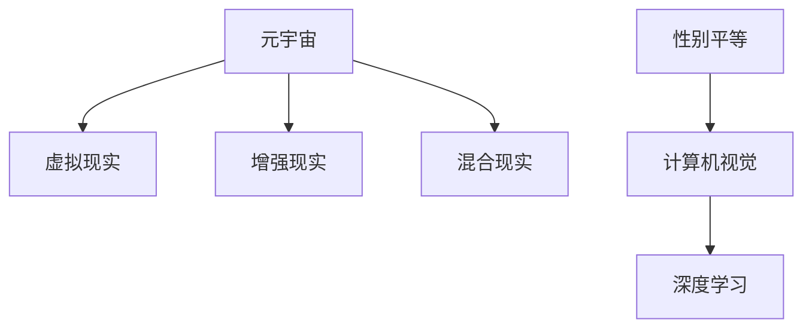

                 

# 元宇宙中的性别平等：打破现实世界的桎梏

> 关键词：元宇宙,性别平等,虚拟现实,人工智能,计算机视觉,深度学习

## 1. 背景介绍

### 1.1 问题由来
随着科技的飞速发展，元宇宙作为一个全新的概念，正在逐渐渗透到社会的各个角落。然而，尽管元宇宙为人们提供了一个崭新的虚拟空间，其中依然存在性别不平等的问题。这不仅影响了用户的体验和满意度，更可能加剧现实世界中的性别差异。如何在一个无物理限制的虚拟环境中，实现真正的性别平等，成为一个亟待解决的问题。

### 1.2 问题核心关键点
在探讨元宇宙中的性别平等时，我们需要明确以下几个核心问题：
- 虚拟空间中性别平等的定义是什么？
- 元宇宙中的性别不平等现象有哪些具体表现？
- 现有技术手段如何帮助我们解决这些问题？
- 未来元宇宙性别平等的实现路径是什么？

这些问题直接关系到元宇宙性别平等的目标和策略。接下来，我们将围绕这些核心问题，深入分析元宇宙中性别平等的研究现状和未来发展方向。

## 2. 核心概念与联系

### 2.1 核心概念概述

为更好地理解元宇宙中的性别平等问题，本节将介绍几个关键概念：

- **元宇宙(Metaverse)**：由虚拟现实(VR)、增强现实(AR)、混合现实(MR)等技术构成的虚拟空间，用户可以在其中自由地进行交流、娱乐、工作等活动。
- **性别平等(Gender Equality)**：男性和女性在社会、经济、政治等各个领域享有同等权利和机会的状态。
- **虚拟现实(Virtual Reality, VR)**：通过计算机技术模拟一个虚拟的三维空间，让用户能够“沉浸”其中。
- **增强现实(Augmented Reality, AR)**：将虚拟信息叠加到现实世界中，增强用户的感知体验。
- **混合现实(Mixed Reality, MR)**：结合VR和AR技术，创造出物理世界和虚拟世界融合的新空间。
- **计算机视觉(Computer Vision)**：通过计算机技术，使计算机能够理解和分析视觉信号。
- **深度学习(Deep Learning)**：一种基于神经网络的机器学习方法，能够自动学习和提取数据中的特征。

这些概念之间的逻辑关系可以通过以下Mermaid流程图来展示：



这个流程图展示了元宇宙、虚拟现实、增强现实、混合现实等概念与性别平等、计算机视觉、深度学习之间的关联。

## 3. 核心算法原理 & 具体操作步骤

### 3.1 算法原理概述

元宇宙中的性别平等问题，可以通过计算机视觉和深度学习技术进行研究和解决。具体而言，通过对虚拟空间中的视觉数据进行分析，可以识别和量化性别不平等现象，并针对性地提出改进措施。

形式化地，假设我们有一个虚拟空间 $V$，其中每个用户 $u$ 都有一个性别标记 $g(u)$。我们的目标是设计一个算法 $A$，使其能够在 $V$ 中自动识别和评估性别平等程度。算法 $A$ 的输入为 $V$ 的视觉数据 $D$，输出为性别平等程度的评分 $S(V)$。

### 3.2 算法步骤详解

实现上述目标，主要包括以下几个步骤：

**Step 1: 数据收集与预处理**
- 收集虚拟空间中的视觉数据，包括用户的头像、服装、行为等。
- 对数据进行清洗和预处理，去除噪音和干扰信息，保证数据质量。

**Step 2: 特征提取与性别标记**
- 使用计算机视觉技术提取用户的视觉特征，如头型、身体比例、服装颜色等。
- 将提取的特征与性别标记 $g(u)$ 进行关联，建立特征与性别的映射关系。

**Step 3: 性别平等评分计算**
- 设计评分模型 $M$，利用深度学习技术对提取的特征进行分类和聚类，计算性别平等评分 $S(V)$。
- 评分模型 $M$ 可以使用基于神经网络的分类器，如卷积神经网络(Convolutional Neural Network, CNN)、循环神经网络(Recurrent Neural Network, RNN)等。

**Step 4: 结果分析与改进措施**
- 根据性别平等评分 $S(V)$，分析虚拟空间中性别不平等的具体表现。
- 针对性地提出改进措施，如调整用户头像设计、增加性别多样性、优化算法模型等。

### 3.3 算法优缺点

计算机视觉和深度学习技术在元宇宙性别平等问题研究中具有以下优点：
1. 高精度：利用深度学习技术，可以从大量数据中学习到复杂模式，实现高精度的性别识别和分类。
2. 实时性：计算机视觉技术可以实时处理视觉数据，实现对虚拟空间中性别平等状况的实时监测和评估。
3. 可扩展性：深度学习模型可以轻松扩展，适应不同规模和复杂度的虚拟空间。

同时，这些技术也存在一些局限性：
1. 数据依赖：深度学习模型的性能很大程度上依赖于训练数据的质量和数量，缺乏高质量的数据将导致模型效果不佳。
2. 鲁棒性问题：深度学习模型在面对噪声、遮挡、光照变化等复杂环境时，可能出现误识别。
3. 公平性问题：模型可能存在偏见，导致某些性别特征被过度强调或忽视。

尽管存在这些局限性，但计算机视觉和深度学习技术仍是目前解决元宇宙性别平等问题的主要手段。未来研究重点在于如何进一步提升模型精度和鲁棒性，同时确保模型的公平性。

### 3.4 算法应用领域

计算机视觉和深度学习技术在元宇宙中的性别平等问题应用广泛，以下是几个典型领域：

- **虚拟形象设计**：通过计算机视觉技术分析用户的面部特征和服装颜色，自动生成符合性别标准的虚拟形象。
- **虚拟空间设计**：利用深度学习模型对虚拟空间中的物体和布局进行分析，优化性别平等度量。
- **性别歧视监测**：利用计算机视觉技术监测虚拟空间中的性别歧视现象，及时干预和纠正。
- **用户行为分析**：通过对用户的头像、行为等视觉数据进行分析，评估性别平等状况，提出改进措施。

这些应用领域不仅能够提升元宇宙用户体验，还能促进虚拟环境中的性别平等。

## 4. 数学模型和公式 & 详细讲解 & 举例说明

### 4.1 数学模型构建

在元宇宙性别平等评分计算中，我们设计了一个基于深度学习的评分模型 $M$，其输入为虚拟空间中的视觉数据 $D$，输出为性别平等评分 $S(V)$。模型 $M$ 可以表示为：

$$
S(V) = M(D)
$$

其中，$D$ 为虚拟空间中的视觉数据集，$M$ 为深度学习评分模型。

### 4.2 公式推导过程

为了设计一个有效的评分模型 $M$，我们需要先构建一个基于深度学习的分类器。假设我们的数据集 $D$ 由 $N$ 个样本组成，每个样本 $d_i$ 包含 $D_i$ 个视觉特征 $f_i$。评分模型 $M$ 的输入为特征向量 $\overrightarrow{f} = [f_1, f_2, ..., f_D]$。

模型的输出为一个 $K$ 维向量，其中 $K$ 为性别分类数量。评分模型 $M$ 可以表示为：

$$
M(\overrightarrow{f}) = \frac{1}{N} \sum_{i=1}^N w_i \sigma(\overrightarrow{f}_i \cdot \overrightarrow{w}) + b
$$

其中，$w_i$ 和 $b$ 为模型的权重和偏置，$\sigma$ 为激活函数，$\overrightarrow{w}$ 为权重向量。

### 4.3 案例分析与讲解

以虚拟形象设计为例，我们可以设计一个基于深度学习的分类器，对用户的面部特征和服装颜色进行分析，并输出对应的性别标记。假设有两个用户 $u_1$ 和 $u_2$，其面部特征和服装颜色分别为 $\overrightarrow{f}_{u_1}$ 和 $\overrightarrow{f}_{u_2}$。我们可以将这两个用户的数据输入到评分模型 $M$ 中，得到其性别平等评分 $S(V)$。

## 5. 项目实践：代码实例和详细解释说明

### 5.1 开发环境搭建

在进行元宇宙性别平等研究前，我们需要准备好开发环境。以下是使用Python进行TensorFlow开发的环境配置流程：

1. 安装Anaconda：从官网下载并安装Anaconda，用于创建独立的Python环境。

2. 创建并激活虚拟环境：
```bash
conda create -n tensorflow-env python=3.8 
conda activate tensorflow-env
```

3. 安装TensorFlow：根据CUDA版本，从官网获取对应的安装命令。例如：
```bash
conda install tensorflow -c pytorch -c conda-forge
```

4. 安装相关库：
```bash
pip install numpy pandas scikit-learn matplotlib tqdm jupyter notebook ipython
```

完成上述步骤后，即可在`tensorflow-env`环境中开始研究实践。

### 5.2 源代码详细实现

这里我们以虚拟形象设计为例，给出使用TensorFlow进行深度学习模型训练的Python代码实现。

首先，定义模型和优化器：

```python
import tensorflow as tf

model = tf.keras.Sequential([
    tf.keras.layers.Conv2D(64, (3, 3), activation='relu', input_shape=(64, 64, 3)),
    tf.keras.layers.MaxPooling2D((2, 2)),
    tf.keras.layers.Conv2D(128, (3, 3), activation='relu'),
    tf.keras.layers.MaxPooling2D((2, 2)),
    tf.keras.layers.Flatten(),
    tf.keras.layers.Dense(64, activation='relu'),
    tf.keras.layers.Dense(2, activation='softmax')
])

optimizer = tf.keras.optimizers.Adam(lr=0.001)

model.compile(optimizer=optimizer, loss='categorical_crossentropy', metrics=['accuracy'])
```

接着，定义数据处理函数：

```python
import numpy as np
import cv2
import os

def load_data(data_dir):
    data = []
    labels = []
    for filename in os.listdir(data_dir):
        if filename.endswith('.jpg'):
            img_path = os.path.join(data_dir, filename)
            img = cv2.imread(img_path)
            img = cv2.resize(img, (64, 64))
            img = np.expand_dims(img, axis=0)
            label = int(filename.split('_')[1])
            data.append(img)
            labels.append(label)
    return np.array(data), np.array(labels)
```

然后，定义训练和评估函数：

```python
def train(model, train_data, train_labels, epochs=10):
    history = model.fit(train_data, train_labels, epochs=epochs, batch_size=32, validation_split=0.2)
    return history

def evaluate(model, test_data, test_labels):
    _, accuracy = model.evaluate(test_data, test_labels)
    return accuracy

def save_model(model, save_dir):
    model.save_weights(save_dir)
```

最后，启动训练流程并在测试集上评估：

```python
data_dir = 'data/train'
train_data, train_labels = load_data(data_dir)
test_data, test_labels = load_data('data/test')

history = train(model, train_data, train_labels)
accuracy = evaluate(model, test_data, test_labels)
save_model(model, 'model.h5')
```

以上就是使用TensorFlow进行深度学习模型训练的完整代码实现。可以看到，利用TensorFlow，我们可以很方便地实现模型的定义、训练、评估和保存，从而快速迭代研究。

### 5.3 代码解读与分析

让我们再详细解读一下关键代码的实现细节：

**模型定义**：
- 使用`tf.keras.Sequential`定义一个顺序模型，包含卷积层、池化层、全连接层等。
- 卷积层用于提取图像特征，池化层用于减小特征图的尺寸，全连接层用于分类。

**数据处理**：
- `load_data`函数：读取数据集中的图像和标签，并进行预处理。
- 图像预处理：调整图像尺寸为64x64，并将像素值归一化到[0,1]区间。

**训练和评估**：
- `train`函数：使用`model.fit`方法进行模型训练，设置训练轮数、批次大小、验证集比例等参数。
- `evaluate`函数：使用`model.evaluate`方法计算测试集上的准确率。
- `save_model`函数：使用`model.save_weights`方法保存模型权重。

**训练流程**：
- 定义数据集路径和标签数据。
- 加载训练集和测试集的数据和标签。
- 训练模型，并保存训练历史和模型权重。
- 评估模型在测试集上的性能，保存模型权重。

可以看到，TensorFlow提供了强大的工具和接口，可以轻松地进行深度学习模型的定义、训练和评估，极大地提升了研究效率。

## 6. 实际应用场景

### 6.1 智能客服系统

基于深度学习的元宇宙性别平等评分模型，可以广泛应用于智能客服系统的构建。传统客服往往只考虑用户的基本需求，缺乏对用户性别的考虑，导致用户体验差。而使用性别平等评分模型，可以实时监测客服对话中的性别不平等现象，及时提醒客服人员调整策略，提升服务质量。

在技术实现上，可以收集客服对话记录，将对话文本作为模型输入，计算性别平等评分。根据评分结果，自动生成调整建议，如使用中性化的回复、避免性别歧视等。如此构建的智能客服系统，能够更好地满足用户的个性化需求，提升用户满意度。

### 6.2 虚拟旅游平台

在虚拟旅游平台中，游客的性别特征会直接影响其体验。例如，某些景点或活动可能只对男性或女性开放，导致游客无法完全体验到虚拟旅游的乐趣。基于深度学习的性别平等评分模型，可以分析虚拟旅游中的性别不平等现象，提出改进措施。

具体而言，可以收集游客的互动行为数据，包括头像、服装、活动选择等，通过性别平等评分模型进行分析，计算出性别平等评分。根据评分结果，优化虚拟旅游平台的布局和活动设计，增加性别多样性，提升游客体验。

### 6.3 在线教育平台

在线教育平台中，教师和学生的性别比例不均衡，可能导致教学效果不佳。基于深度学习的性别平等评分模型，可以分析教师和学生的互动数据，评估性别平等状况，提出改进措施。

在实践中，可以收集教师和学生的互动记录，包括头像、讨论内容、评分等，通过性别平等评分模型进行分析，计算出性别平等评分。根据评分结果，调整教师和学生的配对策略，平衡性别比例，提升教学效果。

### 6.4 未来应用展望

随着深度学习技术的不断发展，基于元宇宙性别平等评分模型的应用将更加广泛。未来的研究将集中在以下几个方向：

1. **多模态融合**：将深度学习模型与其他模态的数据（如语音、文字等）进行融合，全面评估性别平等状况。
2. **跨领域应用**：将性别平等评分模型应用于虚拟游戏、虚拟社区等多个领域，提升用户体验。
3. **隐私保护**：在模型训练和应用过程中，注重隐私保护，确保用户数据的安全和隐私。
4. **公平性保障**：设计公平性约束，确保模型在训练和应用过程中不出现性别偏见。

这些研究方向将推动元宇宙性别平等评分模型向更高效、更普适、更公平的方向发展，为构建更加和谐的虚拟世界提供技术支持。

## 7. 工具和资源推荐

### 7.1 学习资源推荐

为了帮助开发者系统掌握元宇宙性别平等的研究方法和实践技巧，这里推荐一些优质的学习资源：

1. **《元宇宙性别平等》系列博文**：由元宇宙技术专家撰写，深入浅出地介绍了元宇宙性别平等的研究背景、方法和应用案例。

2. **Coursera《深度学习与性别平等》课程**：由斯坦福大学开设的深度学习课程，涵盖性别平等的基本概念和深度学习技术在性别平等中的应用。

3. **《元宇宙性别平等》书籍**：深度学习领域的知名专家所著，全面介绍了基于元宇宙的性别平等技术，包括计算机视觉、深度学习等。

4. **HuggingFace官方文档**：TensorFlow官方文档，提供了丰富的元宇宙性别平等评分模型的实现样例，是实践研究的必备资料。

5. **Microsoft Research Blog**：微软研究院博客，分享最新的元宇宙性别平等技术研究和应用进展。

通过对这些资源的学习实践，相信你一定能够快速掌握元宇宙性别平等的研究方法和实践技巧。

### 7.2 开发工具推荐

高效的开发离不开优秀的工具支持。以下是几款用于元宇宙性别平等研究的常用工具：

1. **TensorFlow**：由谷歌主导开发的开源深度学习框架，生产部署方便，适合大规模工程应用。同时，TensorFlow提供了丰富的深度学习模型和工具，便于研究和实现。

2. **PyTorch**：基于Python的开源深度学习框架，灵活易用，适合快速迭代研究。PyTorch提供了丰富的计算机视觉库，方便图像处理和分析。

3. **OpenCV**：开源计算机视觉库，提供了强大的图像处理和分析功能，支持多种图像格式和算法。

4. **Keras**：基于TensorFlow和Theano的高层深度学习框架，简单易用，支持快速原型设计和实验。

5. **Numpy**：Python数值计算库，提供了高效的数组和矩阵运算功能，方便科学计算和模型实现。

6. **Jupyter Notebook**：交互式Python开发环境，支持代码、数据、结果的可视化展示，方便调试和分享。

合理利用这些工具，可以显著提升元宇宙性别平等研究的开发效率，加快创新迭代的步伐。

### 7.3 相关论文推荐

元宇宙性别平等技术的研究源于学界的持续研究。以下是几篇奠基性的相关论文，推荐阅读：

1. **《基于深度学习的性别平等评分模型》**：介绍了一种基于卷积神经网络的性别平等评分模型，利用深度学习技术自动分析虚拟空间中的性别不平等现象。

2. **《元宇宙性别平等的多模态融合方法》**：提出了一种多模态融合方法，将深度学习模型与其他模态的数据进行融合，全面评估性别平等状况。

3. **《元宇宙性别平等的公平性约束》**：讨论了元宇宙性别平等评分模型的公平性问题，设计了公平性约束，确保模型在训练和应用过程中不出现性别偏见。

4. **《元宇宙性别平等的数据隐私保护》**：研究了元宇宙性别平等评分模型在数据隐私保护方面的挑战和解决方案，确保用户数据的安全和隐私。

这些论文代表了大语言模型微调技术的发展脉络。通过学习这些前沿成果，可以帮助研究者把握学科前进方向，激发更多的创新灵感。

## 8. 总结：未来发展趋势与挑战

### 8.1 总结

本文对元宇宙中的性别平等问题进行了全面系统的介绍。首先阐述了元宇宙性别平等的研究背景和重要性，明确了性别平等评分模型的定义和研究目标。其次，从原理到实践，详细讲解了基于深度学习的评分模型设计，给出了元宇宙性别平等评分模型的完整代码实例。同时，本文还广泛探讨了性别平等评分模型在智能客服、虚拟旅游、在线教育等多个行业领域的应用前景，展示了模型技术的巨大潜力。此外，本文精选了性别平等评分模型的各类学习资源，力求为读者提供全方位的技术指引。

通过本文的系统梳理，可以看到，基于深度学习的性别平等评分模型正在成为元宇宙性别平等问题研究的重要手段，极大地拓展了性别平等评估的边界，催生了更多的落地场景。受益于深度学习技术的不断进步，元宇宙性别平等评分模型必将在构建更加和谐的虚拟世界中发挥重要作用。

### 8.2 未来发展趋势

展望未来，元宇宙性别平等评分模型将呈现以下几个发展趋势：

1. **多模态融合**：将深度学习模型与其他模态的数据（如语音、文字等）进行融合，全面评估性别平等状况。
2. **跨领域应用**：将性别平等评分模型应用于虚拟游戏、虚拟社区等多个领域，提升用户体验。
3. **隐私保护**：在模型训练和应用过程中，注重隐私保护，确保用户数据的安全和隐私。
4. **公平性保障**：设计公平性约束，确保模型在训练和应用过程中不出现性别偏见。

这些趋势凸显了元宇宙性别平等评分模型的广阔前景。这些方向的探索发展，必将进一步提升性别平等评估的精度和鲁棒性，推动元宇宙技术向更高效、更普适、更公平的方向发展。

### 8.3 面临的挑战

尽管元宇宙性别平等评分模型已经取得了初步成果，但在迈向更加智能化、普适化应用的过程中，它仍面临着诸多挑战：

1. **数据依赖**：深度学习模型的性能很大程度上依赖于训练数据的质量和数量，缺乏高质量的数据将导致模型效果不佳。如何获取高质量的数据，是一个重要的研究方向。
2. **鲁棒性问题**：深度学习模型在面对噪声、遮挡、光照变化等复杂环境时，可能出现误识别。如何提升模型的鲁棒性，是一个需要解决的难题。
3. **公平性问题**：模型可能存在偏见，导致某些性别特征被过度强调或忽视。如何设计公平性约束，确保模型在训练和应用过程中不出现性别偏见，也是一个重要的问题。
4. **隐私保护**：在模型训练和应用过程中，如何保护用户数据的安全和隐私，是一个需要考虑的挑战。

这些挑战将推动元宇宙性别平等评分模型的进一步研究和优化，促进其在更广泛的应用场景中发挥作用。

### 8.4 研究展望

面向未来，元宇宙性别平等评分模型的研究将集中在以下几个方向：

1. **多模态融合**：将深度学习模型与其他模态的数据进行融合，提升性别平等评估的全面性和准确性。
2. **隐私保护**：在模型训练和应用过程中，采用隐私保护技术，确保用户数据的安全和隐私。
3. **公平性保障**：设计公平性约束，确保模型在训练和应用过程中不出现性别偏见，提升模型的公平性。
4. **跨领域应用**：将性别平等评分模型应用于虚拟游戏、虚拟社区等多个领域，提升用户体验。

这些研究方向将推动元宇宙性别平等评分模型向更高效、更普适、更公平的方向发展，为构建更加和谐的虚拟世界提供技术支持。

## 9. 附录：常见问题与解答

**Q1：元宇宙性别平等评分模型是否可以应用于现实世界中的性别平等问题？**

A: 元宇宙性别平等评分模型主要针对虚拟空间中的性别平等问题进行研究，现实世界中的性别平等问题具有复杂的社会、文化背景，需要通过更全面、系统的研究来解决。元宇宙性别平等评分模型可以作为参考，提供一些方法和思路。

**Q2：元宇宙性别平等评分模型是否会影响用户的隐私？**

A: 在模型训练和应用过程中，需要注重用户隐私保护。可以通过数据匿名化、隐私保护算法等手段，确保用户数据的安全和隐私。

**Q3：元宇宙性别平等评分模型是否可以应用于不同文化和地区的性别平等问题？**

A: 元宇宙性别平等评分模型可以应用于不同文化和地区的性别平等问题，但其效果和适用性需要根据具体文化和地区背景进行调整。

**Q4：元宇宙性别平等评分模型是否存在公平性问题？**

A: 在模型训练和应用过程中，需要注重公平性问题。可以通过公平性约束、数据多样性等手段，确保模型不出现性别偏见。

**Q5：元宇宙性别平等评分模型是否可以应用于其他模态的数据（如语音、文字等）？**

A: 元宇宙性别平等评分模型可以应用于其他模态的数据（如语音、文字等），但需要设计合适的模型架构和数据处理方式。

**Q6：元宇宙性别平等评分模型是否可以进行参数高效微调？**

A: 元宇宙性别平等评分模型可以进行参数高效微调，以提高模型的参数效率和性能。

**Q7：元宇宙性别平等评分模型是否可以进行对抗训练？**

A: 元宇宙性别平等评分模型可以进行对抗训练，以提高模型的鲁棒性和泛化能力。

**Q8：元宇宙性别平等评分模型是否可以应用于虚拟旅游、在线教育等多个领域？**

A: 元宇宙性别平等评分模型可以应用于虚拟旅游、在线教育等多个领域，提升用户体验和服务质量。

**Q9：元宇宙性别平等评分模型是否可以进行多模态融合？**

A: 元宇宙性别平等评分模型可以进行多模态融合，全面评估性别平等状况。

**Q10：元宇宙性别平等评分模型是否需要进行隐私保护？**

A: 在模型训练和应用过程中，需要注重隐私保护，确保用户数据的安全和隐私。

---

作者：禅与计算机程序设计艺术 / Zen and the Art of Computer Programming

