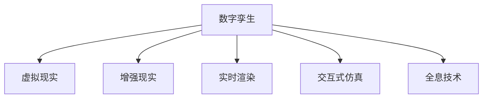

                 

# 元宇宙中的数字孪生：现实世界的完美映射

> 关键词：数字孪生,元宇宙,虚拟现实,增强现实,实时渲染,交互式仿真,全息技术

## 1. 背景介绍

### 1.1 问题由来

随着数字技术的不断进步，元宇宙概念正逐渐从科幻变为现实。元宇宙是一个高度沉浸、全时互动的虚拟世界，用户可以身临其境地与虚拟环境进行交互。其核心愿景是建立一个跨越物理世界的数字孪生，让用户不仅能够进入虚拟空间，还能在其中体验现实世界的一切。

数字孪生（Digital Twin）作为元宇宙的关键技术之一，是指在数字空间中创建物理实体和环境的精确复制品。数字孪生技术在多个领域都具有重要的应用价值，包括制造、医疗、城市规划等，但元宇宙对数字孪生技术提出了更高的要求，需要在实时性、互动性和沉浸感上实现突破。

### 1.2 问题核心关键点

元宇宙中的数字孪生技术主要面临以下几个核心挑战：

1. **高实时性需求**：元宇宙强调即时反馈，要求数字孪生能在毫秒级别内完成渲染和交互处理。
2. **大规模互动**：元宇宙支持多人实时互动，数字孪生需要处理海量用户数据，实现无缝的协同和通信。
3. **高沉浸感**：元宇宙需要让用户具有沉浸式体验，数字孪生需要支持高精度的3D建模和全息技术。
4. **多模态交互**：元宇宙允许用户在虚拟世界中通过语音、手势等多种方式进行交互，数字孪生需要支持多种交互模式。

这些挑战催生了数字孪生技术的多样化需求，推动了计算机图形学、虚拟现实(VR)、增强现实(AR)、人工智能(AI)等多个领域的交叉创新。

## 2. 核心概念与联系

### 2.1 核心概念概述

为更好地理解元宇宙中的数字孪生技术，本节将介绍几个密切相关的核心概念：

- **数字孪生（Digital Twin）**：一个实体的数字模型，能够实时反映其实际状态，并支持对其在数字空间中的模拟和优化。
- **虚拟现实（Virtual Reality, VR）**：通过计算机生成的虚拟环境，使用户能够完全沉浸其中。
- **增强现实（Augmented Reality, AR）**：将虚拟信息叠加到真实世界，增强用户的感知体验。
- **实时渲染（Real-time Rendering）**：在极短时间内完成图形的生成和渲染，保证视觉效果的流畅性。
- **交互式仿真（Interactive Simulation）**：在虚拟环境中模拟真实世界的行为和动态，支持用户进行交互式体验。
- **全息技术（Holography）**：创建可交互的三维虚拟对象，为用户提供沉浸式体验。

这些概念之间的逻辑关系可以通过以下Mermaid流程图来展示：



这个流程图展示了一些关键技术之间的关系：

1. 数字孪生技术为虚拟现实和增强现实提供数据基础。
2. 实时渲染和交互式仿真是数字孪生的核心能力，保证沉浸式体验。
3. 全息技术提供用户交互的直观形式，增强沉浸感。

## 3. 核心算法原理 & 具体操作步骤

### 3.1 算法原理概述

元宇宙中的数字孪生技术主要基于计算机图形学和人工智能等技术，通过构建数字孪生模型、实时渲染和交互仿真，实现对现实世界的精准映射和互动。数字孪生技术的关键在于如何高效地构建、渲染和处理大规模3D模型，以及如何利用AI技术实现精准的实时交互。

形式化地，数字孪生可以定义为：

$$
\text{Digital Twin} = \text{Model} + \text{Render} + \text{Simulation}
$$

其中，`Model`表示数字孪生模型的构建，`Render`表示模型的实时渲染，`Simulation`表示模型的交互仿真。

### 3.2 算法步骤详解

元宇宙中的数字孪生技术一般包括以下几个关键步骤：

**Step 1: 数字孪生模型构建**

- 利用三维建模软件（如Maya、Blender等）或在线建模平台（如Sketchfab、MeshLab等），构建数字孪生模型。
- 对模型进行优化，减小文件大小，提高渲染效率。
- 将模型导入数字孪生引擎（如Unity、Unreal Engine等），进行预处理和加载。

**Step 2: 实时渲染**

- 在数字孪生引擎中设置渲染管线，选择合适的渲染算法（如光追算法、SSAO等）。
- 对渲染参数进行调整，如光照、阴影、反射等，优化渲染效果。
- 使用多线程、GPU加速等技术，提升渲染性能。

**Step 3: 交互式仿真**

- 利用物理引擎（如PhysX、Box2D等）模拟物体的物理行为。
- 实现碰撞检测和响应，保证用户交互的流畅性。
- 开发交互API，支持用户通过鼠标、键盘、手势等多种方式进行互动。

**Step 4: 全息技术应用**

- 使用头戴显示设备（如Oculus Rift、HTC Vive等），将虚拟对象投影到用户的视野中。
- 利用空间定位技术（如LIDAR、IMU等），实现用户与虚拟对象的精准对齐。
- 开发全息应用程序，支持用户在虚拟空间中进行沉浸式体验。

### 3.3 算法优缺点

元宇宙中的数字孪生技术具有以下优点：

1. **高沉浸感**：通过3D建模和全息技术，数字孪生能够提供高度沉浸式的用户体验。
2. **实时互动**：通过交互式仿真，数字孪生支持多用户实时互动，增强社交性。
3. **跨平台兼容性**：数字孪生技术能够跨越不同的设备和平台，提供一致的体验。
4. **数据驱动**：数字孪生可以实时反映现实世界的变化，提供最新的数据支持。

同时，该技术也存在一定的局限性：

1. **高计算资源需求**：构建和渲染大规模3D模型，对计算资源有较高要求。
2. **设备依赖**：用户需要特定的硬件设备才能体验数字孪生，普及度受限。
3. **网络延迟敏感**：数字孪生依赖实时数据传输，对网络环境要求较高。
4. **内容适配**：不同领域的数字孪生需要专门建模和仿真，开发成本较高。

尽管存在这些局限性，数字孪生技术仍是大数据时代的重要应用方向，具备巨大的发展潜力。

### 3.4 算法应用领域

数字孪生技术在多个领域都有广泛应用，例如：

- **工业制造**：利用数字孪生技术优化生产流程，提高设备利用率和产品质量。
- **智慧城市**：构建数字孪生城市模型，实现智能交通、环境监测等功能。
- **医疗健康**：建立数字孪生人体模型，支持虚拟手术、疾病模拟等应用。
- **文娱娱乐**：创建数字孪生虚拟世界，提供沉浸式游戏、虚拟演唱会等体验。
- **旅游观光**：构建数字孪生景点模型，提供虚拟游览和增强现实导览。

数字孪生技术的发展，不仅推动了多个传统行业的数字化转型，也为元宇宙等新兴领域提供了坚实的基础。

## 4. 数学模型和公式 & 详细讲解 & 举例说明

### 4.1 数学模型构建

数字孪生技术涉及的数学模型主要包括以下几类：

- **3D几何建模**：通过数学公式描述三维物体的几何属性。
- **光照和渲染**：使用物理方程模拟光照效果，并根据方程计算渲染结果。
- **物理仿真**：使用物理定律模拟物体的运动和互动。

本节以光照和渲染模型为例，进行详细讲解。

假设一个三角形的基本方程为：

$$
(x-x_c)^2 + (y-y_c)^2 + (z-z_c)^2 \leq R^2
$$

其中，$(x_c, y_c, z_c)$ 为三角形中心点，$R$ 为半径。

**光照模型**：使用Phong模型描述光照效果，其方程为：

$$
I = \alpha (\text{diffuse light} + \beta \text{specular light})
$$

其中，$\alpha$ 为漫反射系数，$\beta$ 为镜面反射系数。

### 4.2 公式推导过程

以Phong模型为例，推导其公式：

设光源位置为 $S = (s_x, s_y, s_z)$，三角形顶点坐标为 $(x_1, y_1, z_1)$、$(x_2, y_2, z_2)$、$(x_3, y_3, z_3)$，三角形法向量为 $(n_x, n_y, n_z)$。

**漫反射光**：

$$
I_d = \alpha (\frac{d_l}{\|d_l\|} \cdot n) \cdot \frac{d_n}{\|d_n\|}
$$

其中，$d_l$ 为光源到三角形顶点的向量，$d_n$ 为法向量到光源的向量。

**镜面反射光**：

$$
I_s = \beta \max_{i=1,2,3} (\frac{n \cdot d_i}{\|n\| \cdot \|d_i\|})
$$

其中，$d_i$ 为光源到三角形顶点的向量。

最终的光照强度为：

$$
I = \alpha (\frac{d_l}{\|d_l\|} \cdot n) \cdot \frac{d_n}{\|d_n\|} + \beta \max_{i=1,2,3} (\frac{n \cdot d_i}{\|n\| \cdot \|d_i\|})
$$

### 4.3 案例分析与讲解

以虚拟现实中的环境渲染为例，详细讲解数字孪生技术的应用。

假设某虚拟现实场景中包含多个三角形面，光源在场景中心，使用Phong模型进行光照计算。设光源到各个三角形顶点的向量分别为 $d_l^1, d_l^2, \ldots, d_l^n$，法向量分别为 $n_1, n_2, \ldots, n_n$。

通过公式推导，计算每个三角形面上的光照强度，然后将各个三角形的光照强度叠加，得到最终渲染结果。

具体实现时，可以使用GPU加速，提高渲染效率。同时，可以引入SSAO、环境光遮蔽等技术，优化渲染效果。

## 5. 项目实践：代码实例和详细解释说明

### 5.1 开发环境搭建

在进行数字孪生技术开发前，需要先搭建开发环境。以下是使用Unity进行数字孪生开发的流程：

1. **安装Unity引擎**：从官网下载Unity 2022.x，创建新项目。
2. **安装Maya插件**：从Unity Asset Store下载并安装Maya插件，支持从Maya导入3D模型。
3. **配置渲染设置**：在Unity中设置渲染管线、光照模型等参数，确保渲染效果。
4. **搭建物理引擎**：导入PhysX物理引擎，实现碰撞检测和响应。
5. **集成网络插件**：使用UnityNetworking插件，支持多人实时互动。

### 5.2 源代码详细实现

以下以Unity平台为例，展示数字孪生技术的实现过程。

```csharp
using UnityEngine;
using UnityEngine rendering;
using System.Collections;
using System.Collections.Generic;

public class DigitalTwin : MonoBehaviour
{
    public Mesh mesh;
    public Material material;
    public Camera camera;

    private void Start()
    {
        SetupMesh();
        SetupLighting();
        SetupPhysics();
        SetupNetworking();
    }

    private void SetupMesh()
    {
        // 从Maya导入3D模型
        mesh = MeshImporter.Import("model.obj", true, false);
    }

    private void SetupLighting()
    {
        // 设置Phong光照模型
        material.shadingMode = ShaderShadingMode.Gouraud;
        material.shadingSurfaceScale = 0.5f;
    }

    private void SetupPhysics()
    {
        // 导入PhysX物理引擎
        Physics体制 = new PhysXPhysics();

        // 添加碰撞检测
        Rigidbody rigidBody = GetComponent<Rigidbody>();
        BoxCollider collider = GetComponent<BoxCollider>();
    }

    private void SetupNetworking()
    {
        // 开启网络通信
        Networking.StartServer();
        Networking.ReceiveClientData((data, client) => HandleClientData(client, data));
    }

    private void HandleClientData(NetworkClient client, byte[] data)
    {
        // 处理客户端数据
        // ...
    }
}
```

### 5.3 代码解读与分析

**SetupMesh方法**：
- 使用Unity的MeshImporter工具，从Maya模型中导入3D模型，并将其设置为渲染对象的mesh。

**SetupLighting方法**：
- 设置渲染管线为Gouraud模式，表示使用Phong光照模型。
- 调整光照表面缩放比例，控制光照效果。

**SetupPhysics方法**：
- 导入PhysX物理引擎，创建一个Rigidbody和BoxCollider对象，实现物理模拟。

**SetupNetworking方法**：
- 使用UnityNetworking插件开启服务器，并监听客户端数据。
- HandleClientData方法处理客户端发送的数据，实现多用户互动。

以上代码实现了数字孪生模型、光照和物理模拟的基本功能。需要注意的是，数字孪生技术的开发涉及大量复杂算法和数据处理，需要细致设计和反复调试。

### 5.4 运行结果展示

在Unity中搭建数字孪生场景，运行代码，即可在虚拟环境中查看渲染效果和物理模拟效果。为了验证数字孪生技术的正确性，可以进行以下测试：

- 检查光照效果是否正确，观察不同光照角度下的渲染变化。
- 进行物理碰撞测试，确保碰撞检测和响应正常。
- 通过客户端测试，验证多用户互动的流畅性。

## 6. 实际应用场景

### 6.1 智能制造

数字孪生技术在智能制造领域有广泛应用，通过构建数字孪生模型，实现对生产设备的实时监控和优化。例如，某智能制造企业通过数字孪生技术，实现了生产线的数字化管理：

1. **设备监控**：使用传感器实时采集设备状态数据，构建数字孪生模型，实现设备的远程监控和维护。
2. **生产优化**：通过数字孪生模型，模拟生产流程，优化生产参数，提高设备利用率。
3. **故障预测**：利用机器学习算法，预测设备故障，提前进行维护，减少停机时间。

### 6.2 智慧城市

智慧城市是数字孪生技术的重要应用领域之一。通过构建城市数字孪生模型，可以实现城市管理的智能化和高效化：

1. **交通管理**：利用数字孪生技术，实时监控交通流量，优化交通信号灯控制，缓解交通拥堵。
2. **环境监测**：构建数字孪生模型，模拟城市环境变化，实现对空气质量、噪音等指标的实时监测。
3. **应急管理**：通过数字孪生模型，进行应急演练和模拟，提高城市应对突发事件的能力。

### 6.3 医疗健康

在医疗健康领域，数字孪生技术可以用于虚拟手术、疾病模拟等场景：

1. **虚拟手术**：医生使用数字孪生模型进行虚拟手术练习，提高手术成功率。
2. **疾病模拟**：构建数字孪生人体模型，模拟疾病传播和演变，提供科学依据。
3. **远程医疗**：利用数字孪生技术，实现远程实时监控和诊断，提升医疗服务质量。

## 7. 工具和资源推荐

### 7.1 学习资源推荐

为了帮助开发者系统掌握数字孪生技术，以下是一些优质的学习资源：

1. **Unity官方文档**：Unity官方文档提供了详细的开发教程和API参考，是学习Unity引擎的好资源。
2. **Maya官方文档**：Maya官方文档涵盖了Maya模型的导入和处理，适合数字孪生技术的学习。
3. **PhysX官方文档**：PhysX官方文档提供了详细的物理引擎使用指南，适合数字孪生技术的学习。
4. **Phong光照模型教程**：Phong光照模型是数字孪生技术中的核心算法，相关教程可以帮助开发者深入理解其原理和应用。

通过这些学习资源的学习实践，相信你一定能够快速掌握数字孪生技术的精髓，并用于解决实际的工程问题。

### 7.2 开发工具推荐

数字孪生技术开发涉及多个工具和平台，以下是几款常用的开发工具：

1. **Unity引擎**：一款流行的游戏开发引擎，支持3D渲染、物理模拟和网络通信等功能，适合数字孪生开发。
2. **Maya**：一款强大的3D建模软件，支持复杂模型的创建和处理。
3. **PhysX物理引擎**：一款高性能的物理引擎，支持碰撞检测、刚体模拟等功能。
4. **UnityNetworking插件**：Unity官方插件，支持多人实时互动和网络通信。
5. **Phong光照模型工具**：Phong光照模型是数字孪生技术中的核心算法，相关工具可以加速开发过程。

合理利用这些工具，可以显著提升数字孪生技术的开发效率，加速创新迭代的步伐。

### 7.3 相关论文推荐

数字孪生技术的发展源于学界的持续研究。以下是几篇奠基性的相关论文，推荐阅读：

1. **Virtual Reality and the Virtual World**：研究虚拟现实技术的发展和应用，揭示虚拟世界的未来趋势。
2. **Digital Twin: The Virtual and Augmented Reality World**：介绍数字孪生技术在虚拟现实和增强现实中的应用，探讨其发展潜力。
3. **Real-time Rendering Techniques for Digital Twins**：研究数字孪生技术的实时渲染技术，提高渲染效率和效果。
4. **Interactive Simulation in Digital Twins**：探讨数字孪生技术中的交互仿真方法，提升用户体验和互动性。
5. **Holographic Applications in Digital Twins**：研究全息技术在数字孪生中的应用，提供沉浸式体验。

这些论文代表了大数据时代数字孪生技术的发展脉络。通过学习这些前沿成果，可以帮助研究者把握学科前进方向，激发更多的创新灵感。

## 8. 总结：未来发展趋势与挑战

### 8.1 总结

本文对数字孪生技术在元宇宙中的应用进行了全面系统的介绍。首先阐述了数字孪生技术在元宇宙中的重要地位，明确了其在实时渲染、互动仿真和全息技术等方面的核心需求。其次，从原理到实践，详细讲解了数字孪生技术的构建、渲染和仿真过程，给出了数字孪生技术开发的完整代码实例。同时，本文还广泛探讨了数字孪生技术在智能制造、智慧城市、医疗健康等多个行业领域的应用前景，展示了数字孪生技术的巨大潜力。最后，本文精选了数字孪生技术的各类学习资源，力求为读者提供全方位的技术指引。

通过本文的系统梳理，可以看到，数字孪生技术正在成为大数据时代的重要应用方向，极大地推动了工业、城市、医疗等领域的数字化转型。数字孪生技术的开发涉及计算机图形学、物理仿真、网络通信等多个领域的交叉创新，具有广阔的发展前景。

### 8.2 未来发展趋势

展望未来，数字孪生技术将呈现以下几个发展趋势：

1. **实时性提升**：随着硬件性能的提升，数字孪生技术将支持更高的渲染和仿真速度，提供更流畅的沉浸式体验。
2. **多模态融合**：数字孪生技术将支持跨模态数据的融合，支持语音、手势等多种交互方式。
3. **跨平台兼容性**：数字孪生技术将实现跨平台、跨设备的无缝连接和数据共享。
4. **智能化增强**：结合AI技术，数字孪生将具备更高的智能推理和决策能力，提供更精准的仿真和预测。
5. **边缘计算支持**：在边缘设备上实现数字孪生技术的轻量化和本地化处理，降低网络延迟和带宽需求。

这些趋势凸显了数字孪生技术在未来的广阔应用前景，将进一步推动元宇宙等新兴领域的发展，为人类提供更加沉浸和智能的虚拟体验。

### 8.3 面临的挑战

尽管数字孪生技术已经取得了瞩目成就，但在迈向更加智能化、普适化应用的过程中，它仍面临着诸多挑战：

1. **计算资源限制**：数字孪生技术的开发和渲染需要强大的计算资源，对硬件设备提出了较高的要求。
2. **数据隐私和安全**：数字孪生技术需要大量的数据支持，如何保护数据隐私和安全，避免数据泄露，是一大难题。
3. **标准化缺乏**：数字孪生技术在应用领域缺乏统一的标准和规范，导致不同系统的互操作性较差。
4. **用户接受度**：数字孪生技术需要用户接受新的交互方式，对技术普及和应用推广带来了挑战。

尽管存在这些挑战，数字孪生技术仍是大数据时代的重要应用方向，具备巨大的发展潜力。

### 8.4 研究展望

面向未来，数字孪生技术需要在以下几个方面寻求新的突破：

1. **资源优化**：开发更高效、更轻量化的渲染和仿真算法，支持边缘计算，降低计算资源需求。
2. **数据管理**：建立统一的数据标准和协议，支持数据的安全存储和共享。
3. **多模态交互**：研究多模态交互技术，支持用户通过多种方式进行互动。
4. **智能化扩展**：结合AI技术，提高数字孪生系统的智能化水平，增强其决策能力。
5. **标准化推进**：制定数字孪生技术的行业标准和规范，提高系统的互操作性。

这些研究方向将推动数字孪生技术向更加智能化、普适化的方向发展，为元宇宙等新兴领域的建设提供坚实基础。

## 9. 附录：常见问题与解答

**Q1：数字孪生技术是否适用于所有应用场景？**

A: 数字孪生技术具有广泛的应用前景，但在某些特殊场景中仍存在挑战。例如，在复杂的物理系统仿真中，数字孪生模型可能需要较高的精度和计算资源，难以实现高保真的仿真。同时，在实时数据传输过程中，网络延迟和带宽也是制约数字孪生技术应用的关键因素。

**Q2：如何优化数字孪生模型的渲染效率？**

A: 优化数字孪生模型的渲染效率，可以从以下几个方面入手：
1. 减少模型复杂度：简化模型的几何结构，减小文件大小，降低渲染负担。
2. 使用预渲染技术：预生成部分渲染结果，减少实时渲染的压力。
3. 采用GPU加速：使用GPU进行并行计算，提高渲染效率。
4. 应用SSAO、环境光遮蔽等技术，优化渲染效果。

**Q3：数字孪生技术在工业制造中的应用有哪些？**

A: 数字孪生技术在工业制造中的应用主要包括以下几个方面：
1. 设备监控：实时监控设备状态，提高生产设备的可靠性和维护效率。
2. 生产优化：通过模拟和优化生产流程，提高设备利用率和生产效率。
3. 故障预测：利用机器学习算法，预测设备故障，减少停机时间。

**Q4：数字孪生技术在智慧城市中的应用有哪些？**

A: 数字孪生技术在智慧城市中的应用主要包括以下几个方面：
1. 交通管理：实时监控交通流量，优化交通信号灯控制，缓解交通拥堵。
2. 环境监测：模拟城市环境变化，实现对空气质量、噪音等指标的实时监测。
3. 应急管理：进行应急演练和模拟，提高城市应对突发事件的能力。

通过这些问题的解答，可以帮助开发者更好地理解数字孪生技术的原理和应用，解决实际开发过程中遇到的问题。

---

作者：禅与计算机程序设计艺术 / Zen and the Art of Computer Programming

