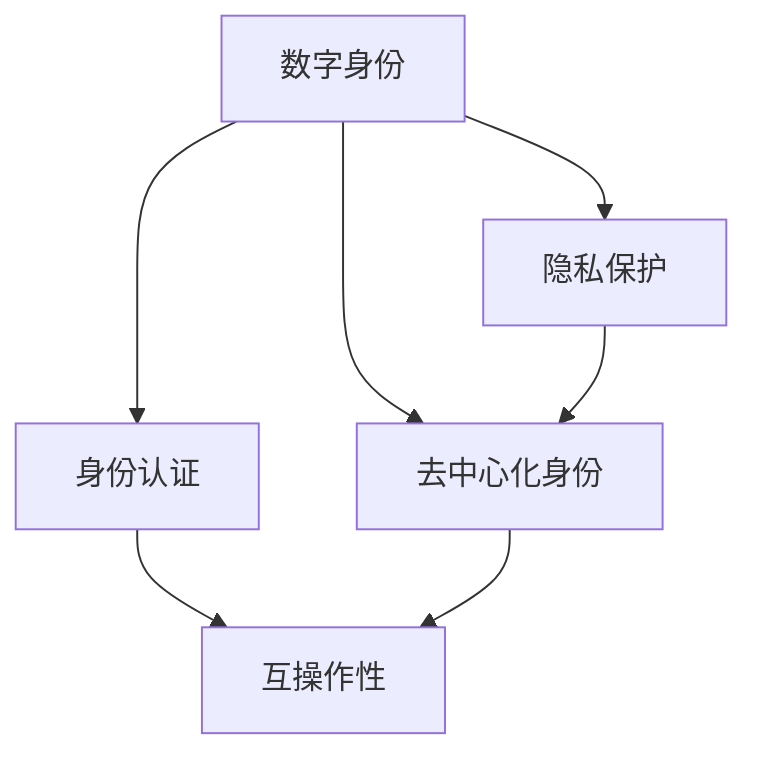

                 

# 元宇宙中的数字身份:虚拟世界的自我定义

> 关键词：数字身份, 元宇宙, 自定模型, 数字孪生, 身份认证, 隐私保护

## 1. 背景介绍

### 1.1 问题由来

随着虚拟现实（Virtual Reality, VR）和增强现实（Augmented Reality, AR）技术的成熟和普及，元宇宙（Metaverse）的概念逐渐走进人们的视野。元宇宙是一个虚拟的空间，包含数字化的社会、经济和物理世界，用户可以在其中进行交流、创造和互动。随着技术的进步和用户需求的不断增长，元宇宙正成为未来的重要趋势。

在元宇宙中，每个用户都需要拥有一个数字身份，用以进行身份认证、支付、社交等操作。如何构建安全、高效、易于管理的数字身份系统，成为一个亟待解决的问题。

### 1.2 问题核心关键点

构建元宇宙中的数字身份系统需要解决以下核心问题：
1. **身份验证**：确保用户在虚拟世界中的身份真实可信。
2. **隐私保护**：保护用户个人信息，防止隐私泄露。
3. **个性化**：允许用户自定义和管理其数字身份的外观、行为和权限。
4. **互操作性**：确保不同平台和系统之间的身份互通。
5. **去中心化**：支持用户自行管理其数字身份和权限，减少中心化机构控制。

## 2. 核心概念与联系

### 2.1 核心概念概述

为更好地理解元宇宙中的数字身份系统，本节将介绍几个密切相关的核心概念：

- **数字身份（Digital Identity）**：用户在一个或多个数字环境中的身份标识和相关信息的集合，包括但不限于姓名、地址、电子邮箱、密码等。
- **元宇宙（Metaverse）**：一个虚拟的空间，用户可以在其中进行互动、交流、创造和体验。
- **数字孪生（Digital Twin）**：一个物理或虚拟对象的数字化表示，用以在数字空间中模拟现实世界的行为和特征。
- **身份认证（Identity Authentication）**：验证用户身份的过程，确保用户身份的真实性和可信性。
- **隐私保护（Privacy Protection）**：保护用户个人信息，防止未授权的访问和滥用。
- **去中心化身份（Decentralized Identity, DId）**：通过区块链等技术，实现用户自行管理和控制其数字身份和权限，减少中心化机构的控制。

这些核心概念之间的逻辑关系可以通过以下Mermaid流程图来展示：



这个流程图展示了大数字身份系统的核心概念及其之间的关系：

1. 数字身份是身份认证的基础。
2. 隐私保护是数字身份管理的关键。
3. 互操作性是不同平台和系统之间的身份互通需求。
4. 去中心化身份是分布式数字身份管理和控制的重要方式。

这些概念共同构成了元宇宙中的数字身份系统的核心，为其设计和实现提供了重要的指导。

## 3. 核心算法原理 & 具体操作步骤

### 3.1 算法原理概述

元宇宙中的数字身份系统主要基于以下几个核心算法：

- **哈希函数（Hash Function）**：用于将任意长度的输入数据映射到固定长度的输出数据，常用于加密和数据完整性校验。
- **加密算法（Encryption Algorithm）**：用于保护用户数据的安全性，防止未经授权的访问和篡改。
- **数字签名（Digital Signature）**：通过非对称加密技术，确保数据的完整性和真实性，防止伪造和篡改。
- **公钥基础设施（Public Key Infrastructure, PKI）**：用于管理和验证数字证书，确保通信双方的身份可信。
- **区块链技术（Blockchain Technology）**：通过分布式账本和加密算法，实现去中心化的身份管理和认证。

### 3.2 算法步骤详解

构建元宇宙中的数字身份系统一般包括以下几个关键步骤：

**Step 1: 设计数字身份模型**

- 根据业务需求，设计数字身份的属性和权限，包括但不限于姓名、年龄、地址、角色等。
- 确定数字身份的生命周期和变更规则，确保数据的准确性和及时性。
- 设计身份认证和授权流程，确保数据的安全性和隐私性。

**Step 2: 实现身份认证机制**

- 选择合适的加密算法和哈希函数，确保用户数据的安全性和完整性。
- 设计数字签名的流程，验证数据的真实性和可信性。
- 实现基于PKI的数字证书管理，确保通信双方的身份可信。

**Step 3: 实施隐私保护措施**

- 实现数据加密和解密算法，保护用户隐私。
- 设计访问控制策略，限制用户对数据的访问权限。
- 实施数据备份和恢复机制，确保数据的可恢复性。

**Step 4: 构建去中心化身份系统**

- 选择合适的区块链平台，实现去中心化的身份管理和认证。
- 设计智能合约，自动化身份管理的流程和规则。
- 实现身份数据的分布式存储和查询，确保数据的可用性和一致性。

**Step 5: 部署和维护系统**

- 在元宇宙平台上部署数字身份系统，确保系统的稳定性和可靠性。
- 定期进行系统维护和更新，确保系统的安全性、可用性和性能。
- 建立安全事件响应机制，及时处理安全事件，保障系统的安全性和隐私性。

以上是构建元宇宙中的数字身份系统的基本步骤。在实际应用中，还需要根据具体业务需求和系统架构，进行进一步的优化和定制。

### 3.3 算法优缺点

元宇宙中的数字身份系统具有以下优点：

1. **安全可靠**：通过加密、数字签名和区块链等技术，确保用户身份和数据的安全性和完整性。
2. **高度自治**：用户自行管理和控制其数字身份和权限，减少中心化机构的控制。
3. **互操作性强**：基于标准化的技术规范，不同平台和系统之间的身份互通。
4. **个性化丰富**：允许用户自定义和管理其数字身份的外观、行为和权限。

同时，该系统也存在一定的局限性：

1. **技术复杂**：涉及多个复杂的技术和算法，开发和维护难度较大。
2. **扩展性有限**：基于区块链的分布式系统，扩展性较差，可能面临性能瓶颈。
3. **标准化问题**：目前元宇宙中缺乏统一的技术标准和规范，可能影响系统的互操作性。
4. **隐私保护挑战**：尽管有加密和访问控制策略，但仍需警惕隐私泄露的风险。

尽管存在这些局限性，但就目前而言，基于区块链等技术的去中心化身份系统，仍然是元宇宙中数字身份管理和认证的重要方向。未来相关研究的重点在于如何进一步降低技术复杂度，提高系统的扩展性和互操作性，同时兼顾隐私保护和安全性的要求。

### 3.4 算法应用领域

基于元宇宙中的数字身份系统，已经在多个领域得到了初步应用，如：

- **虚拟社交平台**：如VR聊天室、虚拟现实游戏等，用户可以在其中进行交流、互动和游戏。
- **数字资产管理**：如NFT、加密货币等，用户可以在其中进行创建、交易和收藏。
- **虚拟商业和办公**：如虚拟商店、虚拟会议等，用户可以在其中进行商业活动和办公协作。
- **虚拟旅游和教育**：如虚拟博物馆、虚拟课堂等，用户可以在其中进行学习和体验。

除了上述这些经典应用外，元宇宙中的数字身份系统还被创新性地应用到更多场景中，如智能合约、去中心化应用（DApps）、虚拟现实广告等，为元宇宙技术带来了新的可能性。随着技术的不断成熟，基于数字身份的元宇宙将不断拓展其应用边界，为数字生活带来全新的体验。

## 4. 数学模型和公式 & 详细讲解 & 举例说明

### 4.1 数学模型构建

本节将使用数学语言对元宇宙中的数字身份系统进行更加严格的刻画。

记数字身份为 $I=\{id, name, age, address, role\}$，其中 $id$ 为数字身份的标识符，$name$ 为用户姓名，$age$ 为用户年龄，$address$ 为用户地址，$role$ 为用户角色。

假设元宇宙平台需要验证用户身份，设计数字签名的流程如下：

1. 用户请求登录时，元宇宙平台生成一个随机数 $r$ 和一个公钥 $PK$。
2. 用户计算数字签名 $s$，其中 $s=hash(id+PK+r)$。
3. 元宇宙平台验证数字签名，如果 $s=hash(id+PK+r)$，则认为身份真实可信。

数字签名的过程可以形式化地表示为：

$$
\begin{aligned}
s &= hash(id + PK + r) \\
&= hash(id + PK + r)
\end{aligned}
$$

其中 $hash$ 为哈希函数，$PK$ 为用户公钥，$r$ 为随机数。

### 4.2 公式推导过程

数字签名的过程基于非对称加密算法，其安全性依赖于哈希函数和公钥的复杂性。在实践中，常见的哈希函数包括SHA-256、SHA-3等，常见的公钥加密算法包括RSA、ECC等。

以RSA算法为例，数字签名的过程可以进一步推导为：

1. 用户生成一对公钥 $PK$ 和私钥 $SK$，其中 $PK=(PK_1, PK_2)$，$SK=SK_1, SK_2$。
2. 用户计算数字签名 $s_1$ 和 $s_2$，其中 $s_1=hash(id+PK_1+r)$，$s_2=hash(id+PK_2+r)$。
3. 元宇宙平台验证数字签名，如果 $s_1=hash(id+PK_1+r)$ 且 $s_2=hash(id+PK_2+r)$，则认为身份真实可信。

数字签名的过程可以形式化地表示为：

$$
\begin{aligned}
s_1 &= hash(id + PK_1 + r) \\
s_2 &= hash(id + PK_2 + r) \\
\end{aligned}
$$

其中 $hash$ 为哈希函数，$PK_1$ 和 $PK_2$ 为用户公钥，$r$ 为随机数。

在得到数字签名的过程中，需要确保随机数 $r$ 足够随机且不可预测，以提高数字签名的安全性。

### 4.3 案例分析与讲解

假设用户A向元宇宙平台请求登录，平台生成随机数 $r=123456$ 和公钥 $PK=(1001, 2345)$。用户A计算数字签名 $s=hash(id+PK+r)=hash(id+1001+2345+123456)$，元宇宙平台验证数字签名是否满足 $s=hash(id+PK+r)$。

在实践中，数字签名和验证的过程通常由元宇宙平台自动完成，用户无需直接参与计算过程。

## 5. 项目实践：代码实例和详细解释说明

### 5.1 开发环境搭建

在进行数字身份系统开发前，我们需要准备好开发环境。以下是使用Python进行RSA加密库开发的环境配置流程：

1. 安装Anaconda：从官网下载并安装Anaconda，用于创建独立的Python环境。

2. 创建并激活虚拟环境：
```bash
conda create -n rsa-env python=3.8 
conda activate rsa-env
```

3. 安装必要的库：
```bash
pip install numpy cryptography
```

完成上述步骤后，即可在`rsa-env`环境中开始数字身份系统的开发。

### 5.2 源代码详细实现

下面我们以数字身份认证为例，给出使用Python和cryptography库对RSA数字签名的实现。

首先，定义数字身份的结构和属性：

```python
class DigitalIdentity:
    def __init__(self, id, name, age, address, role):
        self.id = id
        self.name = name
        self.age = age
        self.address = address
        self.role = role
```

然后，实现数字签名的过程：

```python
from cryptography.hazmat.primitives import hashes, serialization
from cryptography.hazmat.primitives.asymmetric import rsa, padding

def generate_key_pair():
    private_key = rsa.generate_private_key(public_exponent=65537, key_size=2048)
    public_key = private_key.public_key()
    return private_key, public_key

def sign_message(private_key, message):
    hasher = hashes.Hash(hashes.SHA256())
    hasher.update(message.encode())
    digest = hasher.finalize()
    signature = private_key.sign(digest, padding.PSS(mgf=padding.MGF1(hashes.SHA256()), salt_length=padding.PSS.MAX_LENGTH))
    return signature

def verify_message(public_key, message, signature):
    hasher = hashes.Hash(hashes.SHA256())
    hasher.update(message.encode())
    digest = hasher.finalize()
    try:
        public_key.verify(digest, signature, padding.PSS(mgf=padding.MGF1(hashes.SHA256()), salt_length=padding.PSS.MAX_LENGTH))
        return True
    except:
        return False
```

最后，实现数字身份认证的过程：

```python
def authenticate_identity(private_key, public_key, identity, rsa_implementation='RSA'):
    if rsa_implementation == 'RSA':
        identity['PK_1'], identity['PK_2'] = public_key.public_numbers().public_numbers()
        identity['s_1'] = sign_message(private_key, identity['PK_1'] + identity['PK_2'] + str(r))
        identity['s_2'] = sign_message(private_key, identity['PK_1'] + identity['PK_2'] + str(r))
        return verify_message(public_key, identity['PK_1'] + identity['PK_2'] + str(r), identity['s_1']) and verify_message(public_key, identity['PK_1'] + identity['PK_2'] + str(r), identity['s_2'])
    elif rsa_implementation == 'ECC':
        # 在此添加ECC实现代码
```

以上代码实现了数字身份认证的基本逻辑。在实际应用中，还需要进一步优化和完善。

### 5.3 代码解读与分析

让我们再详细解读一下关键代码的实现细节：

**DigitalIdentity类**：
- `__init__`方法：初始化数字身份的属性。
- `sign_message`方法：生成数字签名，使用RSA算法。
- `verify_message`方法：验证数字签名，使用RSA算法。
- `authenticate_identity`方法：实现数字身份认证，使用RSA算法。

**generate_key_pair函数**：
- 生成RSA公钥和私钥，返回公钥和私钥。

**sign_message函数**：
- 使用私钥生成数字签名，使用SHA-256哈希函数对消息进行哈希。

**verify_message函数**：
- 使用公钥验证数字签名，使用RSA算法。

**authenticate_identity函数**：
- 实现数字身份认证，使用RSA算法。

可以看到，RSA数字签名和验证的过程，可以通过Python和cryptography库的简单封装实现。开发者可以根据具体需求，进一步扩展和优化该代码实现。

## 6. 实际应用场景

### 6.1 虚拟社交平台

在虚拟社交平台中，数字身份系统可以用于验证用户身份，保护用户隐私，实现身份认证和授权。例如，在VR聊天室中，用户需要输入用户名和密码进行登录，系统通过数字身份认证机制，验证用户身份的真实性，防止恶意行为。

### 6.2 数字资产管理

数字身份系统可以用于管理用户的数字资产，如NFT、加密货币等。用户可以在元宇宙平台上创建和管理其数字资产，系统通过数字身份认证机制，验证用户的身份和权限，确保数字资产的安全和合法性。

### 6.3 虚拟商业和办公

数字身份系统可以用于虚拟商业和办公场景，如虚拟商店、虚拟会议等。用户可以在元宇宙平台上进行商业活动和办公协作，系统通过数字身份认证机制，验证用户的身份和权限，确保交易和会议的安全性和合法性。

### 6.4 未来应用展望

随着元宇宙技术的不断发展和普及，基于数字身份的系统将在更多领域得到应用，为数字生活带来全新的体验。

在智慧城市治理中，数字身份系统可以用于身份认证、公共服务、社交互动等场景，提高城市管理的自动化和智能化水平，构建更安全、高效的未来城市。

在智能医疗领域，数字身份系统可以用于患者身份认证、电子病历管理、健康数据共享等环节，提高医疗服务的智能化水平，促进医疗公平，保障患者隐私。

在智能教育领域，数字身份系统可以用于学生身份认证、学习数据管理、智能推荐等环节，提高教育服务的智能化水平，促进教育公平，提高教学质量。

除此之外，在智能制造、智能交通、智能物流等领域，数字身份系统也将不断涌现，为各行各业带来变革性影响。相信随着技术的日益成熟，基于数字身份的元宇宙将不断拓展其应用边界，为数字生活带来更多的便利和可能性。

## 7. 工具和资源推荐

### 7.1 学习资源推荐

为了帮助开发者系统掌握数字身份系统的理论基础和实践技巧，这里推荐一些优质的学习资源：

1. 《加密算法设计与分析》系列博文：由大模型技术专家撰写，深入浅出地介绍了各种加密算法和数字签名技术。

2. 《区块链技术入门》课程：由区块链技术专家开设的在线课程，涵盖区块链的基本概念和核心技术，适合初学者学习。

3. 《数字身份管理与隐私保护》书籍：详细介绍了数字身份管理和隐私保护的理论和实践方法，适合技术开发人员和研究人员阅读。

4. 《NLP基础与实践》书籍：介绍了自然语言处理的基本概念和经典算法，适合对NLP感兴趣的技术开发者阅读。

5. Weights & Biases：模型训练的实验跟踪工具，可以记录和可视化模型训练过程中的各项指标，方便对比和调优。

通过对这些资源的学习实践，相信你一定能够快速掌握数字身份系统的精髓，并用于解决实际的数字身份问题。

### 7.2 开发工具推荐

高效的开发离不开优秀的工具支持。以下是几款用于数字身份系统开发的常用工具：

1. Python：灵活的编程语言，广泛用于算法实现和数据分析。
2. RSA库：Python的RSA加密库，实现数字签名和验证功能。
3. OpenSSL库：支持多种加密算法和数字证书管理，适合大规模系统开发。
4. TensorFlow：基于数据的机器学习框架，适用于各类深度学习算法的实现。

合理利用这些工具，可以显著提升数字身份系统的开发效率，加快创新迭代的步伐。

### 7.3 相关论文推荐

数字身份系统的发展源于学界的持续研究。以下是几篇奠基性的相关论文，推荐阅读：

1. RSA数字签名算法（Rivest, Shamir, Adleman）：经典的公钥加密算法，被广泛应用于数字身份认证和数据安全领域。

2. 数字证书和公钥基础设施（PKI）：介绍数字证书的生成、管理和验证过程，确保通信双方的身份可信。

3. 区块链技术及其应用（Nakamoto）：介绍区块链技术的原理和应用场景，实现去中心化的身份管理和认证。

这些论文代表了大数字身份系统的研究进展，通过学习这些前沿成果，可以帮助研究者把握学科前进方向，激发更多的创新灵感。

## 8. 总结：未来发展趋势与挑战

### 8.1 总结

本文对元宇宙中的数字身份系统进行了全面系统的介绍。首先阐述了数字身份和元宇宙的基本概念，明确了数字身份在元宇宙中的重要性和复杂性。其次，从原理到实践，详细讲解了数字身份系统的核心算法和实现步骤，给出了数字身份系统开发的完整代码实例。同时，本文还广泛探讨了数字身份系统在虚拟社交平台、数字资产管理、虚拟商业和办公等多个领域的应用前景，展示了数字身份系统的广阔前景。此外，本文精选了数字身份系统的各类学习资源，力求为读者提供全方位的技术指引。

通过本文的系统梳理，可以看到，元宇宙中的数字身份系统是一个复杂且多维度的技术体系，需要综合运用密码学、区块链、自然语言处理等多种技术手段。尽管面临诸多挑战，但基于数字身份的系统将在未来的元宇宙中扮演越来越重要的角色，成为数字生活的重要基础设施。

### 8.2 未来发展趋势

展望未来，数字身份系统将呈现以下几个发展趋势：

1. **去中心化程度提升**：随着区块链技术的成熟，基于区块链的数字身份系统将逐渐普及，减少中心化机构对身份的管理和控制。
2. **身份统一管理**：数字身份系统将实现不同平台和系统之间的身份互通，提高用户管理其身份的便捷性。
3. **身份验证多样化**：结合生物识别技术、智能合约等手段，实现更加安全、高效的数字身份验证。
4. **隐私保护增强**：数字身份系统将采用更先进的隐私保护技术，如差分隐私、联邦学习等，保护用户数据的安全和隐私。
5. **个性化增强**：数字身份系统将提供更丰富的个性化选项，允许用户自定义和管理其身份的外观和行为。
6. **标准化规范制定**：数字身份系统将逐步形成统一的技术规范和标准，提高系统的互操作性和可扩展性。

这些趋势凸显了数字身份系统的广阔前景，相信在未来的元宇宙中，数字身份系统将更加安全、可靠、高效、个性化，为用户带来更多的便利和可能性。

### 8.3 面临的挑战

尽管数字身份系统已经取得了一定的进展，但在迈向更加智能化、普适化应用的过程中，它仍面临诸多挑战：

1. **技术复杂度**：涉及多个复杂的技术和算法，开发和维护难度较大。
2. **扩展性瓶颈**：基于区块链的分布式系统，扩展性较差，可能面临性能瓶颈。
3. **标准化问题**：目前元宇宙中缺乏统一的技术标准和规范，可能影响系统的互操作性。
4. **隐私保护挑战**：尽管有加密和访问控制策略，但仍需警惕隐私泄露的风险。
5. **安全事件处理**：数字身份系统可能面临身份仿冒、数据泄露等安全事件，需要建立有效的应急响应机制。

尽管存在这些挑战，但通过不断技术创新和完善，数字身份系统必将在未来的元宇宙中发挥重要作用，为数字生活带来更多的便利和可能性。

### 8.4 研究展望

未来的数字身份系统需要在以下几个方面进行进一步研究：

1. **多因素身份验证**：结合生物识别、智能合约等手段，实现更加安全、高效的数字身份验证。
2. **区块链与共识机制**：研究和优化区块链的共识机制，提高数字身份系统的可扩展性和安全性。
3. **隐私保护技术**：采用差分隐私、联邦学习等技术，保护用户数据的安全和隐私。
4. **去中心化身份管理**：研究和优化去中心化身份管理技术，提高系统的互操作性和可扩展性。
5. **跨平台身份认证**：研究和实现跨平台身份认证技术，实现不同平台和系统之间的身份互通。
6. **隐私保护与去中心化结合**：研究如何在保障隐私的同时，实现去中心化身份管理，保护用户数据的安全和隐私。

这些研究方向的探索，必将引领数字身份系统迈向更高的台阶，为元宇宙中的数字生活带来更多的便利和可能性。面向未来，数字身份系统需要与其他人工智能技术进行更深入的融合，如自然语言处理、智能合约等，多路径协同发力，共同推动数字身份技术的发展。

## 9. 附录：常见问题与解答

**Q1：如何设计高效的数字身份模型？**

A: 设计数字身份模型时，需要考虑以下几个关键点：
1. 身份属性的全面性：包括但不限于姓名、年龄、地址、角色等，确保模型的全面性和准确性。
2. 身份属性的标准化：定义标准化的属性名称和类型，方便不同系统之间的数据互操作。
3. 身份属性的可扩展性：考虑未来身份属性的新增和变更，确保模型的灵活性和可扩展性。
4. 身份属性的安全性和隐私性：确保身份属性的安全性和隐私性，防止信息泄露和滥用。

**Q2：数字签名在元宇宙中的应用场景有哪些？**

A: 数字签名在元宇宙中的应用场景主要包括：
1. 用户身份认证：验证用户的真实性和可信性，防止身份仿冒。
2. 数据完整性和真实性验证：确保数据的完整性和真实性，防止数据篡改。
3. 合同和协议的签署：通过数字签名保证合同和协议的有效性和真实性。
4. 交易和支付：确保交易和支付的安全性和合法性。

**Q3：区块链技术在数字身份系统中的应用有哪些？**

A: 区块链技术在数字身份系统中的应用主要包括：
1. 去中心化身份管理：实现去中心化的身份认证和管理，减少中心化机构的控制。
2. 分布式存储和查询：实现身份数据的分布式存储和查询，确保数据的安全性和可用性。
3. 智能合约：实现自动化身份管理的流程和规则，提高系统的效率和可靠性。

**Q4：如何保障数字身份系统的安全性和隐私性？**

A: 保障数字身份系统的安全性和隐私性需要采取以下措施：
1. 采用先进的加密算法和哈希函数，确保数据的机密性和完整性。
2. 设计合理的访问控制策略，限制用户对数据的访问权限。
3. 实现数据备份和恢复机制，确保数据的可恢复性。
4. 建立安全事件响应机制，及时处理安全事件，保障系统的安全性和隐私性。

**Q5：数字身份系统在元宇宙中面临的主要挑战有哪些？**

A: 数字身份系统在元宇宙中面临的主要挑战包括：
1. 技术复杂度高：涉及多个复杂的技术和算法，开发和维护难度较大。
2. 扩展性瓶颈：基于区块链的分布式系统，扩展性较差，可能面临性能瓶颈。
3. 标准化问题：目前元宇宙中缺乏统一的技术标准和规范，可能影响系统的互操作性。
4. 隐私保护挑战：尽管有加密和访问控制策略，但仍需警惕隐私泄露的风险。
5. 安全事件处理：数字身份系统可能面临身份仿冒、数据泄露等安全事件，需要建立有效的应急响应机制。

通过不断技术创新和完善，数字身份系统必将在未来的元宇宙中发挥重要作用，为数字生活带来更多的便利和可能性。

---

作者：禅与计算机程序设计艺术 / Zen and the Art of Computer Programming

