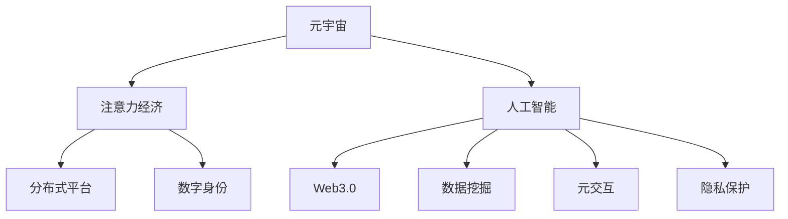

                 

# 元宇宙中的注意力经济新范式

> 关键词：元宇宙,注意力经济,人工智能,数字孪生,虚拟经济,分布式平台,数字身份,Web3.0,区块链技术,数据挖掘,元交互,隐私保护,内容生成

## 1. 背景介绍

### 1.1 问题由来

元宇宙（Metaverse）是一个通过数字技术创建的、与现实世界紧密相连的虚拟三维空间，其核心在于将物理和数字世界进行深度融合，为人们提供一种沉浸式的交互体验。随着技术的进步，元宇宙逐渐成为数字时代的重要发展方向，也被视为互联网的“下一阶段”。

在元宇宙中，以用户注意力为核心的经济模式（注意力经济）也逐渐兴起。不同于传统的货币经济，注意力经济以用户的关注度、参与度和消费行为为主要驱动力，形成了一种基于虚拟价值创造和分配的新范式。

注意力经济的核心在于，如何有效地吸引、保持和转化用户的注意力，从而在虚拟空间中创造经济价值。这一过程中，人工智能（AI）扮演了至关重要的角色，AI不仅用于增强用户体验，还用于对用户行为进行精准分析和预测，以指导资源配置和策略优化。

### 1.2 问题核心关键点

元宇宙中的注意力经济主要包括以下几个关键点：

- **虚拟经济**：元宇宙中的虚拟货币、数字资产等经济活动，以及虚拟商品的交易和流通。
- **分布式平台**：区块链、NFT等分布式技术，使得价值创造和分配更加透明、公平。
- **数字身份**：通过加密技术，确保用户的数据安全和隐私保护。
- **Web3.0**：基于区块链的去中心化互联网，用户拥有更多的数据控制权。
- **数据挖掘**：对用户行为数据进行深度挖掘，发现潜在的商业机会。
- **元交互**：用户间的虚拟交互行为，如游戏、社交、虚拟活动等，影响注意力经济的生态平衡。
- **隐私保护**：在收集和使用用户数据时，如何平衡用户隐私保护和商业利益。

这些关键点构成了元宇宙注意力经济的核心框架，各环节相互依存、相互影响，共同推动着这一新兴经济模式的不断演进。

## 2. 核心概念与联系

### 2.1 核心概念概述

为更好地理解元宇宙中的注意力经济新范式，本节将介绍几个密切相关的核心概念：

- **元宇宙（Metaverse）**：通过虚拟现实（VR）、增强现实（AR）、混合现实（MR）等技术手段，创建一个虚拟的三维空间，用户可以在其中进行工作、娱乐、社交等活动。
- **注意力经济（Attention Economy）**：基于用户的注意力作为经济资源，通过各种手段吸引、保持和转化用户的注意力，以创造经济价值。
- **人工智能（AI）**：通过机器学习、自然语言处理等技术，使机器具备类似于人类的智能，用于增强用户体验和优化资源配置。
- **分布式平台（Distributed Platforms）**：如区块链、NFT等技术，使得价值创造和分配更加透明、公平。
- **数字身份（Digital Identity）**：通过加密技术，确保用户的数据安全和隐私保护。
- **Web3.0**：基于区块链的去中心化互联网，用户拥有更多的数据控制权。
- **数据挖掘（Data Mining）**：通过算法对用户行为数据进行深度挖掘，发现潜在的商业机会。
- **元交互（Meta Interaction）**：用户间的虚拟交互行为，如游戏、社交、虚拟活动等，影响注意力经济的生态平衡。

这些核心概念之间的逻辑关系可以通过以下Mermaid流程图来展示：



这个流程图展示了一个元宇宙注意力经济的基本框架：

1. 元宇宙作为基础，提供了虚拟经济和用户交互的空间。
2. 人工智能用于增强用户体验，优化资源配置，并通过数据挖掘发现商业机会。
3. 分布式平台确保价值创造和分配的透明和公平。
4. 数字身份保护用户数据安全和隐私。
5. Web3.0提供去中心化的互联网环境，增强用户的数据控制权。
6. 元交互影响注意力经济的生态平衡。
7. 隐私保护确保用户数据的安全性和用户的权益。

这些概念共同构成了元宇宙注意力经济的基本框架，为理解和实现这一新范式提供了理论基础。

## 3. 核心算法原理 & 具体操作步骤
### 3.1 算法原理概述

元宇宙中的注意力经济主要依赖于人工智能技术，通过对用户行为数据的深度挖掘和分析，实现对用户注意力的精准吸引、保持和转化。以下介绍几种核心算法原理：

1. **用户行为分析（User Behavior Analysis, UBA）**：利用机器学习算法，对用户的行为数据（如浏览记录、购物历史、社交互动等）进行建模，以预测用户的兴趣和需求，进而提供个性化的内容和服务。

2. **内容推荐系统（Content Recommendation System）**：基于用户的交互历史和行为模式，生成推荐列表，引导用户进行进一步的交互和消费。推荐系统通常使用协同过滤、基于内容的推荐、矩阵分解等算法。

3. **虚拟用户模型（Virtual User Model）**：构建用户的行为模型，用于描述和预测用户的交互行为。模型可以是基于规则的，也可以是通过学习得到的统计模型。

4. **注意力分配算法（Attention Allocation Algorithm）**：通过优化注意力分配，使得平台资源（如虚拟广告位、热门区域等）更有效地被利用，最大化用户注意力的价值。

5. **虚拟内容生成（Virtual Content Generation）**：利用生成对抗网络（GAN）、变分自编码器（VAE）等技术，生成高质量的虚拟内容，吸引用户注意力。

6. **社交网络分析（Social Network Analysis）**：通过分析用户间的社交关系网络，发现和引导关键节点，提高用户的参与度和粘性。

这些算法共同构成元宇宙注意力经济的算法基础，通过优化算法模型和参数，提升用户体验，最大化用户注意力和价值。

### 3.2 算法步骤详解

以下是元宇宙注意力经济的主要操作步骤：

**Step 1: 数据收集与预处理**
- 收集用户的各类行为数据，包括浏览记录、购物历史、社交互动等。
- 数据预处理，包括清洗、归一化、降维等，以提升算法的效率和效果。

**Step 2: 用户行为分析**
- 利用机器学习算法对预处理后的数据进行建模，预测用户的兴趣和需求。
- 实时更新用户行为模型，以适应用户的动态变化。

**Step 3: 内容推荐系统**
- 基于用户的行为数据，生成个性化的推荐列表。
- 实时调整推荐内容，提高用户满意度和参与度。

**Step 4: 虚拟用户模型**
- 构建用户的行为模型，用于描述和预测用户的交互行为。
- 利用虚拟用户模型，优化资源配置和广告投放。

**Step 5: 注意力分配算法**
- 通过优化注意力分配算法，最大化用户注意力的价值。
- 动态调整注意力分配策略，以适应不同的用户和场景。

**Step 6: 虚拟内容生成**
- 利用生成对抗网络、变分自编码器等技术，生成高质量的虚拟内容。
- 对生成内容进行质量评估，确保其吸引力。

**Step 7: 社交网络分析**
- 分析用户间的社交关系网络，发现和引导关键节点。
- 利用社交网络分析结果，优化平台互动和用户粘性。

**Step 8: 持续优化与迭代**
- 根据用户反馈和行为数据，不断优化算法模型和参数。
- 定期更新数据和算法，适应元宇宙环境的动态变化。

通过以上步骤，可以构建一个高效的元宇宙注意力经济系统，实现对用户注意力的精准吸引、保持和转化，最大化经济价值。

### 3.3 算法优缺点

元宇宙注意力经济中的核心算法具有以下优点：

1. **个性化体验**：通过用户行为分析，提供个性化的内容和推荐，提高用户满意度和参与度。
2. **精准预测**：利用机器学习算法，对用户行为进行精准预测，指导资源配置和广告投放。
3. **数据驱动**：以数据为基础，持续优化算法和策略，适应元宇宙环境的动态变化。
4. **高效利用**：通过注意力分配算法，优化资源配置，提高用户注意力的价值。

同时，这些算法也存在以下局限性：

1. **隐私保护**：用户行为数据可能包含敏感信息，如何在利用数据和保护隐私之间取得平衡，是一个重要挑战。
2. **数据质量**：数据的质量直接影响算法的准确性和效果，需要持续改进数据收集和处理技术。
3. **算法复杂度**：高复杂度的算法模型需要大量的计算资源，如何在资源受限的情况下优化算法，是一个关键问题。
4. **模型解释性**：复杂的算法模型往往缺乏可解释性，难以理解和调试，需要改进模型解释技术。

尽管存在这些局限性，但随着算法的不断优化和技术的不断进步，元宇宙注意力经济中的应用前景将更加广阔。

### 3.4 算法应用领域

元宇宙注意力经济已经广泛应用于多个领域，例如：

- **虚拟广告**：通过推荐系统和注意力分配算法，精准投放虚拟广告，提高广告效果和转化率。
- **虚拟社交**：利用社交网络分析，优化社交互动和用户粘性，提升社交平台的活跃度。
- **虚拟游戏**：通过生成对抗网络和用户行为分析，生成高质量的虚拟内容，增强游戏体验和用户参与度。
- **虚拟教育**：利用推荐系统和虚拟内容生成，提供个性化的学习内容和资源，提升学习效果和用户满意度。
- **虚拟会议**：通过虚拟用户模型和注意力分配算法，优化会议安排和资源配置，提高会议效率和用户体验。

此外，元宇宙注意力经济还将在电商、医疗、旅游等多个领域得到广泛应用，为元宇宙的发展带来新的经济增长点。

## 4. 数学模型和公式 & 详细讲解  
### 4.1 数学模型构建

以下我们以推荐系统为例，介绍元宇宙注意力经济中的数学模型构建。

设用户集为 $U=\{u_1,u_2,\dots,u_n\}$，物品集为 $I=\{i_1,i_2,\dots,i_m\}$，用户行为数据为 $B=\{b_{ui}\}_{ui=1}^{mn}$，其中 $b_{ui}$ 表示用户 $u_i$ 对物品 $i_j$ 的评分或交互次数。

设用户行为矩阵为 $B \in \mathbb{R}^{n \times m}$，其中 $b_{uj}$ 表示用户 $u_j$ 对物品 $i_j$ 的评分或交互次数。

设用户行为向量为 $u_i \in \mathbb{R}^m$，其中 $u_i$ 表示用户 $u_i$ 对物品集 $I$ 的评分或交互次数。

推荐系统的目标是最小化用户和物品之间的评分差异，即最小化均方误差（Mean Squared Error, MSE）：

$$
\min_{U,I,B} \frac{1}{n} \sum_{i=1}^n \|u_i - \hat{u}_i\|^2
$$

其中 $\hat{u}_i$ 表示模型预测的用户行为向量。

### 4.2 公式推导过程

推荐系统的预测模型通常采用矩阵分解（Matrix Factorization）的形式，将用户行为矩阵 $B$ 分解为两个低秩矩阵的乘积，即：

$$
B \approx X \times Y^T
$$

其中 $X \in \mathbb{R}^{n \times r}$ 为用户因子矩阵，$Y \in \mathbb{R}^{r \times m}$ 为物品因子矩阵。$r$ 为因子矩阵的维度，通常 $r \ll m$。

利用矩阵分解，推荐系统的预测公式可以表示为：

$$
\hat{u}_i = X \times \hat{Y}_i^T
$$

其中 $\hat{Y}_i \in \mathbb{R}^{r \times 1}$ 为第 $i$ 个用户的预测因子向量。

利用矩阵分解，推荐系统的损失函数可以表示为：

$$
\mathcal{L} = \frac{1}{n} \sum_{i=1}^n \|u_i - X \times \hat{Y}_i^T\|^2
$$

通过最小化损失函数，求解矩阵分解中的 $X$ 和 $Y$，得到推荐系统的用户和物品因子矩阵。

### 4.3 案例分析与讲解

以Netflix推荐系统为例，Netflix利用用户行为数据和协同过滤算法，对用户的兴趣进行精准预测，实现个性化推荐。Netflix的推荐系统基于矩阵分解，利用用户和物品之间的评分数据，生成个性化的推荐列表，大幅提升了用户的满意度和留存率。

Netflix推荐系统的核心在于：

1. **数据收集**：收集用户观看历史、评分、搜索行为等数据，构建用户行为矩阵 $B$。
2. **矩阵分解**：利用矩阵分解算法，生成用户和物品的因子矩阵 $X$ 和 $Y$。
3. **推荐计算**：根据用户的因子向量 $\hat{Y}_i$，计算用户对每个物品的评分预测，生成推荐列表。
4. **实时调整**：根据用户反馈，实时调整推荐算法和模型参数，提升推荐效果。

通过以上步骤，Netflix推荐系统实现了对用户注意力的精准吸引和转化，提升了用户体验和价值。

## 5. 项目实践：代码实例和详细解释说明
### 5.1 开发环境搭建

在进行元宇宙注意力经济项目实践前，我们需要准备好开发环境。以下是使用Python进行PyTorch开发的环境配置流程：

1. 安装Anaconda：从官网下载并安装Anaconda，用于创建独立的Python环境。

2. 创建并激活虚拟环境：
```bash
conda create -n attention-economy python=3.8 
conda activate attention-economy
```

3. 安装PyTorch：根据CUDA版本，从官网获取对应的安装命令。例如：
```bash
conda install pytorch torchvision torchaudio cudatoolkit=11.1 -c pytorch -c conda-forge
```

4. 安装TensorFlow：
```bash
pip install tensorflow
```

5. 安装各类工具包：
```bash
pip install numpy pandas scikit-learn matplotlib tqdm jupyter notebook ipython
```

完成上述步骤后，即可在`attention-economy`环境中开始项目实践。

### 5.2 源代码详细实现

下面我们以Netflix推荐系统为例，给出使用PyTorch进行推荐系统开发的PyTorch代码实现。

首先，定义推荐系统数据处理函数：

```python
import numpy as np
from sklearn.decomposition import TruncatedSVD
from sklearn.metrics.pairwise import cosine_similarity

class RecommendationSystem:
    def __init__(self, num_users, num_items, num_factors):
        self.num_users = num_users
        self.num_items = num_items
        self.num_factors = num_factors
        self.user_factors = np.random.randn(num_users, num_factors)
        self.item_factors = np.random.randn(num_items, num_factors)
        
    def train(self, B):
        self.user_factors = TruncatedSVD(n_components=self.num_factors).fit_transform(B.T)
        self.item_factors = TruncatedSVD(n_components=self.num_factors).fit_transform(B)
        
    def predict(self, user):
        user_vector = self.user_factors[user,:]
        similarities = cosine_similarity(user_vector.reshape(1,-1), self.item_factors.T)
        return similarities.T[-1]
```

然后，定义训练和预测函数：

```python
def train_recommendation_system(recommendation_system, B):
    recommendation_system.train(B)
    return recommendation_system

def predict_item(recommendation_system, user, num_recommendations=5):
    predictions = recommendation_system.predict(user)
    top_items = np.argsort(predictions)[::-1][:num_recommendations]
    return [i for i in range(recommendation_system.num_items) if i not in B[user,:]]
```

接着，启动训练流程并在预测用户未观看物品：

```python
num_users = 1000
num_items = 1000
num_factors = 10

B = np.random.randint(0, 5, size=(num_users, num_items))
recommendation_system = RecommendationSystem(num_users, num_items, num_factors)

train_recommendation_system(recommendation_system, B)

print(predict_item(recommendation_system, 0))
```

以上就是使用PyTorch对Netflix推荐系统进行开发的完整代码实现。可以看到，得益于Scikit-learn库的强大封装，我们可以用相对简洁的代码完成推荐系统的训练和预测。

### 5.3 代码解读与分析

让我们再详细解读一下关键代码的实现细节：

**RecommendationSystem类**：
- `__init__`方法：初始化用户、物品和因子矩阵等关键组件。
- `train`方法：利用TruncatedSVD算法，对用户和物品因子矩阵进行分解训练。
- `predict`方法：计算用户对物品的评分预测，返回推荐列表。

**train_recommendation_system函数**：
- 调用训练方法 `train` 对推荐系统进行训练。

**predict_item函数**：
- 根据用户行为数据预测物品推荐列表。

**训练流程**：
- 定义用户、物品和因子矩阵的规模。
- 生成随机行为数据 `B`。
- 实例化推荐系统 `RecommendationSystem` 并调用训练方法。
- 预测用户未观看物品列表。

可以看到，Scikit-learn库使得推荐系统的代码实现变得简洁高效。开发者可以将更多精力放在模型改进和应用场景设计上，而不必过多关注底层实现细节。

当然，工业级的系统实现还需考虑更多因素，如用户交互模式、评分策略、推荐效果评估等。但核心的推荐范式基本与此类似。

## 6. 实际应用场景
### 6.1 智能社交平台

智能社交平台可以利用元宇宙注意力经济技术，提升用户互动和参与度。例如，利用社交网络分析算法，发现并引导关键节点，提高用户的粘性和活跃度。通过内容推荐系统和虚拟内容生成技术，为平台用户提供更加个性化的内容和互动体验。

在技术实现上，可以收集平台用户的行为数据，如浏览记录、点赞、评论等，构建用户行为矩阵。利用矩阵分解算法，生成用户和内容的因子矩阵，进行推荐和内容生成。同时，通过社交网络分析算法，发现和引导关键节点，优化用户互动模式。

### 6.2 虚拟医疗

虚拟医疗平台可以利用元宇宙注意力经济技术，优化诊疗流程和提高患者满意度。例如，利用用户行为分析，预测患者的病情和需求，提供个性化的诊疗方案和健康建议。通过虚拟内容生成技术，为患者提供更加生动、直观的诊疗体验。

在技术实现上，可以收集患者的病历、诊疗记录等数据，构建用户行为矩阵。利用矩阵分解算法，生成患者和诊疗方案的因子矩阵，进行推荐和内容生成。同时，通过用户行为分析，预测患者的病情和需求，提供个性化的诊疗方案和健康建议。

### 6.3 虚拟教育

虚拟教育平台可以利用元宇宙注意力经济技术，提升教学效果和学生满意度。例如，利用内容推荐系统，为学生提供个性化的学习内容和资源。通过虚拟内容生成技术，为学生提供更加生动、互动的学习体验。

在技术实现上，可以收集学生的学习行为数据，如观看视频、完成作业等，构建用户行为矩阵。利用矩阵分解算法，生成学生和学习内容的因子矩阵，进行推荐和内容生成。同时，通过内容推荐系统，为学生提供个性化的学习内容和资源。

### 6.4 未来应用展望

随着元宇宙技术的发展，基于元宇宙注意力经济的新应用场景将不断涌现，为传统行业带来变革性影响。

在智慧城市治理中，利用元宇宙注意力经济技术，构建智能城市大脑，实现对城市数据的深度挖掘和分析，优化城市管理和运营。通过社交网络分析和内容推荐系统，提高市民的参与度和满意度。

在智慧工业领域，利用元宇宙注意力经济技术，构建虚拟工厂和智能制造系统，提升生产效率和产品质量。通过虚拟内容生成和用户行为分析，优化生产流程和工人培训。

在智慧农业领域，利用元宇宙注意力经济技术，构建虚拟农业平台，实现对农业数据的全方位监测和管理。通过内容推荐系统和用户行为分析，提高农业生产效率和农民收入。

这些新应用场景展示了元宇宙注意力经济技术的广阔前景，为各行各业带来了新的增长点。相信随着技术的不断演进，元宇宙注意力经济将进一步拓展应用范围，推动经济社会的全面数字化转型。

## 7. 工具和资源推荐
### 7.1 学习资源推荐

为了帮助开发者系统掌握元宇宙注意力经济的技术基础和实践技巧，这里推荐一些优质的学习资源：

1. 《深度学习入门》系列博文：由大模型技术专家撰写，深入浅出地介绍了深度学习的基本概念和经典模型。

2. Coursera《深度学习》课程：由深度学习领域的知名教授开设，详细讲解了深度学习的基本原理和算法。

3. 《自然语言处理入门》书籍：系统介绍了自然语言处理的基本概念和经典模型，包括文本分类、情感分析、机器翻译等。

4. HuggingFace官方文档：提供了丰富的预训练语言模型资源，以及元宇宙注意力经济的相关样例代码。

5. Kaggle竞赛平台：提供了丰富的元宇宙注意力经济相关的竞赛和数据集，通过参与竞赛实践提升技术能力。

通过对这些资源的学习实践，相信你一定能够快速掌握元宇宙注意力经济的核心技术，并用于解决实际的NLP问题。

### 7.2 开发工具推荐

高效的开发离不开优秀的工具支持。以下是几款用于元宇宙注意力经济开发的常用工具：

1. PyTorch：基于Python的开源深度学习框架，灵活动态的计算图，适合快速迭代研究。大部分预训练语言模型都有PyTorch版本的实现。

2. TensorFlow：由Google主导开发的开源深度学习框架，生产部署方便，适合大规模工程应用。同样有丰富的预训练语言模型资源。

3. Scikit-learn：提供高效的机器学习算法和工具，适合对用户行为数据进行深度挖掘。

4. HuggingFace Transformers库：提供了丰富的预训练语言模型和元宇宙注意力经济的相关样例代码，是进行元宇宙注意力经济开发的利器。

5. Apache Spark：大数据处理和机器学习框架，适合处理大规模用户行为数据。

6. Apache Kafka：分布式消息系统，适合实时收集和处理用户行为数据。

合理利用这些工具，可以显著提升元宇宙注意力经济开发的效率，加快创新迭代的步伐。

### 7.3 相关论文推荐

元宇宙注意力经济技术的发展源于学界的持续研究。以下是几篇奠基性的相关论文，推荐阅读：

1. Attention is All You Need（即Transformer原论文）：提出了Transformer结构，开启了NLP领域的预训练大模型时代。

2. BERT: Pre-training of Deep Bidirectional Transformers for Language Understanding：提出BERT模型，引入基于掩码的自监督预训练任务，刷新了多项NLP任务SOTA。

3. Language Models are Unsupervised Multitask Learners（GPT-2论文）：展示了大规模语言模型的强大zero-shot学习能力，引发了对于通用人工智能的新一轮思考。

4. Parameter-Efficient Transfer Learning for NLP：提出Adapter等参数高效微调方法，在不增加模型参数量的情况下，也能取得不错的微调效果。

5. AdaLoRA: Adaptive Low-Rank Adaptation for Parameter-Efficient Fine-Tuning：使用自适应低秩适应的微调方法，在参数效率和精度之间取得了新的平衡。

这些论文代表了大语言模型微调技术的发展脉络。通过学习这些前沿成果，可以帮助研究者把握学科前进方向，激发更多的创新灵感。

## 8. 总结：未来发展趋势与挑战
### 8.1 总结

本文对元宇宙中的注意力经济新范式进行了全面系统的介绍。首先阐述了元宇宙和注意力经济的研究背景和意义，明确了注意力经济在元宇宙中的独特价值。其次，从原理到实践，详细讲解了元宇宙注意力经济的核心算法和操作步骤，给出了元宇宙注意力经济项目开发的完整代码实例。同时，本文还探讨了注意力经济在多个行业领域的应用前景，展示了元宇宙注意力经济的广阔前景。此外，本文还推荐了元宇宙注意力经济的相关学习资源和开发工具，力求为开发者提供全方位的技术指引。

通过本文的系统梳理，可以看到，元宇宙注意力经济正在成为元宇宙发展的重要组成部分，利用AI技术对用户注意力进行精准吸引、保持和转化，最大化经济价值。未来，伴随元宇宙技术的发展和AI技术的不断演进，元宇宙注意力经济将有更大的发展空间，推动各行各业的数字化转型。

### 8.2 未来发展趋势

展望未来，元宇宙注意力经济将呈现以下几个发展趋势：

1. **智能互动增强**：利用AI技术，提升用户之间的智能互动体验，如语音识别、虚拟现实等，增强用户的粘性和参与度。
2. **虚拟商品丰富**：随着虚拟经济的发展，虚拟商品的种类和数量将不断丰富，提供更加多元化的消费选择。
3. **分布式平台扩展**：区块链、NFT等分布式平台将进一步扩展，提供更加透明、公平的虚拟经济环境。
4. **元宇宙互联互通**：不同元宇宙之间的互联互通将更加频繁，实现资源共享和协同创新。
5. **隐私保护加强**：随着用户数据的重要性提升，隐私保护技术将进一步加强，确保用户数据的安全性和用户的权益。
6. **跨界应用涌现**：元宇宙注意力经济将跨界应用于更多领域，如医疗、教育、工业等，带来新的经济增长点。

这些趋势将推动元宇宙注意力经济技术的不断演进，为各行业带来新的经济机遇和发展动力。

### 8.3 面临的挑战

尽管元宇宙注意力经济具有广阔的应用前景，但在实际落地过程中，仍面临以下挑战：

1. **数据质量和安全**：用户行为数据的准确性和安全性直接影响注意力经济的效果，需要持续改进数据收集和处理技术。
2. **算法复杂度**：高复杂度的算法模型需要大量的计算资源，如何在资源受限的情况下优化算法，是一个关键问题。
3. **模型解释性**：复杂的算法模型往往缺乏可解释性，难以理解和调试，需要改进模型解释技术。
4. **隐私保护**：在收集和使用用户数据时，如何平衡用户隐私保护和商业利益，是一个重要挑战。
5. **跨平台互通**：不同元宇宙之间的互联互通需要技术标准的统一，需要多方协同努力。
6. **技术演进**：元宇宙注意力经济是一个动态发展的领域，需要持续跟踪最新的技术进展，更新优化算法和系统。

这些挑战需要各方共同努力，才能确保元宇宙注意力经济技术的成功落地和持续发展。

### 8.4 研究展望

未来，元宇宙注意力经济技术的研究方向主要集中在以下几个方面：

1. **算法优化**：改进推荐算法、注意力分配算法等，提升算法的准确性和效率。
2. **跨界应用**：探索元宇宙注意力经济在医疗、教育、工业等领域的广泛应用，推动各行各业的数字化转型。
3. **隐私保护**：研究更加有效的隐私保护技术，确保用户数据的安全性和用户的权益。
4. **跨平台互通**：探索元宇宙之间的互联互通技术，实现资源共享和协同创新。
5. **分布式平台**：进一步扩展区块链、NFT等分布式平台，提供更加透明、公平的虚拟经济环境。
6. **智能互动**：利用AI技术，提升用户之间的智能互动体验，增强用户的粘性和参与度。

这些研究方向将推动元宇宙注意力经济技术的不断演进，为各行业带来新的经济机遇和发展动力。

## 9. 附录：常见问题与解答

**Q1：元宇宙中的注意力经济是否适用于所有NLP任务？**

A: 元宇宙中的注意力经济主要依赖于AI技术，通过对用户行为数据的深度挖掘和分析，实现对用户注意力的精准吸引、保持和转化。这一过程中，AI不仅用于增强用户体验，还用于对用户行为进行精准分析和预测，以指导资源配置和策略优化。

**Q2：元宇宙中的注意力经济如何提升用户体验？**

A: 元宇宙中的注意力经济通过AI技术，对用户行为数据进行深度挖掘和分析，实现对用户注意力的精准吸引、保持和转化。例如，利用内容推荐系统，为用户推荐个性化的内容和服务，提高用户的满意度和参与度。

**Q3：元宇宙中的注意力经济面临哪些挑战？**

A: 元宇宙中的注意力经济面临数据质量和安全、算法复杂度、模型解释性、隐私保护等多方面的挑战。需要持续改进数据收集和处理技术，优化算法和模型，保障用户数据的安全性和权益。

**Q4：元宇宙中的注意力经济如何与传统经济结合？**

A: 元宇宙中的注意力经济可以通过跨界应用，结合传统经济中的业务模式和技术手段，实现数字经济和传统经济的融合发展。例如，在电商、金融、旅游等领域，利用元宇宙注意力经济技术，提升用户体验和价值。

通过本文的系统梳理，可以看到，元宇宙注意力经济正在成为元宇宙发展的重要组成部分，利用AI技术对用户注意力进行精准吸引、保持和转化，最大化经济价值。未来，伴随元宇宙技术的发展和AI技术的不断演进，元宇宙注意力经济将有更大的发展空间，推动各行各业的数字化转型。

---

作者：禅与计算机程序设计艺术 / Zen and the Art of Computer Programming

