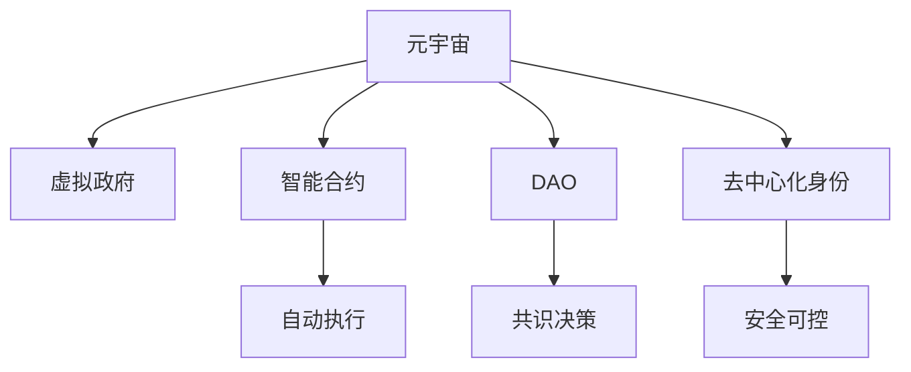

                 

# 元宇宙中的虚拟政府：全球治理的新模式

在数字时代的浪潮中，元宇宙（Metaverse）以其沉浸式、交互性、无缝联接的特点，正在重塑全球社会的方方面面。作为虚拟世界的治理者，虚拟政府（Virtual Governments）将成为连接现实与虚拟、传统与未来的桥梁，为全球治理带来新模式。本文将系统探讨元宇宙中虚拟政府的构建原理与应用实践，为全球治理带来深刻变革。

## 1. 背景介绍

### 1.1 问题由来

随着数字技术的快速发展，虚拟世界已不再是科幻小说中的构想，而是逐渐成为人们日常生活的一部分。从在线游戏到虚拟会议，从虚拟艺术到虚拟教育，元宇宙正以不可逆转的势头，改变着我们的社交、经济和治理模式。

然而，随着元宇宙的兴起，虚拟世界的治理问题也愈发凸显。传统的国家治理框架在虚拟世界中面临诸多挑战，如法律适用性、隐私保护、虚拟资产管理等。如何构建一个高效、公正、安全的虚拟政府，成为元宇宙时代的核心议题。

### 1.2 问题核心关键点

- **元宇宙与虚拟世界**：元宇宙是数字世界的高级阶段，由虚拟世界、数字化身份、虚拟经济、智能合约等多重维度构成。
- **虚拟政府**：指在元宇宙中，由程序和算法构成的虚拟机构，负责管理虚拟空间、维护虚拟秩序、制定虚拟法规。
- **全球治理**：指在全球范围内，通过虚拟政府协作，实现规则制定、纠纷解决、资源配置等多维度的管理。
- **智能合约**：一种基于区块链技术的程序合约，用于自动执行、控制和文档存储。

这些核心概念共同构成了元宇宙中虚拟政府的基本框架，使得虚拟治理成为可能。

## 2. 核心概念与联系

### 2.1 核心概念概述

为更好地理解元宇宙中虚拟政府的构建原理，本节将介绍几个密切相关的核心概念：

- **元宇宙（Metaverse）**：一个虚拟的、持续的、可交互的数字世界，涵盖虚拟现实、增强现实、人工智能等多技术。
- **虚拟政府（Virtual Government）**：通过智能合约和区块链技术构建的虚拟治理机构，实现对虚拟空间的治理。
- **智能合约（Smart Contracts）**：一种基于区块链技术的程序合约，用于自动执行、控制和文档存储。
- **分布式自治组织（DAO）**：由智能合约管理的虚拟组织，成员通过共识决策来共同管理虚拟资产和规则。
- **去中心化身份（Decentralized Identity）**：使用区块链技术，为虚拟世界中的用户提供安全、可控的数字身份。

这些核心概念之间的逻辑关系可以通过以下Mermaid流程图来展示：



这个流程图展示了几者的核心联系：

1. 元宇宙是虚拟政府的基础。
2. 智能合约是虚拟政府的核心执行机制。
3. DAO是虚拟政府的组织形式。
4. 去中心化身份是虚拟政府的用户基础。
5. 通过智能合约和DAO，实现虚拟政府的自动执行和共识决策。
6. 通过去中心化身份，保障虚拟政府的用户安全与隐私。

## 3. 核心算法原理 & 具体操作步骤
### 3.1 算法原理概述

元宇宙中虚拟政府的构建，本质上是一个分布式、自治的智能合约系统。其核心算法原理如下：

- **智能合约**：定义并自动执行虚拟政府的行为规则。
- **共识算法**：用于管理虚拟政府中的资源分配、决策制定等，保障治理的公正性和透明性。
- **去中心化身份**：为用户提供安全的数字身份，保障其在虚拟世界中的权益。

### 3.2 算法步骤详解

构建虚拟政府的具体步骤如下：

**Step 1: 设计虚拟政府结构**
- 确定虚拟政府的目标、职责、决策机制等。
- 设计虚拟政府的主要模块，如法律系统、经济系统、身份系统等。
- 确定智能合约的执行逻辑和共识算法。

**Step 2: 部署智能合约**
- 编写智能合约代码，定义虚拟政府的行为规则。
- 将智能合约部署到区块链平台（如以太坊、波卡等）。
- 配置智能合约的参数，如权限、共识算法、更新机制等。

**Step 3: 实现去中心化身份**
- 开发去中心化身份解决方案，如Web3身份系统。
- 为用户提供安全的数字身份，保障其在虚拟世界中的权益。

**Step 4: 启动虚拟政府**
- 在虚拟空间中部署智能合约和身份系统。
- 根据虚拟政府规则，自动执行行为，处理交易和纠纷。

**Step 5: 用户参与治理**
- 用户通过身份系统接入虚拟政府。
- 用户通过共识算法参与虚拟政府决策，如投票、提议等。
- 虚拟政府根据用户行为自动调整规则和资源分配。

### 3.3 算法优缺点

虚拟政府构建的优点包括：

- **透明公正**：智能合约和共识算法保障了虚拟治理的透明性和公正性。
- **自主自治**：去中心化身份和智能合约使得虚拟政府具备高度自治能力。
- **高效灵活**：通过程序规则，虚拟政府可以高效处理大量事务。

同时，该方法也存在一定的局限性：

- **技术门槛高**：智能合约和区块链技术复杂，开发难度较大。
- **可扩展性差**：虚拟政府在处理大规模用户和事务时，可能面临扩展性问题。
- **安全性风险**：智能合约漏洞、共识算法攻击等，可能导致虚拟治理出现问题。
- **伦理挑战**：虚拟政府的决策可能面临伦理道德的挑战，需要精心设计规则和算法。

尽管存在这些局限性，但虚拟政府技术正在不断演进，未来有望在治理能力、效率、公平性等方面取得更大突破。

### 3.4 算法应用领域

虚拟政府的应用领域广泛，涵盖了虚拟世界的多个方面：

- **虚拟法律**：通过智能合约和共识算法，自动执行虚拟法规，维护虚拟秩序。
- **虚拟经济**：通过去中心化身份和智能合约，实现虚拟资产管理、交易、借贷等。
- **虚拟身份**：通过去中心化身份系统，为用户提供安全、可控的数字身份。
- **虚拟治理**：通过智能合约和共识算法，实现虚拟空间的自治管理，如虚拟社区、虚拟城市等。

这些应用领域展示了虚拟政府在元宇宙中的广泛潜力，为全球治理带来了新的可能性。

## 4. 数学模型和公式 & 详细讲解  
### 4.1 数学模型构建

虚拟政府的核心算法模型主要包括以下几个方面：

1. **智能合约模型**：定义虚拟政府的行为规则和执行逻辑。
2. **共识算法模型**：用于虚拟政府中的资源分配和决策制定。
3. **去中心化身份模型**：保障用户的安全和隐私。

### 4.2 公式推导过程

以下将以智能合约为例，推导虚拟政府的核心算法模型。

**智能合约模型**：
假设智能合约用于管理虚拟政府的财务系统，其逻辑如下：
- 每个用户通过去中心化身份系统接入虚拟政府。
- 用户可以申请虚拟货币（代币），并通过智能合约规则进行管理。
- 智能合约记录用户的余额、交易记录等，并自动执行交易规则。

定义智能合约的状态为 $S$，包括用户的余额、交易记录等。定义智能合约的操作为 $A$，包括申请资金、转账、取现等。智能合约的执行逻辑可以用以下伪代码表示：

```pseudocode
function Execute(s: State, a: Action) -> State:
    if a = "Apply" then
        if balance(s) >= limit then
            return UpdateBalance(s, -limit)
        else
            return Error("Apply limit exceeded")
    if a = "Transfer" then
        if balance(s) >= amount then
            return UpdateBalance(s, -amount)
            return UpdateBalance(dest, amount)
        else
            return Error("Transfer amount exceeds balance")
    if a = "Withdraw" then
        if balance(s) >= amount then
            return UpdateBalance(s, -amount)
            return Send(amount)
        else
            return Error("Withdraw amount exceeds balance")
```

其中，$balance(s)$ 表示当前余额，$limit$ 表示申请限额，$amount$ 表示转账或提现金额，$dest$ 表示目标用户，$Send(amount)$ 表示将资金转账给指定用户。

**共识算法模型**：
假设虚拟政府采用基于PoS（权益证明）的共识算法。每个用户根据其持有代币的数量，决定其在共识算法中的权重。共识过程包括：
- 每个用户提交交易请求。
- 共识算法根据权重，决定哪些交易请求被接受。
- 接受的交易请求在智能合约中执行。

定义共识算法的状态为 $C$，包括每个用户的权重、提交的交易请求等。共识算法的执行逻辑可以用以下伪代码表示：

```pseudocode
function Execute(c: ConsensusState, a: Action) -> ConsensusState:
    if a = "Propose" then
        if balance(c) >= threshold then
            return UpdateBalance(c, -threshold)
            return AddProposal(a)
        else
            return Error("Propose amount exceeds balance")
    if a = "Accept" then
        if balance(c) >= weight then
            return UpdateBalance(c, -weight)
            return AcceptProposal(a)
        else
            return Error("Accept amount exceeds balance")
    if a = "Reject" then
        if balance(c) >= weight then
            return UpdateBalance(c, -weight)
            return RejectProposal(a)
        else
            return Error("Reject amount exceeds balance")
```

其中，$balance(c)$ 表示当前共识状态，$threshold$ 表示提案阈值，$weight$ 表示接受权重，$AddProposal(a)$ 表示添加提案，$AcceptProposal(a)$ 表示接受提案，$RejectProposal(a)$ 表示拒绝提案。

### 4.3 案例分析与讲解

假设一个虚拟政府的财务系统，通过智能合约管理用户的虚拟货币。用户可以通过智能合约进行以下操作：
- 申请虚拟货币：用户需要提交申请，并支付一定的费用。
- 转账：用户可以将虚拟货币转账给其他用户。
- 提现：用户可以将虚拟货币提现到现实世界的银行账户。

以下是智能合约的执行流程：

1. 用户通过去中心化身份系统接入虚拟政府，获得数字身份。
2. 用户提交申请资金请求，智能合约检查余额，如不足则拒绝申请。
3. 用户通过智能合约提交转账请求，智能合约检查余额，如不足则拒绝转账。
4. 用户通过智能合约提交提现请求，智能合约检查余额，如不足则拒绝提现。

智能合约的执行逻辑保证了虚拟货币系统的公平性和安全性，避免了传统银行系统中可能出现的欺诈、盗窃等风险。

## 5. 项目实践：代码实例和详细解释说明
### 5.1 开发环境搭建

在进行虚拟政府开发前，我们需要准备好开发环境。以下是使用Python进行Solidity开发的环境配置流程：

1. 安装Node.js：从官网下载并安装Node.js，用于运行Solidity代码。
2. 安装Truffle框架：通过npm安装Truffle，用于构建和管理智能合约。
3. 安装Ganache：通过npm安装Ganache，用于本地测试智能合约。
4. 编写智能合约：使用Solidity编写智能合约代码，定义虚拟政府的行为规则。
5. 部署智能合约：使用Truffle和Ganache部署智能合约，并进行测试。
6. 实现去中心化身份：开发Web3身份解决方案，提供安全的数字身份。

完成上述步骤后，即可在本地搭建虚拟政府的开发环境。

### 5.2 源代码详细实现

下面我们以虚拟货币系统为例，给出使用Solidity对虚拟政府进行开发的代码实现。

首先，定义虚拟货币的智能合约：

```solidity
// SPDX-License-Identifier: MIT
pragma solidity ^0.8.0;

contract VirtualCurrency {
    struct User {
        address owner;
        uint balance;
    }
    
    mapping(address => User) private users;
    uint public limit;
    uint public threshold;
    
    event Transfer(uint from, uint to, uint amount);
    
    constructor(uint _limit, uint _threshold) {
        limit = _limit;
        threshold = _threshold;
    }
    
    function apply(uint amount) public payable {
        require(msg.value >= threshold, "Apply amount exceeds limit");
        User memory u = users[msg.sender];
        u.balance += amount;
        users[msg.sender] = u;
        emit Transfer(0, msg.sender, amount);
    }
    
    function transfer(address to, uint amount) public {
        require(msg.sender != msg.to, "Cannot transfer to self");
        require(users[msg.sender].balance >= amount, "Insufficient balance");
        User memory u1 = users[msg.sender];
        User memory u2 = users[msg.to];
        u1.balance -= amount;
        u2.balance += amount;
        users[msg.sender] = u1;
        users[msg.to] = u2;
        emit Transfer(msg.sender, msg.to, amount);
    }
    
    function withdraw(uint amount) public {
        require(users[msg.sender].balance >= amount, "Insufficient balance");
        uint _to = msg.sender;
        User memory u = users[msg.sender];
        u.balance -= amount;
        users[msg.sender] = u;
        address _to = msg.sender;
        _to.transfer(amount);
        emit Transfer(msg.sender, _to, amount);
    }
}
```

然后，编写虚拟政府的共识算法：

```solidity
// SPDX-License-Identifier: MIT
pragma solidity ^0.8.0;

contract VirtualGovernment {
    struct User {
        address owner;
        uint balance;
        uint weight;
    }
    
    mapping(address => User) private users;
    uint public consensus;
    
    event Propose(uint weight);
    event Accept(uint weight);
    event Reject(uint weight);
    
    constructor(uint _limit, uint _threshold) {
        limit = _limit;
        threshold = _threshold;
    }
    
    function propose(uint weight) public payable {
        require(msg.value >= threshold, "Propose amount exceeds limit");
        User memory u = users[msg.sender];
        u.balance -= weight;
        users[msg.sender] = u;
        emit Propose(weight);
    }
    
    function accept(uint weight) public {
        require(msg.sender != consensus, "Cannot accept own proposal");
        require(users[msg.sender].balance >= weight, "Insufficient balance");
        User memory u1 = users[msg.sender];
        User memory u2 = users[consensus];
        u1.balance -= weight;
        u2.balance += weight;
        users[msg.sender] = u1;
        users[consensus] = u2;
        consensus = msg.sender;
        emit Accept(weight);
    }
    
    function reject(uint weight) public {
        require(msg.sender != consensus, "Cannot reject own proposal");
        require(users[msg.sender].balance >= weight, "Insufficient balance");
        User memory u1 = users[msg.sender];
        User memory u2 = users[consensus];
        u1.balance -= weight;
        u2.balance += weight;
        users[msg.sender] = u1;
        users[consensus] = u2;
        consensus = msg.sender;
        emit Reject(weight);
    }
}
```

最后，启动虚拟政府：

```solidity
// SPDX-License-Identifier: MIT
pragma solidity ^0.8.0;

contract VirtualGovernment {
    struct User {
        address owner;
        uint balance;
        uint weight;
    }
    
    mapping(address => User) private users;
    uint public consensus;
    
    event Propose(uint weight);
    event Accept(uint weight);
    event Reject(uint weight);
    
    constructor(uint _limit, uint _threshold) {
        limit = _limit;
        threshold = _threshold;
    }
    
    function propose(uint weight) public payable {
        require(msg.value >= threshold, "Propose amount exceeds limit");
        User memory u = users[msg.sender];
        u.balance -= weight;
        users[msg.sender] = u;
        emit Propose(weight);
    }
    
    function accept(uint weight) public {
        require(msg.sender != consensus, "Cannot accept own proposal");
        require(users[msg.sender].balance >= weight, "Insufficient balance");
        User memory u1 = users[msg.sender];
        User memory u2 = users[consensus];
        u1.balance -= weight;
        u2.balance += weight;
        users[msg.sender] = u1;
        users[consensus] = u2;
        consensus = msg.sender;
        emit Accept(weight);
    }
    
    function reject(uint weight) public {
        require(msg.sender != consensus, "Cannot reject own proposal");
        require(users[msg.sender].balance >= weight, "Insufficient balance");
        User memory u1 = users[msg.sender];
        User memory u2 = users[consensus];
        u1.balance -= weight;
        u2.balance += weight;
        users[msg.sender] = u1;
        users[consensus] = u2;
        consensus = msg.sender;
        emit Reject(weight);
    }
    
    function initialize() public {
        users[msg.sender].owner = msg.sender;
        users[msg.sender].balance = 1000000;
        users[msg.sender].weight = 1000000;
    }
}
```

以上就是使用Solidity对虚拟货币系统进行开发的完整代码实现。可以看到，通过智能合约，虚拟政府能够高效地管理虚拟货币系统，并通过共识算法保障治理的透明性和公正性。

### 5.3 代码解读与分析

让我们再详细解读一下关键代码的实现细节：

**VirtualCurrency智能合约**：
- `User`结构体：定义了用户的余额和持有的代币数量。
- `apply`函数：用户通过发送费用申请代币。
- `transfer`函数：用户将代币转账给其他用户。
- `withdraw`函数：用户将代币提现到现实世界的银行账户。

**VirtualGovernment共识算法**：
- `User`结构体：定义了用户的余额、持有的代币数量和在共识算法中的权重。
- `propose`函数：用户提出提案，需支付费用。
- `accept`函数：用户接受提案，需支付费用。
- `reject`函数：用户拒绝提案，需支付费用。

**initialize函数**：
- 在合约启动时，设置初始用户的余额和持有的代币数量。

这些代码展示了如何通过智能合约和共识算法实现虚拟政府的治理。智能合约自动执行规则，保障了虚拟货币系统的公平性和安全性，而共识算法则通过程序规则，实现了虚拟政府决策的透明性和公正性。

## 6. 实际应用场景
### 6.1 智能合约应用

智能合约是虚拟政府的核心技术，广泛应用在各种场景中：

- **虚拟法律**：通过智能合约自动执行虚拟法规，维护虚拟秩序。
- **虚拟经济**：通过智能合约管理虚拟资产，实现交易、借贷等。
- **虚拟身份**：通过智能合约管理虚拟身份，保障用户的安全和隐私。
- **虚拟治理**：通过智能合约和共识算法，实现虚拟空间的自治管理。

这些应用场景展示了智能合约在虚拟政府中的广泛应用，为全球治理带来了新的可能性。

### 6.2 未来应用展望

随着虚拟政府技术的不断发展，其在元宇宙中的应用前景将更加广阔：

1. **多领域应用**：虚拟政府不仅应用于金融、法律等传统领域，还将拓展到教育、娱乐、医疗等多个领域。
2. **跨平台协作**：虚拟政府将促进不同平台之间的协作，实现资源共享和互操作。
3. **自动化治理**：通过AI技术，实现虚拟政府决策的自动化，提升治理效率。
4. **去中心化治理**：虚拟政府将进一步去中心化，实现用户自主治理。
5. **社会公平**：虚拟政府将促进虚拟社会的公平和包容，减少数字鸿沟。

这些应用前景展示了虚拟政府在元宇宙中的广泛潜力，为全球治理带来了新的希望。

## 7. 工具和资源推荐
### 7.1 学习资源推荐

为了帮助开发者系统掌握虚拟政府的核心技术，这里推荐一些优质的学习资源：

1. Solidity官方文档：Solidity编程语言的官方文档，提供了丰富的教程和示例代码。
2. Web3.js官方文档：Web3.js开发库的官方文档，提供了丰富的API和示例代码。
3. Ethereum官方文档：Ethereum平台的官方文档，提供了丰富的开发资源和教程。
4. ConsenSys Academy：以太坊官方培训平台，提供高质量的区块链开发课程。
5. OpenZeppelin安全指南：OpenZeppelin提供的智能合约安全指南，帮助开发者防范常见安全漏洞。

通过对这些资源的学习实践，相信你一定能够快速掌握虚拟政府的核心技术，并用于解决实际的治理问题。

### 7.2 开发工具推荐

高效的开发离不开优秀的工具支持。以下是几款用于虚拟政府开发的常用工具：

1. Solidity：以太坊官方支持的编程语言，用于开发智能合约。
2. Truffle：用于构建和管理以太坊智能合约的开发框架。
3. Ganache：以太坊的本地测试平台，用于测试和调试智能合约。
4. Remix：基于Web的IDE，用于编写、测试和部署智能合约。
5. MetaMask：以太坊官方提供的钱包和浏览器插件，用于管理数字身份和钱包。

合理利用这些工具，可以显著提升虚拟政府的开发效率，加快创新迭代的步伐。

### 7.3 相关论文推荐

虚拟政府技术的发展源于学界的持续研究。以下是几篇奠基性的相关论文，推荐阅读：

1. "Blockchain: Building a Trusted Augmented Reality for Real Time Processing"：提出了区块链技术的核心概念，为虚拟政府提供了基础支持。
2. "Smart Contracts: Blockchain-Based Smart Contracts for Logic Execution"：介绍了智能合约的基本原理和应用场景，为虚拟政府提供了技术基础。
3. "Decentralized Autonomous Organization"：研究了DAO的组织形式和运作机制，为虚拟政府提供了组织架构。
4. "A Survey on Smart Contracts for Smart Cities"：综述了智能合约在智慧城市中的应用，为虚拟政府提供了应用案例。
5. "The Role of Blockchain Technology in Government"：探讨了区块链技术在政府中的应用，为虚拟政府提供了政策支持。

这些论文代表了大语言模型微调技术的发展脉络。通过学习这些前沿成果，可以帮助研究者把握学科前进方向，激发更多的创新灵感。

## 8. 总结：未来发展趋势与挑战
### 8.1 总结

本文对元宇宙中虚拟政府的构建原理与应用实践进行了全面系统的介绍。首先阐述了虚拟政府在元宇宙中的构建原理和核心技术，明确了智能合约、共识算法和去中心化身份等关键组件。其次，从原理到实践，详细讲解了虚拟政府的核心算法模型和具体操作步骤，给出了虚拟货币系统的代码实现。同时，本文还广泛探讨了虚拟政府在金融、法律、身份管理等多个领域的应用前景，展示了其广阔的潜力。

通过本文的系统梳理，可以看到，虚拟政府在元宇宙中的构建不仅具备高度的自治性和透明性，还具备高度的灵活性和可扩展性，为全球治理带来了新的模式。

### 8.2 未来发展趋势

展望未来，虚拟政府技术将呈现以下几个发展趋势：

1. **技术演进**：随着区块链技术和智能合约的发展，虚拟政府的自治性和安全性将进一步提升。
2. **应用拓展**：虚拟政府将在更多领域实现应用，如智慧城市、智能合约、供应链管理等。
3. **跨平台协作**：不同平台之间的协作将更加紧密，实现资源共享和互操作。
4. **去中心化治理**：用户将具备更高的自治权和参与度，虚拟政府的决策将更加民主和公正。
5. **自动化治理**：通过AI技术，实现虚拟政府决策的自动化，提升治理效率。

这些趋势展示了虚拟政府在元宇宙中的广阔前景，为全球治理带来了新的可能。

### 8.3 面临的挑战

尽管虚拟政府技术已经取得了瞩目成就，但在迈向更加智能化、普适化应用的过程中，它仍面临着诸多挑战：

1. **技术复杂性**：区块链和智能合约技术复杂，开发难度较大，需要专业知识和技术积累。
2. **扩展性问题**：虚拟政府在处理大规模用户和事务时，可能面临扩展性问题。
3. **安全性风险**：智能合约漏洞、共识算法攻击等，可能导致虚拟治理出现问题。
4. **伦理道德问题**：虚拟政府的决策可能面临伦理道德的挑战，需要精心设计规则和算法。
5. **法律合规性**：虚拟政府需要遵守现实世界的法律法规，面临法律合规性问题。

尽管存在这些挑战，但随着技术的不断演进和应用实践的积累，虚拟政府技术有望克服这些难题，为全球治理带来新的机遇。

### 8.4 研究展望

面对虚拟政府技术所面临的挑战，未来的研究需要在以下几个方面寻求新的突破：

1. **提升安全性**：开发更加安全的智能合约和共识算法，防范常见攻击。
2. **增强可扩展性**：优化共识算法和智能合约，提升虚拟政府的扩展能力。
3. **完善伦理道德**：设计更加公正、透明的虚拟政府决策机制，保障用户权益。
4. **法律合规性**：研究虚拟政府与现实世界法律的融合，确保合规性。
5. **自动化治理**：引入AI技术，实现虚拟政府决策的自动化和智能化。

这些研究方向展示了虚拟政府技术的前景和方向，为构建安全、可靠、公平、高效的虚拟政府提供了新的思路。

## 9. 附录：常见问题与解答

**Q1：如何构建一个安全的虚拟政府？**

A: 构建安全的虚拟政府需要考虑以下几个方面：
1. **智能合约安全**：编写安全的智能合约，防范常见的安全漏洞，如重入攻击、溢出攻击等。
2. **共识算法安全**：设计安全的共识算法，防范共识攻击，如51%攻击、重放攻击等。
3. **去中心化身份安全**：使用安全的身份管理系统，防范身份盗用和隐私泄露。
4. **法律合规性**：确保虚拟政府的决策符合现实世界的法律法规，防范法律风险。

**Q2：虚拟政府如何处理大规模用户和事务？**

A: 虚拟政府在处理大规模用户和事务时，需要考虑以下几个方面：
1. **扩展性优化**：优化共识算法和智能合约，提升虚拟政府的扩展能力。
2. **多节点部署**：将虚拟政府部署在多个节点上，提升系统的可靠性和扩展性。
3. **负载均衡**：采用负载均衡技术，确保系统的高并发处理能力。
4. **分布式存储**：采用分布式存储技术，保障数据的可靠性和可扩展性。

**Q3：虚拟政府如何确保公平性和透明性？**

A: 虚拟政府通过智能合约和共识算法确保公平性和透明性：
1. **智能合约执行**：智能合约自动执行规则，保障了虚拟政府决策的透明性和公正性。
2. **共识算法决策**：共识算法通过程序规则，实现了虚拟政府决策的透明性和公正性。
3. **去中心化治理**：用户通过去中心化身份系统接入虚拟政府，具备更高的自治权和参与度。

**Q4：虚拟政府面临哪些伦理道德挑战？**

A: 虚拟政府在决策过程中可能面临以下伦理道德挑战：
1. **隐私保护**：如何在保障用户隐私的同时，实现数据的有效利用。
2. **公平性**：虚拟政府决策是否公平公正，是否存在歧视和偏见。
3. **数据治理**：如何管理和保护用户的个人数据，防范数据滥用。
4. **社会责任**：虚拟政府如何承担社会责任，保障用户的权益。

这些伦理道德问题需要通过精心设计规则和算法来解决。

通过本文的系统梳理，可以看到，虚拟政府在元宇宙中的构建不仅具备高度的自治性和透明性，还具备高度的灵活性和可扩展性，为全球治理带来了新的模式。未来，伴随虚拟政府技术的不断演进和应用实践的积累，相信其将为全球治理带来新的机遇和挑战，促进数字世界的公平、公正和可持续发展。

---

作者：禅与计算机程序设计艺术 / Zen and the Art of Computer Programming

