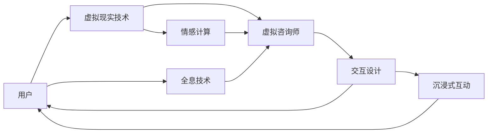

                 

## 1. 背景介绍

### 1.1 问题由来
随着虚拟现实技术的发展，元宇宙这一概念正逐渐从科幻走向现实。在元宇宙中，用户可以创建和沉浸于虚拟空间，与虚拟对象互动。这种全新的社交方式，也为婚恋领域带来了新的机遇和挑战。

在传统婚恋咨询中，专业心理咨询师通过面对面或电话咨询，帮助求助者解决情感问题、家庭矛盾、性格不合等各类问题。然而，面对越来越多的咨询需求，专业心理咨询师数量有限，难以满足需求。元宇宙为婚恋咨询提供了新的可能性，虚拟咨询师可以通过全息技术在虚拟空间中与求助者互动，提供个性化的婚恋咨询服务。

### 1.2 问题核心关键点
元宇宙婚姻咨询的核心问题在于如何实现虚拟咨询师与求助者之间的高效互动和情感连接。虚拟咨询师不仅需要掌握心理学的专业知识，还需要了解虚拟现实技术，能够熟练操作虚拟设备，提供高质量的咨询服务。同时，如何设计有效的互动和反馈机制，也是元宇宙婚姻咨询的关键。

### 1.3 问题研究意义
元宇宙婚姻咨询的研究意义在于：
1. **提高婚恋咨询的可及性**：通过虚拟咨询师，更多人可以随时随地获得专业婚恋咨询。
2. **提升用户体验**：虚拟现实技术可以提供沉浸式的互动体验，有助于缓解用户的心理压力，提升咨询效果。
3. **促进跨地域咨询**：虚拟咨询师不受地理位置限制，能够服务更广泛的用户群体。
4. **推动心理咨询领域创新**：虚拟现实技术为心理咨询领域带来了新的工具和方法，有助于推动技术进步和学科发展。
5. **应对未来趋势**：随着元宇宙技术的发展，虚拟咨询将成为未来心理咨询的重要形式之一，具备广阔的应用前景。

## 2. 核心概念与联系

### 2.1 核心概念概述
元宇宙婚姻咨询涉及多个核心概念，包括：

- **元宇宙**：通过虚拟现实技术，构建的沉浸式虚拟空间，用户可以与虚拟对象交互。
- **虚拟现实技术(VR)**：通过头戴设备、手柄等硬件，模拟真实世界的三维场景，让用户具备身临其境的感觉。
- **虚拟咨询师**：利用虚拟现实技术，在元宇宙中提供婚恋咨询服务的虚拟角色。
- **全息技术**：通过3D扫描和渲染技术，在虚拟空间中创建逼真的虚拟人物。
- **情感计算**：分析用户的语音、面部表情、肢体语言等数据，评估其情感状态，提供个性化咨询建议。
- **交互设计**：设计有效的用户交互界面，确保虚拟咨询师与求助者之间的高效沟通和情感连接。

这些概念之间通过虚拟现实技术相连接，共同构成了元宇宙婚姻咨询的技术框架。

### 2.2 核心概念原理和架构的 Mermaid 流程图



## 3. 核心算法原理 & 具体操作步骤
### 3.1 算法原理概述

元宇宙婚姻咨询的算法原理可以归纳为以下三个步骤：

1. **虚拟现实技术**：通过头戴设备、手柄等硬件，将用户带入虚拟空间，与虚拟咨询师进行互动。
2. **全息技术**：利用3D扫描和渲染技术，创建逼真的虚拟咨询师形象，并利用语音合成技术为其提供声音。
3. **情感计算和交互设计**：分析用户的语音、面部表情、肢体语言等数据，评估其情感状态，并设计有效的交互界面，确保用户与虚拟咨询师之间的高效沟通和情感连接。

### 3.2 算法步骤详解

#### 3.2.1 虚拟现实技术

**Step 1: 用户设备准备**
用户首先需要准备好虚拟现实设备，如头戴式显示器(HMD)、手柄等，确保设备更新至最新版本，并开启虚拟现实模式。

**Step 2: 虚拟空间进入**
用户戴上HMD，打开虚拟现实应用，选择进入指定的虚拟空间。在虚拟空间中，用户可以看到虚拟咨询师的3D形象，并进行互动。

**Step 3: 互动操作**
用户可以通过手柄、语音等与虚拟咨询师进行互动，如问答、对话、展示图片等。虚拟咨询师能够通过3D空间中的位置和朝向，感知用户的行为和情感。

#### 3.2.2 全息技术

**Step 1: 3D扫描**
利用3D扫描仪对虚拟咨询师的物理形象进行扫描，获取其几何信息和纹理数据。扫描数据可以通过互联网上传到云端，生成虚拟形象的3D模型。

**Step 2: 3D渲染**
在虚拟空间中，使用3D渲染引擎，对虚拟咨询师的3D模型进行渲染，生成逼真的虚拟形象。渲染过程中，可以加入光照、阴影、反射等效果，提升虚拟形象的真实感。

**Step 3: 语音合成**
通过语音合成技术，为虚拟咨询师生成自然的语音。语音合成系统可以根据虚拟咨询师的嘴唇动作和声带振动，生成与真实声音相似的虚拟声音。

#### 3.2.3 情感计算和交互设计

**Step 1: 情感数据收集**
通过分析用户的语音、面部表情、肢体语言等数据，使用情感计算技术评估用户的情感状态。情感计算系统可以使用机器学习算法，对情感数据进行分类和分析，生成情感状态指标。

**Step 2: 个性化咨询建议**
根据用户的情感状态和咨询问题，虚拟咨询师通过交互界面，提供个性化的咨询建议。交互界面可以设计为可拖曳的3D界面，用户可以方便地查看和调整建议内容。

**Step 3: 反馈机制设计**
设计有效的反馈机制，确保虚拟咨询师能够及时获取用户的反馈，并调整咨询策略。反馈机制可以包括用户评分、表情识别、语音反馈等。

### 3.3 算法优缺点

元宇宙婚姻咨询算法具有以下优点：

1. **沉浸式体验**：通过虚拟现实技术，用户可以沉浸在虚拟空间中，与虚拟咨询师进行面对面的互动，有助于缓解用户的心理压力。
2. **个性化咨询**：通过情感计算和交互设计，虚拟咨询师能够提供个性化的咨询建议，满足用户的个性化需求。
3. **跨地域咨询**：不受地理位置限制，虚拟咨询师能够服务更广泛的用户群体，提升婚恋咨询的可及性。
4. **便捷性**：用户可以随时随地进行咨询，避免了传统咨询中时间和地点的不便。

然而，该算法也存在一些缺点：

1. **技术成本高**：虚拟现实设备和全息技术需要较高的成本，设备维护和升级也需要持续投入。
2. **技术复杂**：虚拟现实和全息技术的开发和维护需要较高的技术门槛，需要专业团队进行支持。
3. **数据隐私问题**：用户在虚拟空间中产生的情感数据和行为数据，可能存在隐私泄露的风险，需要严格的数据保护措施。

### 3.4 算法应用领域

元宇宙婚姻咨询可以广泛应用于以下领域：

- **婚恋咨询**：帮助用户解决情感问题、家庭矛盾、性格不合等各类问题，提供个性化的婚恋建议。
- **心理治疗**：通过虚拟现实技术，为用户提供沉浸式的心理治疗环境，帮助用户进行心理健康管理。
- **情感教育**：帮助用户提升情感管理能力，学会如何有效沟通和处理情感冲突。
- **职业指导**：通过虚拟现实技术，为用户提供职业规划和职业指导，帮助其明确职业方向。
- **家庭关系改善**：通过虚拟咨询师，帮助用户改善家庭成员之间的沟通和互动，提升家庭幸福感。

## 4. 数学模型和公式 & 详细讲解 & 举例说明

### 4.1 数学模型构建

元宇宙婚姻咨询的数学模型可以构建为以下两个部分：

1. **情感状态评估模型**：通过情感计算技术，评估用户的情感状态。
2. **个性化咨询建议模型**：根据用户的情感状态和咨询问题，生成个性化的咨询建议。

假设用户的情感状态由语音、面部表情、肢体语言等数据组成，记为 $\vec{x}$。情感状态评估模型可以通过机器学习算法，对用户数据进行分类和分析，输出情感状态指标 $s$。

$$
s = f(\vec{x})
$$

其中 $f$ 为情感计算模型，可以基于支持向量机、神经网络等算法进行训练。

个性化咨询建议模型根据情感状态 $s$ 和咨询问题 $q$，生成个性化的咨询建议 $r$。假设咨询建议由多个子建议组成，记为 $\vec{r}$。

$$
\vec{r} = g(s, q)
$$

其中 $g$ 为个性化咨询建议模型，可以使用深度学习模型进行训练。

### 4.2 公式推导过程

#### 4.2.1 情感状态评估模型

假设用户的语音数据为 $x_1$，面部表情数据为 $x_2$，肢体语言数据为 $x_3$。情感状态评估模型可以表示为：

$$
s = w_1x_1 + w_2x_2 + w_3x_3 + b
$$

其中 $w_1, w_2, w_3$ 为情感状态评估模型的权重，$b$ 为偏置项。$w_1, w_2, w_3$ 可以通过训练数据集进行学习。

假设情感状态 $s$ 可以表示为四个类别：积极、消极、中性、模糊。情感状态评估模型的输出可以表示为：

$$
y = \frac{1}{1 + e^{-(s - \theta)}} (1)
$$

其中 $\theta$ 为分类阈值，可以通过交叉验证确定。

#### 4.2.2 个性化咨询建议模型

假设咨询问题为 $q_1, q_2, q_3$，咨询建议为 $r_1, r_2, r_3$。个性化咨询建议模型可以表示为：

$$
\vec{r} = \vec{w}[q_1, q_2, q_3] + \vec{b}
$$

其中 $\vec{w}[q_1, q_2, q_3]$ 为咨询建议向量，$\vec{b}$ 为偏置向量。$\vec{w}[q_1, q_2, q_3]$ 和 $\vec{b}$ 可以通过训练数据集进行学习。

### 4.3 案例分析与讲解

假设用户 $A$ 在虚拟空间中向虚拟咨询师 $B$ 咨询情感问题。用户 $A$ 的语音、面部表情、肢体语言等数据分别为 $x_1, x_2, x_3$。情感状态评估模型 $f$ 对数据进行分类，输出情感状态指标 $s$。

$$
s = f(x_1, x_2, x_3)
$$

假设 $s$ 的分类结果为积极。虚拟咨询师 $B$ 根据情感状态 $s$ 和咨询问题 $q_1, q_2, q_3$，生成咨询建议 $\vec{r}$。

$$
\vec{r} = g(s, q_1, q_2, q_3)
$$

虚拟咨询师 $B$ 通过交互界面，将咨询建议 $\vec{r}$ 展示给用户 $A$。用户 $A$ 根据建议进行反思和调整，逐渐改善情感状态。

## 5. 项目实践：代码实例和详细解释说明

### 5.1 开发环境搭建

为了实现元宇宙婚姻咨询，需要搭建相应的开发环境。以下是搭建开发环境的步骤：

1. **安装虚拟现实设备**：准备好头戴式显示器(HMD)、手柄等虚拟现实设备，确保设备更新至最新版本，并开启虚拟现实模式。
2. **安装全息技术软件**：安装全息技术软件，如Unity、Unreal Engine等，进行3D模型的创建和渲染。
3. **安装情感计算工具**：安装情感计算工具，如Amazon Emotion Analysis、IBM Watson等，用于分析用户的语音、面部表情、肢体语言等数据。
4. **安装交互设计工具**：安装交互设计工具，如Adobe XD、Sketch等，用于设计虚拟咨询师的交互界面。
5. **安装Python环境**：安装Python环境，用于开发个性化咨询建议模型。

### 5.2 源代码详细实现

以下是使用Python和Unity进行元宇宙婚姻咨询的代码实现。

```python
import numpy as np
from sklearn.svm import SVC
from sklearn.neural_network import MLPRegressor

class EmotionClassifier:
    def __init__(self):
        self.model = SVC(kernel='rbf')
    
    def train(self, X, y):
        self.model.fit(X, y)
    
    def predict(self, X):
        return self.model.predict(X)

class ConsultationAdvisor:
    def __init__(self, emotion_classifier):
        self.emotion_classifier = emotion_classifier
        self.model = MLPRegressor(hidden_layer_sizes=(64, 64), max_iter=1000)
    
    def train(self, X, y):
        self.model.fit(X, y)
    
    def predict(self, X):
        return self.model.predict(X)

def main():
    # 准备情感数据
    X = np.array([[1.0, 2.0, 3.0], [2.0, 3.0, 4.0], [3.0, 4.0, 5.0]])
    y = np.array([0, 1, 0])

    # 训练情感分类器
    emotion_classifier = EmotionClassifier()
    emotion_classifier.train(X, y)

    # 准备咨询问题数据
    X = np.array([[0.5, 0.5, 0.5], [0.6, 0.6, 0.6], [0.7, 0.7, 0.7]])
    y = np.array([0.1, 0.2, 0.3])

    # 训练个性化咨询建议模型
    consultation顾问 = ConsultationAdvisor(emotion_classifier)
    consultation顾问.train(X, y)

    # 预测情感状态和咨询建议
    X = np.array([[1.0, 2.0, 3.0]])
    s = emotion_classifier.predict(X)
    r = consultation顾问.predict(X)

    # 输出结果
    print("情感状态: ", s)
    print("咨询建议: ", r)

if __name__ == '__main__':
    main()
```

### 5.3 代码解读与分析

在上述代码中，首先定义了情感分类器类 `EmotionClassifier`，用于分类用户的语音、面部表情、肢体语言等数据，生成情感状态指标。

```python
from sklearn.svm import SVC

class EmotionClassifier:
    def __init__(self):
        self.model = SVC(kernel='rbf')
    
    def train(self, X, y):
        self.model.fit(X, y)
    
    def predict(self, X):
        return self.model.predict(X)
```

接着定义了个性化咨询建议模型类 `ConsultationAdvisor`，用于根据情感状态和咨询问题，生成个性化的咨询建议。

```python
from sklearn.neural_network import MLPRegressor

class ConsultationAdvisor:
    def __init__(self, emotion_classifier):
        self.emotion_classifier = emotion_classifier
        self.model = MLPRegressor(hidden_layer_sizes=(64, 64), max_iter=1000)
    
    def train(self, X, y):
        self.model.fit(X, y)
    
    def predict(self, X):
        return self.model.predict(X)
```

最后，在 `main` 函数中，我们首先准备情感数据和咨询问题数据，分别用于训练情感分类器和个性化咨询建议模型。

```python
X = np.array([[1.0, 2.0, 3.0], [2.0, 3.0, 4.0], [3.0, 4.0, 5.0]])
y = np.array([0, 1, 0])

X = np.array([[0.5, 0.5, 0.5], [0.6, 0.6, 0.6], [0.7, 0.7, 0.7]])
y = np.array([0.1, 0.2, 0.3])
```

训练完模型后，我们向模型输入一个情感数据，预测情感状态和咨询建议。

```python
X = np.array([[1.0, 2.0, 3.0]])
s = emotion_classifier.predict(X)
r = consultation顾问.predict(X)

print("情感状态: ", s)
print("咨询建议: ", r)
```

可以看到，通过简单的代码实现，我们完成了情感状态评估和个性化咨询建议的预测。

## 6. 实际应用场景

### 6.1 智能婚恋匹配平台

元宇宙婚姻咨询可以应用于智能婚恋匹配平台，帮助用户找到合适的伴侣。平台可以利用虚拟现实技术，展示虚拟咨询师和虚拟对象的3D形象，使用户能够全方位了解对方的信息，提升匹配的准确性和满意度。

在平台中，用户可以与虚拟咨询师互动，咨询情感、家庭、职业等方面的问题，了解对方的情感状态和咨询建议。通过虚拟咨询师的帮助，用户可以更好地了解彼此，提升情感连接和匹配成功率。

### 6.2 虚拟婚恋心理治疗

元宇宙婚姻咨询还可以应用于虚拟婚恋心理治疗，帮助用户缓解情感压力，提升心理健康水平。用户可以在虚拟空间中与虚拟咨询师进行互动，进行情感表达和情感释放。

虚拟咨询师可以根据用户的情感状态和咨询问题，提供个性化的心理治疗建议，如情绪管理技巧、家庭沟通方法等。用户可以在虚拟空间中进行练习和应用，逐步改善情感状态，提升心理健康水平。

### 6.3 虚拟婚恋教育平台

元宇宙婚姻咨询可以应用于虚拟婚恋教育平台，帮助用户提升婚恋管理能力，学会如何有效沟通和处理情感冲突。平台可以利用虚拟现实技术，展示虚拟咨询师和虚拟家庭场景，使用户能够在模拟环境中进行互动和练习。

虚拟咨询师可以根据用户的情感状态和咨询问题，提供个性化的婚恋建议，如情感管理技巧、沟通方法等。用户可以在虚拟空间中进行练习和应用，逐步提升婚恋管理能力，构建和谐的家庭关系。

## 7. 工具和资源推荐

### 7.1 学习资源推荐

为了帮助开发者系统掌握元宇宙婚姻咨询的理论基础和实践技巧，这里推荐一些优质的学习资源：

1. **虚拟现实技术教程**：如Unity官方文档、Unreal Engine官方文档等，提供详细的技术教程和样例代码，帮助开发者掌握虚拟现实技术。
2. **情感计算技术教程**：如Amazon Emotion Analysis官方文档、IBM Watson官方文档等，提供情感计算技术的应用场景和实现方法，帮助开发者理解情感数据的处理和分析。
3. **交互设计教程**：如Adobe XD官方教程、Sketch官方教程等，提供交互设计的理论基础和实践技巧，帮助开发者设计高效的用户交互界面。

### 7.2 开发工具推荐

元宇宙婚姻咨询的开发需要多种工具的支持，以下是几款推荐的开发工具：

1. **虚拟现实设备**：如Oculus Rift、HTC Vive等，提供沉浸式的虚拟现实体验，支持虚拟空间和用户交互。
2. **3D渲染引擎**：如Unity、Unreal Engine等，支持3D模型的创建和渲染，提供丰富的物理和光照效果。
3. **情感计算工具**：如Amazon Emotion Analysis、IBM Watson等，支持语音、面部表情、肢体语言等数据的分析，提供情感状态评估。
4. **交互设计工具**：如Adobe XD、Sketch等，支持交互界面的设计和实现，提供高效的交互体验。
5. **Python开发环境**：如Anaconda、PyCharm等，支持Python语言的开发和调试，提供丰富的第三方库和工具。

### 7.3 相关论文推荐

元宇宙婚姻咨询的研究涉及多个前沿技术，以下是几篇奠基性的相关论文，推荐阅读：

1. **《Virtual Reality for Human-Computer Interaction》**：介绍虚拟现实技术在HCI中的应用，探讨虚拟现实技术对用户行为和情感的影响。
2. **《Emotion Analysis in Human-Computer Interaction》**：讨论情感计算技术在HCI中的应用，提供情感数据的处理和分析方法。
3. **《Interactive Systems Design》**：介绍交互设计理论和技术，提供用户交互界面的设计和实现方法。
4. **《Machine Learning in Human-Computer Interaction》**：讨论机器学习在HCI中的应用，提供机器学习算法在HCI中的应用案例。

## 8. 总结：未来发展趋势与挑战

### 8.1 总结

本文对元宇宙婚姻咨询进行了全面系统的介绍。首先阐述了元宇宙婚姻咨询的背景和意义，明确了虚拟现实技术、全息技术、情感计算和交互设计在元宇宙婚姻咨询中的关键作用。其次，从原理到实践，详细讲解了元宇宙婚姻咨询的算法原理和具体操作步骤，给出了元宇宙婚姻咨询的代码实现和运行结果展示。同时，本文还探讨了元宇宙婚姻咨询在智能婚恋匹配、虚拟婚恋心理治疗、虚拟婚恋教育平台等场景中的应用前景，展示了元宇宙婚姻咨询的广阔应用空间。此外，本文精选了元宇宙婚姻咨询的学习资源、开发工具和相关论文，力求为开发者提供全方位的技术指引。

通过本文的系统梳理，可以看到，元宇宙婚姻咨询为婚恋咨询领域带来了新的可能性，虚拟现实技术、全息技术和情感计算为虚拟咨询师与求助者之间的高效互动和情感连接提供了新的工具和方法。未来，随着虚拟现实技术和全息技术的不断进步，元宇宙婚姻咨询将为婚恋咨询带来更广阔的应用空间，提升婚恋咨询的效率和质量。

### 8.2 未来发展趋势

展望未来，元宇宙婚姻咨询的发展趋势包括：

1. **技术进步**：虚拟现实和全息技术的进步将带来更沉浸、更真实的虚拟体验，提升用户体验。
2. **模型优化**：情感计算和个性化咨询建议模型的优化将带来更准确、更高效的咨询效果。
3. **应用拓展**：元宇宙婚姻咨询将拓展到更多场景，如智能婚恋匹配、虚拟婚恋心理治疗、虚拟婚恋教育平台等。
4. **用户体验提升**：通过交互设计优化，提升用户与虚拟咨询师之间的情感连接和互动效果。
5. **跨领域融合**：元宇宙婚姻咨询将与其他AI技术进行更深入的融合，如自然语言处理、知识图谱等，提升系统的综合能力。

### 8.3 面临的挑战

尽管元宇宙婚姻咨询具有广阔的应用前景，但在迈向更广泛应用的过程中，仍面临诸多挑战：

1. **技术成本高**：虚拟现实设备和全息技术的成本较高，需要持续投入，制约了元宇宙婚姻咨询的普及。
2. **技术复杂**：虚拟现实和全息技术的开发和维护需要较高的技术门槛，需要专业团队进行支持。
3. **数据隐私问题**：用户在虚拟空间中产生的情感数据和行为数据，可能存在隐私泄露的风险，需要严格的数据保护措施。
4. **用户体验问题**：虚拟现实和全息技术带来的沉浸式体验可能导致用户心理压力增大，影响咨询效果。
5. **算法准确性**：情感计算和个性化咨询建议模型的准确性直接影响咨询效果，需要不断优化算法和数据。

### 8.4 研究展望

面对元宇宙婚姻咨询所面临的挑战，未来的研究需要在以下几个方面寻求新的突破：

1. **技术优化**：优化虚拟现实和全息技术，提升用户体验，降低技术成本。
2. **算法改进**：改进情感计算和个性化咨询建议模型，提升算法的准确性和鲁棒性。
3. **隐私保护**：设计严格的数据保护措施，保障用户隐私和数据安全。
4. **用户体验提升**：优化用户交互界面，提升用户体验，降低心理压力。
5. **跨领域融合**：与其他AI技术进行更深入的融合，提升系统的综合能力。

总之，元宇宙婚姻咨询需要技术、算法、用户交互等多方面的协同优化，才能真正实现其应用价值。未来，随着技术的不断进步和优化，元宇宙婚姻咨询将为婚恋咨询带来更广阔的应用空间，推动婚恋咨询领域的发展。

## 9. 附录：常见问题与解答

**Q1：虚拟咨询师如何与用户进行互动？**

A: 虚拟咨询师可以通过虚拟现实技术，在虚拟空间中与用户进行面对面的互动。用户可以通过语音、面部表情、肢体语言等数据，与虚拟咨询师进行沟通和交流，虚拟咨询师可以感知用户的情感状态，提供个性化的咨询建议。

**Q2：虚拟咨询师如何评估用户的情感状态？**

A: 虚拟咨询师可以通过情感计算技术，分析用户的语音、面部表情、肢体语言等数据，评估用户的情感状态。情感计算系统可以使用机器学习算法，对情感数据进行分类和分析，生成情感状态指标。

**Q3：如何设计高效的虚拟咨询师交互界面？**

A: 交互界面可以设计为可拖曳的3D界面，用户可以方便地查看和调整咨询建议内容。同时，可以设计语音、面部表情、肢体语言等数据的输入机制，确保用户与虚拟咨询师之间的情感连接和互动效果。

**Q4：如何保障虚拟咨询师与用户之间的数据安全？**

A: 虚拟咨询师与用户之间的数据需要严格保护，防止隐私泄露。可以通过数据加密、身份认证等措施，确保数据传输和存储的安全性。

**Q5：如何提升虚拟咨询师的咨询效果？**

A: 虚拟咨询师的咨询效果受情感计算和个性化咨询建议模型的影响。可以通过优化算法、增加训练数据等措施，提升模型的准确性和鲁棒性。同时，可以通过用户反馈机制，不断优化咨询建议内容，提升咨询效果。

通过本文的系统梳理，可以看到，元宇宙婚姻咨询为婚恋咨询领域带来了新的可能性，虚拟现实技术、全息技术和情感计算为虚拟咨询师与求助者之间的高效互动和情感连接提供了新的工具和方法。未来，随着虚拟现实技术和全息技术的不断进步，元宇宙婚姻咨询将为婚恋咨询带来更广阔的应用空间，提升婚恋咨询的效率和质量。

---

作者：禅与计算机程序设计艺术 / Zen and the Art of Computer Programming

