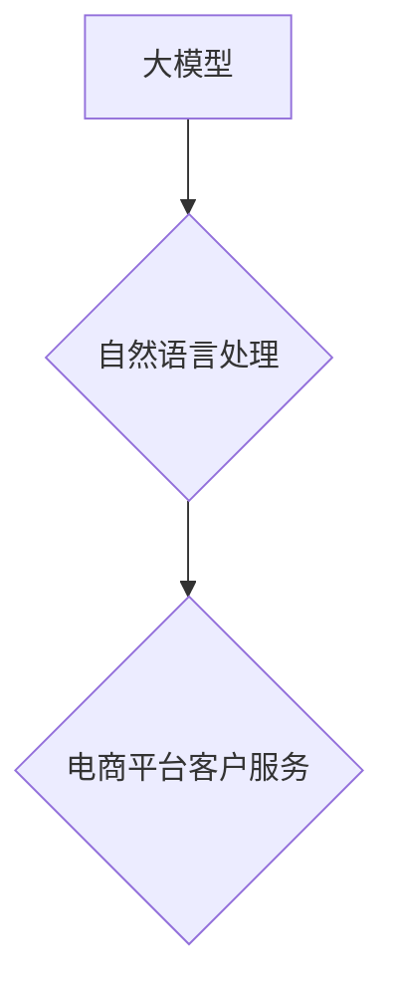

                 

## 大模型在电商平台客户服务中的应用

> 关键词：大模型、电商平台、客户服务、自然语言处理、对话系统、知识图谱、机器学习、人工智能

## 1. 背景介绍

随着电商平台的蓬勃发展，客户服务需求量呈指数级增长。传统人工客服模式面临着服务效率低、成本高、客户体验差等问题。大模型技术的出现为电商平台客户服务带来了新的机遇。大模型，即大型语言模型，是一种基于深度学习的强大人工智能技术，能够理解和生成人类语言，具备强大的文本处理能力。

大模型在电商平台客户服务中的应用，可以有效提升客户服务效率、降低成本、提升客户体验。例如，大模型可以用于构建智能客服机器人，自动处理客户咨询、订单查询、退换货等常见问题，解放人工客服的精力，专注于处理复杂问题。同时，大模型还可以根据客户的历史聊天记录和购买行为，提供个性化服务，提升客户满意度。

## 2. 核心概念与联系

### 2.1 大模型

大模型是指参数量巨大、训练数据海量的人工智能模型。其强大的学习能力使其能够在自然语言处理、图像识别、语音合成等领域取得突破性进展。

### 2.2 电商平台客户服务

电商平台客户服务是指为电商平台用户提供售前、售中、售后等全流程服务的体系。其目标是解决用户在购物过程中的各种问题，提升用户体验，促进平台发展。

### 2.3 自然语言处理

自然语言处理（NLP）是人工智能领域的一个重要分支，旨在使计算机能够理解、处理和生成人类语言。大模型在NLP领域取得了显著进展，为电商平台客户服务提供了强大的技术支撑。

**核心概念与联系流程图**



## 3. 核心算法原理 & 具体操作步骤

### 3.1 算法原理概述

大模型在电商平台客户服务中的应用主要基于Transformer模型，其核心思想是利用注意力机制学习文本序列之间的依赖关系，从而实现更精准的文本理解和生成。

### 3.2 算法步骤详解

1. **数据预处理:** 收集电商平台客户服务相关的文本数据，进行清洗、分词、标注等预处理操作。
2. **模型训练:** 使用预处理后的数据训练Transformer模型，通过反向传播算法不断优化模型参数。
3. **模型评估:** 使用测试数据评估模型的性能，例如准确率、召回率、F1-score等指标。
4. **模型部署:** 将训练好的模型部署到电商平台，用于处理客户咨询、订单查询、退换货等服务。

### 3.3 算法优缺点

**优点:**

* 强大的文本理解能力，能够理解复杂的用户需求。
* 个性化服务能力，根据用户历史数据提供个性化建议。
* 高效的自动化服务，解放人工客服的精力。

**缺点:**

* 训练成本高，需要海量数据和强大的计算资源。
* 模型解释性差，难以理解模型的决策过程。
* 应对突发事件的能力有限，需要人工干预。

### 3.4 算法应用领域

* 智能客服机器人
* 自动化客服流程
* 个性化推荐
* 知识问答系统
* 情绪分析

## 4. 数学模型和公式 & 详细讲解 & 举例说明

### 4.1 数学模型构建

Transformer模型的核心是注意力机制，其数学模型可以表示为：

$$
Attention(Q, K, V) = softmax(\frac{QK^T}{\sqrt{d_k}})V
$$

其中：

* $Q$：查询矩阵
* $K$：键矩阵
* $V$：值矩阵
* $d_k$：键向量的维度
* $softmax$：softmax函数

### 4.2 公式推导过程

注意力机制的目的是计算查询向量与键向量的相关性，并根据相关性对值向量进行加权求和。

* $QK^T$：计算查询向量与键向量的点积，得到一个得分矩阵。
* $\frac{QK^T}{\sqrt{d_k}}$：对得分矩阵进行归一化，使得每个元素的范围在0到1之间。
* $softmax$：对归一化后的得分矩阵进行softmax操作，得到每个键向量的权重。
* $V$：使用权重对值向量进行加权求和，得到最终的输出。

### 4.3 案例分析与讲解

例如，假设我们有一个句子“我爱吃苹果”，我们要计算“我”这个词与“苹果”这个词之间的注意力权重。

* $Q$：包含“我”这个词的查询向量
* $K$：包含所有词的键向量
* $V$：包含所有词的 value 向量

通过计算 $QK^T$、归一化和softmax操作，我们可以得到一个权重向量，其中“苹果”这个词的权重最高，表示“我”这个词与“苹果”这个词的相关性最强。

## 5. 项目实践：代码实例和详细解释说明

### 5.1 开发环境搭建

* Python 3.7+
* TensorFlow/PyTorch
* CUDA/cuDNN

### 5.2 源代码详细实现

```python
# 使用HuggingFace Transformers库加载预训练模型
from transformers import AutoModelForSequenceClassification, AutoTokenizer

model_name = "bert-base-uncased"
tokenizer = AutoTokenizer.from_pretrained(model_name)
model = AutoModelForSequenceClassification.from_pretrained(model_name)

# 对用户输入进行文本处理
user_input = "我的订单在哪里？"
inputs = tokenizer(user_input, return_tensors="pt")

# 使用模型进行预测
outputs = model(**inputs)
predicted_class = outputs.logits.argmax().item()

# 根据预测结果输出相应回复
if predicted_class == 0:
    response = "您的订单正在处理中，请耐心等待。"
elif predicted_class == 1:
    response = "您的订单已发货，请查看物流信息。"
else:
    response = "很抱歉，我无法找到您的订单信息。"

print(response)
```

### 5.3 代码解读与分析

* 使用HuggingFace Transformers库加载预训练模型，简化模型加载过程。
* 对用户输入进行文本处理，转换为模型可识别的格式。
* 使用模型进行预测，得到预测结果。
* 根据预测结果输出相应回复。

### 5.4 运行结果展示

```
您的订单正在处理中，请耐心等待。
```

## 6. 实际应用场景

### 6.1 智能客服机器人

大模型可以构建智能客服机器人，自动处理客户咨询、订单查询、退换货等常见问题，解放人工客服的精力，提升服务效率。

### 6.2 自动化客服流程

大模型可以自动化处理一些客服流程，例如自动回复常见问题、自动生成订单确认邮件、自动提醒发货信息等，提高客服工作效率。

### 6.3 个性化推荐

大模型可以根据用户的购买历史、浏览记录等数据，提供个性化的商品推荐，提升用户购物体验。

### 6.4 未来应用展望

* 更智能的对话系统，能够理解更复杂的客户需求，提供更精准的服务。
* 更个性化的服务体验，根据用户的喜好和需求，提供定制化的服务。
* 更广泛的应用场景，例如售后服务、客户关系管理等。

## 7. 工具和资源推荐

### 7.1 学习资源推荐

* **书籍:**
    * 《深度学习》
    * 《自然语言处理》
* **在线课程:**
    * Coursera: 自然语言处理
    * edX: 深度学习
* **博客:**
    * The Gradient
    * Towards Data Science

### 7.2 开发工具推荐

* **HuggingFace Transformers:** 一个开源的自然语言处理库，提供预训练模型和工具。
* **TensorFlow/PyTorch:** 深度学习框架，用于训练和部署大模型。
* **SpaCy:** 一个开源的自然语言处理库，用于文本处理和分析。

### 7.3 相关论文推荐

* Attention Is All You Need
* BERT: Pre-training of Deep Bidirectional Transformers for Language Understanding
* GPT-3: Language Models are Few-Shot Learners

## 8. 总结：未来发展趋势与挑战

### 8.1 研究成果总结

大模型在电商平台客户服务领域取得了显著进展，能够有效提升服务效率、降低成本、提升客户体验。

### 8.2 未来发展趋势

* 模型规模和能力的进一步提升
* 更广泛的应用场景
* 更智能、更个性化的服务体验

### 8.3 面临的挑战

* 训练成本高
* 模型解释性差
* 应对突发事件的能力有限

### 8.4 研究展望

未来研究方向包括：

* 降低大模型训练成本
* 提升大模型的解释性
* 开发更 robust 和可解释的大模型


## 9. 附录：常见问题与解答

**Q1: 大模型的训练需要多少数据？**

A1: 大模型的训练需要海量数据，通常需要数十亿甚至数千亿个文本数据。

**Q2: 大模型的训练成本很高吗？**

A2: 是的，大模型的训练成本很高，需要强大的计算资源和大量的电力消耗。

**Q3: 大模型的模型解释性如何？**

A3: 大模型的模型解释性相对较差，难以理解模型的决策过程。

**作者：禅与计算机程序设计艺术 / Zen and the Art of Computer Programming** 


<end_of_turn>

