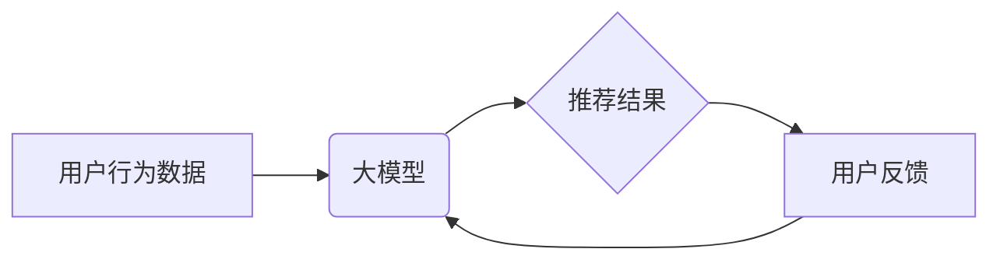

                 

## 大模型推荐中的用户体验提升新思路

> 关键词：大模型、推荐系统、用户体验、个性化、交互式、多模态、信任

### 1. 背景介绍

推荐系统作为连接用户和内容的重要桥梁，在信息爆炸的时代扮演着越来越重要的角色。随着大模型技术的蓬勃发展，大模型在推荐系统中的应用也日益广泛。大模型凭借其强大的语义理解和泛化能力，能够提供更精准、更个性化的推荐结果，提升用户体验。然而，现有的基于大模型的推荐系统仍然存在一些问题，例如推荐结果缺乏多样性、用户反馈机制不足、交互体验不够友好等。

### 2. 核心概念与联系

#### 2.1 大模型与推荐系统

大模型是指参数规模庞大、训练数据海量的人工智能模型，通常拥有数十亿甚至数千亿个参数。大模型在自然语言处理、计算机视觉等领域取得了突破性进展，其强大的语义理解和泛化能力使其成为推荐系统的重要驱动力。

推荐系统旨在根据用户的历史行为、偏好和上下文信息，预测用户对特定内容的兴趣，并提供个性化的推荐列表。大模型可以用于推荐系统的多个环节，例如：

* **用户画像构建:** 大模型可以分析用户的文本数据，例如评论、浏览记录、搜索历史等，构建更精准的用户画像。
* **内容理解:** 大模型可以理解内容的语义和主题，例如文章、视频、商品等，为推荐提供更丰富的语义信息。
* **推荐策略优化:** 大模型可以学习用户和内容之间的复杂关系，优化推荐策略，提高推荐准确率和多样性。

#### 2.2 用户体验提升

用户体验是指用户使用产品或服务时的感受和满意度。在推荐系统中，用户体验主要体现在以下几个方面：

* **推荐精准度:** 推荐结果与用户兴趣相符的程度。
* **推荐多样性:** 推荐结果涵盖不同类型的内容，避免单一化。
* **交互便捷性:** 用户操作推荐系统简单易用。
* **个性化程度:** 推荐结果根据用户的个性化需求进行定制。
* **信任度:** 用户对推荐系统的信任程度。

#### 2.3  核心架构



### 3. 核心算法原理 & 具体操作步骤

#### 3.1  算法原理概述

基于大模型的推荐系统通常采用深度学习算法，例如Transformer、BERT等。这些算法能够学习用户和内容之间的复杂关系，并生成更精准的推荐结果。

#### 3.2  算法步骤详解

1. **数据预处理:** 收集用户行为数据、内容特征数据，并进行清洗、转换、编码等预处理操作。
2. **模型训练:** 使用深度学习算法训练大模型，输入用户行为数据和内容特征数据，输出推荐结果。
3. **推荐结果生成:** 根据训练好的大模型，对新的用户请求进行预测，生成个性化的推荐列表。
4. **用户反馈收集:** 收集用户的点击、评分、评论等反馈信息，并将其反馈到模型训练中，不断优化推荐效果。

#### 3.3  算法优缺点

**优点:**

* **精准度高:** 大模型能够学习用户和内容之间的复杂关系，提高推荐精准度。
* **个性化强:** 大模型可以根据用户的个性化需求进行定制化推荐。
* **泛化能力强:** 大模型能够处理海量数据，并泛化到新的用户和内容。

**缺点:**

* **训练成本高:** 大模型参数规模庞大，训练成本较高。
* **解释性差:** 深度学习模型的内部机制复杂，难以解释推荐结果。
* **数据依赖性强:** 大模型的性能依赖于训练数据的质量和数量。

#### 3.4  算法应用领域

基于大模型的推荐系统广泛应用于以下领域:

* **电商推荐:** 推荐商品、优惠券、促销活动等。
* **内容推荐:** 推荐文章、视频、音乐、书籍等。
* **社交推荐:** 推荐好友、群组、话题等。
* **个性化教育:** 推荐学习资源、课程、辅导等。

### 4. 数学模型和公式 & 详细讲解 & 举例说明

#### 4.1  数学模型构建

基于大模型的推荐系统通常采用矩阵分解模型，例如协同过滤模型。协同过滤模型将用户和内容表示为低维向量，并通过计算用户向量和内容向量的内积来预测用户对内容的兴趣。

#### 4.2  公式推导过程

假设用户集合为U，内容集合为C，用户u对内容i的评分为r<sub>ui</sub>。协同过滤模型的目标是学习用户向量u和内容向量v，使得预测评分与实际评分尽可能接近。

损失函数：

$$
L = \sum_{u \in U, i \in C} (r_{ui} - \hat{r}_{ui})^2
$$

其中，$\hat{r}_{ui}$为预测评分，由用户向量u和内容向量v的内积计算得到：

$$
\hat{r}_{ui} = u^T v_i
$$

#### 4.3  案例分析与讲解

例如，假设用户A对电影A评分为5，对电影B评分为3，用户B对电影A评分为4，对电影B评分为2。我们可以使用协同过滤模型学习用户向量和电影向量，并预测用户A对电影B的评分。

通过训练模型，我们可以得到用户A和电影B的向量表示。然后，我们可以计算用户A和电影B向量的内积，得到预测评分。

### 5. 项目实践：代码实例和详细解释说明

#### 5.1  开发环境搭建

推荐系统开发环境通常包括以下软件：

* Python 3.x
* TensorFlow 或 PyTorch 等深度学习框架
* Scikit-learn 等机器学习库
* Jupyter Notebook 或 VS Code 等代码编辑器

#### 5.2  源代码详细实现

以下是一个使用TensorFlow构建简单协同过滤推荐系统的代码示例：

```python
import tensorflow as tf

# 定义用户和内容的embedding维度
embedding_dim = 64

# 创建用户和内容的embedding矩阵
user_embeddings = tf.Variable(tf.random.normal([num_users, embedding_dim]))
item_embeddings = tf.Variable(tf.random.normal([num_items, embedding_dim]))

# 计算用户和内容的内积
predictions = tf.matmul(user_embeddings, item_embeddings, transpose_b=True)

# 定义损失函数和优化器
loss_fn = tf.keras.losses.MeanSquaredError()
optimizer = tf.keras.optimizers.Adam()

# 训练模型
for epoch in range(num_epochs):
    for user, item, rating in train_data:
        with tf.GradientTape() as tape:
            predictions_for_user_item = predictions[user, item]
            loss = loss_fn(rating, predictions_for_user_item)
        gradients = tape.gradient(loss, [user_embeddings, item_embeddings])
        optimizer.apply_gradients(zip(gradients, [user_embeddings, item_embeddings]))

# 生成推荐结果
user_id = 1
recommended_items = tf.argsort(predictions[user_id, :])[::-1][:10]
```

#### 5.3  代码解读与分析

* 代码首先定义了用户和内容的embedding维度，并创建了用户和内容的embedding矩阵。
* 然后，代码计算了用户和内容的内积，得到预测评分。
* 接着，代码定义了损失函数和优化器，并训练了模型。
* 最后，代码根据用户的id生成推荐结果。

#### 5.4  运行结果展示

训练完成后，我们可以使用模型生成推荐结果，并评估推荐效果。

### 6. 实际应用场景

#### 6.1  电商推荐

基于大模型的推荐系统可以帮助电商平台推荐更精准、更个性化的商品，提高用户转化率。例如，阿里巴巴的淘宝平台使用大模型构建的推荐系统，可以根据用户的浏览历史、购买记录、兴趣标签等信息，推荐用户可能感兴趣的商品。

#### 6.2  内容推荐

基于大模型的推荐系统可以帮助内容平台推荐更相关的文章、视频、音乐等内容，提高用户粘性和参与度。例如，腾讯的微信平台使用大模型构建的推荐系统，可以根据用户的阅读习惯、关注公众号、朋友圈互动等信息，推荐用户可能感兴趣的内容。

#### 6.3  社交推荐

基于大模型的推荐系统可以帮助社交平台推荐更合适的社交关系，例如好友、群组、话题等，提高用户社交体验。例如，Facebook使用大模型构建的推荐系统，可以根据用户的兴趣爱好、好友关系、社交行为等信息，推荐用户可能感兴趣的朋友、群组和话题。

#### 6.4  未来应用展望

随着大模型技术的不断发展，基于大模型的推荐系统将在更多领域得到应用，例如个性化教育、医疗保健、金融服务等。

### 7. 工具和资源推荐

#### 7.1  学习资源推荐

* **书籍:**
    * 《深度学习》
    * 《自然语言处理》
    * 《推荐系统》
* **在线课程:**
    * Coursera: 深度学习
    * Udacity: 自然语言处理
    * edX: 推荐系统

#### 7.2  开发工具推荐

* **TensorFlow:** 开源深度学习框架
* **PyTorch:** 开源深度学习框架
* **Scikit-learn:** 机器学习库
* **Jupyter Notebook:** 代码编辑器

#### 7.3  相关论文推荐

* **BERT: Pre-training of Deep Bidirectional Transformers for Language Understanding**
* **Attention Is All You Need**
* **Collaborative Filtering for Implicit Feedback Datasets**

### 8. 总结：未来发展趋势与挑战

#### 8.1  研究成果总结

基于大模型的推荐系统取得了显著的成果，在推荐精准度、个性化程度、泛化能力等方面取得了突破。

#### 8.2  未来发展趋势

* **多模态推荐:** 将文本、图像、音频等多种模态信息融合到推荐系统中，提供更丰富的用户体验。
* **交互式推荐:** 允许用户与推荐系统进行交互，例如反馈喜好、提供评论等，不断优化推荐结果。
* **信任机制:** 建立用户对推荐系统的信任机制，例如透明化推荐算法、提供用户反馈渠道等。

#### 8.3  面临的挑战

* **数据隐私:** 大模型训练需要海量数据，如何保护用户隐私是一个重要的挑战。
* **算法解释性:** 深度学习模型的内部机制复杂，难以解释推荐结果，如何提高算法的透明度和可解释性是一个重要的研究方向。
* **公平性:** 如何避免推荐系统产生偏见，确保推荐结果公平公正是一个重要的伦理问题。

#### 8.4  研究展望

未来，基于大模型的推荐系统将朝着更智能、更个性化、更可解释的方向发展。研究者将继续探索新的算法、模型和技术，以解决推荐系统面临的挑战，并为用户提供更优质的体验。

### 9. 附录：常见问题与解答

#### 9.1  常见问题

* **大模型推荐系统与传统推荐系统的区别是什么？**

传统推荐系统通常采用基于规则或基于内容的算法，而大模型推荐系统则利用深度学习算法，能够学习用户和内容之间的复杂关系，提供更精准的推荐结果。

* **大模型推荐系统有哪些应用场景？**

大模型推荐系统广泛应用于电商推荐、内容推荐、社交推荐等领域。

* **如何评估大模型推荐系统的效果？**

常用的评估指标包括准确率、召回率、NDCG等。

* **大模型推荐系统有哪些挑战？**

大模型推荐系统面临的数据隐私、算法解释性、公平性等挑战。

#### 9.2  解答

* **大模型推荐系统与传统推荐系统的区别是什么？**

传统推荐系统通常采用基于规则或基于内容的算法，而大模型推荐系统则利用深度学习算法，能够学习用户和内容之间的复杂关系，提供更精准的推荐结果。

* **大模型推荐系统有哪些应用场景？**

大模型推荐系统广泛应用于电商推荐、内容推荐、社交推荐等领域。

* **如何评估大模型推荐系统的效果？**

常用的评估指标包括准确率、召回率、NDCG等。

* **大模型推荐系统有哪些挑战？**

大模型推荐系统面临的数据隐私、算法解释性、公平性等挑战。


作者：禅与计算机程序设计艺术 / Zen and the Art of Computer Programming 
<end_of_turn>

