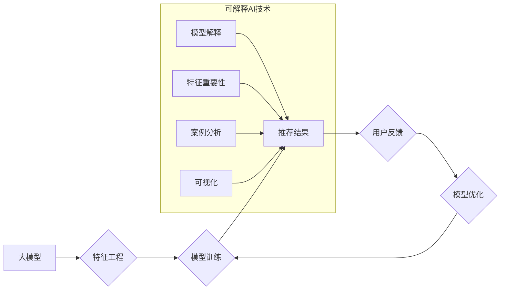

                 

## 大模型推荐系统的可解释AI技术

> 关键词：大模型、推荐系统、可解释AI、XAI、模型解释、推荐算法、用户行为

## 1. 背景介绍

推荐系统作为信息过滤和个性化服务的重要组成部分，在电商、社交媒体、视频平台等领域发挥着越来越重要的作用。随着大模型技术的快速发展，大模型驱动的推荐系统展现出强大的个性化推荐能力，能够精准地推荐用户感兴趣的内容。然而，大模型的复杂性和黑盒属性也带来了新的挑战，即如何解释模型的推荐决策，提升用户信任和理解。

可解释AI (XAI) 技术旨在提高人工智能模型的透明度和可理解性，帮助人类理解模型的决策过程。在推荐系统领域，XAI 技术可以帮助我们解释推荐结果背后的原因，识别影响推荐的因素，并发现潜在的偏见或错误。这对于提升用户体验、增强模型信任度、促进模型的公平性和可控性至关重要。

## 2. 核心概念与联系

### 2.1  大模型推荐系统

大模型推荐系统是指利用大规模训练数据和强大的计算能力训练出的深度学习模型来进行推荐。这些模型通常具有以下特点：

* **规模庞大:** 参数数量巨大，往往包含数十亿甚至千亿个参数。
* **学习能力强:** 可以学习到复杂的非线性关系，并进行精准的个性化推荐。
* **泛化能力强:** 在新的数据上也能表现出良好的推荐效果。

### 2.2  可解释AI (XAI)

可解释AI (XAI) 旨在提高人工智能模型的透明度和可理解性，帮助人类理解模型的决策过程。XAI 技术可以分为以下几类：

* **模型解释:** 分析模型内部结构和参数，解释模型的决策逻辑。
* **特征重要性:** 识别影响模型决策的关键特征，并量化其重要性。
* **案例分析:** 通过分析单个案例的推荐结果，解释模型的决策过程。
* **可视化:** 使用图表和图形等方式直观地展示模型的决策过程。

### 2.3  核心架构

大模型推荐系统与可解释AI 技术的结合，可以构建一个更加透明、可控的推荐系统。



## 3. 核心算法原理 & 具体操作步骤

### 3.1  算法原理概述

大模型推荐系统通常采用深度学习算法，例如Transformer、图神经网络等。这些算法可以学习到用户和物品之间的复杂关系，并进行精准的推荐。

可解释AI 技术可以应用于大模型推荐系统的各个环节，例如模型训练、特征工程、模型解释等。

### 3.2  算法步骤详解

1. **数据预处理:** 收集用户行为数据、物品信息等数据，并进行清洗、转换、特征工程等操作。
2. **模型训练:** 使用深度学习算法训练大模型，例如Transformer、图神经网络等。
3. **推荐结果生成:** 根据用户的历史行为和物品信息，利用训练好的大模型生成推荐结果。
4. **可解释AI 技术应用:**

* **模型解释:** 使用LIME、SHAP等方法解释模型的决策逻辑，识别影响推荐的关键特征。
* **特征重要性:** 使用特征重要性分析方法，例如Permutation Importance、SHAP值等，量化特征的重要性。
* **案例分析:** 通过分析单个案例的推荐结果，解释模型的决策过程。
* **可视化:** 使用图表和图形等方式直观地展示模型的决策过程。

5. **用户反馈:** 收集用户对推荐结果的反馈，并将其用于模型优化。

### 3.3  算法优缺点

**优点:**

* **精准推荐:** 大模型可以学习到复杂的非线性关系，进行精准的个性化推荐。
* **可解释性:** 可解释AI 技术可以提升模型的透明度和可理解性，帮助用户理解推荐结果背后的原因。
* **可控性:** 通过解释模型的决策逻辑，可以识别潜在的偏见或错误，并进行相应的调整。

**缺点:**

* **计算成本高:** 大模型的训练和推理需要大量的计算资源。
* **数据依赖性强:** 大模型的性能依赖于训练数据的质量和数量。
* **可解释性仍然有限:** 一些复杂的模型仍然难以完全解释。

### 3.4  算法应用领域

大模型推荐系统与可解释AI 技术的结合，在以下领域具有广泛的应用前景:

* **电商推荐:** 精准推荐商品，提升用户购买体验。
* **内容推荐:** 推荐个性化内容，例如新闻、视频、音乐等。
* **社交推荐:** 推荐好友、群组等，提升用户社交体验。
* **医疗推荐:** 推荐医疗服务、药品等，辅助医生诊断和治疗。

## 4. 数学模型和公式 & 详细讲解 & 举例说明

### 4.1  数学模型构建

大模型推荐系统通常采用矩阵分解模型，例如协同过滤模型、深度协同过滤模型等。

**协同过滤模型:**

假设用户-物品交互矩阵为R，其中R(u,i)表示用户u对物品i的评分。协同过滤模型的目标是学习用户和物品的潜在特征，并预测用户对物品的评分。

**深度协同过滤模型:**

深度协同过滤模型使用深度神经网络来学习用户和物品的潜在特征，并预测用户对物品的评分。

### 4.2  公式推导过程

**协同过滤模型的损失函数:**

$$
L = \sum_{u,i} (R(u,i) - \hat{R}(u,i))^2
$$

其中，R(u,i)是真实评分，$\hat{R}(u,i)$是模型预测的评分。

**深度协同过滤模型的损失函数:**

$$
L = \sum_{u,i} (R(u,i) - \hat{R}(u,i))^2 + \lambda ||\theta||^2
$$

其中，$\lambda$是正则化参数，$\theta$是模型参数。

### 4.3  案例分析与讲解

假设我们有一个用户-物品交互矩阵，其中用户对物品的评分范围为1-5。我们可以使用协同过滤模型或深度协同过滤模型来学习用户和物品的潜在特征，并预测用户对物品的评分。

例如，我们可以使用LIME方法解释模型对某个用户的推荐结果。LIME方法可以生成一个局部模型，该模型只包含对该用户推荐结果有重要影响的特征。通过分析局部模型，我们可以了解哪些特征影响了模型对该用户的推荐结果。

## 5. 项目实践：代码实例和详细解释说明

### 5.1  开发环境搭建

* Python 3.7+
* TensorFlow/PyTorch
* Jupyter Notebook

### 5.2  源代码详细实现

```python
# 导入必要的库
import tensorflow as tf

# 定义模型
class RecommenderModel(tf.keras.Model):
    def __init__(self, num_users, num_items, embedding_dim):
        super(RecommenderModel, self).__init__()
        self.user_embedding = tf.keras.layers.Embedding(num_users, embedding_dim)
        self.item_embedding = tf.keras.layers.Embedding(num_items, embedding_dim)

    def call(self, user_ids, item_ids):
        user_embeddings = self.user_embedding(user_ids)
        item_embeddings = self.item_embedding(item_ids)
        return tf.reduce_sum(user_embeddings * item_embeddings, axis=1)

# 构建模型
model = RecommenderModel(num_users=1000, num_items=10000, embedding_dim=64)

# 训练模型
model.compile(optimizer='adam', loss='mse')
model.fit(x=[user_ids, item_ids], y=ratings, epochs=10)

# 生成推荐结果
user_id = 123
item_ids = tf.range(1000)
predictions = model(user_id, item_ids)
top_k_items = tf.argsort(predictions)[-10:][::-1]
```

### 5.3  代码解读与分析

* 首先，我们定义了一个简单的推荐模型，该模型使用嵌入层来学习用户和物品的潜在特征。
* 然后，我们使用Adam优化器和均方误差损失函数训练模型。
* 最后，我们使用训练好的模型生成推荐结果，并选择评分最高的10个物品作为推荐结果。

### 5.4  运行结果展示

运行代码后，我们可以得到一个包含用户ID和推荐物品ID的列表。

## 6. 实际应用场景

### 6.1  电商推荐

大模型推荐系统可以根据用户的历史购买记录、浏览记录、收藏记录等信息，推荐用户可能感兴趣的商品。

### 6.2  内容推荐

大模型推荐系统可以根据用户的阅读习惯、观看历史、点赞记录等信息，推荐用户可能感兴趣的新闻、视频、音乐等内容。

### 6.3  社交推荐

大模型推荐系统可以根据用户的社交关系、兴趣爱好、行为模式等信息，推荐用户可能认识的朋友、加入的群组等。

### 6.4  未来应用展望

随着大模型技术的不断发展，大模型推荐系统将在更多领域得到应用，例如医疗推荐、教育推荐、金融推荐等。

## 7. 工具和资源推荐

### 7.1  学习资源推荐

* **书籍:**
    * Deep Learning by Ian Goodfellow, Yoshua Bengio, and Aaron Courville
    * Recommender Systems Handbook by  Koren, Y.
* **在线课程:**
    * Deep Learning Specialization by Andrew Ng (Coursera)
    * Machine Learning by Stanford University (Coursera)

### 7.2  开发工具推荐

* **TensorFlow:** https://www.tensorflow.org/
* **PyTorch:** https://pytorch.org/
* **Scikit-learn:** https://scikit-learn.org/stable/

### 7.3  相关论文推荐

* **Attention Is All You Need:** https://arxiv.org/abs/1706.03762
* **BERT: Pre-training of Deep Bidirectional Transformers for Language Understanding:** https://arxiv.org/abs/1810.04805
* **Explainable AI: Interpreting, Explaining and Visualizing Deep Learning** https://arxiv.org/abs/1806.09225

## 8. 总结：未来发展趋势与挑战

### 8.1  研究成果总结

大模型推荐系统与可解释AI 技术的结合，为提升推荐系统的精准度、透明度和可控性提供了新的思路和方法。

### 8.2  未来发展趋势

* **模型规模的进一步扩大:** 随着计算资源的不断提升，大模型的规模将进一步扩大，模型的学习能力和推荐效果将得到进一步提升。
* **可解释AI 技术的深入研究:** 研究更有效的可解释AI 技术，例如基于图神经网络的解释方法、基于强化学习的解释方法等。
* **多模态推荐:** 将文本、图像、音频等多模态数据融合到推荐系统中，提升推荐系统的丰富性和个性化程度。

### 8.3  面临的挑战

* **计算成本高:** 大模型的训练和推理需要大量的计算资源，这对于资源有限的机构或个人来说是一个挑战。
* **数据依赖性强:** 大模型的性能依赖于训练数据的质量和数量，高质量的训练数据是构建高性能大模型的关键。
* **可解释性仍然有限:** 一些复杂的模型仍然难以完全解释，如何更好地解释模型的决策逻辑是一个重要的研究方向。

### 8.4  研究展望

未来，大模型推荐系统与可解释AI 技术将继续深入发展，为用户提供更加精准、个性化、透明的推荐服务。


## 9. 附录：常见问题与解答

### 9.1  Q1: 如何评估大模型推荐系统的性能？

**A1:** 大模型推荐系统的性能通常使用以下指标进行评估:

* **准确率:** 推荐结果与用户真实行为的匹配程度。
* **召回率:** 推荐结果中包含用户真实感兴趣物品的比例。
* **NDCG:** Normalized Discounted Cumulative Gain，衡量推荐结果的排序质量。
* **CTR:** Click-Through Rate，衡量用户点击推荐结果的比例。

### 9.2  Q2: 如何解决大模型推荐系统中的数据稀疏性问题？

**A2:** 数据稀疏性是推荐系统中常见的问题，可以通过以下方法解决:

* **协同过滤:** 利用用户-物品交互矩阵的相似性进行推荐。
* **内容基 推荐:** 利用物品的特征进行推荐。
* **混合推荐:** 将协同过滤和内容基 推荐相结合。
* **冷启动问题:** 对于新用户和新物品，可以使用基于内容的推荐或其他启发式方法进行推荐。

### 9.3  Q3: 如何保证大模型推荐系统的公平性？

**A3:** 大模型推荐系统中的偏见可能导致不公平的推荐结果。可以通过以下方法保证推荐系统的公平性:

* **数据预处理:** 识别和处理数据中的偏见。
* **模型训练:** 使用公平性约束条件进行模型训练。
* **模型评估:** 使用公平性指标评估模型的性能。
* **用户反馈:** 收集用户反馈，并根据反馈进行模型调整。


作者：禅与计算机程序设计艺术 / Zen and the Art of Computer Programming 
<end_of_turn>

