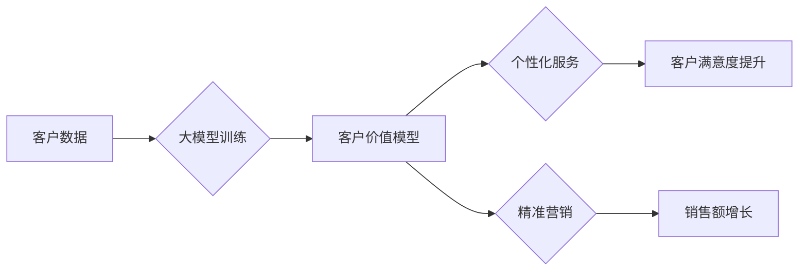

                 

## 大模型驱动的电商平台智能客户价值评估

> 关键词：大模型、客户价值评估、电商平台、人工智能、推荐系统、预测模型、数据分析

## 1. 背景介绍

在当今数据爆炸的时代，电商平台面临着日益激烈的竞争。如何精准识别和评估客户价值，从而制定有效的营销策略和个性化服务，成为电商平台发展的重要课题。传统的客户价值评估方法往往依赖于人工经验和有限的特征，难以捕捉客户行为的复杂性和动态性。

大模型技术的出现为电商平台智能客户价值评估提供了新的机遇。大模型凭借其强大的学习能力和泛化能力，能够从海量数据中挖掘出隐藏的模式和关系，从而更准确地预测客户的购买行为、忠诚度和潜在价值。

## 2. 核心概念与联系

### 2.1  客户价值评估

客户价值评估是指对客户在企业发展中所带来的价值进行量化和分析的过程。客户价值评估的目标是识别和区分不同价值的客户，以便企业能够制定针对性的营销策略和服务方案。

### 2.2  大模型

大模型是指参数规模庞大、训练数据海量的人工智能模型。大模型能够学习复杂的模式和关系，并应用于各种自然语言处理、计算机视觉、语音识别等领域。

### 2.3  电商平台

电商平台是指提供电子商务服务的在线平台，包括商品展示、交易、支付、物流等功能。电商平台需要对客户进行精准的价值评估，以便优化商品推荐、营销活动和客户服务。

**核心概念与架构流程图**



## 3. 核心算法原理 & 具体操作步骤

### 3.1  算法原理概述

大模型驱动的客户价值评估通常采用深度学习算法，例如多层感知机 (MLP)、卷积神经网络 (CNN) 和循环神经网络 (RNN)。这些算法能够从客户的历史购买记录、浏览行为、评价反馈等数据中学习出客户的特征和行为模式，并预测其未来的购买行为和价值。

### 3.2  算法步骤详解

1. **数据收集和预处理:** 收集客户的各种数据，包括购买记录、浏览历史、评价反馈、用户画像等。对数据进行清洗、转换和特征工程，以便于模型训练。
2. **模型选择和训练:** 选择合适的深度学习算法，并根据训练数据进行模型训练。训练过程中，模型会不断调整参数，以最小化预测误差。
3. **模型评估和优化:** 使用测试数据评估模型的性能，并根据评估结果进行模型优化。可以调整模型结构、超参数或训练数据，以提高模型的准确性和鲁棒性。
4. **模型部署和应用:** 将训练好的模型部署到电商平台，并将其应用于客户价值评估、个性化推荐、精准营销等场景。

### 3.3  算法优缺点

**优点:**

* 能够从海量数据中挖掘出隐藏的模式和关系，提高客户价值评估的准确性。
* 具有强大的泛化能力，能够适应不同的客户群体和业务场景。
* 可以不断学习和进化，随着数据量的增加，模型的性能会不断提升。

**缺点:**

* 需要大量的训练数据和计算资源。
* 模型训练过程复杂，需要专业的技术人员进行操作。
* 模型的解释性较差，难以理解模型的决策过程。

### 3.4  算法应用领域

大模型驱动的客户价值评估算法广泛应用于电商平台、金融机构、医疗机构等领域，用于：

* **客户分层:** 将客户根据其价值进行分层，以便制定针对性的营销策略。
* **精准营销:** 为不同价值的客户提供个性化的产品推荐和营销活动。
* **客户流失预测:** 预测客户流失的风险，并采取措施挽留客户。
* **客户关系管理:** 优化客户服务流程，提高客户满意度。

## 4. 数学模型和公式 & 详细讲解 & 举例说明

### 4.1  数学模型构建

客户价值评估模型通常采用回归模型或分类模型。回归模型用于预测客户的购买金额或价值，而分类模型用于将客户分为不同的价值等级。

**回归模型:**

假设客户的购买金额为 $y$，其特征向量为 $x = (x_1, x_2, ..., x_n)$，则回归模型可以表示为：

$$y = f(x; \theta)$$

其中，$f(x; \theta)$ 为回归函数，$\theta$ 为模型参数。

**分类模型:**

假设客户的价值等级为 $c$，其特征向量为 $x = (x_1, x_2, ..., x_n)$，则分类模型可以表示为：

$$p(c|x) = \frac{e^{z_c}}{ \sum_{k=1}^{K} e^{z_k}}$$

其中，$z_c = w_c^T x + b_c$ 为分类函数，$w_c$ 为权重向量，$b_c$ 为偏置项，$K$ 为客户价值等级的数量。

### 4.2  公式推导过程

回归模型的损失函数通常采用均方误差 (MSE)，其表达式为：

$$L(\theta) = \frac{1}{n} \sum_{i=1}^{n} (y_i - f(x_i; \theta))^2$$

分类模型的损失函数通常采用交叉熵损失 (Cross-Entropy Loss)，其表达式为：

$$L(\theta) = -\frac{1}{n} \sum_{i=1}^{n} \sum_{c=1}^{K} y_{ic} \log p(c|x_i)$$

其中，$y_{ic}$ 为真实标签，$p(c|x_i)$ 为模型预测的概率。

模型参数 $\theta$ 通过梯度下降算法进行优化，其目标是最小化损失函数。

### 4.3  案例分析与讲解

假设电商平台要评估客户的购买价值，可以使用回归模型预测客户的未来购买金额。

**特征:**

* 客户年龄
* 性别
* 购买频率
* 平均购买金额
* 浏览历史

**模型训练:**

使用历史购买数据训练回归模型，并选择合适的损失函数和优化算法。

**模型评估:**

使用测试数据评估模型的性能，例如使用均方根误差 (RMSE) 来衡量预测误差。

**模型应用:**

将训练好的模型应用于新客户的价值评估，并根据预测结果制定相应的营销策略。

## 5. 项目实践：代码实例和详细解释说明

### 5.1  开发环境搭建

* Python 3.7+
* TensorFlow 或 PyTorch
* Jupyter Notebook

### 5.2  源代码详细实现

```python
import tensorflow as tf

# 定义模型结构
model = tf.keras.Sequential([
    tf.keras.layers.Dense(64, activation='relu', input_shape=(5,)),
    tf.keras.layers.Dense(32, activation='relu'),
    tf.keras.layers.Dense(1)
])

# 编译模型
model.compile(optimizer='adam', loss='mse')

# 训练模型
model.fit(X_train, y_train, epochs=10)

# 评估模型
loss = model.evaluate(X_test, y_test)
print('Loss:', loss)

# 预测新客户的购买金额
new_customer_data = [[25, '男', 3, 100, [1, 2, 3, 4, 5]]]
prediction = model.predict(new_customer_data)
print('Prediction:', prediction)
```

### 5.3  代码解读与分析

* 代码首先定义了模型结构，包括输入层、隐藏层和输出层。
* 然后，模型被编译，指定了优化器、损失函数和评估指标。
* 接着，模型使用训练数据进行训练，并经过指定数量的 epochs。
* 训练完成后，模型的性能被评估，并使用测试数据计算损失值。
* 最后，模型用于预测新客户的购买金额。

### 5.4  运行结果展示

运行结果将显示模型的损失值和对新客户购买金额的预测值。

## 6. 实际应用场景

### 6.1  客户分层

根据客户价值评估结果，电商平台可以将客户分为不同的等级，例如 VIP 客户、普通客户和潜在客户。针对不同等级的客户，平台可以制定不同的营销策略和服务方案。

### 6.2  精准营销

电商平台可以根据客户的价值评估结果，为其推荐个性化的产品和服务。例如，高价值客户可以获得更优惠的价格和更优质的服务，而潜在客户可以获得更吸引人的促销活动和个性化推荐。

### 6.3  客户流失预测

通过分析客户的历史购买行为和价值评估结果，电商平台可以预测客户流失的风险。针对高风险客户，平台可以采取措施挽留客户，例如提供折扣优惠、个性化服务等。

### 6.4  未来应用展望

大模型驱动的客户价值评估技术在未来将得到更广泛的应用，例如：

* **个性化推荐:** 更精准的推荐系统，能够根据客户的兴趣和需求提供更个性化的产品和服务推荐。
* **精准广告投放:** 更精准的广告投放，能够将广告精准地投放到目标客户面前，提高广告效果。
* **客户关系管理:** 更智能的客户关系管理系统，能够自动识别客户的需求和问题，并提供更有效的解决方案。

## 7. 工具和资源推荐

### 7.1  学习资源推荐

* **书籍:**
    * 深度学习
    * 自然语言处理
* **在线课程:**
    * Coursera
    * edX
    * Udacity

### 7.2  开发工具推荐

* **TensorFlow:** 开源深度学习框架
* **PyTorch:** 开源深度学习框架
* **Jupyter Notebook:** 交互式编程环境

### 7.3  相关论文推荐

* BERT: Pre-training of Deep Bidirectional Transformers for Language Understanding
* GPT-3: Language Models are Few-Shot Learners
* Transformer: Attention Is All You Need

## 8. 总结：未来发展趋势与挑战

### 8.1  研究成果总结

大模型驱动的客户价值评估技术取得了显著的成果，能够从海量数据中挖掘出隐藏的模式和关系，提高客户价值评估的准确性和效率。

### 8.2  未来发展趋势

未来，大模型驱动的客户价值评估技术将朝着以下方向发展：

* **模型更加复杂和强大:** 随着计算资源的不断提升，大模型的规模和复杂度将不断提高，能够学习出更精细的客户特征和行为模式。
* **数据更加丰富和多样化:** 随着数据采集技术的进步，客户数据将更加丰富和多样化，为模型训练提供更充足的数据支持。
* **应用场景更加广泛:** 大模型驱动的客户价值评估技术将应用于更多场景，例如个性化推荐、精准营销、客户流失预测等。

### 8.3  面临的挑战

大模型驱动的客户价值评估技术也面临着一些挑战：

* **数据隐私和安全:** 大模型训练需要大量客户数据，如何保护客户数据隐私和安全是一个重要的挑战。
* **模型解释性和可信度:** 大模型的决策过程往往难以解释，如何提高模型的解释性和可信度是一个重要的研究方向。
* **模型公平性和偏见:** 大模型可能存在公平性和偏见问题，需要采取措施确保模型的公平性和公正性。

### 8.4  研究展望

未来，我们需要继续深入研究大模型驱动的客户价值评估技术，解决上述挑战，并将其应用于更多场景，为电商平台和客户创造更大的价值。

## 9. 附录：常见问题与解答

**Q1: 大模型驱动的客户价值评估技术与传统的客户价值评估方法相比有哪些优势？**

**A1:** 大模型驱动的客户价值评估技术能够从海量数据中挖掘出隐藏的模式和关系，提高客户价值评估的准确性和效率。传统的客户价值评估方法往往依赖于人工经验和有限的特征，难以捕捉客户行为的复杂性和动态性。

**Q2: 如何选择合适的模型和参数？**

**A2:** 选择合适的模型和参数需要根据具体业务场景和数据特点进行选择。可以参考相关文献和经验，并通过实验验证来确定最佳方案。

**Q3: 如何解决模型的解释性和可信度问题？**

**A3:** 

* 使用可解释性模型，例如线性模型或决策树。
* 使用模型解释技术，例如SHAP值或LIME。
* 结合专家经验和业务知识，对模型的决策过程进行解释和验证。

**Q4: 如何保护客户数据隐私和安全？**

**A4:** 

* 使用匿名化技术，对客户数据进行脱敏处理。
* 使用加密技术，保护客户数据的传输和存储安全。
* 遵守相关数据隐私法规，确保客户数据的合法使用。


作者：禅与计算机程序设计艺术 / Zen and the Art of Computer Programming 
<end_of_turn>

